# LangGraph-02-langgraph

## 模块概览

## 一、模块职责

langgraph是LangGraph框架的核心模块，提供图的构建、编译和执行能力。该模块实现了基于Pregel算法的消息传递执行引擎，支持构建复杂的有状态Agent工作流。

### 1.1 核心能力

1. **图构建（Graph Building）**
   - `StateGraph`：基于共享状态的图构建API
   - `MessageGraph`：专为消息列表优化的图API
   - 节点（Node）和边（Edge）的声明式定义

2. **图编译（Graph Compilation）**
   - 将高级图定义编译为底层Pregel执行图
   - 通道（Channel）分配和初始化
   - 节点触发器（Trigger）和订阅关系建立

3. **执行引擎（Execution Engine）**
   - Pregel：基于BSP（Bulk Synchronous Parallel）模型的执行引擎
   - 超级步（Super-step）调度和执行
   - 节点并行执行和状态聚合

4. **状态管理（State Management）**
   - 通道系统（Channels）：状态的容器和通信机制
   - Reducer函数：聚合多个节点对同一通道的写入
   - 版本控制：追踪通道的更新历史

5. **控制流（Control Flow）**
   - 条件边（Conditional Edge）：基于状态的动态路由
   - Send API：动态创建并行任务
   - 中断点（Interrupt）：人机协同的暂停点

6. **持久化集成（Persistence Integration）**
   - 检查点保存和恢复
   - 待处理写入（Pending Writes）管理
   - 状态快照和时间旅行

## 二、输入与输出

### 2.1 输入

**图构建阶段**

- `state_schema`：TypedDict或Pydantic模型，定义状态结构
- 节点函数：`Callable[[State], dict]`，接收状态返回更新
- 边定义：起始节点、目标节点、条件函数

**图执行阶段**

- `input`：初始输入数据，映射到START通道
- `config`：运行配置（thread_id、recursion_limit等）
- `context`：运行时上下文（如user_id、db_conn）

### 2.2 输出

**图编译结果**

- `CompiledStateGraph`：可执行的Runnable对象

**图执行结果**

- 同步：最终状态dict
- 流式：状态更新的迭代器
- 异步：Awaitable的结果或AsyncIterator

### 2.3 上下游依赖

**上游（依赖方）**

- `prebuilt`模块：使用StateGraph构建预制组件
- 用户代码：通过StateGraph API构建自定义图

**下游（被依赖）**

- `checkpoint`模块：用于状态持久化
- `langchain_core`：使用Runnable接口和类型

**内部依赖**

- `channels`：通道系统实现
- `pregel`：执行引擎实现
- `graph`：图构建API

## 三、模块架构

### 3.1 整体架构图

```mermaid
flowchart TB
    subgraph "API层"
        A1[StateGraph<br/>状态图API]
        A2[MessageGraph<br/>消息图API]
        A3[add_node<br/>添加节点]
        A4[add_edge<br/>添加边]
        A5[add_conditional_edge<br/>添加条件边]
    end
    
    subgraph "编译层"
        B1[compile()<br/>编译方法]
        B2[validate()<br/>图验证]
        B3[_get_channels()<br/>通道分配]
        B4[_get_nodes()<br/>节点转换]
        B5[CompiledStateGraph<br/>编译结果]
    end
    
    subgraph "执行层"
        C1[Pregel<br/>执行引擎]
        C2[PregelLoop<br/>主循环]
        C3[PregelNode<br/>节点容器]
        C4[PregelTask<br/>任务单元]
        C5[PregelExecutableTask<br/>可执行任务]
    end
    
    subgraph "通道层"
        D1[BaseChannel<br/>通道基类]
        D2[LastValue<br/>最后值通道]
        D3[Topic<br/>主题通道]
        D4[BinaryOperatorAggregate<br/>聚合通道]
        D5[EphemeralValue<br/>临时值通道]
    end
    
    subgraph "算法层"
        E1[prepare_next_tasks<br/>任务准备]
        E2[apply_writes<br/>写入应用]
        E3[create_checkpoint<br/>检查点创建]
        E4[should_interrupt<br/>中断判断]
    end
    
    A1 --> A3
    A1 --> A4
    A1 --> A5
    A2 --> A3
    A2 --> A4
    
    A1 --> B1
    A2 --> B1
    B1 --> B2
    B1 --> B3
    B1 --> B4
    B2 --> B5
    B3 --> B5
    B4 --> B5
    
    B5 -.contains.-> C1
    C1 --> C2
    C2 --> E1
    C2 --> E2
    C2 --> E3
    C2 --> E4
    
    E1 --> C3
    E1 --> C4
    E1 --> C5
    
    C1 --> D1
    D1 <|-- D2
    D1 <|-- D3
    D1 <|-- D4
    D1 <|-- D5
    
    C3 --> D1
    C5 --> C3
    E2 --> D1
    E3 --> D1
    
    style A1 fill:#e1f5ff
    style C1 fill:#ffe1e1
    style D1 fill:#fff4e1
    style E1 fill:#e1ffe1
```

### 3.2 架构说明

#### 3.2.1 图意概述

langgraph核心模块采用分层架构，从上至下分别是：API层、编译层、执行层、通道层和算法层。用户通过API层构建图，编译层将图转换为执行引擎可理解的格式，执行层负责实际运行，通道层管理状态，算法层实现核心调度逻辑。

#### 3.2.2 关键组件

**API层：StateGraph**

`StateGraph`是用户面向的主要API，提供声明式的图构建接口：

```python
class StateGraph(Generic[StateT, ContextT, InputT, OutputT]):
    """基于共享状态的图构建器"""
    
    def add_node(self, node: str, action: Callable) -> Self:
        """添加节点"""
        
    def add_edge(self, start: str, end: str) -> Self:
        """添加固定边"""
        
    def add_conditional_edge(
        self,
        source: str,
        path: Callable,
        path_map: dict[str, str] | None = None,
    ) -> Self:
        """添加条件边"""
        
    def compile(self, checkpointer: Checkpointer = None, ...) -> CompiledStateGraph:
        """编译为可执行图"""
```

**编译层：compile()**

编译过程将高级图定义转换为底层执行图：

1. **验证图结构**：检查节点引用、循环依赖等
2. **分配通道**：为状态的每个字段创建通道
3. **转换节点**：将节点函数包装为PregelNode
4. **建立触发关系**：根据边确定节点的触发器
5. **构建Pregel对象**：创建可执行的Pregel实例

**执行层：Pregel引擎**

Pregel实现了BSP（Bulk Synchronous Parallel）模型：

- **超级步（Super-step）**：一个完整的计算和通信周期
- **节点并行执行**：同一超级步内的节点并行运行
- **状态聚合**：使用reducer聚合多个写入
- **版本控制**：追踪通道的更新历史

**通道层：Channel系统**

通道是状态的容器，支持不同的更新语义：

- `LastValue`：保存最后一个值（覆盖更新）
- `Topic`：PubSub模式，支持多个值
- `BinaryOperatorAggregate`：使用二元运算符聚合
- `EphemeralValue`：临时值，执行完即清空

**算法层：核心调度逻辑**

- `prepare_next_tasks()`：确定下一步要执行的节点
- `apply_writes()`：将节点的写入应用到通道
- `create_checkpoint()`：创建状态快照
- `should_interrupt()`：判断是否应该中断

#### 3.2.3 边界与约束

**并发约束**

- 同一超级步内的节点可并行执行
- 节点读取的是超级步开始时的通道快照
- 节点的写入在超级步结束时统一应用

**递归限制**

- 默认最大递归深度：25（可配置）
- 超过限制抛出`GraphRecursionError`
- 通过`recursion_limit`参数调整

**顺序保证**

- 同一节点内的写入有序
- 不同节点的写入通过reducer聚合
- reducer应满足交换律和结合律（对于并行场景）

**状态不可变性**

- 节点接收的state是只读的
- 节点通过返回dict表达状态更新
- 更新通过reducer合并到状态中

#### 3.2.4 异常处理与回退

**节点执行异常**

- 支持重试策略（RetryPolicy）
- 异常会附加上下文信息（节点名、步数等）
- 成功节点的写入保存为pending_writes

**图结构异常**

- 编译时验证：未定义节点、孤立节点等
- 运行时验证：无效的Send目标等
- 提供清晰的错误消息和修复建议

**中断恢复**

- 通过检查点恢复到任意超级步
- 应用pending_writes，避免重复执行
- 支持修改状态后继续执行

#### 3.2.5 性能与容量

**图规模限制**

- 节点数量：理论上无限，实际建议<1000
- 通道数量：取决于状态schema的字段数
- 超级步数：受recursion_limit限制

**并行度**

- 同一超级步内的节点数
- 受ThreadPoolExecutor的max_workers限制
- 异步执行受asyncio并发限制

**内存占用**

- 每个超级步的检查点（如果启用）
- 通道值的总大小
- pending_writes的累积

**执行效率**

- 热路径：`prepare_next_tasks` -> 节点执行 -> `apply_writes`
- 瓶颈：节点执行时间（业务逻辑）
- 优化：节点缓存、增量计算、异步IO

#### 3.2.6 版本兼容与演进

**API稳定性**

- `StateGraph` API已稳定（v0.x -> v1.0）
- `MessageGraph` API已稳定
- Pregel直接使用属于高级用法，API可能变化

**功能演进**

- v0.1: 基础StateGraph
- v0.2: 添加MessageGraph
- v0.3: 添加Send API
- v0.4: 添加Runtime和context_schema
- v0.5: 添加Store和Cache支持
- v0.6: 添加Command API

**废弃策略**

- 废弃的API标记`@deprecated`
- 至少保留一个主版本的兼容期
- 提供迁移指南和工具

## 四、生命周期

### 4.1 图构建阶段

```python
from langgraph.graph import StateGraph, START, END
from typing_extensions import TypedDict

class State(TypedDict):
    messages: list
    step: int

# 创建图构建器
graph = StateGraph(State)

# 添加节点
graph.add_node("node1", node1_func)
graph.add_node("node2", node2_func)

# 添加边
graph.add_edge(START, "node1")
graph.add_conditional_edge("node1", should_continue, {
    "node2": "node2",
    END: END,
})
graph.add_edge("node2", END)
```

**步骤说明**：

1. 实例化`StateGraph`，传入状态schema
2. 使用`add_node`添加节点函数
3. 使用`add_edge`和`add_conditional_edge`定义控制流
4. 指定入口（START）和出口（END）

### 4.2 图编译阶段

```python
from langgraph.checkpoint.memory import InMemorySaver

# 编译图
checkpointer = InMemorySaver()
app = graph.compile(
    checkpointer=checkpointer,
    interrupt_before=["node2"],
    debug=True,
)
```

**编译流程**：

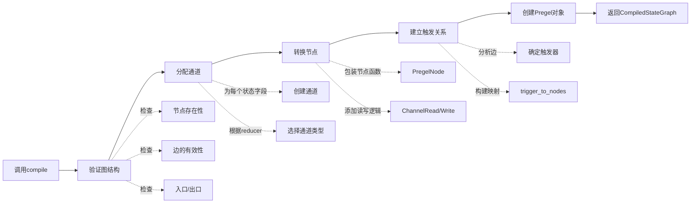

**编译产物**：

- `CompiledStateGraph`：实现Runnable接口
- 包含`Pregel`实例和元数据
- 可序列化（用于部署）

### 4.3 图执行阶段

```python
# 同步执行
config = {"configurable": {"thread_id": "thread-1"}}
result = app.invoke({"messages": ["Hello"]}, config)

# 流式执行
for chunk in app.stream({"messages": ["Hello"]}, config):
    print(chunk)

# 异步执行
import asyncio
result = await app.ainvoke({"messages": ["Hello"]}, config)
```

**执行流程（超级步循环）**：

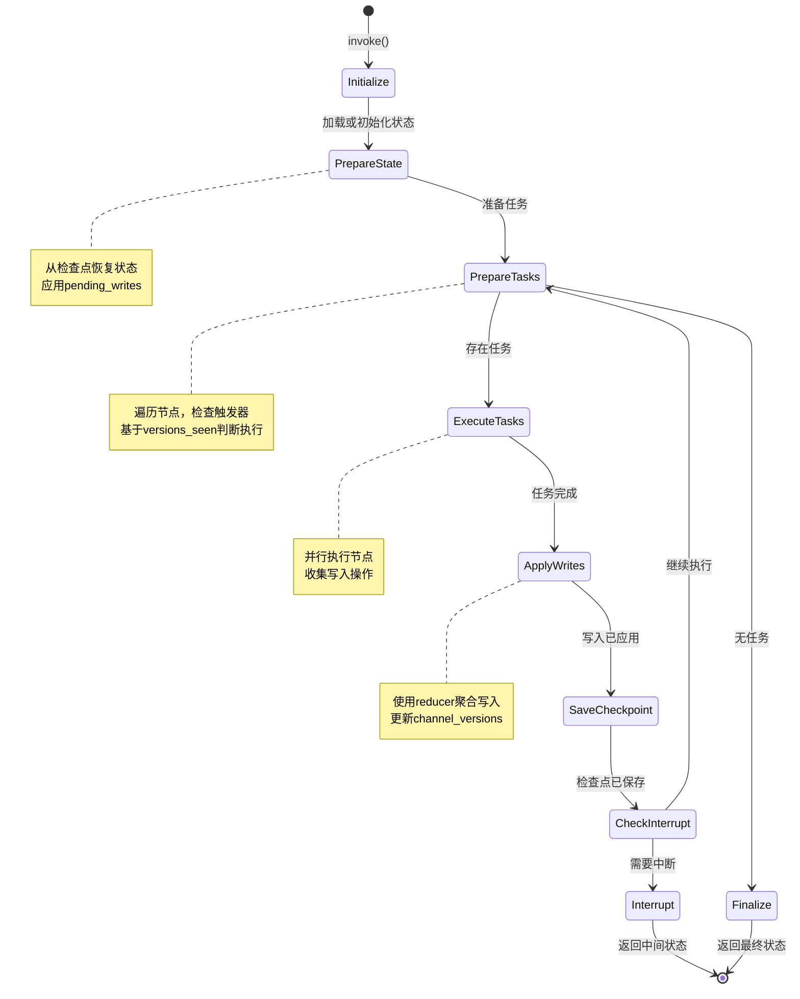

## 五、核心算法与流程

### 5.1 任务准备算法（prepare_next_tasks）

```python
def prepare_next_tasks(
    checkpoint: Checkpoint,
    pending_writes: list[PendingWrite],
    processes: Mapping[str, PregelNode],
    channels: Mapping[str, BaseChannel],
    managed: ManagedValueMapping,
    config: RunnableConfig,
    step: int,
    stop: int,
    for_execution: bool,
    trigger_to_nodes: Mapping[str, Sequence[str]] | None = None,
    updated_channels: set[str] | None = None,
) -> dict[str, PregelTask | PregelExecutableTask]:
    """
    准备下一个超级步的任务
    
    参数：
        checkpoint: 当前检查点
        pending_writes: 待处理的写入
        processes: 节点映射
        channels: 通道映射
        managed: 托管值映射
        config: 运行配置
        step: 当前步数
        stop: 最大步数
        for_execution: 是否为执行准备（vs 预览）
        trigger_to_nodes: 触发器到节点的映射（优化）
        updated_channels: 上次更新的通道集合（优化）
        
    返回：
        任务映射，键为任务ID
    """
    tasks: list[PregelTask | PregelExecutableTask] = []
    
    # 步骤1：处理PUSH任务（Send创建的动态任务）
    tasks_channel = channels.get(TASKS)
    if tasks_channel and tasks_channel.is_available():
        for idx, send in enumerate(tasks_channel.get()):
            task = prepare_single_task(
                (PUSH, idx),  # 任务ID
                None,  # 没有对应的process
                checkpoint,
                processes,
                channels,
                managed,
                config,
                step,
                stop,
                for_execution,
            )
            if task:
                tasks.append(task)
    
    # 步骤2：确定候选节点（优化）
    if updated_channels and trigger_to_nodes:
        # 只检查触发器在updated_channels中的节点
        triggered_nodes: set[str] = set()
        for channel in updated_channels:
            if node_ids := trigger_to_nodes.get(channel):
                triggered_nodes.update(node_ids)
        candidate_nodes = sorted(triggered_nodes)
    else:
        # 检查所有节点
        candidate_nodes = processes.keys()
    
    # 步骤3：遍历候选节点，检查是否应该执行
    for node_name in candidate_nodes:
        process = processes[node_name]
        node_seen = checkpoint["versions_seen"].get(node_name, {})
        
        # 检查触发器通道是否有新版本
        should_execute = False
        for trigger in process.triggers:
            current_version = checkpoint["channel_versions"].get(trigger)
            seen_version = node_seen.get(trigger)
            
            if current_version is not None:
                if seen_version is None or current_version > seen_version:
                    should_execute = True
                    break
        
        if should_execute:
            task = prepare_single_task(
                (PULL, node_name),  # 任务ID
                process,
                checkpoint,
                processes,
                channels,
                managed,
                config,
                step,
                stop,
                for_execution,
            )
            if task:
                tasks.append(task)
    
    # 步骤4：构建任务字典
    return {task.id: task for task in tasks}
```

**算法说明**：

- **时间复杂度**：O(P + N)，P为PUSH任务数，N为候选节点数
- **优化**：使用trigger_to_nodes和updated_channels减少候选节点数
- **并行性**：返回的所有任务可并行执行

### 5.2 写入应用算法（apply_writes）

```python
def apply_writes(
    checkpoint: Checkpoint,
    channels: Mapping[str, BaseChannel],
    tasks: Iterable[WritesProtocol],
    get_next_version: GetNextVersion,
) -> set[str]:
    """
    应用节点的写入到通道
    
    参数：
        checkpoint: 当前检查点
        channels: 通道映射
        tasks: 产生写入的任务列表
        get_next_version: 生成新版本号的函数
        
    返回：
        更新过的通道名称集合
    """
    # 步骤1：按通道分组收集写入
    pending_writes_by_channel: dict[str, list[Any]] = defaultdict(list)
    
    for task in tasks:
        for channel, value in task.writes:
            pending_writes_by_channel[channel].append(value)
    
    # 步骤2：应用写入到通道
    updated_channels: set[str] = set()
    
    for channel_name, writes in pending_writes_by_channel.items():
        channel = channels[channel_name]
        
        # 调用通道的update方法（使用reducer）
        if channel.update(writes):
            # 通道被更新，生成新版本号
            current_version = checkpoint["channel_versions"].get(channel_name)
            new_version = get_next_version(current_version, None)
            checkpoint["channel_versions"][channel_name] = new_version
            updated_channels.add(channel_name)
    
    # 步骤3：记录更新的通道（用于优化）
    checkpoint["updated_channels"] = list(updated_channels)
    
    return updated_channels
```

**算法说明**：

- **分组聚合**：先按通道分组，再批量更新
- **Reducer应用**：通道的`update`方法内部使用reducer
- **版本生成**：只为实际更新的通道生成新版本
- **时间复杂度**：O(W)，W为总写入数

### 5.3 中断判断算法（should_interrupt）

```python
def should_interrupt(
    checkpoint: Checkpoint,
    interrupt_nodes: All | Sequence[str],
    tasks: Iterable[PregelExecutableTask],
) -> list[PregelExecutableTask]:
    """
    判断是否应该中断执行
    
    参数：
        checkpoint: 当前检查点
        interrupt_nodes: 中断节点配置（"*"或节点列表）
        tasks: 待执行的任务列表
        
    返回：
        应该中断的任务列表（非空表示需要中断）
    """
    # 如果没有配置中断节点，不中断
    if not interrupt_nodes:
        return []
    
    # 获取上次中断时的通道版本
    seen = checkpoint["versions_seen"].get(INTERRUPT, {})
    
    # 检查每个任务
    interrupt_tasks = []
    for task in tasks:
        # 检查是否在中断节点列表中
        if interrupt_nodes == "*" or task.name in interrupt_nodes:
            # 检查触发器通道是否有新版本（自上次中断以来）
            for trigger in task.triggers:
                current_version = checkpoint["channel_versions"].get(trigger)
                seen_version = seen.get(trigger)
                
                if current_version is not None:
                    if seen_version is None or current_version > seen_version:
                        # 有新版本，需要中断
                        interrupt_tasks.append(task)
                        break
    
    # 更新INTERRUPT的versions_seen
    if interrupt_tasks:
        checkpoint["versions_seen"][INTERRUPT] = checkpoint["channel_versions"].copy()
    
    return interrupt_tasks
```

**算法说明**：

- **版本比较**：基于通道版本判断是否有新数据
- **中断粒度**：节点级别的中断
- **幂等性**：重复调用不会重复中断
- **配置灵活性**：支持"*"（全部节点）或特定节点列表

## 六、关键代码片段

### 6.1 StateGraph.compile实现

```python
def compile(
    self,
    checkpointer: Checkpointer = None,
    *,
    cache: BaseCache | None = None,
    store: BaseStore | None = None,
    interrupt_before: All | list[str] | None = None,
    interrupt_after: All | list[str] | None = None,
    debug: bool = False,
    name: str | None = None,
) -> CompiledStateGraph:
    """编译状态图为可执行对象"""
    
    # 步骤1：验证图结构
    self.validate(interrupt=...)
    
    # 步骤2：准备输出通道
    output_channels = self._get_output_channels()
    
    # 步骤3：分配通道
    channels = self._get_channels(checkpointer)
    
    # 步骤4：转换节点为PregelNode
    nodes = self._get_nodes()
    
    # 步骤5：构建触发器映射
    trigger_to_nodes = self._build_trigger_to_nodes()
    
    # 步骤6：创建Pregel实例
    pregel = Pregel(
        nodes=nodes,
        channels=channels,
        input_channels=self.input_schema or "__input__",
        output_channels=output_channels,
        stream_channels=output_channels,
        interrupt_before_nodes=interrupt_before,
        interrupt_after_nodes=interrupt_after,
        trigger_to_nodes=trigger_to_nodes,
        debug=debug,
        checkpointer=checkpointer,
        store=store,
        cache=cache,
    )
    
    # 步骤7：包装为CompiledStateGraph
    return CompiledStateGraph(
        pregel=pregel,
        builder=self,
        name=name or self.__class__.__name__,
        ...
    )
```

### 6.2 Pregel主循环（简化版）

```python
def _invoke(
    self,
    input: InputT,
    config: RunnableConfig,
    *,
    stream_mode: StreamMode = "values",
) -> Iterator[OutputT]:
    """Pregel执行的核心循环"""
    
    # 步骤1：初始化状态
    checkpoint_tuple = self.checkpointer.get_tuple(config) if self.checkpointer else None
    if checkpoint_tuple:
        checkpoint = checkpoint_tuple.checkpoint
        channels = channels_from_checkpoint(checkpoint, self.channels)
        step = checkpoint.metadata["step"] + 1
    else:
        checkpoint = empty_checkpoint()
        channels = {k: v.copy() for k, v in self.channels.items()}
        step = -1
    
    # 步骤2：写入输入
    if step == -1:
        map_input(self.input_channels, input, channels)
        checkpoint = create_checkpoint(checkpoint, channels, step)
        if self.checkpointer:
            self.checkpointer.put(config, checkpoint, {"source": "input", "step": -1})
        step = 0
    
    # 步骤3：主循环
    while step < config.get("recursion_limit", 25):
        # 3.1 准备任务
        tasks = prepare_next_tasks(
            checkpoint,
            pending_writes=[],
            processes=self.nodes,
            channels=channels,
            config=config,
            step=step,
            stop=config.get("recursion_limit", 25),
            for_execution=True,
            trigger_to_nodes=self.trigger_to_nodes,
            updated_channels=set(checkpoint.get("updated_channels", [])),
        )
        
        # 3.2 无任务则终止
        if not tasks:
            break
        
        # 3.3 检查中断
        if interrupt_tasks := should_interrupt(checkpoint, self.interrupt_before, tasks.values()):
            # 保存检查点并返回
            if self.checkpointer:
                self.checkpointer.put(config, checkpoint, {"source": "loop", "step": step})
            return
        
        # 3.4 执行任务（并行）
        with ThreadPoolExecutor() as executor:
            futures = {executor.submit(run_with_retry, task): task for task in tasks.values()}
            for future in as_completed(futures):
                task = futures[future]
                try:
                    future.result()  # 获取结果，可能抛异常
                except Exception as e:
                    # 保存成功任务的writes为pending_writes
                    successful_writes = [(t.name, w) for t in tasks.values() if t != task for w in t.writes]
                    if self.checkpointer:
                        self.checkpointer.put_writes(config, successful_writes, task.id)
                    raise
        
        # 3.5 应用写入
        updated_channels = apply_writes(
            checkpoint,
            channels,
            tasks.values(),
            self.checkpointer.get_next_version if self.checkpointer else lambda c, n: c + 1,
        )
        
        # 3.6 更新versions_seen
        for task in tasks.values():
            checkpoint["versions_seen"][task.name] = {
                ch: checkpoint["channel_versions"][ch]
                for ch in task.triggers
                if ch in checkpoint["channel_versions"]
            }
        
        # 3.7 保存检查点
        if self.checkpointer:
            checkpoint = create_checkpoint(checkpoint, channels, step)
            self.checkpointer.put(config, checkpoint, {"source": "loop", "step": step})
        
        # 3.8 Yield中间结果（如果流式）
        if stream_mode:
            yield read_channels(channels, self.output_channels)
        
        step += 1
    
    # 步骤4：返回最终结果
    return read_channels(channels, self.output_channels)
```

### 6.3 通道Update实现（LastValue）

```python
class LastValue(BaseChannel[Value, Value, Value]):
    """保存最后一个值的通道"""
    
    def __init__(self, typ: type):
        self.typ = typ
        self.value = MISSING  # 标记未初始化
    
    def update(self, values: Sequence[Value]) -> bool:
        """
        更新通道值
        
        参数：
            values: 写入值的序列
            
        返回：
            True如果通道被更新，False否则
        """
        if not values:
            return False
        
        # LastValue的reducer：取最后一个
        new_value = values[-1]
        
        # 检查是否实际变化
        if self.value is MISSING or self.value != new_value:
            self.value = new_value
            return True
        
        return False
    
    def get(self) -> Value:
        """获取当前值"""
        if self.value is MISSING:
            raise EmptyChannelError()
        return self.value
```

## 七、最佳实践

### 7.1 状态Schema设计

**推荐：使用TypedDict**

```python
from typing_extensions import TypedDict, Annotated
from langgraph.graph import add_messages

class State(TypedDict):
    messages: Annotated[list, add_messages]  # 带reducer
    user_id: str  # 不可变字段
    step: int  # 计数器
```

**推荐：使用Pydantic（需要验证）**

```python
from pydantic import BaseModel, Field

class State(BaseModel):
    messages: Annotated[list, add_messages] = Field(default_factory=list)
    user_id: str
    step: int = 0
```

**避免：过度嵌套**

```python
# 不推荐
class State(TypedDict):
    user: dict  # 嵌套dict
    session: dict
    context: dict
```

### 7.2 节点函数设计

**遵循单一职责原则**

```python
def fetch_data(state: State) -> dict:
    """只负责获取数据"""
    data = api_client.get(state["user_id"])
    return {"data": data}

def process_data(state: State) -> dict:
    """只负责处理数据"""
    result = process(state["data"])
    return {"result": result}

def save_result(state: State) -> dict:
    """只负责保存结果"""
    db.save(state["result"])
    return {"saved": True}
```

**节点函数签名**

```python
# 推荐：简单签名
def node(state: State) -> dict:
    return {"key": value}

# 高级：注入runtime
def node(state: State, runtime: Runtime[Context]) -> dict:
    user_id = runtime.context.user_id
    return {"key": value}
```

### 7.3 边的使用

**固定边：确定性转换**

```python
graph.add_edge("fetch", "process")
graph.add_edge("process", "save")
```

**条件边：基于状态的路由**

```python
def should_continue(state: State) -> str:
    if state["result"] is None:
        return "retry"
    elif state["result"]["success"]:
        return "save"
    else:
        return END

graph.add_conditional_edge("process", should_continue, {
    "retry": "fetch",
    "save": "save",
    END: END,
})
```

**Send API：动态并行**

```python
def fan_out(state: State) -> dict:
    items = state["items"]
    return {
        "__send__": [Send("process", {"item": item}) for item in items]
    }

graph.add_node("fan_out", fan_out)
graph.add_node("process", process_item)
```

### 7.4 中断与人工介入

**配置中断点**

```python
app = graph.compile(
    checkpointer=checkpointer,
    interrupt_before=["critical_node"],  # 执行前暂停
)
```

**查看和修改状态**

```python
# 执行到中断点
result = app.invoke(input, config)

# 查看当前状态
snapshot = app.get_state(config)
print(snapshot.values)
print(snapshot.next)  # 下一步将执行的节点

# 修改状态
app.update_state(config, {"approved": True})

# 继续执行
result = app.invoke(None, config)
```

### 7.5 调试技巧

**启用debug模式**

```python
app = graph.compile(debug=True)
```

**可视化图结构**

```python
from IPython.display import Image

Image(app.get_graph().draw_mermaid_png())
```

**追踪执行流程**

```python
for chunk in app.stream(input, config, stream_mode="debug"):
    print(f"Node: {chunk['type']}")
    print(f"  Input: {chunk['payload']['input']}")
    print(f"  Output: {chunk['payload']['output']}")
```

## 八、总结

langgraph核心模块通过Pregel执行引擎实现了强大的有状态Agent编排能力。其核心优势在于：

1. **简洁的API**：StateGraph提供声明式的图构建接口
2. **强大的执行模型**：基于BSP模型的并行执行和状态聚合
3. **灵活的控制流**：支持固定边、条件边和动态任务创建
4. **完善的持久化**：与checkpoint模块深度集成
5. **可观测性**：支持流式输出、debug模式和可视化

通过合理的设计和使用，可以构建出健壮、可维护、高性能的Agent系统。

---

## API接口

## 一、API概览

langgraph核心模块对外提供以下主要API：

| API类/方法 | 类型 | 功能描述 |
|-----------|------|---------|
| StateGraph | 类 | 状态图构建器 |
| MessageGraph | 类 | 消息图构建器（StateGraph的特化版本） |
| CompiledStateGraph | 类 | 编译后的可执行图 |
| add_messages | 函数 | 消息列表的reducer函数 |
| START | 常量 | 图的入口节点标识 |
| END | 常量 | 图的出口节点标识 |
| Send | 类 | 动态任务创建 |

## 二、StateGraph API

### 2.1 StateGraph.__init__

#### 基本信息

- **方法名称**: `__init__`
- **协议**: 构造函数
- **幂等性**: N/A

#### 请求结构体

```python
def __init__(
    self,
    state_schema: Type[StateT] | StateSchemaType,
    context_schema: Type[ContextT] | None = None,
    input_schema: Type[InputT] | None = None,
    output_schema: Type[OutputT] | None = None,
) -> None:
    pass
```

| 字段 | 类型 | 必填 | 默认值 | 约束 | 说明 |
|------|------|------|--------|------|------|
| state_schema | Type[StateT] \| StateSchemaType | 是 | 无 | TypedDict或Pydantic模型 | 状态的结构定义 |
| context_schema | Type[ContextT] \| None | 否 | None | 任意类型 | 运行时上下文的结构定义 |
| input_schema | Type[InputT] \| None | 否 | None | TypedDict或Pydantic模型 | 输入数据的结构定义 |
| output_schema | Type[OutputT] \| None | 否 | None | TypedDict或Pydantic模型 | 输出数据的结构定义 |

#### 响应结构体

返回`StateGraph`实例。

#### 入口函数与核心代码

```python
class StateGraph(Generic[StateT, ContextT, InputT, OutputT]):
    """状态图构建器"""
    
    def __init__(
        self,
        state_schema: Type[StateT] | StateSchemaType,
        context_schema: Type[ContextT] | None = None,
        input_schema: Type[InputT] | None = None,
        output_schema: Type[OutputT] | None = None,
    ) -> None:
        """
        初始化状态图构建器
        
        功能：

        1. 解析state_schema，提取字段和reducer
        2. 初始化节点和边的容器
        3. 设置输入输出schema
        
        参数：
            state_schema: 状态结构，支持TypedDict或Pydantic模型
            context_schema: 运行时上下文结构
            input_schema: 输入结构，默认与state_schema相同
            output_schema: 输出结构，默认与state_schema相同
        """
        # 1. 解析state_schema
        if is_typeddict(state_schema):
            # TypedDict: 使用get_type_hints提取字段
            self.schemas = {state_schema: get_type_hints(state_schema)}
        elif isinstance(state_schema, type) and issubclass(state_schema, BaseModel):
            # Pydantic: 使用model_fields提取字段
            self.schemas = {state_schema: state_schema.model_fields}
        else:
            # 其他类型
            self.schemas = {state_schema: {}}
        
        # 2. 提取reducer（从Annotated类型）
        self.channels = {}
        for key, field_type in self.schemas[state_schema].items():
            if get_origin(field_type) is Annotated:
                # Annotated[list, add_messages]
                args = get_args(field_type)
                base_type = args[0]
                reducer = args[1] if len(args) > 1 else None
            else:
                base_type = field_type
                reducer = None
            
            # 根据reducer选择通道类型
            if reducer:
                self.channels[key] = BinaryOperatorAggregate(base_type, reducer)
            else:
                self.channels[key] = LastValue(base_type)
        
        # 3. 初始化节点和边
        self.nodes: dict[str, StateNode] = {}
        self.edges: set[tuple[str, str]] = set()
        self.branches: dict[str, dict[str, BranchSpec]] = defaultdict(dict)
        
        # 4. 设置schema
        self.state_schema = state_schema
        self.context_schema = context_schema
        self.input_schema = input_schema or state_schema
        self.output_schema = output_schema or state_schema
        
        # 5. 设置入口和出口
        self._entry_point: str | None = None
        self._finish_points: set[str] = set()

```

**state_schema解析示例**：

```python
from typing_extensions import TypedDict, Annotated
from langgraph.graph import add_messages

# 示例1：TypedDict with reducer
class State(TypedDict):
    messages: Annotated[list, add_messages]  # 使用add_messages reducer
    counter: Annotated[int, operator.add]  # 使用operator.add reducer
    name: str  # 无reducer，使用LastValue

# 解析结果：
# channels = {
#     "messages": BinaryOperatorAggregate(list, add_messages),
#     "counter": BinaryOperatorAggregate(int, operator.add),
#     "name": LastValue(str),
# }

# 示例2：Pydantic模型
from pydantic import BaseModel

class State(BaseModel):
    messages: Annotated[list, add_messages] = []
    counter: int = 0
    name: str = ""
```

#### 调用链路

```
用户代码
  └─> StateGraph(State)
       └─> __init__()
            ├─> 解析state_schema
            │    ├─> is_typeddict() 或 issubclass(BaseModel)
            │    └─> get_type_hints() 或 model_fields
            ├─> 提取Annotated中的reducer
            │    ├─> get_origin() == Annotated
            │    └─> get_args()
            ├─> 创建通道
            │    ├─> BinaryOperatorAggregate (有reducer)
            │    └─> LastValue (无reducer)
            └─> 初始化容器（nodes, edges, branches）
```

#### 异常与性能

**异常情况**：

- `TypeError`: state_schema类型不支持
- `ValueError`: reducer函数签名不正确

**性能要点**：

- 时间复杂度：O(F)，F为state_schema的字段数
- 空间复杂度：O(F)
- 只在初始化时执行一次

---

### 2.2 add_node

#### 基本信息

- **方法名称**: `add_node`
- **协议**: 实例方法
- **幂等性**: 否（重复添加同名节点会覆盖）

#### 请求结构体

```python
def add_node(
    self,
    node: str,
    action: Callable[[StateT], dict] | Runnable,
) -> Self:
    pass
```

| 字段 | 类型 | 必填 | 约束 | 说明 |
|------|------|------|------|------|
| node | str | 是 | 非空字符串，不能是START/END | 节点名称，用于引用 |
| action | Callable \| Runnable | 是 | 必须接收State，返回dict | 节点的执行函数 |

#### 响应结构体

返回`Self`（支持链式调用）。

#### 入口函数与核心代码

```python
def add_node(
    self,
    node: str,
    action: Callable[[StateT], dict] | Runnable,
) -> Self:
    """
    添加节点到图
    
    功能：

    1. 验证节点名称
    2. 将action包装为StateNode
    3. 存储到nodes字典
    
    参数：
        node: 节点名称
        action: 节点函数，接收State，返回State的部分更新
        
    返回：
        Self，支持链式调用
        
    示例：
        graph.add_node("agent", agent_func)
              .add_node("tools", tool_func)
    """
    # 1. 验证节点名称
    if node in (START, END):
        raise ValueError(f"节点名称不能为 {START} 或 {END}")
    
    if not isinstance(node, str) or not node:
        raise ValueError("节点名称必须为非空字符串")
    
    # 2. 包装为StateNode
    if callable(action):
        # 普通函数：包装为RunnableCallable
        runnable = RunnableCallable(action, name=node)
    elif isinstance(action, Runnable):
        # 已经是Runnable
        runnable = action
    else:
        raise TypeError(f"action必须是Callable或Runnable，得到 {type(action)}")
    
    # 3. 创建StateNode
    state_node = StateNode(
        runnable=runnable,
        input=self.state_schema,
        output=dict,  # 节点返回dict类型
        metadata={"name": node},
    )
    
    # 4. 存储
    self.nodes[node] = state_node
    
    return self

```

**节点函数签名**：

```python
# 基础签名
def node_func(state: State) -> dict:
    """
    参数：
        state: 当前状态（只读）
        
    返回：
        dict: 状态的部分更新
    """
    return {"key": new_value}

# 高级签名：注入runtime
def node_func(state: State, runtime: Runtime[Context]) -> dict:
    """
    参数：
        state: 当前状态
        runtime: 运行时对象，包含context、store等
        
    返回：
        dict: 状态的部分更新
    """
    user_id = runtime.context.user_id
    return {"key": new_value}
```

#### 调用链路

```
用户代码
  └─> graph.add_node("agent", agent_func)
       └─> StateGraph.add_node()
            ├─> 验证节点名称
            ├─> 包装action为Runnable
            │    └─> RunnableCallable(action, name=node)
            ├─> 创建StateNode
            │    └─> StateNode(runnable, input, output, metadata)
            └─> 存储到self.nodes[node]
```

#### 异常与性能

**异常情况**：

- `ValueError`: 节点名称为START或END
- `ValueError`: 节点名称为空
- `TypeError`: action类型不支持

**性能要点**：

- 时间复杂度：O(1)
- 空间复杂度：O(1)

---

### 2.3 add_edge

#### 基本信息

- **方法名称**: `add_edge`
- **协议**: 实例方法
- **幂等性**: 是（重复添加相同边无影响）

#### 请求结构体

```python
def add_edge(self, start_key: str, end_key: str) -> Self:
    pass
```

| 字段 | 类型 | 必填 | 约束 | 说明 |
|------|------|------|------|------|
| start_key | str | 是 | 必须是已添加的节点或START | 起始节点 |
| end_key | str | 是 | 必须是已添加的节点或END | 目标节点 |

#### 响应结构体

返回`Self`（支持链式调用）。

#### 入口函数与核心代码

```python
def add_edge(self, start_key: str, end_key: str) -> Self:
    """
    添加固定边
    
    功能：

    1. 验证节点存在性
    2. 添加边到edges集合
    3. 如果start_key是START，设置为入口点
    4. 如果end_key是END，添加到finish_points
    
    参数：
        start_key: 起始节点名称（或START）
        end_key: 目标节点名称（或END）
        
    返回：
        Self，支持链式调用
    """
    # 1. 验证起始节点
    if start_key != START and start_key not in self.nodes:
        raise ValueError(f"起始节点 '{start_key}' 未定义")
    
    # 2. 验证目标节点
    if end_key != END and end_key not in self.nodes:
        raise ValueError(f"目标节点 '{end_key}' 未定义")
    
    # 3. 处理START
    if start_key == START:
        if self._entry_point is not None:
            raise ValueError(f"已设置入口点为 '{self._entry_point}'")
        self._entry_point = end_key
    
    # 4. 处理END
    if end_key == END:
        self._finish_points.add(start_key)
    
    # 5. 添加边
    self.edges.add((start_key, end_key))
    
    return self

```

**边的类型**：

```python
# 固定边：确定性转换
graph.add_edge(START, "node1")
graph.add_edge("node1", "node2")
graph.add_edge("node2", END)

# 形成线性流程：START -> node1 -> node2 -> END
```

#### 调用链路

```
用户代码
  └─> graph.add_edge("node1", "node2")
       └─> StateGraph.add_edge()
            ├─> 验证start_key存在
            ├─> 验证end_key存在
            ├─> 处理特殊节点（START/END）
            │    ├─> START: 设置_entry_point
            │    └─> END: 添加到_finish_points
            └─> 添加到self.edges集合
```

#### 异常与性能

**异常情况**：

- `ValueError`: 节点未定义
- `ValueError`: 重复设置入口点

**性能要点**：

- 时间复杂度：O(1)
- 空间复杂度：O(1)

---

### 2.4 add_conditional_edge

#### 基本信息

- **方法名称**: `add_conditional_edge`
- **协议**: 实例方法
- **幂等性**: 否（会覆盖已有的条件边）

#### 请求结构体

```python
def add_conditional_edge(
    self,
    source: str,
    path: Callable[[StateT], str] | Callable[[StateT], list[str]],
    path_map: dict[str, str] | None = None,
    then: str | None = None,
) -> Self:
    pass
```

| 字段 | 类型 | 必填 | 约束 | 说明 |
|------|------|------|------|------|
| source | str | 是 | 必须是已添加的节点或START | 源节点 |
| path | Callable | 是 | 接收State，返回str或list[str] | 路由函数 |
| path_map | dict[str, str] \| None | 否 | None | 路由值到节点名的映射 |
| then | str \| None | 否 | None | 所有分支汇聚后的下一个节点 |

#### 响应结构体

返回`Self`（支持链式调用）。

#### 入口函数与核心代码

```python
def add_conditional_edge(
    self,
    source: str,
    path: Callable[[StateT], str] | Callable[[StateT], list[str]],
    path_map: dict[str, str] | None = None,
    then: str | None = None,
) -> Self:
    """
    添加条件边
    
    功能：

    1. 验证源节点
    2. 包装path函数为Runnable
    3. 创建BranchSpec
    4. 存储到branches字典
    
    参数：
        source: 源节点名称
        path: 路由函数，接收State，返回目标节点名
        path_map: 路由值映射，将path返回值映射到实际节点名
        then: 汇聚节点，所有分支执行完后的下一步
        
    返回：
        Self，支持链式调用
        
    示例：
        def should_continue(state: State) -> str:
            if state["count"] > 10:
                return "end"
            return "continue"
        
        graph.add_conditional_edge(
            "process",
            should_continue,
            {
                "continue": "process",  # 循环
                "end": END,  # 结束
            }
        )
    """
    # 1. 验证源节点
    if source != START and source not in self.nodes:
        raise ValueError(f"源节点 '{source}' 未定义")
    
    # 2. 包装path函数
    if callable(path):
        path_runnable = RunnableCallable(path, name=f"{source}_router")
    else:
        raise TypeError("path必须是Callable")
    
    # 3. 验证path_map
    if path_map:
        for target in path_map.values():
            if target != END and target not in self.nodes:
                raise ValueError(f"目标节点 '{target}' 未定义")
    
    # 4. 验证then
    if then and then not in self.nodes and then != END:
        raise ValueError(f"汇聚节点 '{then}' 未定义")
    
    # 5. 创建BranchSpec
    branch_spec = BranchSpec(
        path=path_runnable,
        path_map=path_map or {},
        then=then,
    )
    
    # 6. 存储（每个源节点只能有一个条件边，但可以有多个分支）
    if source in self.branches and self.branches[source]:
        # 已有条件边，覆盖
        pass
    
    self.branches[source]["__default__"] = branch_spec
    
    return self

```

**路由函数类型**：

```python
# 类型1：返回单个目标
def route_single(state: State) -> str:
    if state["success"]:
        return "next_node"
    return END

# 类型2：返回多个目标（并行执行）
def route_multiple(state: State) -> list[str]:
    targets = []
    if state["need_process"]:
        targets.append("process")
    if state["need_save"]:
        targets.append("save")
    return targets

# 类型3：使用Send动态创建任务
def route_dynamic(state: State) -> dict:
    items = state["items"]
    return {
        "__send__": [Send("process", {"item": item}) for item in items]
    }
```

#### 调用链路

```
用户代码
  └─> graph.add_conditional_edge("node1", route_func, path_map)
       └─> StateGraph.add_conditional_edge()
            ├─> 验证source节点
            ├─> 包装path为Runnable
            │    └─> RunnableCallable(path, name="...")
            ├─> 验证path_map中的目标节点
            ├─> 验证then节点（如果提供）
            ├─> 创建BranchSpec
            │    └─> BranchSpec(path, path_map, then)
            └─> 存储到self.branches[source]
```

#### 异常与性能

**异常情况**：

- `ValueError`: 源节点未定义
- `ValueError`: path_map中的目标节点未定义
- `TypeError`: path不是Callable

**性能要点**：

- 时间复杂度：O(M)，M为path_map的大小
- 空间复杂度：O(M)

---

### 2.5 compile

#### 基本信息

- **方法名称**: `compile`
- **协议**: 实例方法
- **幂等性**: 是（多次编译结果相同）

#### 请求结构体

```python
def compile(
    self,
    checkpointer: Checkpointer = None,
    *,
    cache: BaseCache | None = None,
    store: BaseStore | None = None,
    interrupt_before: All | list[str] | None = None,
    interrupt_after: All | list[str] | None = None,
    debug: bool = False,
    name: str | None = None,
) -> CompiledStateGraph[StateT, ContextT, InputT, OutputT]:
    pass
```

| 字段 | 类型 | 必填 | 默认值 | 说明 |
|------|------|------|--------|------|
| checkpointer | Checkpointer | 否 | None | 检查点存储器，用于持久化 |
| cache | BaseCache \| None | 否 | None | 缓存实例，用于节点级缓存 |
| store | BaseStore \| None | 否 | None | 存储实例，用于跨线程数据 |
| interrupt_before | All \| list[str] \| None | 否 | None | 在指定节点前中断 |
| interrupt_after | All \| list[str] \| None | 否 | None | 在指定节点后中断 |
| debug | bool | 否 | False | 是否启用调试模式 |
| name | str \| None | 否 | None | 编译后图的名称 |

#### 响应结构体

返回`CompiledStateGraph`实例，实现Runnable接口。

#### 入口函数与核心代码

```python
def compile(
    self,
    checkpointer: Checkpointer = None,
    *,
    cache: BaseCache | None = None,
    store: BaseStore | None = None,
    interrupt_before: All | list[str] | None = None,
    interrupt_after: All | list[str] | None = None,
    debug: bool = False,
    name: str | None = None,
) -> CompiledStateGraph:
    """
    编译状态图为可执行对象
    
    功能：

    1. 验证图结构的完整性
    2. 为状态字段分配通道
    3. 转换节点为PregelNode
    4. 建立触发器关系
    5. 创建Pregel执行引擎
    6. 包装为CompiledStateGraph
    
    参数：
        checkpointer: 检查点存储器
        cache: 节点缓存
        store: 跨线程存储
        interrupt_before: 中断点（执行前）
        interrupt_after: 中断点（执行后）
        debug: 调试模式
        name: 图名称
        
    返回：
        CompiledStateGraph: 可执行的图对象
    """
    # 步骤1：验证图结构
    self.validate(
        interrupt=(
            (interrupt_before if interrupt_before != "*" else [])
            + (interrupt_after if interrupt_after != "*" else [])
        )
    )
    
    # 步骤2：准备输出通道
    output_channels = self._get_output_channels()
    
    # 步骤3：获取通道定义
    channels = self._get_channels(checkpointer)
    
    # 步骤4：转换节点为PregelNode
    compiled_nodes = {}
    for node_name, state_node in self.nodes.items():
        # 4.1 创建输入读取器
        input_reader = ChannelRead(
            channels=list(self.schemas[self.state_schema].keys()),
            fresh=False,
        )
        
        # 4.2 创建输出写入器
        output_writer = ChannelWrite(
            writes=[
                ChannelWriteEntry(ch)
                for ch in self.schemas[self.state_schema].keys()
            ],
            require_at_least_one_of=list(self.schemas[self.state_schema].keys()),
        )
        
        # 4.3 组装PregelNode
        compiled_nodes[node_name] = PregelNode(
            channels=list(self.schemas[self.state_schema].keys()),
            triggers=[],  # 稍后填充
            bound=RunnableSequence(
                input_reader,
                state_node.runnable,
                output_writer,
            ),
        )
    
    # 步骤5：建立触发器关系
    trigger_to_nodes = defaultdict(list)
    
    for start, end in self.edges:
        if end != END:
            # end节点被start的输出触发
            for channel in self._get_node_output_channels(start):
                trigger_to_nodes[channel].append(end)
                compiled_nodes[end].triggers.append(channel)
    
    for source, branches in self.branches.items():
        for branch_name, branch_spec in branches.items():
            if branch_spec.path_map:
                for target in branch_spec.path_map.values():
                    if target != END:
                        for channel in self._get_node_output_channels(source):
                            trigger_to_nodes[channel].append(target)
                            compiled_nodes[target].triggers.append(channel)
    
    # 步骤6：创建Pregel实例
    pregel = Pregel(
        nodes=compiled_nodes,
        channels=channels,
        input_channels=self.input_schema or "__input__",
        output_channels=output_channels,
        stream_channels=output_channels,
        interrupt_before_nodes=interrupt_before or [],
        interrupt_after_nodes=interrupt_after or [],
        trigger_to_nodes=dict(trigger_to_nodes),
        debug=debug,
        checkpointer=checkpointer,
        store=store,
        cache=cache,
    )
    
    # 步骤7：包装为CompiledStateGraph
    return CompiledStateGraph(
        pregel=pregel,
        builder=self,
        name=name or self.__class__.__name__,
        context_schema=self.context_schema,
    )

def validate(self, interrupt: list[str] | None = None) -> None:
    """
    验证图结构
    
    检查项：

    1. 必须有入口点（START边或set_entry_point）
    2. 必须有出口点（END边或set_finish_point）
    3. 所有节点都可达（从START出发）
    4. 没有孤立节点（无入边也无出边）
    5. 边引用的节点都已定义
    6. 中断点引用的节点都已定义
    """
    # 1. 检查入口点
    if self._entry_point is None:
        raise ValueError("必须通过 add_edge(START, ...) 或 set_entry_point(...) 设置入口点")
    
    # 2. 检查出口点
    if not self._finish_points:
        raise ValueError("必须通过 add_edge(..., END) 或 set_finish_point(...) 设置出口点")
    
    # 3. 检查可达性（BFS）
    visited = set()
    queue = deque([self._entry_point])
    
    while queue:
        node = queue.popleft()
        if node in visited or node == END:
            continue
        visited.add(node)
        
        # 添加固定边的目标
        for start, end in self.edges:
            if start == node and end not in visited:
                queue.append(end)
        
        # 添加条件边的目标
        if node in self.branches:
            for branch_spec in self.branches[node].values():
                if branch_spec.path_map:
                    for target in branch_spec.path_map.values():
                        if target != END and target not in visited:
                            queue.append(target)
    
    # 4. 检查孤立节点
    all_nodes = set(self.nodes.keys())
    unreachable = all_nodes - visited
    if unreachable:
        raise ValueError(f"以下节点不可达: {unreachable}")
    
    # 5. 检查中断点
    if interrupt:
        for node in interrupt:
            if node not in self.nodes:
                raise ValueError(f"中断点 '{node}' 未定义")

```

#### 调用链路

```
用户代码
  └─> app = graph.compile(checkpointer=...)
       └─> StateGraph.compile()
            ├─> validate()
            │    ├─> 检查入口点
            │    ├─> 检查出口点
            │    ├─> BFS检查可达性
            │    └─> 检查孤立节点
            ├─> _get_output_channels()
            ├─> _get_channels()
            │    └─> 为每个状态字段创建通道
            ├─> 转换节点
            │    └─> 为每个节点创建PregelNode
            │         ├─> ChannelRead（输入）
            │         ├─> 节点runnable（处理）
            │         └─> ChannelWrite（输出）
            ├─> 建立触发器关系
            │    └─> 分析边和分支，确定triggers
            ├─> 创建Pregel实例
            │    └─> Pregel(nodes, channels, ...)
            └─> 包装为CompiledStateGraph
                 └─> CompiledStateGraph(pregel, builder, ...)
```

#### 异常与性能

**异常情况**：

- `ValueError`: 图结构不完整（无入口/出口）
- `ValueError`: 存在不可达节点
- `ValueError`: 中断点节点未定义

**性能要点**：

- 时间复杂度：O(N + E)，N为节点数，E为边数
- 空间复杂度：O(N + E)
- 只在编译时执行一次，运行时不再验证

---

## 三、CompiledStateGraph API

### 3.1 invoke

#### 基本信息

- **方法名称**: `invoke`
- **协议**: 同步方法，实现Runnable接口
- **幂等性**: 否（有副作用：状态变化、检查点保存）

#### 请求结构体

```python
def invoke(
    self,
    input: InputT,
    config: RunnableConfig | None = None,
    **kwargs: Any,
) -> OutputT:
    pass
```

| 字段 | 类型 | 必填 | 说明 |
|------|------|------|------|
| input | InputT | 是 | 输入数据，类型由input_schema定义 |
| config | RunnableConfig \| None | 否 | 运行配置（thread_id、recursion_limit等） |
| context | ContextT \| None | 否（kwargs） | 运行时上下文 |

#### 响应结构体

返回`OutputT`，类型由output_schema定义，通常是State的全部或部分字段。

#### 入口函数与核心代码

```python
def invoke(
    self,
    input: InputT,
    config: RunnableConfig | None = None,
    **kwargs: Any,
) -> OutputT:
    """
    同步执行图
    
    功能：

    1. 合并config和kwargs
    2. 注入context（如果提供）
    3. 调用Pregel.invoke执行
    4. 返回最终状态
    
    参数：
        input: 初始输入
        config: 运行配置
        **kwargs: 可包含context等
        
    返回：
        最终状态（根据output_schema）
    """
    # 1. 准备config
    config = ensure_config(config)
    
    # 2. 处理context
    if "context" in kwargs:
        context = kwargs.pop("context")
        if self.context_schema:
            # 验证context类型
            if not isinstance(context, self.context_schema):
                raise TypeError(f"context必须是 {self.context_schema}")
        # 注入到config
        config = merge_configs(config, {"configurable": {"__context__": context}})
    
    # 3. 调用Pregel执行
    result = self.pregel.invoke(input, config, **kwargs)
    
    return result

```

#### 调用链路

```
用户代码
  └─> app.invoke({"messages": ["Hello"]}, config)
       └─> CompiledStateGraph.invoke()
            ├─> ensure_config()
            ├─> 处理context（如果有）
            └─> Pregel.invoke()
                 ├─> 初始化或恢复状态
                 ├─> 超级步循环
                 │    ├─> prepare_next_tasks()
                 │    ├─> 并行执行节点
                 │    ├─> apply_writes()
                 │    └─> 保存检查点
                 └─> 返回最终状态
```

---

### 3.2 stream

#### 基本信息

- **方法名称**: `stream`
- **协议**: 同步方法，返回迭代器
- **幂等性**: 否

#### 请求结构体

```python
def stream(
    self,
    input: InputT,
    config: RunnableConfig | None = None,
    *,
    stream_mode: StreamMode = "values",
    **kwargs: Any,
) -> Iterator[OutputT | tuple[str, OutputT]]:
    pass
```

| 字段 | 类型 | 必填 | 默认值 | 说明 |
|------|------|------|--------|------|
| input | InputT | 是 | - | 输入数据 |
| config | RunnableConfig \| None | 否 | None | 运行配置 |
| stream_mode | StreamMode | 否 | "values" | 流式模式：values/updates/debug |

**stream_mode选项**：

- `"values"`: 每个超级步后的完整状态
- `"updates"`: 每个节点的状态更新
- `"debug"`: 调试信息（节点输入输出、时间等）

#### 响应结构体

返回迭代器，每次yield一个输出。

#### 入口函数与核心代码

```python
def stream(
    self,
    input: InputT,
    config: RunnableConfig | None = None,
    *,
    stream_mode: StreamMode = "values",
    **kwargs: Any,
) -> Iterator[OutputT | tuple[str, OutputT]]:
    """
    流式执行图
    
    功能：

    1. 配置流式模式
    2. 调用Pregel.stream执行
    3. Yield中间和最终结果
    
    参数：
        input: 初始输入
        config: 运行配置
        stream_mode: 流式模式
        
    返回：
        迭代器，根据stream_mode返回不同格式
    """
    config = ensure_config(config)
    
    # 注入stream_mode到config
    config = merge_configs(config, {"configurable": {"__stream_mode__": stream_mode}})
    
    # 调用Pregel.stream
    for chunk in self.pregel.stream(input, config, stream_mode=stream_mode, **kwargs):
        yield chunk

```

**使用示例**：

```python
# 模式1：values - 完整状态
for state in app.stream(input, config, stream_mode="values"):
    print(f"Current state: {state}")

# 模式2：updates - 增量更新
for node_name, update in app.stream(input, config, stream_mode="updates"):
    print(f"Node {node_name} updated: {update}")

# 模式3：debug - 调试信息
for debug_info in app.stream(input, config, stream_mode="debug"):
    print(f"Type: {debug_info['type']}")
    print(f"Node: {debug_info['node']}")
    print(f"Input: {debug_info['payload']['input']}")
    print(f"Output: {debug_info['payload']['output']}")
```

---

### 3.3 get_state

#### 基本信息

- **方法名称**: `get_state`
- **协议**: 同步方法
- **幂等性**: 是

#### 请求结构体

```python
def get_state(
    self,
    config: RunnableConfig,
) -> StateSnapshot:
    pass
```

#### 响应结构体

```python
class StateSnapshot(NamedTuple):
    """状态快照"""
    values: dict  # 当前状态值
    next: tuple[str, ...]  # 下一步将执行的节点
    config: RunnableConfig  # 快照的配置
    metadata: CheckpointMetadata  # 元数据
    created_at: str | None  # 创建时间
    parent_config: RunnableConfig | None  # 父快照配置
    tasks: tuple[PregelTask, ...]  # 待执行任务
```

#### 入口函数与核心代码

```python
def get_state(self, config: RunnableConfig) -> StateSnapshot:
    """
    获取当前状态快照
    
    功能：

    1. 从检查点加载状态
    2. 准备下一步任务（不执行）
    3. 构建StateSnapshot返回
    
    参数：
        config: 配置（thread_id和可选的checkpoint_id）
        
    返回：
        StateSnapshot: 状态快照
    """
    # 1. 加载检查点
    checkpoint_tuple = self.checkpointer.get_tuple(config)
    if not checkpoint_tuple:
        return StateSnapshot(
            values={},
            next=(),
            config=config,
            metadata={},
            created_at=None,
            parent_config=None,
            tasks=(),
        )
    
    # 2. 恢复通道
    channels = channels_from_checkpoint(
        checkpoint_tuple.checkpoint,
        self.pregel.channels,
    )
    
    # 3. 准备下一步任务（预览，不执行）
    tasks = prepare_next_tasks(
        checkpoint_tuple.checkpoint,
        checkpoint_tuple.pending_writes or [],
        self.pregel.nodes,
        channels,
        config=config,
        step=checkpoint_tuple.metadata.get("step", 0) + 1,
        stop=config.get("recursion_limit", 25),
        for_execution=False,  # 不执行，只预览
    )
    
    # 4. 读取当前值
    values = read_channels(channels, self.pregel.output_channels)
    
    # 5. 构建快照
    return StateSnapshot(
        values=values,
        next=tuple(task.name for task in tasks.values()),
        config=checkpoint_tuple.config,
        metadata=checkpoint_tuple.metadata,
        created_at=checkpoint_tuple.checkpoint.get("ts"),
        parent_config=checkpoint_tuple.parent_config,
        tasks=tuple(tasks.values()),
    )

```

---

### 3.4 update_state

#### 基本信息

- **方法名称**: `update_state`
- **协议**: 同步方法
- **幂等性**: 否（修改状态）

#### 请求结构体

```python
def update_state(
    self,
    config: RunnableConfig,
    values: dict | Sequence[dict],
    as_node: str | None = None,
) -> RunnableConfig:
    pass
```

| 字段 | 类型 | 必填 | 说明 |
|------|------|------|------|
| config | RunnableConfig | 是 | 目标检查点配置 |
| values | dict \| Sequence[dict] | 是 | 要更新的值 |
| as_node | str \| None | 否 | 模拟为指定节点的更新 |

#### 响应结构体

返回`RunnableConfig`，包含新创建的checkpoint_id。

#### 入口函数与核心代码

```python
def update_state(
    self,
    config: RunnableConfig,
    values: dict | Sequence[dict],
    as_node: str | None = None,
) -> RunnableConfig:
    """
    手动更新状态
    
    功能：

    1. 加载当前检查点
    2. 应用更新到通道
    3. 创建新检查点（source="update"）
    4. 返回新配置
    
    参数：
        config: 目标配置
        values: 更新值，单个dict或列表
        as_node: 模拟节点更新（影响versions_seen）
        
    返回：
        新检查点的配置
    """
    # 1. 加载检查点
    checkpoint_tuple = self.checkpointer.get_tuple(config)
    if not checkpoint_tuple:
        raise ValueError("未找到检查点")
    
    # 2. 恢复通道
    channels = channels_from_checkpoint(
        checkpoint_tuple.checkpoint,
        self.pregel.channels,
    )
    
    # 3. 应用更新
    if not isinstance(values, list):
        values = [values]
    
    task = PregelTaskWrites(
        path=(),
        name=as_node or "__update__",
        writes=[(k, v) for update in values for k, v in update.items()],
        triggers=[],
    )
    
    updated_channels = apply_writes(
        checkpoint_tuple.checkpoint,
        channels,
        [task],
        self.checkpointer.get_next_version,
    )
    
    # 4. 更新versions_seen
    if as_node:
        checkpoint_tuple.checkpoint["versions_seen"][as_node] = {
            ch: checkpoint_tuple.checkpoint["channel_versions"][ch]
            for ch in updated_channels
        }
    
    # 5. 创建新检查点
    new_checkpoint = create_checkpoint(
        checkpoint_tuple.checkpoint,
        channels,
        checkpoint_tuple.metadata.get("step", 0),
    )
    
    # 6. 保存
    new_config = self.checkpointer.put(
        config,
        new_checkpoint,
        {"source": "update", "step": checkpoint_tuple.metadata.get("step", 0)},
        {ch: new_checkpoint["channel_versions"][ch] for ch in updated_channels},
    )
    
    return new_config

```

---

## 四、工具函数API

### 4.1 add_messages

#### 基本信息

- **函数名称**: `add_messages`
- **用途**: 消息列表的reducer函数
- **幂等性**: 否（累加消息）

#### 函数签名

```python
def add_messages(
    left: Sequence[AnyMessage],
    right: Sequence[AnyMessage] | AnyMessage,
) -> list[AnyMessage]:
    """
    合并消息列表
    
    功能：

    1. 将right中的消息添加到left
    2. 支持RemoveMessage删除消息
    3. 支持按ID更新消息
    
    参数：
        left: 现有消息列表
        right: 新消息或消息列表
        
    返回：
        合并后的消息列表
    """
    # 1. 统一为列表
    if not isinstance(right, list):
        right = [right]
    
    # 2. 复制left
    messages = list(left)
    
    # 3. 处理每个新消息
    for msg in right:
        if isinstance(msg, RemoveMessage):
            # 删除消息
            if msg.id == REMOVE_ALL_MESSAGES:
                messages.clear()
            else:
                messages = [m for m in messages if m.id != msg.id]
        else:
            # 添加或更新消息
            existing_idx = next(
                (i for i, m in enumerate(messages) if m.id == msg.id),
                None
            )
            if existing_idx is not None:
                # 更新现有消息
                messages[existing_idx] = msg
            else:
                # 添加新消息
                messages.append(msg)
    
    return messages

```

**使用示例**：

```python
from typing_extensions import TypedDict, Annotated
from langgraph.graph import add_messages

class State(TypedDict):
    messages: Annotated[list, add_messages]

# 在节点中使用
def agent(state: State) -> dict:
    response = llm.invoke(state["messages"])
    return {"messages": [response]}  # 会被add_messages合并
```

---

## 五、总结

langgraph核心模块的API设计体现了以下特点：

1. **声明式API**：StateGraph提供简洁的图构建接口
2. **类型安全**：充分利用Python类型提示
3. **灵活的控制流**：支持固定边、条件边、动态任务
4. **Runnable接口**：编译后的图实现标准Runnable接口
5. **流式支持**：多种流式模式满足不同需求
6. **状态管理**：get_state和update_state支持精确控制

通过这些精心设计的API，开发者可以构建出强大而灵活的Agent系统。

---

## 数据结构

## 一、核心数据结构概览

langgraph核心模块定义了以下核心数据结构：

| 数据结构 | 类型 | 用途 |
|---------|------|------|
| StateGraph | 类 | 图构建器 |
| CompiledStateGraph | 类 | 编译后的可执行图 |
| PregelNode | 类 | Pregel节点容器 |
| PregelTask | NamedTuple | 任务描述 |
| PregelExecutableTask | NamedTuple | 可执行任务 |
| StateSnapshot | NamedTuple | 状态快照 |
| BaseChannel | 抽象类 | 通道基类 |
| Send | 类 | 动态任务创建 |
| Command | 类 | 图控制命令 |

## 二、UML类图

### 2.1 图构建和编译类图

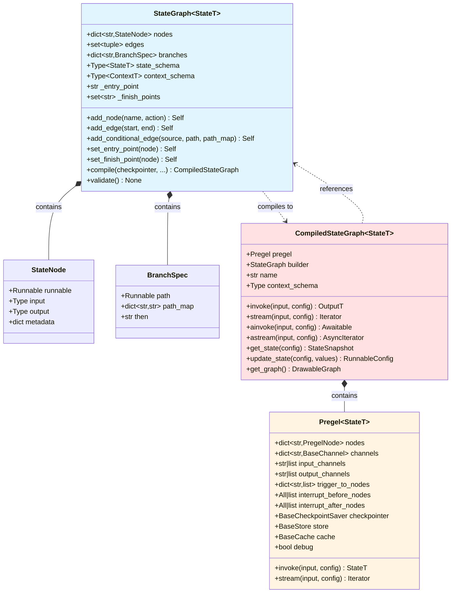

### 2.2 执行引擎类图

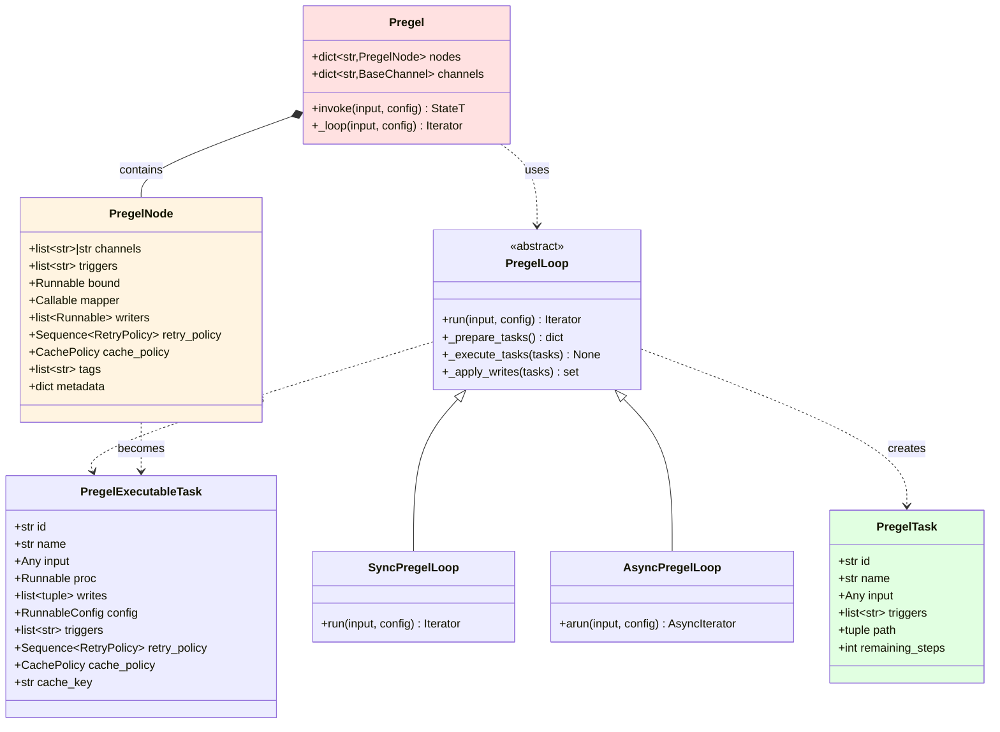

### 2.3 通道系统类图

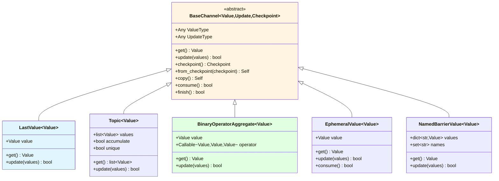

### 2.4 图意说明

#### 图构建和编译

**StateGraph到CompiledStateGraph的转换**

- `StateGraph`是构建器，提供声明式API
- `compile()`方法将其转换为`CompiledStateGraph`
- `CompiledStateGraph`包含`Pregel`执行引擎
- `Pregel`持有`PregelNode`和`BaseChannel`

**节点和边的表示**

- 节点存储为`StateNode`，包装用户的action函数
- 边存储为元组集合`(start, end)`
- 条件边存储为`BranchSpec`，包含路由函数和映射

#### 执行引擎

**Pregel到PregelNode**

- `Pregel`包含多个`PregelNode`
- 每个`PregelNode`订阅一组通道（triggers）
- `PregelNode`包含实际的执行逻辑（bound Runnable）

**任务类型**

- `PregelTask`：任务描述，用于预览和调试
- `PregelExecutableTask`：可执行任务，包含实际的执行器

**执行循环**

- `PregelLoop`实现主循环逻辑
- `SyncPregelLoop`用于同步执行
- `AsyncPregelLoop`用于异步执行

#### 通道系统

**通道继承层次**

- `BaseChannel`定义通道接口
- 各种具体通道实现不同的更新语义
- 所有通道都支持checkpointing

**通道类型特点**

- `LastValue`：简单覆盖，适用于单值状态
- `Topic`：PubSub模式，适用于消息流
- `BinaryOperatorAggregate`：使用二元运算符聚合，适用于累加、合并等
- `EphemeralValue`：临时值，consume后清空
- `NamedBarrierValue`：命名屏障，等待多个输入

## 三、详细数据结构定义

### 3.1 StateGraph

```python
class StateGraph(Generic[StateT, ContextT, InputT, OutputT]):
    """
    状态图构建器
    
    设计要点：

    1. 泛型设计，支持自定义状态类型
    2. 声明式API，链式调用
    3. 延迟验证，在compile时检查
    """
    
    nodes: dict[str, StateNode]
    """
    节点映射
    
    键：节点名称（字符串）
    值：StateNode对象，包装用户的action函数
    
    特性：
    - 节点名称必须唯一
    - 不能使用保留名称（START、END、__start__、__end__）
    """
    
    edges: set[tuple[str, str]]
    """
    固定边集合
    
    格式：(起始节点, 目标节点)
    
    特性：
    - 使用set避免重复
    - 支持START和END作为特殊节点
    - 在compile时会转换为触发器关系
    """
    
    branches: dict[str, dict[str, BranchSpec]]
    """
    条件边映射
    
    结构：
    {
        "source_node": {
            "__default__": BranchSpec(...),
        }
    }
    
    说明：
    - 外层键为源节点名称
    - 内层键为分支名称（通常为"__default__"）
    - 值为BranchSpec，包含路由函数和映射
    """
    
    state_schema: Type[StateT]
    """
    状态结构定义
    
    支持类型：
    - TypedDict: 字典式状态
    - Pydantic BaseModel: 模型式状态
    
    用途：
    - 确定通道数量和类型
    - 提取reducer函数（从Annotated）
    - 类型检查和验证
    """
    
    context_schema: Type[ContextT] | None
    """
    运行时上下文结构定义
    
    用途：
    - 定义不可变的运行时数据（如user_id、db_conn）
    - 通过Runtime注入到节点函数
    - 与State分离，不参与检查点
    """
    
    _entry_point: str | None
    """
    入口点节点名称
    
    设置方式：
    - add_edge(START, node)
    - set_entry_point(node)
    
    验证：
    - compile时必须已设置
    - 只能设置一次
    """
    
    _finish_points: set[str]
    """
    出口点节点集合
    
    设置方式：
    - add_edge(node, END)
    - set_finish_point(node)
    
    验证：
    - compile时必须至少有一个
    - 可以有多个出口点
    """

```

**字段关系图**：

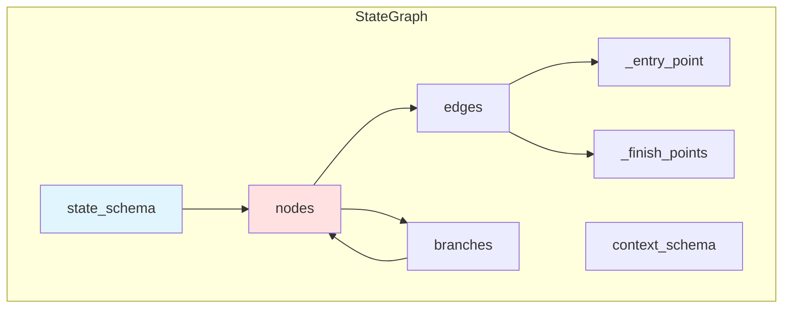

### 3.2 PregelNode

```python
@dataclass
class PregelNode:
    """
    Pregel节点容器
    
    设计目的：

    - 封装节点的执行逻辑和元数据
    - 支持订阅通道和触发机制
    - 提供重试和缓存策略
    """
    
    channels: str | list[str]
    """
    输入通道
    
    类型：
    - str: 单通道，节点接收该通道的值
    - list[str]: 多通道，节点接收dict
    
    示例：
    - "messages": 节点输入为messages的值
    - ["messages", "context"]: 节点输入为{"messages": ..., "context": ...}
    """
    
    triggers: list[str]
    """
    触发器通道列表
    
    含义：
    - 列表中任意通道更新时，节点被触发
    - 通道名称对应state schema的字段
    
    触发条件：
    - 通道版本 > 节点已见版本
    - 在prepare_next_tasks中检查
    """
    
    bound: Runnable[Any, Any]
    """
    绑定的执行逻辑
    
    类型：Runnable（LangChain接口）
    
    通常为RunnableSequence：
    1. ChannelRead: 读取通道值
    2. 用户函数: 实际业务逻辑
    3. ChannelWrite: 写入更新到通道
    """
    
    mapper: Callable[[Any], Any] | None = None
    """
    输入映射函数
    
    用途：
    - 在传递给bound之前转换输入
    - 可选，默认为None（不转换）
    """
    
    writers: list[Runnable]
    """
    写入器列表
    
    用途：
    - 将节点输出写入到通道
    - 通常包含ChannelWrite实例
    - 支持多个写入器（高级用法）
    """
    
    retry_policy: Sequence[RetryPolicy] | None = None
    """
    重试策略
    
    结构：
    [
        RetryPolicy(
            max_attempts=3,
            backoff_factor=2.0,
            retry_on=(TimeoutError,),
        ),
        ...
    ]
    
    行为：
    - 按顺序应用策略
    - 第一个匹配的策略生效
    - None表示不重试
    """
    
    cache_policy: CachePolicy | None = None
    """
    缓存策略
    
    结构：
    CachePolicy(
        max_age_seconds=3600,
        cache_keys=["input_hash"],
    )
    
    行为：
    - 基于cache_keys计算缓存键
    - 命中缓存时跳过执行
    - max_age过期后失效
    """
    
    tags: Sequence[str] | None = None
    """
    节点标签
    
    用途：
    - LangSmith追踪
    - 调试和可观测性
    - 过滤和分组
    """
    
    metadata: Mapping[str, Any] | None = None
    """
    节点元数据
    
    用途：
    - 存储额外信息
    - 追踪和调试
    - 自定义扩展
    """

```

### 3.3 PregelTask vs PregelExecutableTask

```python
class PregelTask(NamedTuple):
    """
    任务描述（不可执行）
    
    用途：

    - get_state预览下一步任务
    - 调试和可视化
    """
    
    id: str
    """
    任务唯一标识
    
    格式：
    - (PULL, node_name): 常规节点任务
    - (PUSH, idx): Send创建的动态任务
    """
    
    name: str
    """
    任务名称
    
    含义：
    - 常规任务：节点名称
    - 动态任务：目标节点名称
    """
    
    input: Any
    """
    任务输入
    
    内容：
    - 常规任务：通道值的dict
    - 动态任务：Send指定的输入
    """
    
    triggers: list[str]
    """
    触发该任务的通道列表
    """
    
    path: tuple[str | int | tuple, ...]
    """
    任务路径
    
    用途：
    - 追踪任务的执行路径
    - 子图场景下的层级标识
    """
    
    remaining_steps: int
    """
    剩余步数
    
    计算：recursion_limit - current_step
    
    用途：
    - 防止无限循环
    - ReAct agent中限制工具调用次数
    """

class PregelExecutableTask(NamedTuple):
    """
    可执行任务（PregelTask的扩展）
    
    用途：

    - 实际执行节点
    - 包含执行所需的所有信息
    """
    
    # 继承PregelTask的所有字段
    id: str
    name: str
    input: Any
    triggers: list[str]
    path: tuple
    
    # 额外字段
    proc: Runnable[Any, Any]
    """
    执行器
    
    内容：
    - PregelNode.bound的实例
    - 可以invoke或stream
    """
    
    writes: list[tuple[str, Any]]
    """
    任务的写入列表
    
    格式：[(channel, value), ...]
    
    填充时机：
    - 执行前为空
    - 执行后包含节点的返回值
    """
    
    config: RunnableConfig
    """
    执行配置
    
    内容：
    - callbacks: 回调管理器
    - tags: 合并的标签
    - metadata: 合并的元数据
    - 其他运行时配置
    """
    
    retry_policy: Sequence[RetryPolicy] | None
    """节点的重试策略"""
    
    cache_policy: CachePolicy | None
    """节点的缓存策略"""
    
    cache_key: str | None
    """
    缓存键
    
    计算：
    - 基于cache_policy.cache_keys
    - 使用xxhash计算哈希
    - None表示不缓存
    """

```

**任务状态转换**：

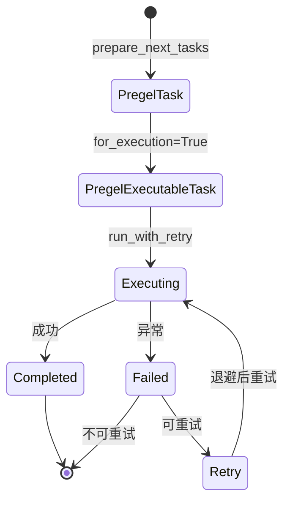

### 3.4 StateSnapshot

```python
class StateSnapshot(NamedTuple):
    """
    状态快照
    
    设计目的：

    - 提供状态的只读视图
    - 包含执行上下文信息
    - 支持时间旅行和调试
    """
    
    values: dict[str, Any]
    """
    当前状态值
    
    内容：
    - 所有通道的当前值
    - 根据output_channels过滤
    
    用途：
    - 查看当前状态
    - 决策是否继续执行
    """
    
    next: tuple[str, ...]
    """
    下一步将执行的节点名称列表
    
    内容：
    - 所有将被触发的节点
    - 空元组表示执行完成
    
    用途：
    - 预览下一步操作
    - 判断是否到达终点
    """
    
    config: RunnableConfig
    """
    快照的配置
    
    包含：
    - thread_id
    - checkpoint_id
    - checkpoint_ns
    
    用途：
    - 引用该快照
    - 从该快照恢复
    """
    
    metadata: CheckpointMetadata
    """
    检查点元数据
    
    包含：
    - source: 来源（input/loop/update）
    - step: 步数
    - parents: 父检查点
    
    用途：
    - 追踪执行历史
    - 分支管理
    """
    
    created_at: str | None
    """
    创建时间戳
    
    格式：ISO 8601
    
    用途：
    - 排序快照
    - 时间范围查询
    """
    
    parent_config: RunnableConfig | None
    """
    父快照配置
    
    用途：
    - 追溯历史
    - 构建检查点树
    """
    
    tasks: tuple[PregelTask, ...]
    """
    待执行任务列表
    
    内容：
    - PregelTask（不可执行，仅描述）
    - 对应next中的节点
    
    用途：
    - 详细的任务信息
    - 输入预览
    """

```

### 3.5 Send

```python
@dataclass(frozen=True)
class Send:
    """
    动态任务创建
    
    设计目的：

    - 支持map-reduce模式
    - 动态并行执行
    - 灵活的控制流
    """
    
    node: str
    """
    目标节点名称
    
    约束：
    - 必须是已定义的节点
    - 不能是START或END
    """
    
    arg: Any
    """
    任务输入
    
    类型：任意可序列化对象
    
    传递：
    - 直接传递给目标节点
    - 不经过通道系统
    
    示例：
    Send("process", {"item": item, "index": i})
    """

```

**Send使用场景**：

```python
# 场景1：map-reduce
def fan_out(state: State) -> dict:
    items = state["items"]
    return {
        "__send__": [
            Send("process", {"item": item, "id": i})
            for i, item in enumerate(items)
        ]
    }

# 场景2：条件并行
def conditional_parallel(state: State) -> dict:
    tasks = []
    if state["need_fetch"]:
        tasks.append(Send("fetch", {}))
    if state["need_process"]:
        tasks.append(Send("process", {}))
    return {"__send__": tasks}

# 场景3：递归处理
def recursive_process(state: State) -> dict:
    if state["depth"] < 5:
        return {
            "__send__": [
                Send("recursive_process", {"depth": state["depth"] + 1, "data": sub_data})
                for sub_data in split(state["data"])
            ]
        }
    return {"result": state["data"]}
```

### 3.6 BaseChannel及其实现

```python
class BaseChannel(Generic[Value, Update, Checkpoint], ABC):
    """
    通道基类
    
    设计原则：

    - 泛型设计：Value（存储类型）、Update（更新类型）、Checkpoint（快照类型）
    - 抽象接口：定义契约，具体实现由子类提供
    - 可序列化：支持checkpointing
    """
    
    @abstractmethod
    def get(self) -> Value:
        """获取当前值，如果为空抛出EmptyChannelError"""
    
    @abstractmethod
    def update(self, values: Sequence[Update]) -> bool:
        """
        更新通道值
        
        参数：
            values: 更新序列，顺序任意
            
        返回：
            True如果通道被更新，False否则
            
        说明：
        - 使用reducer聚合多个更新
        - 空序列时返回False
        """
    
    @abstractmethod
    def checkpoint(self) -> Checkpoint | Any:
        """返回可序列化的快照"""
    
    @abstractmethod
    def from_checkpoint(self, checkpoint: Checkpoint | Any) -> Self:
        """从快照恢复"""

class LastValue(BaseChannel[Value, Value, Value]):
    """
    最后值通道
    
    行为：

    - 保存最后一个写入的值
    - 覆盖式更新
    
    适用：
    - 单值状态（如计数器、标志位）
    - 不需要聚合的场景
    """
    
    def update(self, values: Sequence[Value]) -> bool:
        if not values:
            return False
        new_value = values[-1]  # 取最后一个
        if self.value is MISSING or self.value != new_value:
            self.value = new_value
            return True
        return False

class BinaryOperatorAggregate(BaseChannel[Value, Value, Value]):
    """
    二元运算符聚合通道
    
    行为：

    - 使用二元运算符聚合值
    - 支持累加、合并等操作
    
    适用：
    - 计数器（operator.add）
    - 集合合并（operator.or_）
    - 自定义聚合
    """
    
    operator: Callable[[Value, Value], Value]
    """二元运算符，签名为(累积值, 新值) -> 新累积值"""
    
    def update(self, values: Sequence[Value]) -> bool:
        if not values:
            return False
        
        # 累加所有值
        if self.value is MISSING:
            result = values[0]
            for v in values[1:]:
                result = self.operator(result, v)
        else:
            result = self.value
            for v in values:
                result = self.operator(result, v)
        
        if self.value is MISSING or self.value != result:
            self.value = result
            return True
        return False

```

## 四、数据结构关系与生命周期

### 4.1 构建阶段数据流

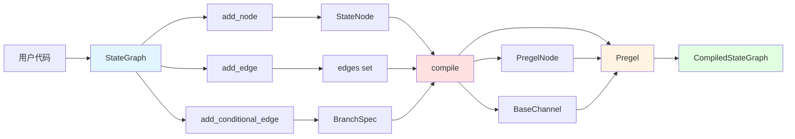

### 4.2 执行阶段数据流

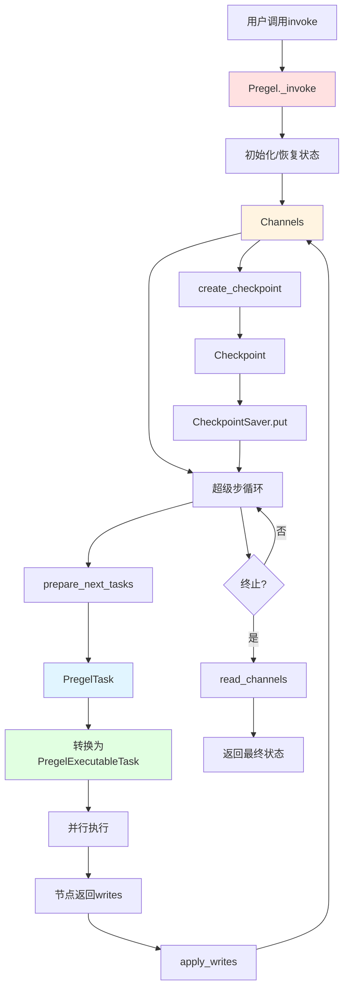

## 五、性能优化建议

### 5.1 减少通道数量

**问题**：过多通道增加遍历和序列化开销

**优化**：

```python
# 不推荐：每个细节都是独立通道
class State(TypedDict):
    user_id: str
    user_name: str
    user_email: str
    user_age: int
    # ... 更多字段

# 推荐：相关字段分组
class State(TypedDict):
    user: dict  # 或Pydantic模型
    session: dict
    result: dict
```

### 5.2 选择合适的通道类型

**LastValue vs BinaryOperatorAggregate**：

- 单值状态：使用`LastValue`，开销最小
- 需要聚合：使用`BinaryOperatorAggregate`，但注意reducer性能

**示例**：

```python
class State(TypedDict):
    counter: Annotated[int, operator.add]  # 需要累加
    flag: bool  # 覆盖即可，自动使用LastValue
```

### 5.3 缓存策略

**节点级缓存**：

```python
node_builder.add_cache_policy(
    CachePolicy(
        max_age_seconds=3600,
        cache_keys=["input_text"],  # 基于输入缓存
    )
)
```

**适用场景**：

- 幂等节点（相同输入总是相同输出）
- 计算密集型节点
- 外部API调用

## 六、总结

langgraph核心模块的数据结构设计体现了以下特点：

1. **类型安全**：充分利用泛型和类型提示
2. **不可变性**：关键数据结构使用NamedTuple和frozen dataclass
3. **可扩展性**：抽象基类和接口设计支持自定义实现
4. **高性能**：精心设计的数据结构减少不必要的复制和遍历
5. **可序列化**：支持检查点和持久化

通过理解这些数据结构，可以更好地使用LangGraph构建复杂的Agent系统。

---

## 时序图

## 一、时序图概览

本文档展示langgraph核心模块在各种典型场景下的时序交互：

1. 图编译流程
2. 图执行流程（invoke）
3. 流式执行流程（stream）
4. 状态查询流程（get_state）
5. 状态更新流程（update_state）
6. 条件边执行流程
7. Send动态任务流程

## 二、图编译流程

### 2.1 完整编译时序图

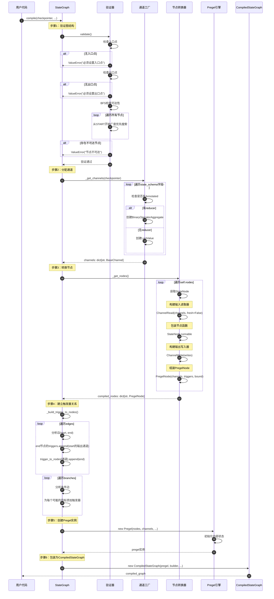

### 2.2 时序说明

#### 阶段1：图验证（步骤1-7）

**入口点检查**

- 检查`_entry_point`是否已设置
- 必须通过`add_edge(START, node)`或`set_entry_point(node)`设置

**出口点检查**

- 检查`_finish_points`是否非空
- 必须通过`add_edge(node, END)`或`set_finish_point(node)`设置

**可达性检查**

- 使用BFS从入口点遍历
- 检查所有节点是否可达
- 不可达节点会导致编译失败

#### 阶段2：通道分配（步骤8-13）

**字段解析**

- 遍历`state_schema`的所有字段
- 检查是否使用`Annotated[Type, reducer]`

**通道类型选择**

```python
# 有reducer -> BinaryOperatorAggregate
messages: Annotated[list, add_messages]
# 无reducer -> LastValue
counter: int
```

**通道实例化**

- 创建通道实例
- 设置通道的key和类型信息

#### 阶段3：节点转换（步骤14-21）

**输入读取器**

```python
ChannelRead(
    channels=["messages", "counter", "flag"],
    fresh=False,  # 读取快照，不读取最新值
)
```

**输出写入器**

```python
ChannelWrite(
    writes=[
        ChannelWriteEntry("messages"),
        ChannelWriteEntry("counter"),
    ],
    require_at_least_one_of=["messages", "counter"],
)
```

**组装PregelNode**

```python
PregelNode(
    channels=["messages", "counter"],  # 输入通道
    triggers=[],  # 稍后填充
    bound=RunnableSequence(
        input_reader,
        node_func,
        output_writer,
    ),
)
```

#### 阶段4：触发器建立（步骤22-27）

**固定边处理**

- 对于边`(A, B)`，B的triggers添加A的输出通道
- 构建`trigger_to_nodes`反向索引

**条件边处理**

- 分析`BranchSpec.path_map`
- 为所有可能的目标节点添加触发器

#### 阶段5：创建执行引擎（步骤28-30）

**Pregel初始化**

- 存储节点和通道
- 设置中断点配置
- 绑定检查点存储器

#### 阶段6：包装结果（步骤31-32）

**CompiledStateGraph创建**

- 包含Pregel实例
- 保留对StateGraph的引用（用于introspection）
- 实现Runnable接口

## 三、图执行流程（invoke）

### 3.1 完整执行时序图

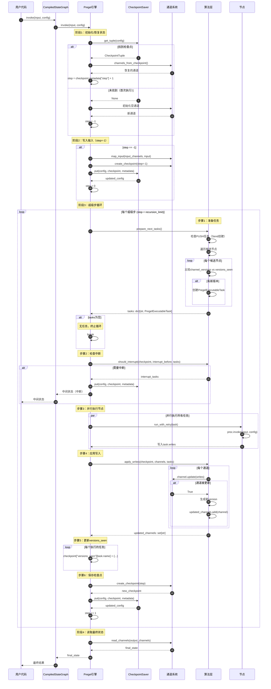

### 3.2 时序说明

#### 阶段1：状态初始化（步骤1-10）

**恢复场景**

- 从CheckpointSaver加载检查点
- 恢复通道值和版本
- 从metadata中获取step
- 应用pending_writes（如果有）

**首次执行场景**

- 创建空通道
- step初始化为-1
- 写入用户输入到START通道

#### 阶段2：输入写入（步骤11-14）

**映射输入到通道**

```python
# 如果input_channels是单个通道
channels["__input__"].update([input])

# 如果input_channels是多个通道
for key, value in input.items():
    if key in input_channels:
        channels[key].update([value])
```

**创建input检查点**

- step = -1
- source = "input"
- 保存到CheckpointSaver

#### 阶段3：超级步循环（步骤15-43）

**任务准备**

- 遍历所有节点，检查触发条件
- 触发条件：channel_versions > versions_seen
- 创建PregelExecutableTask

**中断检查**

- 如果配置了interrupt_before
- 检查任务是否在中断列表中
- 是则保存检查点并返回

**并行执行**

- 使用ThreadPoolExecutor（同步）或asyncio（异步）
- 所有任务并行执行
- 收集每个任务的writes

**写入应用**

- 按通道分组writes
- 调用channel.update()应用reducer
- 为更新的通道生成新版本

**versions_seen更新**

- 记录每个节点看到的通道版本
- 用于下一步判断是否执行

**检查点保存**

- step递增
- source = "loop"
- 保存当前状态

#### 阶段4：返回结果（步骤44-47）

**读取输出**

- 根据output_channels读取通道值
- 返回给用户

## 四、流式执行流程（stream）

### 4.1 流式执行时序图

```mermaid
sequenceDiagram
    autonumber
    participant User as 用户代码
    participant CSG as CompiledStateGraph
    participant Pregel as Pregel引擎
    participant Loop as PregelLoop
    participant Channels as 通道系统
    
    User->>CSG: stream(input, config, stream_mode="values")
    CSG->>Pregel: stream(input, config, stream_mode)
    
    Pregel->>Loop: run(input, config)
    
    Note over Loop: 初始化和输入写入（同invoke）
    
    loop 每个超级步
        Loop->>Loop: prepare_next_tasks()
        Loop->>Loop: execute_tasks()
        Loop->>Loop: apply_writes()
        
        Note over Loop: Yield中间状态
        alt stream_mode == "values"
            Loop->>Channels: read_channels(output_channels)
            Channels-->>Loop: current_state
            Loop-->>Pregel: yield current_state
            Pregel-->>CSG: yield current_state
            CSG-->>User: yield current_state
        else stream_mode == "updates"
            loop 每个任务
                Loop-->>Pregel: yield (task.name, task.writes)
                Pregel-->>CSG: yield (task.name, task.writes)
                CSG-->>User: yield (task.name, task.writes)
            end
        else stream_mode == "debug"
            loop 每个任务
                Loop-->>Pregel: yield debug_info
                Pregel-->>CSG: yield debug_info
                CSG-->>User: yield debug_info
            end
        end
        
        Loop->>Loop: save_checkpoint()
    end
    
    Note over Loop: 最终状态
    Loop->>Channels: read_channels(output_channels)
    Channels-->>Loop: final_state
    Loop-->>Pregel: yield final_state
    Pregel-->>CSG: yield final_state
    CSG-->>User: yield final_state
```

### 4.2 流式模式说明

**values模式**

- 每个超级步后yield完整状态
- 用户看到状态的演变过程
- 适合UI更新、进度显示

**updates模式**

- 每个节点执行后yield增量更新
- 格式：`(node_name, updates_dict)`
- 适合增量处理、细粒度控制

**debug模式**

- yield详细的调试信息
- 包含：节点名、输入、输出、执行时间等
- 适合开发和调试

## 五、状态查询流程（get_state）

### 5.1 状态查询时序图

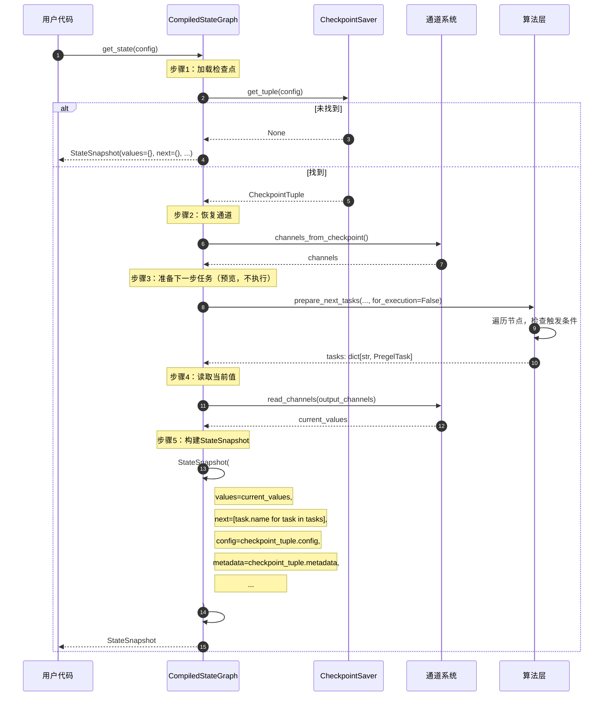

### 5.2 时序说明

**for_execution=False的意义**

- 不创建PregelExecutableTask
- 只创建PregelTask（描述性）
- 不包含执行器，不能真正执行
- 用于预览和introspection

**StateSnapshot用途**

```python
snapshot = app.get_state(config)

# 查看当前状态
print(snapshot.values)

# 查看下一步
print(snapshot.next)  # ("agent", "tools")

# 查看任务详情
for task in snapshot.tasks:
    print(f"{task.name}: {task.input}")
```

## 六、状态更新流程（update_state）

### 6.1 状态更新时序图

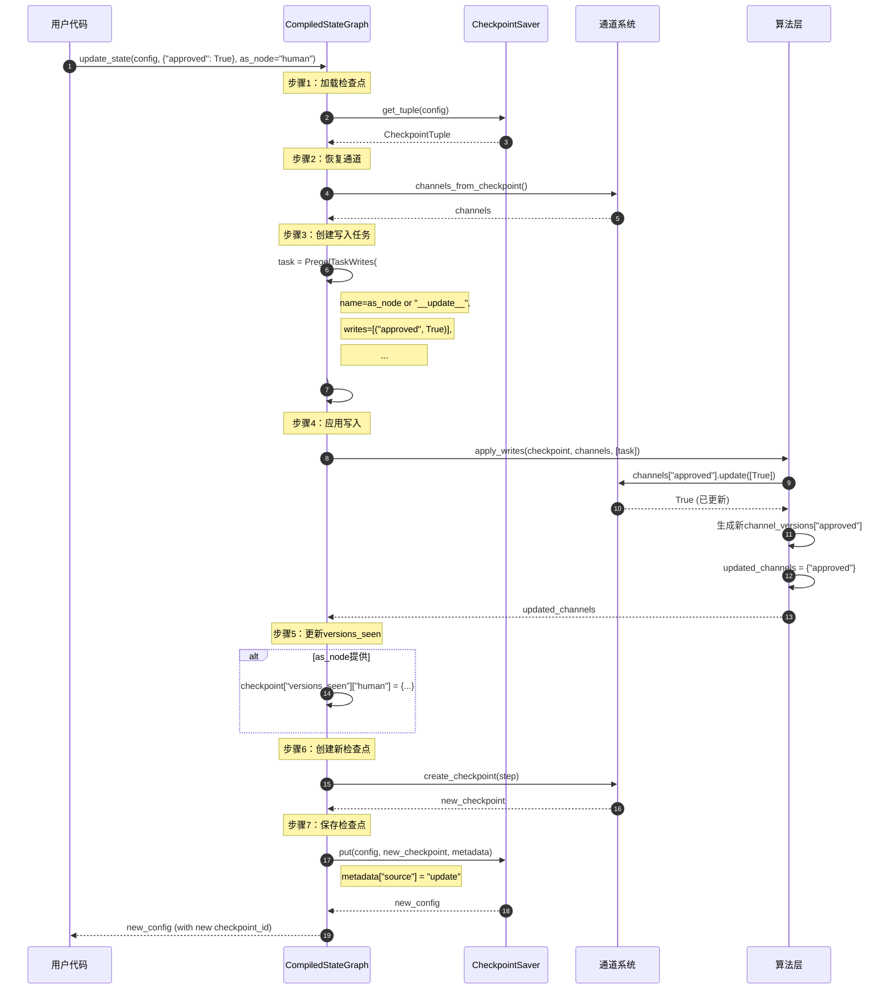

### 6.2 时序说明

**as_node参数的作用**

- 模拟节点更新
- 影响versions_seen
- 下次执行时，该节点不会被重新触发

**使用场景**

```python
# 场景1：人工审批
snapshot = app.get_state(config)
print("等待审批:", snapshot.values["report"])

# 用户审批后
app.update_state(config, {"approved": True}, as_node="approval")

# 继续执行
result = app.invoke(None, config)

# 场景2：修正错误
snapshot = app.get_state(config)
if snapshot.values["data"] == "wrong":
    app.update_state(config, {"data": "corrected"})
    result = app.invoke(None, config)
```

## 七、条件边执行流程

### 7.1 条件边时序图

```mermaid
sequenceDiagram
    autonumber
    participant Loop as PregelLoop
    participant Node as 源节点
    participant Router as 路由函数
    participant Channels as 通道系统
    participant NextNode as 目标节点
    
    Note over Loop: 节点执行阶段
    Loop->>Node: execute(state)
    Node->>Node: 业务逻辑
    Node-->>Loop: updates
    
    Note over Loop: 应用写入
    Loop->>Channels: apply_writes()
    Channels-->>Loop: updated_channels
    
    Note over Loop: 下一步准备
    Loop->>Loop: prepare_next_tasks()
    
    Note over Loop: 检查源节点的条件边
    alt 源节点有条件边
        Loop->>Router: path_func(state)
        
        Router->>Channels: 读取state
        Channels-->>Router: current_state
        
        Router->>Router: 决策逻辑
        alt 返回单个目标
            Router-->>Loop: "target_node"
        else 返回多个目标
            Router-->>Loop: ["node1", "node2"]
        else 返回Send列表
            Router-->>Loop: {"__send__": [Send(...), ...]}
        end
        
        Note over Loop: 解析路由结果
        alt path_map提供
            Loop->>Loop: actual_target = path_map[route_result]
        else 无path_map
            Loop->>Loop: actual_target = route_result
        end
        
        Note over Loop: 创建目标节点任务
        loop 每个目标
            Loop->>Loop: 创建PregelExecutableTask(target)
        end
    end
    
    Note over Loop: 执行目标节点
    Loop->>NextNode: execute(state)
    NextNode-->>Loop: updates
```

### 7.2 路由函数类型

**类型1：返回字符串**

```python
def route(state: State) -> str:
    if state["count"] > 10:
        return END
    return "continue"

graph.add_conditional_edge("check", route, {
    "continue": "process",
    END: END,
})
```

**类型2：返回列表（并行）**

```python
def route(state: State) -> list[str]:
    targets = []
    if state["need_fetch"]:
        targets.append("fetch")
    if state["need_save"]:
        targets.append("save")
    return targets

graph.add_conditional_edge("decide", route)
```

**类型3：返回Send（动态任务）**

```python
def route(state: State) -> dict:
    return {
        "__send__": [
            Send("process", {"item": item})
            for item in state["items"]
        ]
    }

graph.add_conditional_edge("fan_out", route)
```

## 八、Send动态任务流程

### 8.1 Send执行时序图

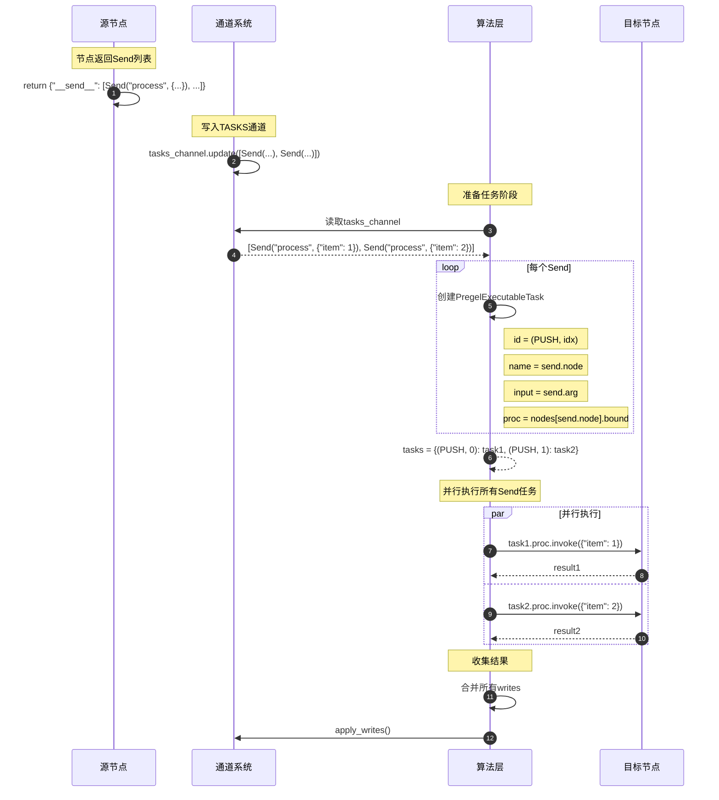

### 8.2 Send vs 条件边

**Send优势**

- 动态数量：根据数据动态创建任务
- 独立输入：每个任务有独立的输入
- 完全并行：所有任务并行执行

**条件边限制**

- 静态数量：目标节点固定
- 共享状态：所有目标节点共享相同状态
- 部分并行：同一超级步内并行

**使用场景对比**

```python
# 条件边：根据状态选择路径
def route(state):
    if state["mode"] == "fast":
        return "quick_process"
    return "detailed_process"

# Send：动态并行处理
def fan_out(state):
    return {
        "__send__": [
            Send("process", {"item": item, "id": i})
            for i, item in enumerate(state["items"])
        ]
    }
```

## 九、总结

langgraph核心模块的时序设计体现了以下特点：

1. **分阶段执行**：初始化、循环、终止清晰分离
2. **并行优化**：同一超级步内的任务并行执行
3. **增量计算**：基于版本号判断是否需要执行
4. **灵活控制流**：支持固定边、条件边、动态任务
5. **可观测性**：流式模式支持实时监控
6. **人机协同**：中断和状态更新支持人工介入

通过理解这些时序流程，可以更好地设计和调试LangGraph应用。

---
