# LangGraph-03-prebuilt

## 模块概览

## 一、模块职责

prebuilt模块是LangGraph的高级API层，提供开箱即用的预构建组件和Agent模板。该模块封装了常见的Agent模式，让开发者无需从头构建图结构，即可快速创建生产级Agent应用。

### 1.1 核心能力

1. **ReAct Agent**
   - `create_react_agent`：创建ReAct模式的工具调用Agent
   - 支持静态和动态模型选择
   - 内置工具循环和错误处理

2. **工具执行**
   - `ToolNode`：并行执行工具调用
   - `tools_condition`：基于工具调用的路由函数
   - 支持状态和存储注入

3. **工具验证**
   - `ValidationNode`：验证工具参数
   - 自动错误格式化和重试
   - 支持Pydantic模型验证

4. **状态管理**
   - `InjectedState`：注入图状态到工具
   - `InjectedStore`：注入持久化存储到工具
   - 支持依赖注入模式

## 二、输入与输出

### 2.1 create_react_agent输入

**必需参数**

- `model`：语言模型或动态模型选择函数
- `tools`：工具列表或ToolNode实例

**可选参数**

- `prompt`：系统提示词（str、SystemMessage或Callable）
- `response_format`：结构化响应schema
- `state_schema`：自定义状态结构
- `context_schema`：运行时上下文结构
- `checkpointer`：检查点存储器
- `interrupt_before/after`：中断点配置

### 2.2 create_react_agent输出

返回`CompiledStateGraph`，包含以下节点：

- `agent`：LLM调用节点
- `tools`：工具执行节点
- 可选：`pre_model_hook`、`post_model_hook`、`structured_response`

### 2.3 ToolNode输入输出

**输入**

- `state`：必须包含`messages`字段，其中最后一条消息包含`tool_calls`

**输出**

- `messages`：ToolMessage列表，每个tool_call一个

### 2.4 上下游依赖

**上游（依赖方）**

- 用户代码：直接使用prebuilt API创建Agent
- 示例和教程：大量使用create_react_agent

**下游（被依赖）**

- `langgraph`：使用StateGraph构建图
- `checkpoint`：用于持久化
- `langchain-core`：使用工具和消息类型

## 三、模块架构

### 3.1 整体架构图

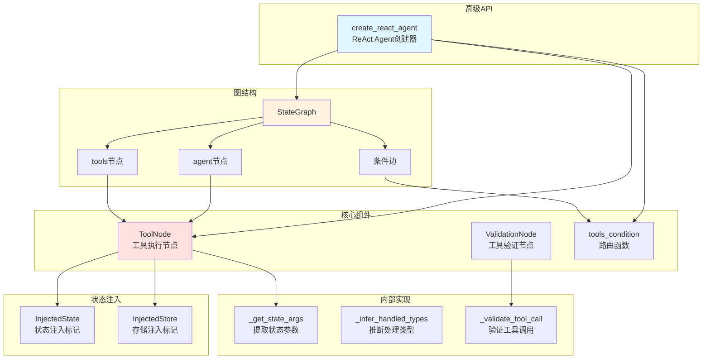
```mermaid
flowchart TB
    subgraph "高级API"
        A1[create_react_agent<br/>ReAct Agent创建器]
    end
    
    subgraph "核心组件"
        B1[ToolNode<br/>工具执行节点]
        B2[ValidationNode<br/>工具验证节点]
        B3[tools_condition<br/>路由函数]
    end
    
    subgraph "状态注入"
        C1[InjectedState<br/>状态注入标记]
        C2[InjectedStore<br/>存储注入标记]
    end
    
    subgraph "内部实现"
        D1[_get_state_args<br/>提取状态参数]
        D2[_infer_handled_types<br/>推断处理类型]
        D3[_validate_tool_call<br/>验证工具调用]
    end
    
    subgraph "图结构"
        E1[StateGraph]
        E2[agent节点]
        E3[tools节点]
        E4[条件边]
    end
    
    A1 --> B1
    A1 --> B3
    A1 --> E1
    
    B1 --> C1
    B1 --> C2
    B1 --> D1
    
    B2 --> D3
    
    E1 --> E2
    E1 --> E3
    E1 --> E4
    
    E2 --> B1
    E3 --> B1
    E4 --> B3
    
    style A1 fill:#e1f5ff
    style B1 fill:#ffe1e1
    style E1 fill:#fff4e1
```

### 3.2 架构说明

#### 3.2.1 图意概述

prebuilt模块采用分层架构，最上层是`create_react_agent`高级API，中间层是可复用的组件（ToolNode、ValidationNode），底层是辅助工具和状态注入机制。所有组件最终通过StateGraph组装成完整的Agent。

#### 3.2.2 关键组件

**create_react_agent**

这是最常用的高级API，创建完整的ReAct Agent：

```python
def create_react_agent(
    model: LanguageModelLike | Callable,
    tools: Sequence[BaseTool] | ToolNode,
    *,
    prompt: Optional[Prompt] = None,
    response_format: Optional[StructuredResponseSchema] = None,
    state_schema: Optional[StateSchemaType] = None,
    checkpointer: Optional[Checkpointer] = None,
    interrupt_before: Optional[list[str]] = None,
    interrupt_after: Optional[list[str]] = None,
    debug: bool = False,
) -> CompiledStateGraph:
    """创建ReAct Agent"""
```

**工作原理**：

1. 创建StateGraph，状态包含messages和remaining_steps
2. 添加agent节点：调用LLM生成响应
3. 添加tools节点：执行工具调用
4. 添加条件边：基于tool_calls决定继续或结束
5. 编译并返回CompiledStateGraph

**ToolNode**

工具执行节点，负责并行执行所有工具调用：

```python
class ToolNode(RunnableCallable):
    """并行执行工具调用"""
    
    def __init__(
        self,
        tools: Sequence[BaseTool | Callable],
        *,
        name: str = "tools",
        tags: list[str] | None = None,
        handle_tool_errors: bool | str | Callable = True,
    ):
        self.tools_by_name = {tool.name: tool for tool in tools}
        self.handle_tool_errors = handle_tool_errors
```

**执行流程**：

1. 从state中提取最后一条AIMessage
2. 遍历message中的tool_calls
3. 并行执行所有工具
4. 收集结果为ToolMessage列表
5. 返回{"messages": tool_messages}

**ValidationNode**

工具参数验证节点：

```python
class ValidationNode(RunnableCallable):
    """验证工具参数并格式化错误"""
    
    def __init__(
        self,
        tools: Sequence[BaseTool],
        *,
        format_error: Callable | None = None,
    ):
        self.schemas_by_tool = {
            tool.name: tool.args_schema
            for tool in tools
            if tool.args_schema
        }
```

**工作原理**：

1. 提取tool_calls
2. 使用Pydantic模型验证参数
3. 验证失败时生成错误消息
4. 返回ToolMessage with error

#### 3.2.3 边界与约束

**ReAct循环限制**

- 默认最大步数由remaining_steps控制
- 计算：recursion_limit - current_step
- 步数不足时自动返回错误消息

**工具调用约束**

- 工具名称必须在tools中定义
- 工具参数必须可JSON序列化
- 并行执行的工具数量受executor限制

**状态注入限制**

- 只能注入InjectedState和InjectedStore
- 注入的参数不会出现在tool_calls中
- 注入参数必须有类型注解

#### 3.2.4 异常处理与回退

**工具执行异常**

```python
# 默认行为：捕获异常，返回错误消息
handle_tool_errors = True

# 自定义错误消息
handle_tool_errors = "工具执行失败，请重试"

# 自定义错误处理
def handle_error(e: Exception, tool_call: ToolCall) -> str:
    return f"Error in {tool_call['name']}: {str(e)}"

handle_tool_errors = handle_error
```

**验证失败处理**

- ValidationNode捕获Pydantic验证错误
- 格式化错误消息
- 返回ToolMessage，触发LLM重试

**模型调用失败**

- 使用RetryPolicy自动重试
- 支持指数退避
- 最终失败会抛出异常

#### 3.2.5 性能与容量

**并行执行**

- 同一消息中的所有tool_calls并行执行
- 使用ThreadPoolExecutor（同步）或asyncio（异步）
- 并行度受executor配置限制

**内存占用**

- messages列表会持续增长
- 使用pre_model_hook可以修剪历史
- 建议定期清理旧消息

**执行效率**

- 工具执行是主要瓶颈
- 使用缓存可避免重复调用
- 异步工具可提高并发性能

#### 3.2.6 版本兼容与演进

**v1 vs v2**

- v1：tools节点处理整条消息，所有tool_calls并行
- v2：每个tool_call创建独立任务，使用Send API分发

**当前推荐**

- v2提供更细粒度的控制
- 支持工具级别的错误处理
- 更好的可观测性

**废弃功能**

- `config_schema`已废弃，使用`context_schema`
- 旧版本API保留向后兼容

## 四、生命周期

### 4.1 Agent创建阶段

```python
from langgraph.prebuilt import create_react_agent
from langchain_core.tools import tool

@tool
def search(query: str) -> str:
    """搜索信息"""
    return f"搜索结果: {query}"

@tool
def calculate(expression: str) -> float:
    """计算数学表达式"""
    return eval(expression)

# 创建Agent
agent = create_react_agent(
    model="anthropic:claude-3-7-sonnet-latest",
    tools=[search, calculate],
    prompt="你是一个helpful assistant",
    checkpointer=InMemorySaver(),
)
```

**内部流程**：

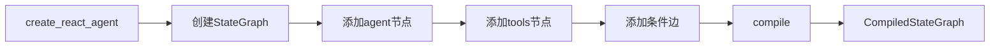
```mermaid
flowchart LR
    A[create_react_agent] --> B[创建StateGraph]
    B --> C[添加agent节点]
    C --> D[添加tools节点]
    D --> E[添加条件边]
    E --> F[compile]
    F --> G[CompiledStateGraph]
```

### 4.2 Agent执行阶段

```python
config = {"configurable": {"thread_id": "user-123"}}
result = agent.invoke(
    {"messages": [{"role": "user", "content": "What is 2+2?"}]},
    config=config,
)
```

**执行流程**：

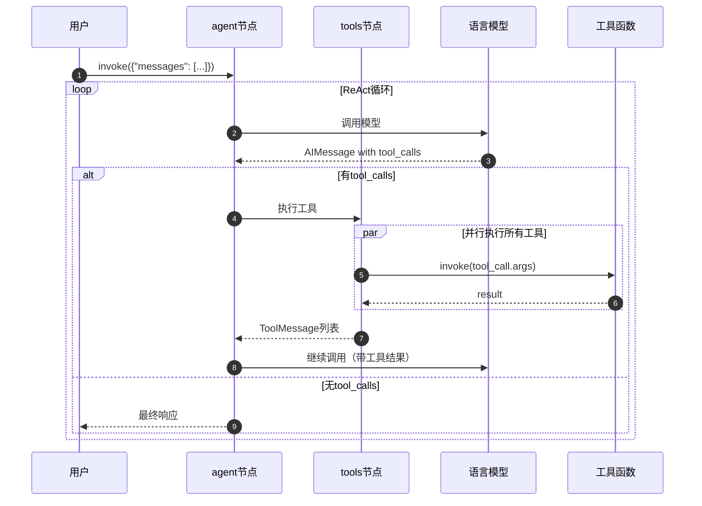
```mermaid
sequenceDiagram
    autonumber
    participant User as 用户
    participant Agent as agent节点
    participant Tools as tools节点
    participant LLM as 语言模型
    participant Tool as 工具函数
    
    User->>Agent: invoke({"messages": [...]})
    
    loop ReAct循环
        Agent->>LLM: 调用模型
        LLM-->>Agent: AIMessage with tool_calls
        
        alt 有tool_calls
            Agent->>Tools: 执行工具
            
            par 并行执行所有工具
                Tools->>Tool: invoke(tool_call.args)
                Tool-->>Tools: result
            end
            
            Tools-->>Agent: ToolMessage列表
            Agent->>LLM: 继续调用（带工具结果）
        else 无tool_calls
            Agent-->>User: 最终响应
        end
    end
```

### 4.3 状态注入执行

```python
from langgraph.prebuilt import InjectedState, InjectedStore
from typing import Annotated

@tool
def get_user_info(
    user_id: str,
    state: Annotated[dict, InjectedState],
    store: Annotated[BaseStore, InjectedStore],
) -> str:
    """获取用户信息"""
    # state和store会自动注入，不需要LLM提供
    session = state.get("session_id")
    user_data = store.get(("users",), user_id)
    return f"用户: {user_data.value['name']}"
```

**注入流程**：

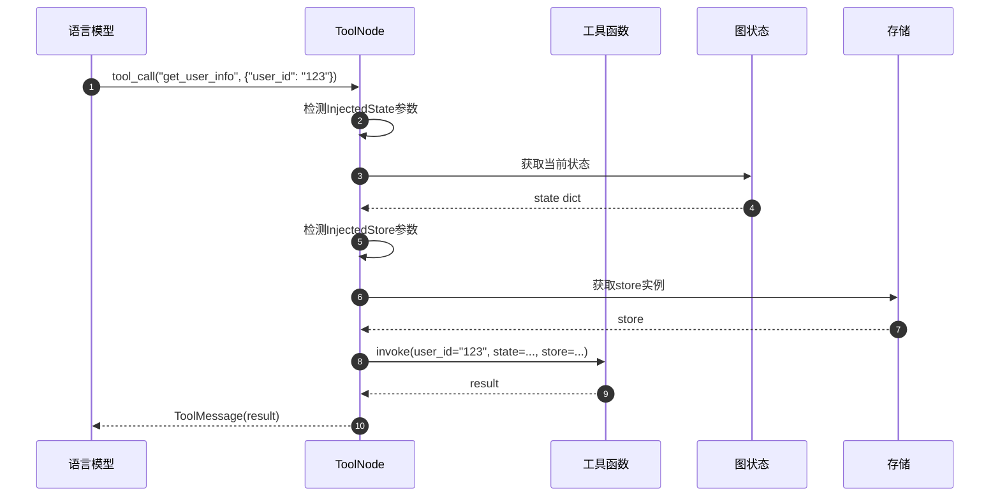
```mermaid
sequenceDiagram
    autonumber
    participant LLM as 语言模型
    participant ToolNode as ToolNode
    participant Tool as 工具函数
    participant State as 图状态
    participant Store as 存储
    
    LLM->>ToolNode: tool_call("get_user_info", {"user_id": "123"})
    
    ToolNode->>ToolNode: 检测InjectedState参数
    ToolNode->>State: 获取当前状态
    State-->>ToolNode: state dict
    
    ToolNode->>ToolNode: 检测InjectedStore参数
    ToolNode->>Store: 获取store实例
    Store-->>ToolNode: store
    
    ToolNode->>Tool: invoke(user_id="123", state=..., store=...)
    Tool-->>ToolNode: result
    ToolNode-->>LLM: ToolMessage(result)
```

## 五、核心算法与流程

### 5.1 工具并行执行算法

```python
def _execute_tools_parallel(
    tool_calls: list[ToolCall],
    tools_by_name: dict[str, BaseTool],
    config: RunnableConfig,
) -> list[ToolMessage]:
    """
    并行执行工具调用
    
    参数：
        tool_calls: 工具调用列表
        tools_by_name: 工具映射
        config: 运行配置
        
    返回：
        ToolMessage列表
        
    算法：

    1. 提取需要注入的参数（state、store）
    2. 为每个tool_call创建执行任务
    3. 使用executor并行执行
    4. 收集结果，处理异常
    5. 返回ToolMessage列表
    """
    # 步骤1：准备注入参数
    state = config.get("configurable", {}).get("__state__")
    store = config.get("configurable", {}).get("__store__")
    
    # 步骤2：构建任务
    tasks = []
    for tool_call in tool_calls:
        tool = tools_by_name[tool_call["name"]]
        
        # 合并参数：tool_call.args + 注入参数
        args = tool_call["args"].copy()
        if needs_state(tool):
            args["state"] = state
        if needs_store(tool):
            args["store"] = store
        
        tasks.append((tool, tool_call, args))
    
    # 步骤3：并行执行
    with ThreadPoolExecutor() as executor:
        futures = {
            executor.submit(tool.invoke, args, config): (tool, tool_call)
            for tool, tool_call, args in tasks
        }
        
        results = []
        for future in as_completed(futures):
            tool, tool_call = futures[future]
            try:
                result = future.result()
                results.append(ToolMessage(
                    content=str(result),
                    name=tool.name,
                    tool_call_id=tool_call["id"],
                ))
            except Exception as e:
                # 步骤4：错误处理
                error_msg = handle_error(e, tool_call)
                results.append(ToolMessage(
                    content=error_msg,
                    name=tool.name,
                    tool_call_id=tool_call["id"],
                    status="error",
                ))
    
    return results

```

**算法说明**：

- **时间复杂度**：O(T)，T为最慢工具的执行时间
- **空间复杂度**：O(N)，N为tool_calls数量
- **并行度**：min(N, executor.max_workers)

### 5.2 条件路由算法

```python
def tools_condition(state: dict) -> Literal["tools", "__end__"]:
    """
    基于工具调用的路由函数
    
    参数：
        state: 图状态，必须包含messages
        
    返回：
        "tools": 有工具调用，执行tools节点
        "__end__": 无工具调用，结束执行
        
    算法：

    1. 获取最后一条消息
    2. 检查是否为AIMessage
    3. 检查是否有tool_calls
    4. 返回路由目标
    """
    # 步骤1：获取最后一条消息
    messages = state["messages"]
    if not messages:
        return END
    
    last_message = messages[-1]
    
    # 步骤2：类型检查
    if not isinstance(last_message, AIMessage):
        return END
    
    # 步骤3：检查tool_calls
    if not last_message.tool_calls:
        return END
    
    # 步骤4：路由决策
    return "tools"

```

**算法说明**：

- **时间复杂度**：O(1)
- **决策依据**：仅基于最后一条消息
- **简单高效**：适用于绝大多数场景

### 5.3 状态参数提取算法

```python
def _get_state_args(
    func: Callable,
    state: dict,
    store: BaseStore | None,
) -> dict[str, Any]:
    """
    提取函数需要的注入参数
    
    参数：
        func: 工具函数
        state: 图状态
        store: 存储实例
        
    返回：
        注入参数dict
        
    算法：

    1. 获取函数签名
    2. 遍历参数
    3. 检查是否标记为InjectedState或InjectedStore
    4. 收集需要注入的参数
    """
    # 步骤1：获取类型提示
    type_hints = get_type_hints(func, include_extras=True)
    
    # 步骤2：初始化结果
    injected = {}
    
    # 步骤3：遍历参数
    for param_name, param_type in type_hints.items():
        # 步骤4：检查Annotated
        if get_origin(param_type) is Annotated:
            args = get_args(param_type)
            annotations = args[1:]
            
            # 步骤5：检查标记
            if InjectedState in annotations:
                injected[param_name] = state
            elif InjectedStore in annotations:
                injected[param_name] = store
    
    return injected

```

**算法说明**：

- **时间复杂度**：O(P)，P为参数数量（通常<10）
- **使用反射**：运行时类型检查
- **缓存优化**：可以缓存type_hints结果

## 六、关键代码片段

### 6.1 create_react_agent实现

```python
def create_react_agent(
    model: LanguageModelLike,
    tools: Sequence[BaseTool] | ToolNode,
    *,
    prompt: Optional[Prompt] = None,
    state_schema: Optional[StateSchemaType] = None,
    checkpointer: Optional[Checkpointer] = None,
    interrupt_before: Optional[list[str]] = None,
    interrupt_after: Optional[list[str]] = None,
    debug: bool = False,
) -> CompiledStateGraph:
    """创建ReAct Agent"""
    
    # 步骤1：准备状态schema
    if state_schema is None:
        state_schema = AgentState
    
    # 步骤2：创建StateGraph
    graph = StateGraph(state_schema)
    
    # 步骤3：准备模型
    if isinstance(model, str):
        model = init_chat_model(model)
    
    if should_bind_tools(model, tools):
        model = model.bind_tools(tools)
    
    # 步骤4：创建agent节点
    def agent_node(state: AgentState) -> dict:
        # 应用prompt
        if prompt:
            messages = apply_prompt(prompt, state)
        else:
            messages = state["messages"]
        
        # 调用模型
        response = model.invoke(messages)
        
        # 检查remaining_steps
        if state.get("remaining_steps", 0) < 2 and response.tool_calls:
            return {
                "messages": [AIMessage(
                    content="Sorry, need more steps to process this request."
                )]
            }
        
        return {"messages": [response]}
    
    # 步骤5：创建tools节点
    if isinstance(tools, ToolNode):
        tools_node = tools
    else:
        tools_node = ToolNode(tools)
    
    # 步骤6：添加节点
    graph.add_node("agent", agent_node)
    graph.add_node("tools", tools_node)
    
    # 步骤7：添加边
    graph.add_edge(START, "agent")
    graph.add_conditional_edge("agent", tools_condition, {
        "tools": "tools",
        END: END,
    })
    graph.add_edge("tools", "agent")
    
    # 步骤8：编译
    return graph.compile(
        checkpointer=checkpointer,
        interrupt_before=interrupt_before,
        interrupt_after=interrupt_after,
        debug=debug,
    )
```

### 6.2 ToolNode.invoke实现

```python
class ToolNode(RunnableCallable):
    def invoke(
        self,
        input: dict | list[AnyMessage],
        config: RunnableConfig,
    ) -> dict:
        """执行工具调用"""
        
        # 步骤1：提取消息
        if isinstance(input, dict):
            messages = input["messages"]
        else:
            messages = input
        
        # 步骤2：获取最后一条AIMessage
        last_message = messages[-1]
        if not isinstance(last_message, AIMessage):
            raise ValueError("最后一条消息必须是AIMessage")
        
        tool_calls = last_message.tool_calls
        if not tool_calls:
            raise ValueError("AIMessage必须包含tool_calls")
        
        # 步骤3：提取注入参数
        state_args = _get_state_args(
            self.tools_by_name,
            input if isinstance(input, dict) else {"messages": messages},
            config.get("configurable", {}).get("__store__"),
        )
        
        # 步骤4：并行执行工具
        tool_messages = []
        
        with get_executor_for_config(config) as executor:
            futures = []
            for tool_call in tool_calls:
                tool = self.tools_by_name[tool_call["name"]]
                
                # 合并参数
                args = {**tool_call["args"], **state_args.get(tool.name, {})}
                
                # 提交任务
                future = executor.submit(
                    self._execute_single_tool,
                    tool,
                    tool_call,
                    args,
                    config,
                )
                futures.append((future, tool_call))
            
            # 步骤5：收集结果
            for future, tool_call in futures:
                try:
                    result = future.result()
                    tool_messages.append(ToolMessage(
                        content=str(result),
                        name=tool_call["name"],
                        tool_call_id=tool_call["id"],
                    ))
                except Exception as e:
                    # 步骤6：错误处理
                    if self.handle_tool_errors:
                        error_msg = self._format_error(e, tool_call)
                        tool_messages.append(ToolMessage(
                            content=error_msg,
                            name=tool_call["name"],
                            tool_call_id=tool_call["id"],
                            status="error",
                        ))
                    else:
                        raise
        
        # 步骤7：返回结果
        return {"messages": tool_messages}
    
    def _execute_single_tool(
        self,
        tool: BaseTool,
        tool_call: ToolCall,
        args: dict,
        config: RunnableConfig,
    ) -> Any:
        """执行单个工具"""
        return tool.invoke(args, config)
```

## 七、最佳实践

### 7.1 工具设计

**原则1：单一职责**

```python
# 推荐：每个工具做一件事
@tool
def search(query: str) -> str:
    """搜索信息"""
    return search_api(query)

@tool
def fetch_weather(city: str) -> str:
    """获取天气"""
    return weather_api(city)

# 不推荐：工具功能过多
@tool
def do_everything(action: str, **kwargs) -> str:
    """执行各种操作"""
    if action == "search":
        ...
    elif action == "weather":
        ...
```

**原则2：清晰的文档字符串**

```python
@tool
def search(
    query: str,
    max_results: int = 10,
) -> str:
    """搜索相关信息
    
    Args:
        query: 搜索查询词，应具体且相关
        max_results: 最多返回结果数，默认10
        
    Returns:
        搜索结果的文本摘要
    """
    ...
```

### 7.2 状态注入

**使用InjectedState访问图状态**

```python
from langgraph.prebuilt import InjectedState
from typing import Annotated

@tool
def personalized_search(
    query: str,
    state: Annotated[dict, InjectedState],
) -> str:
    """基于用户偏好搜索"""
    user_prefs = state.get("user_preferences", {})
    # 使用user_prefs定制搜索
    return search_with_prefs(query, user_prefs)
```

**使用InjectedStore访问持久化数据**

```python
from langgraph.prebuilt import InjectedStore
from typing import Annotated

@tool
def remember_fact(
    fact: str,
    category: str,
    store: Annotated[BaseStore, InjectedStore],
    state: Annotated[dict, InjectedState],
) -> str:
    """记住一个事实"""
    user_id = state["user_id"]
    store.put(
        namespace=("facts", user_id),
        key=category,
        value={"fact": fact, "timestamp": datetime.now()},
    )
    return f"已记住: {fact}"
```

### 7.3 提示词工程

**使用SystemMessage**

```python
agent = create_react_agent(
    model=model,
    tools=tools,
    prompt=SystemMessage(content="""你是一个专业的研究助手。
    
规则：

- 总是先搜索最新信息
- 引用来源
- 如果不确定，明确说明

""")
)
```

**使用动态prompt**

```python
def dynamic_prompt(state: AgentState) -> list[BaseMessage]:
    user_name = state.get("user_name", "用户")
    return [
        SystemMessage(content=f"你好，{user_name}！我是你的助手。"),
        *state["messages"],
    ]

agent = create_react_agent(
    model=model,
    tools=tools,
    prompt=dynamic_prompt,
)
```

### 7.4 错误处理

**自定义错误消息**

```python
tool_node = ToolNode(
    tools=tools,
    handle_tool_errors=lambda e, tc: f"工具 {tc['name']} 执行失败: {str(e)}。请尝试其他方法。"
)
```

**错误重试**

```python
@tool
def unreliable_api(query: str) -> str:
    """可能失败的API"""
    try:
        return api_call(query)
    except APIError as e:
        # 返回错误信息，让LLM决定是否重试
        return f"API暂时不可用: {e}。请稍后重试或使用其他工具。"
```

### 7.5 性能优化

**使用异步工具**

```python
@tool
async def async_search(query: str) -> str:
    """异步搜索"""
    async with httpx.AsyncClient() as client:
        response = await client.get(f"https://api.search.com?q={query}")
        return response.text

# 使用ainvoke异步执行
result = await agent.ainvoke(input, config)
```

**工具缓存**

```python
from functools import lru_cache

@tool
@lru_cache(maxsize=100)
def cached_search(query: str) -> str:
    """带缓存的搜索"""
    return expensive_search(query)
```

## 八、示例与实战

### 8.1 简单ReAct Agent

```python
from langgraph.prebuilt import create_react_agent
from langchain_core.tools import tool

@tool
def get_weather(city: str) -> str:
    """获取城市天气"""
    return f"{city}今天晴，25度"

agent = create_react_agent(
    model="anthropic:claude-3-7-sonnet-latest",
    tools=[get_weather],
)

result = agent.invoke({
    "messages": [{"role": "user", "content": "北京天气怎么样？"}]
})

print(result["messages"][-1].content)
# 输出：根据查询，北京今天晴，气温25度。
```

### 8.2 带记忆的Agent

```python
from langgraph.checkpoint.memory import InMemorySaver

checkpointer = InMemorySaver()
agent = create_react_agent(
    model="anthropic:claude-3-7-sonnet-latest",
    tools=[get_weather],
    checkpointer=checkpointer,
)

config = {"configurable": {"thread_id": "user-123"}}

# 第一次对话
result1 = agent.invoke({
    "messages": [{"role": "user", "content": "北京天气怎么样？"}]
}, config)

# 第二次对话（会记住上下文）
result2 = agent.invoke({
    "messages": [{"role": "user", "content": "那上海呢？"}]
}, config)
```

### 8.3 人工审批Agent

```python
agent = create_react_agent(
    model=model,
    tools=[execute_order, cancel_order],
    checkpointer=checkpointer,
    interrupt_before=["tools"],  # 执行工具前中断
)

# 第一步：Agent决策
config = {"configurable": {"thread_id": "order-123"}}
result = agent.invoke({
    "messages": [{"role": "user", "content": "取消订单#456"}]
}, config)

# 第二步：查看待执行的工具
snapshot = agent.get_state(config)
print("待执行:", snapshot.next)  # ("tools",)
tool_calls = snapshot.values["messages"][-1].tool_calls
print("工具调用:", tool_calls)  # [{"name": "cancel_order", "args": {"order_id": "456"}}]

# 第三步：人工审批
if approved:
    # 继续执行
    result = agent.invoke(None, config)
else:
    # 拒绝并修改
    agent.update_state(config, {
        "messages": [AIMessage(content="订单取消已被拒绝")]
    })
```

## 九、总结

prebuilt模块通过封装常见Agent模式，大大降低了LangGraph的使用门槛。其核心优势在于：

1. **开箱即用**：create_react_agent提供完整的ReAct实现
2. **灵活扩展**：支持自定义状态、prompt、hooks
3. **工具友好**：ToolNode支持并行执行、状态注入、错误处理
4. **生产就绪**：内置检查点、中断、重试等企业级特性

通过合理使用prebuilt组件，可以快速构建强大的AI Agent应用。

---

## API接口

## 一、API总览

prebuilt模块提供三类API：

1. **高级Agent构建API**
   - `create_react_agent`：创建ReAct风格的工具调用Agent

2. **工具执行API**
   - `ToolNode`：并行执行工具调用
   - `tools_condition`：基于工具调用的条件路由

3. **工具验证API**
   - `ValidationNode`：验证工具参数
   - `InjectedState`：状态注入标记
   - `InjectedStore`：存储注入标记

## 二、create_react_agent API

### 2.1 基本信息

- **名称**：`create_react_agent`
- **模块**：`langgraph.prebuilt.chat_agent_executor`
- **作用**：创建ReAct（Reasoning and Acting）风格的Agent
- **幂等性**：是（相同输入产生相同图结构）

### 2.2 函数签名

```python
def create_react_agent(
    model: LanguageModelLike | Callable[[StateSchema], LanguageModelLike],
    tools: Union[ToolNode, Sequence[BaseTool | Callable]],
    *,
    prompt: Optional[Prompt] = None,
    response_format: Optional[StructuredResponseSchema] = None,
    state_schema: Optional[StateSchemaType] = None,
    context_schema: Optional[type[ContextT]] = None,
    store: Optional[BaseStore] = None,
    checkpointer: Optional[Checkpointer] = None,
    interrupt_before: Optional[Sequence[str]] = None,
    interrupt_after: Optional[Sequence[str]] = None,
    retry_policy: Optional[RetryPolicy] = None,
    debug: bool = False,
) -> CompiledStateGraph:
    """创建ReAct Agent图"""
```

### 2.3 参数详解

| 参数 | 类型 | 必填 | 默认值 | 说明 |
|---|---|:---:|---|---|
| `model` | `LanguageModelLike \| Callable` | ✓ | - | 语言模型实例或模型选择函数 |
| `tools` | `ToolNode \| Sequence[BaseTool]` | ✓ | - | 工具列表或ToolNode实例 |
| `prompt` | `Prompt \| None` | ✗ | `None` | 系统提示词 |
| `response_format` | `StructuredResponseSchema \| None` | ✗ | `None` | 结构化响应schema |
| `state_schema` | `StateSchemaType \| None` | ✗ | `AgentState` | 自定义状态结构 |
| `context_schema` | `type[ContextT] \| None` | ✗ | `None` | 运行时上下文结构 |
| `store` | `BaseStore \| None` | ✗ | `None` | 持久化存储实例 |
| `checkpointer` | `Checkpointer \| None` | ✗ | `None` | 检查点存储器 |
| `interrupt_before` | `Sequence[str] \| None` | ✗ | `None` | 执行前中断的节点列表 |
| `interrupt_after` | `Sequence[str] \| None` | ✗ | `None` | 执行后中断的节点列表 |
| `retry_policy` | `RetryPolicy \| None` | ✗ | `None` | 重试策略 |
| `debug` | `bool` | ✗ | `False` | 是否启用调试模式 |

**参数说明**：

**model**：语言模型

- 可以是LangChain的BaseChatModel实例
- 可以是模型ID字符串（如`"anthropic:claude-3-7-sonnet-latest"`）
- 可以是函数：`(state: StateSchema) -> LanguageModelLike`，用于动态选择模型
- 如果模型支持工具调用，会自动绑定tools

**tools**：工具集合

- 可以是BaseTool列表
- 可以是Callable列表（使用`@tool`装饰器装饰）
- 可以是ToolNode实例（用于自定义工具执行）
- 工具会自动绑定到模型（如果模型支持）

**prompt**：提示词

- `SystemMessage`：静态系统消息
- `str`：静态提示词文本
- `Callable[[StateSchema], LanguageModelInput]`：动态提示词函数
- `Runnable[StateSchema, LanguageModelInput]`：可运行的提示词链

**response_format**：结构化响应

- 用于强制LLM返回特定结构的数据
- 可以是Pydantic模型或字典schema
- 会在图中添加`structured_response`节点
- 最终状态包含`structured_response`字段

**state_schema**：状态结构

- 默认为`AgentState`（包含messages和remaining_steps）
- 可以自定义状态结构，必须继承自TypedDict或BaseModel
- 必须包含`messages`字段
- 可选的`remaining_steps`字段用于限制执行步数

**context_schema**：上下文结构

- 用于定义运行时注入的上下文数据
- 通过`Runtime`类访问
- 典型用途：存储用户ID、会话ID等元数据

**store**：持久化存储

- 用于长期存储数据（超出单个会话）
- 通过`InjectedStore`注入到工具中
- 典型用途：用户偏好、历史对话、知识库

**checkpointer**：检查点存储器

- 用于保存图执行状态
- 支持暂停/恢复、时间旅行
- 常用实现：InMemorySaver、SqliteSaver、PostgresSaver

**interrupt_before/after**：中断点

- 在指定节点前后暂停执行
- 用于人工审批、中间结果查看
- 使用`invoke(None, config)`恢复执行

**retry_policy**：重试策略

- 定义节点失败时的重试行为
- 包括重试次数、退避策略、可重试异常

**debug**：调试模式

- 启用详细日志
- 显示图执行过程
- 用于开发和调试

### 2.4 返回值

| 字段 | 类型 | 说明 |
|---|---|---|
| 返回值 | `CompiledStateGraph` | 编译后的状态图，可直接调用 |

**CompiledStateGraph特性**：

- 实现`Runnable`接口
- 支持`invoke`、`ainvoke`、`stream`、`astream`
- 支持`get_state`、`update_state`、`get_state_history`
- 可导出为JSON、PNG、Mermaid图

### 2.5 核心实现代码

```python
def create_react_agent(
    model: LanguageModelLike | Callable[[StateSchema], LanguageModelLike],
    tools: Union[ToolNode, Sequence[BaseTool | Callable]],
    *,
    prompt: Optional[Prompt] = None,
    response_format: Optional[StructuredResponseSchema] = None,
    state_schema: Optional[StateSchemaType] = None,
    context_schema: Optional[type[ContextT]] = None,
    store: Optional[BaseStore] = None,
    checkpointer: Optional[Checkpointer] = None,
    interrupt_before: Optional[Sequence[str]] = None,
    interrupt_after: Optional[Sequence[str]] = None,
    retry_policy: Optional[RetryPolicy] = None,
    debug: bool = False,
) -> CompiledStateGraph:
    """创建ReAct Agent"""
    
    # ========== 步骤1：确定状态schema ==========
    if state_schema is None:
        if response_format:
            state_schema = AgentStateWithStructuredResponse
        else:
            state_schema = AgentState
    
    # ========== 步骤2：创建StateGraph ==========
    graph = StateGraph(state_schema, context_schema=context_schema)
    
    # ========== 步骤3：处理模型 ==========
    if isinstance(model, str):
        # 字符串ID：初始化聊天模型
        model = init_chat_model(model)
    
    if callable(model) and not isinstance(model, Runnable):
        # 函数：包装为动态模型选择
        model_runnable = RunnableCallable(
            model,
            name="DynamicModel",
            tags=["langchain:model"],
        )
    else:
        model_runnable = model
    
    # 绑定工具
    if should_bind_tools(model_runnable, tools):
        if isinstance(tools, ToolNode):
            tools_for_bind = list(tools.tools_by_name.values())
        else:
            tools_for_bind = tools
        
        model_runnable = model_runnable.bind_tools(tools_for_bind)
    
    # ========== 步骤4：创建agent节点 ==========
    def agent_node(state: StateSchema, config: RunnableConfig) -> dict:
        """Agent节点：调用LLM生成响应"""
        
        # 应用prompt
        if prompt:
            messages = apply_prompt(prompt, state, config)
        else:
            messages = state["messages"]
        
        # 调用模型
        response = model_runnable.invoke(messages, config)
        
        # 检查剩余步数
        remaining = state.get("remaining_steps")
        if remaining is not None and remaining < 2:
            if isinstance(response, AIMessage) and response.tool_calls:
                # 步数不足，返回错误消息
                return {
                    "messages": [
                        AIMessage(
                            content=create_error_message(
                                ErrorCode.GRAPH_RECURSION_LIMIT,
                                "Agent stopped due to max iterations.",
                            )
                        )
                    ]
                }
        
        return {"messages": [response]}
    
    # ========== 步骤5：创建tools节点 ==========
    if isinstance(tools, ToolNode):
        tools_node = tools
    else:
        tools_node = ToolNode(tools)
    
    # ========== 步骤6：添加节点 ==========
    graph.add_node("agent", agent_node, retry=retry_policy)
    graph.add_node("tools", tools_node, retry=retry_policy)
    
    # ========== 步骤7：添加边 ==========
    graph.add_edge(START, "agent")
    
    # 条件边：基于tool_calls决定下一步
    graph.add_conditional_edge(
        "agent",
        tools_condition,
        {
            "tools": "tools",
            END: END,
        },
    )
    
    graph.add_edge("tools", "agent")
    
    # ========== 步骤8：处理结构化响应 ==========
    if response_format:
        structured_response_node = create_structured_response_node(
            model_runnable, response_format
        )
        graph.add_node("structured_response", structured_response_node)
        
        # 重定向agent -> structured_response -> END
        graph.add_conditional_edge(
            "agent",
            tools_condition,
            {
                "tools": "tools",
                END: "structured_response",
            },
        )
    
    # ========== 步骤9：编译 ==========
    return graph.compile(
        checkpointer=checkpointer,
        store=store,
        interrupt_before=interrupt_before,
        interrupt_after=interrupt_after,
        debug=debug,
    )
```

**代码说明**：

1. **状态schema确定**：根据是否需要结构化响应选择默认状态类型
2. **模型处理**：支持字符串ID、模型实例、动态选择函数三种方式
3. **工具绑定**：自动将tools绑定到模型（如果模型支持）
4. **agent节点**：调用LLM，处理prompt，检查剩余步数
5. **tools节点**：使用ToolNode执行工具调用
6. **图构建**：添加节点和边，形成ReAct循环
7. **结构化响应**：如果指定response_format，添加额外节点处理
8. **编译**：使用checkpointer、store等配置编译图

### 2.6 调用链

```
用户代码
  └─> create_react_agent
        ├─> StateGraph(state_schema)
        ├─> init_chat_model(model) [如果是字符串]
        ├─> model.bind_tools(tools)
        ├─> graph.add_node("agent", agent_node)
        ├─> graph.add_node("tools", ToolNode(tools))
        ├─> graph.add_conditional_edge("agent", tools_condition)
        └─> graph.compile(checkpointer=...)
              └─> CompiledStateGraph

运行时调用链
  └─> agent.invoke(input, config)
        └─> CompiledStateGraph.invoke
              ├─> Pregel.invoke
              │     ├─> prepare_next_tasks  # 确定下一步
              │     ├─> execute_node("agent")
              │     │     ├─> apply_prompt
              │     │     ├─> model.invoke
              │     │     └─> return {"messages": [response]}
              │     ├─> tools_condition  # 条件路由
              │     └─> execute_node("tools")
              │           └─> ToolNode.invoke
              │                 ├─> 并行执行所有tool_calls
              │                 └─> return {"messages": tool_messages}
              └─> return final_state
```

### 2.7 时序图

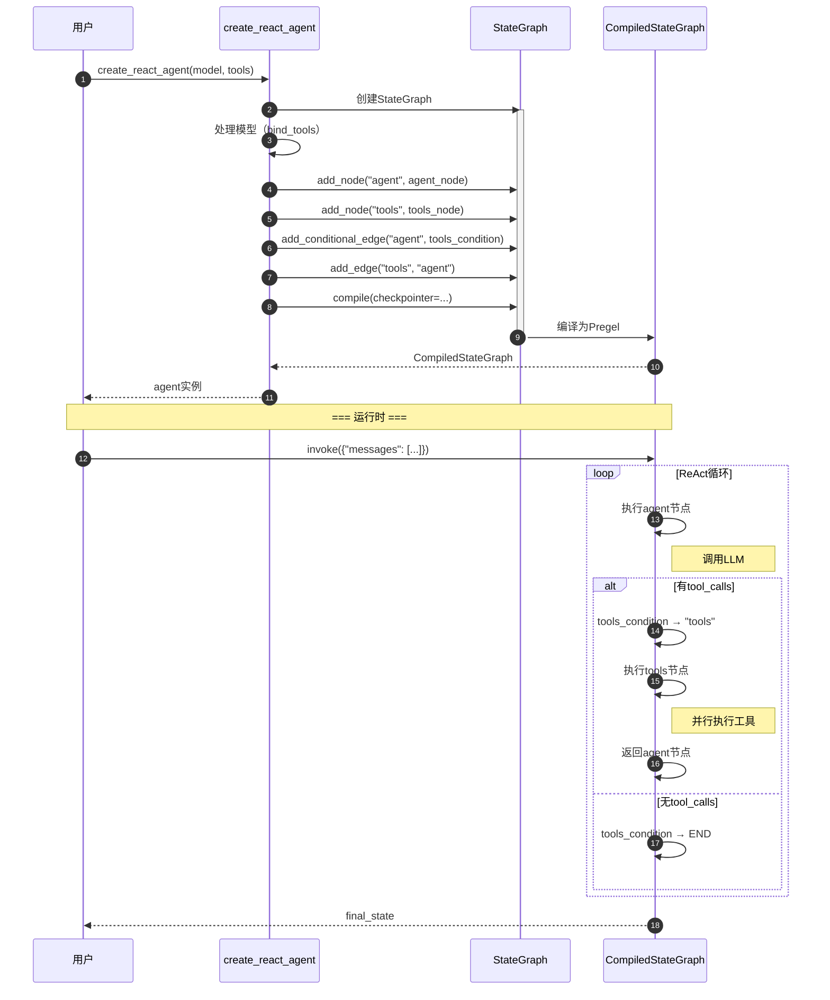
```mermaid
sequenceDiagram
    autonumber
    participant User as 用户
    participant API as create_react_agent
    participant Graph as StateGraph
    participant Pregel as CompiledStateGraph
    
    User->>API: create_react_agent(model, tools)
    
    API->>Graph: 创建StateGraph
    activate Graph
    
    API->>API: 处理模型（bind_tools）
    API->>Graph: add_node("agent", agent_node)
    API->>Graph: add_node("tools", tools_node)
    API->>Graph: add_conditional_edge("agent", tools_condition)
    API->>Graph: add_edge("tools", "agent")
    
    API->>Graph: compile(checkpointer=...)
    Graph->>Pregel: 编译为Pregel
    deactivate Graph
    
    Pregel-->>API: CompiledStateGraph
    API-->>User: agent实例
    
    Note over User,Pregel: === 运行时 ===
    
    User->>Pregel: invoke({"messages": [...]})
    
    loop ReAct循环
        Pregel->>Pregel: 执行agent节点
        Note right of Pregel: 调用LLM
        
        alt 有tool_calls
            Pregel->>Pregel: tools_condition → "tools"
            Pregel->>Pregel: 执行tools节点
            Note right of Pregel: 并行执行工具
            Pregel->>Pregel: 返回agent节点
        else 无tool_calls
            Pregel->>Pregel: tools_condition → END
        end
    end
    
    Pregel-->>User: final_state
```

### 2.8 异常处理与性能

**异常处理**

- **模型调用失败**：使用retry_policy自动重试
- **工具执行失败**：ToolNode捕获异常，返回错误消息给LLM
- **递归限制**：检查remaining_steps，步数不足时返回错误
- **配置错误**：参数验证，抛出ValueError

**性能考虑**

- **工具并行**：ToolNode并行执行所有tool_calls
- **流式输出**：支持stream模式，实时返回tokens
- **检查点开销**：每个超步保存状态，可能影响性能
- **提示词长度**：历史消息累积，建议定期修剪

**最佳实践**

- 使用异步模型和工具提高并发性能
- 合理设置remaining_steps避免无限循环
- 使用流式输出提升用户体验
- 定期清理消息历史避免上下文溢出

## 三、ToolNode API

### 3.1 基本信息

- **名称**：`ToolNode`
- **类型**：类（实现RunnableCallable）
- **作用**：并行执行工具调用，支持状态注入和错误处理
- **幂等性**：取决于工具本身

### 3.2 类签名

```python
class ToolNode(RunnableCallable):
    """并行执行工具调用的节点"""
    
    def __init__(
        self,
        tools: Sequence[Union[BaseTool, Callable]],
        *,
        name: str = "tools",
        tags: Optional[list[str]] = None,
        handle_tool_errors: Union[
            bool,
            str,
            Callable[[Exception], str],
            tuple[type[Exception], ...],
        ] = True,
    ) -> None:
        """初始化ToolNode"""
```

### 3.3 初始化参数

| 参数 | 类型 | 必填 | 默认值 | 说明 |
|---|---|:---:|---|---|
| `tools` | `Sequence[BaseTool \| Callable]` | ✓ | - | 工具列表 |
| `name` | `str` | ✗ | `"tools"` | 节点名称 |
| `tags` | `list[str] \| None` | ✗ | `None` | 节点标签 |
| `handle_tool_errors` | `bool \| str \| Callable \| tuple` | ✗ | `True` | 错误处理策略 |

**参数说明**：

**tools**：工具列表

- 可以是BaseTool实例
- 可以是使用`@tool`装饰的函数
- 自动构建工具名称到工具的映射

**name**：节点名称

- 用于图可视化和日志
- 建议使用描述性名称

**tags**：节点标签

- 用于过滤和跟踪
- 典型标签：`["langchain:tool"]`

**handle_tool_errors**：错误处理策略

- `True`：捕获所有异常，返回默认错误消息
- `str`：捕获所有异常，返回该字符串
- `Callable[[Exception], str]`：自定义错误格式化函数
- `tuple[type[Exception], ...]`：只捕获指定异常类型

### 3.4 invoke方法

```python
def invoke(
    self,
    input: Union[dict, list[AnyMessage], BaseMessage],
    config: RunnableConfig,
    **kwargs: Any,
) -> dict:
    """执行工具调用"""
```

**输入格式**：

- `dict`：状态字典，必须包含`messages`键
- `list[AnyMessage]`：消息列表
- `BaseMessage`：单条消息（必须是AIMessage且包含tool_calls）

**输出格式**：

```python
{
    "messages": [
        ToolMessage(
            content="工具执行结果",
            name="tool_name",
            tool_call_id="call_123",
        ),
        ...
    ]
}
```

### 3.5 核心实现代码

```python
class ToolNode(RunnableCallable):
    """并行执行工具调用"""
    
    def __init__(
        self,
        tools: Sequence[Union[BaseTool, Callable]],
        *,
        name: str = "tools",
        tags: Optional[list[str]] = None,
        handle_tool_errors: Union[
            bool, str, Callable, tuple[type[Exception], ...]
        ] = True,
    ) -> None:
        super().__init__(func=self._func, name=name, tags=tags, trace=False)
        
        # 构建工具映射
        self.tools_by_name: dict[str, BaseTool] = {}
        for tool in tools:
            if isinstance(tool, BaseTool):
                self.tools_by_name[tool.name] = tool
            elif callable(tool):
                # 使用@tool装饰器包装
                wrapped = cast(BaseTool, tool)
                self.tools_by_name[wrapped.name] = wrapped
        
        self.handle_tool_errors = handle_tool_errors
    
    def invoke(
        self,
        input: Union[dict, list[AnyMessage], BaseMessage],
        config: RunnableConfig,
        **kwargs: Any,
    ) -> dict:
        """执行工具调用"""
        
        # ========== 步骤1：提取消息 ==========
        if isinstance(input, dict):
            messages = input["messages"]
            state = input
        elif isinstance(input, list):
            messages = input
            state = {"messages": messages}
        else:
            messages = [input]
            state = {"messages": messages}
        
        # ========== 步骤2：获取最后一条AIMessage ==========
        last_message = messages[-1]
        if not isinstance(last_message, AIMessage):
            raise ValueError(
                f"Last message must be AIMessage, got {type(last_message)}"
            )
        
        tool_calls = last_message.tool_calls
        if not tool_calls:
            raise ValueError("AIMessage must have tool_calls")
        
        # ========== 步骤3：提取注入参数 ==========
        injected_store = config.get("configurable", {}).get("__store__")
        
        # 为每个工具提取需要的注入参数
        tools_with_state_args = {}
        for tool_name, tool in self.tools_by_name.items():
            state_args = _get_state_args(tool.func if hasattr(tool, 'func') else tool, state, injected_store)
            tools_with_state_args[tool_name] = state_args
        
        # ========== 步骤4：并行执行工具 ==========
        with get_executor_for_config(config) as executor:
            futures = []
            
            for tool_call in tool_calls:
                tool_name = tool_call["name"]
                
                # 检查工具是否存在
                if tool_name not in self.tools_by_name:
                    if self.handle_tool_errors:
                        error_msg = INVALID_TOOL_NAME_ERROR_TEMPLATE.format(
                            requested_tool=tool_name,
                            available_tools=", ".join(self.tools_by_name.keys()),
                        )
                        futures.append((
                            None,
                            tool_call,
                            ToolMessage(
                                content=error_msg,
                                name=tool_name,
                                tool_call_id=tool_call["id"],
                                status="error",
                            ),
                        ))
                        continue
                    else:
                        raise ValueError(
                            f"Tool {tool_name} not found. "
                            f"Available: {list(self.tools_by_name.keys())}"
                        )
                
                tool = self.tools_by_name[tool_name]
                
                # 合并参数：tool_call.args + 注入参数
                args = {**tool_call["args"], **tools_with_state_args[tool_name]}
                
                # 提交任务
                future = executor.submit(self._execute_tool, tool, args, config)
                futures.append((future, tool_call, None))
            
            # ========== 步骤5：收集结果 ==========
            tool_messages = []
            
            for future_or_none, tool_call, error_message in futures:
                if error_message:
                    # 工具不存在的错误消息
                    tool_messages.append(error_message)
                    continue
                
                try:
                    # 等待结果
                    result = future_or_none.result()
                    
                    # 格式化为ToolMessage
                    tool_messages.append(
                        ToolMessage(
                            content=msg_content_output(result),
                            name=tool_call["name"],
                            tool_call_id=tool_call["id"],
                        )
                    )
                
                except Exception as e:
                    # ========== 步骤6：错误处理 ==========
                    if not self._should_handle_error(e):
                        raise
                    
                    error_content = _handle_tool_error(
                        e, flag=self.handle_tool_errors
                    )
                    
                    tool_messages.append(
                        ToolMessage(
                            content=error_content,
                            name=tool_call["name"],
                            tool_call_id=tool_call["id"],
                            status="error",
                        )
                    )
        
        # ========== 步骤7：返回结果 ==========
        return {"messages": tool_messages}
    
    def _execute_tool(
        self,
        tool: BaseTool,
        args: dict,
        config: RunnableConfig,
    ) -> Any:
        """执行单个工具"""
        return tool.invoke(args, config)
    
    def _should_handle_error(self, error: Exception) -> bool:
        """判断是否应该处理该错误"""
        if isinstance(self.handle_tool_errors, tuple):
            # 只处理指定类型的异常
            return isinstance(error, self.handle_tool_errors)
        return bool(self.handle_tool_errors)
```

**代码说明**：

1. **消息提取**：支持dict、list、单条消息三种输入格式
2. **AIMessage验证**：确保最后一条消息包含tool_calls
3. **状态注入**：使用`_get_state_args`提取InjectedState和InjectedStore参数
4. **并行执行**：使用ThreadPoolExecutor并行执行所有工具
5. **结果收集**：等待所有future完成，收集ToolMessage列表
6. **错误处理**：根据handle_tool_errors策略处理异常
7. **返回格式**：返回`{"messages": [...]}`更新状态

### 3.6 调用链

```
用户代码
  └─> ToolNode(tools)
        ├─> 构建tools_by_name映射
        └─> RunnableCallable.__init__

运行时调用链
  └─> tool_node.invoke(state, config)
        ├─> 提取messages
        ├─> 获取last_message.tool_calls
        ├─> _get_state_args  # 提取注入参数
        ├─> ThreadPoolExecutor
        │     ├─> submit(tool1.invoke, args1)
        │     ├─> submit(tool2.invoke, args2)
        │     └─> ...
        ├─> future.result()  # 等待所有结果
        ├─> 格式化为ToolMessage
        └─> return {"messages": tool_messages}
```

### 3.7 时序图

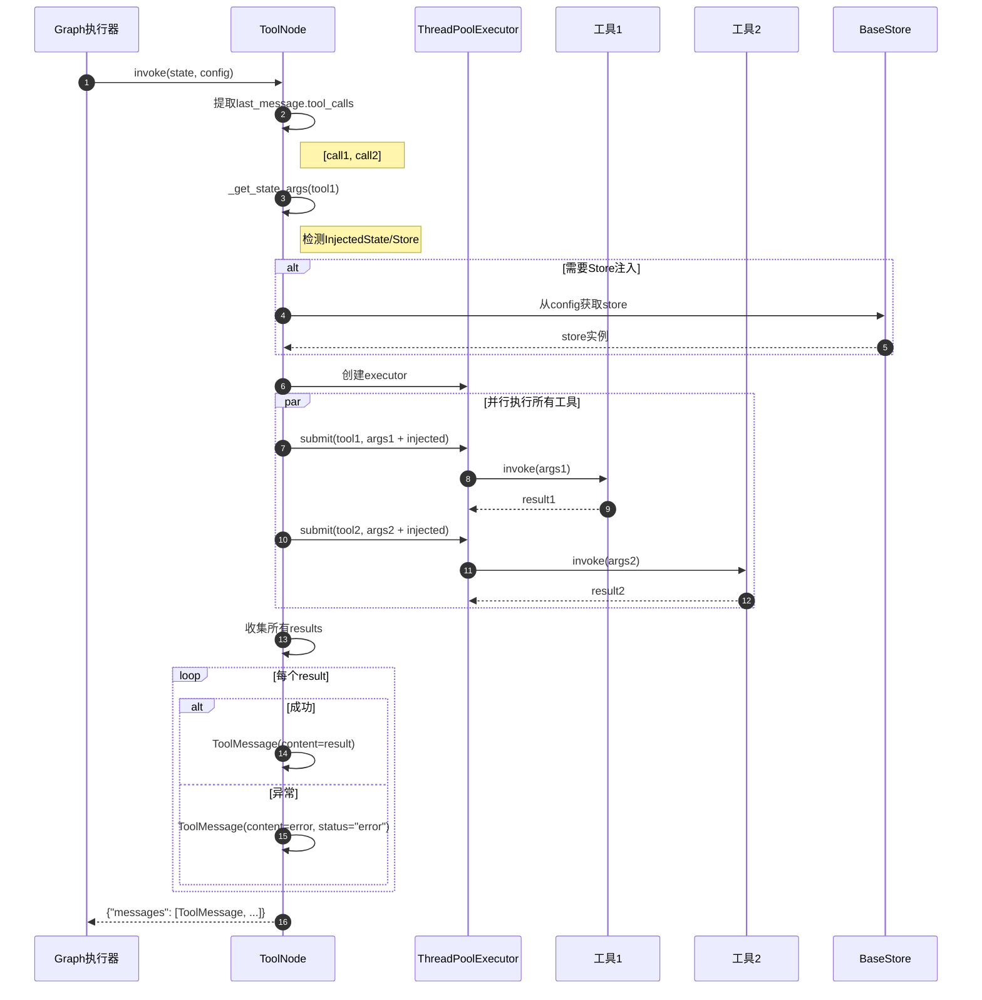
```mermaid
sequenceDiagram
    autonumber
    participant Pregel as Graph执行器
    participant ToolNode as ToolNode
    participant Executor as ThreadPoolExecutor
    participant Tool1 as 工具1
    participant Tool2 as 工具2
    participant Store as BaseStore
    
    Pregel->>ToolNode: invoke(state, config)
    
    ToolNode->>ToolNode: 提取last_message.tool_calls
    Note right of ToolNode: [call1, call2]
    
    ToolNode->>ToolNode: _get_state_args(tool1)
    Note right of ToolNode: 检测InjectedState/Store
    
    alt 需要Store注入
        ToolNode->>Store: 从config获取store
        Store-->>ToolNode: store实例
    end
    
    ToolNode->>Executor: 创建executor
    
    par 并行执行所有工具
        ToolNode->>Executor: submit(tool1, args1 + injected)
        Executor->>Tool1: invoke(args1)
        Tool1-->>Executor: result1
        
        ToolNode->>Executor: submit(tool2, args2 + injected)
        Executor->>Tool2: invoke(args2)
        Tool2-->>Executor: result2
    end
    
    ToolNode->>ToolNode: 收集所有results
    
    loop 每个result
        alt 成功
            ToolNode->>ToolNode: ToolMessage(content=result)
        else 异常
            ToolNode->>ToolNode: ToolMessage(content=error, status="error")
        end
    end
    
    ToolNode-->>Pregel: {"messages": [ToolMessage, ...]}
```

### 3.8 异常处理与性能

**异常处理**

- **工具不存在**：返回错误消息，提示可用工具列表
- **工具执行失败**：根据handle_tool_errors策略处理
- **参数验证失败**：由工具自身处理，或使用ValidationNode预先验证
- **注入失败**：如果store不可用但工具需要，会抛出异常

**性能优化**

- **并行执行**：所有tool_calls并行执行，减少总时间
- **线程池**：使用ThreadPoolExecutor复用线程
- **异步支持**：通过ainvoke使用asyncio提高并发
- **缓存**：工具可以内部使用缓存避免重复计算

## 四、tools_condition API

### 4.1 基本信息

- **名称**：`tools_condition`
- **类型**：函数
- **作用**：条件路由函数，根据是否有tool_calls决定下一步
- **幂等性**：是（纯函数）

### 4.2 函数签名

```python
def tools_condition(
    state: Union[list[AnyMessage], dict[str, Any]],
) -> Literal["tools", "__end__"]:
    """根据tool_calls决定路由"""
```

### 4.3 参数详解

| 参数 | 类型 | 必填 | 说明 |
|---|---|:---:|---|
| `state` | `list[AnyMessage] \| dict` | ✓ | 图状态或消息列表 |

### 4.4 返回值

| 值 | 说明 |
|---|---|
| `"tools"` | 有tool_calls，执行tools节点 |
| `"__end__"` | 无tool_calls，结束执行 |

### 4.5 核心实现代码

```python
def tools_condition(
    state: Union[list[AnyMessage], dict[str, Any]],
) -> Literal["tools", "__end__"]:
    """条件路由：根据tool_calls决定下一步
    
    参数：
        state: 图状态（dict）或消息列表（list）
        
    返回：
        "tools": 有工具调用，执行tools节点
        "__end__": 无工具调用，结束图执行
        
    算法：

    1. 提取messages
    2. 检查最后一条消息是否为AIMessage
    3. 检查是否有tool_calls
    4. 返回路由目标
    """
    # 步骤1：提取消息
    if isinstance(state, list):
        messages = state
    else:
        messages = state.get("messages", [])
    
    # 步骤2：检查消息列表
    if not messages:
        return END
    
    # 步骤3：获取最后一条消息
    last_message = messages[-1]
    
    # 步骤4：类型检查
    if not isinstance(last_message, AIMessage):
        return END
    
    # 步骤5：检查tool_calls
    if not last_message.tool_calls:
        return END
    
    # 步骤6：有tool_calls，路由到tools节点
    return "tools"

```

**代码说明**：

- 简单的条件判断，时间复杂度O(1)
- 只检查最后一条消息
- 适用于绝大多数场景

### 4.6 使用示例

```python
graph.add_conditional_edge(
    "agent",
    tools_condition,
    {
        "tools": "tools",  # 有tool_calls -> tools节点
        END: END,          # 无tool_calls -> 结束
    },
)
```

## 五、ValidationNode API

### 5.1 基本信息

- **名称**：`ValidationNode`
- **类型**：类（实现RunnableCallable）
- **作用**：验证工具参数，捕获Pydantic验证错误
- **幂等性**：是（纯验证逻辑）

### 5.2 类签名

```python
class ValidationNode(RunnableCallable):
    """验证工具参数"""
    
    def __init__(
        self,
        tools: Sequence[BaseTool],
        *,
        format_error: Optional[Callable[[ValidationError], str]] = None,
    ) -> None:
        """初始化ValidationNode"""
```

### 5.3 参数详解

| 参数 | 类型 | 必填 | 说明 |
|---|---|:---:|---|
| `tools` | `Sequence[BaseTool]` | ✓ | 工具列表 |
| `format_error` | `Callable \| None` | ✗ | 自定义错误格式化函数 |

### 5.4 核心实现代码

```python
class ValidationNode(RunnableCallable):
    """验证工具参数"""
    
    def __init__(
        self,
        tools: Sequence[BaseTool],
        *,
        format_error: Optional[Callable[[ValidationError], str]] = None,
    ) -> None:
        super().__init__(func=self._func, name="validation")
        
        # 构建工具schema映射
        self.schemas_by_tool: dict[str, type[BaseModel]] = {}
        for tool in tools:
            if tool.args_schema:
                self.schemas_by_tool[tool.name] = tool.args_schema
        
        self.format_error = format_error or self._default_format_error
    
    def invoke(
        self,
        input: Union[dict, list[AnyMessage]],
        config: RunnableConfig,
    ) -> dict:
        """验证工具参数"""
        
        # 提取消息
        if isinstance(input, dict):
            messages = input["messages"]
        else:
            messages = input
        
        last_message = messages[-1]
        if not isinstance(last_message, AIMessage):
            return {}
        
        tool_calls = last_message.tool_calls
        if not tool_calls:
            return {}
        
        # 验证每个tool_call
        validation_errors = []
        
        for tool_call in tool_calls:
            tool_name = tool_call["name"]
            
            if tool_name not in self.schemas_by_tool:
                # 没有schema，跳过验证
                continue
            
            schema = self.schemas_by_tool[tool_name]
            
            try:
                # 使用Pydantic验证
                schema(**tool_call["args"])
            except ValidationError as e:
                # 验证失败
                error_msg = self.format_error(e)
                validation_errors.append(
                    ToolMessage(
                        content=error_msg,
                        name=tool_name,
                        tool_call_id=tool_call["id"],
                        status="error",
                    )
                )
        
        if validation_errors:
            return {"messages": validation_errors}
        
        return {}
    
    def _default_format_error(self, error: ValidationError) -> str:
        """默认错误格式化"""
        errors = []
        for err in error.errors():
            field = ".".join(str(loc) for loc in err["loc"])
            errors.append(f"{field}: {err['msg']}")
        return "Validation errors:\n" + "\n".join(errors)
```

### 5.5 使用示例

```python
from pydantic import BaseModel, Field

class SearchArgs(BaseModel):
    query: str = Field(..., min_length=1, description="搜索查询")
    max_results: int = Field(10, ge=1, le=100, description="最大结果数")

@tool(args_schema=SearchArgs)
def search(query: str, max_results: int = 10) -> str:
    """搜索信息"""
    return f"搜索结果: {query}"

# 创建ValidationNode
validation_node = ValidationNode([search])

# 添加到图中
graph.add_node("validate", validation_node)
graph.add_edge("agent", "validate")
graph.add_conditional_edge("validate", validate_condition, {
    "tools": "tools",
    "agent": "agent",  # 验证失败，返回agent重试
})
```

## 六、InjectedState 和 InjectedStore API

### 6.1 基本信息

- **名称**：`InjectedState`、`InjectedStore`
- **类型**：类型标记
- **作用**：标记工具参数需要注入图状态或存储
- **幂等性**：不适用（仅标记）

### 6.2 使用方式

```python
from langgraph.prebuilt import InjectedState, InjectedStore
from typing import Annotated

@tool
def my_tool(
    query: str,
    state: Annotated[dict, InjectedState],
    store: Annotated[BaseStore, InjectedStore],
) -> str:
    """工具函数，自动注入state和store"""
    user_id = state.get("user_id")
    user_prefs = store.get(("users", user_id), "preferences")
    return f"搜索 {query} for user {user_id}"
```

### 6.3 工作原理

```python
def _get_state_args(
    func: Callable,
    state: dict,
    store: Optional[BaseStore],
) -> dict[str, Any]:
    """提取需要注入的参数"""
    
    type_hints = get_type_hints(func, include_extras=True)
    injected = {}
    
    for param_name, param_type in type_hints.items():
        if get_origin(param_type) is Annotated:
            args = get_args(param_type)
            annotations = args[1:]
            
            if InjectedState in annotations:
                injected[param_name] = state
            elif InjectedStore in annotations:
                if store is None:
                    raise ValueError("Store not available but required")
                injected[param_name] = store
    
    return injected
```

**关键点**：

- 使用`Annotated`和类型提示标记
- ToolNode在执行前提取注入参数
- 注入的参数不会出现在tool_calls中，对LLM透明

## 七、API使用最佳实践

### 7.1 选择合适的API

**使用create_react_agent的场景**：

- 快速原型开发
- 标准的ReAct工具调用Agent
- 需要检查点和人工审批

**直接使用ToolNode的场景**：

- 自定义图结构
- 需要特殊的工具执行逻辑
- 与其他节点组合

**使用ValidationNode的场景**：

- 工具参数复杂，需要严格验证
- 想在执行前捕获错误
- 减少不必要的工具调用

### 7.2 错误处理策略

```python
# 策略1：捕获所有异常，返回友好消息
tool_node = ToolNode(tools, handle_tool_errors=True)

# 策略2：自定义错误消息
tool_node = ToolNode(
    tools,
    handle_tool_errors="工具暂时不可用，请稍后重试"
)

# 策略3：自定义错误格式化
def format_error(e: Exception) -> str:
    if isinstance(e, APIError):
        return f"API错误: {e.message}. 请尝试其他工具。"
    return f"错误: {str(e)}"

tool_node = ToolNode(tools, handle_tool_errors=format_error)

# 策略4：只捕获特定异常
tool_node = ToolNode(
    tools,
    handle_tool_errors=(TimeoutError, ConnectionError)
)
```

### 7.3 性能优化技巧

**使用异步**

```python
# 异步工具
@tool
async def async_search(query: str) -> str:
    async with httpx.AsyncClient() as client:
        response = await client.get(f"api?q={query}")
        return response.text

# 异步调用
result = await agent.ainvoke(input, config)
```

**工具缓存**

```python
from functools import lru_cache

@tool
@lru_cache(maxsize=1000)
def cached_tool(arg: str) -> str:
    return expensive_computation(arg)
```

**批处理**

```python
@tool
def batch_search(queries: list[str]) -> list[str]:
    """批量搜索，减少API调用"""
    return [search(q) for q in queries]
```

## 八、总结

prebuilt模块的API设计体现了以下原则：

1. **简单易用**：create_react_agent一行代码创建Agent
2. **灵活扩展**：支持自定义state、prompt、hooks
3. **强大功能**：工具并行、状态注入、错误处理
4. **生产就绪**：检查点、重试、中断等企业级特性

通过合理使用这些API，可以快速构建强大的AI Agent应用。

---

## 数据结构

## 一、数据结构总览

prebuilt模块的数据结构主要分为三类：

1. **状态结构**：定义Agent的执行状态
2. **配置结构**：定义Agent的行为参数
3. **工具调用结构**：定义工具调用的格式

## 二、核心数据结构

### 2.1 AgentState

```python
class AgentState(TypedDict):
    """Agent的执行状态"""
    
    messages: Annotated[Sequence[BaseMessage], add_messages]
    remaining_steps: NotRequired[RemainingSteps]
```

**UML类图**：

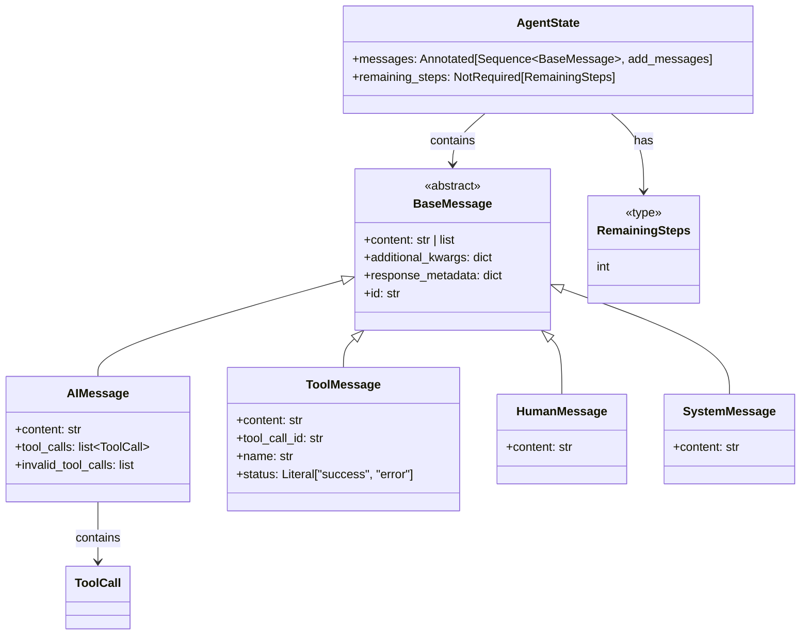
```mermaid
classDiagram
    class AgentState {
        +messages: Annotated[Sequence~BaseMessage~, add_messages]
        +remaining_steps: NotRequired[RemainingSteps]
    }
    
    class BaseMessage {
        <<abstract>>
        +content: str | list
        +additional_kwargs: dict
        +response_metadata: dict
        +id: str
    }
    
    class AIMessage {
        +content: str
        +tool_calls: list~ToolCall~
        +invalid_tool_calls: list
    }
    
    class ToolMessage {
        +content: str
        +tool_call_id: str
        +name: str
        +status: Literal["success", "error"]
    }
    
    class HumanMessage {
        +content: str
    }
    
    class SystemMessage {
        +content: str
    }
    
    class RemainingSteps {
        <<type>>
        int
    }
    
    AgentState --> BaseMessage : contains
    BaseMessage <|-- AIMessage
    BaseMessage <|-- ToolMessage
    BaseMessage <|-- HumanMessage
    BaseMessage <|-- SystemMessage
    AIMessage --> ToolCall : contains
    AgentState --> RemainingSteps : has
```

**字段说明**：

**messages**：消息列表

- 类型：`Annotated[Sequence[BaseMessage], add_messages]`
- 作用：存储对话历史
- Reducer：`add_messages`合并新旧消息
- 约束：必须字段，初始化时至少包含一条消息

**remaining_steps**：剩余步数

- 类型：`NotRequired[RemainingSteps]`（int）
- 作用：限制Agent的最大执行步数
- 计算：`recursion_limit - current_step`
- 默认：25（在AgentStatePydantic中）
- 约束：当remaining_steps < 2且有tool_calls时，返回错误消息

**版本演进**：

- v0.1：仅包含messages
- v0.2：添加remaining_steps，防止无限循环
- 未来：可能添加context、metadata等字段

### 2.2 AgentStateWithStructuredResponse

```python
class AgentStateWithStructuredResponse(AgentState):
    """带结构化响应的Agent状态"""
    
    structured_response: StructuredResponse
```

**UML类图**：

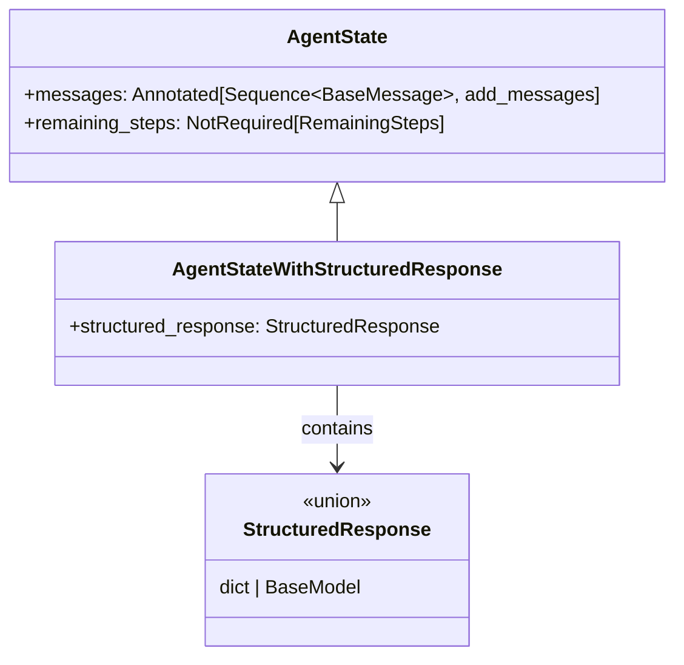
```mermaid
classDiagram
    class AgentState {
        +messages: Annotated[Sequence~BaseMessage~, add_messages]
        +remaining_steps: NotRequired[RemainingSteps]
    }
    
    class AgentStateWithStructuredResponse {
        +structured_response: StructuredResponse
    }
    
    class StructuredResponse {
        <<union>>
        dict | BaseModel
    }
    
    AgentState <|-- AgentStateWithStructuredResponse
    AgentStateWithStructuredResponse --> StructuredResponse : contains
```

**字段说明**：

**structured_response**：结构化响应

- 类型：`Union[dict, BaseModel]`
- 作用：存储LLM生成的结构化输出
- 使用场景：需要强制LLM返回特定格式的数据
- 生成时机：Agent循环结束后，由`structured_response`节点生成

**使用示例**：

```python
from pydantic import BaseModel

class SearchResult(BaseModel):
    title: str
    url: str
    summary: str

agent = create_react_agent(
    model=model,
    tools=tools,
    response_format=SearchResult,
)

result = agent.invoke({"messages": [{"role": "user", "content": "搜索Python"}]})
print(result["structured_response"])
# SearchResult(title="Python官网", url="https://python.org", summary="...")
```

### 2.3 ToolCall

```python
class ToolCall(TypedDict):
    """工具调用结构"""
    
    name: str
    args: dict[str, Any]
    id: str
    type: Literal["tool_call"]
```

**UML类图**：

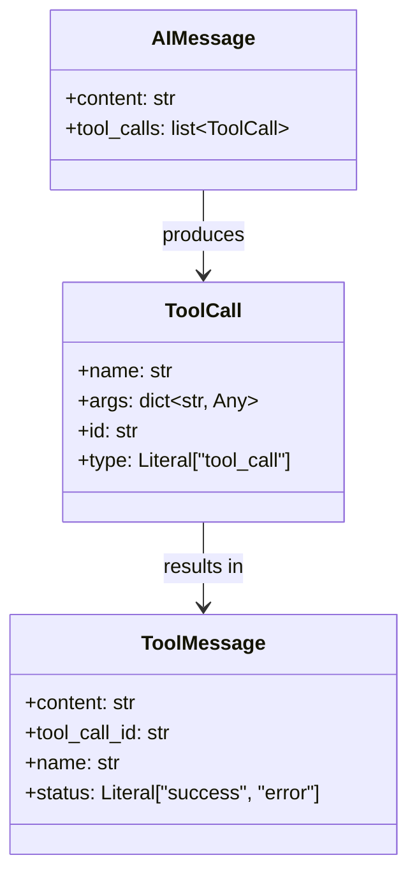
```mermaid
classDiagram
    class ToolCall {
        +name: str
        +args: dict~str, Any~
        +id: str
        +type: Literal["tool_call"]
    }
    
    class AIMessage {
        +content: str
        +tool_calls: list~ToolCall~
    }
    
    class ToolMessage {
        +content: str
        +tool_call_id: str
        +name: str
        +status: Literal["success", "error"]
    }
    
    AIMessage --> ToolCall : produces
    ToolCall --> ToolMessage : results in
```

**字段说明**：

**name**：工具名称

- 类型：`str`
- 作用：标识要调用的工具
- 约束：必须在tools列表中存在
- 示例：`"search"`、`"calculator"`

**args**：工具参数

- 类型：`dict[str, Any]`
- 作用：工具调用的参数
- 约束：必须与工具的参数schema匹配
- 示例：`{"query": "Python", "max_results": 10}`

**id**：调用ID

- 类型：`str`
- 作用：唯一标识一次工具调用
- 约束：必须唯一，用于匹配ToolMessage
- 示例：`"call_abc123"`

**type**：类型标记

- 类型：`Literal["tool_call"]`
- 作用：标识这是一个工具调用
- 约束：固定为`"tool_call"`

**关系说明**：

1. LLM在AIMessage中生成tool_calls
2. ToolNode执行tool_calls
3. 每个tool_call产生一个ToolMessage
4. ToolMessage.tool_call_id对应ToolCall.id

### 2.4 InjectedState 和 InjectedStore

```python
class InjectedState:
    """状态注入标记"""
    pass

class InjectedStore:
    """存储注入标记"""
    pass
```

**UML类图**：

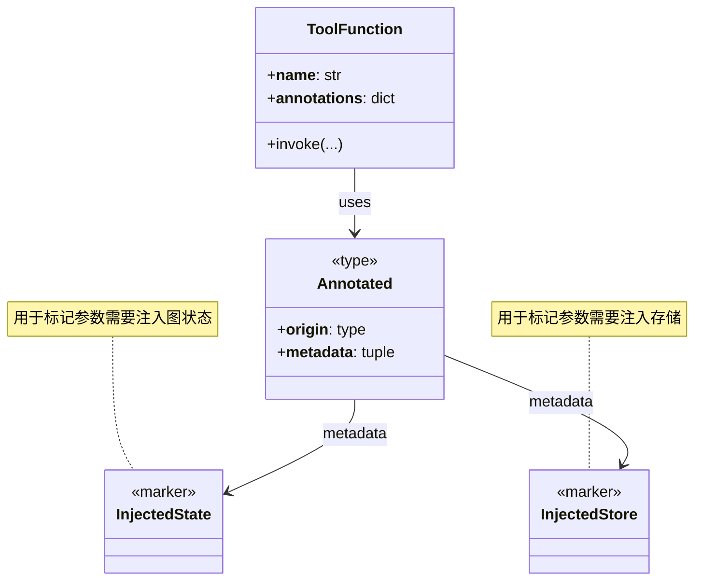
```mermaid
classDiagram
    class InjectedState {
        <<marker>>
    }
    
    class InjectedStore {
        <<marker>>
    }
    
    class ToolFunction {
        +__name__: str
        +__annotations__: dict
        +invoke(...)
    }
    
    class Annotated {
        <<type>>
        +__origin__: type
        +__metadata__: tuple
    }
    
    ToolFunction --> Annotated : uses
    Annotated --> InjectedState : metadata
    Annotated --> InjectedStore : metadata
    
    note for InjectedState "用于标记参数需要注入图状态"
    note for InjectedStore "用于标记参数需要注入存储"
```

**使用说明**：

**InjectedState**：注入图状态

- 使用方式：`Annotated[dict, InjectedState]`
- 注入内容：当前图状态（包含messages等）
- 访问权限：只读，修改不会影响图状态

**InjectedStore**：注入存储

- 使用方式：`Annotated[BaseStore, InjectedStore]`
- 注入内容：BaseStore实例
- 访问权限：读写，可以持久化数据

**使用示例**：

```python
from langgraph.prebuilt import InjectedState, InjectedStore
from typing import Annotated

@tool
def my_tool(
    query: str,
    state: Annotated[dict, InjectedState],
    store: Annotated[BaseStore, InjectedStore],
) -> str:
    """工具函数，自动注入state和store"""
    
    # 访问图状态
    user_id = state.get("user_id")
    messages = state.get("messages", [])
    
    # 访问存储
    user_prefs = store.get(("users", user_id), "preferences")
    
    # 保存数据
    store.put(
        namespace=("logs", user_id),
        key="last_query",
        value={"query": query, "timestamp": datetime.now()},
    )
    
    return f"搜索 {query} for user {user_id}"
```

**注入机制**：

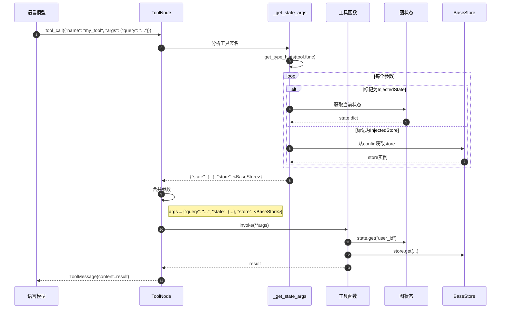
```mermaid
sequenceDiagram
    autonumber
    participant LLM as 语言模型
    participant ToolNode as ToolNode
    participant Inspect as _get_state_args
    participant Tool as 工具函数
    participant State as 图状态
    participant Store as BaseStore
    
    LLM->>ToolNode: tool_call({"name": "my_tool", "args": {"query": "..."}})
    
    ToolNode->>Inspect: 分析工具签名
    Inspect->>Inspect: get_type_hints(tool.func)
    
    loop 每个参数
        alt 标记为InjectedState
            Inspect->>State: 获取当前状态
            State-->>Inspect: state dict
        else 标记为InjectedStore
            Inspect->>Store: 从config获取store
            Store-->>Inspect: store实例
        end
    end
    
    Inspect-->>ToolNode: {"state": {...}, "store": <BaseStore>}
    
    ToolNode->>ToolNode: 合并参数
    Note right of ToolNode: args = {"query": "...", "state": {...}, "store": <BaseStore>}
    
    ToolNode->>Tool: invoke(**args)
    Tool->>State: state.get("user_id")
    Tool->>Store: store.get(...)
    Tool-->>ToolNode: result
    
    ToolNode-->>LLM: ToolMessage(content=result)
```

### 2.5 RetryPolicy

```python
class RetryPolicy(TypedDict, total=False):
    """重试策略配置"""
    
    max_attempts: int
    backoff_factor: float
    jitter: bool
    retry_on: tuple[type[Exception], ...]
```

**UML类图**：

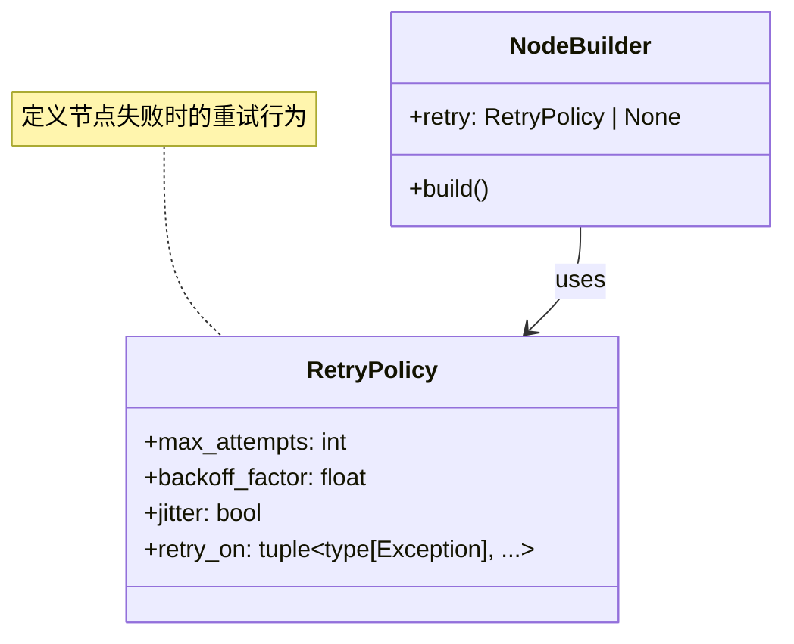
```mermaid
classDiagram
    class RetryPolicy {
        +max_attempts: int
        +backoff_factor: float
        +jitter: bool
        +retry_on: tuple~type[Exception], ...~
    }
    
    class NodeBuilder {
        +retry: RetryPolicy | None
        +build()
    }
    
    NodeBuilder --> RetryPolicy : uses
    
    note for RetryPolicy "定义节点失败时的重试行为"
```

**字段说明**：

**max_attempts**：最大尝试次数

- 类型：`int`
- 默认：3
- 作用：包含首次尝试，最多尝试几次
- 示例：max_attempts=3表示首次+2次重试

**backoff_factor**：退避因子

- 类型：`float`
- 默认：2.0
- 作用：每次重试的等待时间倍数
- 计算：wait_time = backoff_factor ** (attempt - 1)

**jitter**：随机抖动

- 类型：`bool`
- 默认：True
- 作用：在等待时间上添加随机抖动，避免雷鸣羊群效应

**retry_on**：可重试异常

- 类型：`tuple[type[Exception], ...]`
- 默认：`(Exception,)`
- 作用：只有这些异常会触发重试
- 示例：`(TimeoutError, ConnectionError)`

**使用示例**：

```python
from langgraph.prebuilt import create_react_agent

retry_policy = {
    "max_attempts": 5,
    "backoff_factor": 2.0,
    "jitter": True,
    "retry_on": (TimeoutError, ConnectionError),
}

agent = create_react_agent(
    model=model,
    tools=tools,
    retry_policy=retry_policy,
)
```

## 三、消息类型

### 3.1 BaseMessage及其子类

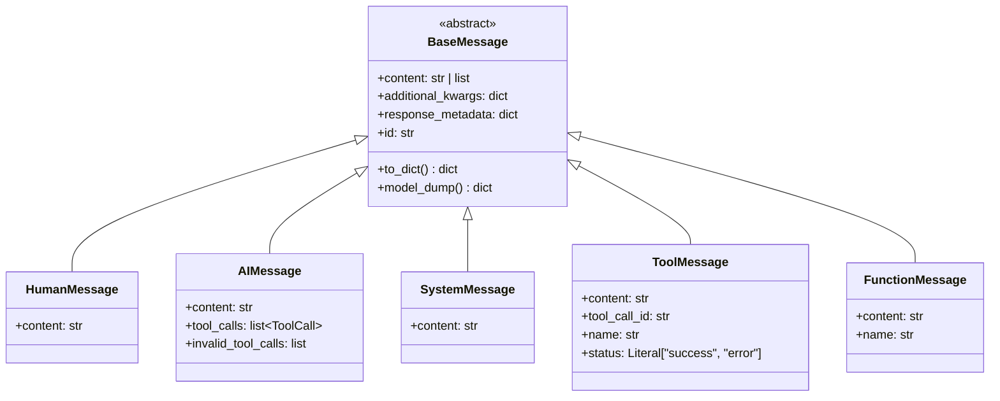
```mermaid
classDiagram
    class BaseMessage {
        <<abstract>>
        +content: str | list
        +additional_kwargs: dict
        +response_metadata: dict
        +id: str
        +to_dict() dict
        +model_dump() dict
    }
    
    class HumanMessage {
        +content: str
    }
    
    class AIMessage {
        +content: str
        +tool_calls: list~ToolCall~
        +invalid_tool_calls: list
    }
    
    class SystemMessage {
        +content: str
    }
    
    class ToolMessage {
        +content: str
        +tool_call_id: str
        +name: str
        +status: Literal["success", "error"]
    }
    
    class FunctionMessage {
        +content: str
        +name: str
    }
    
    BaseMessage <|-- HumanMessage
    BaseMessage <|-- AIMessage
    BaseMessage <|-- SystemMessage
    BaseMessage <|-- ToolMessage
    BaseMessage <|-- FunctionMessage
```

**BaseMessage**：消息基类

- `content`：消息内容，可以是字符串或内容块列表
- `additional_kwargs`：额外的模型特定参数
- `response_metadata`：响应元数据
- `id`：消息唯一ID

**HumanMessage**：用户消息

- 表示来自用户的输入
- 通常是对话的起点

**AIMessage**：AI消息

- 表示LLM生成的响应
- `tool_calls`：LLM决定调用的工具列表
- `invalid_tool_calls`：解析失败的工具调用

**SystemMessage**：系统消息

- 表示系统提示词
- 通常放在消息列表开头

**ToolMessage**：工具消息

- 表示工具执行的结果
- `tool_call_id`：对应的tool_call的id
- `name`：工具名称
- `status`：执行状态（success或error）

**FunctionMessage**：函数消息（已废弃）

- OpenAI旧版API的函数调用结果
- 建议使用ToolMessage替代

### 3.2 消息流转

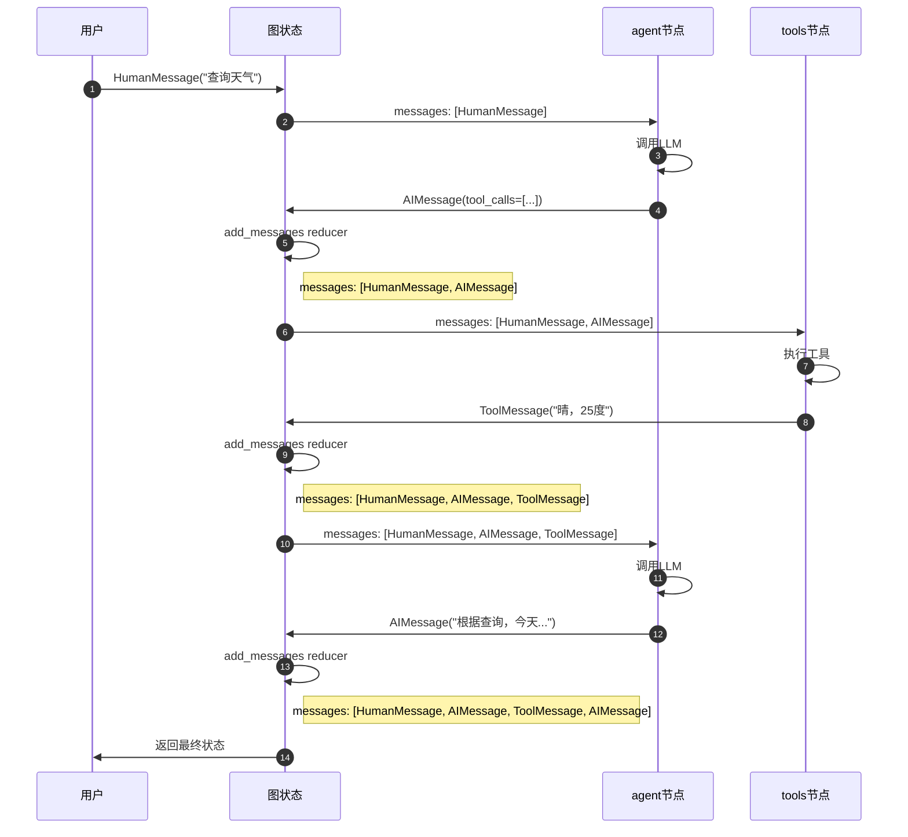
```mermaid
sequenceDiagram
    autonumber
    participant User as 用户
    participant State as 图状态
    participant Agent as agent节点
    participant Tools as tools节点
    
    User->>State: HumanMessage("查询天气")
    State->>Agent: messages: [HumanMessage]
    
    Agent->>Agent: 调用LLM
    Agent->>State: AIMessage(tool_calls=[...])
    State->>State: add_messages reducer
    Note right of State: messages: [HumanMessage, AIMessage]
    
    State->>Tools: messages: [HumanMessage, AIMessage]
    Tools->>Tools: 执行工具
    Tools->>State: ToolMessage("晴，25度")
    State->>State: add_messages reducer
    Note right of State: messages: [HumanMessage, AIMessage, ToolMessage]
    
    State->>Agent: messages: [HumanMessage, AIMessage, ToolMessage]
    Agent->>Agent: 调用LLM
    Agent->>State: AIMessage("根据查询，今天...")
    State->>State: add_messages reducer
    Note right of State: messages: [HumanMessage, AIMessage, ToolMessage, AIMessage]
    
    State->>User: 返回最终状态
```

## 四、配置结构

### 4.1 RunnableConfig

```python
class RunnableConfig(TypedDict, total=False):
    """运行时配置"""
    
    tags: list[str]
    metadata: dict[str, Any]
    callbacks: Callbacks
    run_name: str
    max_concurrency: int | None
    recursion_limit: int
    configurable: dict[str, Any]
```

**UML类图**：

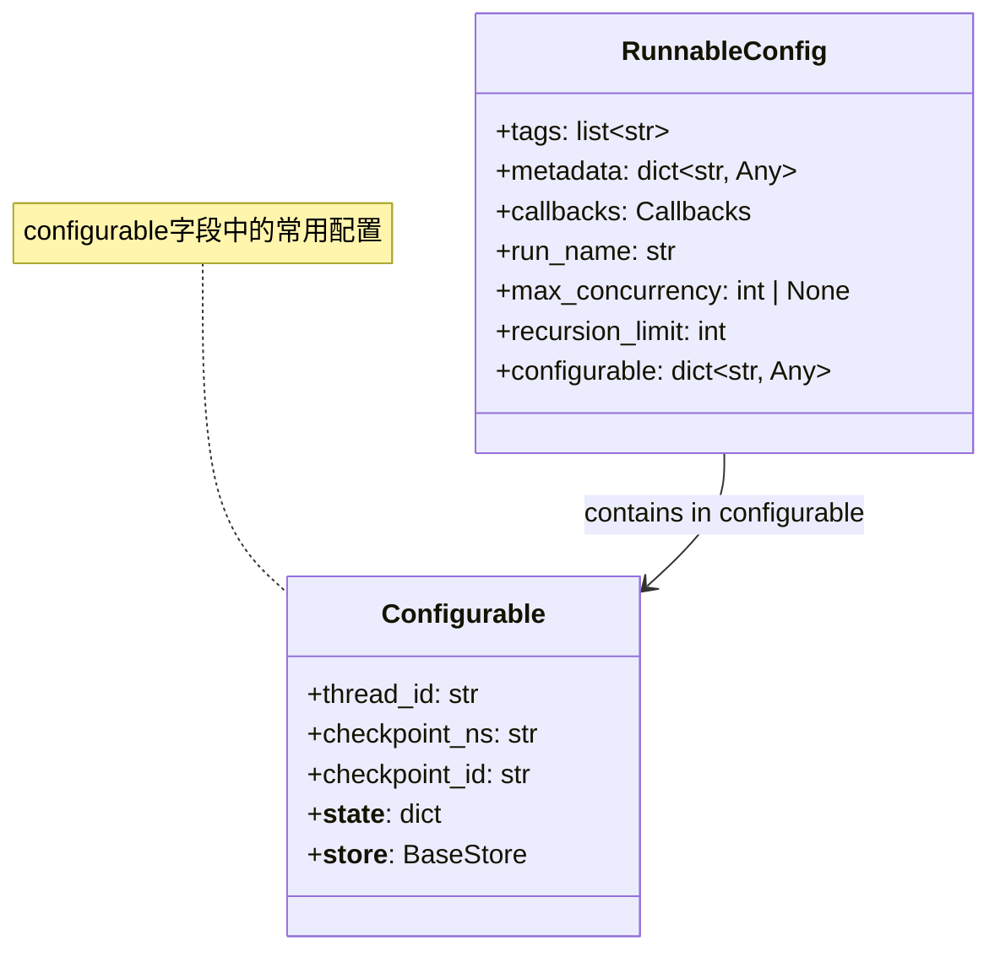
```mermaid
classDiagram
    class RunnableConfig {
        +tags: list~str~
        +metadata: dict~str, Any~
        +callbacks: Callbacks
        +run_name: str
        +max_concurrency: int | None
        +recursion_limit: int
        +configurable: dict~str, Any~
    }
    
    class Configurable {
        +thread_id: str
        +checkpoint_ns: str
        +checkpoint_id: str
        +__state__: dict
        +__store__: BaseStore
    }
    
    RunnableConfig --> Configurable : contains in configurable
    
    note for Configurable "configurable字段中的常用配置"
```

**字段说明**：

**tags**：标签

- 用于过滤和追踪运行
- 示例：`["langchain:agent", "production"]`

**metadata**：元数据

- 任意附加信息
- 示例：`{"user_id": "123", "session": "abc"}`

**callbacks**：回调函数

- 用于监控执行过程
- 示例：LangSmith回调、自定义日志

**run_name**：运行名称

- 用于标识这次运行
- 在LangSmith中显示

**max_concurrency**：最大并发

- 限制并发执行的任务数
- None表示不限制

**recursion_limit**：递归限制

- 图的最大执行步数
- 默认：25

**configurable**：可配置项

- `thread_id`：线程ID，用于检查点
- `checkpoint_ns`：检查点命名空间
- `checkpoint_id`：检查点ID
- `__state__`：内部使用，当前图状态
- `__store__`：内部使用，存储实例

### 4.2 使用示例

```python
config = {
    "tags": ["production", "user-123"],
    "metadata": {"user_id": "123", "session": "abc"},
    "run_name": "查询天气",
    "recursion_limit": 50,
    "configurable": {
        "thread_id": "user-123-session-abc",
    },
}

result = agent.invoke({"messages": [...]}, config)
```

## 五、工具相关结构

### 5.1 BaseTool

```python
class BaseTool(BaseModel, Runnable):
    """工具基类"""
    
    name: str
    description: str
    args_schema: type[BaseModel] | None = None
    
    def invoke(
        self,
        input: Union[str, dict, BaseModel],
        config: RunnableConfig | None = None,
    ) -> Any:
        """执行工具"""
        ...
    
    async def ainvoke(
        self,
        input: Union[str, dict, BaseModel],
        config: RunnableConfig | None = None,
    ) -> Any:
        """异步执行工具"""
        ...
```

**UML类图**：

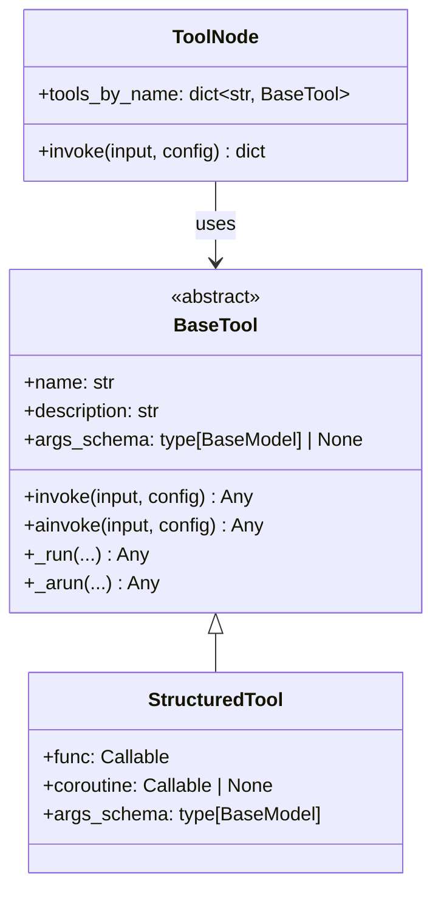
```mermaid
classDiagram
    class BaseTool {
        <<abstract>>
        +name: str
        +description: str
        +args_schema: type[BaseModel] | None
        +invoke(input, config) Any
        +ainvoke(input, config) Any
        +_run(...) Any
        +_arun(...) Any
    }
    
    class StructuredTool {
        +func: Callable
        +coroutine: Callable | None
        +args_schema: type[BaseModel]
    }
    
    class ToolNode {
        +tools_by_name: dict~str, BaseTool~
        +invoke(input, config) dict
    }
    
    BaseTool <|-- StructuredTool
    ToolNode --> BaseTool : uses
```

**字段说明**：

**name**：工具名称

- 必须唯一
- LLM通过name调用工具
- 示例：`"search"`、`"calculator"`

**description**：工具描述

- 向LLM解释工具的用途
- 应该清晰具体
- 示例：`"搜索互联网信息，返回相关结果"`

**args_schema**：参数schema

- Pydantic模型，定义工具参数
- 用于参数验证和生成工具spec
- None表示无参数或使用函数签名

**创建工具的方式**：

```python
# 方式1：使用@tool装饰器
from langchain_core.tools import tool

@tool
def my_tool(query: str, max_results: int = 10) -> str:
    """搜索信息"""
    return search_api(query, max_results)

# 方式2：使用StructuredTool
from langchain_core.tools import StructuredTool
from pydantic import BaseModel, Field

class SearchArgs(BaseModel):
    query: str = Field(description="搜索查询词")
    max_results: int = Field(10, description="最大结果数")

tool = StructuredTool.from_function(
    func=search_api,
    name="search",
    description="搜索信息",
    args_schema=SearchArgs,
)

# 方式3：继承BaseTool
class MyTool(BaseTool):
    name: str = "my_tool"
    description: str = "我的工具"
    
    def _run(self, query: str) -> str:
        return search_api(query)
    
    async def _arun(self, query: str) -> str:
        return await async_search_api(query)
```

## 六、数据结构关系总览

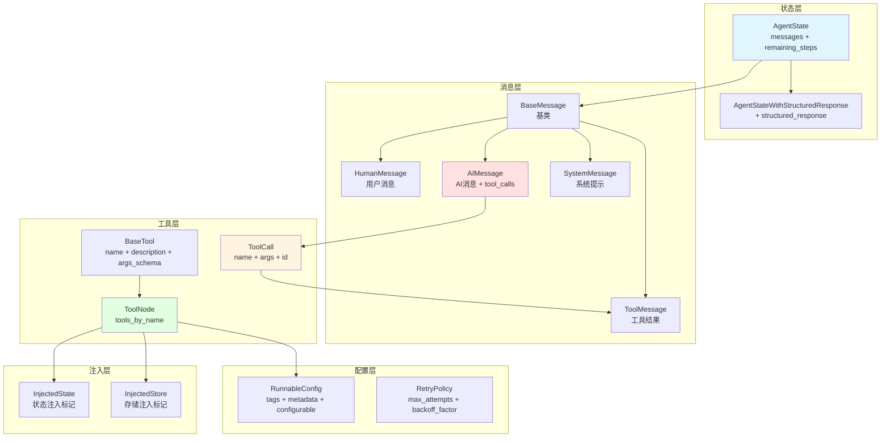
```mermaid
graph TB
    subgraph "状态层"
        AgentState[AgentState<br/>messages + remaining_steps]
        AgentStateStructured[AgentStateWithStructuredResponse<br/>+ structured_response]
        AgentState --> AgentStateStructured
    end
    
    subgraph "消息层"
        BaseMessage[BaseMessage<br/>基类]
        HumanMsg[HumanMessage<br/>用户消息]
        AIMsg[AIMessage<br/>AI消息 + tool_calls]
        ToolMsg[ToolMessage<br/>工具结果]
        SysMsg[SystemMessage<br/>系统提示]
        
        BaseMessage --> HumanMsg
        BaseMessage --> AIMsg
        BaseMessage --> ToolMsg
        BaseMessage --> SysMsg
    end
    
    subgraph "工具层"
        ToolCall[ToolCall<br/>name + args + id]
        BaseTool[BaseTool<br/>name + description + args_schema]
        ToolNode[ToolNode<br/>tools_by_name]
        
        BaseTool --> ToolNode
        ToolCall --> ToolMsg
    end
    
    subgraph "配置层"
        RunnableConfig[RunnableConfig<br/>tags + metadata + configurable]
        RetryPolicy[RetryPolicy<br/>max_attempts + backoff_factor]
    end
    
    subgraph "注入层"
        InjectedState[InjectedState<br/>状态注入标记]
        InjectedStore[InjectedStore<br/>存储注入标记]
    end
    
    AgentState --> BaseMessage
    AIMsg --> ToolCall
    ToolNode --> RunnableConfig
    ToolNode --> InjectedState
    ToolNode --> InjectedStore
    
    style AgentState fill:#e1f5ff
    style AIMsg fill:#ffe1e1
    style ToolCall fill:#fff4e1
    style ToolNode fill:#e1ffe1
```

## 七、数据结构演进

### 7.1 v1 vs v2

**v1版本（2023）**：

- 仅包含`messages`
- 无步数限制
- 简单的消息累积

**v2版本（2024）**：

- 添加`remaining_steps`
- 支持结构化响应
- 支持状态注入
- 更丰富的配置选项

**未来演进方向**：

- 更细粒度的状态控制
- 更强大的工具能力
- 更好的类型安全性

### 7.2 兼容性

**向后兼容**：

- 旧版状态仍然支持
- 新字段都是可选的
- API保持稳定

**最佳实践**：

- 使用TypedDict定义状态
- 使用Pydantic定义工具参数
- 使用类型提示提高代码质量

## 八、总结

prebuilt模块的数据结构设计体现了以下原则：

1. **类型安全**：广泛使用TypedDict和Pydantic
2. **可扩展**：状态和配置都支持扩展
3. **简洁**：核心结构简单明了
4. **向后兼容**：新功能不破坏旧代码

通过理解这些数据结构，可以更好地使用prebuilt模块构建Agent应用。

---

## 时序图

## 一、时序图总览

本文档提供prebuilt模块各个场景的详细时序图，涵盖：

1. **Agent创建流程**：create_react_agent的完整执行过程
2. **ReAct循环执行**：Agent运行时的完整流程
3. **工具并行执行**：ToolNode如何并行执行多个工具
4. **状态注入机制**：InjectedState和InjectedStore的工作原理
5. **检查点保存与恢复**：持久化和恢复Agent状态
6. **人工审批流程**：interrupt实现人工介入
7. **结构化响应生成**：response_format的处理流程

## 二、Agent创建流程

### 2.1 完整创建时序图

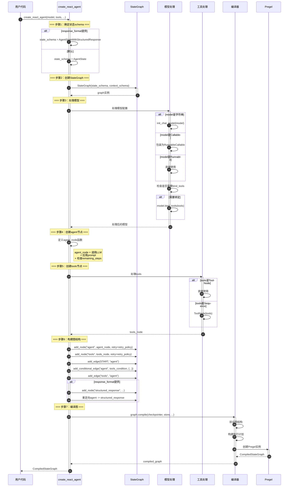
```mermaid
sequenceDiagram
    autonumber
    participant User as 用户代码
    participant API as create_react_agent
    participant Graph as StateGraph
    participant Model as 模型处理
    participant Tools as 工具处理
    participant Compile as 编译器
    participant Pregel as Pregel
    
    User->>API: create_react_agent(model, tools, ...)
    
    activate API
    
    Note over API: === 步骤1：确定状态schema ===
    alt response_format提供
        API->>API: state_schema = AgentStateWithStructuredResponse
    else 默认
        API->>API: state_schema = AgentState
    end
    
    Note over API: === 步骤2：创建StateGraph ===
    API->>Graph: StateGraph(state_schema, context_schema)
    activate Graph
    Graph-->>API: graph实例
    deactivate Graph
    
    Note over API: === 步骤3：处理模型 ===
    API->>Model: 处理模型配置
    activate Model
    
    alt model是字符串
        Model->>Model: init_chat_model(model)
    else model是Callable
        Model->>Model: 包装为RunnableCallable
    else model是Runnable
        Model->>Model: 直接使用
    end
    
    Model->>Model: 检查是否需要bind_tools
    alt 需要绑定
        Model->>Model: model.bind_tools(tools)
    end
    
    Model-->>API: 处理后的模型
    deactivate Model
    
    Note over API: === 步骤4：创建agent节点 ===
    API->>API: 定义agent_node函数
    Note right of API: agent_node = 调用LLM<br/>+ 应用prompt<br/>+ 检查remaining_steps
    
    Note over API: === 步骤5：创建tools节点 ===
    API->>Tools: 处理tools
    activate Tools
    
    alt tools是ToolNode
        Tools->>Tools: 直接使用
    else tools是Sequence
        Tools->>Tools: ToolNode(tools)
    end
    
    Tools-->>API: tools_node
    deactivate Tools
    
    Note over API: === 步骤6：构建图结构 ===
    API->>Graph: add_node("agent", agent_node, retry=retry_policy)
    API->>Graph: add_node("tools", tools_node, retry=retry_policy)
    
    API->>Graph: add_edge(START, "agent")
    API->>Graph: add_conditional_edge("agent", tools_condition, {...})
    API->>Graph: add_edge("tools", "agent")
    
    alt response_format提供
        API->>Graph: add_node("structured_response", ...)
        API->>Graph: 重定向agent -> structured_response
    end
    
    Note over API: === 步骤7：编译图 ===
    API->>Compile: graph.compile(checkpointer, store, ...)
    activate Compile
    
    Compile->>Compile: 验证图结构
    Compile->>Compile: 构建执行计划
    Compile->>Pregel: 创建Pregel实例
    activate Pregel
    Pregel-->>Compile: CompiledStateGraph
    deactivate Pregel
    
    Compile-->>API: compiled_graph
    deactivate Compile
    
    API-->>User: CompiledStateGraph
    deactivate API
```

### 2.2 文字说明

#### 2.2.1 图意概述

该时序图展示了`create_react_agent`函数的完整执行流程，从用户调用到返回编译后的图。核心步骤包括状态schema确定、图结构创建、模型和工具处理、节点添加、边连接以及最终编译。

#### 2.2.2 关键步骤

**状态schema确定**：

- 根据是否提供`response_format`选择状态类型
- `AgentState`：标准状态（messages + remaining_steps）
- `AgentStateWithStructuredResponse`：带结构化响应的状态

**模型处理**：

- 字符串ID：使用`init_chat_model`初始化
- Callable：包装为RunnableCallable支持动态选择
- Runnable：直接使用
- 自动检测并绑定工具（bind_tools）

**节点创建**：

- `agent`节点：调用LLM，应用prompt，检查remaining_steps
- `tools`节点：执行工具调用
- 可选`structured_response`节点：生成结构化输出

**图结构**：

- START → agent：开始执行
- agent → tools（条件边）：有tool_calls时
- agent → END（条件边）：无tool_calls时
- tools → agent：工具执行后继续

#### 2.2.3 边界与异常

**参数验证**：

- model必须是有效的模型或Callable
- tools必须是BaseTool序列或ToolNode
- state_schema必须包含messages字段

**工具绑定**：

- 如果模型已绑定工具，验证工具列表一致性
- 不支持bind_tools的模型会跳过绑定

**编译失败**：

- 图结构不完整（缺少节点或边）
- 循环引用
- 节点名称冲突

#### 2.2.4 性能考虑

**创建开销**：

- 一次性开销，通常<100ms
- 模型初始化可能较慢（特别是远程模型）
- 建议复用创建的agent实例

**内存占用**：

- 图结构：通常<1MB
- 模型：取决于模型类型（本地模型可能很大）
- 建议使用单例模式管理agent实例

#### 2.2.5 版本兼容

**v1 vs v2**：

- v1：简单的agent → tools → agent循环
- v2：支持pre_model_hook、post_model_hook、Send API
- 默认使用v2，可通过`version="v1"`切换

## 三、ReAct循环执行

### 3.1 标准执行流程

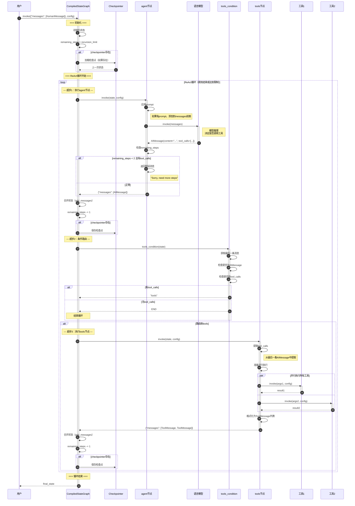
```mermaid
sequenceDiagram
    autonumber
    participant User as 用户
    participant Pregel as CompiledStateGraph
    participant Checkpoint as Checkpointer
    participant Agent as agent节点
    participant LLM as 语言模型
    participant Condition as tools_condition
    participant Tools as tools节点
    participant Tool1 as 工具1
    participant Tool2 as 工具2
    
    User->>Pregel: invoke({"messages": [HumanMessage]}, config)
    activate Pregel
    
    Note over Pregel: === 初始化 ===
    Pregel->>Pregel: 初始化状态
    Pregel->>Pregel: remaining_steps = recursion_limit
    
    alt checkpointer存在
        Pregel->>Checkpoint: 加载检查点（如果存在）
        Checkpoint-->>Pregel: 上一次状态
    end
    
    Note over Pregel: === ReAct循环开始 ===
    
    loop ReAct循环（直到结束或达到限制）
        
        Note over Pregel: --- 超步1：执行agent节点 ---
        Pregel->>Agent: invoke(state, config)
        activate Agent
        
        Agent->>Agent: 应用prompt
        Note right of Agent: 如果有prompt，添加到messages前面
        
        Agent->>LLM: invoke(messages)
        activate LLM
        Note right of LLM: 模型推理<br/>决定是否调用工具
        LLM-->>Agent: AIMessage(content="...", tool_calls=[...])
        deactivate LLM
        
        Agent->>Agent: 检查remaining_steps
        alt remaining_steps < 2 且有tool_calls
            Agent->>Agent: 返回错误消息
            Note right of Agent: "Sorry, need more steps"
        else 正常
            Agent-->>Pregel: {"messages": [AIMessage]}
        end
        deactivate Agent
        
        Pregel->>Pregel: 合并状态（add_messages）
        Pregel->>Pregel: remaining_steps -= 1
        
        alt checkpointer存在
            Pregel->>Checkpoint: 保存检查点
        end
        
        Note over Pregel: --- 超步2：条件路由 ---
        Pregel->>Condition: tools_condition(state)
        activate Condition
        
        Condition->>Condition: 获取最后一条消息
        Condition->>Condition: 检查是否为AIMessage
        Condition->>Condition: 检查是否有tool_calls
        
        alt 有tool_calls
            Condition-->>Pregel: "tools"
        else 无tool_calls
            Condition-->>Pregel: END
            Note over Pregel: 结束循环
        end
        deactivate Condition
        
        alt 路由到tools
            Note over Pregel: --- 超步3：执行tools节点 ---
            Pregel->>Tools: invoke(state, config)
            activate Tools
            
            Tools->>Tools: 提取tool_calls
            Note right of Tools: 从最后一条AIMessage中提取
            
            Tools->>Tools: 准备并行执行
            
            par 并行执行所有工具
                Tools->>Tool1: invoke(args1, config)
                activate Tool1
                Tool1-->>Tools: result1
                deactivate Tool1
            and
                Tools->>Tool2: invoke(args2, config)
                activate Tool2
                Tool2-->>Tools: result2
                deactivate Tool2
            end
            
            Tools->>Tools: 格式化为ToolMessage列表
            Tools-->>Pregel: {"messages": [ToolMessage, ToolMessage]}
            deactivate Tools
            
            Pregel->>Pregel: 合并状态（add_messages）
            Pregel->>Pregel: remaining_steps -= 1
            
            alt checkpointer存在
                Pregel->>Checkpoint: 保存检查点
            end
        end
        
    end
    
    Note over Pregel: === 循环结束 ===
    
    Pregel-->>User: final_state
    deactivate Pregel
```

### 3.2 文字说明

#### 3.2.1 图意概述

该时序图展示了ReAct Agent的完整执行流程，包括agent节点调用LLM、条件路由判断、tools节点并行执行工具的循环过程。每个"超步"（superstep）都会更新状态和remaining_steps，并可选地保存检查点。

#### 3.2.2 关键概念

**超步（Superstep）**：

- Pregel算法的基本执行单元
- 每个超步执行一个或多个节点
- 超步之间保存状态快照

**ReAct循环**：

1. **Reasoning**：LLM推理，决定调用哪些工具
2. **Acting**：执行工具调用
3. **循环**：将工具结果反馈给LLM，继续推理

**remaining_steps**：

- 初始值：`recursion_limit`（默认25）
- 每个超步递减
- <2且有tool_calls时返回错误

#### 3.2.3 边界与异常

**递归限制**：

- remaining_steps < 2时，拒绝新的工具调用
- 防止无限循环
- 返回友好的错误消息而非抛出异常

**工具执行失败**：

- ToolNode捕获异常
- 返回ToolMessage with status="error"
- LLM可以看到错误信息并重试

**模型调用失败**：

- 使用RetryPolicy自动重试
- 最终失败会抛出异常
- checkpointer会保存失败前的状态

#### 3.2.4 性能考虑

**并行执行**：

- 同一AIMessage中的所有tool_calls并行执行
- 使用ThreadPoolExecutor或asyncio
- 显著减少总执行时间

**检查点开销**：

- 每个超步保存一次
- 序列化/反序列化成本
- 可以禁用checkpointer提高性能

**LLM调用**：

- 主要性能瓶颈
- 建议使用流式输出改善用户体验
- 考虑使用缓存减少重复调用

#### 3.2.5 兼容性

**v1 vs v2**：

- v1：所有tool_calls在一个超步中执行
- v2：每个tool_call可以是独立的超步（使用Send API）
- v2提供更细粒度的控制和可观测性

## 四、工具并行执行

### 4.1 ToolNode详细执行流程

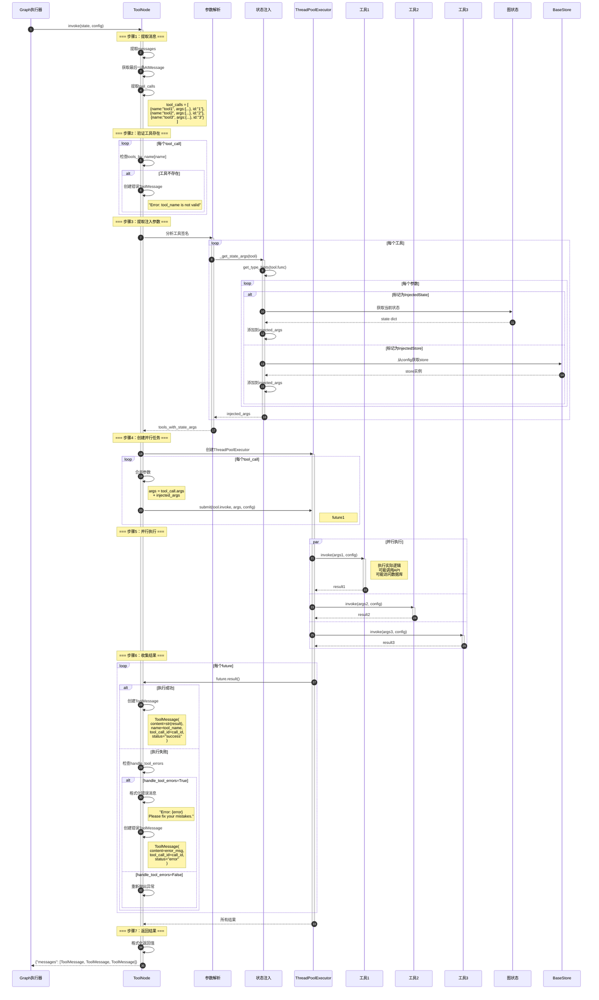
```mermaid
sequenceDiagram
    autonumber
    participant Pregel as Graph执行器
    participant ToolNode as ToolNode
    participant Parse as 参数解析
    participant Inject as 状态注入
    participant Executor as ThreadPoolExecutor
    participant Tool1 as 工具1
    participant Tool2 as 工具2
    participant Tool3 as 工具3
    participant State as 图状态
    participant Store as BaseStore
    
    Pregel->>ToolNode: invoke(state, config)
    activate ToolNode
    
    Note over ToolNode: === 步骤1：提取消息 ===
    ToolNode->>ToolNode: 提取messages
    ToolNode->>ToolNode: 获取最后一条AIMessage
    ToolNode->>ToolNode: 提取tool_calls
    Note right of ToolNode: tool_calls = [<br/>  {name:"tool1", args:{...}, id:"1"},<br/>  {name:"tool2", args:{...}, id:"2"},<br/>  {name:"tool3", args:{...}, id:"3"}<br/>]
    
    Note over ToolNode: === 步骤2：验证工具存在 ===
    loop 每个tool_call
        ToolNode->>ToolNode: 检查tools_by_name[name]
        alt 工具不存在
            ToolNode->>ToolNode: 创建错误ToolMessage
            Note right of ToolNode: "Error: tool_name is not valid"
        end
    end
    
    Note over ToolNode: === 步骤3：提取注入参数 ===
    ToolNode->>Parse: 分析工具签名
    activate Parse
    
    loop 每个工具
        Parse->>Inject: _get_state_args(tool)
        activate Inject
        
        Inject->>Inject: get_type_hints(tool.func)
        
        loop 每个参数
            alt 标记为InjectedState
                Inject->>State: 获取当前状态
                State-->>Inject: state dict
                Inject->>Inject: 添加到injected_args
            else 标记为InjectedStore
                Inject->>Store: 从config获取store
                Store-->>Inject: store实例
                Inject->>Inject: 添加到injected_args
            end
        end
        
        Inject-->>Parse: injected_args
        deactivate Inject
    end
    
    Parse-->>ToolNode: tools_with_state_args
    deactivate Parse
    
    Note over ToolNode: === 步骤4：创建并行任务 ===
    ToolNode->>Executor: 创建ThreadPoolExecutor
    activate Executor
    
    loop 每个tool_call
        ToolNode->>ToolNode: 合并参数
        Note right of ToolNode: args = tool_call.args<br/>        + injected_args
        
        ToolNode->>Executor: submit(tool.invoke, args, config)
        Note right of Executor: future1
    end
    
    Note over ToolNode: === 步骤5：并行执行 ===
    par 并行执行
        Executor->>Tool1: invoke(args1, config)
        activate Tool1
        Note right of Tool1: 执行实际逻辑<br/>可能调用API<br/>可能访问数据库
        Tool1-->>Executor: result1
        deactivate Tool1
    and
        Executor->>Tool2: invoke(args2, config)
        activate Tool2
        Tool2-->>Executor: result2
        deactivate Tool2
    and
        Executor->>Tool3: invoke(args3, config)
        activate Tool3
        Tool3-->>Executor: result3
        deactivate Tool3
    end
    
    Note over ToolNode: === 步骤6：收集结果 ===
    loop 每个future
        Executor->>ToolNode: future.result()
        
        alt 执行成功
            ToolNode->>ToolNode: 创建ToolMessage
            Note right of ToolNode: ToolMessage(<br/>  content=str(result),<br/>  name=tool_name,<br/>  tool_call_id=call_id,<br/>  status="success"<br/>)
        else 执行失败
            ToolNode->>ToolNode: 检查handle_tool_errors
            
            alt handle_tool_errors=True
                ToolNode->>ToolNode: 格式化错误消息
                Note right of ToolNode: "Error: {error}<br/>Please fix your mistakes."
                ToolNode->>ToolNode: 创建错误ToolMessage
                Note right of ToolNode: ToolMessage(<br/>  content=error_msg,<br/>  tool_call_id=call_id,<br/>  status="error"<br/>)
            else handle_tool_errors=False
                ToolNode->>ToolNode: 重新抛出异常
            end
        end
    end
    
    Executor-->>ToolNode: 所有结果
    deactivate Executor
    
    Note over ToolNode: === 步骤7：返回结果 ===
    ToolNode->>ToolNode: 格式化返回值
    ToolNode-->>Pregel: {"messages": [ToolMessage, ToolMessage, ToolMessage]}
    deactivate ToolNode
```

### 4.2 文字说明

#### 4.2.1 图意概述

该时序图详细展示了ToolNode如何并行执行多个工具调用，包括参数解析、状态注入、并行执行、错误处理和结果收集的完整流程。

#### 4.2.2 关键步骤

**消息提取**：

- 从state中获取messages
- 找到最后一条AIMessage
- 提取其中的tool_calls列表

**工具验证**：

- 检查每个tool_call的name是否在tools_by_name中
- 不存在的工具生成错误ToolMessage
- 继续执行其他有效工具

**状态注入**：

- 使用`get_type_hints`分析工具签名
- 检测`Annotated[..., InjectedState]`和`Annotated[..., InjectedStore]`
- 从config中获取对应的值
- 合并到tool_call.args中

**并行执行**：

- 使用ThreadPoolExecutor创建线程池
- 为每个tool_call提交一个任务
- 并发执行所有任务
- 等待所有future完成

**错误处理**：

- 每个工具的异常独立处理
- 不影响其他工具的执行
- 根据handle_tool_errors策略决定行为

#### 4.2.3 边界与约束

**并发限制**：

- ThreadPoolExecutor默认并发数：min(32, os.cpu_count() + 4)
- 可以通过config.max_concurrency限制
- 过多并发可能导致资源耗尽

**工具约束**：

- 工具必须是线程安全的（同步工具）
- 或使用异步工具避免GIL限制
- 不建议在工具中使用全局状态

**注入限制**：

- InjectedState是只读的（副本）
- InjectedStore必须在config中存在
- 注入的参数不会出现在tool_calls中

#### 4.2.4 异常处理

**工具不存在**：

```python
ToolMessage(
    content="Error: search is not a valid tool, try one of [calculator, weather].",
    name="search",
    tool_call_id="call_123",
    status="error",
)
```

**工具执行失败**：

```python
# handle_tool_errors=True
ToolMessage(
    content="Error: ConnectionError('API unavailable')\n Please fix your mistakes.",
    name="search",
    tool_call_id="call_123",
    status="error",
)

# handle_tool_errors=False
# 异常会被重新抛出，导致整个graph执行失败
```

**自定义错误处理**：

```python
def custom_handler(e: Exception) -> str:
    if isinstance(e, TimeoutError):
        return "请求超时，请稍后重试"
    return f"执行失败: {str(e)}"

tool_node = ToolNode(tools, handle_tool_errors=custom_handler)
```

#### 4.2.5 性能优化

**并行度**：

- 同步工具：受线程池大小限制
- 异步工具：可以有更高的并发（成百上千）
- 使用ainvoke充分利用异步优势

**I/O密集工具**：

- 网络请求、数据库查询：并行效果显著
- CPU密集计算：并行效果有限（GIL）
- 建议异步工具 + asyncio

**缓存**：

```python
from functools import lru_cache

@tool
@lru_cache(maxsize=1000)
def cached_search(query: str) -> str:
    """带缓存的搜索，避免重复调用"""
    return expensive_api_call(query)
```

## 五、状态注入机制

### 5.1 注入完整流程

```mermaid
sequenceDiagram
    autonumber
    participant LLM as 语言模型
    participant ToolNode as ToolNode
    participant TypeHints as 类型提示分析
    participant State as 图状态
    participant Store as BaseStore
    participant Tool as 工具函数
    
    Note over LLM,Tool: === 场景：工具需要访问图状态和存储 ===
    
    LLM->>ToolNode: AIMessage with tool_call
    Note right of LLM: {"name": "get_user_prefs",<br/>"args": {"user_id": "123"},<br/>"id": "call_abc"}
    
    activate ToolNode
    
    Note over ToolNode: === 步骤1：分析工具签名 ===
    ToolNode->>TypeHints: get_type_hints(tool.func)
    activate TypeHints
    
    Note right of TypeHints: 工具定义：<br/>def get_user_prefs(<br/>  user_id: str,<br/>  state: Annotated[dict, InjectedState],<br/>  store: Annotated[BaseStore, InjectedStore]<br/>) -> str
    
    TypeHints->>TypeHints: 遍历参数类型
    
    loop 每个参数
        TypeHints->>TypeHints: get_origin(param_type)
        
        alt 是Annotated
            TypeHints->>TypeHints: get_args(param_type)
            Note right of TypeHints: (dict, InjectedState)
            
            TypeHints->>TypeHints: 检查metadata
            
            alt InjectedState in metadata
                TypeHints->>TypeHints: 标记需要注入state
                Note right of TypeHints: param_name: "state"<br/>inject_type: "state"
            else InjectedStore in metadata
                TypeHints->>TypeHints: 标记需要注入store
                Note right of TypeHints: param_name: "store"<br/>inject_type: "store"
            end
        end
    end
    
    TypeHints-->>ToolNode: injection_map
    Note right of TypeHints: {<br/>  "state": "state",<br/>  "store": "store"<br/>}
    deactivate TypeHints
    
    Note over ToolNode: === 步骤2：获取注入值 ===
    
    alt 需要state
        ToolNode->>State: 从当前状态获取
        activate State
        
        alt state是dict
            State-->>ToolNode: state dict
        else state是BaseModel
            State->>State: model_dump()
            State-->>ToolNode: state dict
        end
        deactivate State
        
        Note right of ToolNode: state = {<br/>  "messages": [...],<br/>  "remaining_steps": 20,<br/>  "user_id": "123",<br/>  ...<br/>}
    end
    
    alt 需要store
        ToolNode->>ToolNode: config.get("configurable", {}).get("__store__")
        
        alt store存在
            ToolNode->>Store: 获取store实例
            activate Store
            Store-->>ToolNode: store
            deactivate Store
        else store不存在
            ToolNode->>ToolNode: 抛出ValueError
            Note right of ToolNode: "Store not available<br/>but required by tool"
        end
        
        Note right of ToolNode: store = <MemoryStore>
    end
    
    Note over ToolNode: === 步骤3：合并参数 ===
    ToolNode->>ToolNode: 合并tool_call.args和注入参数
    Note right of ToolNode: final_args = {<br/>  "user_id": "123",<br/>  "state": {...},<br/>  "store": <MemoryStore><br/>}
    
    Note over ToolNode: === 步骤4：调用工具 ===
    ToolNode->>Tool: invoke(**final_args)
    activate Tool
    
    Note over Tool: 工具内部可以：<br/>1. 访问state<br/>2. 读写store<br/>3. 执行业务逻辑
    
    Tool->>State: state.get("user_id")
    State-->>Tool: "123"
    
    Tool->>Store: store.get(("users", "123"), "preferences")
    activate Store
    Store->>Store: 查询命名空间
    Store-->>Tool: {"theme": "dark", "language": "zh"}
    deactivate Store
    
    Tool->>Tool: 处理业务逻辑
    Note right of Tool: prefs = state + store data<br/>result = format_preferences(prefs)
    
    Tool-->>ToolNode: result
    deactivate Tool
    
    Note over ToolNode: === 步骤5：格式化返回 ===
    ToolNode->>ToolNode: 创建ToolMessage
    ToolNode-->>LLM: ToolMessage(content=result, tool_call_id="call_abc")
    
    deactivate ToolNode
```

### 5.2 文字说明

#### 5.2.1 图意概述

该时序图展示了状态注入（InjectedState和InjectedStore）的完整工作机制，从工具签名分析、注入值获取、参数合并到最终调用的整个过程。

#### 5.2.2 关键概念

**InjectedState**：

- 标记参数需要注入图状态
- 工具可以读取图的完整状态
- 注入的是状态副本，修改不影响图

**InjectedStore**：

- 标记参数需要注入存储
- 工具可以读写持久化数据
- 支持跨会话的数据共享

**为什么需要注入**：

- LLM无法直接传递复杂对象
- 某些上下文信息不适合放在prompt中
- 工具需要访问图的内部状态

#### 5.2.3 边界与约束

**注入限制**：

- 必须使用`Annotated`类型提示
- 参数名可以任意（通过metadata识别）
- 不能同时注入多次（一个参数一个标记）

**状态副本**：

- InjectedState注入的是状态副本
- 工具修改state不会影响图状态
- 如果需要修改状态，通过返回值

**Store要求**：

- 必须在compile时提供store参数
- 或在invoke时通过config传递
- 否则工具调用会失败

#### 5.2.4 异常处理

**Store不可用**：

```python
# 工具定义需要store
@tool
def my_tool(
    query: str,
    store: Annotated[BaseStore, InjectedStore],
) -> str:
    ...

# 但创建agent时未提供store
agent = create_react_agent(model, tools)  # 缺少store参数

# 运行时会抛出异常
result = agent.invoke({"messages": [...]})
# ValueError: Store not available but required by tool 'my_tool'
```

**解决方案**：

```python
# 方案1：在compile时提供
agent = create_react_agent(model, tools, store=MemoryStore())

# 方案2：在invoke时提供
config = {"configurable": {"__store__": MemoryStore()}}
result = agent.invoke({"messages": [...]}, config)
```

#### 5.2.5 最佳实践

**状态访问**：

```python
@tool
def personalized_search(
    query: str,
    state: Annotated[dict, InjectedState],
) -> str:
    """基于用户偏好搜索"""
    # 读取用户偏好
    user_prefs = state.get("user_preferences", {})
    language = user_prefs.get("language", "en")
    
    # 使用偏好定制搜索
    return search_with_language(query, language)
```

**存储使用**：

```python
@tool
def remember_fact(
    fact: str,
    category: str,
    state: Annotated[dict, InjectedState],
    store: Annotated[BaseStore, InjectedStore],
) -> str:
    """记住一个事实"""
    user_id = state.get("user_id", "default")
    
    # 存储到用户的命名空间
    store.put(
        namespace=("facts", user_id),
        key=category,
        value={"fact": fact, "timestamp": datetime.now().isoformat()},
    )
    
    return f"已记住: {fact}"

@tool
def recall_fact(
    category: str,
    state: Annotated[dict, InjectedState],
    store: Annotated[BaseStore, InjectedStore],
) -> str:
    """回忆一个事实"""
    user_id = state.get("user_id", "default")
    
    # 从存储中读取
    item = store.get(("facts", user_id), category)
    if item:
        return item.value["fact"]
    return "没有找到相关记忆"
```

## 六、检查点保存与恢复

### 6.1 检查点机制时序图

```mermaid
sequenceDiagram
    autonumber
    participant User as 用户
    participant Agent as CompiledStateGraph
    participant Pregel as Pregel执行器
    participant Checkpoint as Checkpointer
    participant Node as 节点
    participant DB as 数据库/存储
    
    Note over User,DB: === 场景1：首次执行（无检查点） ===
    
    User->>Agent: invoke(input, config)
    Note right of User: config = {<br/>  "configurable": {<br/>    "thread_id": "user-123"<br/>  }<br/>}
    
    activate Agent
    Agent->>Pregel: 启动执行
    activate Pregel
    
    Pregel->>Checkpoint: get_tuple(config)
    activate Checkpoint
    Checkpoint->>DB: SELECT checkpoint WHERE thread_id = 'user-123'
    DB-->>Checkpoint: NULL（无检查点）
    Checkpoint-->>Pregel: None
    deactivate Checkpoint
    
    Pregel->>Pregel: 初始化状态
    Note right of Pregel: state = input<br/>checkpoint_id = uuid()
    
    loop 每个超步
        Pregel->>Node: 执行节点
        activate Node
        Node-->>Pregel: 状态更新
        deactivate Node
        
        Pregel->>Pregel: 合并状态
        
        Note over Pregel: === 保存检查点 ===
        Pregel->>Checkpoint: put(config, checkpoint, metadata)
        activate Checkpoint
        
        Note right of Checkpoint: checkpoint = {<br/>  "v": 1,<br/>  "ts": timestamp,<br/>  "id": checkpoint_id,<br/>  "channel_values": {...},<br/>  "channel_versions": {...},<br/>  "versions_seen": {...},<br/>  "pending_sends": []<br/>}
        
        Checkpoint->>DB: INSERT checkpoint
        DB-->>Checkpoint: OK
        Checkpoint-->>Pregel: checkpoint_id
        deactivate Checkpoint
    end
    
    Pregel-->>Agent: final_state
    deactivate Pregel
    Agent-->>User: result
    deactivate Agent
    
    Note over User,DB: === 场景2：恢复执行（有检查点） ===
    
    User->>Agent: invoke(new_input, config)
    Note right of User: 使用相同的thread_id
    
    activate Agent
    Agent->>Pregel: 启动执行
    activate Pregel
    
    Pregel->>Checkpoint: get_tuple(config)
    activate Checkpoint
    Checkpoint->>DB: SELECT checkpoint<br/>WHERE thread_id = 'user-123'<br/>ORDER BY ts DESC LIMIT 1
    DB-->>Checkpoint: checkpoint_data
    Checkpoint-->>Pregel: CheckpointTuple
    Note right of Checkpoint: (config, checkpoint,<br/>metadata, parent_config)
    deactivate Checkpoint
    
    Pregel->>Pregel: 反序列化状态
    Note right of Pregel: state = deserialize(checkpoint)
    
    Pregel->>Pregel: 合并new_input
    Note right of Pregel: state.messages += new_input.messages
    
    loop 继续执行
        Note over Pregel: 从上次中断的地方继续
    end
    
    Pregel-->>Agent: final_state
    deactivate Pregel
    Agent-->>User: result
    deactivate Agent
    
    Note over User,DB: === 场景3：时间旅行（访问历史） ===
    
    User->>Agent: get_state_history(config)
    activate Agent
    
    Agent->>Checkpoint: list(config)
    activate Checkpoint
    Checkpoint->>DB: SELECT * FROM checkpoints<br/>WHERE thread_id = 'user-123'<br/>ORDER BY ts DESC
    DB-->>Checkpoint: [checkpoint1, checkpoint2, ...]
    Checkpoint-->>Agent: Iterator[CheckpointTuple]
    deactivate Checkpoint
    
    Agent-->>User: 历史状态列表
    deactivate Agent
    
    Note over User,DB: === 场景4：从特定检查点恢复 ===
    
    User->>User: 选择特定检查点
    Note right of User: checkpoint_id = "abc123"
    
    User->>Agent: invoke(input, config)
    Note right of User: config = {<br/>  "configurable": {<br/>    "thread_id": "user-123",<br/>    "checkpoint_id": "abc123"<br/>  }<br/>}
    
    activate Agent
    Agent->>Pregel: 启动执行
    activate Pregel
    
    Pregel->>Checkpoint: get_tuple(config)
    activate Checkpoint
    Checkpoint->>DB: SELECT checkpoint<br/>WHERE thread_id = 'user-123'<br/>AND checkpoint_id = 'abc123'
    DB-->>Checkpoint: checkpoint_data
    Checkpoint-->>Pregel: CheckpointTuple
    deactivate Checkpoint
    
    Pregel->>Pregel: 从该检查点恢复
    Note right of Pregel: 状态回到历史某个时间点
    
    loop 继续执行
        Note over Pregel: 创建新的分支
    end
    
    Pregel-->>Agent: final_state
    deactivate Pregel
    Agent-->>User: result
    deactivate Agent
```

### 6.2 文字说明

#### 6.2.1 图意概述

该时序图展示了LangGraph的检查点机制，包括首次执行时保存检查点、后续执行时恢复状态、查看历史状态以及从特定检查点恢复的完整流程。

#### 6.2.2 关键概念

**Checkpoint**：状态快照

- 包含完整的图状态
- 每个超步结束后保存
- 支持序列化/反序列化

**Thread**：会话线程

- 通过`thread_id`标识
- 同一thread的多次调用共享状态
- 支持多租户场景

**时间旅行**：

- 访问历史任意检查点
- 从历史状态恢复执行
- 创建状态分支

#### 6.2.3 边界与约束

**存储开销**：

- 每个检查点包含完整状态
- 消息列表会持续增长
- 需要定期清理旧检查点

**并发控制**：

- 同一thread同时只能有一个执行
- 并发执行会导致状态冲突
- 使用乐观锁或悲观锁

**序列化限制**：

- 状态必须可序列化
- 默认使用JsonPlusSerializer
- 自定义对象需要实现序列化

#### 6.2.4 异常处理

**检查点保存失败**：

- 节点执行成功但保存失败
- 状态会丢失
- 建议使用事务性存储

**反序列化失败**：

- 检查点格式不兼容
- 自定义类型缺失
- 建议版本化检查点schema

#### 6.2.5 性能优化

**增量保存**：

```python
# 只保存变化的channel
checkpoint = {
    "channel_values": {
        "messages": state["messages"],  # 完整消息列表
    },
    "channel_versions": {
        "messages": version + 1,  # 版本号递增
    },
}
```

**压缩**：

```python
# 压缩消息历史
def compress_messages(messages):
    # 保留最近N条
    # 或使用summarization
    return messages[-10:]
```

**异步保存**：

```python
# 在后台保存检查点
async def save_checkpoint_async(checkpoint):
    await asyncio.create_task(
        checkpointer.aput(config, checkpoint, metadata)
    )
```

## 七、人工审批流程

### 7.1 interrupt机制时序图

```mermaid
sequenceDiagram
    autonumber
    participant User as 用户
    participant Agent as CompiledStateGraph
    participant Pregel as Pregel
    participant Checkpoint as Checkpointer
    participant Node as tools节点
    
    Note over User,Node: === 配置interrupt_before ===
    
    User->>User: 创建Agent
    Note right of User: agent = create_react_agent(<br/>  model, tools,<br/>  checkpointer=checkpointer,<br/>  interrupt_before=["tools"]<br/>)
    
    Note over User,Node: === 第一步：执行到中断点 ===
    
    User->>Agent: invoke(input, config)
    Note right of User: config = {<br/>  "configurable": {<br/>    "thread_id": "order-123"<br/>  }<br/>}
    
    activate Agent
    Agent->>Pregel: 启动执行
    activate Pregel
    
    Pregel->>Pregel: 执行agent节点
    Note right of Pregel: LLM决定调用工具
    
    Pregel->>Pregel: tools_condition → "tools"
    
    Pregel->>Pregel: 检查interrupt_before
    Note right of Pregel: "tools" in interrupt_before → True
    
    Pregel->>Pregel: 中断执行
    Note right of Pregel: next = ("tools",)
    
    Note over Pregel: === 保存中断状态 ===
    Pregel->>Checkpoint: put(config, checkpoint, metadata)
    activate Checkpoint
    Note right of Checkpoint: checkpoint包含：<br/>- 当前状态<br/>- 待执行节点：["tools"]<br/>- AIMessage with tool_calls
    Checkpoint-->>Pregel: OK
    deactivate Checkpoint
    
    Pregel-->>Agent: 中断状态
    deactivate Pregel
    Agent-->>User: state with next=("tools",)
    deactivate Agent
    
    Note over User,Node: === 第二步：查看待执行操作 ===
    
    User->>Agent: get_state(config)
    activate Agent
    
    Agent->>Pregel: get_state(config)
    activate Pregel
    
    Pregel->>Checkpoint: get_tuple(config)
    activate Checkpoint
    Checkpoint-->>Pregel: CheckpointTuple
    deactivate Checkpoint
    
    Pregel-->>Agent: StateSnapshot
    deactivate Pregel
    
    Agent-->>User: snapshot
    deactivate Agent
    
    User->>User: 查看snapshot
    Note right of User: snapshot.next = ("tools",)<br/>snapshot.values["messages"][-1].tool_calls<br/>= [{name: "cancel_order", args: {...}}]
    
    Note over User,Node: === 第三步：人工审批决策 ===
    
    alt 批准执行
        Note over User: 用户批准工具调用
        
        User->>Agent: invoke(None, config)
        Note right of User: None表示继续执行，不添加新输入
        
        activate Agent
        Agent->>Pregel: 启动执行
        activate Pregel
        
        Pregel->>Checkpoint: get_tuple(config)
        activate Checkpoint
        Checkpoint-->>Pregel: 恢复中断状态
        deactivate Checkpoint
        
        Pregel->>Node: 执行tools节点
        activate Node
        Node->>Node: 执行cancel_order工具
        Node-->>Pregel: ToolMessage(result)
        deactivate Node
        
        loop 继续ReAct循环
            Note over Pregel: 执行后续节点直到结束
        end
        
        Pregel-->>Agent: final_state
        deactivate Pregel
        Agent-->>User: result
        deactivate Agent
        
    else 拒绝执行（修改状态）
        Note over User: 用户拒绝工具调用
        
        User->>Agent: update_state(config, values, as_node)
        Note right of User: values = {<br/>  "messages": [<br/>    AIMessage("订单取消已被拒绝")<br/>  ]<br/>}<br/>as_node = "agent"
        
        activate Agent
        Agent->>Pregel: update_state
        activate Pregel
        
        Pregel->>Checkpoint: get_tuple(config)
        Checkpoint-->>Pregel: 当前状态
        
        Pregel->>Pregel: 应用状态更新
        Note right of Pregel: 替换AIMessage，移除tool_calls
        
        Pregel->>Checkpoint: put(config, new_checkpoint, metadata)
        activate Checkpoint
        Checkpoint-->>Pregel: OK
        deactivate Checkpoint
        
        Pregel-->>Agent: 更新后的状态
        deactivate Pregel
        Agent-->>User: OK
        deactivate Agent
        
        User->>Agent: invoke(None, config)
        activate Agent
        Agent->>Pregel: 继续执行
        activate Pregel
        Note over Pregel: 从修改后的状态继续<br/>不执行tools节点
        Pregel-->>Agent: final_state
        deactivate Pregel
        Agent-->>User: result
        deactivate Agent
        
    else 添加额外输入
        Note over User: 用户添加额外指示
        
        User->>Agent: update_state(config, values, as_node)
        Note right of User: values = {<br/>  "messages": [<br/>    HumanMessage("请先确认库存")<br/>  ]<br/>}<br/>as_node = END
        
        activate Agent
        Agent->>Pregel: update_state
        activate Pregel
        Pregel->>Pregel: 添加消息
        Pregel->>Checkpoint: put(config, new_checkpoint, metadata)
        Checkpoint-->>Pregel: OK
        deactivate Pregel
        Agent-->>User: OK
        deactivate Agent
        
        User->>Agent: invoke(None, config)
        activate Agent
        Agent->>Pregel: 继续执行
        activate Pregel
        Note over Pregel: LLM看到额外消息<br/>重新决策
        Pregel-->>Agent: final_state
        deactivate Pregel
        Agent-->>User: result
        deactivate Agent
    end
```

### 7.2 文字说明

#### 7.2.1 图意概述

该时序图展示了LangGraph的人工审批机制（interrupt），包括配置中断点、执行到中断、查看待执行操作、人工决策（批准/拒绝/修改）以及继续执行的完整流程。

#### 7.2.2 关键概念

**interrupt_before**：节点执行前中断

- 在节点执行前暂停
- 保存待执行节点信息
- 允许修改或取消执行

**interrupt_after**：节点执行后中断

- 在节点执行后暂停
- 查看执行结果
- 决定是否继续

**状态修改**：

- `update_state(config, values, as_node)`
- 可以修改任意状态字段
- 可以指定作为哪个节点的输出

#### 7.2.3 边界与约束

**中断点限制**：

- 只能在节点边界中断
- 不能在节点执行中途中断
- 条件边不支持中断

**状态一致性**：

- update_state必须保持状态一致
- 例如：移除tool_calls时，不应执行tools节点
- 不一致可能导致执行失败

**并发问题**：

- 同一thread不能并发修改
- 需要使用版本控制避免冲突

#### 7.2.4 使用场景

**场景1：高风险操作审批**：

```python
agent = create_react_agent(
    model=model,
    tools=[execute_order, cancel_order, refund],
    checkpointer=checkpointer,
    interrupt_before=["tools"],  # 所有工具执行前中断
)

# 执行
result = agent.invoke({"messages": [...]}, config)

# 查看待执行操作
snapshot = agent.get_state(config)
print("待执行:", snapshot.next)
print("工具调用:", snapshot.values["messages"][-1].tool_calls)

# 人工审批
if approved:
    result = agent.invoke(None, config)  # 继续
else:
    agent.update_state(config, {"messages": [AIMessage("已拒绝")]})
```

**场景2：查看中间结果**：

```python
agent = create_react_agent(
    model=model,
    tools=[search, analyze],
    checkpointer=checkpointer,
    interrupt_after=["tools"],  # 工具执行后中断
)

# 执行
result = agent.invoke({"messages": [...]}, config)

# 查看工具结果
snapshot = agent.get_state(config)
tool_results = [
    msg for msg in snapshot.values["messages"]
    if isinstance(msg, ToolMessage)
]
print("工具结果:", tool_results)

# 继续执行
result = agent.invoke(None, config)
```

**场景3：动态修改计划**：

```python
# 第一步：执行到中断
result = agent.invoke({"messages": [HumanMessage("搜索Python")]}, config)

# 第二步：查看计划
snapshot = agent.get_state(config)
tool_calls = snapshot.values["messages"][-1].tool_calls
print("计划:", tool_calls)

# 第三步：修改计划
if "unwanted_tool" in [tc["name"] for tc in tool_calls]:
    # 移除不想要的工具调用
    new_tool_calls = [tc for tc in tool_calls if tc["name"] != "unwanted_tool"]
    agent.update_state(
        config,
        {
            "messages": [
                AIMessage(content="修改后的计划", tool_calls=new_tool_calls)
            ]
        },
        as_node="agent",
    )

# 第四步：继续执行
result = agent.invoke(None, config)
```

#### 7.2.5 最佳实践

**审批UI**：

```python
def approval_ui(snapshot):
    """人工审批UI"""
    print("待执行操作：")
    tool_calls = snapshot.values["messages"][-1].tool_calls
    for tc in tool_calls:
        print(f"- {tc['name']}({tc['args']})")
    
    choice = input("批准？(y/n/e): ")
    
    if choice == "y":
        return "approve"
    elif choice == "n":
        return "reject"
    elif choice == "e":
        reason = input("拒绝理由: ")
        return ("reject", reason)
    
# 使用
result = agent.invoke(input, config)

while result.next:
    snapshot = agent.get_state(config)
    action = approval_ui(snapshot)
    
    if action == "approve":
        result = agent.invoke(None, config)
    elif isinstance(action, tuple) and action[0] == "reject":
        reason = action[1]
        agent.update_state(
            config,
            {"messages": [AIMessage(f"操作已拒绝: {reason}")]},
        )
        break
```

## 八、结构化响应生成

### 8.1 response_format处理流程

```mermaid
sequenceDiagram
    autonumber
    participant User as 用户
    participant API as create_react_agent
    participant Graph as StateGraph
    participant Agent as agent节点
    participant Tools as tools节点
    participant Structured as structured_response节点
    participant Model as 模型
    
    Note over User,Model: === Agent创建阶段 ===
    
    User->>API: create_react_agent(response_format=MySchema)
    
    activate API
    API->>API: 检测到response_format
    API->>API: state_schema = AgentStateWithStructuredResponse
    
    API->>Graph: StateGraph(state_schema)
    API->>Graph: add_node("agent", agent_node)
    API->>Graph: add_node("tools", tools_node)
    
    Note over API: === 创建structured_response节点 ===
    API->>API: 定义structured_response_node
    Note right of API: def structured_response_node(state):<br/>  model = model.with_structured_output(schema)<br/>  response = model.invoke(messages)<br/>  return {"structured_response": response}
    
    API->>Graph: add_node("structured_response", structured_response_node)
    
    Note over API: === 修改边结构 ===
    API->>Graph: add_edge(START, "agent")
    API->>Graph: add_conditional_edge("agent", tools_condition, {<br/>  "tools": "tools",<br/>  END: "structured_response"  # 重定向到structured_response<br/>})
    API->>Graph: add_edge("tools", "agent")
    API->>Graph: add_edge("structured_response", END)
    
    API-->>User: compiled_graph
    deactivate API
    
    Note over User,Model: === Agent执行阶段 ===
    
    User->>Agent: invoke({"messages": [HumanMessage("搜索Python")]}, config)
    
    activate Agent
    
    loop ReAct循环
        Agent->>Agent: 执行agent节点
        Note right of Agent: LLM决策
        
        alt 有tool_calls
            Agent->>Tools: 执行tools节点
            Tools-->>Agent: ToolMessage列表
        else 无tool_calls（结束条件）
            Note over Agent: 路由到structured_response
        end
    end
    
    Note over Agent: === ReAct循环结束 ===
    
    Agent->>Structured: 执行structured_response节点
    activate Structured
    
    Structured->>Structured: 获取消息历史
    Note right of Structured: messages = state["messages"]
    
    Structured->>Model: model.with_structured_output(MySchema)
    activate Model
    Model-->>Structured: structured_model
    deactivate Model
    
    Structured->>Model: structured_model.invoke(messages)
    activate Model
    
    Note over Model: === LLM生成结构化输出 ===
    Model->>Model: 分析对话历史
    Model->>Model: 生成符合schema的数据
    
    Model-->>Structured: structured_data
    Note right of Model: MySchema(<br/>  title="Python官网",<br/>  url="https://python.org",<br/>  summary="..."<br/>)
    deactivate Model
    
    Structured->>Structured: 格式化返回值
    Structured-->>Agent: {"structured_response": structured_data}
    deactivate Structured
    
    Agent->>Agent: 合并状态
    Note right of Agent: state.structured_response = structured_data
    
    Agent-->>User: final_state
    deactivate Agent
    
    User->>User: 访问结果
    Note right of User: result["structured_response"]<br/>→ MySchema实例
```

### 8.2 文字说明

#### 8.2.1 图意概述

该时序图展示了`response_format`参数的处理流程，包括Agent创建时添加`structured_response`节点、修改图结构以及执行时生成结构化输出的完整过程。

#### 8.2.2 关键概念

**with_structured_output**：

- LangChain的方法，强制模型返回特定结构
- 支持Pydantic模型、TypedDict、JSON Schema
- 底层使用function calling或JSON mode

**状态扩展**：

- 使用`AgentStateWithStructuredResponse`
- 添加`structured_response`字段
- 存储最终的结构化输出

**图结构修改**：

- 将agent→END的边重定向到structured_response
- 添加structured_response→END的边
- 确保结构化输出在循环结束后生成

#### 8.2.3 边界与约束

**模型要求**：

- 模型必须支持`with_structured_output`
- 通常需要支持function calling
- 不是所有模型都支持（例如某些开源模型）

**Schema约束**：

- 必须是有效的Pydantic模型或TypedDict
- 字段类型必须被模型理解
- 过于复杂的schema可能导致失败

**执行次数**：

- structured_response节点只执行一次
- 在ReAct循环完全结束后
- 额外的LLM调用开销

#### 8.2.4 使用示例

**简单结构**：

```python
from pydantic import BaseModel

class SearchResult(BaseModel):
    query: str
    results: list[str]
    total_count: int

agent = create_react_agent(
    model=model,
    tools=[search_tool],
    response_format=SearchResult,
)

result = agent.invoke({"messages": [HumanMessage("搜索Python")]})
print(result["structured_response"])
# SearchResult(query="Python", results=[...], total_count=10)
```

**复杂结构**：

```python
class AnalysisResult(BaseModel):
    summary: str
    key_points: list[str]
    sentiment: Literal["positive", "negative", "neutral"]
    confidence: float
    sources: list[dict[str, str]]

agent = create_react_agent(
    model=model,
    tools=[search_tool, analyze_tool],
    response_format=AnalysisResult,
)

result = agent.invoke({"messages": [HumanMessage("分析Python的优缺点")]})
analysis = result["structured_response"]
print(f"摘要: {analysis.summary}")
print(f"要点: {analysis.key_points}")
print(f"情感: {analysis.sentiment}")
```

**带提示词的结构化输出**：

```python
# 使用tuple提供额外提示
agent = create_react_agent(
    model=model,
    tools=[search_tool],
    response_format=(
        "请提供详细的搜索结果，包括标题、URL和摘要",
        SearchResult
    ),
)
```

#### 8.2.5 最佳实践

**选择合适的schema**：

- 简单明了，避免嵌套过深
- 字段名和描述清晰
- 使用Field提供额外说明

**错误处理**：

```python
result = agent.invoke(input, config)

if "structured_response" in result:
    data = result["structured_response"]
    # 验证数据
    if data.confidence < 0.5:
        print("警告：置信度较低")
else:
    print("错误：未生成结构化输出")
```

**结合ValidationNode**：

```python
# 先验证工具参数，再生成结构化输出
validation_node = ValidationNode(tools)
agent = create_react_agent(
    model=model,
    tools=tools,
    response_format=ResultSchema,
)
# 手动构建图，添加validation_node
```

## 九、总结

本文档提供了prebuilt模块所有关键场景的详细时序图和文字说明，涵盖：

1. **Agent创建**：完整的create_react_agent执行流程
2. **ReAct循环**：Agent运行时的完整交互
3. **工具并行执行**：ToolNode的详细实现
4. **状态注入**：InjectedState和InjectedStore的机制
5. **检查点**：保存、恢复和时间旅行
6. **人工审批**：interrupt机制的使用
7. **结构化响应**：response_format的处理

通过理解这些时序图，可以深入掌握prebuilt模块的工作原理，从而更好地使用和扩展LangGraph Agent。

---
