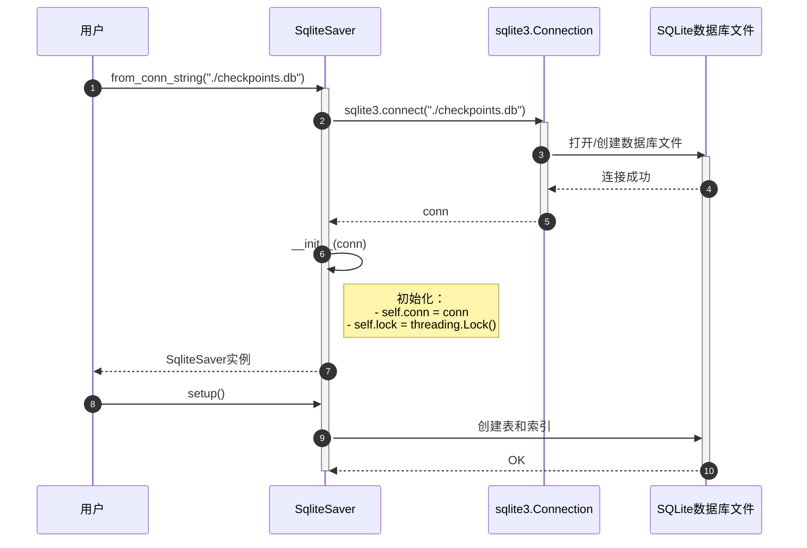
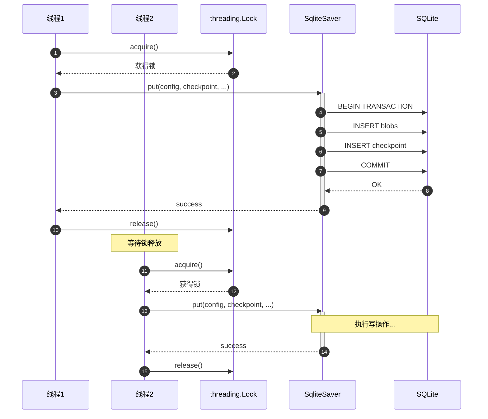
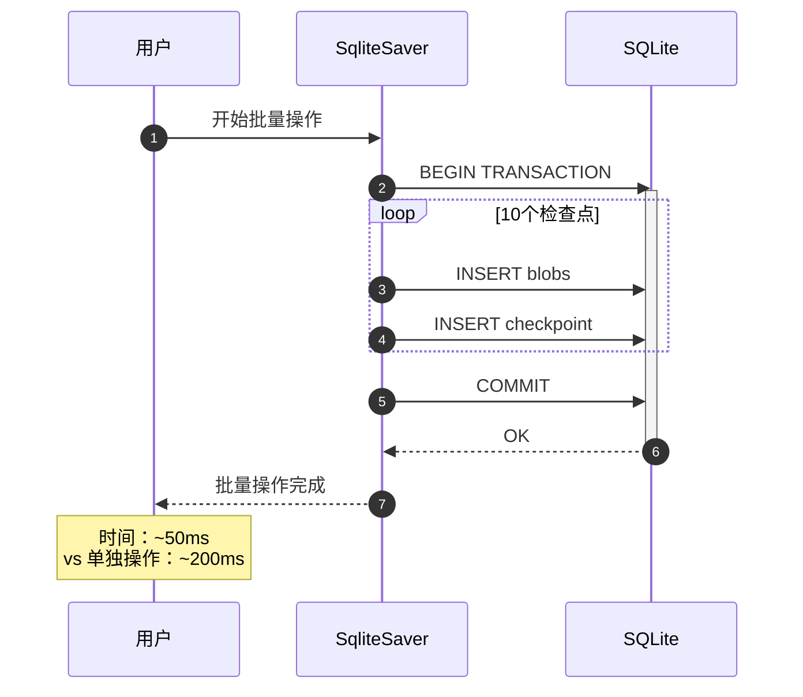
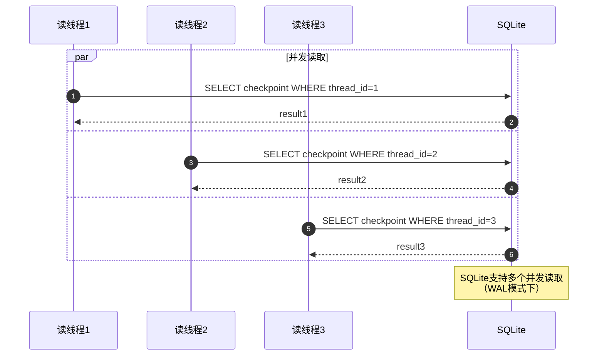

# LangGraph-05-checkpoint-sqlite

## 模块概览

## 一、模块职责

checkpoint-sqlite模块是LangGraph检查点系统的SQLite实现，提供轻量级的本地状态持久化能力。该模块与checkpoint-postgres模块功能相同，但使用SQLite数据库，适用于单机部署、开发测试和嵌入式场景。

### 1.1 核心能力

1. **轻量级存储**：无需独立数据库服务，文件即数据库
2. **零配置**：无需安装配置数据库服务器
3. **完整功能**：与PostgreSQL版本功能相同
4. **跨平台**：支持Windows、Linux、macOS

## 二、与PostgreSQL版本的区别

### 2.1 相同之处

- API完全相同
- 数据库schema相同
- 序列化机制相同
- 支持所有检查点功能

### 2.2 不同之处

| 特性 | PostgreSQL | SQLite |
|---|---|---|
| 部署 | 需要独立服务器 | 本地文件 |
| 并发 | 高并发支持 | 写并发受限 |
| 连接 | 需要网络连接 | 本地I/O |
| 性能 | 高性能 | 中等性能 |
| 适用场景 | 生产环境、多实例 | 开发测试、单机部署 |

## 三、使用示例

### 3.1 基本使用

```python
from langgraph.checkpoint.sqlite import SqliteSaver

# 方式1：使用文件数据库
DB_PATH = "./checkpoints.db"
with SqliteSaver.from_conn_string(f"file:{DB_PATH}") as checkpointer:
    checkpointer.setup()
    
    # 创建Agent
    agent = create_react_agent(model, tools, checkpointer=checkpointer)
    result = agent.invoke(input, config)

# 方式2：使用内存数据库（测试）
with SqliteSaver.from_conn_string(":memory:") as checkpointer:
    checkpointer.setup()
    # 使用checkpointer...
```

### 3.2 异步使用

```python
from langgraph.checkpoint.sqlite.aio import AsyncSqliteSaver

async def main():
    async with AsyncSqliteSaver.from_conn_string("./checkpoints.db") as checkpointer:
        await checkpointer.setup()
        
        config = {"configurable": {"thread_id": "1"}}
        checkpoint = await checkpointer.aget_tuple(config)
        print(checkpoint)

asyncio.run(main())
```

## 四、API参考

### 4.1 SqliteSaver

```python
class SqliteSaver(BaseSqliteSaver):
    """SQLite检查点存储器（同步）"""
    
    def __init__(self, conn: sqlite3.Connection, serde: SerializerProtocol | None = None):
        """初始化
        
        Args:
            conn: SQLite连接
            serde: 序列化器（默认JsonPlusSerializer）
        """
    
    @classmethod
    @contextmanager
    def from_conn_string(cls, conn_string: str) -> Iterator[SqliteSaver]:
        """从连接字符串创建"""
    
    def setup(self) -> None:
        """创建表并运行迁移"""
    
    def get_tuple(self, config: RunnableConfig) -> CheckpointTuple | None:
        """获取检查点"""
    
    def list(self, config: RunnableConfig | None, **kwargs) -> Iterator[CheckpointTuple]:
        """列出检查点"""
    
    def put(self, config: RunnableConfig, checkpoint: Checkpoint, metadata: CheckpointMetadata, new_versions: ChannelVersions) -> RunnableConfig:
        """保存检查点"""
    
    def put_writes(self, config: RunnableConfig, writes: Sequence[tuple[str, Any]], task_id: str, task_path: str = "") -> None:
        """保存writes"""
    
    def delete_thread(self, thread_id: str) -> None:
        """删除线程"""
```

### 4.2 AsyncSqliteSaver

```python
class AsyncSqliteSaver(BaseSqliteSaver):
    """SQLite检查点存储器（异步）"""
    
    async def setup(self) -> None:
        """异步创建表"""
    
    async def aget_tuple(self, config: RunnableConfig) -> CheckpointTuple | None:
        """异步获取检查点"""
    
    def alist(self, config: RunnableConfig | None, **kwargs) -> AsyncIterator[CheckpointTuple]:
        """异步列出检查点"""
    
    async def aput(self, config: RunnableConfig, checkpoint: Checkpoint, metadata: CheckpointMetadata, new_versions: ChannelVersions) -> RunnableConfig:
        """异步保存检查点"""
    
    async def aput_writes(self, config: RunnableConfig, writes: Sequence[tuple[str, Any]], task_id: str, task_path: str = "") -> None:
        """异步保存writes"""
    
    async def adelete_thread(self, thread_id: str) -> None:
        """异步删除线程"""
```

## 五、数据库Schema

与checkpoint-postgres完全相同：

- `checkpoints`：主检查点表
- `checkpoint_blobs`：大对象表
- `checkpoint_writes`：待写入表
- `checkpoint_migrations`：迁移版本表

## 六、最佳实践

### 6.1 开发环境

```python
# 使用内存数据库（快速测试）
with SqliteSaver.from_conn_string(":memory:") as checkpointer:
    checkpointer.setup()
    # 测试...

# 使用文件数据库（持久化测试）
with SqliteSaver.from_conn_string("./test.db") as checkpointer:
    checkpointer.setup()
    # 测试...
```

### 6.2 生产环境（单机）

```python
from pathlib import Path

# 创建数据目录
DB_DIR = Path("./data")
DB_DIR.mkdir(exist_ok=True)

DB_PATH = DB_DIR / "checkpoints.db"
with SqliteSaver.from_conn_string(f"file:{DB_PATH}") as checkpointer:
    checkpointer.setup()
    
    # 生产应用...
```

### 6.3 并发控制

```python
# SQLite写并发受限，使用锁保护
import threading

lock = threading.Lock()

def save_checkpoint(checkpointer, config, checkpoint, metadata, versions):
    with lock:
        checkpointer.put(config, checkpoint, metadata, versions)
```

### 6.4 性能优化

```python
import sqlite3

# 启用WAL模式（提高并发）
conn = sqlite3.connect("./checkpoints.db")
conn.execute("PRAGMA journal_mode=WAL")
conn.execute("PRAGMA synchronous=NORMAL")
conn.execute("PRAGMA cache_size=10000")

checkpointer = SqliteSaver(conn)
```

## 七、迁移指南

### 7.1 从InMemorySaver迁移

```python
# 之前：
from langgraph.checkpoint.memory import InMemorySaver
checkpointer = InMemorySaver()

# 之后：
from langgraph.checkpoint.sqlite import SqliteSaver
with SqliteSaver.from_conn_string("./checkpoints.db") as checkpointer:
    checkpointer.setup()
```

### 7.2 迁移到PostgreSQL

当应用规模增长，需要迁移到PostgreSQL：

1. **导出SQLite数据**
2. **创建PostgreSQL数据库**
3. **导入数据**
4. **切换checkpointer**

```python
# 新代码
from langgraph.checkpoint.postgres import PostgresSaver
with PostgresSaver.from_conn_string(DB_URI) as checkpointer:
    checkpointer.setup()
```

## 八、限制与注意事项

### 8.1 写并发

- SQLite同时只能有一个写操作
- 多个进程同时写入会导致`SQLITE_BUSY`错误
- 解决：使用锁或切换到PostgreSQL

### 8.2 数据库大小

- SQLite单文件，大小不宜过大（建议<10GB）
- 定期清理旧检查点
- 大规模应用使用PostgreSQL

### 8.3 备份

```python
import shutil

# 简单备份：复制文件
shutil.copy("checkpoints.db", "checkpoints.db.backup")

# 在线备份（SQLite 3.27+）
import sqlite3
src = sqlite3.connect("checkpoints.db")
dst = sqlite3.connect("checkpoints.db.backup")
src.backup(dst)
```

## 九、总结

checkpoint-sqlite模块提供了轻量级的检查点存储方案：

**优势**：

- 零配置，开箱即用
- 部署简单，单个文件
- API与PostgreSQL完全相同
- 适合开发测试和单机部署

**劣势**：

- 写并发受限
- 不适合大规模应用
- 不支持分布式

**适用场景**：

- 开发和测试
- 单机应用
- 嵌入式系统
- 原型验证

如需更高性能和并发，请使用checkpoint-postgres模块。

---

## API接口

## 一、API总览

checkpoint-sqlite模块提供与checkpoint-postgres相同的API：

1. **SqliteSaver**：同步检查点存储器
2. **AsyncSqliteSaver**：异步检查点存储器
3. **ShallowSqliteSaver / AsyncShallowSqliteSaver**：浅复制版本

## 二、SqliteSaver API

### 2.1 基本信息

- **名称**：`SqliteSaver`
- **继承**：`BaseSqliteSaver` → `BaseCheckpointSaver`
- **数据库**：SQLite3
- **线程安全**：是（使用threading.Lock）

### 2.2 初始化

```python
from langgraph.checkpoint.sqlite import SqliteSaver
import sqlite3

# 方式1：从连接字符串
with SqliteSaver.from_conn_string("./checkpoints.db") as checkpointer:
    checkpointer.setup()

# 方式2：使用现有连接
conn = sqlite3.connect("./checkpoints.db")
checkpointer = SqliteSaver(conn)
checkpointer.setup()

# 方式3：内存数据库（测试）
with SqliteSaver.from_conn_string(":memory:") as checkpointer:
    checkpointer.setup()
```

### 2.3 所有方法

API与PostgresSaver完全相同，参见`LangGraph-04-checkpoint-postgres-API.md`。

主要方法：

- `setup()` - 创建表
- `get_tuple(config)` - 获取检查点
- `list(config, filter, before, limit)` - 列出检查点
- `put(config, checkpoint, metadata, versions)` - 保存检查点
- `put_writes(config, writes, task_id, task_path)` - 保存writes
- `delete_thread(thread_id)` - 删除线程

## 三、AsyncSqliteSaver API

```python
from langgraph.checkpoint.sqlite.aio import AsyncSqliteSaver

async def main():
    async with AsyncSqliteSaver.from_conn_string("./checkpoints.db") as checkpointer:
        await checkpointer.setup()
        
        # 异步操作
        checkpoint = await checkpointer.aget_tuple(config)
        await checkpointer.aput(config, checkpoint, metadata, versions)

asyncio.run(main())
```

异步方法：

- `async setup()`
- `async aget_tuple(config)`
- `alist(config)` - 返回AsyncIterator
- `async aput(config, checkpoint, metadata, versions)`
- `async aput_writes(config, writes, task_id, task_path)`
- `async adelete_thread(thread_id)`

## 四、SQLite特定配置

### 4.1 连接优化

```python
import sqlite3

conn = sqlite3.connect(
    "./checkpoints.db",
    check_same_thread=False,  # 允许多线程（需要额外同步）
)

# 性能优化
conn.execute("PRAGMA journal_mode=WAL")  # Write-Ahead Logging
conn.execute("PRAGMA synchronous=NORMAL")  # 平衡性能和安全
conn.execute("PRAGMA cache_size=10000")  # 缓存大小（页数）
conn.execute("PRAGMA temp_store=MEMORY")  # 临时存储在内存

checkpointer = SqliteSaver(conn)
```

### 4.2 并发控制

```python
import threading

# SQLite写操作需要锁保护
lock = threading.Lock()

def save_with_lock(checkpointer, config, checkpoint, metadata, versions):
    with lock:
        checkpointer.put(config, checkpoint, metadata, versions)
```

## 五、与PostgreSQL的API差异

**相同点**：

- 所有方法签名完全相同
- 参数和返回值相同
- 使用方式相同

**差异点**：

- 连接类型：`sqlite3.Connection` vs `psycopg.Connection`
- 无ConnectionPool支持
- 无Pipeline支持
- 并发性能较低

## 六、使用示例

### 6.1 基本使用

```python
from langgraph.checkpoint.sqlite import SqliteSaver
from langgraph.prebuilt import create_react_agent

with SqliteSaver.from_conn_string("./checkpoints.db") as checkpointer:
    checkpointer.setup()
    
    agent = create_react_agent(model, tools, checkpointer=checkpointer)
    
    config = {"configurable": {"thread_id": "user-123"}}
    result = agent.invoke({"messages": [HumanMessage("Hello")]}, config)
```

### 6.2 列出历史

```python
config = {"configurable": {"thread_id": "user-123"}}
checkpoints = list(checkpointer.list(config, limit=10))

for ckpt in checkpoints:
    print(f"Checkpoint {ckpt.config['configurable']['checkpoint_id']}")
    print(f"Metadata: {ckpt.metadata}")
```

### 6.3 时间旅行

```python
# 获取历史状态
history = list(checkpointer.list(config))

# 从特定检查点恢复
old_config = {
    "configurable": {
        "thread_id": "user-123",
        "checkpoint_id": history[5].config["configurable"]["checkpoint_id"]
    }
}

result = agent.invoke({"messages": [HumanMessage("继续")]}, old_config)
```

## 七、最佳实践

### 7.1 开发环境

```python
# 使用内存数据库（快速测试）
with SqliteSaver.from_conn_string(":memory:") as checkpointer:
    checkpointer.setup()
    # 测试代码...
```

### 7.2 生产环境

```python
from pathlib import Path

# 数据持久化
DB_PATH = Path("./data/checkpoints.db")
DB_PATH.parent.mkdir(exist_ok=True)

with SqliteSaver.from_conn_string(str(DB_PATH)) as checkpointer:
    checkpointer.setup()
    # 生产代码...
```

### 7.3 备份

```python
import shutil
from datetime import datetime

def backup_database(db_path: str):
    backup_path = f"{db_path}.{datetime.now().strftime('%Y%m%d_%H%M%S')}.backup"
    shutil.copy(db_path, backup_path)
    print(f"Backup created: {backup_path}")

# 定期备份
backup_database("./checkpoints.db")
```

## 八、总结

checkpoint-sqlite提供了与checkpoint-postgres相同的API，使得切换存储后端非常简单。适用于开发测试和单机部署场景。

---

## 数据结构

## 一、数据结构总览

checkpoint-sqlite的数据结构与checkpoint-postgres完全相同，只是底层数据库从PostgreSQL换成SQLite。

详细的数据结构说明请参考：`LangGraph-04-checkpoint-postgres-数据结构.md`

## 二、数据库Schema

### 2.1 表结构（与PostgreSQL相同）

```sql
-- checkpoints表
CREATE TABLE checkpoints (
    thread_id TEXT NOT NULL,
    checkpoint_ns TEXT NOT NULL DEFAULT '',
    checkpoint_id TEXT NOT NULL,
    parent_checkpoint_id TEXT,
    type TEXT,
    checkpoint BLOB NOT NULL,
    metadata BLOB NOT NULL DEFAULT '{}',
    PRIMARY KEY (thread_id, checkpoint_ns, checkpoint_id)
);

-- checkpoint_blobs表
CREATE TABLE checkpoint_blobs (
    thread_id TEXT NOT NULL,
    checkpoint_ns TEXT NOT NULL DEFAULT '',
    channel TEXT NOT NULL,
    version TEXT NOT NULL,
    type TEXT NOT NULL,
    blob BLOB,
    PRIMARY KEY (thread_id, checkpoint_ns, channel, version)
);

-- checkpoint_writes表
CREATE TABLE checkpoint_writes (
    thread_id TEXT NOT NULL,
    checkpoint_ns TEXT NOT NULL DEFAULT '',
    checkpoint_id TEXT NOT NULL,
    task_id TEXT NOT NULL,
    task_path TEXT NOT NULL DEFAULT '',
    idx INTEGER NOT NULL,
    channel TEXT NOT NULL,
    type TEXT,
    blob BLOB NOT NULL,
    PRIMARY KEY (thread_id, checkpoint_ns, checkpoint_id, task_id, idx)
);

-- checkpoint_migrations表
CREATE TABLE checkpoint_migrations (
    v INTEGER PRIMARY KEY
);
```

### 2.2 SQLite vs PostgreSQL差异

| 特性 | PostgreSQL | SQLite |
|---|---|---|
| JSON类型 | JSONB（高效） | BLOB（序列化JSON） |
| 数组类型 | ARRAY | 不支持，使用JOIN |
| UUID类型 | UUID | TEXT |
| 子查询性能 | 高 | 中等 |
| 索引类型 | B-tree, GiST等 | B-tree |

## 三、SQLite特定优化

### 3.1 索引策略

```sql
-- 主键索引（自动创建）
CREATE UNIQUE INDEX checkpoints_pkey
ON checkpoints(thread_id, checkpoint_ns, checkpoint_id);

-- 查询优化索引
CREATE INDEX checkpoints_thread_id_idx
ON checkpoints(thread_id);

CREATE INDEX checkpoint_blobs_thread_id_idx
ON checkpoint_blobs(thread_id);

CREATE INDEX checkpoint_writes_thread_id_idx
ON checkpoint_writes(thread_id);
```

### 3.2 性能配置

```python
import sqlite3

conn = sqlite3.connect("checkpoints.db")

# WAL模式（提高并发）
conn.execute("PRAGMA journal_mode=WAL")

# 同步模式
conn.execute("PRAGMA synchronous=NORMAL")

# 缓存大小（负数表示KB，正数表示页数）
conn.execute("PRAGMA cache_size=-64000")  # 64MB

# 临时存储
conn.execute("PRAGMA temp_store=MEMORY")

# 内存映射（加速读取）
conn.execute("PRAGMA mmap_size=268435456")  # 256MB
```

## 四、存储容量估算

与PostgreSQL相同的估算方法，但SQLite的存储效率略低：

```python
# 单个检查点
checkpoint_size = 800  # vs 750 in PostgreSQL（BLOB vs JSONB）
blob_size = 10 * 1024  # 相同
write_size = 2 * 1200  # 相同

total_per_checkpoint = checkpoint_size + blob_size + write_size
# ≈ 13.2KB per checkpoint

# 100个用户，每人100个检查点
total_storage = 100 * 100 * 13.2KB = 132MB

# 加上索引和开销
total_with_overhead = 132MB * 1.3 = 171MB
```

## 五、数据迁移

### 5.1 从SQLite迁移到PostgreSQL

```python
import sqlite3
import psycopg

# 连接两个数据库
sqlite_conn = sqlite3.connect("checkpoints.db")
pg_conn = psycopg.connect(PG_URI)

# 迁移数据
for table in ["checkpoints", "checkpoint_blobs", "checkpoint_writes"]:
    # 从SQLite读取
    rows = sqlite_conn.execute(f"SELECT * FROM {table}").fetchall()
    
    # 写入PostgreSQL
    with pg_conn.cursor() as cur:
        for row in rows:
            cur.execute(f"INSERT INTO {table} VALUES ({','.join(['%s']*len(row))})", row)

pg_conn.commit()
```

## 六、总结

checkpoint-sqlite使用与PostgreSQL相同的数据结构，但底层实现有差异。适合单机部署和开发测试，生产环境建议使用PostgreSQL。

---

## 时序图

## 一、时序图总览

checkpoint-sqlite的时序图与checkpoint-postgres基本相同，只是数据库操作从PostgreSQL换成SQLite。

详细的时序图请参考：`LangGraph-04-checkpoint-postgres-时序图.md`

## 二、主要差异

### 2.1 连接管理



**关键差异**：

- 无需网络连接，直接操作本地文件
- 连接更快（<1ms vs 10-50ms for PostgreSQL）
- 无ConnectionPool（SQLite本身不支持）

### 2.2 写操作串行化



**关键差异**：

- SQLite写操作必须串行（数据库级别的锁）
- 应用层使用threading.Lock避免竞争
- 多个写操作会排队等待

### 2.3 查询操作

查询操作与PostgreSQL相同，但SQL语法略有差异：

```sql
-- PostgreSQL使用JSONB操作符
SELECT checkpoint -> 'channel_values' FROM checkpoints;

-- SQLite使用JSON函数
SELECT json_extract(checkpoint, '$.channel_values') FROM checkpoints;
```

## 三、性能对比

### 3.1 操作延迟

| 操作 | PostgreSQL | SQLite |
|---|---|---|
| 连接 | 10-50ms（网络） | <1ms（本地） |
| 单次put | 5-10ms | 2-5ms |
| 单次get | 3-5ms | 1-3ms |
| 批量put（10个） | 20ms（Pipeline） | 20-50ms（串行） |
| list（100个） | 50ms | 30-50ms |

### 3.2 并发性能

```
PostgreSQL:

- 读并发：高（多连接）
- 写并发：高（行级锁）
- 适合：多实例、高并发

SQLite:

- 读并发：中等（多读者单写者）
- 写并发：低（数据库锁）
- 适合：单实例、低并发

```

## 四、最佳实践时序

### 4.1 批量操作优化



**优化策略**：

```python
conn = sqlite3.connect("checkpoints.db")
conn.execute("BEGIN TRANSACTION")

for checkpoint in checkpoints:
    checkpointer.put(config, checkpoint, metadata, versions)

conn.execute("COMMIT")
```

### 4.2 并发读取



## 五、总结

checkpoint-sqlite的时序流程与checkpoint-postgres相似，主要差异在于：

1. **连接更简单**：无需网络，直接打开文件
2. **写操作串行**：需要应用层锁保护
3. **性能差异**：单次操作更快，批量操作较慢
4. **适用场景**：开发测试、单机部署

详细的时序图和代码示例请参考`LangGraph-04-checkpoint-postgres-时序图.md`。

---
