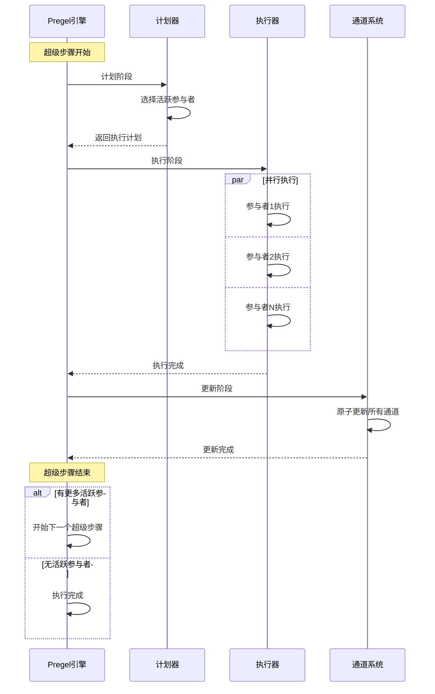
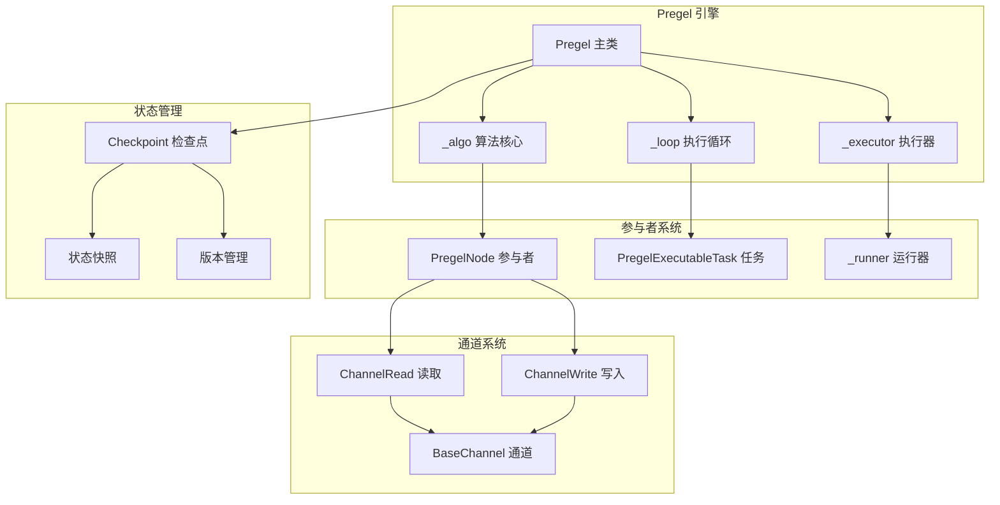

# LangGraph 源码剖析 - Pregel 执行引擎详解

## 1. Pregel 算法概述

Pregel 是 Google 提出的大规模图处理算法，采用 Bulk Synchronous Parallel (BSP) 模型。LangGraph 基于此算法实现了有状态的图执行引擎。

### 1.1 BSP 执行模型



### 1.2 核心组件关系



## 2. Pregel 主类实现

### 2.1 Pregel 类定义

```python
class Pregel(
    PregelProtocol[StateT, ContextT, InputT, OutputT],
    Generic[StateT, ContextT, InputT, OutputT],
):
    """
    Pregel 管理 LangGraph 应用程序的运行时行为
    
    核心特性：
    1. 结合参与者和通道的单一应用程序
    2. 遵循 Pregel 算法/Bulk Synchronous Parallel 模型
    3. 支持检查点和状态持久化
    4. 提供中断和恢复机制
    """
    
    # 核心组件
    nodes: dict[str, PregelNode]                    # 参与者节点字典
    channels: dict[str, BaseChannel]                # 通道字典
    input_channels: str | Sequence[str]             # 输入通道
    output_channels: str | Sequence[str]            # 输出通道
    stream_channels: str | Sequence[str]            # 流式通道
    
    # 执行配置
    stream_mode: StreamMode                         # 流式模式
    checkpointer: BaseCheckpointSaver | None        # 检查点保存器
    interrupt_before_nodes: All | Sequence[str]     # 前置中断节点
    interrupt_after_nodes: All | Sequence[str]      # 后置中断节点
    
    # 运行时配置
    auto_validate: bool                             # 自动验证
    debug: bool                                     # 调试模式
    store: BaseStore | None                         # 存储后端
    cache: BaseCache | None                         # 缓存后端
    
    def __init__(
        self,
        *,
        nodes: dict[str, PregelNode],
        channels: dict[str, BaseChannel],
        input_channels: str | Sequence[str],
        output_channels: str | Sequence[str],
        stream_channels: str | Sequence[str] | None = None,
        stream_mode: StreamMode = "values",
        checkpointer: BaseCheckpointSaver | None = None,
        interrupt_before_nodes: All | Sequence[str] = (),
        interrupt_after_nodes: All | Sequence[str] = (),
        auto_validate: bool = True,
        debug: bool = False,
        store: BaseStore | None = None,
        cache: BaseCache | None = None,
        name: str | None = None,
    ) -> None:
        # 初始化所有属性...
```

### 2.2 执行入口方法

#### 2.2.1 invoke 方法

```python
def invoke(
    self,
    input: InputT,
    config: RunnableConfig | None = None,
    *,
    stream_mode: StreamMode = "values",
    output_keys: str | Sequence[str] | None = None,
    interrupt_before: All | Sequence[str] | None = None,
    interrupt_after: All | Sequence[str] | None = None,
    **kwargs: Any,
) -> OutputT:
    """
    同步执行图并返回最终输出
    
    执行流程：
    1. 配置合并和验证
    2. 创建执行上下文
    3. 运行图执行算法
    4. 返回最终状态
    """
    
    # 1. 配置处理
    config = ensure_config(config)
    callback_manager = get_callback_manager_for_config(config)
    run_manager = callback_manager.on_chain_start(
        dumpd(self), input, name=config.get("run_name", self.get_name())
    )
    
    try:
        # 2. 执行图
        for chunk in self.stream(
            input,
            config,
            stream_mode=stream_mode,
            output_keys=output_keys,
            interrupt_before=interrupt_before,
            interrupt_after=interrupt_after,
            **kwargs,
        ):
            if stream_mode == "values":
                latest = chunk
        
        # 3. 返回结果
        run_manager.on_chain_end(latest)
        return latest
        
    except BaseException as e:
        run_manager.on_chain_error(e)
        raise
```

#### 2.2.2 stream 方法

```python
def stream(
    self,
    input: InputT,
    config: RunnableConfig | None = None,
    *,
    stream_mode: StreamMode = "values",
    output_keys: str | Sequence[str] | None = None,
    interrupt_before: All | Sequence[str] | None = None,
    interrupt_after: All | Sequence[str] | None = None,
    **kwargs: Any,
) -> Iterator[OutputT]:
    """
    流式执行图并产出中间结果
    
    流式模式：
    - values: 输出完整状态值
    - updates: 输出状态更新
    - debug: 输出调试信息
    """
    
    config = ensure_config(config)
    callback_manager = get_callback_manager_for_config(config)
    run_manager = callback_manager.on_chain_start(
        dumpd(self), input, name=config.get("run_name", self.get_name())
    )
    
    # 执行图并流式输出结果
    try:
        for chunk in self._stream(
            input,
            config,
            stream_mode=stream_mode,
            output_keys=output_keys,
            interrupt_before=interrupt_before,
            interrupt_after=interrupt_after,
            **kwargs,
        ):
            yield chunk
            if stream_mode == "values":
                latest = chunk
                
        run_manager.on_chain_end(latest)
        
    except BaseException as e:
        run_manager.on_chain_error(e)
        raise
```

### 2.3 核心流式执行方法

```python
def _stream(
    self,
    input: InputT,
    config: RunnableConfig,
    *,
    stream_mode: StreamMode = "values",
    output_keys: str | Sequence[str] | None = None,
    interrupt_before: All | Sequence[str] | None = None,
    interrupt_after: All | Sequence[str] | None = None,
    **kwargs: Any,
) -> Iterator[OutputT]:
    """
    内部流式执行实现
    
    核心步骤：
    1. 配置初始化和验证
    2. 创建执行循环 
    3. 处理输入并启动执行
    4. 流式产出结果
    """
    
    # 1. 配置初始化
    config = merge_configs(config, **kwargs)
    config = patch_configurable(config, self.checkpointer, self.store, self.cache)
    
    # 2. 获取执行循环
    loop = get_new_id() if config.get(CONFIG_KEY_CHECKPOINTER) else None
    
    # 3. 执行图的主循环
    for chunk in self._run(
        config,
        stream_mode=stream_mode,
        input=input,
        output_keys=output_keys,
        interrupt_before=interrupt_before,  
        interrupt_after=interrupt_after,
        loop=loop,
    ):
        yield chunk
```

## 3. 执行算法核心 (_algo.py)

### 3.1 执行计划生成

```python
def _plan_for_pregel(
    channels: dict[str, BaseChannel],
    nodes: dict[str, PregelNode], 
    checkpoint: Checkpoint,
    step: int,
) -> tuple[dict[str, PregelExecutableTask], bool]:
    """
    为Pregel执行生成计划
    
    计划逻辑：
    1. 检查通道更新情况
    2. 确定哪些参与者应该执行
    3. 创建可执行任务
    4. 返回执行计划和完成状态
    """
    
    tasks: dict[str, PregelExecutableTask] = {}
    
    # 1. 遍历所有节点
    for name, node in nodes.items():
        # 检查节点的触发条件
        if _should_trigger_node(node, channels, checkpoint, step):
            # 创建执行任务
            task = PregelExecutableTask(
                name=name,
                input=_prepare_node_input(node, channels, checkpoint),
                node=node,
                config=_get_node_config(name, checkpoint),
                writes=[],
                triggers=_get_node_triggers(node, channels),
                id=f"{checkpoint['id']}_{step}_{name}",
            )
            tasks[name] = task
    
    # 2. 检查是否有任务要执行
    has_tasks = bool(tasks)
    
    return tasks, not has_tasks
```

#### 3.1.1 节点触发检查

```python
def _should_trigger_node(
    node: PregelNode,
    channels: dict[str, BaseChannel],
    checkpoint: Checkpoint,
    step: int,
) -> bool:
    """
    检查节点是否应该在当前步骤触发
    
    触发条件：
    1. 节点有触发通道更新
    2. 节点未在当前步骤执行过
    3. 满足节点的特殊触发条件
    """
    
    # 1. 检查触发通道
    for trigger in node.triggers:
        if trigger in channels:
            channel = channels[trigger]
            # 检查通道是否有新更新
            if _channel_has_update(channel, checkpoint, step):
                return True
    
    # 2. 检查是否已执行
    node_checkpoint = checkpoint.get('channel_versions', {})
    if f"node:{node.name}" in node_checkpoint:
        last_step = node_checkpoint[f"node:{node.name}"]
        if last_step >= step:
            return False
    
    return False

def _channel_has_update(
    channel: BaseChannel, 
    checkpoint: Checkpoint, 
    step: int
) -> bool:
    """检查通道自上次检查点以来是否有更新"""
    versions = checkpoint.get('channel_versions', {})
    channel_key = channel.key
    
    if channel_key not in versions:
        return True  # 新通道
    
    last_version = versions[channel_key]
    return last_version > checkpoint.get('step', 0)
```

### 3.2 任务执行机制

#### 3.2.1 PregelExecutableTask 定义

```python
@dataclass(frozen=True)
class PregelExecutableTask:
    """
    Pregel 可执行任务
    
    包含执行一个参与者节点所需的所有信息
    """
    name: str                                    # 任务名称
    input: Any                                   # 输入数据
    node: PregelNode                            # 参与者节点
    config: RunnableConfig                      # 运行配置
    writes: list[tuple[str, Any]]               # 写入操作列表
    triggers: list[str]                         # 触发通道列表
    id: str                                     # 任务ID
    
    # 可选属性
    scheduled: bool = False                     # 是否已调度
    result: Any = None                          # 执行结果
    error: Exception | None = None              # 执行错误
    
    def execute(self) -> Any:
        """
        执行任务
        
        执行步骤：
        1. 准备执行环境
        2. 调用节点的bound runnable
        3. 处理执行结果
        4. 生成写入操作
        """
        try:
            # 1. 设置执行上下文
            config = patch_config(
                self.config,
                callbacks=None,  # 将在_runner中设置
                run_name=self.name,
                task_id=self.id,
            )
            
            # 2. 执行节点
            if self.node.bound:
                result = self.node.bound.invoke(self.input, config)
            else:
                result = self.input  # 传递输入
            
            # 3. 处理输出写入
            writes = []
            for writer in self.node.writers:
                writes.extend(writer.do_write(result, config))
            
            return PregelExecutableTask(
                **{**asdict(self), "result": result, "writes": writes}
            )
            
        except Exception as e:
            return PregelExecutableTask(
                **{**asdict(self), "error": e}
            )
```

#### 3.2.2 并行执行器

```python
def _execute_tasks_sync(
    tasks: Sequence[PregelExecutableTask],
    step_timeout: float | None = None,
    retry_policy: RetryPolicy | None = None,
) -> Iterator[PregelExecutableTask]:
    """
    同步并行执行任务
    
    执行策略：
    1. 使用线程池并行执行
    2. 支持超时控制
    3. 支持重试机制
    4. 流式返回结果
    """
    
    # 1. 创建线程池
    max_workers = min(len(tasks), 32)  # 限制最大线程数
    
    with concurrent.futures.ThreadPoolExecutor(max_workers=max_workers) as executor:
        # 2. 提交所有任务
        futures = {
            executor.submit(_execute_task_with_retry, task, retry_policy): task
            for task in tasks
        }
        
        # 3. 等待任务完成并产出结果
        try:
            for future in concurrent.futures.as_completed(futures, timeout=step_timeout):
                task = futures[future]
                try:
                    completed_task = future.result()
                    yield completed_task
                except Exception as e:
                    # 返回带错误的任务
                    yield PregelExecutableTask(
                        **{**asdict(task), "error": e}
                    )
        except concurrent.futures.TimeoutError:
            # 处理超时
            for future in futures:
                if not future.done():
                    future.cancel()
            raise GraphRecursionError("Task execution timeout")

def _execute_task_with_retry(
    task: PregelExecutableTask,
    retry_policy: RetryPolicy | None,
) -> PregelExecutableTask:
    """
    执行任务并支持重试
    
    重试逻辑：
    1. 检查是否需要重试
    2. 执行指数退避
    3. 记录重试次数
    """
    
    last_error = None
    retry_count = 0
    max_retries = retry_policy.max_retries if retry_policy else 0
    
    while retry_count <= max_retries:
        try:
            return task.execute()
        except Exception as e:
            last_error = e
            retry_count += 1
            
            if retry_count <= max_retries and retry_policy:
                # 计算退避时间
                delay = retry_policy.initial_interval * (
                    retry_policy.backoff_factor ** (retry_count - 1)
                )
                time.sleep(min(delay, retry_policy.max_interval))
                continue
            else:
                break
    
    # 重试失败，返回错误任务
    return PregelExecutableTask(
        **{**asdict(task), "error": last_error}
    )
```

## 4. 执行循环 (_loop.py)

### 4.1 主执行循环

```python
def _run_pregel_loop(
    config: RunnableConfig,
    input: Any,
    *,
    checkpointer: BaseCheckpointSaver | None = None,
    nodes: dict[str, PregelNode],
    channels: dict[str, BaseChannel],
    stream_mode: StreamMode = "values",
    **kwargs: Any,
) -> Iterator[Any]:
    """
    Pregel 主执行循环
    
    循环步骤：
    1. 初始化执行环境
    2. 加载或创建检查点
    3. 处理输入数据
    4. 执行超级步骤循环
    5. 处理中断和恢复
    6. 流式输出结果
    """
    
    # 1. 初始化
    loop_id = config.get(CONFIG_KEY_LOOP, uuid4())
    thread_id = config.get(CONFIG_KEY_THREAD_ID, str(uuid4()))
    checkpoint_ns = config.get(CONFIG_KEY_CHECKPOINT_NS, "")
    
    # 2. 检查点处理
    if checkpointer:
        # 尝试加载现有检查点
        checkpoint_tuple = checkpointer.get_tuple(config)
        if checkpoint_tuple:
            checkpoint = checkpoint_tuple.checkpoint
            step = checkpoint.get("step", 0)
        else:
            # 创建新检查点
            checkpoint = create_initial_checkpoint(input, channels)
            step = 0
    else:
        checkpoint = create_initial_checkpoint(input, channels)
        step = 0
    
    # 3. 主循环
    try:
        while True:
            step += 1
            
            # 3.1 生成执行计划
            tasks, is_done = _plan_for_pregel(channels, nodes, checkpoint, step)
            
            if is_done:
                break
            
            # 3.2 检查前置中断
            if _should_interrupt_before(tasks, config):
                _save_checkpoint_and_interrupt(checkpointer, checkpoint, step)
                break
            
            # 3.3 执行任务
            completed_tasks = list(_execute_tasks_sync(tasks.values()))
            
            # 3.4 处理执行结果
            _process_task_results(completed_tasks, channels, checkpoint)
            
            # 3.5 检查后置中断
            if _should_interrupt_after(completed_tasks, config):
                _save_checkpoint_and_interrupt(checkpointer, checkpoint, step)
                break
            
            # 3.6 保存检查点
            if checkpointer:
                checkpointer.put(config, checkpoint)
            
            # 3.7 流式输出
            if stream_mode in ("values", "updates", "debug"):
                yield _format_stream_output(
                    channels, completed_tasks, stream_mode
                )
                
    except GraphInterrupt as interrupt:
        # 处理中断
        if checkpointer:
            checkpointer.put(config, checkpoint)
        yield {"__interrupt__": interrupt.args[0]} 
        
    except Exception as e:
        # 处理执行错误
        logger.error(f"Execution error in step {step}: {e}")
        raise
```

### 4.2 检查点管理

#### 4.2.1 检查点创建

```python
def create_initial_checkpoint(
    input: Any,
    channels: dict[str, BaseChannel],
) -> Checkpoint:
    """
    创建初始检查点
    
    检查点结构：
    - id: 检查点唯一标识
    - step: 当前步骤数
    - channel_values: 通道当前值
    - channel_versions: 通道版本号
    - versions_seen: 已见版本记录
    """
    
    checkpoint_id = str(uuid4())
    
    # 初始化通道值
    channel_values = {}
    channel_versions = {}
    
    for name, channel in channels.items():
        if name == START:
            # 设置输入值
            channel.update([input])
            channel_values[name] = channel.checkpoint()
            channel_versions[name] = 1
        else:
            # 初始化其他通道
            channel_values[name] = channel.checkpoint()
            channel_versions[name] = 0
    
    return Checkpoint(
        id=checkpoint_id,
        step=0,
        channel_values=channel_values,
        channel_versions=channel_versions,
        versions_seen={},
        pending_sends=[],
    )
```

#### 4.2.2 检查点更新

```python
def _update_checkpoint(
    checkpoint: Checkpoint,
    tasks: Sequence[PregelExecutableTask],
    channels: dict[str, BaseChannel],
    step: int,
) -> Checkpoint:
    """
    根据任务执行结果更新检查点
    
    更新内容：
    1. 增加步骤计数
    2. 更新通道值和版本
    3. 记录已见版本
    4. 处理待发送消息
    """
    
    # 1. 复制当前检查点
    new_checkpoint = {**checkpoint}
    new_checkpoint["step"] = step
    
    channel_values = {**checkpoint["channel_values"]}
    channel_versions = {**checkpoint["channel_versions"]}
    versions_seen = {**checkpoint["versions_seen"]}
    
    # 2. 处理任务写入
    pending_writes = defaultdict(list)
    
    for task in tasks:
        if task.error:
            continue  # 跳过失败的任务
            
        # 收集写入操作
        for channel_name, value in task.writes:
            pending_writes[channel_name].append(value)
        
        # 更新版本记录
        task_key = f"task:{task.name}:{step}"
        versions_seen[task.name] = versions_seen.get(task.name, {})
        versions_seen[task.name][task_key] = step
    
    # 3. 批量更新通道
    for channel_name, values in pending_writes.items():
        if channel_name in channels:
            channel = channels[channel_name]
            channel.update(values)
            
            # 更新检查点中的通道值和版本
            channel_values[channel_name] = channel.checkpoint()
            channel_versions[channel_name] = channel_versions.get(channel_name, 0) + 1
    
    # 4. 更新检查点
    new_checkpoint["channel_values"] = channel_values
    new_checkpoint["channel_versions"] = channel_versions  
    new_checkpoint["versions_seen"] = versions_seen
    
    return new_checkpoint
```

## 5. 中断和恢复机制

### 5.1 中断处理

```python
def _should_interrupt_before(
    tasks: dict[str, PregelExecutableTask],
    config: RunnableConfig,
) -> bool:
    """检查是否应该在执行前中断"""
    
    interrupt_before = config.get(CONFIG_KEY_INTERRUPT_BEFORE, [])
    if interrupt_before == "*":
        return True
    
    return any(task.name in interrupt_before for task in tasks.values())

def _should_interrupt_after(
    tasks: Sequence[PregelExecutableTask],
    config: RunnableConfig,
) -> bool:
    """检查是否应该在执行后中断"""
    
    interrupt_after = config.get(CONFIG_KEY_INTERRUPT_AFTER, [])
    if interrupt_after == "*":
        return True
    
    return any(task.name in interrupt_after for task in tasks)

class GraphInterrupt(Exception):
    """图执行中断异常"""
    
    def __init__(self, interrupt_nodes: list[str], snapshot: StateSnapshot):
        self.interrupt_nodes = interrupt_nodes
        self.snapshot = snapshot
        super().__init__(f"Graph execution interrupted at nodes: {interrupt_nodes}")
```

### 5.2 恢复机制

```python
def _resume_from_checkpoint(
    checkpointer: BaseCheckpointSaver,
    config: RunnableConfig,
    input: Any | None = None,
) -> tuple[Checkpoint, dict[str, BaseChannel]]:
    """
    从检查点恢复执行
    
    恢复步骤：
    1. 加载检查点
    2. 恢复通道状态
    3. 处理新输入（如果有）
    4. 返回恢复后的状态
    """
    
    # 1. 加载检查点
    checkpoint_tuple = checkpointer.get_tuple(config)
    if not checkpoint_tuple:
        raise ValueError("No checkpoint found for resume")
    
    checkpoint = checkpoint_tuple.checkpoint
    
    # 2. 恢复通道状态
    channels = {}
    for name, channel_data in checkpoint["channel_values"].items():
        if name in CHANNEL_REGISTRY:
            channel_class = CHANNEL_REGISTRY[name]
            channel = channel_class.from_checkpoint(channel_data)
            channels[name] = channel
    
    # 3. 处理新输入
    if input is not None:
        # 更新输入通道
        if START in channels:
            channels[START].update([input])
        
        # 更新检查点
        checkpoint["channel_values"][START] = channels[START].checkpoint()
        checkpoint["channel_versions"][START] += 1
    
    return checkpoint, channels
```

## 6. 流式输出处理

### 6.1 流式模式实现

```python
def _format_stream_output(
    channels: dict[str, BaseChannel],
    tasks: Sequence[PregelExecutableTask],
    stream_mode: StreamMode,
) -> Any:
    """
    根据流式模式格式化输出
    
    模式说明：
    - values: 输出完整状态值
    - updates: 输出状态更新
    - debug: 输出调试信息
    """
    
    if stream_mode == "values":
        # 输出所有通道的当前值
        output = {}
        for name, channel in channels.items():
            if not name.startswith("__"):  # 跳过内部通道
                output[name] = channel.get()
        return output
        
    elif stream_mode == "updates":
        # 输出本步骤的更新
        updates = {}
        for task in tasks:
            if task.error:
                continue
            for channel_name, value in task.writes:
                if not channel_name.startswith("__"):
                    updates[channel_name] = value
        return updates
        
    elif stream_mode == "debug":
        # 输出调试信息
        return {
            "step": tasks[0].id.split("_")[1] if tasks else 0,
            "tasks": [
                {
                    "name": task.name,
                    "input": task.input,
                    "output": task.result,
                    "error": str(task.error) if task.error else None,
                }
                for task in tasks
            ],
            "channels": {
                name: {
                    "value": channel.get(),
                    "type": type(channel).__name__,
                }
                for name, channel in channels.items()
            }
        }
```

## 7. 性能优化

### 7.1 并发执行优化

```python
class TaskScheduler:
    """
    任务调度器：优化任务执行顺序和并发度
    """
    
    def __init__(self, max_concurrency: int = 32):
        self.max_concurrency = max_concurrency
        self.dependency_graph = {}
    
    def schedule_tasks(
        self,
        tasks: dict[str, PregelExecutableTask]
    ) -> list[list[PregelExecutableTask]]:
        """
        根据依赖关系调度任务执行
        
        返回任务的分层列表，同一层的任务可以并行执行
        """
        
        # 1. 构建依赖图
        dependencies = self._build_dependency_graph(tasks)
        
        # 2. 拓扑排序分层
        layers = []
        remaining_tasks = set(tasks.keys())
        
        while remaining_tasks:
            # 找到无依赖的任务
            ready_tasks = [
                name for name in remaining_tasks
                if not (dependencies.get(name, set()) & remaining_tasks)
            ]
            
            if not ready_tasks:
                raise ValueError("Circular dependency detected")
            
            # 添加到当前层
            layer = [tasks[name] for name in ready_tasks]
            layers.append(layer)
            
            # 从剩余任务中移除
            remaining_tasks -= set(ready_tasks)
        
        return layers
    
    def _build_dependency_graph(
        self,
        tasks: dict[str, PregelExecutableTask]
    ) -> dict[str, set[str]]:
        """构建任务依赖图"""
        dependencies = {}
        
        for task_name, task in tasks.items():
            deps = set()
            
            # 分析通道依赖
            for trigger in task.triggers:
                # 找到写入此通道的任务
                for other_name, other_task in tasks.items():
                    if other_name != task_name:
                        for write_channel, _ in other_task.writes:
                            if write_channel == trigger:
                                deps.add(other_name)
            
            dependencies[task_name] = deps
        
        return dependencies
```

### 7.2 内存优化

```python
class ChannelManager:
    """
    通道管理器：优化内存使用和垃圾回收
    """
    
    def __init__(self):
        self.channel_history = {}
        self.max_history_size = 1000
    
    def cleanup_old_values(self, channels: dict[str, BaseChannel], current_step: int):
        """清理旧的通道值以释放内存"""
        
        for name, channel in channels.items():
            if hasattr(channel, "cleanup"):
                channel.cleanup(current_step - self.max_history_size)
    
    def optimize_checkpoint_size(self, checkpoint: Checkpoint) -> Checkpoint:
        """优化检查点大小"""
        
        optimized = {**checkpoint}
        
        # 压缩版本历史
        versions_seen = checkpoint.get("versions_seen", {})
        if len(versions_seen) > self.max_history_size:
            # 只保留最近的版本
            for node_name in versions_seen:
                node_versions = versions_seen[node_name]
                if len(node_versions) > 100:  # 每个节点最多保留100个版本
                    sorted_versions = sorted(node_versions.items(), key=lambda x: x[1])
                    versions_seen[node_name] = dict(sorted_versions[-100:])
        
        optimized["versions_seen"] = versions_seen
        return optimized
```

## 8. 总结

Pregel执行引擎是LangGraph的核心，提供了强大而高效的图执行能力：

### 8.1 核心优势

1. **BSP模型**：确保执行的确定性和可重现性
2. **并行执行**：充分利用多核资源提升性能
3. **容错机制**：支持任务重试和错误恢复
4. **检查点系统**：提供完整的状态持久化和恢复能力
5. **流式处理**：支持实时结果输出和监控

### 8.2 设计特点

1. **模块化架构**：清晰的职责分离便于维护和扩展
2. **可配置性**：丰富的配置选项满足不同场景需求
3. **监控支持**：完整的执行状态跟踪和调试信息
4. **性能优化**：多层次的性能优化保证执行效率

Pregel执行引擎为构建复杂的AI应用程序提供了可靠的执行基础，在下一部分中，我们将分析预构建组件的实现细节。
