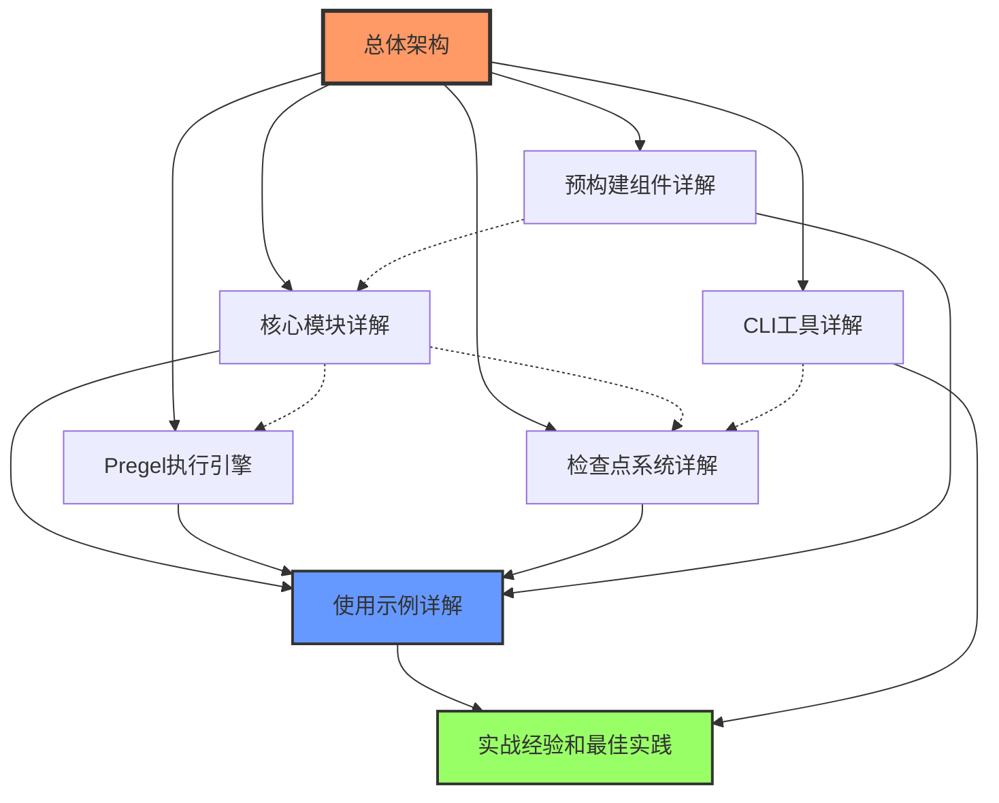

# LangGraph 源码剖析 - 完整文档导航

## 📚 文档概览

本套文档提供了对LangGraph框架的全面、深入的源码剖析，包含详细的架构分析、使用示例、实战经验和最佳实践。文档采用模块化组织，由浅入深地帮助用户精通LangGraph的源代码逻辑。

## 🗂️ 文档目录结构

### 1. 总体架构篇
- **[LangGraph源码剖析-总体架构.md](./LangGraph源码剖析-总体架构.md)**
  - 项目概述和核心特性
  - Monorepo结构分析
  - 模块依赖关系图
  - 架构设计原则
  - 技术栈和设计理念

### 2. 核心模块深度解析

#### 2.1 核心框架模块
- **[LangGraph源码剖析-核心模块详解.md](./LangGraph源码剖析-核心模块详解.md)**
  - StateGraph核心实现
  - 消息处理机制
  - 通道系统详解
  - 状态管理策略
  - 条件路由实现

#### 2.2 执行引擎模块
- **[LangGraph源码剖析-Pregel执行引擎.md](./LangGraph源码剖析-Pregel执行引擎.md)**
  - Pregel算法原理
  - BSP执行模型
  - 超级步骤机制
  - 参与者调度策略
  - 执行流程详解

#### 2.3 预构建组件模块
- **[LangGraph源码剖析-预构建组件详解.md](./LangGraph源码剖析-预构建组件详解.md)**
  - create_react_agent实现
  - ToolNode工具节点
  - 条件函数库
  - 高级API设计
  - 最佳实践封装

#### 2.4 检查点系统模块
- **[LangGraph源码剖析-检查点系统详解.md](./LangGraph源码剖析-检查点系统详解.md)**
  - BaseCheckpointSaver接口
  - InMemorySaver实现
  - 序列化机制
  - 版本管理系统
  - 性能优化策略

#### 2.5 CLI工具模块
- **[LangGraph源码剖析-CLI工具详解.md](./LangGraph源码剖析-CLI工具详解.md)**
  - 命令行架构设计
  - 配置管理系统
  - 项目模板机制
  - 开发服务器实现
  - Docker集成方案

### 3. 实战应用篇

#### 3.1 使用示例
- **[LangGraph源码剖析-使用示例详解.md](./LangGraph源码剖析-使用示例详解.md)**
  - 快速入门示例
  - 工具调用智能体
  - 人机交互中断
  - 多智能体协作
  - 实际业务场景

#### 3.2 最佳实践
- **[LangGraph源码剖析-实战经验和最佳实践.md](./LangGraph源码剖析-实战经验和最佳实践.md)**
  - 项目架构设计
  - 性能优化策略
  - 错误处理机制
  - 生产环境部署
  - 监控和告警

## 🔍 文档特色

### 📊 丰富的图表说明

每个文档都包含详细的架构图、时序图和流程图：

1. **Mermaid流程图**：展示复杂的执行流程和模块交互
2. **架构图**：清晰展示系统组件关系和数据流
3. **时序图**：详细描述组件间的时间序列交互
4. **UML图**：规范化的类关系和接口设计

### 💻 完整的代码实例

- **源码解析**：每个关键函数都包含详细的源码分析
- **使用示例**：提供可运行的完整代码示例
- **注释说明**：为代码添加详细的功能说明和参数介绍
- **最佳实践**：展示生产环境的实际应用模式

### 🎯 深度技术剖析

- **设计原理**：深入解析技术选型和架构决策
- **实现细节**：详细分析关键算法和数据结构
- **性能考量**：分析性能瓶颈和优化策略
- **扩展性设计**：探讨框架的可扩展性机制

## 📖 阅读路径建议

### 🚀 快速入门路径
1. 阅读 **总体架构** → 了解整体设计
2. 阅读 **使用示例详解** → 快速上手实践
3. 参考 **实战经验和最佳实践** → 避免常见陷阱

### 🔧 开发者进阶路径
1. **总体架构** → **核心模块详解** → **Pregel执行引擎**
2. **检查点系统详解** → **预构建组件详解**
3. **CLI工具详解** → **实战经验和最佳实践**

### 🏗️ 架构师深度路径
1. **总体架构** → **核心模块详解** → **Pregel执行引擎**
2. **检查点系统详解** → 深度理解持久化机制
3. **实战经验和最佳实践** → 生产环境设计考量

## 🔗 模块间关系图

## 🎯 学习目标

通过阅读这套文档，您将能够：

### 📚 理论掌握
- ✅ 深入理解LangGraph的架构设计理念
- ✅ 掌握Pregel算法和BSP执行模型
- ✅ 理解状态管理和检查点机制
- ✅ 熟悉各种设计模式的应用

### 🛠️ 实践能力
- ✅ 能够设计和实现复杂的智能体工作流
- ✅ 掌握性能优化和错误处理技巧
- ✅ 具备生产环境部署和运维能力
- ✅ 能够扩展和定制框架功能

### 🎨 设计能力
- ✅ 能够设计可扩展的智能体架构
- ✅ 掌握模块化设计和接口抽象
- ✅ 具备系统性能调优经验
- ✅ 能够制定技术选型和架构决策

## 🔧 技术要求

### 必备知识
- Python 3.9+ 基础语法和高级特性
- 异步编程和并发处理概念
- 基本的系统设计和架构思维
- LangChain框架基础使用

### 推荐知识
- 图论和算法基础
- 分布式系统概念
- 容器化部署经验
- 监控和运维实践

## 💡 使用建议

### 📖 文档阅读
- **循序渐进**：按照推荐路径逐步深入学习
- **理论结合实践**：阅读理论的同时运行代码示例
- **反复参考**：将文档作为开发过程中的参考手册
- **社区交流**：结合社区资源和项目实践

### 🔬 实验验证
- **本地环境**：搭建本地开发环境验证示例代码
- **修改实验**：尝试修改参数和配置观察行为变化
- **扩展开发**：基于示例代码开发自己的应用场景
- **性能测试**：在不同配置下测试性能表现

### 🚀 生产应用
- **渐进部署**：从简单场景开始逐步扩展到复杂应用
- **监控完善**：建立完善的监控和告警体系
- **持续优化**：根据实际使用情况持续优化架构
- **团队培训**：组织团队学习和知识分享

## 📈 文档更新

这套文档基于LangGraph最新版本编写，涵盖了框架的核心特性和最佳实践。随着框架的发展，文档内容也会持续更新。

### 版本信息
- **文档版本**: v1.0
- **基于LangGraph版本**: 最新稳定版
- **最后更新**: 2024年

### 反馈渠道
如果您在使用过程中发现问题或有改进建议，欢迎通过以下方式反馈：
- 提交Issue到项目仓库
- 参与社区讨论
- 直接联系文档维护者

---

**📢 重要提示**：这套文档旨在帮助开发者深入理解LangGraph框架，建议结合官方文档和社区资源一起学习。在生产环境中应用时，请务必进行充分的测试和验证。

🎉 **祝您学习愉快，开发顺利！**
