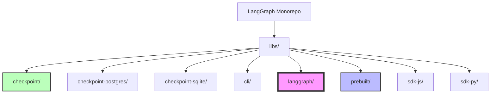
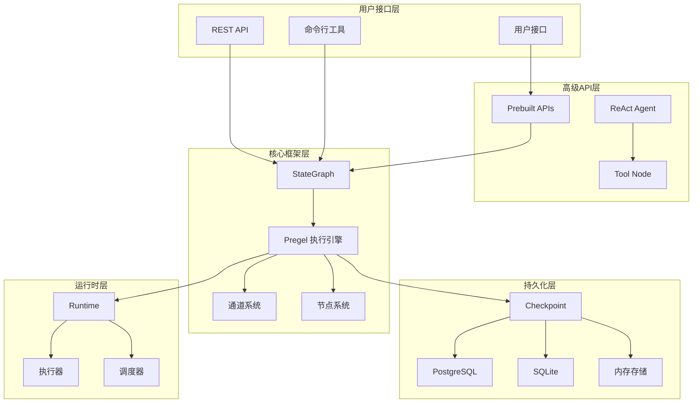
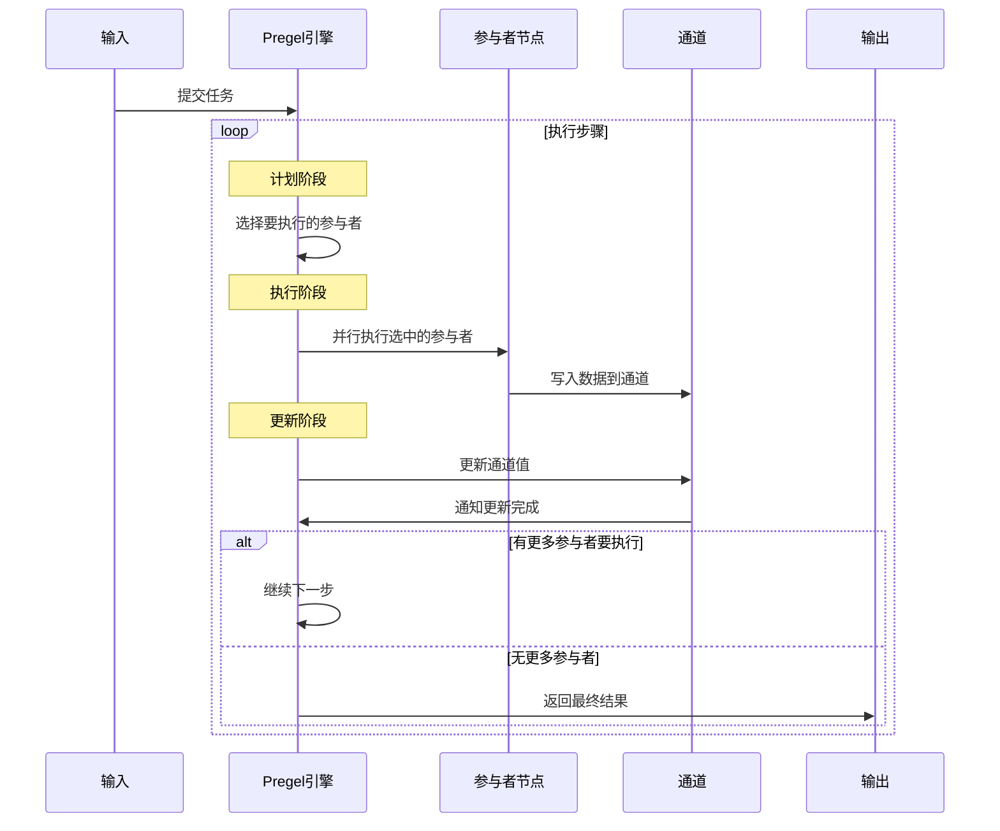
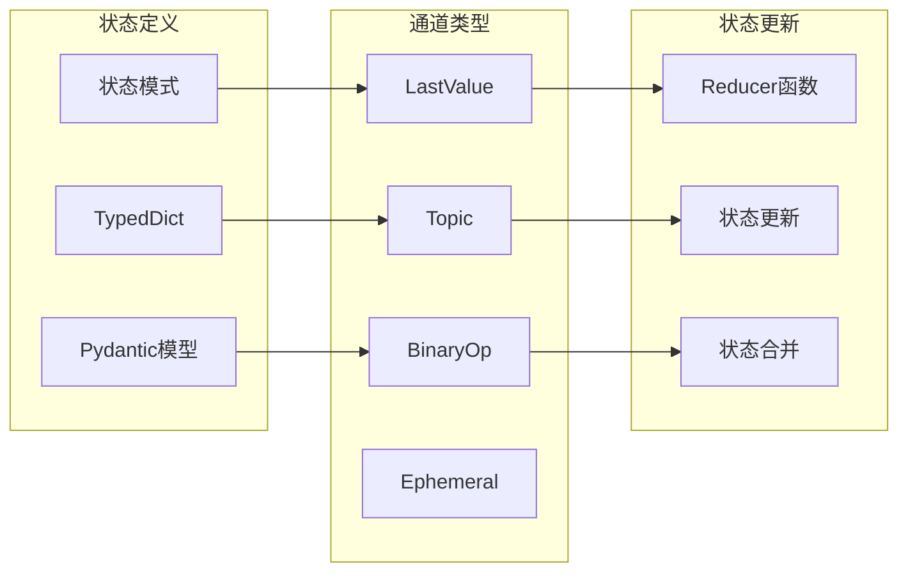
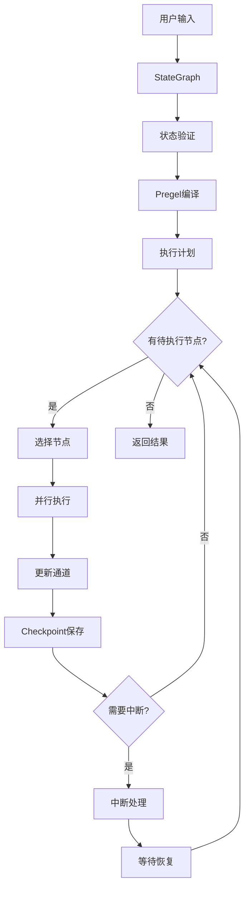

## 项目概述

LangGraph 是一个用于构建有状态、多角色应用程序的低级编排框架。该项目基于 Google 的 Pregel 论文和 Apache Beam 理念，采用参与者模型（Actor Model）和 Bulk Synchronous Parallel（BSP）执行模式。

### 核心特性

1. **持久化执行**：支持长时间运行的有状态工作流
2. **人机交互**：无缝集成人工干预和审核
3. **全面内存**：支持短期工作内存和长期持久内存
4. **调试支持**：与 LangSmith 集成，提供深度可视化
5. **生产就绪**：可扩展的基础设施部署

## Monorepo 结构



### 依赖关系图

```
checkpoint
├── checkpoint-postgres
├── checkpoint-sqlite  
├── prebuilt
└── langgraph

prebuilt
└── langgraph

sdk-py
├── langgraph
└── cli

sdk-js (standalone)
```

## 整体架构设计

### 1. 核心架构组件



### 2. Pregel 算法架构

LangGraph 的核心基于 Pregel 算法，采用 Bulk Synchronous Parallel (BSP) 模型：



### 3. 状态管理架构



## 核心概念详解

### 1. StateGraph（状态图）

StateGraph 是 LangGraph 的主要接口，允许开发者定义节点和边的有向图：

**关键特性：**
- 节点通过共享状态通信
- 支持条件边和并发执行
- 内置状态验证和类型检查
- 支持中断和恢复机制

### 2. Pregel 执行引擎

Pregel 是 LangGraph 的运行时执行引擎：

**执行模式：**
- **计划阶段**：确定哪些参与者在此步骤中执行
- **执行阶段**：并行执行所有选定的参与者
- **更新阶段**：用参与者写入的值更新通道

### 3. 通道系统

通道用于参与者之间的通信：

**通道类型：**
- **LastValue**：存储发送到通道的最后一个值
- **Topic**：可配置的发布订阅主题
- **BinaryOperatorAggregate**：使用二元运算符聚合值
- **Context**：管理外部资源的生命周期

### 4. Checkpoint 机制

Checkpoint 提供版本化的"短期记忆"：

**功能特性：**
- 支持图的暂停、恢复和重放
- 多后端支持（内存、SQLite、PostgreSQL）
- 自动状态持久化
- 支持时间旅行调试

## 数据流架构



## API 设计模式

### 1. 构建器模式

```python
# StateGraph 使用构建器模式
graph = StateGraph(StateSchema)
graph.add_node("agent", agent_node)
graph.add_node("tools", tool_node)
graph.add_edge(START, "agent")
graph.add_conditional_edges("agent", tools_condition)
graph.set_finish_point("tools")
compiled = graph.compile(checkpointer=memory)
```

### 2. 装饰器模式

```python
# 使用装饰器定义工具
@tool
def search_web(query: str) -> str:
    """搜索网络内容"""
    return f"搜索结果：{query}"
```

### 3. 依赖注入模式

```python
# 运行时依赖注入
def node_function(state: State, runtime: Runtime[Context]) -> dict:
    context = runtime.context
    return {"result": process_with_context(state, context)}
```

## 性能优化策略

### 1. 并行执行

- 支持节点级别的并行执行
- 通道更新的原子操作
- 异步执行支持

### 2. 内存管理

- 惰性状态加载
- Checkpoint 压缩
- 垃圾回收优化

### 3. 缓存机制

- 节点结果缓存
- 状态快照缓存
- 执行计划缓存

## 扩展机制

### 1. 自定义通道

开发者可以实现自定义通道类型：

```python
class CustomChannel(BaseChannel):
    def update(self, values: Sequence[Any]) -> None:
        # 自定义更新逻辑
        pass
```

### 2. 自定义节点

支持多种节点类型：

- 函数节点
- Runnable 节点
- 异步节点
- 流式节点

### 3. 中间件支持

提供中间件机制用于：

- 请求/响应拦截
- 日志记录
- 性能监控
- 错误处理

## 总结

LangGraph 通过精心设计的架构，提供了一个强大而灵活的框架来构建复杂的AI应用程序。其核心优势在于：

1. **模块化设计**：清晰的分层架构便于扩展和维护
2. **强类型支持**：完整的类型系统确保运行时安全
3. **灵活的执行模型**：基于Pregel的BSP模型支持复杂的执行流程
4. **完善的持久化**：多样化的Checkpoint后端满足不同需求
5. **丰富的工具生态**：预构建的组件加速开发过程

在后续的模块分析中，我们将深入探讨每个组件的实现细节和最佳实践。
