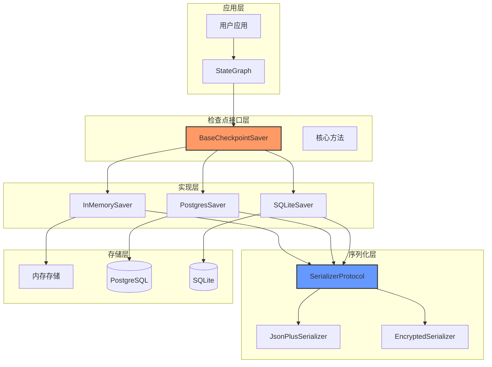
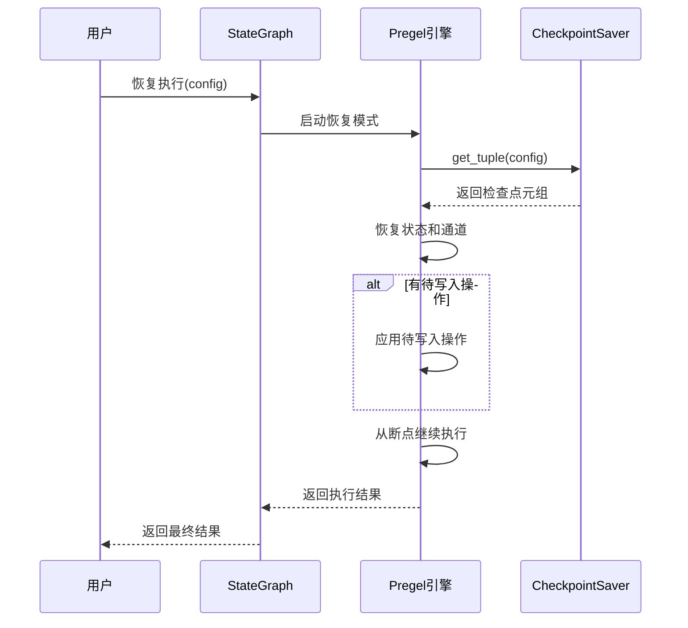

## 1. 检查点系统概述

检查点系统是LangGraph的核心特性之一，提供了完整的状态持久化和恢复能力。它允许智能体在执行过程中保存状态快照，支持暂停、恢复、重放和时间旅行调试等高级功能。

### 1.1 系统架构



### 1.2 核心概念

#### 1.2.1 检查点数据结构

```python
class Checkpoint(TypedDict):
    """状态快照数据结构"""
    
    v: int                              # 检查点格式版本，当前为1
    id: str                             # 检查点唯一ID，单调递增
    ts: str                             # 时间戳（ISO 8601格式）
    channel_values: dict[str, Any]      # 通道值映射
    channel_versions: ChannelVersions   # 通道版本映射  
    versions_seen: dict[str, ChannelVersions]  # 节点已见版本记录
    updated_channels: list[str] | None  # 本次更新的通道列表
```

#### 1.2.2 检查点元数据

```python
class CheckpointMetadata(TypedDict, total=False):
    """检查点元数据"""
    
    source: Literal["input", "loop", "update", "fork"]  # 检查点来源
    step: int                           # 步骤编号（-1为输入，0+为循环）
    parents: dict[str, str]             # 父检查点ID映射
```

#### 1.2.3 检查点元组

```python
class CheckpointTuple(NamedTuple):
    """检查点完整元组"""
    
    config: RunnableConfig              # 运行配置
    checkpoint: Checkpoint              # 检查点数据
    metadata: CheckpointMetadata        # 元数据
    parent_config: RunnableConfig | None  # 父配置
    pending_writes: list[PendingWrite] | None  # 待写入操作
```

## 2. BaseCheckpointSaver 基础接口

### 2.1 核心接口定义

```python
class BaseCheckpointSaver(Generic[V]):
    """
    检查点保存器基类
    
    特性：
    1. 提供统一的检查点操作接口
    2. 支持同步和异步操作
    3. 插件化的序列化机制
    4. 版本管理和冲突检测
    """
    
    serde: SerializerProtocol = JsonPlusSerializer()  # 序列化器
    
    def __init__(
        self,
        *,
        serde: SerializerProtocol | None = None,
    ) -> None:
        """
        初始化检查点保存器
        
        参数：
        - serde: 自定义序列化器（可选）
        """
        self.serde = maybe_add_typed_methods(serde or self.serde)
    
    @property
    def config_specs(self) -> list:
        """
        定义检查点保存器的配置规格
        
        返回值：配置字段规格列表
        """
        return []
```

### 2.2 核心方法接口

#### 2.2.1 读取操作

```python
def get(self, config: RunnableConfig) -> Checkpoint | None:
    """
    获取检查点数据
    
    参数：
    - config: 包含thread_id和checkpoint_id的配置
    
    返回值：检查点数据或None
    """
    if value := self.get_tuple(config):
        return value.checkpoint

def get_tuple(self, config: RunnableConfig) -> CheckpointTuple | None:
    """
    获取完整的检查点元组
    
    参数：
    - config: 运行配置
    
    返回值：检查点元组或None
    
    注意：子类必须实现此方法
    """
    raise NotImplementedError

def list(
    self,
    config: RunnableConfig | None,
    *,
    filter: dict[str, Any] | None = None,
    before: RunnableConfig | None = None,
    limit: int | None = None,
) -> Iterator[CheckpointTuple]:
    """
    列出匹配条件的检查点
    
    参数：
    - config: 基础配置过滤器
    - filter: 额外过滤条件
    - before: 列出此配置之前创建的检查点
    - limit: 返回检查点的最大数量
    
    返回值：检查点元组迭代器
    
    注意：子类必须实现此方法
    """
    raise NotImplementedError
```

#### 2.2.2 写入操作

```python
def put(
    self,
    config: RunnableConfig,
    checkpoint: Checkpoint,
    metadata: CheckpointMetadata,
    new_versions: ChannelVersions,
) -> RunnableConfig:
    """
    存储检查点及其配置和元数据
    
    参数：
    - config: 检查点的配置
    - checkpoint: 要存储的检查点
    - metadata: 检查点元数据
    - new_versions: 此次写入的新通道版本
    
    返回值：存储后更新的配置
    
    注意：子类必须实现此方法
    """
    raise NotImplementedError

def put_writes(
    self,
    config: RunnableConfig,
    writes: Sequence[tuple[str, Any]],
    task_id: str,
    task_path: str = "",
) -> None:
    """
    存储链接到检查点的中间写入操作
    
    参数：
    - config: 相关检查点的配置
    - writes: 要存储的写入操作列表
    - task_id: 创建写入操作的任务ID
    - task_path: 创建写入操作的任务路径
    
    注意：子类必须实现此方法
    """
    raise NotImplementedError
```

#### 2.2.3 版本管理

```python
def get_next_version(self, current: V | None, channel: None) -> V:
    """
    生成通道的下一个版本ID
    
    默认使用整数版本，每次递增1。子类可以重写此方法使用
    字符串/整数/浮点数版本，只要它们是单调递增的。
    
    参数：
    - current: 当前版本标识符（int、float或str）
    - channel: 已弃用的参数，保留以向后兼容
    
    返回值：下一个版本标识符，必须是递增的
    """
    if isinstance(current, str):
        raise NotImplementedError
    elif current is None:
        return 1
    else:
        return current + 1
```

### 2.3 异步接口

```python
# 异步版本的核心方法
async def aget_tuple(self, config: RunnableConfig) -> CheckpointTuple | None:
    """异步获取检查点元组"""
    raise NotImplementedError

async def alist(
    self,
    config: RunnableConfig | None,
    *,
    filter: dict[str, Any] | None = None,
    before: RunnableConfig | None = None,
    limit: int | None = None,
) -> AsyncIterator[CheckpointTuple]:
    """异步列出检查点"""
    raise NotImplementedError

async def aput(
    self,
    config: RunnableConfig,
    checkpoint: Checkpoint,
    metadata: CheckpointMetadata,
    new_versions: ChannelVersions,
) -> RunnableConfig:
    """异步存储检查点"""
    raise NotImplementedError

async def aput_writes(
    self,
    config: RunnableConfig,
    writes: Sequence[tuple[str, Any]],
    task_id: str,
    task_path: str = "",
) -> None:
    """异步存储写入操作"""
    raise NotImplementedError
```

## 3. InMemorySaver 内存实现

### 3.1 内存存储结构

```python
class InMemorySaver(
    BaseCheckpointSaver[str], 
    AbstractContextManager, 
    AbstractAsyncContextManager
):
    """
    内存检查点保存器
    
    数据结构：
    - storage: thread_id -> checkpoint_ns -> checkpoint_id -> checkpoint数据
    - writes: (thread_id, checkpoint_ns, checkpoint_id) -> 写入操作
    - blobs: (thread_id, checkpoint_ns, channel, version) -> 通道值
    """
    
    # 存储结构定义
    storage: defaultdict[
        str,  # thread_id
        dict[str, dict[str, tuple[tuple[str, bytes], tuple[str, bytes], str | None]]],
        # checkpoint_ns -> checkpoint_id -> (checkpoint, metadata, parent_id)
    ]
    
    writes: defaultdict[
        tuple[str, str, str],  # (thread_id, checkpoint_ns, checkpoint_id)
        dict[tuple[str, int], tuple[str, str, tuple[str, bytes], str]],
        # (task_id, write_idx) -> (task_id, channel, value, task_path)
    ]
    
    blobs: dict[
        tuple[str, str, str, str | int | float],  # (thread_id, ns, channel, version)
        tuple[str, bytes],  # (type, serialized_value)
    ]
    
    def __init__(
        self,
        *,
        serde: SerializerProtocol | None = None,
        factory: type[defaultdict] = defaultdict,
    ) -> None:
        """
        初始化内存保存器
        
        参数：
        - serde: 序列化器
        - factory: 字典工厂（支持自定义实现如Redis）
        """
        super().__init__(serde=serde)
        self.storage = factory(lambda: defaultdict(dict))
        self.writes = factory(dict)
        self.blobs = factory()
        self.stack = ExitStack()
        
        # 如果使用自定义工厂，注册到退出栈
        if factory is not defaultdict:
            self.stack.enter_context(self.storage)
            self.stack.enter_context(self.writes)
            self.stack.enter_context(self.blobs)
```

### 3.2 核心方法实现

#### 3.2.1 检查点读取

```python
def get_tuple(self, config: RunnableConfig) -> CheckpointTuple | None:
    """
    从内存存储中获取检查点元组
    
    逻辑：
    1. 从配置提取thread_id和checkpoint_ns
    2. 如果指定checkpoint_id，获取特定检查点
    3. 否则获取最新检查点
    4. 加载通道值和待写入操作
    5. 构造完整的CheckpointTuple
    """
    
    thread_id: str = config["configurable"]["thread_id"]
    checkpoint_ns: str = config["configurable"].get("checkpoint_ns", "")
    
    if checkpoint_id := get_checkpoint_id(config):
        # 获取特定检查点
        if saved := self.storage[thread_id][checkpoint_ns].get(checkpoint_id):
            checkpoint, metadata, parent_checkpoint_id = saved
            writes = self.writes[(thread_id, checkpoint_ns, checkpoint_id)].values()
            checkpoint_: Checkpoint = self.serde.loads_typed(checkpoint)
            
            return CheckpointTuple(
                config=config,
                checkpoint={
                    **checkpoint_,
                    "channel_values": self._load_blobs(
                        thread_id, checkpoint_ns, checkpoint_["channel_versions"]
                    ),
                },
                metadata=self.serde.loads_typed(metadata),
                pending_writes=[
                    (id, c, self.serde.loads_typed(v)) for id, c, v, _ in writes
                ],
                parent_config=(
                    {
                        "configurable": {
                            "thread_id": thread_id,
                            "checkpoint_ns": checkpoint_ns,
                            "checkpoint_id": parent_checkpoint_id,
                        }
                    }
                    if parent_checkpoint_id
                    else None
                ),
            )
    else:
        # 获取最新检查点
        if checkpoints := self.storage[thread_id][checkpoint_ns]:
            checkpoint_id = max(checkpoints.keys())  # 按ID排序获取最新
            checkpoint, metadata, parent_checkpoint_id = checkpoints[checkpoint_id]
            writes = self.writes[(thread_id, checkpoint_ns, checkpoint_id)].values()
            checkpoint_ = self.serde.loads_typed(checkpoint)
            
            return CheckpointTuple(
                config={
                    "configurable": {
                        "thread_id": thread_id,
                        "checkpoint_ns": checkpoint_ns,
                        "checkpoint_id": checkpoint_id,
                    }
                },
                checkpoint={
                    **checkpoint_,
                    "channel_values": self._load_blobs(
                        thread_id, checkpoint_ns, checkpoint_["channel_versions"]
                    ),
                },
                metadata=self.serde.loads_typed(metadata),
                pending_writes=[
                    (id, c, self.serde.loads_typed(v)) for id, c, v, _ in writes
                ],
                parent_config=(
                    {
                        "configurable": {
                            "thread_id": thread_id,
                            "checkpoint_ns": checkpoint_ns,
                            "checkpoint_id": parent_checkpoint_id,
                        }
                    }
                    if parent_checkpoint_id
                    else None
                ),
            )

def _load_blobs(
    self, 
    thread_id: str, 
    checkpoint_ns: str, 
    versions: ChannelVersions
) -> dict[str, Any]:
    """
    从blob存储加载通道值
    
    参数：
    - thread_id: 线程ID
    - checkpoint_ns: 检查点命名空间
    - versions: 通道版本映射
    
    返回值：反序列化后的通道值字典
    """
    channel_values: dict[str, Any] = {}
    for k, v in versions.items():
        kk = (thread_id, checkpoint_ns, k, v)
        if kk in self.blobs:
            vv = self.blobs[kk]
            if vv[0] != "empty":  # 跳过空值
                channel_values[k] = self.serde.loads_typed(vv)
    return channel_values
```

#### 3.2.2 检查点写入

```python
def put(
    self,
    config: RunnableConfig,
    checkpoint: Checkpoint,
    metadata: CheckpointMetadata,
    new_versions: ChannelVersions,
) -> RunnableConfig:
    """
    将检查点存储到内存
    
    存储逻辑：
    1. 提取配置信息
    2. 序列化检查点和元数据
    3. 存储检查点基础信息
    4. 存储通道值到blob存储
    5. 返回更新后的配置
    """
    
    thread_id = config["configurable"]["thread_id"]
    checkpoint_ns = config["configurable"].get("checkpoint_ns", "")
    checkpoint_id = checkpoint["id"]
    
    # 序列化数据
    serialized_checkpoint = self.serde.dumps_typed(checkpoint)
    serialized_metadata = self.serde.dumps_typed(metadata)
    
    # 存储检查点基础信息
    self.storage[thread_id][checkpoint_ns][checkpoint_id] = (
        serialized_checkpoint,
        serialized_metadata,
        get_checkpoint_id(config, "parent_config"),  # 父检查点ID
    )
    
    # 存储通道值到blob
    for k, v in new_versions.items():
        key = (thread_id, checkpoint_ns, k, v)
        if k in checkpoint["channel_values"]:
            # 存储实际值
            value = checkpoint["channel_values"][k]
            self.blobs[key] = self.serde.dumps_typed(value)
        else:
            # 存储空值标记
            self.blobs[key] = ("empty", b"")
    
    # 返回更新的配置
    return {
        "configurable": {
            "thread_id": thread_id,
            "checkpoint_ns": checkpoint_ns,
            "checkpoint_id": checkpoint_id,
        }
    }

def put_writes(
    self,
    config: RunnableConfig,
    writes: Sequence[tuple[str, Any]],
    task_id: str,
    task_path: str = "",
) -> None:
    """
    存储待写入操作
    
    写入逻辑：
    1. 构造写入操作的唯一键
    2. 序列化写入值
    3. 存储到writes字典中
    """
    
    thread_id = config["configurable"]["thread_id"]
    checkpoint_ns = config["configurable"].get("checkpoint_ns", "")
    checkpoint_id = get_checkpoint_id(config)
    
    key = (thread_id, checkpoint_ns, checkpoint_id)
    
    if key not in self.writes:
        self.writes[key] = {}
    
    # 存储每个写入操作
    for idx, (channel, value) in enumerate(writes):
        write_key = (task_id, idx)
        serialized_value = self.serde.dumps_typed(value)
        
        self.writes[key][write_key] = (
            task_id,
            channel,
            serialized_value,
            task_path,
        )
```

#### 3.2.3 检查点列举

```python
def list(
    self,
    config: RunnableConfig | None,
    *,
    filter: dict[str, Any] | None = None,
    before: RunnableConfig | None = None,
    limit: int | None = None,
) -> Iterator[CheckpointTuple]:
    """
    列出匹配条件的检查点
    
    列举逻辑：
    1. 确定搜索范围（thread_id, checkpoint_ns）
    2. 应用过滤条件
    3. 按时间戳排序
    4. 限制返回数量
    """
    
    # 确定搜索范围
    if config:
        thread_id = config["configurable"]["thread_id"]
        checkpoint_ns = config["configurable"].get("checkpoint_ns", "")
        thread_ids = [thread_id]
    else:
        thread_ids = list(self.storage.keys())
        checkpoint_ns = ""
    
    # 收集所有匹配的检查点
    checkpoints = []
    
    for tid in thread_ids:
        if checkpoint_ns:
            namespaces = [checkpoint_ns]
        else:
            namespaces = list(self.storage[tid].keys())
        
        for ns in namespaces:
            for cid, (checkpoint, metadata, parent_id) in self.storage[tid][ns].items():
                checkpoint_data = self.serde.loads_typed(checkpoint)
                metadata_data = self.serde.loads_typed(metadata)
                
                # 应用过滤条件
                if filter:
                    if not self._matches_filter(metadata_data, filter):
                        continue
                
                # 应用before条件
                if before:
                    before_id = get_checkpoint_id(before)
                    if before_id and cid >= before_id:
                        continue
                
                # 构造检查点元组
                checkpoint_tuple = CheckpointTuple(
                    config={
                        "configurable": {
                            "thread_id": tid,
                            "checkpoint_ns": ns,
                            "checkpoint_id": cid,
                        }
                    },
                    checkpoint={
                        **checkpoint_data,
                        "channel_values": self._load_blobs(
                            tid, ns, checkpoint_data["channel_versions"]
                        ),
                    },
                    metadata=metadata_data,
                    pending_writes=None,  # 按需加载
                    parent_config=(
                        {
                            "configurable": {
                                "thread_id": tid,
                                "checkpoint_ns": ns,
                                "checkpoint_id": parent_id,
                            }
                        }
                        if parent_id
                        else None
                    ),
                )
                
                checkpoints.append(checkpoint_tuple)
    
    # 按时间戳倒序排列
    checkpoints.sort(key=lambda x: x.checkpoint["ts"], reverse=True)
    
    # 应用限制
    if limit:
        checkpoints = checkpoints[:limit]
    
    for checkpoint_tuple in checkpoints:
        yield checkpoint_tuple

def _matches_filter(
    self, 
    metadata: CheckpointMetadata, 
    filter_dict: dict[str, Any]
) -> bool:
    """检查元数据是否匹配过滤条件"""
    for key, value in filter_dict.items():
        if key not in metadata or metadata[key] != value:
            return False
    return True
```

## 4. 序列化机制

### 4.1 SerializerProtocol 接口

```python
class SerializerProtocol(Protocol):
    """序列化器协议"""
    
    def dumps(self, obj: Any) -> bytes:
        """序列化对象为字节串"""
        ...
    
    def loads(self, data: bytes) -> Any:
        """从字节串反序列化对象"""
        ...
    
    def dumps_typed(self, obj: tuple[str, Any]) -> tuple[str, bytes]:
        """类型化序列化"""
        ...
    
    def loads_typed(self, data: tuple[str, bytes]) -> Any:
        """类型化反序列化"""
        ...
```

### 4.2 JsonPlusSerializer 实现

```python
class JsonPlusSerializer:
    """
    增强的JSON序列化器
    
    特性：
    1. 支持复杂Python对象
    2. 保持类型信息
    3. 处理循环引用
    4. 自定义类型扩展
    """
    
    def __init__(
        self,
        *,
        file_path: Path | None = None,
        at_least_one_serializer: bool = True,
    ) -> None:
        self._encoders_by_name: dict[str, tuple[type, Callable[[Any], Any]]] = {}
        self._decoders_by_name: dict[str, Callable[[Any], Any]] = {}
        self._encoders_by_type: dict[type, str] = {}
        
        # 注册默认编码器
        self._register_default_encoders()
        
        if file_path:
            self._load_from_file(file_path)
    
    def _register_default_encoders(self) -> None:
        """注册默认类型编码器"""
        
        # 日期时间类型
        self._encoders_by_name["datetime"] = (
            datetime,
            lambda obj: obj.isoformat(),
        )
        self._decoders_by_name["datetime"] = lambda data: datetime.fromisoformat(data)
        self._encoders_by_type[datetime] = "datetime"
        
        # UUID类型
        self._encoders_by_name["uuid"] = (
            UUID,
            str,
        )
        self._decoders_by_name["uuid"] = UUID
        self._encoders_by_type[UUID] = "uuid"
        
        # 更多类型...
    
    def dumps(self, obj: Any) -> bytes:
        """序列化对象"""
        try:
            return orjson.dumps(
                obj,
                default=self._encode_object,
                option=orjson.OPT_SERIALIZE_NUMPY | orjson.OPT_NON_STR_KEYS,
            )
        except Exception as e:
            raise SerializationError(f"Failed to serialize object: {e}")
    
    def loads(self, data: bytes) -> Any:
        """反序列化对象"""
        try:
            return orjson.loads(data)
        except Exception as e:
            raise SerializationError(f"Failed to deserialize data: {e}")
    
    def _encode_object(self, obj: Any) -> Any:
        """编码复杂对象"""
        obj_type = type(obj)
        
        if encoder_name := self._encoders_by_type.get(obj_type):
            _, encoder = self._encoders_by_name[encoder_name]
            return {
                "__type": encoder_name,
                "__value": encoder(obj),
            }
        
        # 尝试基类编码
        for cls, encoder_name in self._encoders_by_type.items():
            if isinstance(obj, cls):
                _, encoder = self._encoders_by_name[encoder_name]
                return {
                    "__type": encoder_name,
                    "__value": encoder(obj),
                }
        
        raise TypeError(f"Object of type {obj_type} is not serializable")
    
    def _decode_object(self, obj: Any) -> Any:
        """解码复杂对象"""
        if isinstance(obj, dict) and "__type" in obj:
            type_name = obj["__type"]
            if decoder := self._decoders_by_name.get(type_name):
                return decoder(obj["__value"])
        
        return obj
```

### 4.3 加密序列化器

```python
class EncryptedSerializer:
    """
    加密序列化器
    
    特性：
    1. 数据加密存储
    2. 密钥管理
    3. 完整性校验
    4. 向后兼容
    """
    
    def __init__(
        self,
        key: bytes,
        inner: SerializerProtocol | None = None,
    ) -> None:
        if len(key) != 32:
            raise ValueError("Key must be 32 bytes")
        
        self.key = key
        self.inner = inner or JsonPlusSerializer()
        self.cipher_suite = Fernet(key)
    
    def dumps(self, obj: Any) -> bytes:
        """加密序列化"""
        # 先序列化
        serialized = self.inner.dumps(obj)
        
        # 再加密
        encrypted = self.cipher_suite.encrypt(serialized)
        
        return encrypted
    
    def loads(self, data: bytes) -> Any:
        """解密反序列化"""
        try:
            # 先解密
            decrypted = self.cipher_suite.decrypt(data)
            
            # 再反序列化
            return self.inner.loads(decrypted)
            
        except Exception as e:
            raise SerializationError(f"Failed to decrypt/deserialize: {e}")
```

## 5. 检查点生命周期管理

### 5.1 检查点创建流程

```mermaid
sequenceDiagram
    participant Graph as StateGraph
    participant Engine as Pregel引擎
    participant Saver as CheckpointSaver
    participant Storage as 存储后端
    
    Graph->>Engine: 开始执行
    Engine->>Engine: 创建初始检查点
    
    loop 执行循环
        Engine->>Engine: 执行节点
        Engine->>Engine: 更新状态
        Engine->>Saver: put(checkpoint)
        Saver->>Storage: 存储检查点数据
        Storage-->>Saver: 确认存储
        Saver-->>Engine: 返回配置
        
        alt 有待写入操作
            Engine->>Saver: put_writes(writes)
            Saver->>Storage: 存储写入操作
            Storage-->>Saver: 确认存储
        end
        
        alt 需要中断
            Engine->>Engine: 保存中断状态
            break 中断执行
        end
    end
    
    Engine-->>Graph: 返回最终结果
```

### 5.2 检查点恢复流程



### 5.3 版本管理机制

```python
class VersionManager:
    """
    版本管理器：处理检查点版本控制
    """
    
    def __init__(self, checkpointer: BaseCheckpointSaver):
        self.checkpointer = checkpointer
    
    def create_checkpoint_id(self, timestamp: str | None = None) -> str:
        """
        创建检查点ID
        
        使用uuid6确保时间排序和唯一性
        """
        if timestamp:
            # 使用指定时间戳
            dt = datetime.fromisoformat(timestamp.replace('Z', '+00:00'))
            return str(uuid6.uuid6(dt))
        else:
            # 使用当前时间
            return str(uuid6.uuid6())
    
    def get_version_chain(
        self, 
        config: RunnableConfig
    ) -> list[CheckpointTuple]:
        """
        获取检查点版本链
        
        返回从最新到最旧的检查点列表
        """
        chain = []
        current_config = config
        
        while current_config:
            checkpoint_tuple = self.checkpointer.get_tuple(current_config)
            if not checkpoint_tuple:
                break
            
            chain.append(checkpoint_tuple)
            current_config = checkpoint_tuple.parent_config
        
        return chain
    
    def fork_checkpoint(
        self,
        source_config: RunnableConfig,
        target_thread_id: str,
        metadata_updates: dict[str, Any] | None = None,
    ) -> RunnableConfig:
        """
        分叉检查点到新的线程
        
        参数：
        - source_config: 源检查点配置
        - target_thread_id: 目标线程ID
        - metadata_updates: 元数据更新
        
        返回值：新检查点的配置
        """
        
        # 获取源检查点
        source_tuple = self.checkpointer.get_tuple(source_config)
        if not source_tuple:
            raise ValueError("Source checkpoint not found")
        
        # 创建新的检查点ID
        new_checkpoint_id = self.create_checkpoint_id()
        
        # 复制检查点数据
        new_checkpoint = copy_checkpoint(source_tuple.checkpoint)
        new_checkpoint["id"] = new_checkpoint_id
        new_checkpoint["ts"] = datetime.now(timezone.utc).isoformat()
        
        # 更新元数据
        new_metadata = dict(source_tuple.metadata)
        new_metadata["source"] = "fork"
        if metadata_updates:
            new_metadata.update(metadata_updates)
        
        # 创建新配置
        new_config = {
            "configurable": {
                "thread_id": target_thread_id,
                "checkpoint_ns": source_config["configurable"].get("checkpoint_ns", ""),
                "checkpoint_id": new_checkpoint_id,
            }
        }
        
        # 存储新检查点
        self.checkpointer.put(
            new_config,
            new_checkpoint,
            new_metadata,
            new_checkpoint["channel_versions"],
        )
        
        return new_config
```

## 6. 使用示例和最佳实践

### 6.1 基础使用示例

```python
from langgraph.checkpoint.memory import InMemorySaver
from langgraph.graph import StateGraph, MessagesState

# 创建检查点保存器
checkpointer = InMemorySaver()

# 创建图并启用检查点
graph = StateGraph(MessagesState)
graph.add_node("agent", agent_node)
graph.set_entry_point("agent")
graph.set_finish_point("agent")

compiled = graph.compile(checkpointer=checkpointer)

# 执行图（自动创建检查点）
config = {"configurable": {"thread_id": "thread-1"}}
result = compiled.invoke({"messages": [{"role": "user", "content": "Hello"}]}, config)

# 列出检查点历史
for checkpoint in checkpointer.list(config):
    print(f"Checkpoint {checkpoint.checkpoint['id']} at {checkpoint.checkpoint['ts']}")
```

### 6.2 检查点恢复示例

```python
# 从特定检查点恢复
checkpoint_id = "01234567-89ab-cdef-0123-456789abcdef"
resume_config = {
    "configurable": {
        "thread_id": "thread-1",
        "checkpoint_id": checkpoint_id,
    }
}

# 从检查点继续执行
result = compiled.invoke(
    {"messages": [{"role": "user", "content": "Continue from here"}]}, 
    resume_config
)
```

### 6.3 自定义检查点保存器

```python
import redis
from langgraph.checkpoint.base import BaseCheckpointSaver

class RedisCheckpointSaver(BaseCheckpointSaver):
    """Redis检查点保存器实现"""
    
    def __init__(self, redis_url: str, **kwargs):
        super().__init__(**kwargs)
        self.redis = redis.from_url(redis_url)
    
    def get_tuple(self, config: RunnableConfig) -> CheckpointTuple | None:
        """从Redis获取检查点"""
        thread_id = config["configurable"]["thread_id"]
        checkpoint_ns = config["configurable"].get("checkpoint_ns", "")
        
        if checkpoint_id := get_checkpoint_id(config):
            key = f"checkpoint:{thread_id}:{checkpoint_ns}:{checkpoint_id}"
        else:
            # 获取最新检查点ID
            pattern = f"checkpoint:{thread_id}:{checkpoint_ns}:*"
            keys = self.redis.keys(pattern)
            if not keys:
                return None
            # 按ID排序获取最新
            keys.sort()
            key = keys[-1].decode()
        
        # 获取检查点数据
        data = self.redis.hgetall(key)
        if not data:
            return None
        
        # 反序列化数据
        checkpoint = self.serde.loads(data[b'checkpoint'])
        metadata = self.serde.loads(data[b'metadata'])
        
        return CheckpointTuple(
            config=config,
            checkpoint=checkpoint,
            metadata=metadata,
            parent_config=None,  # 简化实现
            pending_writes=None,
        )
    
    def put(
        self,
        config: RunnableConfig,
        checkpoint: Checkpoint,
        metadata: CheckpointMetadata,
        new_versions: ChannelVersions,
    ) -> RunnableConfig:
        """存储检查点到Redis"""
        thread_id = config["configurable"]["thread_id"]
        checkpoint_ns = config["configurable"].get("checkpoint_ns", "")
        checkpoint_id = checkpoint["id"]
        
        key = f"checkpoint:{thread_id}:{checkpoint_ns}:{checkpoint_id}"
        
        # 序列化并存储
        self.redis.hset(key, mapping={
            "checkpoint": self.serde.dumps(checkpoint),
            "metadata": self.serde.dumps(metadata),
        })
        
        # 设置过期时间（可选）
        self.redis.expire(key, 86400 * 7)  # 7天过期
        
        return config

# 使用自定义保存器
redis_saver = RedisCheckpointSaver("redis://localhost:6379/0")
compiled = graph.compile(checkpointer=redis_saver)
```

## 7. 性能优化和监控

### 7.1 性能优化策略

```python
class OptimizedCheckpointSaver(BaseCheckpointSaver):
    """优化版检查点保存器"""
    
    def __init__(self, **kwargs):
        super().__init__(**kwargs)
        
        # 启用压缩
        self.enable_compression = True
        
        # 批处理缓冲区
        self.batch_buffer = []
        self.batch_size = 100
        self.batch_timeout = 5.0  # 秒
        
        # 异步写入队列
        self.write_queue = asyncio.Queue(maxsize=1000)
        self.background_writer = None
    
    async def _background_write_loop(self):
        """后台批量写入循环"""
        batch = []
        
        while True:
            try:
                # 等待写入项目或超时
                item = await asyncio.wait_for(
                    self.write_queue.get(), 
                    timeout=self.batch_timeout
                )
                batch.append(item)
                
                # 批量写入
                if len(batch) >= self.batch_size:
                    await self._flush_batch(batch)
                    batch = []
                    
            except asyncio.TimeoutError:
                # 超时，写入现有批次
                if batch:
                    await self._flush_batch(batch)
                    batch = []
    
    async def _flush_batch(self, batch: list):
        """刷新批次到存储"""
        # 实际的批量写入逻辑
        pass
    
    def put(self, config, checkpoint, metadata, new_versions):
        """非阻塞检查点存储"""
        if self.enable_compression:
            checkpoint = self._compress_checkpoint(checkpoint)
        
        # 添加到异步队列
        try:
            self.write_queue.put_nowait((config, checkpoint, metadata, new_versions))
        except asyncio.QueueFull:
            # 队列满，同步写入
            return self._sync_put(config, checkpoint, metadata, new_versions)
        
        return config
    
    def _compress_checkpoint(self, checkpoint: Checkpoint) -> Checkpoint:
        """压缩检查点数据"""
        import gzip
        
        compressed_checkpoint = dict(checkpoint)
        
        # 压缩通道值
        if "channel_values" in checkpoint:
            channel_data = self.serde.dumps(checkpoint["channel_values"])
            compressed_data = gzip.compress(channel_data)
            compressed_checkpoint["channel_values"] = {
                "__compressed": True,
                "__data": compressed_data,
            }
        
        return compressed_checkpoint
```

### 7.2 监控和调试

```python
class MonitoredCheckpointSaver:
    """带监控的检查点保存器"""
    
    def __init__(self, inner: BaseCheckpointSaver):
        self.inner = inner
        self.metrics = {
            "gets": 0,
            "puts": 0,
            "list_calls": 0,
            "total_size": 0,
            "avg_latency": 0.0,
        }
        self.start_time = time.time()
    
    def get_tuple(self, config: RunnableConfig) -> CheckpointTuple | None:
        """监控版get_tuple"""
        start = time.time()
        
        try:
            result = self.inner.get_tuple(config)
            self.metrics["gets"] += 1
            
            if result:
                size = len(self.inner.serde.dumps(result.checkpoint))
                self.metrics["total_size"] += size
            
            return result
            
        finally:
            # 更新延迟
            latency = time.time() - start
            self._update_latency(latency)
    
    def put(self, config, checkpoint, metadata, new_versions):
        """监控版put"""
        start = time.time()
        
        try:
            result = self.inner.put(config, checkpoint, metadata, new_versions)
            self.metrics["puts"] += 1
            
            # 记录大小
            size = len(self.inner.serde.dumps(checkpoint))
            self.metrics["total_size"] += size
            
            return result
            
        finally:
            latency = time.time() - start
            self._update_latency(latency)
    
    def _update_latency(self, latency: float):
        """更新平均延迟"""
        total_ops = self.metrics["gets"] + self.metrics["puts"]
        if total_ops > 1:
            self.metrics["avg_latency"] = (
                self.metrics["avg_latency"] * (total_ops - 1) + latency
            ) / total_ops
        else:
            self.metrics["avg_latency"] = latency
    
    def get_stats(self) -> dict:
        """获取统计信息"""
        uptime = time.time() - self.start_time
        total_ops = self.metrics["gets"] + self.metrics["puts"]
        
        return {
            **self.metrics,
            "uptime": uptime,
            "ops_per_second": total_ops / uptime if uptime > 0 else 0,
            "avg_size_mb": self.metrics["total_size"] / (1024 * 1024),
        }

# 使用监控保存器
base_saver = InMemorySaver()
monitored_saver = MonitoredCheckpointSaver(base_saver)

# 周期性打印统计信息
async def print_stats():
    while True:
        stats = monitored_saver.get_stats()
        print(f"Checkpoint Stats: {stats}")
        await asyncio.sleep(30)
```

## 8. 总结

检查点系统是LangGraph的关键特性，提供了强大的状态管理能力：

### 8.1 核心优势

1. **完整状态持久化**：支持图执行过程中任意时刻的状态保存
2. **灵活恢复机制**：支持从任意检查点恢复执行
3. **多后端支持**：内存、PostgreSQL、SQLite等多种存储选择
4. **版本管理**：完整的版本控制和分支功能
5. **性能优化**：批处理、压缩、异步写入等优化手段

### 8.2 设计特点

1. **接口统一**：清晰的抽象接口便于扩展不同存储后端
2. **序列化可插拔**：支持多种序列化策略和加密需求
3. **监控友好**：丰富的监控接口支持性能分析
4. **容错设计**：完整的错误处理和数据一致性保证

检查点系统为构建可靠的长期运行AI应用提供了坚实的基础，是LangGraph企业级部署的重要保障。
