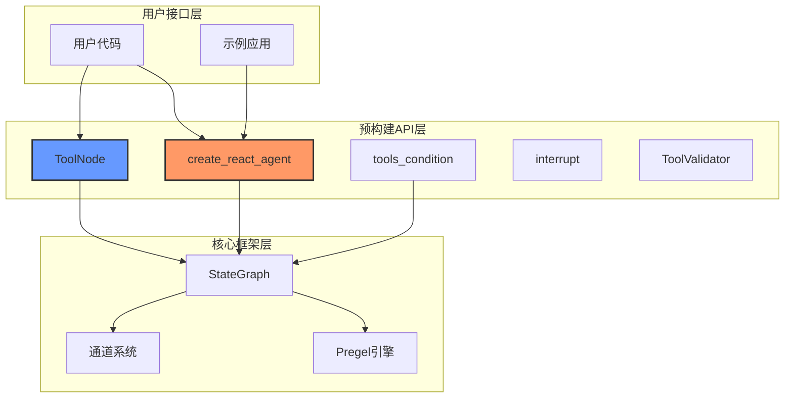

## 1. 预构建组件概述

预构建组件（Prebuilt）是LangGraph提供的高级API层，为常见的AI应用模式提供开箱即用的解决方案。这些组件基于核心框架构建，封装了最佳实践，大大简化了开发流程。

### 1.1 组件架构



### 1.2 核心组件列表

| 组件 | 功能 | 用途 |
|-----|------|-----|
| `create_react_agent` | ReAct Agent构建器 | 创建工具调用型智能体 |
| `ToolNode` | 工具执行节点 | 执行LLM工具调用 |
| `tools_condition` | 工具条件路由 | 根据工具调用情况路由 |
| `ToolValidator` | 工具验证器 | 验证工具调用结果 |
| `interrupt` | 中断处理 | 人机交互中断点 |

## 2. create_react_agent 详解

### 2.1 核心实现

`create_react_agent` 是最重要的预构建组件，实现了ReAct（Reasoning and Acting）模式的智能体。

```python
def create_react_agent(
    model: Union[
        str,
        LanguageModelLike,
        Callable[[StateSchema, Runtime[ContextT]], BaseChatModel],
        # ... 其他模型类型
    ],
    tools: Union[Sequence[Union[BaseTool, Callable, dict[str, Any]]], ToolNode],
    *,
    prompt: Optional[Prompt] = None,
    response_format: Optional[Union[StructuredResponseSchema, tuple[str, StructuredResponseSchema]]] = None,
    pre_model_hook: Optional[RunnableLike] = None,
    post_model_hook: Optional[RunnableLike] = None,
    state_schema: Optional[StateSchemaType] = None,
    context_schema: Optional[Type[Any]] = None,
    checkpointer: Optional[Checkpointer] = None,
    store: Optional[BaseStore] = None,
    interrupt_before: Optional[list[str]] = None,
    interrupt_after: Optional[list[str]] = None,
    debug: bool = False,
    version: Literal["v1", "v2"] = "v2",
    name: Optional[str] = None,
) -> CompiledStateGraph:
    """
    创建ReAct智能体图
    
    ReAct模式工作流：
    1. 接收用户输入
    2. LLM推理并决定是否需要工具
    3. 如果需要工具，执行工具调用
    4. 将工具结果反馈给LLM
    5. 重复直到得到最终答案
    """
    
    # 1. 参数验证和预处理
    if isinstance(model, str):
        model = _get_model_from_string(model)
    
    # 2. 处理工具
    if not isinstance(tools, ToolNode):
        tool_node = ToolNode(tools, handle_tool_errors=True)
    else:
        tool_node = tools
    
    # 3. 确定状态模式
    if state_schema is None:
        state_schema = AgentState
    
    # 4. 构建图
    return _build_react_graph(
        model=model,
        tool_node=tool_node,
        prompt=prompt,
        response_format=response_format,
        pre_model_hook=pre_model_hook,
        post_model_hook=post_model_hook,
        state_schema=state_schema,
        context_schema=context_schema,
        checkpointer=checkpointer,
        store=store,
        interrupt_before=interrupt_before,
        interrupt_after=interrupt_after,
        debug=debug,
        version=version,
        name=name,
    )
```

### 2.2 图结构构建

#### 2.2.1 ReAct Graph 构建逻辑

```python
def _build_react_graph(
    model: LanguageModelLike,
    tool_node: ToolNode,
    **kwargs: Any,
) -> CompiledStateGraph:
    """
    构建ReAct智能体图结构
    
    图结构：
    START -> [pre_hook] -> agent -> tools_condition -> tools -> agent
                                 \-> structured_response -> END
    """
    
    # 1. 创建状态图
    graph = StateGraph(state_schema, context_schema=context_schema)
    
    # 2. 添加前置钩子（可选）
    if pre_model_hook:
        graph.add_node("pre_hook", pre_model_hook)
        graph.add_edge(START, "pre_hook")
        model_input = "pre_hook"
    else:
        model_input = START
    
    # 3. 添加智能体节点
    agent_node = _create_agent_node(model, prompt)
    graph.add_node("agent", agent_node)
    graph.add_edge(model_input, "agent")
    
    # 4. 添加后置钩子（可选，仅v2版本）
    if post_model_hook and version == "v2":
        graph.add_node("post_hook", post_model_hook)
        graph.add_edge("agent", "post_hook")
        condition_input = "post_hook"
    else:
        condition_input = "agent"
    
    # 5. 添加工具节点
    if tool_node.tools:  # 只有工具时才添加
        graph.add_node("tools", tool_node)
        graph.add_conditional_edges(
            condition_input,
            tools_condition,
            {"tools": "tools", END: END}
        )
        graph.add_edge("tools", "agent")
    else:
        graph.add_edge(condition_input, END)
    
    # 6. 添加结构化响应处理（可选）
    if response_format:
        structured_node = _create_structured_response_node(
            model, response_format
        )
        graph.add_node("structured_response", structured_node)
        # 修改条件边路由
        graph.add_conditional_edges(
            condition_input,
            _structured_tools_condition,
            {
                "tools": "tools",
                "structured": "structured_response",
                END: END
            }
        )
        graph.add_edge("structured_response", END)
    
    # 7. 编译图
    return graph.compile(
        checkpointer=checkpointer,
        store=store,
        interrupt_before=interrupt_before,
        interrupt_after=interrupt_after,
        debug=debug,
        name=name or "ReActAgent",
    )
```

#### 2.2.2 智能体节点实现

```python
def _create_agent_node(
    model: LanguageModelLike,
    prompt: Optional[Prompt] = None,
) -> Callable:
    """
    创建智能体节点函数
    
    智能体职责：
    1. 处理消息历史
    2. 应用提示词
    3. 调用语言模型
    4. 返回模型响应
    """
    
    def agent_node(state: AgentState, runtime: Runtime) -> dict:
        """
        智能体节点实现
        
        输入：当前状态（包含消息历史）
        输出：模型响应（AI消息）
        """
        
        # 1. 获取消息列表
        messages = state.get("messages", [])
        
        # 2. 处理特殊消息键
        llm_input_messages = state.get("llm_input_messages")
        if llm_input_messages is not None:
            # 使用自定义LLM输入消息
            input_messages = llm_input_messages
        else:
            input_messages = messages
        
        # 3. 应用提示词
        if prompt:
            if isinstance(prompt, str):
                # 字符串提示词转为系统消息
                system_msg = SystemMessage(content=prompt)
                input_messages = [system_msg] + input_messages
            elif callable(prompt):
                # 可调用提示词
                prompt_result = prompt(state, runtime)
                if isinstance(prompt_result, str):
                    system_msg = SystemMessage(content=prompt_result)
                    input_messages = [system_msg] + input_messages
                elif isinstance(prompt_result, list):
                    input_messages = prompt_result + input_messages
        
        # 4. 检查剩余步数（防止无限循环）
        remaining_steps = state.get("remaining_steps", float("inf"))
        if remaining_steps < 2:
            # 步数不足，返回错误消息
            return {
                "messages": [
                    AIMessage(
                        content="Sorry, need more steps to process this request.",
                        id=str(uuid4()),
                    )
                ]
            }
        
        # 5. 获取模型实例
        if callable(model) and not isinstance(model, Runnable):
            # 动态模型选择
            model_instance = model(state, runtime)
        else:
            model_instance = model
        
        # 6. 调用模型
        try:
            response = model_instance.invoke(input_messages, runtime.config)
            
            # 7. 处理响应
            if not isinstance(response, AIMessage):
                # 转换为AI消息
                response = AIMessage(content=str(response), id=str(uuid4()))
            
            return {
                "messages": [response],
                "remaining_steps": remaining_steps - 1,
            }
            
        except Exception as e:
            # 错误处理
            error_msg = AIMessage(
                content=f"Error occurred: {str(e)}",
                id=str(uuid4()),
            )
            return {
                "messages": [error_msg],
                "remaining_steps": remaining_steps - 1,
            }
    
    return agent_node
```

### 2.3 状态模式定义

#### 2.3.1 AgentState 定义

```python
class AgentState(TypedDict):
    """
    ReAct智能体的状态模式
    
    状态字段：
    - messages: 对话消息列表（必需）
    - remaining_steps: 剩余执行步数（可选）
    - llm_input_messages: 自定义LLM输入（可选）
    """
    
    # 消息列表，使用add_messages reducer进行合并
    messages: Annotated[list[AnyMessage], add_messages]
    
    # 剩余步数，用于防止无限循环
    remaining_steps: NotRequired[int]
    
    # 自定义LLM输入消息（不会更新主消息列表）
    llm_input_messages: NotRequired[list[AnyMessage]]

# Pydantic版本（用于更严格的类型检查）
class AgentStatePydantic(BaseModel):
    """AgentState的Pydantic版本"""
    
    messages: Annotated[list[AnyMessage], add_messages]
    remaining_steps: Optional[int] = None
    llm_input_messages: Optional[list[AnyMessage]] = None
```

### 2.4 模型管理机制

#### 2.4.1 静态和动态模型支持

```python
def _get_model(
    model: Union[str, LanguageModelLike, Callable],
    state: AgentState,
    runtime: Runtime,
) -> BaseChatModel:
    """
    获取模型实例，支持静态和动态模型
    
    模型类型：
    1. 字符串：模型标识符（如"openai:gpt-4"）
    2. 模型实例：直接使用
    3. 可调用对象：动态模型选择函数
    """
    
    if isinstance(model, str):
        # 字符串模型标识符
        return _create_model_from_string(model)
    
    elif hasattr(model, "invoke"):
        # 已实例化的模型
        return model
    
    elif callable(model):
        # 动态模型选择函数
        try:
            # 检查函数签名
            sig = inspect.signature(model)
            params = list(sig.parameters.keys())
            
            if len(params) >= 2:
                # 函数需要state和runtime参数
                result = model(state, runtime)
            elif len(params) == 1:
                # 只需要state参数
                result = model(state)
            else:
                # 无参数函数
                result = model()
            
            if not hasattr(result, "invoke"):
                raise TypeError(f"Dynamic model function must return a callable model")
            
            return result
            
        except Exception as e:
            raise ValueError(f"Error calling dynamic model function: {e}")
    
    else:
        raise TypeError(f"Unsupported model type: {type(model)}")

def _create_model_from_string(model_str: str) -> BaseChatModel:
    """从字符串标识符创建模型实例"""
    
    if ":" not in model_str:
        raise ValueError(f"Invalid model string format: {model_str}")
    
    provider, model_name = model_str.split(":", 1)
    
    # 根据提供商创建模型
    if provider == "openai":
        from langchain_openai import ChatOpenAI
        return ChatOpenAI(model=model_name)
    
    elif provider == "anthropic":
        from langchain_anthropic import ChatAnthropic
        return ChatAnthropic(model=model_name)
    
    elif provider == "groq":
        from langchain_groq import ChatGroq
        return ChatGroq(model=model_name)
    
    else:
        raise ValueError(f"Unsupported model provider: {provider}")
```

#### 2.4.2 工具绑定检查

```python
def _should_bind_tools(
    model: BaseChatModel,
    tools: list[Any],
) -> bool:
    """
    检查是否需要为模型绑定工具
    
    检查逻辑：
    1. 模型是否支持工具调用
    2. 是否已经绑定了工具
    3. 工具列表是否与已绑定工具匹配
    """
    
    # 1. 检查模型是否支持工具调用
    if not hasattr(model, "bind_tools"):
        return False
    
    # 2. 检查是否已绑定工具
    if hasattr(model, "kwargs") and "tools" in model.kwargs:
        bound_tools = model.kwargs["tools"]
        
        # 3. 比较工具列表
        if len(bound_tools) == len(tools):
            # 简单比较工具名称
            bound_names = {
                getattr(tool, "name", str(tool))
                for tool in bound_tools
            }
            new_names = {
                getattr(tool, "name", str(tool))
                for tool in tools
            }
            
            return bound_names != new_names
    
    return True
```

## 3. ToolNode 工具执行节点

### 3.1 ToolNode 核心实现

```python
class ToolNode:
    """
    工具节点：执行LLM工具调用的专用节点
    
    特性：
    1. 并行执行多个工具调用
    2. 错误处理和恢复
    3. 工具参数注入
    4. 结果格式化
    """
    
    tools: dict[str, Any]                          # 工具字典
    handle_tool_errors: bool                       # 是否处理工具错误
    handled_types: tuple[type, ...] | None         # 处理的消息类型
    
    def __init__(
        self,
        tools: Sequence[Union[BaseTool, Callable, dict[str, Any]]],
        *,
        name: str = "tools",
        tags: list[str] | None = None,
        handle_tool_errors: bool = True,
        handled_types: tuple[type, ...] | None = None,
    ) -> None:
        """
        初始化工具节点
        
        参数：
        - tools: 工具列表（支持多种格式）
        - handle_tool_errors: 是否捕获和处理工具错误
        - handled_types: 要处理的消息类型
        """
        
        # 1. 标准化工具格式
        self.tools = {}
        for tool in tools:
            if isinstance(tool, dict):
                # 字典格式工具
                self.tools[tool["name"]] = tool
            elif hasattr(tool, "name"):
                # 有名称属性的工具
                self.tools[tool.name] = tool
            else:
                # 可调用对象
                name = getattr(tool, "__name__", str(tool))
                self.tools[name] = tool
        
        self.handle_tool_errors = handle_tool_errors
        self.name = name
        self.tags = tags or []
        
        # 2. 推断处理的消息类型
        if handled_types is None:
            self.handled_types = _infer_handled_types(self.tools)
        else:
            self.handled_types = handled_types
    
    def __call__(
        self, 
        state: Union[list[AnyMessage], dict[str, Any], Any]
    ) -> dict[str, list[ToolMessage]]:
        """
        执行工具调用
        
        执行流程：
        1. 提取工具调用
        2. 并行执行工具
        3. 格式化结果
        4. 返回工具消息
        """
        
        # 1. 提取消息和工具调用
        if isinstance(state, list):
            messages = state
        elif isinstance(state, dict):
            messages = state.get("messages", [])
        else:
            # 尝试获取messages属性
            messages = getattr(state, "messages", [])
        
        # 2. 找到最后的AI消息中的工具调用
        tool_calls = []
        for message in reversed(messages):
            if isinstance(message, AIMessage) and message.tool_calls:
                tool_calls = message.tool_calls
                break
        
        if not tool_calls:
            return {"messages": []}
        
        # 3. 执行工具调用
        results = self._execute_tools(tool_calls, state)
        
        return {"messages": results}
    
    def _execute_tools(
        self,
        tool_calls: list[ToolCall],
        state: Any,
    ) -> list[ToolMessage]:
        """
        执行工具调用列表
        
        支持：
        1. 并行执行
        2. 错误处理
        3. 参数注入
        """
        
        results = []
        
        # 并行执行工具调用
        with concurrent.futures.ThreadPoolExecutor() as executor:
            futures = {
                executor.submit(self._execute_single_tool, call, state): call
                for call in tool_calls
            }
            
            for future in concurrent.futures.as_completed(futures):
                tool_call = futures[future]
                try:
                    result = future.result()
                    results.append(result)
                except Exception as e:
                    if self.handle_tool_errors:
                        # 创建错误消息
                        error_result = ToolMessage(
                            content=f"Tool execution error: {str(e)}",
                            tool_call_id=tool_call["id"],
                            name=tool_call["name"],
                            id=str(uuid4()),
                        )
                        results.append(error_result)
                    else:
                        raise
        
        return results
    
    def _execute_single_tool(
        self,
        tool_call: ToolCall,
        state: Any,
    ) -> ToolMessage:
        """
        执行单个工具调用
        
        处理步骤：
        1. 获取工具实例
        2. 准备参数（包括注入参数）
        3. 执行工具
        4. 格式化结果
        """
        
        tool_name = tool_call["name"]
        tool_args = tool_call.get("args", {})
        tool_id = tool_call["id"]
        
        # 1. 获取工具
        if tool_name not in self.tools:
            raise ValueError(f"Unknown tool: {tool_name}")
        
        tool = self.tools[tool_name]
        
        # 2. 准备参数
        final_args = dict(tool_args)
        
        # 3. 处理参数注入
        if hasattr(tool, "__annotations__"):
            injected_args = _get_state_args(tool, state)
            final_args.update(injected_args)
        
        # 4. 执行工具
        if isinstance(tool, BaseTool):
            # LangChain工具
            result = tool.invoke(final_args)
        elif callable(tool):
            # 可调用对象
            result = tool(**final_args)
        else:
            # 字典格式工具
            func = tool.get("function")
            if func:
                result = func(**final_args)
            else:
                raise ValueError(f"Tool {tool_name} is not executable")
        
        # 5. 创建工具消息
        return ToolMessage(
            content=str(result),
            tool_call_id=tool_id,
            name=tool_name,
            id=str(uuid4()),
        )
```

### 3.2 参数注入机制

#### 3.2.1 状态注入

```python
class InjectedState:
    """状态注入标记类"""
    pass

class InjectedStore:
    """存储注入标记类"""
    
    def __init__(self, namespace: Optional[tuple[str, ...]] = None):
        self.namespace = namespace

def _get_state_args(tool: Callable, state: Any) -> dict[str, Any]:
    """
    获取需要注入的状态参数
    
    支持的注入类型：
    1. InjectedState: 注入完整状态
    2. InjectedStore: 注入存储实例
    3. InjectedToolCallId: 注入工具调用ID
    """
    
    injected = {}
    
    # 获取函数签名
    sig = inspect.signature(tool)
    type_hints = get_type_hints(tool, include_extras=True)
    
    for param_name, param in sig.parameters.items():
        param_type = type_hints.get(param_name)
        
        if param_type:
            # 检查是否为注解类型
            origin = get_origin(param_type)
            args = get_args(param_type)
            
            if origin is Annotated and len(args) >= 2:
                annotation = args[1]
                
                if isinstance(annotation, type) and issubclass(annotation, InjectedState):
                    # 注入状态
                    injected[param_name] = state
                
                elif isinstance(annotation, InjectedStore):
                    # 注入存储
                    if hasattr(state, "store") and state.store:
                        injected[param_name] = state.store
                    else:
                        raise ValueError("Store not available for injection")
                
                elif isinstance(annotation, type) and issubclass(annotation, InjectedToolCallId):
                    # 注入工具调用ID（需要在调用时设置）
                    pass
    
    return injected
```

#### 3.2.2 工具错误处理

```python
def _handle_tool_error(
    error: Exception,
    tool_call: ToolCall,
    handle_tool_errors: bool = True,
) -> ToolMessage:
    """
    处理工具执行错误
    
    错误处理策略：
    1. ToolException: 返回工具定义的错误消息
    2. 其他异常: 返回通用错误消息
    3. 不处理错误: 重新抛出异常
    """
    
    if not handle_tool_errors:
        raise error
    
    if isinstance(error, ToolException):
        # 工具特定错误
        error_content = str(error)
    else:
        # 通用错误
        error_content = f"Error: {error.__class__.__name__}: {str(error)}"
    
    return ToolMessage(
        content=error_content,
        tool_call_id=tool_call["id"],
        name=tool_call["name"],
        id=str(uuid4()),
        additional_kwargs={"error": True},
    )
```

## 4. 条件路由函数

### 4.1 tools_condition 实现

```python
def tools_condition(
    state: Union[list[AnyMessage], dict[str, Any], Any]
) -> Literal["tools", "__end__"]:
    """
    工具条件路由函数
    
    路由逻辑：
    1. 检查最后的AI消息是否有工具调用
    2. 有工具调用 -> 路由到"tools"节点
    3. 无工具调用 -> 路由到END
    """
    
    # 1. 提取消息列表
    if isinstance(state, list):
        messages = state
    elif isinstance(state, dict):
        messages = state.get("messages", [])
    else:
        messages = getattr(state, "messages", [])
    
    # 2. 检查最后的消息
    if not messages:
        return END
    
    last_message = messages[-1]
    
    # 3. 检查是否为AI消息且有工具调用
    if isinstance(last_message, AIMessage) and last_message.tool_calls:
        return "tools"
    
    return END

def _structured_tools_condition(
    state: Union[list[AnyMessage], dict[str, Any], Any]
) -> Literal["tools", "structured", "__end__"]:
    """
    支持结构化响应的工具条件路由
    
    路由逻辑：
    1. 有工具调用 -> "tools"
    2. 无工具调用但需要结构化响应 -> "structured"  
    3. 其他 -> END
    """
    
    # 提取消息
    messages = _extract_messages(state)
    if not messages:
        return END
    
    last_message = messages[-1]
    
    # 检查工具调用
    if isinstance(last_message, AIMessage) and last_message.tool_calls:
        return "tools"
    
    # 检查是否需要结构化响应
    if _should_generate_structured_response(state):
        return "structured"
    
    return END
```

### 4.2 自定义条件函数

```python
def create_custom_condition(
    *,
    tools_key: str = "tools",
    end_key: str = END,
    message_key: str = "messages",
    check_func: Optional[Callable[[AnyMessage], bool]] = None,
) -> Callable:
    """
    创建自定义条件路由函数
    
    参数：
    - tools_key: 工具节点键名
    - end_key: 结束节点键名  
    - message_key: 消息键名
    - check_func: 自定义检查函数
    """
    
    def condition(state: Any) -> str:
        # 提取消息
        messages = state.get(message_key, []) if isinstance(state, dict) else []
        
        if not messages:
            return end_key
        
        last_message = messages[-1]
        
        # 使用自定义检查函数
        if check_func:
            if check_func(last_message):
                return tools_key
            else:
                return end_key
        
        # 默认检查工具调用
        if isinstance(last_message, AIMessage) and last_message.tool_calls:
            return tools_key
        
        return end_key
    
    return condition
```

## 5. 中断和验证组件

### 5.1 中断处理

```python
def interrupt(
    reason: str,
    *,
    rollback: bool = False,
    when: Optional[Callable[[Any], bool]] = None,
) -> Callable:
    """
    创建中断处理节点
    
    参数：
    - reason: 中断原因
    - rollback: 是否回滚状态
    - when: 中断条件函数
    """
    
    def interrupt_node(state: Any) -> dict:
        """中断节点实现"""
        
        # 检查中断条件
        if when and not when(state):
            return {}  # 不中断，继续执行
        
        # 创建中断信号
        interrupt_signal = Interrupt(
            reason=reason,
            rollback=rollback,
            state=state,
        )
        
        raise GraphInterrupt(interrupt_signal)
    
    return interrupt_node

class Interrupt:
    """中断信号类"""
    
    def __init__(
        self,
        reason: str,
        rollback: bool = False,
        state: Any = None,
    ):
        self.reason = reason
        self.rollback = rollback
        self.state = state
        self.timestamp = datetime.now()
```

### 5.2 工具验证器

```python
class ToolValidator:
    """
    工具验证器：验证工具调用和结果
    """
    
    def __init__(
        self,
        *,
        validate_input: bool = True,
        validate_output: bool = True,
        schema_validation: bool = True,
        custom_validators: Optional[dict[str, Callable]] = None,
    ):
        self.validate_input = validate_input
        self.validate_output = validate_output
        self.schema_validation = schema_validation
        self.custom_validators = custom_validators or {}
    
    def validate_tool_call(
        self,
        tool_call: ToolCall,
        tool_schema: Optional[dict] = None,
    ) -> tuple[bool, Optional[str]]:
        """
        验证工具调用
        
        验证内容：
        1. 工具名称是否存在
        2. 参数格式是否正确
        3. 必需参数是否提供
        4. 参数类型是否匹配
        """
        
        tool_name = tool_call.get("name")
        tool_args = tool_call.get("args", {})
        
        # 1. 检查工具名称
        if not tool_name:
            return False, "Tool name is missing"
        
        # 2. 模式验证
        if self.schema_validation and tool_schema:
            try:
                self._validate_against_schema(tool_args, tool_schema)
            except ValidationError as e:
                return False, f"Schema validation failed: {e}"
        
        # 3. 自定义验证
        if tool_name in self.custom_validators:
            try:
                is_valid = self.custom_validators[tool_name](tool_call)
                if not is_valid:
                    return False, f"Custom validation failed for {tool_name}"
            except Exception as e:
                return False, f"Custom validation error: {e}"
        
        return True, None
    
    def validate_tool_result(
        self,
        result: Any,
        tool_name: str,
        expected_schema: Optional[dict] = None,
    ) -> tuple[bool, Optional[str]]:
        """
        验证工具执行结果
        
        验证内容：
        1. 结果格式
        2. 结果类型
        3. 结果内容
        """
        
        # 1. 基础验证
        if result is None:
            return False, "Tool result is None"
        
        # 2. 模式验证
        if expected_schema:
            try:
                self._validate_against_schema(result, expected_schema)
            except ValidationError as e:
                return False, f"Result schema validation failed: {e}"
        
        # 3. 自定义结果验证
        validator_name = f"{tool_name}_result"
        if validator_name in self.custom_validators:
            try:
                is_valid = self.custom_validators[validator_name](result)
                if not is_valid:
                    return False, f"Custom result validation failed for {tool_name}"
            except Exception as e:
                return False, f"Custom result validation error: {e}"
        
        return True, None
    
    def _validate_against_schema(self, data: Any, schema: dict) -> None:
        """根据JSON Schema验证数据"""
        from jsonschema import validate, ValidationError as JsonSchemaError
        
        try:
            validate(instance=data, schema=schema)
        except JsonSchemaError as e:
            raise ValidationError(str(e))

class ValidationError(Exception):
    """验证错误异常"""
    pass
```

## 6. 使用示例

### 6.1 基础ReAct Agent

```python
from langchain_anthropic import ChatAnthropic
from langgraph.prebuilt import create_react_agent

# 定义工具
def get_weather(city: str) -> str:
    """获取指定城市的天气信息"""
    return f"It's sunny in {city} with 22°C"

def search_web(query: str) -> str:
    """搜索网络内容"""
    return f"Search results for: {query}"

# 创建智能体
model = ChatAnthropic(model="claude-3-sonnet-20240229")
tools = [get_weather, search_web]

agent = create_react_agent(
    model=model,
    tools=tools,
    prompt="You are a helpful assistant. Use tools when needed.",
)

# 运行智能体
result = agent.invoke({
    "messages": [{"role": "user", "content": "What's the weather in Beijing?"}]
})

print(result["messages"][-1].content)
```

### 6.2 带状态注入的工具

```python
from typing import Annotated
from langgraph.prebuilt.tool_node import InjectedState, InjectedStore
from langgraph.store.memory import InMemoryStore

def search_with_context(
    query: str,
    state: Annotated[dict, InjectedState],
    store: Annotated[InMemoryStore, InjectedStore()],
) -> str:
    """
    带上下文的搜索工具
    
    可以访问当前状态和存储
    """
    
    # 从状态获取上下文
    messages = state.get("messages", [])
    context = f"Previous messages: {len(messages)}"
    
    # 从存储获取历史信息
    history = store.get(("search_history",), "queries") or []
    
    # 执行搜索
    result = f"Searching '{query}' with context: {context}"
    
    # 保存查询历史
    history.append(query)
    store.put(("search_history",), "queries", history)
    
    return result

# 使用带存储的智能体
store = InMemoryStore()
agent = create_react_agent(
    model=model,
    tools=[search_with_context],
    store=store,
)
```

### 6.3 自定义条件路由

```python
from langgraph.graph import StateGraph, START, END
from langgraph.prebuilt import ToolNode, create_custom_condition

# 自定义检查函数
def should_use_tools(message: AnyMessage) -> bool:
    """自定义工具使用条件"""
    if isinstance(message, AIMessage):
        # 检查消息内容是否包含特定关键词
        content = message.content.lower()
        if "search" in content or "weather" in content:
            return True
        # 或者检查工具调用
        return bool(message.tool_calls)
    return False

# 创建自定义条件函数
custom_condition = create_custom_condition(
    tools_key="tools",
    end_key=END,
    check_func=should_use_tools,
)

# 手动构建图
graph = StateGraph(MessagesState)
graph.add_node("agent", agent_node)
graph.add_node("tools", ToolNode(tools))

graph.add_edge(START, "agent")
graph.add_conditional_edges("agent", custom_condition)
graph.add_edge("tools", "agent")

compiled = graph.compile()
```

## 7. 总结

预构建组件为LangGraph提供了强大而易用的高级API：

### 7.1 核心优势

1. **开箱即用**：无需深入了解底层机制即可构建复杂应用
2. **最佳实践**：集成了经过验证的设计模式和优化策略
3. **高度可定制**：提供丰富的配置选项满足不同需求
4. **类型安全**：完整的类型提示确保开发体验
5. **错误恢复**：内置错误处理和恢复机制

### 7.2 设计特点

1. **组合式架构**：组件可以独立使用或组合使用
2. **扩展性**：支持自定义工具、条件和处理逻辑
3. **性能优化**：并行执行和智能缓存提升性能
4. **调试友好**：丰富的日志和调试信息

这些预构建组件大大降低了构建AI应用的门槛，让开发者能够专注于业务逻辑而不是底层实现细节。在下一部分中，我们将分析检查点系统的实现原理。
