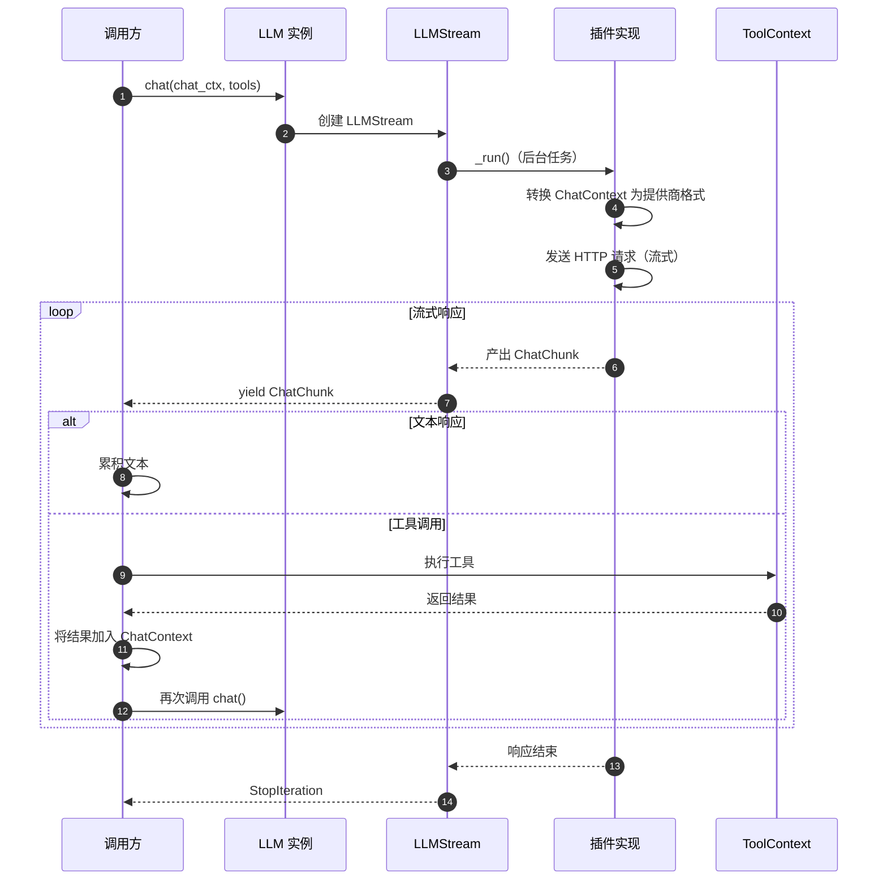

# LiveKit Agents 框架 - LLM 模块概览

## 模块职责

LLM 模块提供大语言模型的统一抽象接口，支持多种 LLM 提供商（OpenAI、Anthropic、Google 等）的集成。该模块定义了对话上下文管理、流式生成、工具调用、实时 API 等核心能力。

**核心职责**：
- 定义 LLM 统一抽象接口
- 管理对话上下文（ChatContext）
- 支持流式和批量推理
- 工具函数定义与调用
- Realtime API 支持（双向实时对话）
- MCP（Model Context Protocol）服务器集成

## 输入/输出

### 输入
- **对话上下文** (`ChatContext`): 包含历史消息的对话上下文
- **工具列表** (`list[FunctionTool]`): 可调用的函数工具
- **模型设置** (`ToolChoice`, `parallel_tool_calls` 等): 推理参数
- **连接选项** (`APIConnectOptions`): 超时、重试等配置

### 输出
- **流式响应** (`LLMStream`): 异步迭代器，产出 ChatChunk
- **完整消息** (`ChatMessage`): 包含文本内容和工具调用
- **工具调用请求** (`FunctionToolCall`): LLM 请求执行的工具
- **指标数据** (`CompletionUsage`): Token 使用量统计

## 上下游依赖

### 上游（调用方）
- **AgentActivity**: Voice 模块中驱动对话循环
- **用户代码**: 直接调用 LLM 进行推理

### 下游（被调用方）
- **具体 LLM 插件**: OpenAI、Anthropic、Google 等实现
- **工具函数**: 用户定义或 MCP 提供的函数

## 模块级架构图

```mermaid
flowchart TB
    subgraph LLM["LLM 模块"]
        direction TB
        
        subgraph Core["核心接口"]
            LLMBase[LLM<br/>基类]
            LLMStream[LLMStream<br/>流式生成器]
            RealtimeModel[RealtimeModel<br/>实时模型基类]
            RealtimeSession[RealtimeSession<br/>实时会话]
        end
        
        subgraph Context["上下文管理"]
            ChatContext[ChatContext<br/>对话上下文]
            ChatMessage[ChatMessage<br/>消息]
            ChatContent[ChatContent<br/>内容]
            ChatRole[ChatRole<br/>角色枚举]
        end
        
        subgraph Tools["工具系统"]
            FunctionTool[FunctionTool<br/>函数工具]
            RawFunctionTool[RawFunctionTool<br/>原始工具]
            ToolContext[ToolContext<br/>工具上下文]
            FunctionCall[FunctionCall<br/>函数调用]
            FunctionCallOutput[FunctionCallOutput<br/>调用输出]
        end
        
        subgraph MCP["MCP 集成"]
            MCPServer[MCPServer<br/>MCP 服务器抽象]
        end
        
        subgraph Adapter["适配器"]
            FallbackAdapter[FallbackAdapter<br/>降级适配器]
        end
        
        subgraph Utils["工具函数"]
            ProviderFormat[_provider_format<br/>提供商格式转换]
            LLMUtils[utils<br/>工具函数]
        end
        
        LLMBase -->|创建| LLMStream
        RealtimeModel -->|创建| RealtimeSession
        
        LLMStream -->|消费| ChatContext
        LLMStream -->|产出| ChatMessage
        
        ChatContext -->|包含| ChatMessage
        ChatMessage -->|包含| ChatContent
        ChatMessage -->|包含| FunctionCall
        ChatMessage -->|包含| FunctionCallOutput
        ChatMessage -->|关联| ChatRole
        
        LLMBase -->|使用| FunctionTool
        LLMBase -->|使用| RawFunctionTool
        ToolContext -->|管理| FunctionTool
        ToolContext -->|管理| RawFunctionTool
        
        LLMBase -->|可集成| MCPServer
        RealtimeSession -->|可集成| MCPServer
        
        FallbackAdapter -->|包装| LLMBase
        
        LLMUtils -->|辅助| ChatContext
        ProviderFormat -->|转换| ChatContext
    end
    
    subgraph External["外部"]
        Plugins[LLM 插件<br/>OpenAI/Anthropic/...]
        UserTools[用户工具函数]
        MCPExternal[外部 MCP 服务]
    end
    
    LLMBase <-.实现.-|Plugins
    FunctionTool <-.包装.-|UserTools
    MCPServer <-.连接.-|MCPExternal
```

### 图解与说明

#### 核心接口层

**LLM 基类**：
- 定义 `chat()` 方法创建流式生成器
- 抽象方法由各插件实现
- 支持预热 `prewarm()` 减少冷启动

**LLMStream**：
- 异步迭代器，产出 ChatChunk
- 自动处理重试、错误恢复
- 收集指标并发布事件

**RealtimeModel**：
- 实时双向对话模型（如 OpenAI Realtime API）
- 直接处理音频输入输出
- 内置轮次检测

**RealtimeSession**：
- 管理实时会话状态
- 支持音视频输入、工具调用
- 动态更新指令和上下文

#### 上下文管理

**ChatContext**：
- 管理完整对话历史
- 支持多种内容类型（文本、图片、音频）
- 提供增删查改接口
- 支持深拷贝和序列化

**ChatMessage**：
- 单条消息，包含角色和内容
- 支持多模态内容
- 关联工具调用

**ChatRole**：
- `system`: 系统指令
- `user`: 用户消息
- `assistant`: 助手回复
- `tool`: 工具调用结果

#### 工具系统

**FunctionTool**：
- 装饰器自动生成（`@function_tool`）
- 包含函数签名、描述、参数 Schema
- 支持 Pydantic 模型验证

**ToolContext**：
- 管理所有可用工具
- 查找和执行工具
- 处理工具调用结果

**MCP 集成**：
- Model Context Protocol 外部工具服务器
- 动态获取工具列表
- 支持资源访问、提示模板等

#### 适配器

**FallbackAdapter**：
- 包装多个 LLM，实现降级
- 主 LLM 不可用时自动切换
- 发布可用性变更事件

## 关键数据结构

### ChatContext

**职责**：管理对话历史，提供消息操作接口

**核心字段**：

| 字段 | 类型 | 说明 |
|-----|------|------|
| `messages` | `list[ChatMessage \| ChatItem]` | 消息列表 |
| `_tools` | `list[FunctionTool \| RawFunctionTool]` | 工具列表 |

**核心方法**：

```python
class ChatContext:
    def append(self, item: ChatMessage | ChatItem) -> ChatContext:
        """追加消息到末尾"""
        self.messages.append(item)
        return self
    
    def insert(self, item: ChatMessage | ChatItem, index: int = 0) -> ChatContext:
        """在指定位置插入消息"""
        self.messages.insert(index, item)
        return self
    
    def copy(self, *, tools: list[FunctionTool] | None = None) -> ChatContext:
        """深拷贝上下文"""
        # 复制所有消息和元数据
        return ChatContext(
            messages=copy.deepcopy(self.messages),
            tools=tools if tools is not None else self._tools.copy(),
        )
    
    @classmethod
    def empty(cls, *, tools: list[FunctionTool] | None = None) -> ChatContext:
        """创建空上下文"""
        return cls(messages=[], tools=tools or [])
```

### FunctionTool

**职责**：封装可调用函数，提供给 LLM 使用

**核心字段**：

| 字段 | 类型 | 说明 |
|-----|------|------|
| `name` | `str` | 函数名 |
| `description` | `str` | 函数描述 |
| `callable` | `Callable` | 实际函数 |
| `arguments` | `type[BaseModel]` | 参数 Schema（Pydantic 模型） |

**使用示例**：

```python
from livekit import agents

@agents.function_tool
async def get_weather(
    location: str,
    unit: str = "celsius"
) -> str:
    """Get the current weather in a given location.
    
    Args:
        location: The city and state, e.g. San Francisco, CA
        unit: Temperature unit (celsius or fahrenheit)
    """
    # 实现逻辑
    return f"Weather in {location}: 25°C"

# 自动生成 FunctionTool，包含：
# - name: "get_weather"
# - description: 从 docstring 提取
# - arguments: 自动生成 Pydantic 模型
```

### ChatChunk

**职责**：LLM 流式生成的单个片段

**核心字段**：

| 字段 | 类型 | 说明 |
|-----|------|------|
| `choices` | `list[ChoiceDelta]` | 生成选项（通常只有一个） |
| `usage` | `CompletionUsage \| None` | Token 使用量（可选） |
| `request_id` | `str` | 请求 ID |

**ChoiceDelta 字段**：

| 字段 | 类型 | 说明 |
|-----|------|------|
| `delta` | `ChatMessage` | 增量消息（文本或工具调用） |
| `index` | `int` | 选项索引 |

## 核心流程

### LLM 推理流程



### 工具调用流程

```python
async def llm_with_tools_example():
    # 1. 准备工具
    @agents.function_tool
    async def search(query: str) -> str:
        return f"Search results for: {query}"
    
    # 2. 创建对话上下文
    chat_ctx = llm.ChatContext.empty()
    chat_ctx.append(
        llm.ChatMessage(
            role="user",
            content="Search for Python tutorials"
        )
    )
    
    # 3. 调用 LLM
    llm_instance = openai.LLM()
    stream = llm_instance.chat(
        chat_ctx=chat_ctx,
        tools=[search],
    )
    
    # 4. 处理流式响应
    async for chunk in stream:
        if chunk.choices[0].delta.tool_calls:
            # 5. LLM 请求调用工具
            for tool_call in chunk.choices[0].delta.tool_calls:
                # 6. 执行工具
                result = await search(tool_call.function.arguments["query"])
                
                # 7. 将结果加入上下文
                chat_ctx.append(
                    llm.FunctionCall(
                        call_id=tool_call.id,
                        name=tool_call.function.name,
                        arguments=tool_call.function.arguments,
                    )
                )
                chat_ctx.append(
                    llm.FunctionCallOutput(
                        call_id=tool_call.id,
                        output=result,
                    )
                )
                
                # 8. 再次调用 LLM 获取最终回复
                stream = llm_instance.chat(chat_ctx=chat_ctx, tools=[search])
        else:
            # 文本响应
            print(chunk.choices[0].delta.content, end="")
```

## 提供商格式转换

LLM 模块通过 `_provider_format` 子模块实现不同提供商的格式转换：

**支持的提供商**：
- OpenAI (`openai.py`)
- Anthropic (`anthropic.py`)
- Google (`google.py`)
- AWS Bedrock (`aws.py`)
- Mistral AI (`mistralai.py`)

**转换逻辑**：

```python
# livekit/agents/llm/_provider_format/openai.py

def to_openai_ctx(chat_ctx: ChatContext) -> list[dict]:
    """将 ChatContext 转换为 OpenAI 格式"""
    messages = []
    for msg in chat_ctx.messages:
        if isinstance(msg, ChatMessage):
            messages.append({
                "role": msg.role,
                "content": msg.text_content or "",
            })
        elif isinstance(msg, FunctionCall):
            messages.append({
                "role": "assistant",
                "tool_calls": [{
                    "id": msg.call_id,
                    "type": "function",
                    "function": {
                        "name": msg.name,
                        "arguments": json.dumps(msg.arguments),
                    }
                }]
            })
        elif isinstance(msg, FunctionCallOutput):
            messages.append({
                "role": "tool",
                "tool_call_id": msg.call_id,
                "content": msg.output,
            })
    return messages
```

## Realtime API

Realtime API 提供双向实时对话能力，无需显式的 STT/TTS 组件：

**核心特性**：
- 直接处理音频输入输出
- 服务端轮次检测
- 低延迟流式生成
- 支持工具调用

**使用示例**：

```python
from livekit.plugins import openai

# 创建 Realtime Model
model = openai.realtime.RealtimeModel(
    voice="coral",
    temperature=0.8,
)

# 在 AgentSession 中使用
session = agents.AgentSession(
    llm=model,  # 无需单独配置 STT/TTS
)

await session.start(
    room=ctx.room,
    agent=agents.Agent(
        instructions="You are a helpful assistant."
    )
)

# 推送音频帧
for frame in audio_frames:
    session.input.audio.push_frame(frame)

# 接收事件
@session.on("generation_created")
def on_generation(event):
    print(f"Agent is responding: {event.generation.id}")
```

## 配置与优化

### 连接选项

```python
from livekit.agents import APIConnectOptions

conn_options = APIConnectOptions(
    max_retry=3,        # 最大重试次数
    retry_interval=1.0, # 重试间隔（秒）
    timeout=60.0,       # 请求超时（秒）
)

stream = llm.chat(
    chat_ctx=chat_ctx,
    conn_options=conn_options,
)
```

### 工具选择

```python
from livekit.agents import llm

# 强制调用特定工具
llm.chat(
    chat_ctx=chat_ctx,
    tools=[get_weather, search],
    tool_choice=llm.ToolChoice(type="function", name="get_weather"),
)

# 自动选择
llm.chat(
    chat_ctx=chat_ctx,
    tools=[get_weather, search],
    tool_choice="auto",
)

# 禁用工具调用
llm.chat(
    chat_ctx=chat_ctx,
    tools=[get_weather, search],
    tool_choice="none",
)
```

### 性能优化

**预热模型**：
```python
llm_instance = openai.LLM()
llm_instance.prewarm()  # 建立连接池等
```

**批量推理**：
```python
# 对于非流式场景，可以一次性获取完整响应
stream = llm.chat(chat_ctx=chat_ctx)
chunks = [chunk async for chunk in stream]
full_text = "".join(chunk.choices[0].delta.content for chunk in chunks)
```

**错误处理**：
```python
@llm_instance.on("error")
def on_llm_error(error: llm.LLMError):
    if error.recoverable:
        logger.warning("LLM error, will retry")
    else:
        logger.error("LLM unrecoverable error")
```

---

**本文档版本**：基于 LiveKit Agents SDK 主分支（2025-01-04）生成  
**下一步**：查看 STT/TTS 模块文档了解语音组件实现

