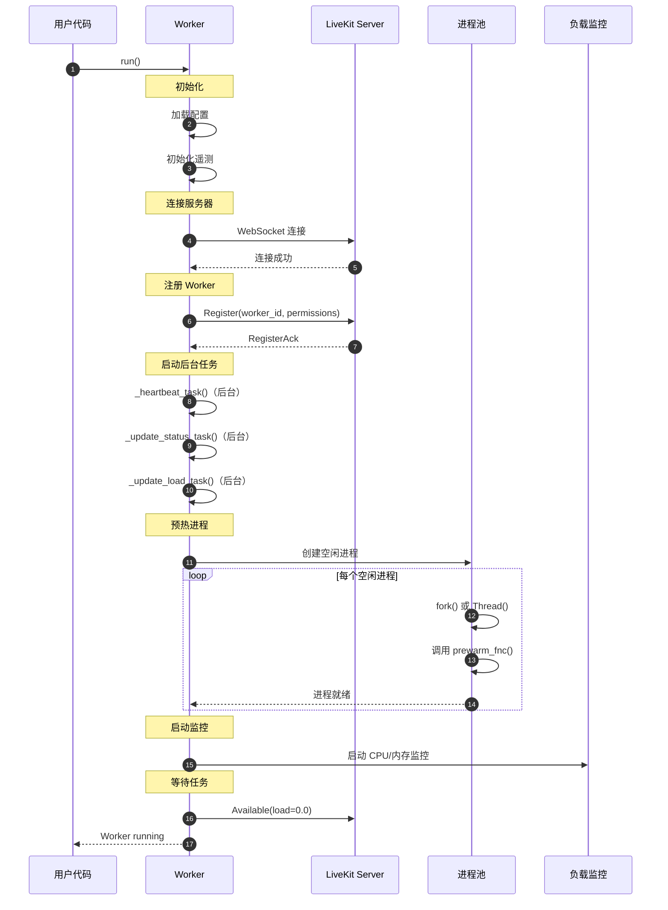
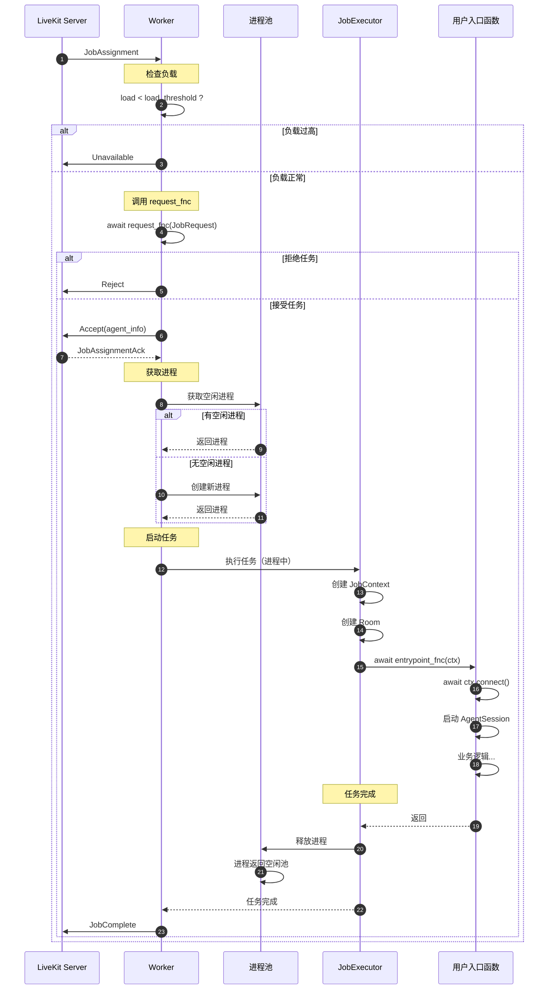
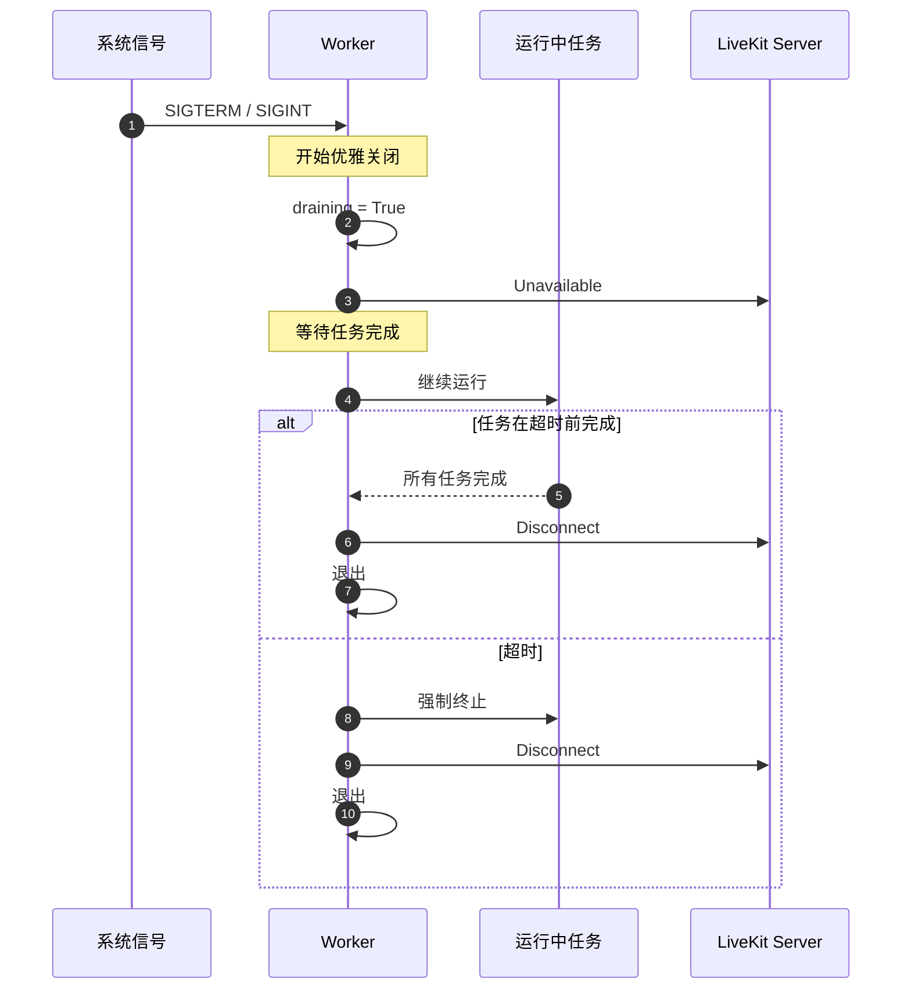

# LiveKit Agents 框架 - Worker 模块概览

## 模块职责

Worker 模块是 LiveKit Agents 框架的核心基础设施，负责与 LiveKit 服务器通信、接收任务分配、管理进程池、监控负载并执行 Agent 任务。它提供了生产环境运行 Agent 所需的完整生命周期管理能力。

**核心职责**：
- 连接 LiveKit 服务器并保持心跳
- 接收任务分配（Job Assignment）
- 管理进程池和线程池
- 负载计算与容量管理
- 进程预热与资源监控
- 优雅关闭与任务清理

## 输入/输出

### 输入
- **任务分配** (`JobAssignment`): LiveKit 服务器分配的任务
- **配置选项** (`WorkerOptions`): Worker 行为配置
- **入口函数** (`entrypoint_fnc`): 用户定义的任务处理逻辑

### 输出
- **Worker 状态**: 可用性、负载、运行状态
- **任务执行**: 在独立进程/线程中执行用户任务
- **心跳与指标**: 定期向服务器报告状态

## 上下游依赖

### 上游（调用方）
- **用户代码**: 定义 `entrypoint_fnc` 并启动 Worker

### 下游（被调用方）
- **LiveKit Server**: 服务器端的任务调度
- **JobProcess**: 进程/线程执行器
- **IPC 模块**: 进程间通信
- **Telemetry 模块**: 遥测和监控

## 模块级架构图

```mermaid
flowchart TB
    subgraph Worker["Worker 模块"]
        direction TB
        
        subgraph Core["核心组件"]
            Worker[Worker<br/>主控制器]
            WorkerOptions[WorkerOptions<br/>配置选项]
        end
        
        subgraph Connection["连接管理"]
            WebSocket[WebSocket<br/>服务器连接]
            Heartbeat[Heartbeat Task<br/>心跳任务]
            StatusUpdate[Status Update<br/>状态上报]
        end
        
        subgraph JobManagement["任务管理"]
            Assignment[Assignment Handler<br/>任务分配处理]
            JobQueue[Running Jobs<br/>运行中任务队列]
            JobExecutor[JobExecutor<br/>任务执行器]
        end
        
        subgraph ProcessPool["进程池"]
            IdleProcs[Idle Processes<br/>空闲进程池]
            RunningProcs[Running Processes<br/>运行中进程]
            ProcMonitor[Process Monitor<br/>进程监控]
        end
        
        subgraph LoadManagement["负载管理"]
            LoadCalc[Load Calculator<br/>负载计算器]
            CPUMonitor[CPU Monitor<br/>CPU 监控]
            MemoryMonitor[Memory Monitor<br/>内存监控]
        end
        
        Worker --> WorkerOptions
        Worker --> WebSocket
        Worker --> Heartbeat
        Worker --> StatusUpdate
        Worker --> Assignment
        Worker --> JobQueue
        Worker --> LoadCalc
        
        Assignment --> JobExecutor
        JobExecutor --> IdleProcs
        JobExecutor --> RunningProcs
        
        RunningProcs --> ProcMonitor
        ProcMonitor --> MemoryMonitor
        
        LoadCalc --> CPUMonitor
        LoadCalc --> JobQueue
    end
    
    subgraph External["外部"]
        LiveKitServer[LiveKit Server]
        UserCode[用户入口函数]
        JobContext[JobContext<br/>任务上下文]
    end
    
    LiveKitServer <-->|WebSocket| WebSocket
    LiveKitServer -->|Job Assignment| Assignment
    StatusUpdate -->|Worker Status| LiveKitServer
    Heartbeat -->|Ping| LiveKitServer
    
    JobExecutor -->|创建| JobContext
    JobContext -->|执行| UserCode
```

### 图解与说明

#### 核心组件

**Worker（主控制器）**：
- 管理整个 Worker 的生命周期
- 协调各子模块工作
- 提供 `run()` 方法启动 Worker

**WorkerOptions（配置选项）**：
- 定义 Worker 行为参数
- 包含入口函数、负载阈值、进程数等配置
- 支持开发/生产模式差异化配置

#### 连接管理

**WebSocket 连接**：
- 与 LiveKit 服务器建立持久连接
- 接收任务分配和控制消息
- 支持断线重连

**Heartbeat（心跳）**：
- 定期发送心跳保持连接
- 默认 30 秒间隔
- 检测网络状态

**Status Update（状态上报）**：
- 定期上报 Worker 状态
- 包含负载、可用性、正在运行的任务
- 默认 2.5 秒间隔

#### 任务管理

**Assignment Handler（任务分配处理）**：
- 接收服务器分配的任务
- 调用 `request_fnc` 决定是否接受
- 超时控制（默认 7.5s）

**JobQueue（任务队列）**：
- 维护正在运行的任务列表
- 跟踪任务状态
- 支持任务取消

**JobExecutor（任务执行器）**：
- 在独立进程/线程中执行任务
- 创建 JobContext 传递给用户代码
- 监控任务执行和资源使用

#### 进程池

**Idle Processes（空闲进程池）**：
- 预先创建空闲进程
- 减少任务启动延迟
- 可配置进程数

**Running Processes（运行中进程）**：
- 正在执行任务的进程
- 隔离任务执行环境
- 独立内存空间

**Process Monitor（进程监控）**：
- 监控进程内存使用
- 超过限制时终止进程
- 记录进程异常

#### 负载管理

**Load Calculator（负载计算器）**：
- 计算当前 Worker 负载
- 默认基于 CPU 使用率
- 支持自定义负载函数

**CPU Monitor**：
- 监控系统 CPU 使用情况
- 提供滑动平均值
- 用于负载计算

**Memory Monitor**：
- 监控进程内存使用
- 警告和限制阈值
- 防止 OOM

## 关键数据结构

### WorkerOptions

**职责**：定义 Worker 的行为和配置

**核心字段**：

| 字段 | 类型 | 默认值 | 说明 |
|-----|------|--------|------|
| `entrypoint_fnc` | `Callable[[JobContext], Awaitable[None]]` | 必填 | 任务入口函数 |
| `request_fnc` | `Callable[[JobRequest], Awaitable[None]]` | 接受所有 | 任务请求过滤函数 |
| `prewarm_fnc` | `Callable[[JobProcess], Any]` | 空函数 | 进程预热函数 |
| `load_fnc` | `Callable[[Worker], float]` | CPU 负载 | 负载计算函数 |
| `job_executor_type` | `JobExecutorType` | PROCESS | 执行器类型（进程/线程） |
| `load_threshold` | `float` | 0.7 (生产) | 负载阈值 |
| `job_memory_warn_mb` | `float` | 500 | 内存警告阈值（MB） |
| `job_memory_limit_mb` | `float` | 0 (禁用) | 内存限制（MB） |
| `drain_timeout` | `int` | 1800 | 优雅关闭超时（秒） |
| `num_idle_processes` | `int` | 自动 | 空闲进程数 |
| `shutdown_process_timeout` | `float` | 60.0 | 进程关闭超时（秒） |
| `initialize_process_timeout` | `float` | 10.0 | 进程初始化超时（秒） |
| `permissions` | `WorkerPermissions` | 默认权限 | Agent 房间权限 |
| `agent_name` | `str` | "" | 显式分发的 Agent 名称 |
| `worker_type` | `WorkerType` | ROOM | Worker 类型（房间/发布者） |
| `max_retry` | `int` | 16 | 最大重连次数 |
| `ws_url` | `str` | "ws://localhost:7880" | LiveKit 服务器地址 |
| `api_key` | `str \| None` | 环境变量 | API 密钥 |
| `api_secret` | `str \| None` | 环境变量 | API 密钥 |

### 使用示例

```python
from livekit import agents

async def entrypoint(ctx: agents.JobContext):
    await ctx.connect()
    session = agents.AgentSession(...)
    await session.start(room=ctx.room, agent=my_agent)

# 基础配置
worker = agents.Worker(
    entrypoint_fnc=entrypoint,
)

# 完整配置
worker = agents.Worker(
    entrypoint_fnc=entrypoint,
    
    # 任务过滤
    request_fnc=lambda req: req.accept() if req.room.name.startswith("support-") else None,
    
    # 进程预热
    prewarm_fnc=lambda proc: proc.userdata.update({"cache": load_cache()}),
    
    # 自定义负载
    load_fnc=lambda w: calculate_custom_load(w),
    
    # 执行器配置
    job_executor_type=agents.JobExecutorType.PROCESS,
    load_threshold=0.8,
    
    # 内存限制
    job_memory_warn_mb=1000,
    job_memory_limit_mb=2000,
    
    # 进程池
    num_idle_processes=2,
    
    # 超时配置
    drain_timeout=300,
    shutdown_process_timeout=30,
    
    # Agent 名称（显式分发）
    agent_name="customer-service-agent",
)

# 启动
await worker.run()
```

## 核心流程

### Worker 启动流程



### 任务分配流程



### 负载管理流程

```python
# 负载计算核心逻辑

class _DefaultLoadCalc:
    """默认负载计算器（基于 CPU）"""
    
    def __init__(self):
        # 5 个样本的滑动平均（覆盖 2.5s）
        self._m_avg = utils.MovingAverage(5)
        self._cpu_monitor = get_cpu_monitor()
        
        # 后台线程持续采样
        self._thread = threading.Thread(target=self._calc_load, daemon=True)
        self._thread.start()
    
    def _calc_load(self):
        """每 0.5s 采样一次 CPU"""
        while True:
            cpu_p = self._cpu_monitor.cpu_percent(interval=0.5)
            with self._lock:
                self._m_avg.add_sample(cpu_p)
    
    @classmethod
    def get_load(cls, worker: Worker) -> float:
        """返回当前负载 [0, 1]"""
        return cls._instance._m_avg.get_avg()

# Worker 使用负载

async def _update_load_task(self):
    """定期更新负载"""
    while True:
        await asyncio.sleep(UPDATE_LOAD_INTERVAL)  # 0.5s
        
        # 1. 计算负载
        load = self._opts.load_fnc(self)
        
        # 2. 检查阈值
        threshold = WorkerOptions._WorkerEnvOption.getvalue(
            self._opts.load_threshold,
            devmode=self._dev_mode
        )
        
        available = load < threshold
        
        # 3. 更新可用性
        if available != self._available:
            self._available = available
            logger.info(
                f"Worker {'available' if available else 'unavailable'} (load: {load:.2f})"
            )
```

### 进程监控流程

```python
# 进程内存监控核心逻辑

async def _watch_process_task(self, proc_pool_entry):
    """监控单个进程"""
    proc = proc_pool_entry.proc
    
    # 1. 定期检查内存
    while not proc_pool_entry.job_status.done():
        await asyncio.sleep(1.0)
        
        # 2. 获取进程内存使用
        try:
            mem_info = psutil.Process(proc.pid).memory_info()
            mem_mb = mem_info.rss / 1024 / 1024
        except Exception:
            continue
        
        # 3. 检查警告阈值
        if mem_mb > self._opts.job_memory_warn_mb:
            logger.warning(
                f"Job process memory usage high: {mem_mb:.1f}MB",
                extra={"job_id": proc_pool_entry.job.id}
            )
        
        # 4. 检查限制阈值
        if (self._opts.job_memory_limit_mb > 0 and 
            mem_mb > self._opts.job_memory_limit_mb):
            
            logger.error(
                f"Job process exceeded memory limit: {mem_mb:.1f}MB, terminating",
                extra={"job_id": proc_pool_entry.job.id}
            )
            
            # 5. 终止进程
            proc.terminate()
            break
```

## Worker API

### Worker.__init__()

**签名**：
```python
def __init__(
    self,
    *,
    entrypoint_fnc: Callable[[JobContext], Awaitable[None]],
    ...  # 其他 WorkerOptions 参数
) -> None
```

**参数**：所有 `WorkerOptions` 字段都可作为关键字参数

### Worker.run()

**签名**：
```python
async def run(self) -> None
```

**功能**：启动 Worker 并保持运行

**流程**：
1. 连接 LiveKit 服务器
2. 注册 Worker
3. 启动后台任务（心跳、状态上报、负载计算）
4. 预热进程池
5. 等待任务分配
6. 阻塞直到收到关闭信号

### Worker.drain()

**签名**：
```python
async def drain(self, timeout: float | None = None) -> None
```

**功能**：优雅关闭 Worker

**流程**：
1. 标记为 draining 状态
2. 停止接受新任务
3. 等待现有任务完成
4. 超时后强制终止

### Worker.simulate_job()

**签名**：
```python
async def simulate_job(
    self,
    room: str,
    participant_identity: str | None = None,
) -> None
```

**功能**：模拟任务执行（用于开发测试）

**参数**：
- `room`: 房间名称
- `participant_identity`: 参与者身份（可选）

**用途**：
- 本地开发测试
- 不需要连接 LiveKit 服务器
- 直接调用 entrypoint_fnc

## 配置详解

### 开发模式 vs 生产模式

Worker 自动检测运行模式并调整默认值：

| 配置项 | 开发模式 | 生产模式 |
|--------|---------|---------|
| `load_threshold` | ∞ (禁用) | 0.7 |
| `num_idle_processes` | 0 | min(CPU 核心数, 4) |
| 日志级别 | DEBUG | INFO |

**检测逻辑**：
```python
dev_mode = sys.flags.dev_mode or os.getenv("LIVEKIT_DEV_MODE") == "1"
```

### 进程 vs 线程执行

| 特性 | PROCESS | THREAD |
|-----|---------|--------|
| **隔离性** | 完全隔离 | 共享内存 |
| **崩溃影响** | 不影响其他任务 | 可能影响全部 |
| **启动开销** | 高 | 低 |
| **内存使用** | 独立空间 | 共享空间 |
| **适用场景** | 生产环境 | 开发/测试 |
| **平台支持** | Linux/Mac 优先 | Windows 推荐 |

**推荐配置**：
```python
# 生产环境：使用进程隔离
worker = agents.Worker(
    entrypoint_fnc=entrypoint,
    job_executor_type=agents.JobExecutorType.PROCESS,
    num_idle_processes=4,
)

# 开发环境：使用线程快速迭代
worker = agents.Worker(
    entrypoint_fnc=entrypoint,
    job_executor_type=agents.JobExecutorType.THREAD,
    num_idle_processes=0,
)
```

### 自定义负载函数

```python
def custom_load_calc(worker: agents.Worker) -> float:
    """自定义负载计算"""
    
    # 1. 获取运行中的任务数
    num_jobs = len(worker.running_jobs)
    max_jobs = 10
    job_load = num_jobs / max_jobs
    
    # 2. 获取系统资源
    cpu_load = psutil.cpu_percent() / 100.0
    mem_load = psutil.virtual_memory().percent / 100.0
    
    # 3. 综合计算
    load = max(job_load, cpu_load, mem_load * 0.5)
    
    return min(load, 1.0)

worker = agents.Worker(
    entrypoint_fnc=entrypoint,
    load_fnc=custom_load_calc,
    load_threshold=0.8,
)
```

## 优雅关闭

### 信号处理

Worker 自动处理以下信号：
- **SIGTERM / SIGINT**: 触发优雅关闭
- **SIGQUIT**: 立即终止（不等待任务完成）

### 关闭流程



### 配置示例

```python
worker = agents.Worker(
    entrypoint_fnc=entrypoint,
    drain_timeout=300,  # 5 分钟
    shutdown_process_timeout=30,  # 30 秒
)

# 手动触发优雅关闭
await worker.drain(timeout=60)
```

## 最佳实践

### 1. 进程预热

```python
def prewarm(proc: agents.JobProcess):
    """预热进程，加载模型"""
    
    # 加载模型到进程内存
    proc.userdata["llm"] = openai.LLM(model="gpt-4o")
    proc.userdata["stt"] = deepgram.STT()
    proc.userdata["tts"] = cartesia.TTS()
    
    logger.info("Process prewarmed")

worker = agents.Worker(
    entrypoint_fnc=entrypoint,
    prewarm_fnc=prewarm,
    num_idle_processes=2,  # 保持 2 个预热进程
)
```

### 2. 任务过滤

```python
async def request_filter(req: agents.JobRequest):
    """只接受特定房间的任务"""
    
    # 检查房间名称
    if not req.room.name.startswith("support-"):
        logger.info(f"Rejecting job for room: {req.room.name}")
        return
    
    # 检查参与者
    if req.participant and req.participant.kind == rtc.ParticipantKind.PARTICIPANT_KIND_AGENT:
        logger.info("Rejecting job for agent participant")
        return
    
    # 接受任务
    await req.accept()

worker = agents.Worker(
    entrypoint_fnc=entrypoint,
    request_fnc=request_filter,
)
```

### 3. 内存限制

```python
worker = agents.Worker(
    entrypoint_fnc=entrypoint,
    
    # 内存警告（记录日志）
    job_memory_warn_mb=800,
    
    # 内存限制（强制终止）
    job_memory_limit_mb=1500,
)
```

### 4. 多 Worker 部署

```python
# worker-1.py（处理客服任务）
worker = agents.Worker(
    entrypoint_fnc=customer_service_entrypoint,
    agent_name="customer-service",  # 显式分发
    load_threshold=0.6,
)

# worker-2.py（处理销售任务）
worker = agents.Worker(
    entrypoint_fnc=sales_entrypoint,
    agent_name="sales",
    load_threshold=0.8,
)
```

---

**本文档版本**：基于 LiveKit Agents SDK 主分支（2025-01-04）生成  
**下一步**：查看 Job 模块文档了解任务上下文管理

