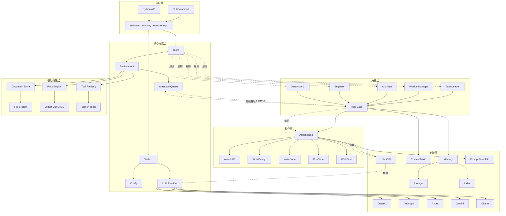
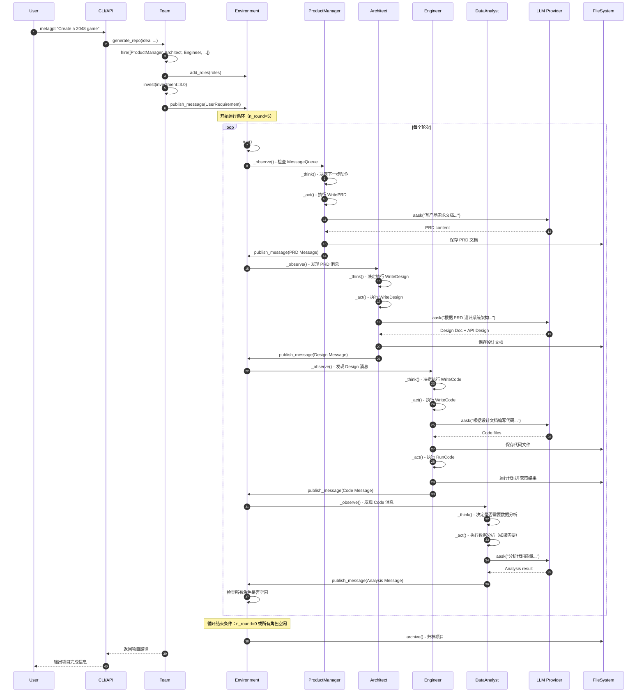

# MetaGPT-00-总览

## 0. 摘要

### 项目目标

MetaGPT 是一个多智能体协作框架，将大语言模型（LLM）组织成一个软件公司的形式，通过不同角色的协作来解决复杂任务。核心哲学是 `Code = SOP(Team)`，即通过标准化操作流程（SOP）将 LLM 组成的团队转化为可执行的代码。

### 问题域

- 单一 LLM Agent 难以处理复杂、多步骤的软件工程任务
- 需要模拟软件公司的协作流程，包括产品管理、架构设计、编码实现、测试等环节
- 支持自定义角色、动作和工作流，以适应不同的应用场景

### 核心能力边界

- **输入**：一句话需求描述
- **输出**：完整的软件项目，包括用户故事、竞品分析、需求文档、数据结构设计、API 设计、代码实现等
- **支持的角色**：ProductManager、Architect、Engineer、QA、DataAnalyst、TeamLeader 等
- **支持的 LLM**：OpenAI、Azure OpenAI、Anthropic Claude、Google Gemini、本地模型（Ollama）等

### 非目标

- 不提供 LLM 训练功能
- 不保证生成代码的绝对正确性（需要人工审查）
- 不支持实时硬件控制或物理机器人操作

### 运行环境

- **语言**：Python 3.9+（< 3.12）
- **运行时**：异步 I/O（asyncio）
- **依赖**：pydantic、openai SDK、langchain 相关库等
- **外部依赖**：Node.js + pnpm（用于前端代码生成）

### 部署形态

- **单体应用**：通过 CLI 命令行或 Python API 直接调用
- **库集成**：作为 Python 库嵌入到其他应用中
- **Docker 容器**：支持 Docker 部署
- **云服务**：支持通过 MGX（MetaGPT X）云服务使用

---

## 1. 整体架构图



### 图解与要点

#### 1. 架构分层

- **入口层**：提供 CLI 和 Python API 两种使用方式，统一通过 `generate_repo` 函数进入
- **核心框架层**：管理全局上下文（Context）、团队（Team）、环境（Environment）和消息队列
- **角色层**：实现各种软件公司角色，每个角色继承自 Role 基类
- **动作层**：定义角色可执行的原子动作，如编写文档、写代码、运行代码等
- **支持层**：提供 LLM 接入、记忆管理、上下文传递等支持功能
- **基础设施层**：提供文档存储、RAG 检索、工具注册等底层能力

#### 2. 组件职责与耦合关系

**同步调用**：
- CLI/API → Team → Environment → Roles
- Roles → Actions → LLM Provider

**异步消息**：
- Environment 通过 MessageQueue 在角色之间传递消息
- 角色通过 `watch` 机制订阅感兴趣的消息类型
- 消息驱动角色的 `_observe → _think → _act` 循环

**事件驱动**：
- 角色发布消息到 Environment
- 其他角色观察到消息后触发响应动作

#### 3. 数据流与控制流

**数据流**：
```
用户需求 → Message → Environment → 各角色的 Memory 
→ Action 处理 → LLM 生成内容 → 新 Message → Environment
```

**控制流**：
```
Team.run() → Environment.run() → 
  循环：各 Role._observe() → _think() → _act() → publish_message()
→ 直到达到轮次上限或所有角色空闲
```

#### 4. 跨进程/跨线程/跨协程路径

- **跨协程**：整个系统基于 Python asyncio 实现，所有角色和动作都是异步执行
- **跨线程**：LLM API 调用通过 aiohttp/httpx 实现异步 HTTP 请求
- **跨进程**：工具调用（如 Terminal）通过 subprocess 创建子进程执行命令

#### 5. 高可用、扩展性与状态管理

**高可用**：
- 支持序列化/反序列化机制，可保存和恢复团队状态
- Cost Manager 追踪 API 调用成本，防止超预算

**扩展性**：
- 插件化角色：通过继承 Role 基类实现自定义角色
- 插件化动作：通过继承 Action 基类实现自定义动作
- 插件化工具：通过 `@register_tool` 注册自定义工具
- 多 LLM 支持：通过 Provider Registry 机制扩展新的 LLM

**状态管理**：
- Role 级状态：Role.rc (RoleContext) 管理角色运行时状态
- Team 级状态：Environment.history 记录所有消息历史
- 持久化：支持序列化到磁盘，通过 `--recover-path` 恢复

---

## 2. 全局时序图（主要业务闭环）



### 图解与要点

#### 1. 入口与初始化

- **步骤 1-6**：用户通过 CLI 传入需求，系统创建 Team 并雇佣角色
- **关键点**：Team.hire() 将角色添加到 Environment，每个角色设置 `watch` 监听感兴趣的消息类型

#### 2. 角色协作循环

- **ProductManager（步骤 7-13）**：
  - 观察到 UserRequirement 消息
  - 执行 WritePRD 动作，调用 LLM 生成产品需求文档
  - 发布 PRD 消息供下游角色使用

- **Architect（步骤 14-19）**：
  - 观察到 PRD 消息
  - 执行 WriteDesign 动作，调用 LLM 生成系统设计和 API 设计
  - 发布 Design 消息

- **Engineer（步骤 20-27）**：
  - 观察到 Design 消息
  - 执行 WriteCode 动作生成代码
  - 执行 RunCode 动作运行并测试代码
  - 发布 Code 消息

- **DataAnalyst（步骤 28-33）**：
  - 观察到 Code 消息
  - 执行数据分析和代码质量评估
  - 发布分析结果

#### 3. 幂等性与重试

- **幂等设计**：
  - 文档和代码保存使用确定性文件名（基于任务ID）
  - 重复执行相同请求会覆盖之前的输出
  - Message ID 基于 UUID，确保每条消息唯一

- **失败重试**：
  - LLM 调用失败时，Action 抛出异常，角色保持当前状态
  - 下一轮次会重试相同的 Action
  - Cost Manager 控制总成本，超预算时抛出 NoMoneyException

#### 4. 超时与资源上界

- **轮次上限**：`n_round` 参数限制最大执行轮次（默认 5）
- **投资上限**：`investment` 参数限制最大 API 调用成本（默认 3.0 美元）
- **LLM 超时**：每次 LLM 调用默认超时 300 秒
- **空闲检测**：所有角色连续空闲时提前结束

#### 5. 回退策略

- **LLM 调用失败**：重试当前动作
- **代码运行失败**：Engineer 可选择修复或继续
- **成本超限**：立即停止所有操作，保存当前状态
- **消息队列满**：阻塞发布者直到消费者处理

---

## 3. 模块边界与交互图

### 3.1 模块清单

| 模块 | 路径 | 职责 | 对外 API | 依赖模块 |
|------|------|------|---------|---------|
| **Team** | metagpt/team.py | 团队管理，角色雇佣，项目运行 | `hire()`, `run()`, `invest()` | Environment, Role, Context |
| **Environment** | metagpt/environment/ | 消息传递，角色协调，环境管理 | `add_role()`, `publish_message()`, `run()` | Memory, Message |
| **Role** | metagpt/roles/ | 角色基类及各具体角色实现 | `_observe()`, `_think()`, `_act()`, `run()` | Action, Memory, Context |
| **Action** | metagpt/actions/ | 动作基类及各具体动作实现 | `run()`, `_aask()` | LLM, Context |
| **LLM Provider** | metagpt/provider/ | 多 LLM 接入抽象层 | `aask()`, `acompletion()`, `achat()` | 各 LLM SDK |
| **Context** | metagpt/context.py | 全局上下文与配置 | `llm()`, `serialize()`, `deserialize()` | Config, LLM |
| **Memory** | metagpt/memory/ | 消息存储与检索 | `add()`, `get()`, `get_by_action()` | Message |
| **Document Store** | metagpt/document_store/ | 文档持久化 | `save()`, `load()`, `search()` | FileSystem |
| **RAG** | metagpt/rag/ | 检索增强生成 | `retrieve()`, `add_documents()` | Vector DB, Embedding |
| **Tools** | metagpt/tools/ | 工具注册与调用 | `@register_tool`, `ToolManager` | - |
| **Prompts** | metagpt/prompts/ | 提示词模板管理 | 各 Prompt 类 | - |
| **Strategy** | metagpt/strategy/ | 思考策略（ToT, ReAct） | `solve()` | LLM |
| **ExpPool** | metagpt/exp_pool/ | 经验池管理 | `add_experience()`, `get_similar()` | Memory |

### 3.2 模块交互矩阵

| 调用方↓ / 被调方→ | Team | Environment | Role | Action | LLM | Memory | Context |
|------------------|------|-------------|------|--------|-----|--------|---------|
| **CLI/API** | 同步 | - | - | - | - | - | 同步 |
| **Team** | - | 同步 | 同步 | - | - | - | 同步 |
| **Environment** | - | - | 同步 | - | - | 同步 | 同步 |
| **Role** | - | 异步消息 | - | 同步 | - | 同步 | 同步 |
| **Action** | - | - | - | - | 同步 | - | 同步 |
| **LLM** | - | - | - | - | - | - | 同步 |

**交互说明**：

- **同步调用**：直接函数调用，等待返回结果
- **异步消息**：通过 MessageQueue 发布/订阅消息
- **错误语义**：异常向上抛出，由调用方处理
- **一致性要求**：消息发布为最终一致性，角色状态为强一致性（单线程）

---

## 4. 关键设计与权衡

### 4.1 数据一致性

**强一致性**：
- 角色状态（RoleContext）：单线程异步执行，状态变更立即可见
- 文件系统：直接写入文件，依赖文件系统的一致性保证

**最终一致性**：
- 消息传递：通过 MessageQueue 异步传递，角色按顺序处理消息
- Memory 索引：消息添加后立即索引，但检索结果可能有微小延迟

### 4.2 事务边界

**无分布式事务**：
- 每个 Action 是原子操作单元
- LLM 调用失败不会回滚文件系统写入
- 依赖幂等性保证：重试会覆盖之前的输出

### 4.3 锁与并发策略

**单线程协程模型**：
- Environment.run() 顺序处理每个角色
- 角色内部 `_observe → _think → _act` 顺序执行
- 无锁竞争，通过协程切换实现并发

**并发限制**：
- 同一时刻只有一个角色在执行
- LLM API 调用并发由 Provider 内部控制（通常支持异步批量）

### 4.4 性能关键路径

**P95 延迟瓶颈**：
- LLM API 调用：通常 5-30 秒/请求
- 文件 I/O：通常 < 100ms
- 消息处理：通常 < 10ms

**内存峰值**：
- Memory 存储所有历史消息：~1MB/100 条消息
- LLM Context：通常 < 10MB/请求
- 总内存占用：通常 < 500MB

**I/O 热点**：
- LLM API 调用：网络 I/O 密集
- 文档持久化：磁盘 I/O 密集
- 优化：异步 I/O，批量写入

### 4.5 可观测性指标

- **Cost Manager**：追踪 API 调用次数、Token 消耗、总成本
- **Logger**：记录角色行为、消息传递、错误信息
- **Message History**：Environment.history 记录所有消息

### 4.6 配置项

**核心配置** (`~/.metagpt/config2.yaml`)：

```yaml
llm:
  api_type: "openai"  # LLM 类型
  model: "gpt-4-turbo"  # 模型名称
  base_url: "https://api.openai.com/v1"  # API 端点
  api_key: "YOUR_API_KEY"  # API 密钥
  
workspace:
  path: "./workspace"  # 工作目录路径
  
logs:
  level: "INFO"  # 日志级别
```

**运行时参数**：
- `investment`：API 调用预算（美元）
- `n_round`：最大执行轮次
- `code_review`：是否启用代码审查
- `run_tests`：是否运行测试

---

## 5. 典型使用示例与最佳实践（总览级）

### 5.1 示例 1：最小可运行入口

**CLI 方式**：

```bash
# 安装
pip install metagpt

# 初始化配置
metagpt --init-config

# 运行项目
metagpt "Create a 2048 game"
```

**Python API 方式**：

```python
from metagpt.software_company import generate_repo

# 一行代码生成项目
project_path = generate_repo("Create a 2048 game")
print(f"Project generated at: {project_path}")
```

### 5.2 示例 2：自定义角色与动作

```python
from metagpt.roles import Role
from metagpt.actions import Action
from metagpt.schema import Message
from metagpt.team import Team

# 自定义动作
class WriteTestPlan(Action):
    name: str = "WriteTestPlan"
    
    async def run(self, context: str) -> str:
        prompt = f"根据以下内容编写测试计划：\n{context}"
        return await self.llm.aask(prompt)

# 自定义角色
class TestEngineer(Role):
    name: str = "TestEngineer"
    profile: str = "测试工程师"
    
    def __init__(self, **kwargs):
        super().__init__(**kwargs)
        self.set_actions([WriteTestPlan])
        self._watch([WritePRD, WriteDesign])  # 监听 PRD 和 Design 消息

# 使用自定义角色
team = Team()
team.hire([
    ProductManager(),
    Architect(),
    Engineer(),
    TestEngineer(),  # 添加自定义角色
])
team.invest(5.0)
await team.run(n_round=5, idea="开发一个在线聊天系统")
```

### 5.3 示例 3：扩展点/插件接入

```python
# 1. 自定义 LLM Provider
from metagpt.provider.base_llm import BaseLLM
from metagpt.provider.llm_provider_registry import register_provider
from metagpt.configs.llm_config import LLMType

@register_provider([LLMType.CUSTOM])
class CustomLLM(BaseLLM):
    def __init__(self, config):
        self.config = config
        # 初始化自定义 LLM 客户端
    
    async def aask(self, prompt: str, **kwargs) -> str:
        # 实现自定义 LLM 调用逻辑
        pass

# 2. 注册自定义工具
from metagpt.tools.tool_registry import register_tool

@register_tool()
class DatabaseQuery:
    """数据库查询工具"""
    
    async def query(self, sql: str) -> list:
        """执行 SQL 查询"""
        # 实现查询逻辑
        pass

# 3. 自定义记忆存储
from metagpt.memory import Memory

class RedisMemory(Memory):
    """使用 Redis 作为记忆存储"""
    
    def __init__(self, redis_url: str):
        self.redis_client = redis.from_url(redis_url)
    
    def add(self, message: Message):
        # 存储到 Redis
        pass
    
    def get(self, k=0) -> list[Message]:
        # 从 Redis 检索
        pass
```

### 5.4 规模化/上线注意事项

1. **成本控制**：
   - 设置合理的 `investment` 上限
   - 使用 Cost Manager 监控实时成本
   - 选择性价比高的模型（如 gpt-3.5-turbo）

2. **错误处理**：
   - 使用 `--recover-path` 从中断点恢复
   - 定期序列化团队状态（自动每轮序列化）
   - 记录详细日志便于调试

3. **性能优化**：
   - 使用缓存减少重复 LLM 调用
   - 批量处理相似请求
   - 选择响应更快的 LLM 端点

4. **安全性**：
   - API Key 存储在配置文件或环境变量
   - 代码审查：启用 `code_review=True`
   - 沙箱运行：限制代码执行权限

5. **可扩展性**：
   - 自定义角色和动作复用现有基类
   - 使用工具注册机制扩展能力
   - 通过 RAG 系统引入领域知识

---

**文档版本**：v1.0  
**最后更新**：2025-10-05  
**维护者**：MetaGPT 团队

