# MetaGPT-01-核心框架

本文档深入剖析 MetaGPT 的核心框架层，包括 Team（团队）、Environment（环境）、Context（上下文）三大核心组件及其交互机制。

---

## 1. 模块概览

### 1.1 职责边界

**Team（团队）**：
- 管理一组协作的角色（Roles）
- 提供角色雇佣（hire）和团队运行（run）接口
- 管理投资预算和成本控制
- 支持团队状态的序列化与反序列化

**Environment（环境）**：
- 承载角色并协调角色之间的消息传递
- 维护消息历史记录（Memory）
- 管理角色地址簿（member_addrs）用于消息路由
- 提供环境运行循环（run loop）

**Context（上下文）**：
- 管理全局配置（Config）
- 提供 LLM 实例创建和缓存
- 管理成本追踪器（CostManager）
- 提供运行时参数存储（kwargs）

### 1.2 输入/输出

| 组件 | 输入 | 输出 |
|------|------|------|
| Team | idea（需求）, roles（角色列表）, investment（预算） | project_path（项目路径）, history（消息历史） |
| Environment | roles（角色）, messages（消息） | 无直接返回，通过消息队列传递 |
| Context | config（配置） | llm（LLM 实例）, cost_manager（成本管理器） |

### 1.3 上下游依赖

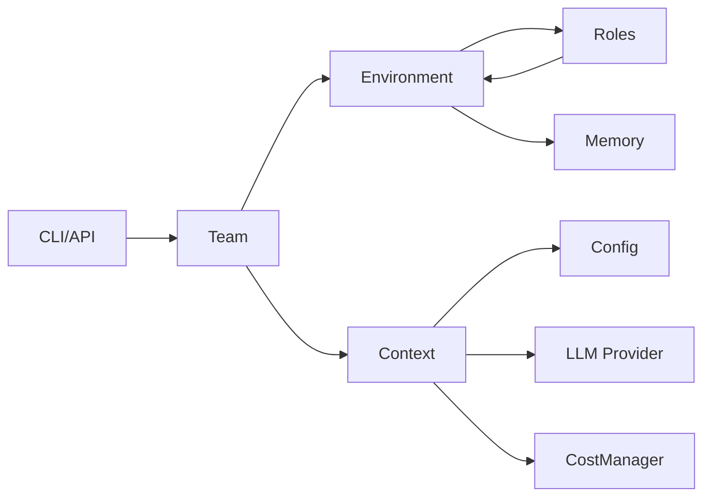

### 1.4 生命周期

1. **初始化阶段**：
   - Context 读取配置文件
   - Team 创建并初始化 Environment
   - 角色通过 hire() 加入 Environment

2. **运行阶段**：
   - Team.run() 触发 Environment.run()
   - Environment 循环调用各角色的 run()
   - 角色执行 observe → think → act 循环

3. **结束阶段**：
   - 达到轮次上限或所有角色空闲
   - Environment.archive() 归档项目
   - Team.serialize() 序列化状态（可选）

---

## 2. 模块架构图

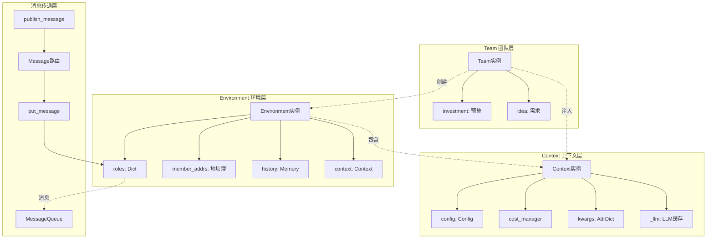

### 架构说明

#### 2.1 边界条件

- **并发控制**：Environment.run() 单线程串行执行，通过 asyncio.gather() 并发调用角色
- **消息队列容量**：MessageQueue 基于 asyncio.Queue，无硬限制，受内存约束
- **角色数量上限**：无硬编码限制，实际受 LLM Context Window 和成本约束
- **超时设置**：Environment.run() 无超时，依赖 n_round 参数控制

#### 2.2 扩展点

- **自定义 Environment**：继承 ExtEnv 实现特定环境（如游戏环境、Android 环境）
- **自定义消息路由**：重写 publish_message() 实现复杂路由逻辑
- **自定义状态持久化**：重写 serialize()/deserialize() 使用外部存储

#### 2.3 状态持有位置

- **Team 状态**：idea, investment, use_mgx
- **Environment 状态**：roles, member_addrs, history
- **Context 状态**：config, cost_manager, kwargs, _llm

#### 2.4 资源占用要点

- **内存占用**：
  - History Memory：每条消息约 1-10KB
  - LLM 实例缓存：约 10-50MB
  - 角色状态：每个角色约 100KB-1MB

- **磁盘占用**：
  - 序列化状态：约 1-100MB（取决于历史消息数量）
  - 项目文件：约 10KB-10MB（取决于生成的代码量）

---

## 3. 核心 API 详细规格

### API 3.1：Team.hire()

#### 基本信息

- **名称**：`hire`
- **协议与方法**：Python 方法调用
- **幂等性**：非幂等，重复调用会添加重复角色

#### 请求结构体

```python
def hire(self, roles: list[Role]):
    """雇佣角色到团队"""
    pass
```

**字段表**：

| 字段 | 类型 | 必填 | 约束/默认 | 说明 |
|------|------|------|-----------|------|
| roles | list[Role] | 是 | 非空列表 | 要添加的角色列表 |

#### 响应结构体

无返回值（void）

#### 入口函数与核心代码

```python
def hire(self, roles: list[Role]):
    """Hire roles to cooperate"""
    self.env.add_roles(roles)
```

**代码解释**：
1. 直接委托给 Environment.add_roles() 方法
2. Environment 会为每个角色设置环境引用和上下文

#### 调用链与上游函数

```python
# 调用方：software_company.generate_repo()
company = Team(context=ctx)
company.hire([
    TeamLeader(),
    ProductManager(),
    Architect(),
    Engineer2(),
    DataAnalyst(),
])
```

**调用链**：
```
generate_repo() → Team.hire() → Environment.add_roles() 
→ Role.set_env() → Role.context = env.context
```

#### 时序图

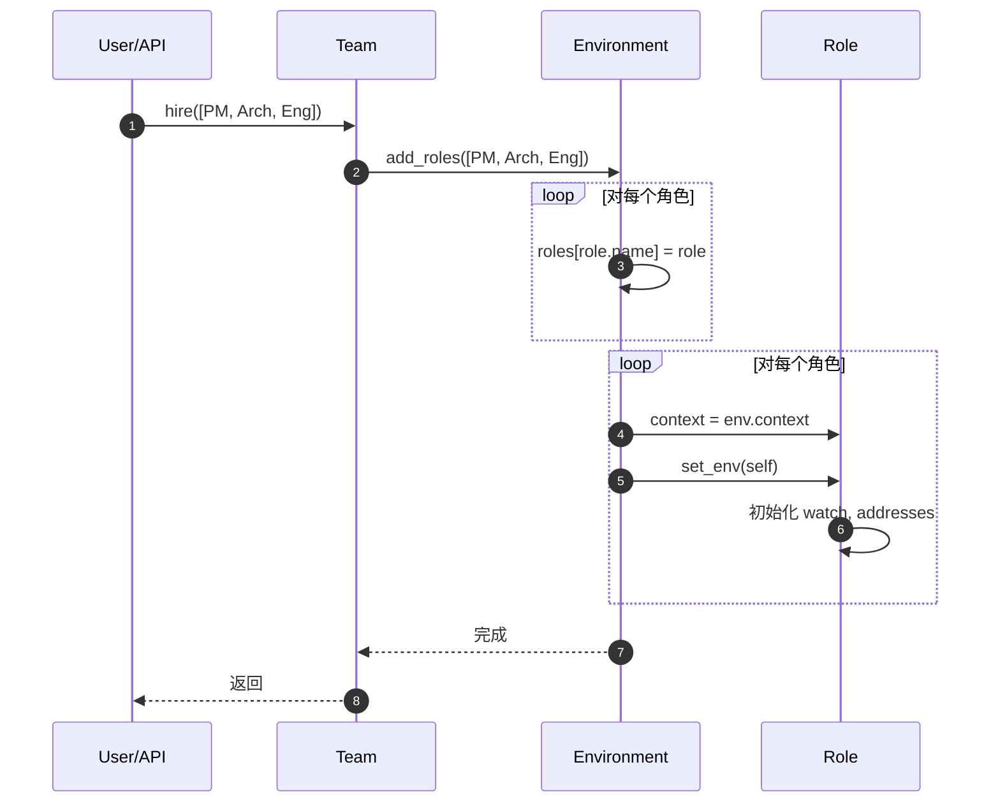

#### 边界与异常

- **重复角色名**：后添加的角色会覆盖前面的（使用 name 作为 key）
- **空角色列表**：不抛出异常，正常执行
- **角色初始化失败**：异常向上抛出

#### 实践与最佳实践

- 建议在 Team 创建后立即调用 hire()
- 避免重复雇佣相同 name 的角色
- 自定义角色需在雇佣前完成初始化

---

### API 3.2：Team.run()

#### 基本信息

- **名称**：`run`
- **协议与方法**：Python 异步方法（async）
- **幂等性**：非幂等，每次调用会继续执行新的轮次

#### 请求结构体

```python
@serialize_decorator
async def run(self, n_round=3, idea="", send_to="", auto_archive=True):
    """Run company until target round or no money"""
    pass
```

**字段表**：

| 字段 | 类型 | 必填 | 约束/默认 | 说明 |
|------|------|------|-----------|------|
| n_round | int | 否 | 默认 3 | 最大执行轮次 |
| idea | str | 否 | 默认 "" | 用户需求（首次运行时需提供） |
| send_to | str | 否 | 默认 "" | 指定消息接收者（通常为空） |
| auto_archive | bool | 否 | 默认 True | 是否自动归档项目 |

#### 响应结构体

```python
# 返回类型：list[Message]
return self.env.history  # 返回所有消息历史
```

| 字段 | 类型 | 说明 |
|------|------|------|
| history | list[Message] | 所有消息的历史记录 |

#### 入口函数与核心代码

```python
@serialize_decorator
async def run(self, n_round=3, idea="", send_to="", auto_archive=True):
    # 1) 发布初始需求消息
    if idea:
        self.run_project(idea=idea, send_to=send_to)

    # 2) 执行主循环
    while n_round > 0:
        # 检查是否所有角色都空闲
        if self.env.is_idle:
            logger.debug("All roles are idle.")
            break
        n_round -= 1
        
        # 检查预算
        self._check_balance()
        
        # 运行环境一轮
        await self.env.run()

        logger.debug(f"max {n_round=} left.")
    
    # 3) 归档项目
    self.env.archive(auto_archive)
    return self.env.history
```

**代码解释**：
1. **发布需求**：将 idea 包装成 Message 发布到 Environment
2. **主循环**：
   - 检查空闲状态：所有角色空闲则提前结束
   - 检查预算：成本超限抛出 NoMoneyException
   - 运行环境：调用 Environment.run() 执行一轮
3. **归档**：调用 GitRepository.archive() 提交代码到 git

#### 调用链与上游函数

```python
# 调用方：software_company.generate_repo()
asyncio.run(company.run(n_round=n_round, idea=idea))

# 调用链
Team.run() → Environment.run() → Role.run() → Action.run()
```

#### 时序图

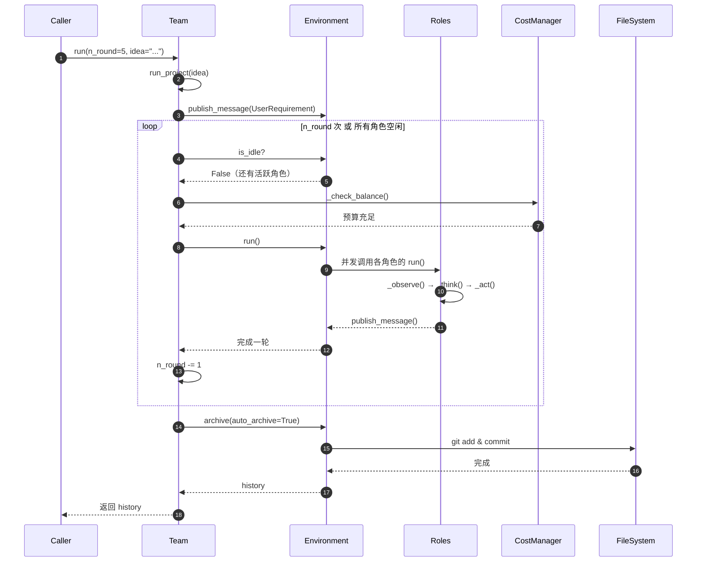

#### 边界与异常

- **成本超限**：抛出 `NoMoneyException`，终止执行
- **LLM 调用失败**：角色内部捕获，下一轮重试
- **无初始 idea**：不发布消息，依赖恢复的状态继续执行
- **所有角色空闲**：提前结束，不消耗剩余轮次

#### 实践与最佳实践

- **轮次设置**：简单任务 3-5 轮，复杂任务 8-15 轮
- **预算控制**：开发阶段使用 3.0，生产使用 10.0+
- **中断恢复**：使用 `--recover-path` 从序列化状态恢复
- **调试技巧**：设置 `auto_archive=False` 避免频繁 git commit

---

### API 3.3：Environment.publish_message()

#### 基本信息

- **名称**：`publish_message`
- **协议与方法**：Python 方法调用
- **幂等性**：非幂等，每次调用会添加新消息到历史

#### 请求结构体

```python
def publish_message(self, message: Message, peekable: bool = True) -> bool:
    """Distribute the message to the recipients."""
    pass
```

**字段表**：

| 字段 | 类型 | 必填 | 约束/默认 | 说明 |
|------|------|------|-----------|------|
| message | Message | 是 | - | 要发布的消息 |
| peekable | bool | 否 | 默认 True | 消息是否可被观察（暂未使用） |

#### 响应结构体

```python
return True  # 总是返回 True
```

| 字段 | 类型 | 说明 |
|------|------|------|
| - | bool | 固定返回 True |

#### 入口函数与核心代码

```python
def publish_message(self, message: Message, peekable: bool = True) -> bool:
    logger.debug(f"publish_message: {message.dump()}")
    found = False
    
    # 1) 根据消息路由信息分发消息
    for role, addrs in self.member_addrs.items():
        if is_send_to(message, addrs):
            role.put_message(message)  # 将消息放入角色的消息队列
            found = True
    
    # 2) 记录未找到接收者的警告
    if not found:
        logger.warning(f"Message no recipients: {message.dump()}")
    
    # 3) 添加到历史记录
    self.history.add(message)

    return True
```

**代码解释**：
1. **消息路由**：根据 Message.send_to 和 Role.addresses 判断是否投递
2. **角色投递**：调用 Role.put_message() 将消息加入角色的消息队列
3. **历史记录**：无论是否有接收者，都记录到 Environment.history

#### 消息路由机制

```python
# metagpt/utils/common.py
def is_send_to(message: Message, addresses: Set) -> bool:
    """判断消息是否应发送给指定地址"""
    # MESSAGE_ROUTE_TO_ALL 表示广播给所有角色
    if MESSAGE_ROUTE_TO_ALL in message.send_to or MESSAGE_ROUTE_TO_ALL in addresses:
        return True
    # 检查地址交集
    return bool(message.send_to & addresses)
```

#### 调用链与上游函数

```python
# 调用方：Role._act()
msg = AIMessage(content=response, cause_by=self.rc.todo, sent_from=self)
self.rc.memory.add(msg)
self.publish_message(msg)  # 通过 Role.set_env() 注入的方法

# 实际调用链
Role._act() → Role.publish_message() → Environment.publish_message() 
→ Role.put_message() → Role.rc.msg_buffer.push()
```

#### 时序图

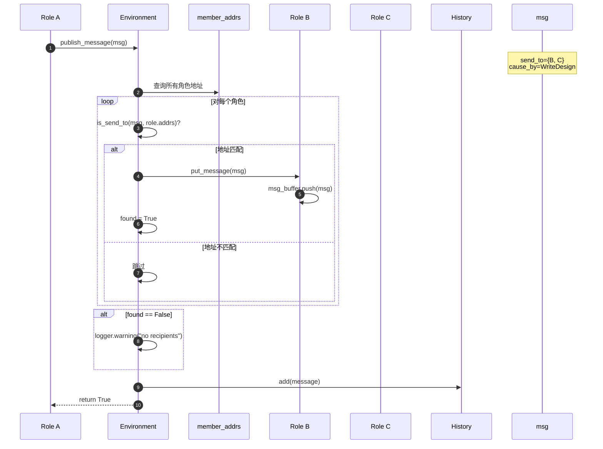

#### 边界与异常

- **无接收者**：记录警告日志，不抛出异常
- **消息重复**：不自动去重，依赖 Memory.add() 的去重逻辑
- **广播消息**：send_to={MESSAGE_ROUTE_TO_ALL} 会发送给所有角色
- **角色不存在**：不会导致错误，只是不投递

#### 实践与最佳实践

- **消息路由设计**：
  - 使用 `MESSAGE_ROUTE_TO_ALL` 进行广播
  - 使用 `role.name` 进行点对点发送
  - 使用 `role.profile` 进行按角色类型发送

- **Watch 机制**：
  - 角色通过 `_watch([ActionA, ActionB])` 设置关注的消息类型
  - 通过 `message.cause_by` 匹配感兴趣的消息

---

### API 3.4：Environment.run()

#### 基本信息

- **名称**：`run`
- **协议与方法**：Python 异步方法（async）
- **幂等性**：非幂等，每次调用推进环境状态

#### 请求结构体

```python
async def run(self, k=1):
    """Process all Role runs at once"""
    pass
```

**字段表**：

| 字段 | 类型 | 必填 | 约束/默认 | 说明 |
|------|------|------|-----------|------|
| k | int | 否 | 默认 1 | 连续执行的次数 |

#### 响应结构体

无返回值（void）

#### 入口函数与核心代码

```python
async def run(self, k=1):
    for _ in range(k):
        futures = []
        
        # 1) 收集所有非空闲角色的运行任务
        for role in self.roles.values():
            if role.is_idle:
                continue
            future = role.run()
            futures.append(future)

        # 2) 并发执行所有角色
        if futures:
            await asyncio.gather(*futures)
        
        logger.debug(f"is idle: {self.is_idle}")
```

**代码解释**：
1. **收集任务**：遍历所有角色，跳过空闲角色，收集 run() 协程
2. **并发执行**：使用 asyncio.gather() 并发执行所有角色的 run()
3. **空闲检测**：记录当前环境是否所有角色都已空闲

#### 调用链与上游函数

```python
# 调用方：Team.run()
await self.env.run()

# 调用链
Team.run() → Environment.run() 
→ asyncio.gather(*[role.run() for role in roles])
→ Role.run() → Role._observe() → Role._think() → Role._act()
```

#### 时序图

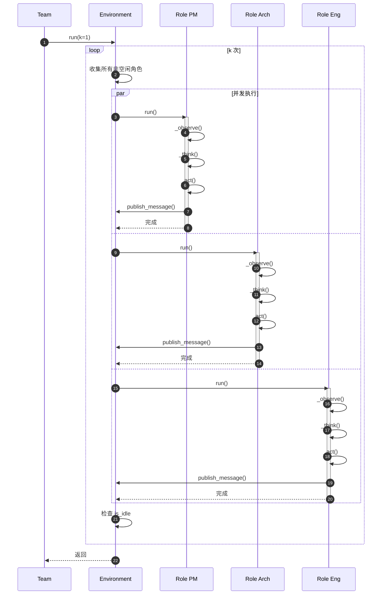

#### 边界与异常

- **所有角色空闲**：futures 为空列表，不调用 gather()
- **角色执行失败**：异常在 Role.run() 内部捕获，不影响其他角色
- **并发安全**：角色之间无共享状态修改，消息通过队列传递

#### 实践与最佳实践

- **并发控制**：Environment.run() 本身是串行的，但内部角色并发执行
- **异常处理**：角色内部应捕获所有异常，避免影响整体流程
- **性能优化**：角色数量增加时，并发执行可显著提升性能

---

### API 3.5：Context.llm()

#### 基本信息

- **名称**：`llm`
- **协议与方法**：Python 方法调用（@property）
- **幂等性**：幂等，返回相同的 LLM 实例（有缓存）

#### 请求结构体

```python
def llm(self) -> BaseLLM:
    """Return a LLM instance, fixme: support cache"""
    pass
```

无参数

#### 响应结构体

```python
return self._llm  # BaseLLM 实例
```

| 字段 | 类型 | 说明 |
|------|------|------|
| - | BaseLLM | 根据配置创建的 LLM 实例 |

#### 入口函数与核心代码

```python
def llm(self) -> BaseLLM:
    # 1) 创建 LLM 实例
    self._llm = create_llm_instance(self.config.llm)
    
    # 2) 设置 Cost Manager
    if self._llm.cost_manager is None:
        self._llm.cost_manager = self._select_costmanager(self.config.llm)
    
    return self._llm

def _select_costmanager(self, llm_config: LLMConfig) -> CostManager:
    """根据 LLM 类型选择合适的 CostManager"""
    if llm_config.api_type == LLMType.FIREWORKS:
        return FireworksCostManager()
    elif llm_config.api_type == LLMType.OPEN_LLM:
        return TokenCostManager()
    else:
        return self.cost_manager  # 使用默认的 CostManager
```

**代码解释**：
1. **LLM 创建**：通过 Provider Registry 根据配置创建对应的 LLM 实例
2. **Cost Manager 注入**：根据 LLM 类型选择合适的成本管理器
3. **缓存逻辑**：当前每次调用都重新创建（注释标明待优化）

#### 调用链与上游函数

```python
# 调用方：Role.__init__()
class Role(BaseRole):
    @property
    def llm(self):
        return self.context.llm()

# 调用链
Role.llm → Context.llm() → create_llm_instance() 
→ LLM_REGISTRY.get_provider() → ProviderClass(config)
```

#### 时序图

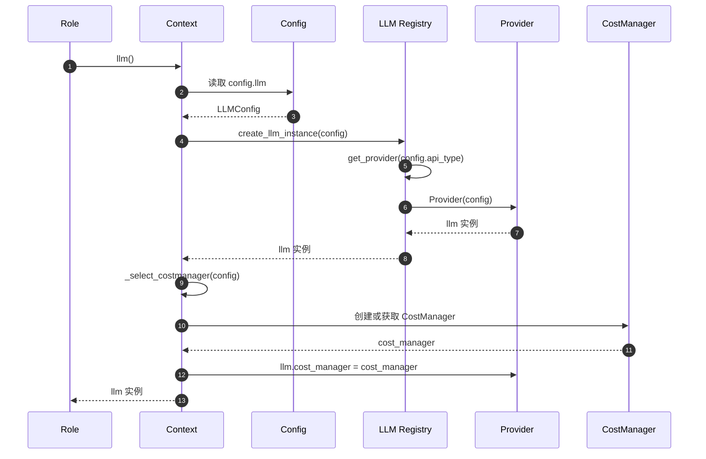

#### 边界与异常

- **配置缺失**：抛出 KeyError（Provider 不存在）
- **API Key 无效**：在实际调用 LLM 时才抛出异常
- **缓存问题**：当前未实现真正的缓存，每次调用都重新创建

#### 实践与最佳实践

- **配置优先级**：
  1. Action 级别：Action.llm（通过 llm_name_or_type 指定）
  2. Context 级别：Context.llm()（全局配置）
  
- **成本控制**：
  - 通过 CostManager 追踪所有 LLM 调用
  - 设置 investment 上限防止超支

- **多模型使用**：
  - 不同角色可使用不同模型（通过 Action.llm_name_or_type）
  - 简单任务使用 gpt-3.5-turbo，复杂任务使用 gpt-4

---

## 4. 关键数据结构与 UML

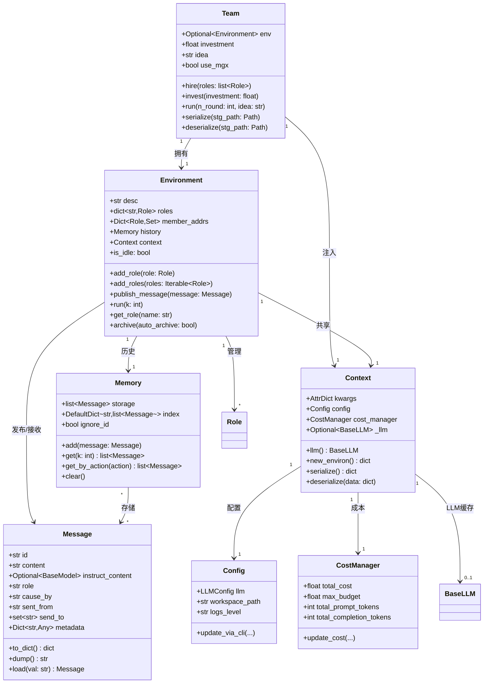

### 数据结构说明

#### 4.1 Team

**关键字段**：
- `env`：Environment 实例，可为 Environment 或 MGXEnv
- `investment`：预算上限（美元）
- `idea`：用户需求描述
- `use_mgx`：是否使用 MGX 环境（支持更复杂的交互）

**映射规则**：
- 序列化：保存为 JSON，包含 env、investment、idea
- 反序列化：从 JSON 恢复 Team 状态

#### 4.2 Environment

**关键字段**：
- `roles`：角色字典，key 为角色名称
- `member_addrs`：地址簿，用于消息路由
- `history`：消息历史（Memory）
- `context`：全局上下文

**映射规则**：
- 角色通过 name 唯一标识
- 地址通过 role.addresses 设置（包含 name, profile, watch 列表）

#### 4.3 Context

**关键字段**：
- `kwargs`：动态参数存储（如 project_path）
- `config`：全局配置
- `cost_manager`：成本管理器
- `_llm`：LLM 实例缓存

**映射规则**：
- 序列化：只保存 kwargs 和 cost_manager
- 反序列化：从配置文件重新创建 config 和 _llm

#### 4.4 Message

**关键字段**：
- `content`：消息内容（自然语言或代码）
- `instruct_content`：结构化指令内容（BaseModel）
- `cause_by`：触发此消息的 Action
- `send_to`：接收者地址集合

**映射规则**：
- 序列化：使用 Pydantic model_dump()
- 反序列化：使用 Message.load()

### 版本演进

- **v0.x**：简单的消息传递，无路由机制
- **v1.0**：引入 member_addrs 和 is_send_to 路由
- **v1.5**：引入 MGXEnv，支持更复杂的交互
- **v2.0（规划）**：分布式环境，支持跨节点消息传递

---

## 5. 关键流程时序图

### 5.1 团队初始化流程

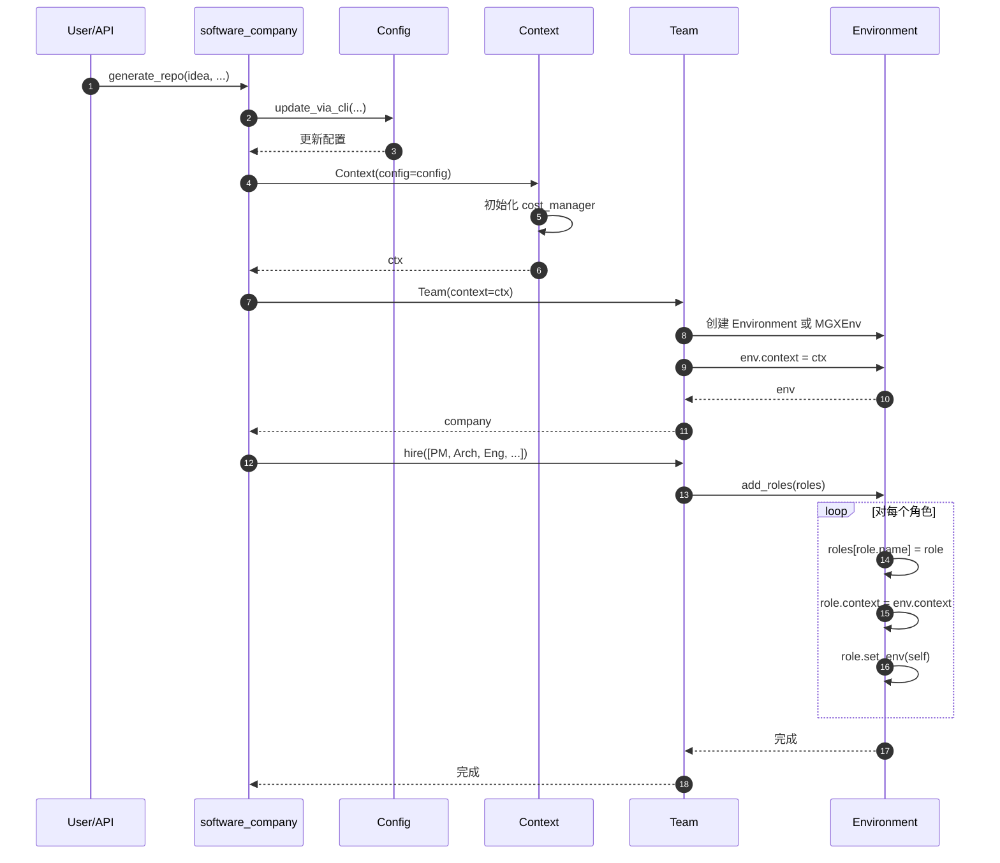

### 5.2 消息路由流程

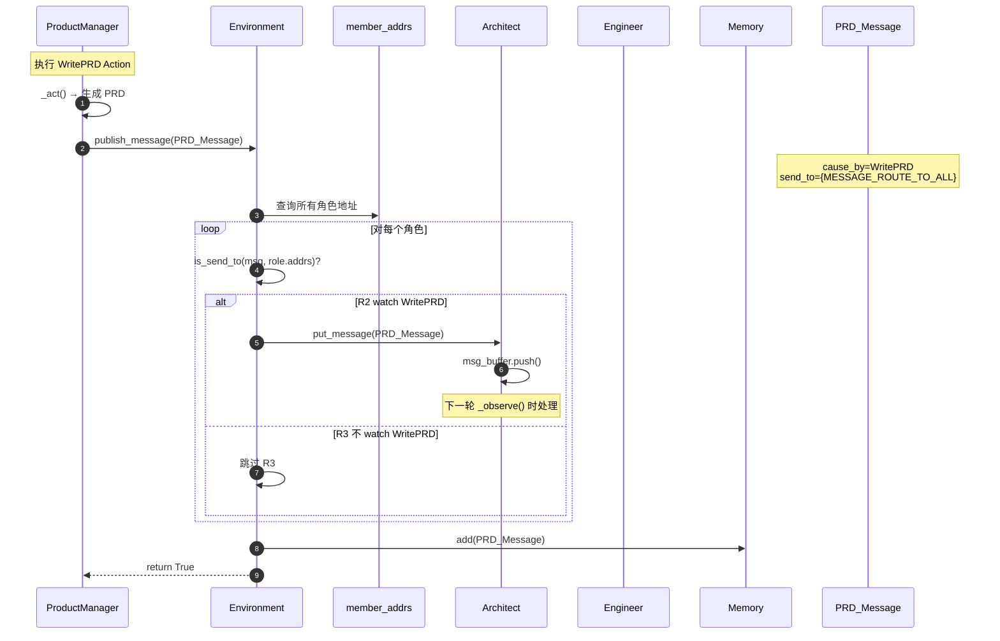

### 5.3 环境运行循环

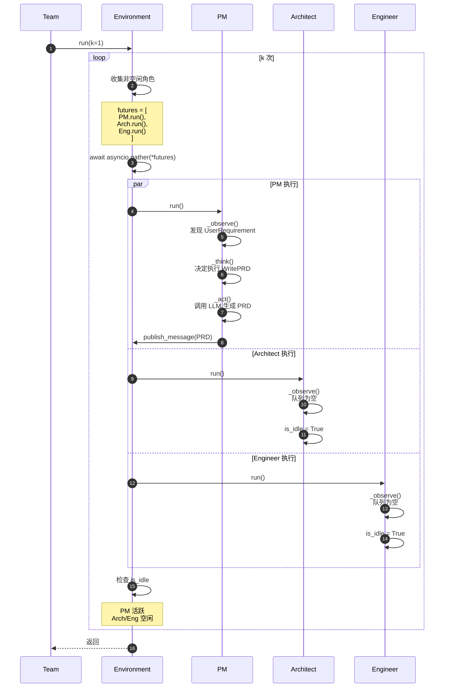

---

## 6. 边界、异常与性能要点

### 6.1 并发与同步

- **Environment.run()**：单线程串行执行轮次
- **角色执行**：asyncio.gather() 并发执行多个角色
- **消息传递**：通过 asyncio.Queue 实现线程安全

### 6.2 超时与限流

- **轮次超时**：无超时，通过 n_round 控制
- **LLM 超时**：默认 300 秒/请求（可配置）
- **成本限流**：达到 max_budget 立即停止

### 6.3 幂等性与重试

- **Team.run()**：非幂等，每次调用推进状态
- **publish_message()**：非幂等，每次添加新消息
- **Role.run()**：幂等（相同输入产生相同输出），但状态会变化

### 6.4 异常处理策略

```python
# Team._check_balance()
def _check_balance(self):
    if self.cost_manager.total_cost >= self.cost_manager.max_budget:
        raise NoMoneyException(
            self.cost_manager.total_cost, 
            f"Insufficient funds: {self.cost_manager.max_budget}"
        )

# Role.run() 捕获所有异常
try:
    await self._observe()
    await self._think()
    msg = await self._act()
except Exception as e:
    logger.error(f"Role {self.name} error: {e}")
    # 不抛出异常，避免影响其他角色
```

### 6.5 性能关键路径

- **LLM 调用**：占总耗时的 90%+
- **文件 I/O**：占总耗时的 < 5%
- **消息处理**：占总耗时的 < 1%

### 6.6 资源限制

- **内存上限**：history 存储所有消息，随轮次增长
- **磁盘上限**：序列化状态和生成的代码文件
- **网络上限**：LLM API 调用频率（无硬限制）

---

## 7. 实战案例与最佳实践

### 案例 1：自定义环境实现游戏 AI

```python
from metagpt.environment.base_env import ExtEnv, mark_as_readable, mark_as_writeable
from metagpt.schema import Message

class GameEnv(ExtEnv):
    """自定义游戏环境"""
    
    game_state: dict = {}
    
    @mark_as_readable
    def get_game_state(self):
        """角色可读取游戏状态"""
        return self.game_state
    
    @mark_as_writeable
    def execute_action(self, action_type: str, params: dict):
        """角色可执行游戏动作"""
        # 处理游戏逻辑
        self.game_state["last_action"] = action_type
        return {"success": True}

# 使用自定义环境
env = GameEnv()
team = Team()
team.env = env
team.hire([GameAIRole()])
await team.run(n_round=10, idea="Play the game")
```

### 案例 2：消息过滤与路由

```python
class FilteredEnvironment(Environment):
    """支持消息过滤的环境"""
    
    def publish_message(self, message: Message, peekable: bool = True) -> bool:
        # 1) 自定义消息过滤逻辑
        if message.metadata.get("priority") == "low":
            logger.info("Filtered low priority message")
            return False
        
        # 2) 自定义路由逻辑
        if message.metadata.get("broadcast"):
            message.send_to = {MESSAGE_ROUTE_TO_ALL}
        
        # 3) 调用父类方法
        return super().publish_message(message, peekable)
```

### 案例 3：成本优化策略

```python
# 1. 使用更便宜的模型
context = Context()
context.config.llm.model = "gpt-3.5-turbo"  # 而不是 gpt-4

# 2. 分级模型使用
class SmartRole(Role):
    def __init__(self, **kwargs):
        super().__init__(**kwargs)
        # 简单任务使用 gpt-3.5-turbo
        self.simple_action = WriteTask(llm_name_or_type="gpt-3.5-turbo")
        # 复杂任务使用 gpt-4
        self.complex_action = WriteCode(llm_name_or_type="gpt-4")

# 3. 设置合理的预算上限
team.invest(5.0)  # 限制在 5 美元以内
```

---

**文档版本**：v1.0  
**最后更新**：2025-10-05  
**维护者**：MetaGPT 团队

