# MetaGPT-02-角色系统

本文档深入剖析 MetaGPT 的角色系统，包括 Role 基类、各种具体角色实现（ProductManager、Architect、Engineer 等）、角色生命周期、观察-思考-行动（OTA）循环、以及角色协作机制。

---

## 1. 模块概览

### 1.1 职责边界

**Role 基类**：
- 定义角色的通用属性（name、profile、goal、constraints）
- 实现观察-思考-行动（OTA）循环
- 管理角色的记忆（Memory）和消息队列（MessageQueue）
- 提供 watch 机制订阅感兴趣的消息
- 支持多种反应模式（REACT、BY_ORDER、PLAN_AND_ACT）

**具体角色**：
- ProductManager：编写产品需求文档（PRD）、市场调研
- Architect：设计系统架构、API 设计
- Engineer：编写代码、代码审查、修复 bug
- TeamLeader：协调团队、分配任务
- DataAnalyst：数据分析、代码质量评估

### 1.2 输入/输出

| 角色 | 输入 | 输出 |
|------|------|------|
| Role（基类） | Message（来自环境） | Message（发布到环境） |
| ProductManager | UserRequirement | PRD Document |
| Architect | PRD | Design Document + API Design |
| Engineer | Design + Tasks | Code Files |
| TeamLeader | Any Message | Coordinated Actions |
| DataAnalyst | Code/Data | Analysis Report |

### 1.3 上下游依赖

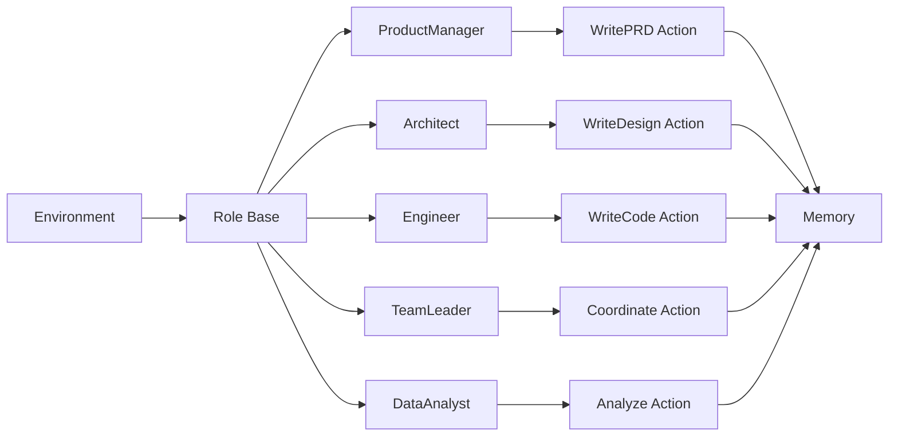

### 1.4 生命周期

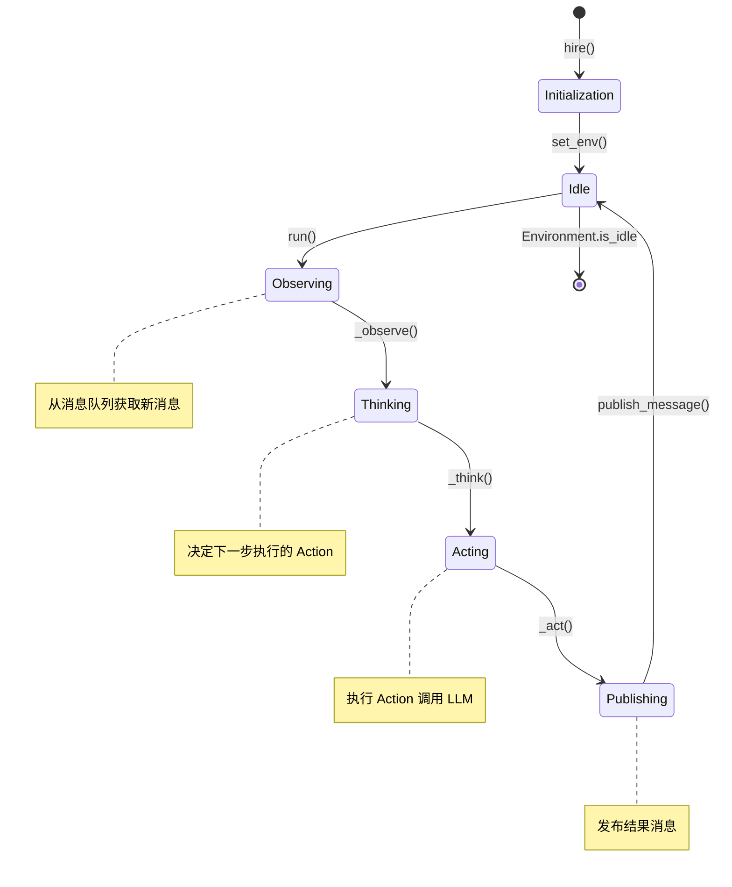

---

## 2. 模块架构图

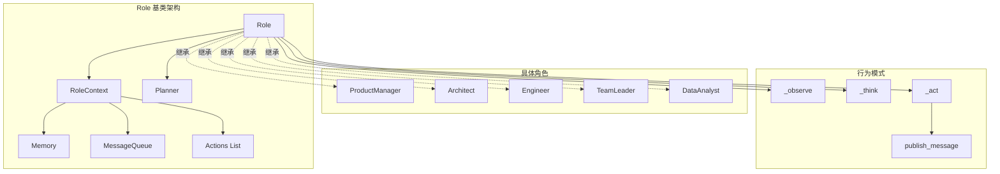

### 架构说明

#### 2.1 核心组件

**RoleContext（角色上下文）**：
- `env`：Environment 引用
- `msg_buffer`：私有消息队列（异步接收消息）
- `memory`：长期记忆（所有历史消息）
- `working_memory`：工作记忆（当前任务相关）
- `todo`：当前待执行的 Action
- `watch`：监听的消息类型集合
- `state`：角色状态（用于多状态角色）
- `react_mode`：反应模式（REACT/BY_ORDER/PLAN_AND_ACT）

**Role 核心属性**：
- `name`：角色名称（用于消息路由）
- `profile`：角色类型（如 "ProductManager"）
- `goal`：角色目标
- `constraints`：角色约束
- `actions`：角色可执行的动作列表
- `addresses`：角色地址（用于消息路由）

#### 2.2 边界条件

- **并发控制**：角色的 run() 方法是异步的，但内部的 OTA 循环是串行的
- **消息队列容量**：msg_buffer 基于 asyncio.Queue，无硬限制
- **记忆上限**：Memory 无硬限制，随消息增长
- **超时设置**：Action 执行有 LLM 超时（默认 300 秒）

#### 2.3 扩展点

- **自定义角色**：继承 Role 或 RoleZero 基类
- **自定义动作**：实现 Action 子类并添加到角色
- **自定义思考逻辑**：重写 `_think()` 方法
- **自定义观察过滤**：重写 `_observe()` 方法

---

## 3. 核心 API 详细规格

### API 3.1：Role.run()

#### 基本信息

- **名称**：`run`
- **协议与方法**：Python 异步方法（async）
- **幂等性**：非幂等，每次调用推进角色状态

#### 请求结构体

```python
@role_raise_decorator
async def run(self, with_message: Optional[Union[Message, str]] = None) -> Message:
    """Observe, think, and act based on the environment and personal state"""
    pass
```

**字段表**：

| 字段 | 类型 | 必填 | 约束/默认 | 说明 |
|------|------|------|-----------|------|
| with_message | Optional[Union[Message, str]] | 否 | 默认 None | 测试用消息，正常流程应通过 put_message() 传递 |

#### 响应结构体

```python
return msg  # Message 对象或 None
```

| 字段 | 类型 | 说明 |
|------|------|------|
| - | Message | 角色执行后发布的消息 |

#### 入口函数与核心代码

```python
@role_raise_decorator
async def run(self, with_message: Optional[Union[Message, str]] = None) -> Message:
    # 1) 处理测试消息（仅测试时使用）
    if with_message:
        msg = Message(content=with_message) if isinstance(with_message, str) else with_message
        self.put_message(msg)

    # 2) 恢复中断的角色（序列化恢复）
    if self.recovered:
        self.recovered = False
        rsp = await self._act()
        self.publish_message(rsp)

    # 3) OTA 循环
    if not await self._observe():
        return None  # 无新消息

    rsp = await self.react()  # 执行思考和行动
    self.publish_message(rsp)
    
    return rsp
```

**代码解释**：
1. **测试消息处理**：仅用于单元测试，生产环境通过 Environment 传递消息
2. **恢复机制**：从序列化状态恢复后，继续执行上次中断的 Action
3. **OTA 循环**：
   - `_observe()`：从消息队列获取新消息
   - `react()`：根据反应模式执行思考和行动
   - `publish_message()`：将结果发布到环境

#### 调用链与上游函数

```python
# 调用方：Environment.run()
futures = [role.run() for role in roles if not role.is_idle]
await asyncio.gather(*futures)

# 调用链
Environment.run() → Role.run() → Role._observe() 
→ Role.react() → Role._think() → Role._act() 
→ Role.publish_message() → Environment.publish_message()
```

#### 时序图

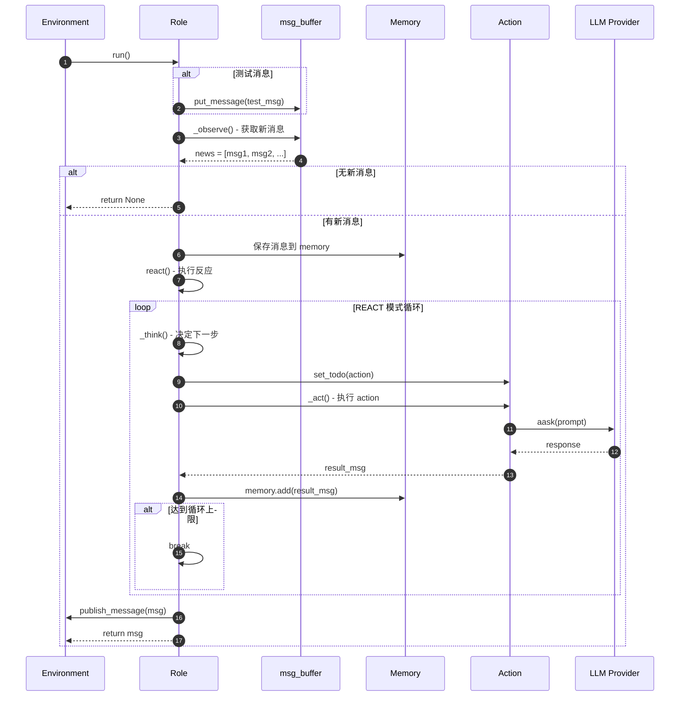

#### 边界与异常

- **空消息队列**：`_observe()` 返回空列表，`run()` 返回 None
- **Action 执行失败**：异常被 `role_raise_decorator` 捕获，记录日志但不终止
- **LLM 调用失败**：Action 内部捕获，角色状态保持不变，下一轮重试
- **无可执行 Action**：`_think()` 返回 False，角色进入空闲状态

#### 实践与最佳实践

- **并发执行**：Environment 会并发调用多个角色的 run()，确保角色之间无共享状态修改
- **消息订阅**：通过 `_watch([ActionA, ActionB])` 订阅感兴趣的消息类型
- **反应模式**：
  - REACT：根据观察动态决定行动（默认）
  - BY_ORDER：按固定顺序执行动作
  - PLAN_AND_ACT：先规划再执行

---

### API 3.2：Role._observe()

#### 基本信息

- **名称**：`_observe`
- **协议与方法**：Python 异步方法（async）
- **幂等性**：非幂等，每次调用消费消息队列

#### 请求结构体

```python
async def _observe(self, ignore_memory=False) -> int:
    """Observe message queue and save to memory"""
    pass
```

**字段表**：

| 字段 | 类型 | 必填 | 约束/默认 | 说明 |
|------|------|------|-----------|------|
| ignore_memory | bool | 否 | 默认 False | 是否跳过记忆存储 |

#### 响应结构体

```python
return len(news)  # 新消息数量
```

| 字段 | 类型 | 说明 |
|------|------|------|
| - | int | 观察到的新消息数量 |

#### 入口函数与核心代码

```python
async def _observe(self, ignore_memory=False) -> int:
    # 1) 从消息队列获取所有消息
    news = []
    if self.recovered:
        # 恢复时从上次中断的消息开始
        news = [self.latest_observed_msg] if self.latest_observed_msg else []
    
    if not news:
        # 从消息队列 pop 所有消息
        news = self.rc.msg_buffer.pop_all()

    # 2) 过滤感兴趣的消息
    if not self.observe_all_msg_from_buffer:
        # 根据 watch 列表过滤
        old_messages = [] if ignore_memory else self.rc.memory.get()
        news = [
            n for n in news
            if n.cause_by in self.rc.watch
        ]
        # 去重：只保留不在旧记忆中的消息
        news = self.rc.memory.find_news(news)

    # 3) 保存到记忆
    if not ignore_memory:
        self.rc.memory.add_batch(news)

    # 4) 更新最新观察的消息
    if news:
        self.latest_observed_msg = news[-1]

    return len(news)
```

**代码解释**：
1. **消息获取**：
   - 正常情况：从 msg_buffer pop 所有消息
   - 恢复情况：使用上次中断时的消息
2. **消息过滤**：
   - 根据 `watch` 列表过滤感兴趣的消息类型
   - 使用 `message.cause_by` 匹配 Action 类型
3. **记忆存储**：
   - 将新消息批量添加到 Memory
   - Memory 会自动去重（基于 message.id）
4. **状态更新**：
   - 记录最新观察的消息（用于中断恢复）

#### 调用链与上游函数

```python
# 调用方：Role.run()
if not await self._observe():
    return None

# 消息来源
Environment.publish_message() 
→ Role.put_message() 
→ msg_buffer.push()
→ Role._observe() 获取
```

#### 时序图

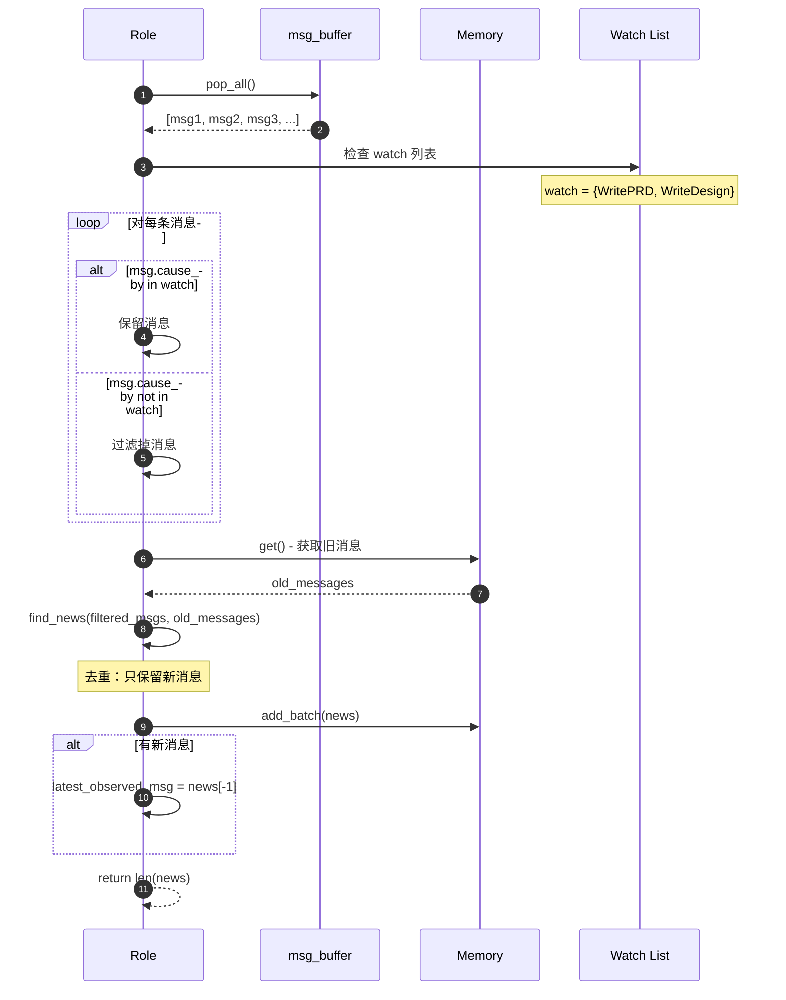

#### 边界与异常

- **空队列**：返回 0，角色进入空闲
- **重复消息**：Memory 自动去重（基于 message.id）
- **无匹配消息**：过滤后 news 为空，返回 0
- **watch 列表为空**：不过滤，接收所有消息

#### 实践与最佳实践

- **Watch 设置**：
  ```python
  self._watch([WritePRD, WriteDesign])  # 监听特定 Action
  self._watch([UserRequirement])  # 监听用户需求
  ```

- **消息过滤策略**：
  - 严格模式：只 watch 上游角色的输出
  - 宽松模式：设置 `observe_all_msg_from_buffer=True`

- **去重机制**：
  - Message 的 id 字段基于 UUID，确保唯一性
  - Memory.add() 会检查重复并跳过

---

### API 3.3：Role._think()

#### 基本信息

- **名称**：`_think`
- **协议与方法**：Python 异步方法（async）
- **幂等性**：幂等（相同输入产生相同决策）

#### 请求结构体

```python
async def _think(self) -> bool:
    """Think about what action to take next"""
    pass
```

无参数

#### 响应结构体

```python
return True/False  # 是否有可执行的 Action
```

| 字段 | 类型 | 说明 |
|------|------|------|
| - | bool | True 表示有 todo，False 表示无可执行动作 |

#### 入口函数与核心代码

```python
async def _think(self) -> bool:
    # 1) 多状态角色的状态转换
    if len(self.actions) == 1:
        # 单动作角色：直接执行该动作
        self.set_todo(self.actions[0])
        return True

    if len(self.states) == 0:
        # 无状态角色：执行默认动作
        if self.rc.state == -1:
            self.set_todo(self.actions[0])
        else:
            self.set_todo(None)  # 已完成
        return bool(self.rc.todo)

    # 2) 多状态角色：通过 LLM 决定下一个状态
    prompt = self._get_think_prompt()
    next_state = await self.llm.aask(prompt)
    
    # 3) 解析状态并设置对应的 Action
    next_state = extract_state_value_from_output(next_state)
    if next_state == -1:
        # 任务完成
        return False
    
    self._set_state(next_state)
    return True

def _set_state(self, state: int):
    """Set current state and corresponding todo action"""
    self.rc.state = state
    if state >= 0 and state < len(self.states):
        self.set_todo(self.actions[state])
    else:
        self.set_todo(None)
```

**代码解释**：
1. **简单角色**：单动作或无状态角色直接设置 todo
2. **多状态角色**：
   - 构建提示词（包含历史记录和可选状态）
   - 调用 LLM 决定下一个状态
   - 根据状态索引设置对应的 Action
3. **状态机**：
   - state = -1：初始或终止状态
   - state >= 0：对应 actions[state]

#### 调用链与上游函数

```python
# 调用方：Role.react()
await self._think()
if self.rc.todo is None:
    return None

# 调用链
Role.react() → Role._think() → LLM.aask() (多状态时)
→ Role._set_state() → Role.set_todo()
```

#### 时序图

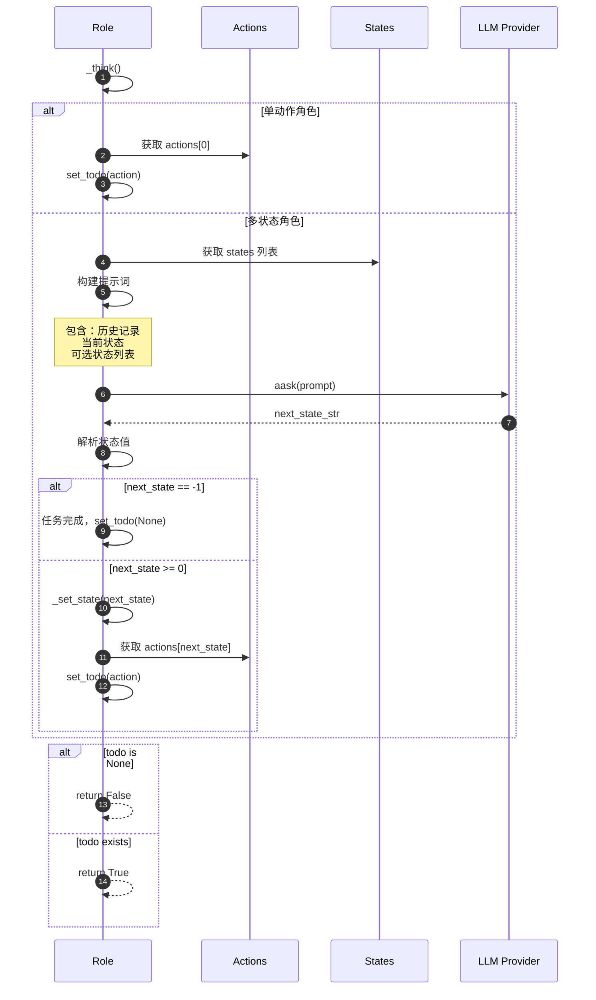

#### 边界与异常

- **LLM 返回无效状态**：记录警告，设置 state = -1
- **状态索引越界**：设置 todo = None，角色进入空闲
- **无可执行动作**：返回 False，`react()` 提前结束

#### 实践与最佳实践

- **单动作角色**：
  ```python
  class SimpleRole(Role):
      def __init__(self):
          super().__init__()
          self.set_actions([WriteCode])  # 单动作
          # 无需重写 _think()
  ```

- **多状态角色**：
  ```python
  class ComplexRole(Role):
      def __init__(self):
          super().__init__()
          self.set_actions([Action1, Action2, Action3])
          self.states = ["状态1：规划", "状态2：执行", "状态3：验证"]
          # 自动使用 LLM 决定状态转换
  ```

- **自定义思考逻辑**：
  ```python
  async def _think(self) -> bool:
      # 自定义决策逻辑
      if some_condition:
          self.set_todo(Action1())
      else:
          self.set_todo(Action2())
      return bool(self.rc.todo)
  ```

---

### API 3.4：Role._act()

#### 基本信息

- **名称**：`_act`
- **协议与方法**：Python 异步方法（async）
- **幂等性**：非幂等（调用 LLM 产生新内容）

#### 请求结构体

```python
async def _act(self) -> Message:
    """Execute the current todo action"""
    pass
```

无参数

#### 响应结构体

```python
return msg  # Message 对象
```

| 字段 | 类型 | 说明 |
|------|------|------|
| - | Message | Action 执行后生成的消息 |

#### 入口函数与核心代码

```python
async def _act(self) -> Message:
    logger.info(f"{self._setting}: to do {self.rc.todo}({self.rc.todo.name})")
    
    # 1) 执行 Action
    response = await self.rc.todo.run(self.rc.history)
    
    # 2) 封装响应为 Message
    if isinstance(response, (ActionOutput, ActionNode)):
        # Action 返回结构化输出
        msg = AIMessage(
            content=response.content,
            instruct_content=response.instruct_content,
            cause_by=self.rc.todo,
            sent_from=self,
        )
    elif isinstance(response, Message):
        # Action 直接返回 Message
        msg = response
    else:
        # Action 返回字符串
        msg = AIMessage(
            content=response or "", 
            cause_by=self.rc.todo, 
            sent_from=self
        )
    
    # 3) 添加到记忆
    self.rc.memory.add(msg)

    return msg
```

**代码解释**：
1. **执行 Action**：
   - 调用 `action.run(history)`
   - 传入历史消息作为上下文
2. **响应封装**：
   - ActionOutput：结构化输出（含 content 和 instruct_content）
   - Message：直接使用
   - 其他：封装为 AIMessage
3. **记忆存储**：
   - 将执行结果添加到 Memory
   - 用于后续的上下文传递

#### 调用链与上游函数

```python
# 调用方：Role.react()
msg = await self._act()

# 调用链
Role.react() → Role._act() → Action.run() 
→ LLM.aask() → 生成内容 → 返回 Message
```

#### 时序图

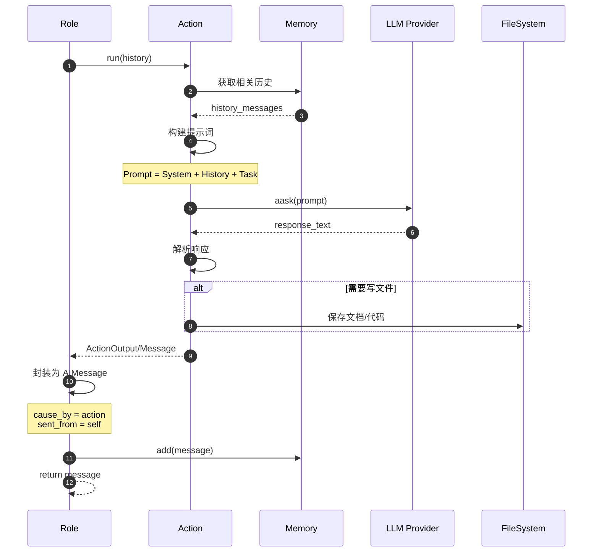

#### 边界与异常

- **Action 执行失败**：异常在 Action 内部捕获，返回错误消息
- **LLM 调用超时**：抛出超时异常，角色状态保持不变
- **响应为空**：封装为空内容的 Message

#### 实践与最佳实践

- **Action 设计**：
  ```python
  class WriteCode(Action):
      async def run(self, context) -> str:
          # 1. 获取设计文档和任务
          # 2. 构建提示词
          # 3. 调用 LLM 生成代码
          # 4. 保存代码文件
          # 5. 返回代码内容
          pass
  ```

- **上下文传递**：
  ```python
  # Action 通过 i_context 传递特定上下文
  action = WriteCode(i_context=CodingContext(...))
  await action.run(self.rc.history)
  ```

- **多步骤 Action**：
  ```python
  async def run(self, context):
      # 步骤 1：规划
      plan = await self.llm.aask("...")
      
      # 步骤 2：执行
      code = await self.llm.aask(f"根据规划 {plan} 编写代码")
      
      # 步骤 3：验证
      result = await self.llm.aask(f"验证代码 {code}")
      
      return result
  ```

---

### API 3.5：Role._watch()

#### 基本信息

- **名称**：`_watch`
- **协议与方法**：Python 方法调用
- **幂等性**：幂等（设置订阅列表）

#### 请求结构体

```python
def _watch(self, actions: Iterable[Type[Action]] | Iterable[str]):
    """Set the action watch list"""
    pass
```

**字段表**：

| 字段 | 类型 | 必填 | 约束/默认 | 说明 |
|------|------|------|-----------|------|
| actions | Iterable[Type[Action]] \| Iterable[str] | 是 | 非空 | 要监听的 Action 类型列表 |

#### 响应结构体

无返回值（void）

#### 入口函数与核心代码

```python
def _watch(self, actions: Iterable[Type[Action]] | Iterable[str]):
    """Set the action watch list"""
    # 1) 转换为字符串标识符
    tags = set()
    for action in actions:
        tag = any_to_str(action)  # Action 类 → "module.ClassName"
        tags.add(tag)
    
    # 2) 设置 watch 列表
    self.rc.watch = tags
    
    # 3) 更新地址（用于消息路由）
    self.addresses = self._get_addresses()

def _get_addresses(self) -> set[str]:
    """Get all possible addresses for message routing"""
    addresses = {
        self.name,  # 角色名称
        self.profile,  # 角色类型
        MESSAGE_ROUTE_TO_ALL,  # 广播地址
    }
    
    # 添加 watch 的 Action 标识符
    addresses.update(self.rc.watch)
    
    return addresses
```

**代码解释**：
1. **标识符转换**：将 Action 类转换为字符串（模块名.类名）
2. **设置订阅**：更新 rc.watch 集合
3. **地址更新**：将 watch 列表添加到角色地址中，用于消息路由

#### 调用链与上游函数

```python
# 调用方：Role.__init__()
self._watch([UserRequirement])  # 默认监听用户需求

# 具体角色示例
class Architect(Role):
    def __init__(self):
        super().__init__()
        self._watch([WritePRD])  # 监听 PRD 消息
```

#### 时序图

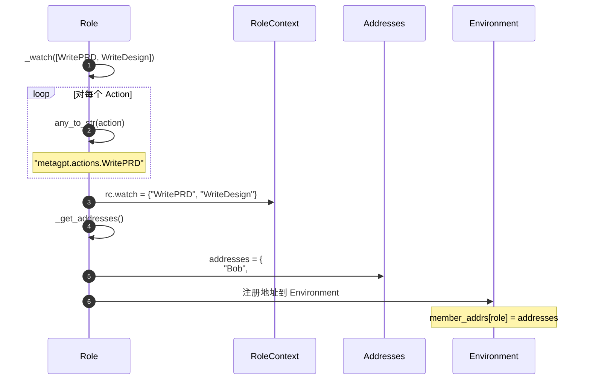

#### 边界与异常

- **空 actions 列表**：设置空的 watch 集合
- **重复设置**：覆盖之前的 watch 列表
- **无效 Action 类型**：any_to_str() 会转换为字符串

#### 实践与最佳实践

- **上下游协作**：
  ```python
  # ProductManager 发布 WritePRD
  class ProductManager(Role):
      def __init__(self):
          super().__init__()
          self.set_actions([WritePRD])
  
  # Architect 监听 WritePRD
  class Architect(Role):
      def __init__(self):
          super().__init__()
          self.set_actions([WriteDesign])
          self._watch([WritePRD])  # 接收 PM 的输出
  ```

- **多源监听**：
  ```python
  # Engineer 监听多个上游
  class Engineer(Role):
      def __init__(self):
          super().__init__()
          self._watch([
              WriteDesign,  # 来自 Architect
              WriteTasks,  # 来自 ProjectManager
              WriteCodeReview,  # 来自自己（代码审查循环）
          ])
  ```

---

## 4. 具体角色实现

### 4.1 ProductManager（产品经理）

#### 角色定位

- **职责**：编写产品需求文档（PRD）、市场调研、竞品分析
- **输入**：UserRequirement（用户需求）
- **输出**：PRD Document（产品需求文档）
- **工具**：Browser（浏览器）、Editor（编辑器）、SearchEnhancedQA（搜索问答）

#### 核心代码

```python
class ProductManager(RoleZero):
    name: str = "Alice"
    profile: str = "Product Manager"
    goal: str = "Create a Product Requirement Document"
    constraints: str = "utilize the same language as the user requirements"
    
    instruction: str = PRODUCT_MANAGER_INSTRUCTION
    tools: list[str] = ["RoleZero", Browser.__name__, Editor.__name__]
    todo_action: str = "WritePRD"

    def __init__(self, **kwargs) -> None:
        super().__init__(**kwargs)
        if self.use_fixed_sop:
            # 固定流程模式
            self.enable_memory = False
            self.set_actions([PrepareDocuments, WritePRD])
            self._watch([UserRequirement, PrepareDocuments])
            self.rc.react_mode = RoleReactMode.BY_ORDER
```

**代码说明**：
1. **RoleZero 基类**：支持工具调用和智能决策
2. **固定 SOP 模式**：按顺序执行 PrepareDocuments → WritePRD
3. **工具集成**：可调用浏览器搜索、文档编辑等工具

#### 典型工作流

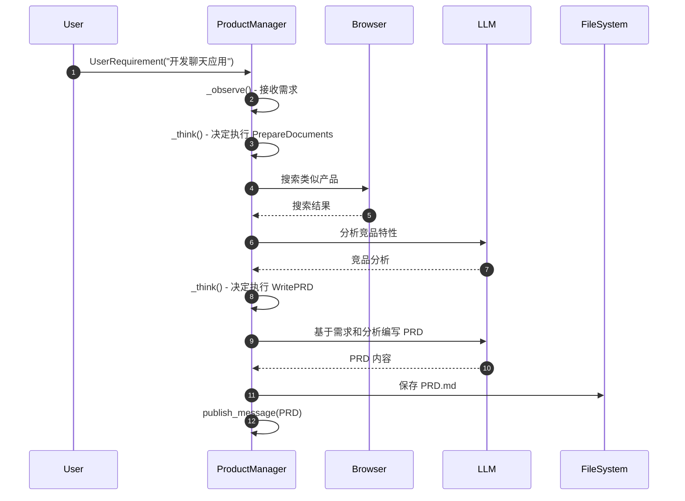

### 4.2 Architect（架构师）

#### 角色定位

- **职责**：系统架构设计、API 设计、技术选型
- **输入**：PRD Document（产品需求文档）
- **输出**：Design Document + API Specification
- **工具**：Terminal（终端）、Editor（编辑器）

#### 核心代码

```python
class Architect(RoleZero):
    name: str = "Bob"
    profile: str = "Architect"
    goal: str = "design a concise, usable, complete software system"
    constraints: str = "use appropriate open source libraries"
    
    instruction: str = ARCHITECT_INSTRUCTION
    tools: list[str] = ["Editor:write,read", "RoleZero", "Terminal:run_command"]

    def __init__(self, **kwargs) -> None:
        super().__init__(**kwargs)
        self.enable_memory = False
        self.set_actions([WriteDesign])
        self._watch({WritePRD})  # 监听 PRD
```

**代码说明**：
1. **单动作角色**：只执行 WriteDesign
2. **工具支持**：可运行终端命令检查依赖
3. **经验检索**：可从历史项目中检索类似架构

#### 典型工作流

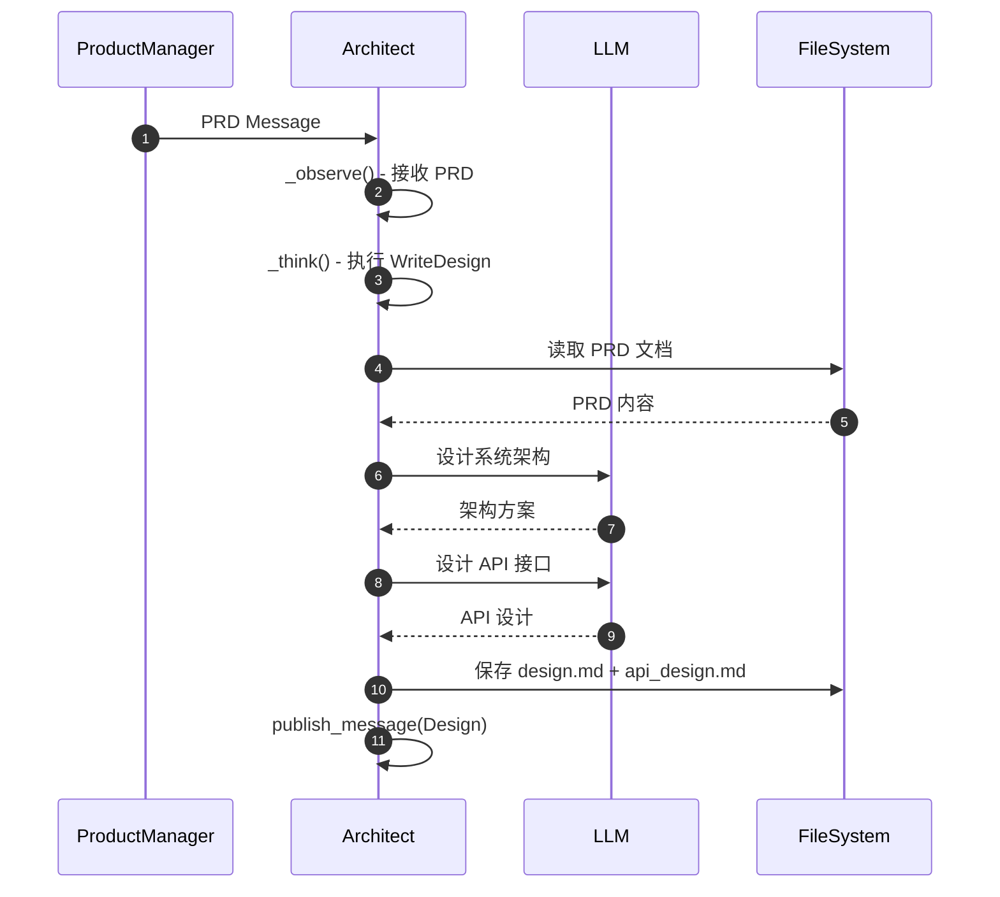

### 4.3 Engineer（工程师）

#### 角色定位

- **职责**：代码实现、代码审查、Bug 修复
- **输入**：Design Document + Task List
- **输出**：Code Files + Test Results
- **工具**：无（直接调用 LLM 和文件系统）

#### 核心代码

```python
class Engineer(Role):
    name: str = "Alex"
    profile: str = "Engineer"
    goal: str = "write elegant, readable, extensible, efficient code"
    constraints: str = "conform to standards like google-style"
    
    n_borg: int = 1  # 并行编码数量
    use_code_review: bool = False  # 是否启用代码审查

    def __init__(self, **kwargs) -> None:
        super().__init__()
        self.enable_memory = False
        self.set_actions([WriteCode])
        self._watch([WriteTasks, WriteDesign, WriteCode, WriteCodeReview])
```

**代码说明**：
1. **多任务处理**：可同时编写多个文件
2. **代码审查循环**：监听自己的 WriteCode 输出进行审查
3. **增量迭代**：支持基于现有代码的增量开发

#### 典型工作流

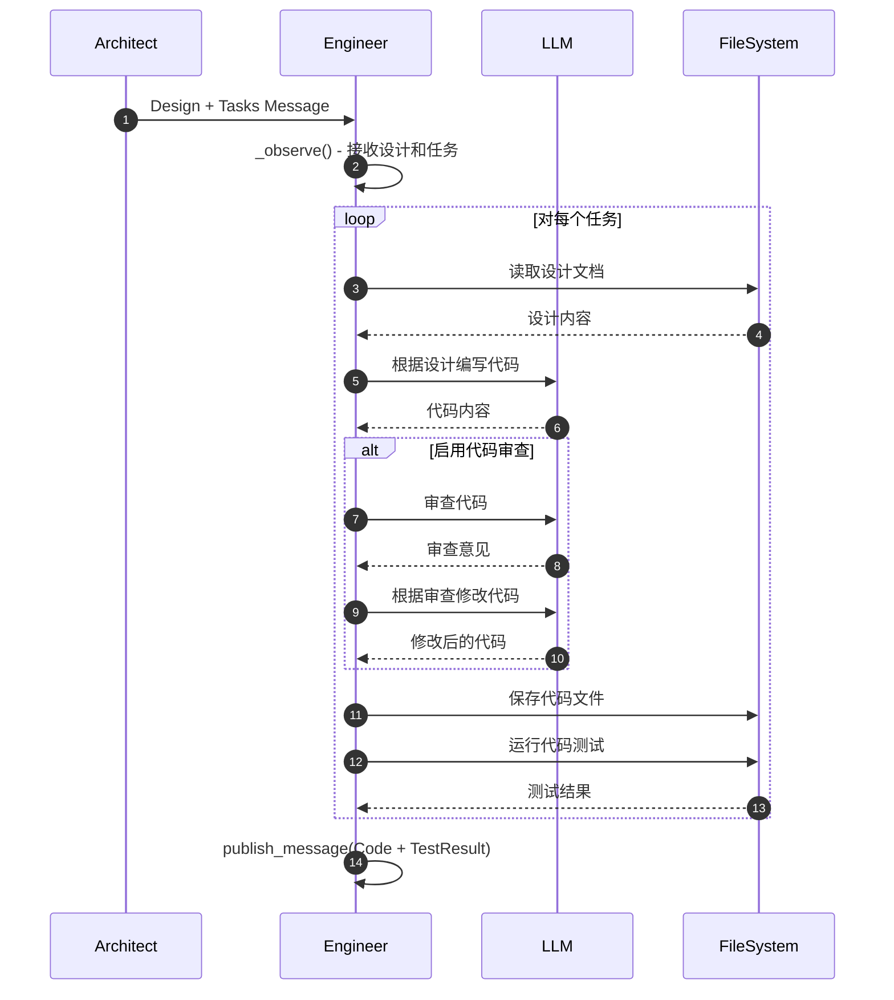

### 4.4 TeamLeader（团队领导）

#### 角色定位

- **职责**：任务协调、消息路由、团队管理
- **输入**：所有角色的消息
- **输出**：协调指令、任务分配
- **特殊机制**：作为消息的中央路由器

#### 核心代码

```python
class TeamLeader(RoleZero):
    name: str = "Mike"
    profile: str = "TeamLeader"
    goal: str = "coordinate team and manage tasks"
    
    instruction: str = TEAMLEADER_INSTRUCTION
    
    def __init__(self, **kwargs) -> None:
        super().__init__(**kwargs)
        self.rc.watch = {MESSAGE_ROUTE_TO_ALL}  # 监听所有消息
```

**代码说明**：
1. **全局监听**：接收所有角色的消息
2. **智能路由**：决定消息应该发送给谁
3. **任务分配**：根据需求分配任务给合适的角色

---

## 5. 关键数据结构与 UML

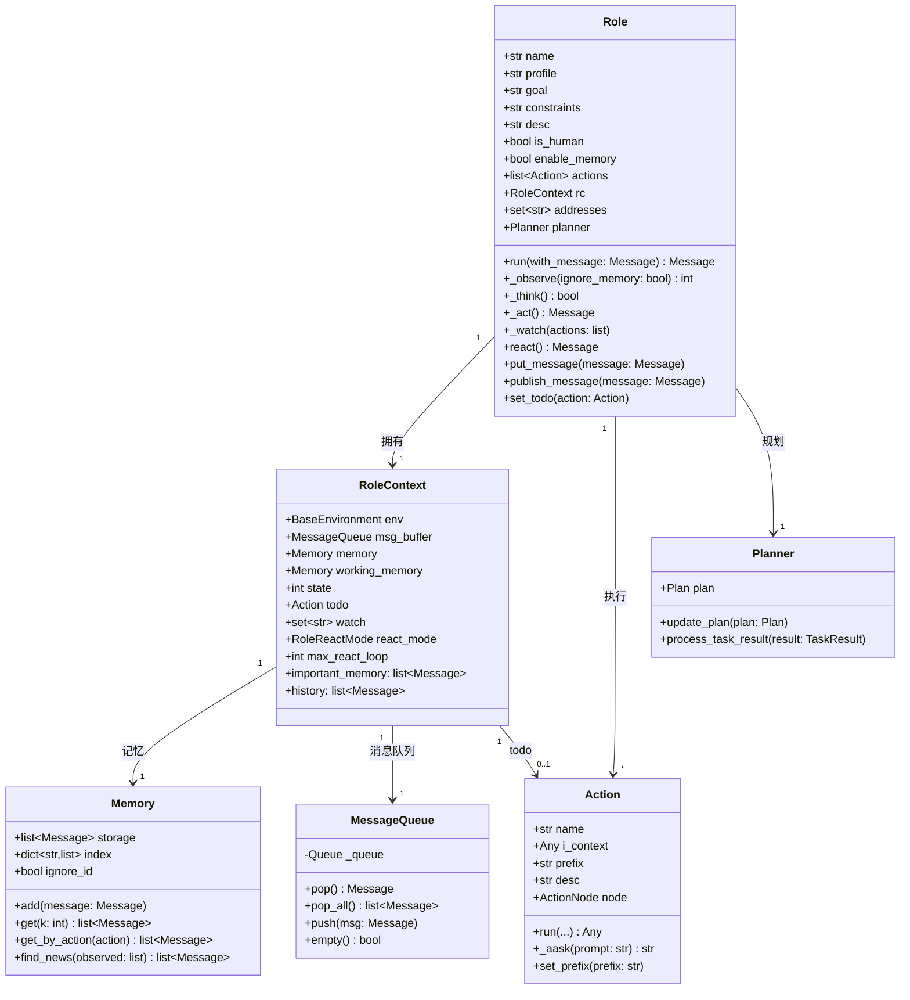

### 数据结构说明

#### 5.1 Role

**关键字段**：
- `name`：角色唯一名称（用于消息路由）
- `profile`：角色类型（如 "ProductManager"）
- `goal`：角色目标（用于生成系统提示词）
- `actions`：可执行的动作列表
- `rc`：运行时上下文（RoleContext）
- `addresses`：消息路由地址集合

#### 5.2 RoleContext

**关键字段**：
- `msg_buffer`：私有消息队列（异步接收）
- `memory`：长期记忆（所有历史）
- `working_memory`：工作记忆（当前任务）
- `todo`：当前待执行的 Action
- `watch`：监听的 Action 类型集合
- `state`：当前状态（多状态角色）
- `react_mode`：反应模式

**反应模式**：
- `REACT`：观察后动态决定行动（默认）
- `BY_ORDER`：按 actions 顺序执行
- `PLAN_AND_ACT`：先规划任务再执行

#### 5.3 消息路由机制

```python
# 消息发送
message.send_to = {"Architect"}  # 发送给特定角色
message.send_to = {"ProductManager"}  # 发送给特定角色类型
message.send_to = {MESSAGE_ROUTE_TO_ALL}  # 广播

# 角色地址
role.addresses = {
    "Bob",  # 名称
    "Architect",  # 类型
    "metagpt.actions.WriteDesign",  # watch 的 Action
    MESSAGE_ROUTE_TO_ALL,  # 广播地址
}
```

---

## 6. 实战案例与最佳实践

### 案例 1：自定义简单角色

```python
from metagpt.roles import Role
from metagpt.actions import Action
from metagpt.schema import Message

# 1. 定义自定义动作
class AnalyzeRequirement(Action):
    name: str = "AnalyzeRequirement"
    
    async def run(self, context: list[Message]) -> str:
        # 从历史消息中提取需求
        requirements = [msg.content for msg in context if msg.is_user_message()]
        
        # 调用 LLM 分析
        prompt = f"分析以下需求的可行性：\n{'\\n'.join(requirements)}"
        analysis = await self.llm.aask(prompt)
        
        return analysis

# 2. 定义自定义角色
class RequirementAnalyst(Role):
    name: str = "Analyst"
    profile: str = "RequirementAnalyst"
    goal: str = "分析需求可行性"
    
    def __init__(self, **kwargs):
        super().__init__(**kwargs)
        self.set_actions([AnalyzeRequirement])
        self._watch([UserRequirement])  # 监听用户需求

# 3. 使用自定义角色
team = Team()
team.hire([ProductManager(), RequirementAnalyst(), Architect()])
await team.run(n_round=5, idea="开发在线教育平台")
```

### 案例 2：多状态角色实现

```python
class QAEngineer(Role):
    """质量保证工程师：编写测试、运行测试、修复失败"""
    
    name: str = "QA"
    profile: str = "QAEngineer"
    goal: str = "ensure code quality"
    
    def __init__(self, **kwargs):
        super().__init__(**kwargs)
        
        # 定义动作序列
        self.set_actions([
            WriteTest,      # 状态 0：编写测试
            RunTest,        # 状态 1：运行测试
            ReportBug,      # 状态 2：报告 Bug
        ])
        
        # 定义状态描述
        self.states = [
            "编写测试用例",
            "运行测试并收集结果",
            "报告发现的问题",
        ]
        
        self._watch([WriteCode])  # 监听代码提交
    
    async def _think(self) -> bool:
        """自定义状态转换逻辑"""
        if self.rc.state == -1:
            # 初始状态：开始编写测试
            self._set_state(0)
        elif self.rc.state == 0:
            # 测试编写完成：运行测试
            self._set_state(1)
        elif self.rc.state == 1:
            # 测试运行完成：检查结果
            test_result = await self._check_test_result()
            if test_result["failed"] > 0:
                self._set_state(2)  # 有失败：报告 Bug
            else:
                self._set_state(-1)  # 全部通过：完成
        elif self.rc.state == 2:
            # Bug 报告完成：结束
            self._set_state(-1)
        
        return bool(self.rc.todo)
```

### 案例 3：角色协作模式

```python
# 定义协作团队
class ResearchTeam:
    """研究团队：收集信息、分析数据、撰写报告"""
    
    def __init__(self):
        self.team = Team()
        
        # 角色 1：信息收集者
        self.collector = Role(
            name="Collector",
            profile="DataCollector",
            goal="收集相关资料",
        )
        self.collector.set_actions([SearchWeb, ScrapeContent])
        self.collector._watch([UserRequirement])
        
        # 角色 2：数据分析师
        self.analyst = Role(
            name="Analyst",
            profile="DataAnalyst",
            goal="分析收集的数据",
        )
        self.analyst.set_actions([AnalyzeData, VisualizeData])
        self.analyst._watch([SearchWeb])  # 监听收集结果
        
        # 角色 3：报告撰写者
        self.writer = Role(
            name="Writer",
            profile="ReportWriter",
            goal="撰写研究报告",
        )
        self.writer.set_actions([WriteReport])
        self.writer._watch([AnalyzeData])  # 监听分析结果
        
        # 雇佣团队
        self.team.hire([self.collector, self.analyst, self.writer])
    
    async def research(self, topic: str):
        """执行研究任务"""
        await self.team.run(n_round=10, idea=f"研究主题：{topic}")
        return self.team.env.history

# 使用
team = ResearchTeam()
result = await team.research("人工智能在教育中的应用")
```

### 案例 4：工具集成

```python
from metagpt.tools.tool_registry import register_tool

# 注册自定义工具
@register_tool()
class DatabaseTool:
    """数据库查询工具"""
    
    async def query(self, sql: str) -> list:
        """执行 SQL 查询"""
        # 实现数据库查询
        pass
    
    async def insert(self, table: str, data: dict) -> bool:
        """插入数据"""
        # 实现数据插入
        pass

# 在角色中使用工具
class DataEngineer(RoleZero):
    tools: list[str] = ["DatabaseTool"]  # 声明可用工具
    
    def __init__(self, **kwargs):
        super().__init__(**kwargs)
        self.db_tool = DatabaseTool()
        
        # 注册工具执行映射
        self.tool_execution_map.update({
            "DatabaseTool.query": self.db_tool.query,
            "DatabaseTool.insert": self.db_tool.insert,
        })
```

---

**文档版本**：v1.0  
**最后更新**：2025-10-05  
**维护者**：MetaGPT 团队

