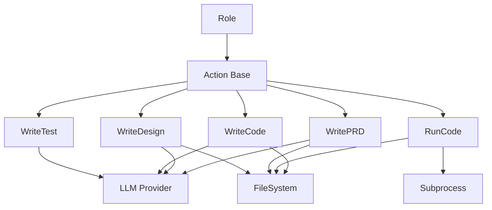
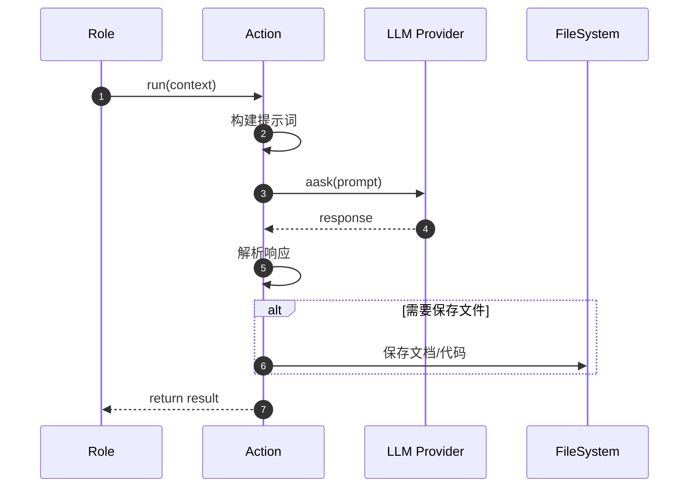
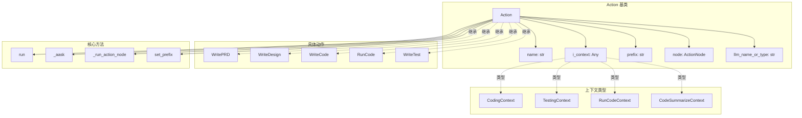
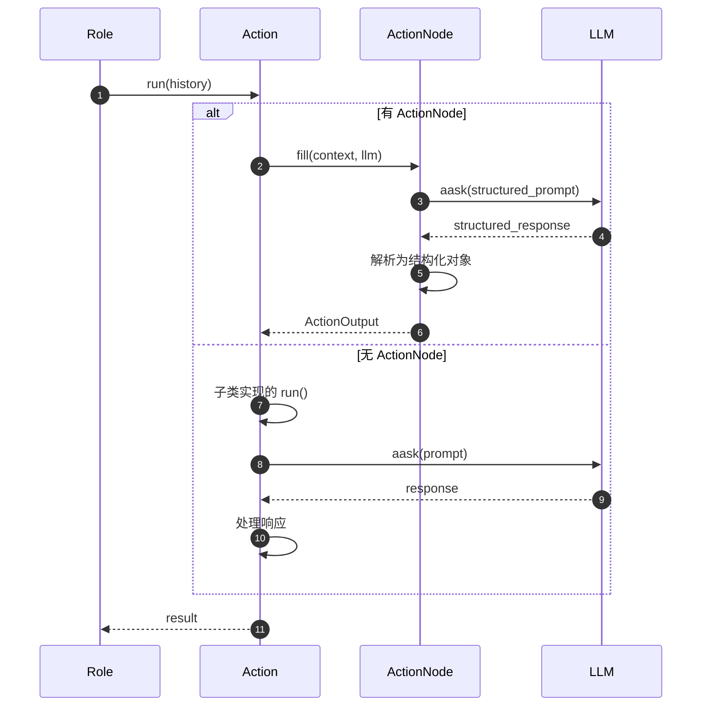
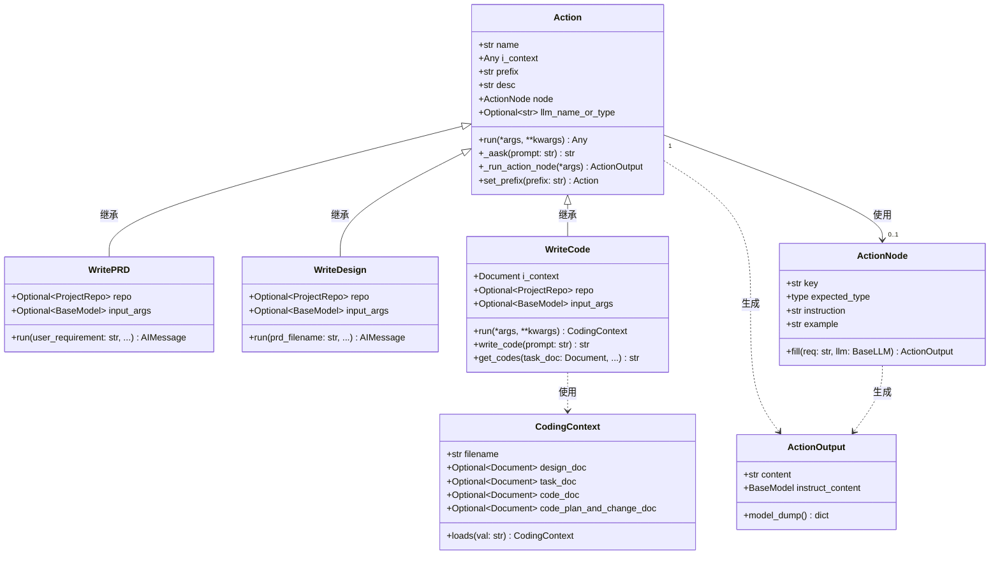
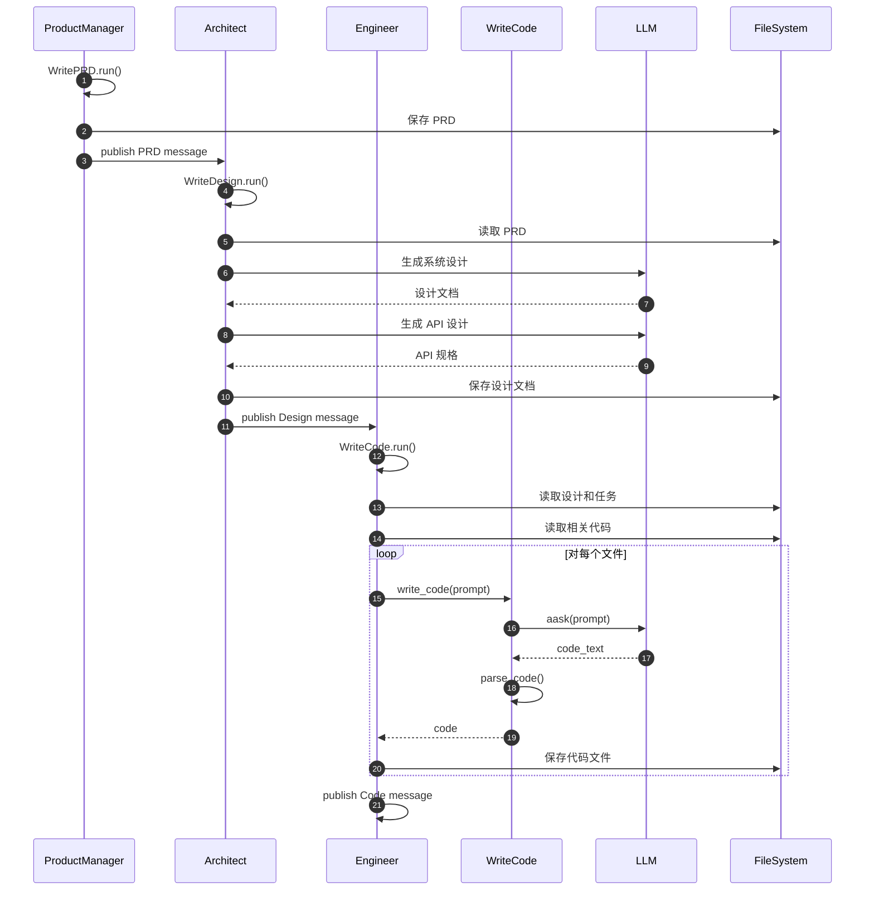
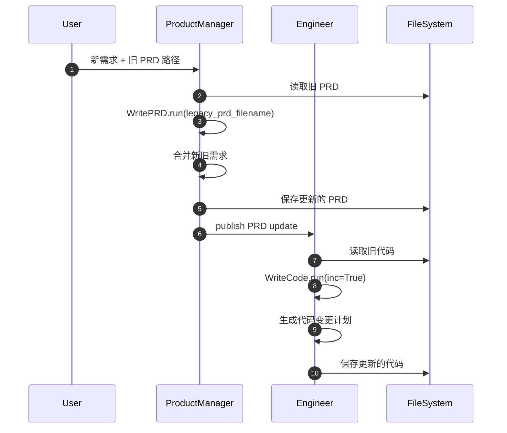

# MetaGPT-03-动作系统

本文档深入剖析 MetaGPT 的动作系统（Action System），包括 Action 基类、各种具体动作实现（WritePRD、WriteDesign、WriteCode 等）、动作执行流程、上下文传递机制，以及动作与角色的协作关系。

---

## 1. 模块概览

### 1.1 职责边界

**Action 基类**：
- 定义动作的通用接口和属性
- 管理 LLM 调用和提示词处理
- 提供上下文（i_context）传递机制
- 支持 ActionNode 结构化输出
- 提供序列化与反序列化能力

**具体动作**：
- **WritePRD**：根据用户需求编写产品需求文档
- **WriteDesign**：基于 PRD 设计系统架构和 API
- **WriteCode**：根据设计文档和任务生成代码
- **WriteTest**：为代码生成测试用例
- **RunCode**：执行代码并返回运行结果

### 1.2 输入/输出

| 动作 | 输入 | 输出 |
|------|------|------|
| Action（基类） | context（历史消息或上下文） | str 或 ActionOutput |
| WritePRD | user_requirement | PRD Document |
| WriteDesign | PRD Document | Design Document + API Spec |
| WriteCode | Design + Task | Code Files |
| RunCode | Code + Test Code | RunCodeResult |
| WriteTest | Code | Test Code |

### 1.3 上下游依赖



### 1.4 执行流程



---

## 2. 模块架构图



### 架构说明

#### 2.1 核心组件

**Action 核心属性**：
- `name`：动作名称（自动从类名推导）
- `i_context`：输入上下文（可为 str、dict 或专用 Context 对象）
- `prefix`：系统提示词前缀
- `node`：ActionNode 用于结构化输出
- `llm_name_or_type`：指定使用的 LLM 模型

**Context 类型**：
- `CodingContext`：编码上下文（包含设计文档、任务文档、代码文档）
- `TestingContext`：测试上下文（包含代码文档、测试文档）
- `RunCodeContext`：运行代码上下文（包含代码、测试代码、命令）
- `CodeSummarizeContext`：代码总结上下文

---

## 3. 核心 API 详细规格

### API 3.1：Action.run()

#### 基本信息

- **名称**：`run`
- **协议与方法**：Python 异步方法（async）
- **幂等性**：非幂等（调用 LLM 产生新内容）

#### 请求结构体

```python
async def run(self, *args, **kwargs):
    """Run action"""
    pass
```

**字段表**：

| 字段 | 类型 | 必填 | 约束/默认 | 说明 |
|------|------|------|-----------|------|
| *args | tuple | 否 | - | 位置参数（通常为历史消息列表） |
| **kwargs | dict | 否 | - | 关键字参数（具体参数由子类定义） |

#### 响应结构体

```python
return result  # str 或 ActionOutput 或 Document
```

| 字段 | 类型 | 说明 |
|------|------|------|
| - | Union[str, ActionOutput, Document] | 动作执行结果 |

#### 入口函数与核心代码

```python
async def run(self, *args, **kwargs):
    # 1) 如果有 ActionNode，使用结构化输出
    if self.node:
        return await self._run_action_node(*args, **kwargs)
    
    # 2) 否则子类必须实现 run 方法
    raise NotImplementedError("The run method should be implemented in a subclass.")

async def _run_action_node(self, *args, **kwargs):
    """使用 ActionNode 执行结构化输出"""
    msgs = args[0]  # 历史消息
    
    # 构建上下文
    context = "## History Messages\n"
    context += "\n".join([f"{idx}: {i}" for idx, i in enumerate(reversed(msgs))])
    
    # 调用 ActionNode 填充结构化输出
    return await self.node.fill(req=context, llm=self.llm)
```

**代码解释**：
1. **ActionNode 模式**：如果设置了 node，使用结构化输出
2. **子类实现**：否则要求子类实现 run 方法
3. **上下文构建**：将历史消息格式化为上下文

#### 调用链与上游函数

```python
# 调用方：Role._act()
response = await self.rc.todo.run(self.rc.history)

# 调用链
Role._act() → Action.run() → LLM.aask() → 生成内容
```

#### 时序图



---

### API 3.2：WritePRD.run()

#### 基本信息

- **名称**：`run`
- **协议与方法**：Python 异步方法（async）
- **幂等性**：非幂等（每次生成新的 PRD）

#### 请求结构体

```python
async def run(
    self,
    with_messages: List[Message] = None,
    *,
    user_requirement: str = "",
    output_pathname: str = "",
    legacy_prd_filename: str = "",
    extra_info: str = "",
    **kwargs,
) -> Union[AIMessage, str]:
    """Write a Product Requirement Document."""
    pass
```

**字段表**：

| 字段 | 类型 | 必填 | 约束/默认 | 说明 |
|------|------|------|-----------|------|
| with_messages | List[Message] | 否 | None | 历史消息列表 |
| user_requirement | str | 是 | 非空 | 用户需求描述 |
| output_pathname | str | 否 | "" | 输出文件路径 |
| legacy_prd_filename | str | 否 | "" | 旧版 PRD 文件名（用于更新） |
| extra_info | str | 否 | "" | 额外信息 |

#### 响应结构体

```python
return AIMessage(content=prd_content, instruct_content=prd_doc)
```

| 字段 | 类型 | 说明 |
|------|------|------|
| content | str | PRD 文档内容 |
| instruct_content | Document | 结构化的 PRD 文档对象 |

#### 入口函数与核心代码

```python
async def run(
    self,
    with_messages: List[Message] = None,
    *,
    user_requirement: str = "",
    output_pathname: str = "",
    legacy_prd_filename: str = "",
    extra_info: str = "",
    **kwargs,
) -> Union[AIMessage, str]:
    # 1) 判断是新需求还是需求更新
    if legacy_prd_filename:
        # 需求更新：读取旧 PRD
        old_prd = await self.repo.docs.prd.get(filename=legacy_prd_filename)
        context = NEW_REQ_TEMPLATE.format(
            old_prd=old_prd.content,
            requirements=user_requirement
        )
    else:
        # 新需求
        context = CONTEXT_TEMPLATE.format(
            project_name=self.project_name,
            requirements=user_requirement
        )
    
    # 2) 调用 ActionNode 生成 PRD
    node = WRITE_PRD_NODE  # 预定义的结构化输出节点
    prd = await node.fill(context=context, llm=self.llm)
    
    # 3) 保存 PRD 文档
    await self.repo.docs.prd.save(
        filename=output_pathname or "prd.md",
        content=prd.instruct_content.model_dump_json(),
        dependencies=[]
    )
    
    # 4) 返回结果
    return AIMessage(
        content=prd.content,
        instruct_content=prd.instruct_content
    )
```

**代码解释**：
1. **需求判断**：通过 legacy_prd_filename 判断是新需求还是更新
2. **上下文构建**：根据不同场景构建不同的上下文
3. **结构化输出**：使用 ActionNode 生成结构化的 PRD
4. **文档保存**：保存到项目仓库的 docs/prd 目录

---

### API 3.3：WriteDesign.run()

#### 基本信息

- **名称**：`run`
- **协议与方法**：Python 异步方法（async）
- **幂等性**：非幂等（每次生成新的设计）

#### 请求结构体

```python
async def run(
    self,
    with_messages: List[Message] = None,
    *,
    user_requirement: str = "",
    prd_filename: str = "",
    legacy_design_filename: str = "",
    extra_info: str = "",
    output_pathname: str = "",
    **kwargs,
) -> Union[AIMessage, str]:
    """Write a system design."""
    pass
```

**字段表**：

| 字段 | 类型 | 必填 | 约束/默认 | 说明 |
|------|------|------|-----------|------|
| user_requirement | str | 否 | "" | 用户需求 |
| prd_filename | str | 是 | 非空 | PRD 文件名 |
| legacy_design_filename | str | 否 | "" | 旧版设计文件名 |
| extra_info | str | 否 | "" | 额外信息 |
| output_pathname | str | 否 | "" | 输出文件路径 |

#### 核心代码

```python
async def run(
    self,
    with_messages: List[Message] = None,
    *,
    user_requirement: str = "",
    prd_filename: str = "",
    legacy_design_filename: str = "",
    extra_info: str = "",
    output_pathname: str = "",
    **kwargs,
) -> Union[AIMessage, str]:
    # 1) 读取 PRD 文档
    prd_doc = await self.repo.docs.prd.get(filename=prd_filename)
    
    # 2) 构建上下文
    if legacy_design_filename:
        # 设计更新
        old_design = await self.repo.docs.system_design.get(filename=legacy_design_filename)
        context = NEW_REQ_TEMPLATE.format(
            old_design=old_design.content,
            context=prd_doc.content
        )
    else:
        # 新设计
        context = prd_doc.content
    
    # 3) 生成系统设计
    design_node = DESIGN_API_NODE
    design = await design_node.fill(context=context, llm=self.llm)
    
    # 4) 生成数据结构和接口
    data_api_node = DATA_STRUCTURES_AND_INTERFACES
    data_api_design = await data_api_node.fill(
        context=context + "\n" + design.content,
        llm=self.llm
    )
    
    # 5) 生成程序调用流程
    seq_flow_node = PROGRAM_CALL_FLOW
    seq_flow = await seq_flow_node.fill(
        context=context + "\n" + design.content,
        llm=self.llm
    )
    
    # 6) 保存设计文档
    await self.repo.docs.system_design.save(
        filename=output_pathname or "system_design.md",
        content=design.instruct_content.model_dump_json(),
        dependencies=[prd_filename]
    )
    
    # 7) 返回结果
    return AIMessage(
        content=design.content,
        instruct_content=design.instruct_content
    )
```

---

### API 3.4：WriteCode.run()

#### 基本信息

- **名称**：`run`
- **协议与方法**：Python 异步方法（async）
- **幂等性**：非幂等（每次生成新代码）

#### 请求结构体

```python
async def run(self, *args, **kwargs) -> CodingContext:
    """Generate code based on design and task."""
    pass
```

#### 响应结构体

```python
return coding_context  # CodingContext 对象
```

**CodingContext 结构**：

| 字段 | 类型 | 说明 |
|------|------|------|
| filename | str | 目标文件名 |
| design_doc | Document | 设计文档 |
| task_doc | Document | 任务文档 |
| code_doc | Document | 生成的代码文档 |
| code_plan_and_change_doc | Document | 代码规划文档（增量模式） |

#### 核心代码

```python
async def run(self, *args, **kwargs) -> CodingContext:
    # 1) 加载上下文
    coding_context = CodingContext.loads(self.i_context.content)
    
    # 2) 读取相关文档
    design_doc = coding_context.design_doc
    task_doc = coding_context.task_doc
    
    # 3) 获取相关代码上下文
    code_context = await self.get_codes(
        task_doc,
        exclude=self.i_context.filename,
        project_repo=self.repo
    )
    
    # 4) 构建提示词
    prompt = PROMPT_TEMPLATE.format(
        design=design_doc.content,
        task=task_doc.content,
        code=code_context,
        logs="",  # 测试日志（如有）
        feedback="",  # Bug 反馈（如有）
        filename=self.i_context.filename,
        demo_filename=Path(self.i_context.filename).stem
    )
    
    # 5) 调用 LLM 生成代码
    code = await self.write_code(prompt)
    
    # 6) 保存代码
    coding_context.code_doc = Document(
        filename=self.i_context.filename,
        content=code
    )
    
    await self.repo.srcs.save(
        filename=self.i_context.filename,
        content=code,
        dependencies=[design_doc.filename, task_doc.filename]
    )
    
    # 7) 返回编码上下文
    return coding_context

@retry(wait=wait_random_exponential(min=1, max=60), stop=stop_after_attempt(6))
async def write_code(self, prompt) -> str:
    """带重试的代码生成"""
    code_rsp = await self._aask(prompt)
    code = CodeParser.parse_code(text=code_rsp)
    return code
```

**代码解释**：
1. **上下文加载**：从 i_context 加载 CodingContext
2. **文档读取**：读取设计文档和任务文档
3. **代码上下文**：获取相关的已有代码
4. **提示词构建**：组合所有信息构建完整提示词
5. **代码生成**：调用 LLM 生成代码
6. **代码保存**：保存到项目仓库
7. **重试机制**：使用 tenacity 实现自动重试

---

## 4. 关键数据结构与 UML



---

## 5. 关键流程时序图

### 5.1 完整代码生成流程



### 5.2 增量迭代流程



---

## 6. 实战案例与最佳实践

### 案例 1：自定义简单 Action

```python
from metagpt.actions import Action

class SimpleSummarize(Action):
    """简单的文本总结动作"""
    
    name: str = "SimpleSummarize"
    
    async def run(self, text: str) -> str:
        """总结输入文本"""
        prompt = f"Please summarize the following text in 100 words:\n\n{text}"
        summary = await self._aask(prompt)
        return summary

# 使用
action = SimpleSummarize()
result = await action.run("Long text to summarize...")
print(result)
```

### 案例 2：使用 ActionNode 结构化输出

```python
from metagpt.actions import Action
from metagpt.actions.action_node import ActionNode

# 定义输出结构
class AnalysisOutput(BaseModel):
    summary: str
    key_points: list[str]
    sentiment: str

class AnalyzeText(Action):
    """分析文本并返回结构化结果"""
    
    name: str = "AnalyzeText"
    
    def __init__(self, **kwargs):
        super().__init__(**kwargs)
        
        # 定义 ActionNode
        self.node = ActionNode(
            key="analysis",
            expected_type=AnalysisOutput,
            instruction="Analyze the text and provide summary, key points, and sentiment",
            example='{"summary": "...", "key_points": ["point1", "point2"], "sentiment": "positive"}'
        )
    
    async def run(self, text: str) -> ActionOutput:
        """执行分析"""
        context = f"Text to analyze:\n{text}"
        result = await self.node.fill(req=context, llm=self.llm)
        return result

# 使用
action = AnalyzeText()
result = await action.run("Some text to analyze...")
print(result.instruct_content.summary)
print(result.instruct_content.key_points)
```

### 案例 3：带文件操作的 Action

```python
from metagpt.actions import Action
from metagpt.utils.project_repo import ProjectRepo

class SaveReport(Action):
    """生成并保存报告"""
    
    name: str = "SaveReport"
    repo: ProjectRepo = None
    
    async def run(self, data: dict) -> str:
        # 1. 生成报告内容
        prompt = f"Generate a report based on this data:\n{json.dumps(data)}"
        report = await self._aask(prompt)
        
        # 2. 保存到文件
        await self.repo.docs.save(
            filename="report.md",
            content=report,
            dependencies=[]
        )
        
        return f"Report saved to report.md"
```

---

**文档版本**：v1.0  
**最后更新**：2025-10-05  
**维护者**：MetaGPT 团队

