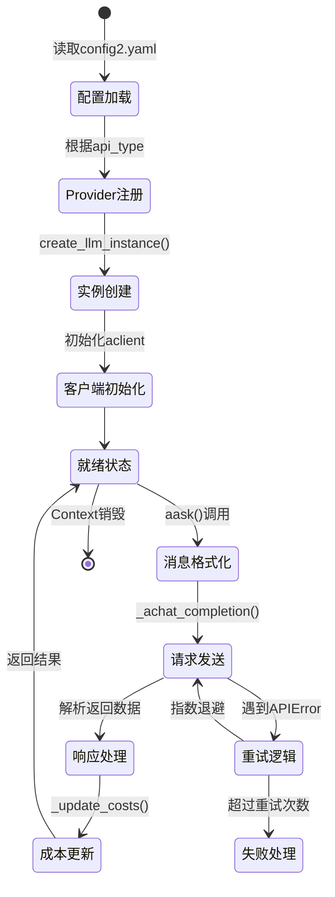
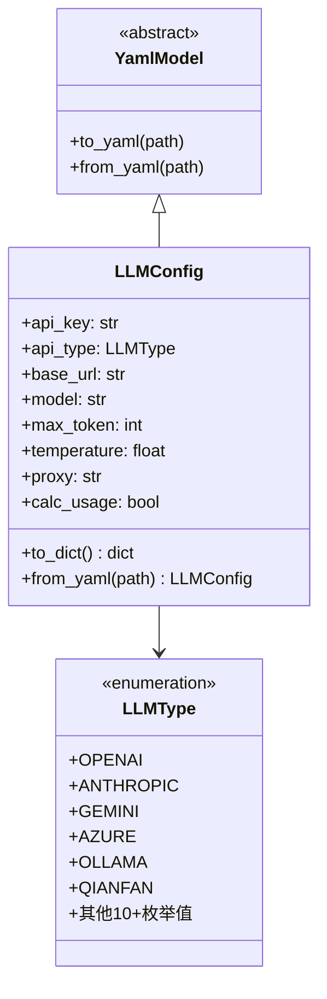
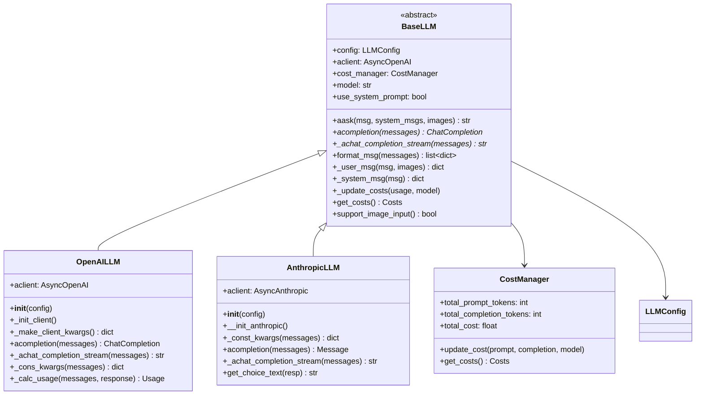
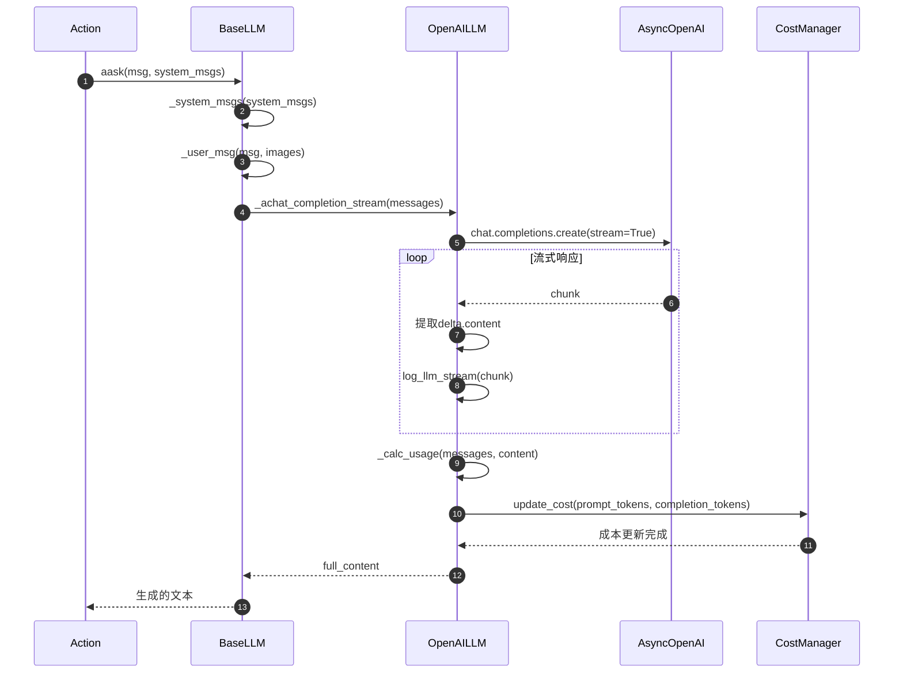
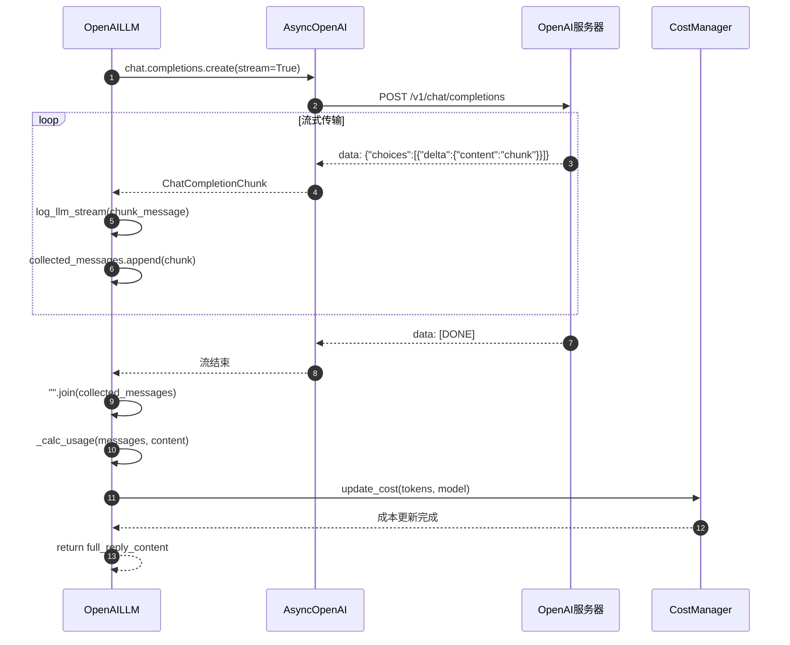
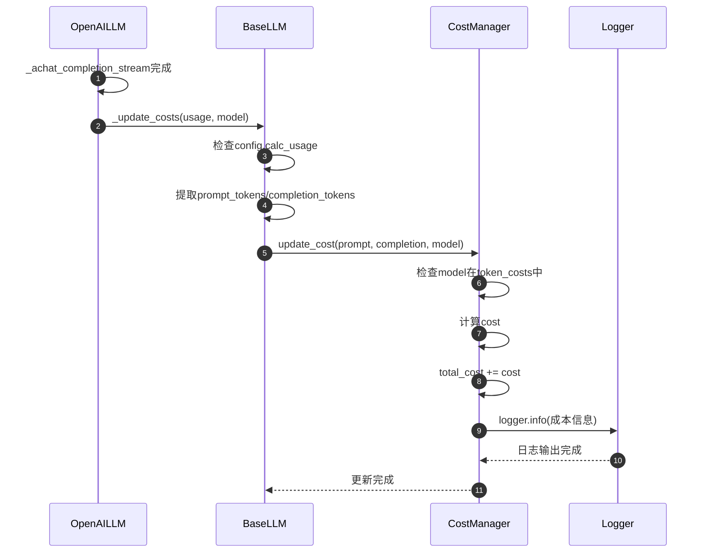
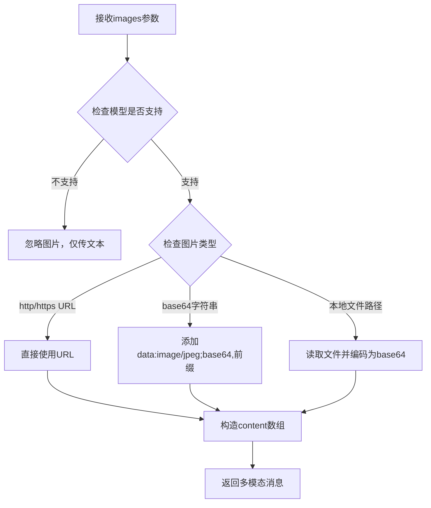
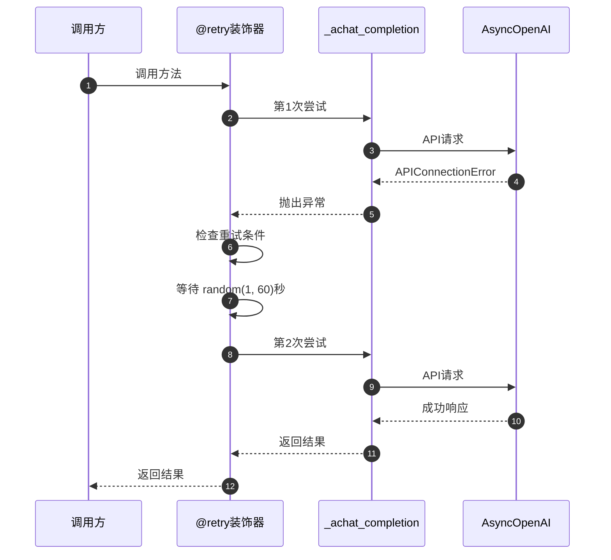
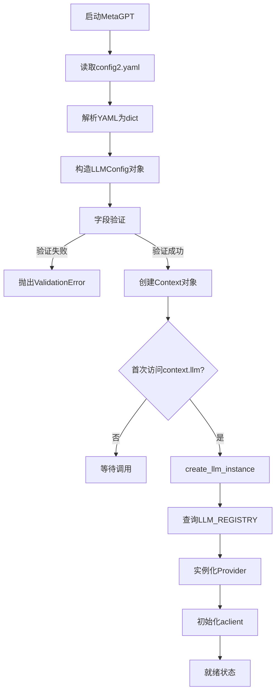
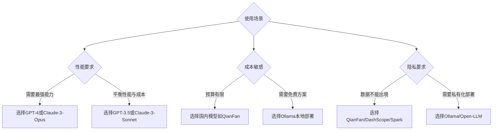

# MetaGPT-04-LLM提供者

## 一、模块概览

### 1.1 模块职责

LLM提供者模块（Provider）负责封装与各种大语言模型服务的通信接口，提供统一的API调用规范，管理模型配置、请求构造、响应解析、成本追踪和错误处理。该模块支持15+主流LLM服务商，包括OpenAI、Anthropic、Google Gemini、Azure、本地模型等。

**核心职责**：
- **统一接口抽象**：定义`BaseLLM`基类，规范所有Provider的实现标准
- **多Provider支持**：通过注册机制动态加载不同LLM服务
- **配置管理**：处理API密钥、端点、模型参数等配置
- **消息格式化**：统一不同Provider的消息格式（OpenAI格式、Anthropic格式等）
- **成本追踪**：记录Token使用量并计算API调用成本
- **流式响应**：支持流式和非流式两种调用模式
- **多模态支持**：处理文本+图片的混合输入
- **重试机制**：通过tenacity实现失败重试
- **代理支持**：处理网络代理配置

### 1.2 模块边界

**输入**：
- LLM配置对象（`LLMConfig`）：包含API密钥、模型名称、参数等
- 消息列表（`list[dict]` 或 `Message`对象）：用户输入、系统提示词、历史对话
- 可选参数：超时时间、流式开关、图片数据等

**输出**：
- 文本响应（`str`）：模型生成的内容
- 结构化响应（`ChatCompletion`、`Message`等）：包含完整元数据的响应对象
- 成本统计（`Costs`）：Token使用量和费用

**上游调用者**：
- `Action`：所有动作通过`_aask`方法调用LLM
- `Context`：全局上下文持有LLM实例
- `Role`：角色通过`llm`属性访问LLM

**下游依赖**：
- 各LLM服务商的SDK（`openai`、`anthropic`、`google-generativeai`等）
- `CostManager`：成本追踪
- `TokenCounter`：Token计数

### 1.3 生命周期



**关键状态说明**：
- **配置加载**：从`config2.yaml`读取`llm`配置段，解析`api_type`、`api_key`、`model`等参数
- **Provider注册**：通过`@register_provider`装饰器将Provider类注册到`LLM_REGISTRY`
- **实例创建**：`create_llm_instance()`根据`api_type`从注册表获取对应Provider类并实例化
- **客户端初始化**：初始化异步HTTP客户端（如`AsyncOpenAI`），配置代理、超时等
- **就绪状态**：可接受调用的空闲状态
- **消息格式化**：将`Message`对象转换为Provider特定的消息格式
- **请求发送**：调用SDK的异步方法发送请求
- **响应处理**：解析返回的JSON/流式数据，提取文本内容
- **成本更新**：根据`prompt_tokens`和`completion_tokens`计算费用
- **重试逻辑**：使用tenacity处理临时性错误（网络超时、限流等）

### 1.4 架构图

```mermaid
flowchart TB
    subgraph 调用层
        Action[Action._aask]
        Context[Context.llm]
        Role[Role.llm]
    end
    
    subgraph Provider注册层
        Registry[LLMProviderRegistry]
        CreateInstance[create_llm_instance]
        RegisterDecorator[@register_provider]
    end
    
    subgraph 基类层
        BaseLLM[BaseLLM抽象类]
        BaseLLM --> |定义接口|aask
        BaseLLM --> |定义接口|acompletion
        BaseLLM --> |定义接口|format_msg
        BaseLLM --> |定义接口|_update_costs
    end
    
    subgraph Provider实现层
        OpenAILLM[OpenAILLM]
        AnthropicLLM[AnthropicLLM]
        GeminiLLM[GeminiLLM]
        AzureLLM[AzureOpenAILLM]
        OllamaLLM[OllamaLLM]
        QianFanLLM[QianFanLLM]
        Others[其他12个Provider...]
    end
    
    subgraph SDK层
        OpenAISDK[AsyncOpenAI]
        AnthropicSDK[AsyncAnthropic]
        GeminiSDK[GenerativeModel]
        HTTPClient[httpx.AsyncClient]
    end
    
    subgraph 支撑层
        LLMConfig[LLMConfig配置]
        CostManager[CostManager成本管理]
        TokenCounter[TokenCounter计数]
        Retry[Tenacity重试]
    end
    
    Action --> Context
    Context --> CreateInstance
    CreateInstance --> Registry
    Registry --> BaseLLM
    BaseLLM --> OpenAILLM
    BaseLLM --> AnthropicLLM
    BaseLLM --> GeminiLLM
    BaseLLM --> AzureLLM
    BaseLLM --> OllamaLLM
    BaseLLM --> QianFanLLM
    BaseLLM --> Others
    
    OpenAILLM --> OpenAISDK
    AnthropicLLM --> AnthropicSDK
    GeminiLLM --> GeminiSDK
    OllamaLLM --> HTTPClient
    
    OpenAILLM --> LLMConfig
    OpenAILLM --> CostManager
    OpenAILLM --> TokenCounter
    OpenAILLM --> Retry
    
    RegisterDecorator --> Registry
```

**架构说明**：
- **调用层**：业务代码通过`Action`、`Role`、`Context`访问LLM
- **注册层**：通过装饰器模式和注册表实现Provider的动态加载
- **基类层**：定义所有Provider必须实现的接口和通用逻辑
- **实现层**：针对不同LLM服务的具体实现，处理各服务的特殊格式和特性
- **SDK层**：各LLM服务商提供的官方或第三方SDK
- **支撑层**：配置、成本、计数、重试等横切关注点

**异常边界**：
- SDK抛出的异常在Provider层捕获并重新抛出为统一格式
- 临时性错误（网络超时、429限流）触发重试，最多6次
- 永久性错误（认证失败、模型不存在）直接向上传播

## 二、核心数据结构

### 2.1 LLMConfig 配置类

```python
class LLMConfig(YamlModel):
    # 基础认证
    api_key: str = "sk-"
    api_type: LLMType = LLMType.OPENAI
    base_url: str = "https://api.openai.com/v1"
    api_version: Optional[str] = None
    
    # 模型选择
    model: Optional[str] = None
    pricing_plan: Optional[str] = None  # 成本结算计划参数
    
    # 云服务商认证（如百度、阿里云）
    access_key: Optional[str] = None
    secret_key: Optional[str] = None
    session_token: Optional[str] = None
    endpoint: Optional[str] = None
    
    # 特殊服务商参数（如讯飞星火）
    app_id: Optional[str] = None
    api_secret: Optional[str] = None
    domain: Optional[str] = None
    
    # Chat Completion 参数
    max_token: int = 4096
    temperature: float = 0.0
    top_p: float = 1.0
    top_k: int = 0
    repetition_penalty: float = 1.0
    stop: Optional[str] = None
    presence_penalty: float = 0.0
    frequency_penalty: float = 0.0
    stream: bool = True
    seed: Optional[int] = None
    timeout: int = 600
    context_length: Optional[int] = None
    
    # 网络配置
    proxy: Optional[str] = None
    calc_usage: bool = True
```

**类图**：



**字段语义**：

| 字段 | 类型 | 必填 | 默认值 | 约束 | 说明 |
|-----|------|-----|--------|-----|------|
| api_key | str | 是 | "sk-" | 非空 | API密钥，从服务商控制台获取 |
| api_type | LLMType | 是 | OPENAI | 枚举值 | 决定使用哪个Provider实现 |
| base_url | str | 否 | OpenAI官方地址 | URL格式 | API端点，用于自部署或代理 |
| model | str | 否 | None | - | 模型名称，如gpt-4、claude-3-sonnet |
| pricing_plan | str | 否 | None | - | 成本计算方案，默认使用model |
| max_token | int | 否 | 4096 | >0 | 最大生成Token数 |
| temperature | float | 否 | 0.0 | 0.0-2.0 | 采样温度，0为确定性输出 |
| top_p | float | 否 | 1.0 | 0.0-1.0 | 核采样参数 |
| stream | bool | 否 | True | - | 是否使用流式输出 |
| timeout | int | 否 | 600 | >0 | 请求超时时间（秒） |
| proxy | str | 否 | None | URL格式 | HTTP代理地址 |
| calc_usage | bool | 否 | True | - | 是否计算Token使用量 |

**版本演进**：
- v0.1：仅支持OpenAI，配置项约10个
- v0.3：新增`api_type`枚举，支持5个Provider
- v0.5：新增云服务商认证字段（`access_key`、`secret_key`）
- v0.7：新增`pricing_plan`支持自定义成本方案
- v0.8：新增`context_length`支持长上下文模型

### 2.2 BaseLLM 抽象基类

```python
class BaseLLM(ABC):
    config: LLMConfig
    use_system_prompt: bool = True
    system_prompt = "You are a helpful assistant."
    
    aclient: Optional[Union[AsyncOpenAI]] = None  # 异步客户端
    cost_manager: Optional[CostManager] = None
    model: Optional[str] = None
    pricing_plan: Optional[str] = None
    
    @abstractmethod
    def __init__(self, config: LLMConfig):
        pass
    
    # 核心调用接口
    async def aask(
        self,
        msg: Union[str, list[dict]],
        system_msgs: Optional[list[str]] = None,
        format_msgs: Optional[list[dict]] = None,
        images: Optional[Union[str, list[str]]] = None,
        timeout=USE_CONFIG_TIMEOUT,
        stream=None,
    ) -> str:
        # （此处省略消息格式化逻辑）
        
    @abstractmethod
    async def acompletion(self, messages: list[dict], timeout: int) -> ChatCompletion:
        # 子类必须实现：发送请求并返回完整响应对象
        pass
    
    @abstractmethod
    async def _achat_completion_stream(self, messages: list[dict], timeout: int) -> str:
        # 子类必须实现：流式调用
        pass
    
    # 消息格式化
    def format_msg(self, messages: Union[str, Message, list]) -> list[dict]:
        # （此处省略格式转换逻辑）
    
    def _user_msg(self, msg: str, images: Optional[list[str]] = None) -> dict:
        # 构造用户消息，处理文本+图片
    
    def _system_msg(self, msg: str) -> dict:
        return {"role": "system", "content": msg}
    
    def _assistant_msg(self, msg: str) -> dict:
        return {"role": "assistant", "content": msg}
    
    # 成本管理
    def _update_costs(self, usage: dict, model: str = None):
        # 更新Token使用量和费用
    
    def get_costs(self) -> Costs:
        return self.cost_manager.get_costs()
    
    # 工具函数
    def support_image_input(self) -> bool:
        return any([m in self.model for m in MULTI_MODAL_MODELS])
    
    def get_timeout(self, timeout) -> int:
        return self.config.timeout if timeout == USE_CONFIG_TIMEOUT else timeout
```

**类图**：



**接口约定**：
- `aask()`：高级封装接口，接受字符串或消息列表，自动处理系统提示词
- `acompletion()`：底层接口，直接发送格式化消息，返回完整响应对象
- `_achat_completion_stream()`：流式调用，逐块返回内容
- 子类必须实现`acompletion()`和`_achat_completion_stream()`
- 子类可选重写`_cons_kwargs()`定制请求参数

### 2.3 CostManager 成本管理类

```python
class CostManager(BaseModel):
    total_prompt_tokens: int = 0
    total_completion_tokens: int = 0
    total_budget: float = 0
    max_budget: float = 10.0
    total_cost: float = 0
    token_costs: dict[str, dict[str, float]] = TOKEN_COSTS
    
    def update_cost(self, prompt_tokens, completion_tokens, model):
        if prompt_tokens + completion_tokens == 0 or not model:
            return
        self.total_prompt_tokens += prompt_tokens
        self.total_completion_tokens += completion_tokens
        if model not in self.token_costs:
            logger.warning(f"Model {model} not found in TOKEN_COSTS.")
            return
        
        cost = (
            prompt_tokens * self.token_costs[model]["prompt"]
            + completion_tokens * self.token_costs[model]["completion"]
        ) / 1000
        self.total_cost += cost
        # （此处省略日志输出）
    
    def get_costs(self) -> Costs:
        return Costs(self.total_prompt_tokens, self.total_completion_tokens, 
                     self.total_cost, self.total_budget)
```

**成本计算公式**：
```
单次成本 = (prompt_tokens × 每千token输入单价 + completion_tokens × 每千token输出单价) / 1000
总成本 = Σ 单次成本
```

**TOKEN_COSTS 配置示例**：
```python
TOKEN_COSTS = {
    "gpt-4": {"prompt": 0.03, "completion": 0.06},
    "gpt-3.5-turbo": {"prompt": 0.0015, "completion": 0.002},
    "claude-3-opus": {"prompt": 0.015, "completion": 0.075},
}
```

## 三、核心API详解

### 3.1 create_llm_instance - Provider实例化

#### 基本信息
- **名称**：`create_llm_instance`
- **位置**：`metagpt/provider/llm_provider_registry.py`
- **协议**：Python函数调用
- **幂等性**：否（每次返回新实例）

#### 请求结构体
```python
def create_llm_instance(config: LLMConfig) -> BaseLLM:
    pass
```

| 参数 | 类型 | 必填 | 默认 | 约束 | 说明 |
|-----|------|-----|------|-----|------|
| config | LLMConfig | 是 | - | 有效的配置对象 | LLM配置，包含api_type等字段 |

#### 响应结构体
```python
返回值: BaseLLM  # OpenAILLM、AnthropicLLM等具体实例
```

#### 核心代码
```python
def create_llm_instance(config: LLMConfig) -> BaseLLM:
    # 1) 从注册表获取Provider类
    llm = LLM_REGISTRY.get_provider(config.api_type)(config)
    
    # 2) 特殊模型处理：o1系列不支持系统提示词
    if llm.use_system_prompt and not config.use_system_prompt:
        llm.use_system_prompt = config.use_system_prompt
    
    return llm
```

**调用链上游**：
```python
# metagpt/context.py
class Context:
    @property
    def llm(self) -> BaseLLM:
        if self._llm is None:
            self._llm = create_llm_instance(self.config.llm)
        return self._llm
```

#### 时序图

```mermaid
sequenceDiagram
    autonumber
    participant C as Context
    participant Create as create_llm_instance
    participant Registry as LLM_REGISTRY
    participant Provider as OpenAILLM
    participant SDK as AsyncOpenAI
    
    C->>Create: create_llm_instance(config)
    Create->>Registry: get_provider(config.api_type)
    Registry-->>Create: OpenAILLM类
    Create->>Provider: OpenAILLM(config)
    Provider->>Provider: _init_client()
    Provider->>SDK: AsyncOpenAI(api_key, base_url)
    SDK-->>Provider: aclient实例
    Provider-->>Create: llm实例
    Create-->>C: llm
```

#### 异常与性能
- **错误处理**：
  - `api_type`不在注册表中：抛出`KeyError`
  - `api_key`为空：Provider初始化时警告但不阻断
- **性能要点**：
  - 实例创建仅在首次访问时发生（`Context`懒加载）
  - 实例复用：同一`Context`对象内共享同一LLM实例
- **兼容性**：
  - 自定义Provider需先通过`@register_provider`注册

### 3.2 BaseLLM.aask - 高级调用接口

#### 基本信息
- **名称**：`BaseLLM.aask`
- **位置**：`metagpt/provider/base_llm.py`
- **协议**：异步方法
- **幂等性**：否（多次调用可能返回不同结果）

#### 请求结构体
```python
async def aask(
    self,
    msg: Union[str, list[dict[str, str]]],
    system_msgs: Optional[list[str]] = None,
    format_msgs: Optional[list[dict[str, str]]] = None,
    images: Optional[Union[str, list[str]]] = None,
    timeout=USE_CONFIG_TIMEOUT,
    stream=None,
) -> str:
    pass
```

| 参数 | 类型 | 必填 | 默认 | 约束 | 说明 |
|-----|------|-----|------|-----|------|
| msg | str \| list[dict] | 是 | - | 非空 | 用户输入，可为纯文本或消息列表 |
| system_msgs | list[str] | 否 | None | - | 系统提示词列表，覆盖默认提示词 |
| format_msgs | list[dict] | 否 | None | - | 预格式化的历史消息 |
| images | str \| list[str] | 否 | None | URL或base64 | 图片输入，仅多模态模型支持 |
| timeout | int | 否 | 600 | >0 | 超时时间（秒） |
| stream | bool | 否 | None | - | 是否流式输出，None时使用config.stream |

#### 响应结构体
```python
返回值: str  # LLM生成的文本内容
```

#### 核心代码
```python
async def aask(
    self,
    msg: Union[str, list[dict]],
    system_msgs: Optional[list[str]] = None,
    format_msgs: Optional[list[dict]] = None,
    images: Optional[Union[str, list[str]]] = None,
    timeout=USE_CONFIG_TIMEOUT,
    stream=None,
) -> str:
    # 1) 构造系统消息
    if system_msgs:
        message = self._system_msgs(system_msgs)
    else:
        message = [self._default_system_msg()]
    if not self.use_system_prompt:
        message = []
    
    # 2) 追加格式化消息（历史对话）
    if format_msgs:
        message.extend(format_msgs)
    
    # 3) 追加用户消息（处理图片）
    if isinstance(msg, str):
        message.append(self._user_msg(msg, images=images))
    else:
        message.extend(msg)
    
    # 4) 选择流式或非流式调用
    if stream is None:
        stream = self.config.stream
    
    if stream:
        return await self._achat_completion_stream(message, timeout=self.get_timeout(timeout))
    else:
        rsp = await self.acompletion(message, timeout=self.get_timeout(timeout))
        return self.get_choice_text(rsp)
```

**调用链上游**：
```python
# metagpt/actions/action.py
class Action:
    async def _aask(self, prompt: str, system_msgs: list[str] = None) -> str:
        # 1) 获取LLM实例
        llm = self.llm
        
        # 2) 调用aask
        return await llm.aask(msg=prompt, system_msgs=system_msgs)
```

#### 时序图



#### 异常与性能
- **错误处理**：
  - `APIConnectionError`：触发重试（最多6次，指数退避）
  - `RateLimitError`：429限流，等待后重试
  - `AuthenticationError`：401认证失败，直接抛出
- **性能要点**：
  - 流式调用可降低首字节时间（TTFB）
  - 非流式调用适合需要完整响应的场景（如JSON解析）
  - Token计数通过近似算法本地计算，避免额外API调用
- **缓存策略**：
  - 框架层面无缓存，可在`Action`层通过`_aask_v1`启用缓存
- **兼容性**：
  - 多模态输入：仅`gpt-4-vision`、`claude-3`等模型支持
  - 系统提示词：OpenAI o1系列不支持，会自动移除

### 3.3 OpenAILLM._achat_completion_stream - 流式调用

#### 基本信息
- **名称**：`OpenAILLM._achat_completion_stream`
- **位置**：`metagpt/provider/openai_api.py`
- **协议**：异步方法（内部API）
- **幂等性**：否

#### 请求结构体
```python
async def _achat_completion_stream(self, messages: list[dict], timeout=USE_CONFIG_TIMEOUT) -> str:
    pass
```

| 参数 | 类型 | 必填 | 默认 | 约束 | 说明 |
|-----|------|-----|------|-----|------|
| messages | list[dict] | 是 | - | OpenAI格式 | 消息列表，含role和content |
| timeout | int | 否 | 600 | >0 | 超时时间 |

#### 响应结构体
```python
返回值: str  # 完整生成内容（流式块拼接后）
```

#### 核心代码
```python
async def _achat_completion_stream(self, messages: list[dict], timeout=USE_CONFIG_TIMEOUT) -> str:
    # 1) 发起流式请求
    response: AsyncStream[ChatCompletionChunk] = await self.aclient.chat.completions.create(
        **self._cons_kwargs(messages, timeout=self.get_timeout(timeout)), 
        stream=True
    )
    
    usage = None
    collected_messages = []
    collected_reasoning_messages = []  # DeepSeek推理内容
    has_finished = False
    
    # 2) 迭代流式响应块
    async for chunk in response:
        if not chunk.choices:
            continue
        
        choice0 = chunk.choices[0]
        choice_delta = choice0.delta
        
        # 3) 处理推理内容（特定模型）
        if hasattr(choice_delta, "reasoning_content") and choice_delta.reasoning_content:
            collected_reasoning_messages.append(choice_delta.reasoning_content)
            continue
        
        # 4) 提取文本内容
        chunk_message = choice_delta.content or ""
        finish_reason = choice0.finish_reason
        log_llm_stream(chunk_message)  # 实时打印
        collected_messages.append(chunk_message)
        
        # 5) 处理Usage（不同服务商返回位置不同）
        if finish_reason:
            if hasattr(chunk, "usage") and chunk.usage:
                usage = CompletionUsage(**chunk.usage)
            elif hasattr(choice0, "usage"):
                usage = CompletionUsage(**choice0.usage)
            has_finished = True
    
    # 6) 拼接完整内容
    full_reply_content = "".join(collected_messages)
    if collected_reasoning_messages:
        self.reasoning_content = "".join(collected_reasoning_messages)
    
    # 7) 计算Usage（部分服务商不提供）
    if not usage:
        usage = self._calc_usage(messages, full_reply_content)
    
    # 8) 更新成本
    self._update_costs(usage)
    return full_reply_content
```

**辅助方法**：
```python
def _cons_kwargs(self, messages: list[dict], timeout=USE_CONFIG_TIMEOUT, **extra_kwargs) -> dict:
    kwargs = {
        "messages": messages,
        "max_tokens": self._get_max_tokens(messages),
        "temperature": self.config.temperature,
        "model": self.model,
        "timeout": self.get_timeout(timeout),
    }
    
    # o1系列特殊处理
    if "o1-" in self.model:
        kwargs["temperature"] = 1
    
    # 合并额外参数（tools、response_format等）
    kwargs.update(extra_kwargs)
    return kwargs

def _calc_usage(self, messages: list[dict], rsp: str):
    prompt_tokens = count_message_tokens(messages, self.model)
    completion_tokens = count_output_tokens(rsp, self.model)
    return CompletionUsage(prompt_tokens=prompt_tokens, completion_tokens=completion_tokens)
```

#### 时序图



#### 异常与性能
- **错误处理**：
  - 网络中断：`AsyncStream`迭代抛出异常，触发上层重试
  - 超时：通过`timeout`参数控制，超时抛出`ReadTimeout`
- **性能要点**：
  - 流式调用可提前展示部分结果，改善用户体验
  - 服务器负载：流式调用对服务器压力更大（需保持长连接）
  - 带宽占用：流式传输增加协议开销（每个chunk都带完整HTTP头）
- **特殊处理**：
  - **Usage多源兼容**：Fireworks在chunk中提供、Moonshot在choice中提供、OpenAI不提供需本地计算
  - **推理内容分离**：DeepSeek等模型的推理过程单独存储在`reasoning_content`
  - **OneAPI兼容**：finish后仍有usage chunk的情况

### 3.4 CostManager.update_cost - 成本追踪

#### 基本信息
- **名称**：`CostManager.update_cost`
- **位置**：`metagpt/utils/cost_manager.py`
- **协议**：同步方法
- **幂等性**：否（累加计算）

#### 请求结构体
```python
def update_cost(self, prompt_tokens: int, completion_tokens: int, model: str):
    pass
```

| 参数 | 类型 | 必填 | 默认 | 约束 | 说明 |
|-----|------|-----|------|-----|------|
| prompt_tokens | int | 是 | - | ≥0 | 输入Token数 |
| completion_tokens | int | 是 | - | ≥0 | 输出Token数 |
| model | str | 是 | - | 在TOKEN_COSTS中 | 模型名称，用于查询单价 |

#### 响应结构体
```python
返回值: None  # 无返回值，直接更新内部状态
```

#### 核心代码
```python
def update_cost(self, prompt_tokens, completion_tokens, model):
    # 1) 前置校验：忽略无效调用
    if prompt_tokens + completion_tokens == 0 or not model:
        return
    
    # 2) 累加Token数
    self.total_prompt_tokens += prompt_tokens
    self.total_completion_tokens += completion_tokens
    
    # 3) 检查模型是否在价格表中
    if model not in self.token_costs:
        logger.warning(f"Model {model} not found in TOKEN_COSTS.")
        return
    
    # 4) 计算单次成本
    cost = (
        prompt_tokens * self.token_costs[model]["prompt"]
        + completion_tokens * self.token_costs[model]["completion"]
    ) / 1000
    
    # 5) 累加总成本
    self.total_cost += cost
    
    # 6) 输出日志
    logger.info(
        f"Total running cost: ${self.total_cost:.3f} | Max budget: ${self.max_budget:.3f} | "
        f"Current cost: ${cost:.3f}, prompt_tokens: {prompt_tokens}, completion_tokens: {completion_tokens}"
    )
```

**调用链上游**：
```python
# metagpt/provider/base_llm.py
class BaseLLM:
    def _update_costs(self, usage: dict, model: str = None, local_calc_usage: bool = True):
        calc_usage = self.config.calc_usage and local_calc_usage
        model = model or self.pricing_plan or self.model
        usage = usage.model_dump() if isinstance(usage, BaseModel) else usage
        
        if calc_usage and self.cost_manager and usage:
            try:
                prompt_tokens = int(usage.get("prompt_tokens", 0))
                completion_tokens = int(usage.get("completion_tokens", 0))
                self.cost_manager.update_cost(prompt_tokens, completion_tokens, model)
            except Exception as e:
                logger.error(f"Updates costs failed: {e}")
```

#### 时序图



#### 异常与性能
- **错误处理**：
  - 模型不在价格表：警告后直接返回，不影响主流程
  - Token数为0：静默忽略，避免无效计算
- **性能要点**：
  - 成本计算为O(1)操作，无阻塞
  - 日志输出可能造成IO开销，建议在生产环境调整日志级别
- **线程安全**：
  - 当前实现非线程安全，并发更新可能导致total_cost不准确
  - 建议每个`Context`使用独立的`CostManager`实例
- **扩展性**：
  - 新模型需手动添加到`TOKEN_COSTS`字典
  - `pricing_plan`字段允许自定义计价方案

## 四、关键功能实现

### 4.1 Provider注册机制

**功能目标**：实现Provider的动态加载，避免硬编码if-else分支。

**实现原理**：
1. 定义全局注册表`LLM_REGISTRY`（单例模式）
2. 通过装饰器`@register_provider`将Provider类注册到注册表
3. `create_llm_instance`根据`api_type`查询注册表并实例化

**核心代码**：
```python
# metagpt/provider/llm_provider_registry.py
class LLMProviderRegistry:
    def __init__(self):
        self.providers = {}
    
    def register(self, key: LLMType, provider_cls):
        self.providers[key] = provider_cls
    
    def get_provider(self, enum: LLMType):
        return self.providers[enum]

LLM_REGISTRY = LLMProviderRegistry()

def register_provider(keys):
    def decorator(cls):
        if isinstance(keys, list):
            for key in keys:
                LLM_REGISTRY.register(key, cls)
        else:
            LLM_REGISTRY.register(keys, cls)
        return cls
    return decorator
```

**使用示例**：
```python
# metagpt/provider/openai_api.py
@register_provider([
    LLMType.OPENAI,
    LLMType.FIREWORKS,
    LLMType.MOONSHOT,
    # ... 其他兼容OpenAI格式的服务
])
class OpenAILLM(BaseLLM):
    pass
```

**调用链**：
```mermaid
sequenceDiagram
    autonumber
    participant Import as 模块导入
    participant Decorator as @register_provider
    participant Registry as LLM_REGISTRY
    participant Context
    participant Create as create_llm_instance
    
    Import->>Decorator: 加载openai_api.py
    Decorator->>Registry: register(LLMType.OPENAI, OpenAILLM)
    Registry-->>Decorator: 注册完成
    
    Context->>Create: create_llm_instance(config)
    Create->>Registry: get_provider(config.api_type)
    Registry-->>Create: OpenAILLM类
    Create->>Create: OpenAILLM(config)
    Create-->>Context: llm实例
```

**边界条件**：
- 同一`LLMType`多次注册：后注册的覆盖先注册的
- 未注册的`LLMType`：`get_provider`抛出`KeyError`
- 装饰器参数为列表：支持一个Provider类服务多个LLMType

### 4.2 消息格式统一化

**功能目标**：将框架内部的`Message`对象、字符串、字典等不同格式统一转换为各Provider需要的格式。

**OpenAI格式**：
```json
[
  {"role": "system", "content": "You are a helpful assistant."},
  {"role": "user", "content": "Hello"},
  {"role": "assistant", "content": "Hi, how can I help?"},
  {"role": "user", "content": [
    {"type": "text", "text": "Describe this image"},
    {"type": "image_url", "image_url": {"url": "data:image/jpeg;base64,..."}}
  ]}
]
```

**核心代码**：
```python
# metagpt/provider/base_llm.py
def format_msg(self, messages: Union[str, Message, list]) -> list[dict]:
    from metagpt.schema import Message
    
    if not isinstance(messages, list):
        messages = [messages]
    
    processed_messages = []
    for msg in messages:
        if isinstance(msg, str):
            # 字符串转为用户消息
            processed_messages.append({"role": "user", "content": msg})
        elif isinstance(msg, dict):
            # 字典直接使用（假定已格式化）
            assert set(msg.keys()) == set(["role", "content"])
            processed_messages.append(msg)
        elif isinstance(msg, Message):
            # Message对象转换
            images = msg.metadata.get(IMAGES)
            if images:
                processed_msg = self._user_msg(msg=msg.content, images=images)
            else:
                processed_msg = msg.to_dict()
            processed_messages.append(processed_msg)
        else:
            raise ValueError(f"Unsupported message type: {type(msg)}")
    
    return processed_messages

def _user_msg(self, msg: str, images: Optional[list[str]] = None) -> dict:
    if images and self.support_image_input():
        return self._user_msg_with_imgs(msg, images)
    else:
        return {"role": "user", "content": msg}

def _user_msg_with_imgs(self, msg: str, images: list[str]):
    if isinstance(images, str):
        images = [images]
    
    content = [{"type": "text", "text": msg}]
    for image in images:
        # 区分URL和base64
        url = image if image.startswith("http") else f"data:image/jpeg;base64,{image}"
        content.append({"type": "image_url", "image_url": {"url": url}})
    
    return {"role": "user", "content": content}
```

**不同Provider的适配**：

| Provider | 格式差异 | 适配方法 |
|---------|---------|---------|
| OpenAI | 标准格式 | 直接使用 |
| Anthropic | system作为独立参数 | 在`_const_kwargs`中提取 |
| Gemini | 使用GenerativeModel API | 重写`format_msg` |
| Ollama | 兼容OpenAI | 直接使用 |
| QianFan | 需要access_key/secret_key | 在请求头中添加签名 |

**Anthropic特殊处理**：
```python
# metagpt/provider/anthropic_api.py
def _const_kwargs(self, messages: list[dict], stream: bool = False) -> dict:
    kwargs = {
        "model": self.model,
        "messages": messages,
        "max_tokens": self.config.max_token,
        "stream": stream,
    }
    
    # 提取系统消息作为独立参数
    if self.use_system_prompt:
        if messages[0]["role"] == "system":
            kwargs["messages"] = messages[1:]
            kwargs["system"] = messages[0]["content"]
    
    return kwargs
```

### 4.3 多模态输入处理

**功能目标**：支持文本+图片的混合输入，兼容URL和base64两种格式。

**支持的模型**：
```python
# metagpt/provider/constant.py
MULTI_MODAL_MODELS = [
    "gpt-4-vision",
    "gpt-4o",
    "claude-3",
    "gemini-1.5-pro-vision",
]
```

**判断逻辑**：
```python
def support_image_input(self) -> bool:
    return any([m in self.model for m in MULTI_MODAL_MODELS])
```

**图片处理流程**：


**核心代码**：
```python
def _user_msg_with_imgs(self, msg: str, images: list[str]):
    if isinstance(images, str):
        images = [images]
    
    # 构造content数组：先文本，后图片
    content = [{"type": "text", "text": msg}]
    
    for image in images:
        # 判断是URL还是base64
        if image.startswith("http"):
            url = image
        else:
            # base64数据需添加MIME类型前缀
            url = f"data:image/jpeg;base64,{image}"
        
        content.append({
            "type": "image_url",
            "image_url": {"url": url}
        })
    
    return {"role": "user", "content": content}
```

**使用示例**：
```python
# 示例1：URL图片
llm = context.llm
response = await llm.aask(
    msg="这张图片中有什么？",
    images=["https://example.com/image.jpg"]
)

# 示例2：base64图片
import base64
with open("image.jpg", "rb") as f:
    image_base64 = base64.b64encode(f.read()).decode()

response = await llm.aask(
    msg="分析这张图片",
    images=[image_base64]
)

# 示例3：多图片
response = await llm.aask(
    msg="比较这两张图片的差异",
    images=["https://example.com/img1.jpg", image_base64]
)
```

**性能要点**：
- base64编码会增加约33%的数据量
- 建议图片压缩到1MB以下，避免超出模型上下文限制
- URL图片需确保LLM服务器可访问（注意防火墙/跨域问题）

### 4.4 重试机制

**功能目标**：在遇到临时性错误时自动重试，提高调用成功率。

**重试策略**：
- **重试条件**：`APIConnectionError`（网络问题）、`RateLimitError`（429限流）
- **最大次数**：6次
- **退避策略**：指数退避（exponential backoff），等待时间为 1 ~ 60 秒随机值
- **不重试错误**：`AuthenticationError`（401）、`InvalidRequestError`（400）等

**实现方式**：使用tenacity库的装饰器

**核心代码**：
```python
from tenacity import (
    retry,
    retry_if_exception_type,
    stop_after_attempt,
    wait_random_exponential,
    after_log,
)

# metagpt/provider/openai_api.py
@retry(
    wait=wait_random_exponential(min=1, max=60),
    stop=stop_after_attempt(6),
    retry=retry_if_exception_type(APIConnectionError),
    after=after_log(logger, logger.level("WARNING").no),
)
async def _achat_completion(self, messages: list[dict], timeout=USE_CONFIG_TIMEOUT):
    response = await self.aclient.chat.completions.create(
        **self._cons_kwargs(messages, timeout=self.get_timeout(timeout))
    )
    # （此处省略响应处理）
    return response
```

**重试时序**：


**不同错误的处理**：

| 错误类型 | HTTP状态码 | 是否重试 | 处理策略 |
|---------|-----------|---------|---------|
| APIConnectionError | - | 是 | 网络波动，重试 |
| RateLimitError | 429 | 是 | 限流，等待后重试 |
| ServiceUnavailableError | 503 | 是 | 服务临时不可用 |
| AuthenticationError | 401 | 否 | 认证失败，直接抛出 |
| InvalidRequestError | 400 | 否 | 请求参数错误，直接抛出 |
| NotFoundError | 404 | 否 | 模型/端点不存在 |
| PermissionDeniedError | 403 | 否 | 权限不足 |

**自定义重试策略**：
```python
# 针对特定Provider调整重试次数
@retry(
    wait=wait_random_exponential(min=1, max=30),
    stop=stop_after_attempt(3),  # 本地模型只重试3次
    retry=retry_if_exception_type(APIConnectionError),
)
async def _achat_completion(self, messages: list[dict], timeout):
    # （此处省略实现）
```

### 4.5 Token计数与成本预估

**功能目标**：在本地估算Token使用量，避免超出模型上下文限制，并预估调用成本。

**计数策略**：
- **输入Token**：通过`tiktoken`库（OpenAI官方）或正则近似计算
- **输出Token**：响应返回后从`usage`字段获取，或本地计算
- **多模态Token**：图片按固定Token数计算（如GPT-4V每张图约765 tokens）

**核心代码**：
```python
# metagpt/utils/token_counter.py
import tiktoken

def count_message_tokens(messages: list[dict], model: str = "gpt-3.5-turbo") -> int:
    try:
        encoding = tiktoken.encoding_for_model(model)
    except KeyError:
        encoding = tiktoken.get_encoding("cl100k_base")
    
    num_tokens = 0
    for message in messages:
        # 每条消息的固定开销
        num_tokens += 4
        for key, value in message.items():
            if isinstance(value, str):
                num_tokens += len(encoding.encode(value))
            elif isinstance(value, list):
                # 多模态内容
                for item in value:
                    if item.get("type") == "text":
                        num_tokens += len(encoding.encode(item["text"]))
                    elif item.get("type") == "image_url":
                        num_tokens += 765  # 固定值（根据OpenAI文档）
    
    num_tokens += 2  # 每次对话的固定开销
    return num_tokens

def count_output_tokens(text: str, model: str) -> int:
    try:
        encoding = tiktoken.encoding_for_model(model)
    except KeyError:
        encoding = tiktoken.get_encoding("cl100k_base")
    return len(encoding.encode(text))

def get_max_completion_tokens(messages: list[dict], model: str) -> int:
    """计算剩余可用Token数"""
    prompt_tokens = count_message_tokens(messages, model)
    max_context_length = TOKEN_MAX.get(model, 4096)
    return max_context_length - prompt_tokens
```

**TOKEN_MAX 配置**：
```python
TOKEN_MAX = {
    "gpt-3.5-turbo": 16385,
    "gpt-4": 8192,
    "gpt-4-32k": 32768,
    "gpt-4-turbo": 128000,
    "claude-3-opus": 200000,
    "claude-3-sonnet": 200000,
}
```

**在Provider中的使用**：
```python
# metagpt/provider/openai_api.py
def _get_max_tokens(self, messages: list[dict]) -> int:
    if not self.auto_max_tokens:
        return self.config.max_token
    
    # 动态计算剩余Token数
    return get_max_completion_tokens(messages, self.model)

def _calc_usage(self, messages: list[dict], rsp: str):
    """部分服务商不提供usage，需本地计算"""
    prompt_tokens = count_message_tokens(messages, self.model)
    completion_tokens = count_output_tokens(rsp, self.model)
    return CompletionUsage(
        prompt_tokens=prompt_tokens,
        completion_tokens=completion_tokens,
        total_tokens=prompt_tokens + completion_tokens
    )
```

**成本预估示例**：
```python
# 预估调用成本
config = LLMConfig(api_type=LLMType.OPENAI, model="gpt-4")
llm = create_llm_instance(config)

messages = [
    {"role": "system", "content": "You are a helpful assistant."},
    {"role": "user", "content": "Write a 500-word essay on AI."}
]

prompt_tokens = count_message_tokens(messages, "gpt-4")
estimated_completion_tokens = 600  # 假定生成600 tokens

cost = (
    prompt_tokens * 0.03 / 1000 +  # GPT-4输入单价
    estimated_completion_tokens * 0.06 / 1000  # GPT-4输出单价
)
print(f"预估成本: ${cost:.4f}")
```

**注意事项**：
- `tiktoken`仅支持OpenAI模型，其他模型使用近似算法
- 图片Token数为估算值，实际可能有偏差
- 成本计算基于TOKEN_COSTS配置，需定期更新单价

## 五、各Provider实现对比

### 5.1 已支持的Provider列表

| Provider | 枚举值 | SDK依赖 | 特殊功能 | 备注 |
|---------|-------|---------|---------|------|
| OpenAI | OPENAI | openai | 流式、多模态 | 标准实现 |
| Anthropic | ANTHROPIC, CLAUDE | anthropic | Claude推理模式 | system参数独立 |
| Google Gemini | GEMINI | google-generativeai | 多模态 | API格式差异大 |
| Azure OpenAI | AZURE | openai | - | 需额外配置deployment |
| Ollama | OLLAMA | httpx | 本地部署 | 兼容OpenAI格式 |
| ZhiPu AI | ZHIPUAI | zhipuai | - | 国内模型 |
| QianFan | QIANFAN | qianfan | - | 百度千帆，需签名 |
| DashScope | DASHSCOPE | dashscope | - | 阿里云灵积 |
| Spark | SPARK | websocket | - | 讯飞星火，WebSocket协议 |
| Fireworks | FIREWORKS | openai | - | 按模型大小分级计费 |
| Moonshot | MOONSHOT | openai | 长上下文 | 兼容OpenAI |
| DeepSeek | DEEPSEEK | openai | 推理模式 | reasoning_content |
| Bedrock | BEDROCK | boto3 | - | AWS服务 |
| Ark | ARK | volcengine | - | 火山引擎 |
| OpenRouter | OPENROUTER | openai | 多模型聚合 | 中间代理 |

### 5.2 核心差异对比

#### OpenAI vs Anthropic

**消息格式**：
```python
# OpenAI
messages = [
    {"role": "system", "content": "System prompt"},
    {"role": "user", "content": "Hello"}
]

# Anthropic
kwargs = {
    "system": "System prompt",  # 独立参数
    "messages": [
        {"role": "user", "content": "Hello"}
    ]
}
```

**流式响应结构**：
```python
# OpenAI
async for chunk in stream:
    content = chunk.choices[0].delta.content

# Anthropic
async for event in stream:
    if event.type == "content_block_delta":
        content = event.delta.text
```

#### OpenAI vs Gemini

**客户端初始化**：
```python
# OpenAI
from openai import AsyncOpenAI
aclient = AsyncOpenAI(api_key=api_key, base_url=base_url)

# Gemini
import google.generativeai as genai
genai.configure(api_key=api_key)
model = genai.GenerativeModel(model_name="gemini-1.5-pro")
```

**调用方式**：
```python
# OpenAI
response = await aclient.chat.completions.create(
    model="gpt-4",
    messages=[{"role": "user", "content": "Hello"}]
)

# Gemini
response = await model.generate_content_async("Hello")
```

#### 本地模型 vs 云端服务

| 维度 | 本地模型（Ollama） | 云端服务（OpenAI） |
|-----|------------------|------------------|
| 成本追踪 | 使用TokenCostManager（无费用） | 使用CostManager（计费） |
| 网络依赖 | 局域网访问 | 需公网连接 |
| 认证方式 | 无需API Key | 必需API Key |
| 重试策略 | 更少重试次数 | 标准6次重试 |
| 模型选择 | 本地已下载模型 | 服务商支持的所有模型 |

### 5.3 特殊Provider实现

#### QianFan（百度千帆）

**特殊之处**：需要AK/SK签名认证

```python
# metagpt/provider/qianfan_api.py
@register_provider(LLMType.QIANFAN)
class QianFanLLM(BaseLLM):
    def __init__(self, config: LLMConfig):
        import qianfan
        self.config = config
        self.model = config.model
        self.aclient = qianfan.ChatCompletion(
            ak=config.access_key,
            sk=config.secret_key,
        )
    
    async def _achat_completion(self, messages: list[dict], timeout):
        # 转换消息格式（QianFan要求特定格式）
        qf_messages = self._convert_messages(messages)
        
        resp = await self.aclient.ado(
            model=self.model,
            messages=qf_messages,
            temperature=self.config.temperature,
        )
        
        # （此处省略响应解析和成本更新）
        return resp
```

#### Spark（讯飞星火）

**特殊之处**：使用WebSocket协议

```python
# metagpt/provider/spark_api.py
@register_provider(LLMType.SPARK)
class SparkLLM(BaseLLM):
    def __init__(self, config: LLMConfig):
        self.config = config
        self.ws_url = self._build_ws_url()  # 构造WebSocket URL
    
    async def _achat_completion_stream(self, messages: list[dict], timeout):
        import websocket
        
        # 建立WebSocket连接
        ws = await websocket.create_connection(self.ws_url)
        
        # 发送请求
        await ws.send(json.dumps({
            "header": {"app_id": self.config.app_id},
            "parameter": {"chat": {"domain": self.config.domain}},
            "payload": {"message": {"text": messages}}
        }))
        
        # 接收流式响应
        collected = []
        while True:
            chunk = await ws.recv()
            data = json.loads(chunk)
            content = data["payload"]["choices"]["text"][0]["content"]
            collected.append(content)
            
            if data["header"]["status"] == 2:  # 结束标志
                break
        
        await ws.close()
        return "".join(collected)
```

#### Bedrock（AWS）

**特殊之处**：使用boto3调用AWS服务

```python
# metagpt/provider/bedrock_api.py
@register_provider(LLMType.BEDROCK)
class BedrockLLM(BaseLLM):
    def __init__(self, config: LLMConfig):
        import boto3
        self.config = config
        self.model = config.model
        self.client = boto3.client(
            'bedrock-runtime',
            region_name=config.region_name,
            aws_access_key_id=config.access_key,
            aws_secret_access_key=config.secret_key,
        )
    
    async def _achat_completion(self, messages: list[dict], timeout):
        # Bedrock使用特定的请求格式
        body = json.dumps({
            "anthropic_version": "bedrock-2023-05-31",
            "max_tokens": self.config.max_token,
            "messages": messages,
        })
        
        response = self.client.invoke_model(
            modelId=self.model,
            body=body,
        )
        
        # （此处省略响应解析）
        return response
```

## 六、配置管理

### 6.1 配置文件结构

**config2.yaml 示例**：
```yaml
llm:
  api_type: openai
  api_key: sk-xxx
  base_url: https://api.openai.com/v1
  model: gpt-4
  max_token: 4096
  temperature: 0.0
  calc_usage: true
  timeout: 600
```

**多Provider配置**：
```yaml
llm:
  api_type: anthropic
  api_key: sk-ant-xxx
  model: claude-3-opus-20240229
  max_token: 4096
  temperature: 0.7
```

**代理配置**：
```yaml
llm:
  api_type: openai
  api_key: sk-xxx
  proxy: http://127.0.0.1:7890
```

**云服务商配置（百度千帆）**：
```yaml
llm:
  api_type: qianfan
  access_key: AK-xxx
  secret_key: SK-xxx
  model: ERNIE-Bot-4
```

### 6.2 配置加载流程



**代码实现**：
```python
# metagpt/config2.py
class Config(CLIParams, YamlModel):
    llm: LLMConfig = LLMConfig()
    
    @classmethod
    def default(cls):
        # 从默认路径加载配置
        config_path = CONFIG_ROOT / "config2.yaml"
        if config_path.exists():
            return cls.from_yaml(config_path)
        return cls()

# metagpt/context.py
class Context(BaseModel):
    config: Config = Field(default_factory=Config.default)
    _llm: Optional[BaseLLM] = None
    
    @property
    def llm(self) -> BaseLLM:
        if self._llm is None:
            self._llm = create_llm_instance(self.config.llm)
        return self._llm
```

### 6.3 运行时切换Provider

**方法1：修改配置文件**（重启生效）
```bash
# 编辑 config/config2.yaml
llm:
  api_type: anthropic  # 从openai切换到anthropic
  api_key: sk-ant-xxx
  model: claude-3-sonnet-20240229
```

**方法2：环境变量覆盖**
```bash
export METAGPT_LLM_API_TYPE=gemini
export METAGPT_LLM_API_KEY=AIzaSy-xxx
export METAGPT_LLM_MODEL=gemini-1.5-pro
python examples/hello_world.py
```

**方法3：代码中动态切换**
```python
from metagpt.config2 import Config
from metagpt.context import Context
from metagpt.configs.llm_config import LLMConfig, LLMType

# 创建自定义配置
custom_llm_config = LLMConfig(
    api_type=LLMType.ANTHROPIC,
    api_key="sk-ant-xxx",
    model="claude-3-sonnet-20240229",
    temperature=0.7,
)

config = Config.default()
config.llm = custom_llm_config

ctx = Context(config=config)
# ctx.llm 将使用 Anthropic Provider
```

## 七、最佳实践

### 7.1 如何选择Provider

**决策树**：


**推荐配置**：

| 场景 | 推荐Provider | 模型 | 理由 |
|-----|------------|------|------|
| 生产环境 | OpenAI | gpt-4-turbo | 能力最强，API稳定 |
| 开发测试 | OpenAI | gpt-3.5-turbo | 成本低，响应快 |
| 长文本处理 | Anthropic | claude-3-sonnet | 200K上下文 |
| 多模态任务 | OpenAI | gpt-4o | 视觉能力强 |
| 私有化部署 | Ollama | llama3-70b | 可控性高 |
| 国内合规 | QianFan | ERNIE-Bot-4 | 符合监管要求 |

### 7.2 成本优化策略

**1. 使用合适的模型**
```python
# 简单任务使用低成本模型
simple_llm_config = LLMConfig(
    api_type=LLMType.OPENAI,
    model="gpt-3.5-turbo",  # 成本仅为GPT-4的1/20
)

# 复杂任务使用高能力模型
complex_llm_config = LLMConfig(
    api_type=LLMType.OPENAI,
    model="gpt-4-turbo",
)
```

**2. 控制max_token**
```python
config = LLMConfig(
    api_type=LLMType.OPENAI,
    model="gpt-4",
    max_token=1000,  # 限制输出长度，避免过度生成
)
```

**3. 启用成本监控**
```python
from metagpt.context import Context

ctx = Context()
ctx.cost_manager.max_budget = 5.0  # 设置预算上限

# 执行任务...

costs = ctx.cost_manager.get_costs()
if costs.total_cost > 4.0:
    logger.warning(f"成本接近预算上限: ${costs.total_cost:.2f} / ${costs.total_budget:.2f}")
```

**4. 使用本地模型**
```python
# 对于不需要最强能力的场景，使用Ollama
local_config = LLMConfig(
    api_type=LLMType.OLLAMA,
    base_url="http://localhost:11434",
    model="llama3:70b",
)
```

### 7.3 错误处理最佳实践

**1. 捕获特定异常**
```python
from openai import APIConnectionError, RateLimitError, AuthenticationError

async def safe_llm_call(llm, msg):
    try:
        return await llm.aask(msg)
    except AuthenticationError:
        logger.error("API Key无效，请检查配置")
        raise
    except RateLimitError:
        logger.warning("触发限流，建议稍后重试")
        raise
    except APIConnectionError as e:
        logger.error(f"网络连接失败: {e}")
        # 可选：切换到备用Provider
        raise
```

**2. 实现备用Provider**
```python
async def llm_call_with_fallback(msg: str, ctx: Context):
    # 主Provider
    try:
        return await ctx.llm.aask(msg)
    except Exception as e:
        logger.warning(f"主Provider失败: {e}，切换到备用Provider")
        
        # 备用Provider
        fallback_config = LLMConfig(
            api_type=LLMType.ANTHROPIC,
            api_key="sk-ant-xxx",
            model="claude-3-sonnet",
        )
        fallback_llm = create_llm_instance(fallback_config)
        return await fallback_llm.aask(msg)
```

**3. 超时控制**
```python
import asyncio

async def llm_call_with_timeout(llm, msg, timeout=30):
    try:
        return await asyncio.wait_for(
            llm.aask(msg, timeout=timeout),
            timeout=timeout + 5  # 额外5秒容错
        )
    except asyncio.TimeoutError:
        logger.error(f"LLM调用超时（{timeout}秒）")
        raise
```

### 7.4 自定义Provider

**场景**：接入新的LLM服务（例如自研模型）

**步骤**：

1. **创建Provider类**
```python
# metagpt/provider/custom_llm.py
from metagpt.provider.base_llm import BaseLLM
from metagpt.configs.llm_config import LLMConfig, LLMType

class CustomLLM(BaseLLM):
    def __init__(self, config: LLMConfig):
        self.config = config
        self.model = config.model
        # 初始化自定义客户端
        self.aclient = CustomAsyncClient(
            api_key=config.api_key,
            base_url=config.base_url,
        )
    
    async def acompletion(self, messages: list[dict], timeout: int):
        # 实现调用逻辑
        response = await self.aclient.chat(
            model=self.model,
            messages=messages,
            max_tokens=self.config.max_token,
            temperature=self.config.temperature,
        )
        
        # 更新成本
        self._update_costs(response.usage, self.model)
        return response
    
    async def _achat_completion_stream(self, messages: list[dict], timeout: int) -> str:
        # 实现流式调用
        stream = await self.aclient.chat_stream(
            model=self.model,
            messages=messages,
        )
        
        collected = []
        async for chunk in stream:
            content = chunk.delta.content
            collected.append(content)
        
        full_content = "".join(collected)
        # （此处省略成本更新）
        return full_content
```

2. **注册Provider**
```python
from metagpt.provider.llm_provider_registry import register_provider

# 方式1：使用装饰器
@register_provider(LLMType.CUSTOM)  # 需先在LLMType枚举中添加CUSTOM
class CustomLLM(BaseLLM):
    pass

# 方式2：手动注册
from metagpt.provider.llm_provider_registry import LLM_REGISTRY
LLM_REGISTRY.register(LLMType.CUSTOM, CustomLLM)
```

3. **配置使用**
```yaml
# config2.yaml
llm:
  api_type: custom
  api_key: xxx
  base_url: https://custom-api.example.com
  model: custom-model-v1
```

### 7.5 性能优化

**1. 启用流式输出**
```python
config = LLMConfig(
    api_type=LLMType.OPENAI,
    model="gpt-4",
    stream=True,  # 降低首字节时间
)
```

**2. 复用连接**
```python
# 同一Context内复用LLM实例
ctx = Context()
for i in range(10):
    response = await ctx.llm.aask(f"问题{i}")  # 复用aclient连接池
```

**3. 并发调用**
```python
import asyncio

async def batch_llm_calls(llm, questions: list[str]):
    tasks = [llm.aask(q) for q in questions]
    responses = await asyncio.gather(*tasks)
    return responses

# 使用
ctx = Context()
questions = ["问题1", "问题2", "问题3"]
answers = await batch_llm_calls(ctx.llm, questions)
```

**4. 调整超时时间**
```python
# 对于简单任务，缩短超时时间
response = await llm.aask(msg, timeout=10)

# 对于复杂任务（如代码生成），延长超时时间
response = await llm.aask(msg, timeout=300)
```

## 八、架构演进与扩展

### 8.1 版本演进

**v0.1（2023-05）**：
- 仅支持OpenAI
- 硬编码`openai.ChatCompletion.create`
- 无成本追踪

**v0.3（2023-08）**：
- 新增`BaseLLM`抽象基类
- 支持5个Provider（OpenAI、Azure、ZhiPu、Spark、QianFan）
- 引入`CostManager`

**v0.5（2023-12）**：
- 实现Provider注册机制
- 支持10+Provider
- 新增多模态支持（GPT-4V）
- 优化重试策略

**v0.7（2024-03）**：
- 支持Anthropic Claude 3
- 新增流式响应统一封装
- 支持自定义`pricing_plan`

**v0.8（2024-06）**：
- 支持15+Provider
- 新增Bedrock、Ark、OpenRouter
- 支持推理模式（DeepSeek、Claude）
- 优化Token计数算法

### 8.2 未来扩展方向

**1. 智能路由**：根据任务类型自动选择最优Provider
```python
class SmartRouter:
    def select_provider(self, task_type: str, context: str) -> LLMType:
        if task_type == "code_generation":
            return LLMType.OPENAI  # GPT-4对代码任务表现最好
        elif len(context) > 50000:
            return LLMType.ANTHROPIC  # Claude长上下文
        elif task_type == "simple_qa":
            return LLMType.OLLAMA  # 本地模型降低成本
        else:
            return LLMType.OPENAI
```

**2. 缓存机制**：对相同输入缓存响应
```python
from functools import lru_cache
import hashlib

class CachedLLM(BaseLLM):
    @lru_cache(maxsize=1000)
    async def aask(self, msg: str, **kwargs) -> str:
        # 基于msg内容的哈希缓存
        return await super().aask(msg, **kwargs)
```

**3. 负载均衡**：多API Key轮询
```python
class LoadBalancedLLM:
    def __init__(self, api_keys: list[str]):
        self.providers = [
            create_llm_instance(LLMConfig(api_key=key))
            for key in api_keys
        ]
        self.current = 0
    
    async def aask(self, msg: str) -> str:
        provider = self.providers[self.current]
        self.current = (self.current + 1) % len(self.providers)
        return await provider.aask(msg)
```

**4. 成本优化器**：根据预算动态调整模型选择
```python
class CostOptimizer:
    def select_model(self, task_complexity: float, remaining_budget: float) -> str:
        if remaining_budget < 1.0:
            return "gpt-3.5-turbo"
        elif task_complexity > 0.8:
            return "gpt-4"
        else:
            return "gpt-3.5-turbo"
```

## 九、常见问题

### Q1: 如何排查"API Key无效"错误？

**步骤**：
1. 检查`config2.yaml`中`api_key`字段是否正确
2. 验证API Key格式（OpenAI以`sk-`开头，Anthropic以`sk-ant-`开头）
3. 测试API Key有效性：
```bash
curl https://api.openai.com/v1/models \
  -H "Authorization: Bearer YOUR_API_KEY"
```
4. 检查是否配置了代理但代理不可用

### Q2: 流式输出不生效？

**原因**：
- 配置中`stream=False`
- Action层重写了stream参数
- 某些Provider不支持流式（需查看文档）

**解决**：
```python
# 确保配置启用流式
config = LLMConfig(stream=True)

# 或在调用时显式指定
response = await llm.aask(msg, stream=True)
```

### Q3: 成本计算不准确？

**原因**：
- 模型不在`TOKEN_COSTS`字典中
- 使用了非OpenAI模型但Token计数基于tiktoken

**解决**：
```python
# 添加自定义模型价格
from metagpt.utils.token_counter import TOKEN_COSTS
TOKEN_COSTS["custom-model"] = {"prompt": 0.01, "completion": 0.02}

# 或禁用成本计算
config = LLMConfig(calc_usage=False)
```

### Q4: 如何处理429限流错误？

**策略**：
1. 启用重试机制（默认已启用）
2. 降低并发请求数
3. 使用多个API Key轮询
4. 升级账号配额

```python
# 调整重试参数
from tenacity import retry, wait_random_exponential, stop_after_attempt

@retry(
    wait=wait_random_exponential(min=10, max=120),  # 增加等待时间
    stop=stop_after_attempt(10),  # 增加重试次数
)
async def robust_llm_call(llm, msg):
    return await llm.aask(msg)
```

### Q5: 多模态输入失败？

**检查清单**：
- 模型是否支持：`llm.support_image_input()` 返回 `True`
- 图片格式：支持URL或base64，不支持本地路径
- 图片大小：建议<20MB，部分服务有更严格限制
- base64编码：需包含MIME类型前缀

```python
# 正确的base64格式
import base64
with open("image.jpg", "rb") as f:
    image_data = base64.b64encode(f.read()).decode()

response = await llm.aask(
    msg="描述图片",
    images=[f"data:image/jpeg;base64,{image_data}"]
)
```

---

**文档版本**：v1.0  
**最后更新**：2025-01-XX  
**维护者**：MetaGPT团队

