# MetaGPT-05-记忆系统

## 一、模块概览

### 1.1 模块职责

记忆系统（Memory System）负责管理Agent的短期记忆、长期记忆和消息流转，是实现Agent"记住上下文"、"检索历史"和"持续学习"的核心模块。该系统包含三个主要组件：`Memory`（短期记忆）、`MemoryStorage`（长期记忆）和`MessageQueue`（消息队列）。

**核心职责**：
- **短期记忆管理**：存储当前会话中的消息历史，支持按角色、动作、内容检索
- **长期记忆存储**：基于Faiss向量库实现语义检索，持久化重要信息
- **消息索引**：按`cause_by`（触发动作）建立倒排索引，快速查找相关消息
- **消息队列**：管理待处理消息的优先级和路由
- **自动压缩**：长期记忆自动总结压缩，避免Token爆炸
- **缓存机制**：支持Redis缓存，提升读取性能

### 1.2 模块边界

**输入**：
- `Message`对象：包含content、role、cause_by、send_to等字段
- 检索查询：关键词、动作类型、相似度搜索等

**输出**：
- 消息列表：`list[Message]`
- 检索结果：语义相似的历史消息
- 历史总结：压缩后的对话摘要

**上游调用者**：
- `Role`：通过`rc.memory`访问记忆
- `Action`：读取历史消息作为上下文
- `Environment`：消息发布和订阅

**下游依赖**：
- `Message` schema：消息数据结构
- Faiss：向量检索引擎
- Redis：可选的缓存层
- LLM：用于历史总结

### 1.3 生命周期

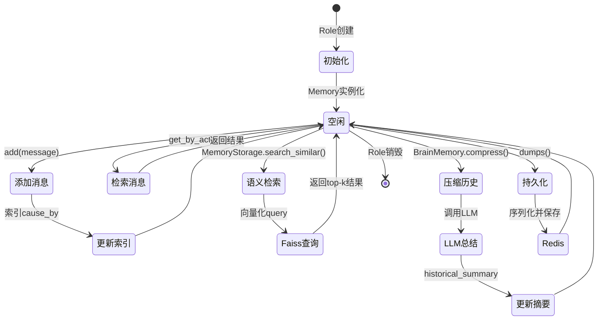

**关键状态说明**：
- **初始化**：创建空的storage和index
- **添加消息**：新消息追加到storage，同时更新cause_by索引
- **检索消息**：根据action类型从索引快速查找
- **语义检索**：通过向量相似度在长期记忆中搜索
- **压缩历史**：当Token数超过阈值时，调用LLM生成摘要
- **持久化**：序列化到Redis或文件系统

### 1.4 架构图

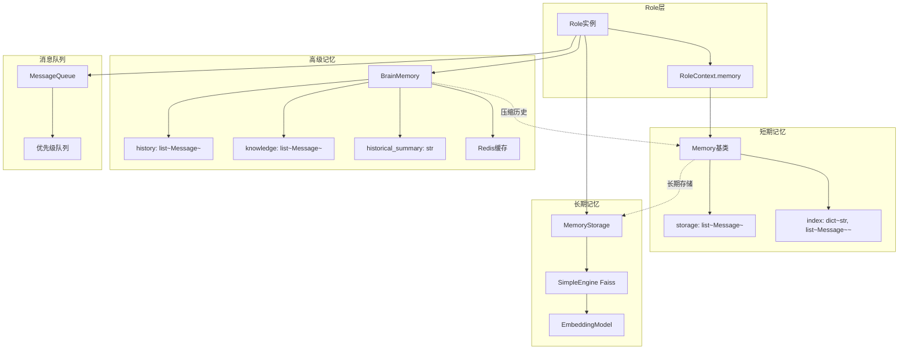

**架构说明**：
- **Memory**：基础短期记忆，O(1)追加，O(n)查询，适合单轮对话
- **MemoryStorage**：基于Faiss的向量检索，O(log n)查询，适合海量历史检索
- **BrainMemory**：高级记忆管理，支持自动压缩、Redis缓存、知识库整合
- **MessageQueue**：优先级队列，管理待处理消息的调度

**并发边界**：
- Memory本身非线程安全，需在单个Role内串行访问
- MemoryStorage的Faiss索引支持并发读，但写入需加锁
- BrainMemory的Redis操作是异步的，支持并发

**性能边界**：
- Memory存储上限：建议<1000条消息，避免线性查询性能下降
- MemoryStorage容量：Faiss可支持百万级向量，内存占用约4KB/向量
- BrainMemory压缩触发：history长度超过10条或Token超过4000时

## 二、核心数据结构

### 2.1 Message 消息类

```python
class Message(BaseModel):
    id: str = Field(default="", validate_default=True)  # 唯一标识符
    content: str  # 自然语言内容
    instruct_content: Optional[BaseModel] = Field(default=None)  # 结构化指令
    role: str = "user"  # system / user / assistant
    cause_by: str = Field(default="", validate_default=True)  # 触发该消息的Action类名
    sent_from: str = Field(default="", validate_default=True)  # 发送者角色名
    send_to: set[str] = Field(default={MESSAGE_ROUTE_TO_ALL})  # 接收者集合
    metadata: Dict[str, Any] = Field(default_factory=dict)  # 扩展元数据
    
    @field_validator("id", mode="before")
    @classmethod
    def check_id(cls, id: str) -> str:
        return id if id else uuid.uuid4().hex
    
    @field_validator("cause_by", mode="before")
    @classmethod
    def check_cause_by(cls, cause_by: Any) -> str:
        return any_to_str(cause_by if cause_by else UserRequirement)
    
    def to_dict(self) -> dict:
        # 转换为LLM可用的格式
        return {"role": self.role, "content": self.content}
```

**类图**：

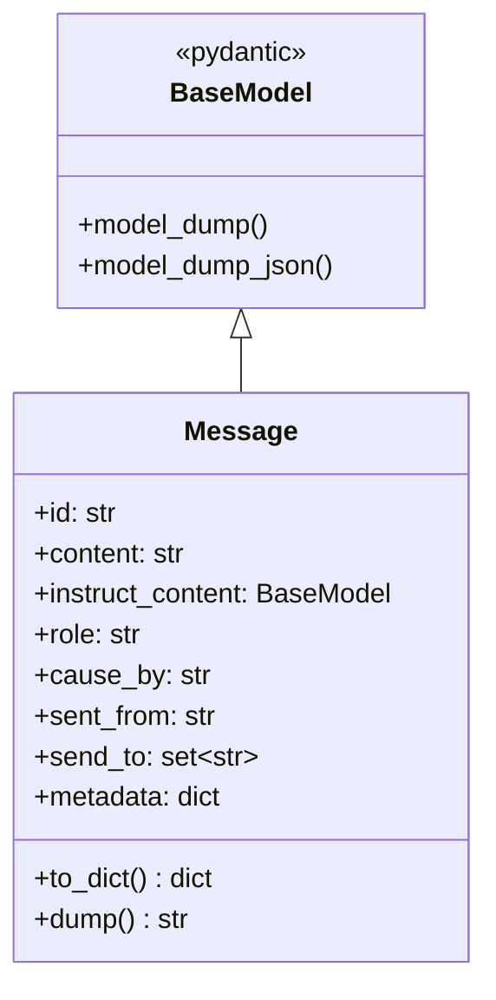

**字段语义**：

| 字段 | 类型 | 必填 | 默认值 | 约束 | 说明 |
|-----|------|-----|--------|-----|------|
| id | str | 否 | UUID | 唯一 | 消息唯一标识符，用于去重 |
| content | str | 是 | - | 非空 | 自然语言文本内容 |
| instruct_content | BaseModel | 否 | None | - | 结构化指令（如JSON schema） |
| role | str | 否 | "user" | system/user/assistant | LLM对话角色 |
| cause_by | str | 否 | UserRequirement | Action类名 | 触发该消息的动作，用于索引 |
| sent_from | str | 否 | "" | Role名称 | 发送者角色 |
| send_to | set[str] | 否 | {"<all>"} | Role名称集合 | 接收者角色，"<all>"表示广播 |
| metadata | dict | 否 | {} | - | 扩展字段（如images、timestamp） |

**版本演进**：
- v0.1：仅包含content和role
- v0.3：新增cause_by和send_to，支持消息路由
- v0.5：新增instruct_content，支持结构化输出
- v0.7：新增metadata，支持多模态扩展

### 2.2 Memory 短期记忆类

```python
class Memory(BaseModel):
    storage: list[Message] = []
    index: DefaultDict[str, list[Message]] = Field(default_factory=lambda: defaultdict(list))
    ignore_id: bool = False
    
    def add(self, message: Message):
        # 添加消息到storage，更新cause_by索引
        if self.ignore_id:
            message.id = IGNORED_MESSAGE_ID
        if message in self.storage:
            return
        self.storage.append(message)
        if message.cause_by:
            self.index[message.cause_by].append(message)
    
    def get_by_action(self, action) -> list[Message]:
        # 按动作类型检索
        index = any_to_str(action)
        return self.index[index]
    
    def get(self, k=0) -> list[Message]:
        # 获取最近k条消息，k=0时返回全部
        return self.storage[-k:]
    
    def find_news(self, observed: list[Message], k=0) -> list[Message]:
        # 查找新消息（previously unseen）
        already_observed = self.get(k)
        news = [msg for msg in observed if msg not in already_observed]
        return news
    
    def clear(self):
        self.storage = []
        self.index = defaultdict(list)
```

**类图**：

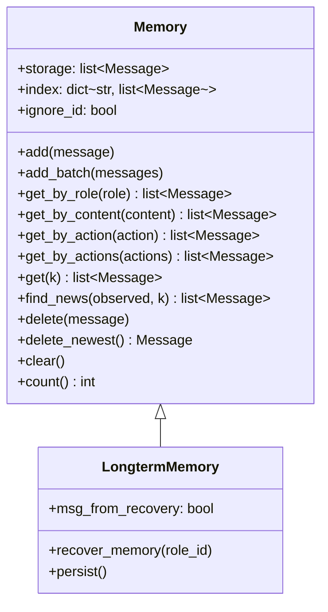

**索引结构**：
```
index = {
    "WritePRD": [Message1, Message5, Message8],
    "WriteDesign": [Message2, Message9],
    "WriteCode": [Message3, Message4, Message6, Message7],
}
```

**复杂度分析**：
- `add()`：O(1) 追加
- `get_by_action()`：O(1) 索引查找
- `get_by_role()`：O(n) 线性扫描
- `find_news()`：O(n*m) 双重循环（n=observed长度，m=storage长度）

### 2.3 MemoryStorage 长期记忆存储

```python
class MemoryStorage:
    def __init__(self, mem_ttl: int = MEM_TTL, embedding: BaseEmbedding = None):
        self.role_id: str = None
        self.role_mem_path: Path = None
        self.mem_ttl: int = mem_ttl
        self.threshold: float = 0.1  # 相似度阈值
        self._initialized: bool = False
        self.embedding = embedding or get_embedding()
        self.faiss_engine = None
    
    def recover_memory(self, role_id: str) -> list[Message]:
        # 从磁盘恢复记忆
        self.role_id = role_id
        self.role_mem_path = Path(DATA_PATH / f"role_mem/{role_id}/")
        self.role_mem_path.mkdir(parents=True, exist_ok=True)
        
        if self.role_mem_path.joinpath("default__vector_store.json").exists():
            # 加载已有索引
            self.faiss_engine = SimpleEngine.from_index(
                index_config=FAISSIndexConfig(persist_path=self.role_mem_path),
                retriever_configs=[FAISSRetrieverConfig()],
                embed_model=self.embedding,
            )
        else:
            # 创建新索引
            self.faiss_engine = SimpleEngine.from_objs(
                objs=[], 
                retriever_configs=[FAISSRetrieverConfig()],
                embed_model=self.embedding
            )
        self._initialized = True
    
    def add(self, message: Message) -> bool:
        # 添加消息到向量库
        self.faiss_engine.add_objs([message])
    
    async def search_similar(self, message: Message, k=4) -> list[Message]:
        # 语义相似度检索
        resp = await self.faiss_engine.aretrieve(message.content)
        filtered = [
            item.metadata.get("obj")
            for item in resp
            if item.score < self.threshold
        ]
        return filtered
    
    def persist(self):
        # 持久化到磁盘
        if self.faiss_engine:
            self.faiss_engine.retriever._index.storage_context.persist(self.role_mem_path)
```

**存储结构**：
```
DATA_PATH/role_mem/{role_id}/
├── default__vector_store.json  # Faiss索引文件
├── docstore.json               # 文档存储
└── index_store.json            # 元数据
```

**向量化流程**：


### 2.4 BrainMemory 高级记忆管理

```python
class BrainMemory(BaseModel):
    history: List[Message] = Field(default_factory=list)
    knowledge: List[Message] = Field(default_factory=list)
    historical_summary: str = ""
    last_history_id: str = ""
    is_dirty: bool = False
    last_talk: Optional[str] = None
    cacheable: bool = True
    llm: Optional[BaseLLM] = Field(default=None, exclude=True)
    
    def add_talk(self, msg: Message):
        msg.role = "user"
        self.add_history(msg)
        self.is_dirty = True
    
    def add_answer(self, msg: Message):
        msg.role = "assistant"
        self.add_history(msg)
        self.is_dirty = True
    
    async def compress_history(self, redis_key: str):
        # 压缩历史对话
        if len(self.history) < 10:
            return
        
        prompt = self._generate_summary_prompt(self.history)
        summary = await self.llm.aask(prompt)
        await self.set_history_summary(summary, redis_key)
    
    async def loads(self, redis_key: str) -> "BrainMemory":
        # 从Redis加载
        redis = Redis(self.config.redis)
        v = await redis.get(key=redis_key)
        if v:
            bm = BrainMemory.parse_raw(v)
            bm.is_dirty = False
            return bm
        return BrainMemory()
    
    async def dumps(self, redis_key: str, timeout_sec: int = 1800):
        # 保存到Redis
        if not self.is_dirty:
            return
        redis = Redis(self.config.redis)
        v = self.model_dump_json()
        if self.cacheable:
            await redis.set(key=redis_key, data=v, timeout_sec=timeout_sec)
        self.is_dirty = False
```

**类图**：

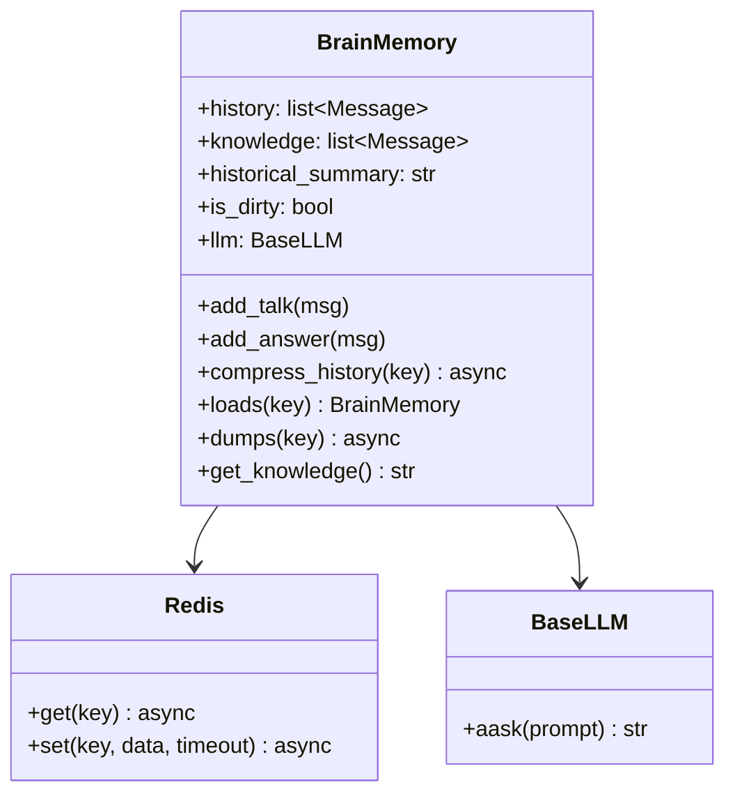

### 2.5 MessageQueue 消息队列

```python
class MessageQueue(BaseModel):
    _queue: list[Message] = PrivateAttr(default_factory=list)
    
    def push(self, message: Message):
        # 添加消息到队列
        if message in self._queue:
            return
        self._queue.append(message)
    
    def pop(self) -> Optional[Message]:
        # 弹出最早的消息
        if self._queue:
            return self._queue.pop(0)
        return None
    
    def pop_all(self) -> list[Message]:
        # 弹出所有消息
        messages = self._queue.copy()
        self._queue.clear()
        return messages
    
    def empty(self) -> bool:
        return len(self._queue) == 0
    
    def count(self) -> int:
        return len(self._queue)
```

## 三、核心API详解

### 3.1 Memory.add - 添加消息

#### 基本信息
- **名称**：`Memory.add`
- **位置**：`metagpt/memory/memory.py`
- **协议**：同步方法
- **幂等性**：是（重复添加相同消息会被忽略）

#### 请求结构体
```python
def add(self, message: Message):
    pass
```

| 参数 | 类型 | 必填 | 默认 | 约束 | 说明 |
|-----|------|-----|------|-----|------|
| message | Message | 是 | - | 有效的Message对象 | 待添加的消息 |

#### 核心代码
```python
def add(self, message: Message):
    # 1) 处理ignore_id模式
    if self.ignore_id:
        message.id = IGNORED_MESSAGE_ID
    
    # 2) 去重检查
    if message in self.storage:
        return
    
    # 3) 追加到storage
    self.storage.append(message)
    
    # 4) 更新cause_by索引
    if message.cause_by:
        self.index[message.cause_by].append(message)
```

**调用链上游**：
```python
# metagpt/roles/role.py
class Role:
    async def _act(self) -> Message:
        response = await self.rc.todo.run(self.rc.history)
        msg = Message(
            content=response,
            role=self.profile,
            cause_by=type(self.rc.todo),
            sent_from=self.name,
        )
        self.rc.memory.add(msg)  # 添加到记忆
        return msg
```

#### 时序图

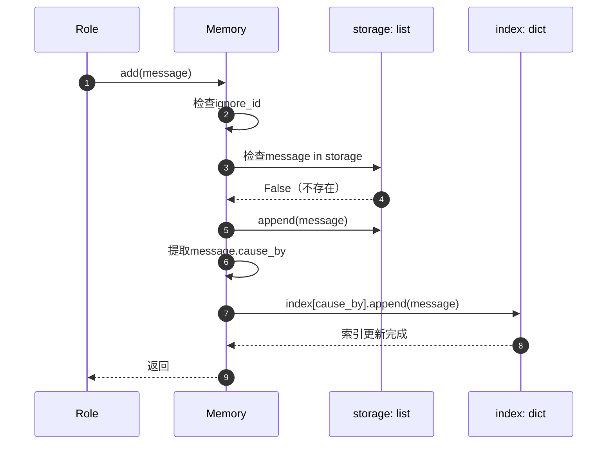

#### 异常与性能
- **错误处理**：
  - 重复消息：静默忽略，不抛异常
  - message为None：会抛出AttributeError（建议调用方校验）
- **性能要点**：
  - 时间复杂度：O(1) 追加，O(n) 去重检查（基于`__eq__`）
  - 空间复杂度：O(n) 额外索引开销
  - 无锁机制，非线程安全
- **优化建议**：
  - 避免频繁去重检查：设置`ignore_id=True`并在上层保证唯一性
  - 定期清理：当storage超过1000条时调用`clear()`

### 3.2 Memory.get_by_action - 按动作检索

#### 基本信息
- **名称**：`Memory.get_by_action`
- **位置**：`metagpt/memory/memory.py`
- **协议**：同步方法
- **幂等性**：是

#### 请求结构体
```python
def get_by_action(self, action) -> list[Message]:
    pass
```

| 参数 | 类型 | 必填 | 默认 | 约束 | 说明 |
|-----|------|-----|------|-----|------|
| action | Action 或 str | 是 | - | Action类或类名 | 要查询的动作类型 |

#### 响应结构体
```python
返回值: list[Message]  # 该动作触发的所有消息
```

#### 核心代码
```python
def get_by_action(self, action) -> list[Message]:
    # 1) 转换action为字符串索引
    index = any_to_str(action)
    
    # 2) 从索引中查找
    return self.index[index]

# 工具函数
def any_to_str(obj: Any) -> str:
    if isinstance(obj, str):
        return obj
    elif isinstance(obj, type):
        return f"{obj.__module__}.{obj.__name__}"
    else:
        return f"{obj.__class__.__module__}.{obj.__class__.__name__}"
```

**调用链上游**：
```python
# metagpt/roles/role.py
class Role:
    async def _think(self) -> bool:
        # 查找WritePRD动作产生的消息
        prd_messages = self.rc.memory.get_by_action(WritePRD)
        
        if prd_messages:
            # 有PRD，执行下一步WriteDesign
            self.rc.todo = WriteDesign()
        return True
```

#### 时序图

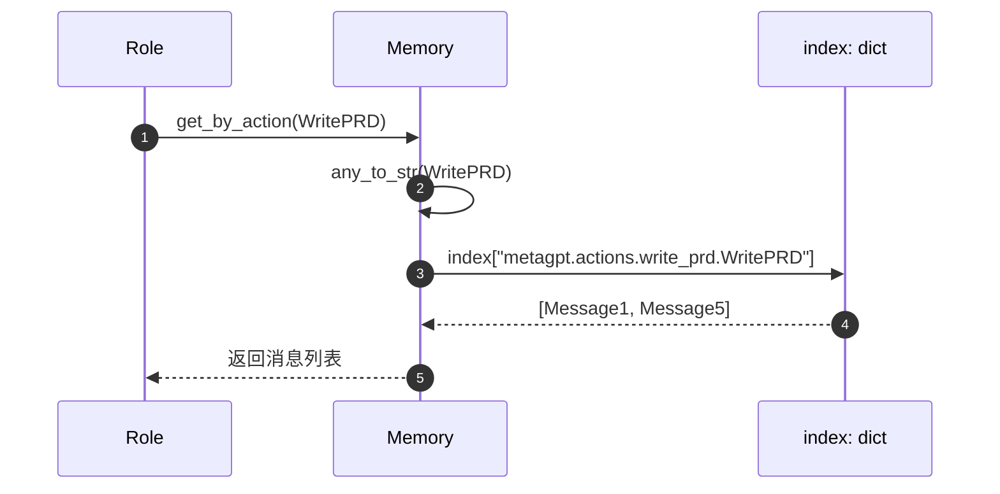

#### 异常与性能
- **错误处理**：
  - action不在索引中：返回空列表（不抛异常）
  - action为None：会抛出TypeError
- **性能要点**：
  - 时间复杂度：O(1) 哈希查找
  - 空间复杂度：索引占用额外O(n)空间
- **使用建议**：
  - 适合查询特定动作的输出
  - 若需跨多个动作查询，使用`get_by_actions()`批量查询

### 3.3 MemoryStorage.search_similar - 语义检索

#### 基本信息
- **名称**：`MemoryStorage.search_similar`
- **位置**：`metagpt/memory/memory_storage.py`
- **协议**：异步方法
- **幂等性**：是

#### 请求结构体
```python
async def search_similar(self, message: Message, k=4) -> list[Message]:
    pass
```

| 参数 | 类型 | 必填 | 默认 | 约束 | 说明 |
|-----|------|-----|------|-----|------|
| message | Message | 是 | - | content非空 | 查询消息 |
| k | int | 否 | 4 | >0 | 返回top-k个最相似结果 |

#### 响应结构体
```python
返回值: list[Message]  # 语义相似的历史消息（按相似度降序）
```

#### 核心代码
```python
async def search_similar(self, message: Message, k=4) -> list[Message]:
    # 1) 调用Faiss引擎检索
    resp = await self.faiss_engine.aretrieve(message.content)
    
    # 2) 过滤低相似度结果
    filtered_resp = []
    for item in resp:
        if item.score < self.threshold:  # 相似度阈值0.1（距离越小越相似）
            filtered_resp.append(item.metadata.get("obj"))
    
    return filtered_resp
```

**底层实现**：
```python
# metagpt/rag/engines/simple.py
class SimpleEngine:
    async def aretrieve(self, query: str) -> list[NodeWithScore]:
        # 1) 向量化query
        query_embedding = await self.embed_model.aget_embedding(query)
        
        # 2) Faiss近似最近邻搜索
        distances, indices = self.faiss_index.search(
            np.array([query_embedding]), 
            k=self.top_k
        )
        
        # 3) 组装结果
        results = []
        for dist, idx in zip(distances[0], indices[0]):
            node = self.docstore.get_node(idx)
            results.append(NodeWithScore(node=node, score=dist))
        
        return results
```

#### 时序图

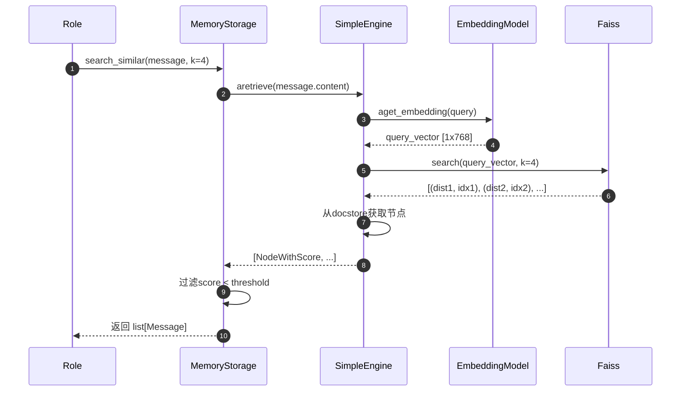

#### 异常与性能
- **错误处理**：
  - 未初始化（faiss_engine为None）：抛出AttributeError
  - message.content为空：Embedding模型可能返回零向量
- **性能要点**：
  - 时间复杂度：O(log n) Faiss索引查询
  - 内存占用：约4KB/条消息（768维float32向量）
  - 首次查询较慢（需加载索引），后续查询快速
- **优化建议**：
  - 定期重建索引：当新增消息超过1000条时
  - 调整threshold：根据实际召回率调整（默认0.1较严格）
  - 使用GPU加速：Faiss支持GPU索引

### 3.4 BrainMemory.compress_history - 历史压缩

#### 基本信息
- **名称**：`BrainMemory.compress_history`
- **位置**：`metagpt/memory/brain_memory.py`
- **协议**：异步方法
- **幂等性**：否（每次调用可能生成不同摘要）

#### 请求结构体
```python
async def compress_history(self, redis_key: str):
    pass
```

| 参数 | 类型 | 必填 | 默认 | 约束 | 说明 |
|-----|------|-----|------|-----|------|
| redis_key | str | 是 | - | 非空 | Redis缓存键 |

#### 核心代码
```python
async def compress_history(self, redis_key: str):
    # 1) 判断是否需要压缩
    if len(self.history) < 10:
        return
    
    # 2) 生成摘要提示词
    prompt = self._generate_summary_prompt(self.history)
    
    # 3) 调用LLM生成摘要
    summary = await self.llm.aask(prompt)
    
    # 4) 更新摘要并清空history
    await self.set_history_summary(summary, redis_key)

def _generate_summary_prompt(self, history: list[Message]) -> str:
    context = "\n".join([
        f"{msg.role}: {msg.content}"
        for msg in history
    ])
    
    return f"""请总结以下对话的核心要点（控制在300字以内）：

{context}

摘要："""

async def set_history_summary(self, history_summary: str, redis_key: str):
    if self.historical_summary == history_summary:
        if self.is_dirty:
            await self.dumps(redis_key=redis_key)
        return
    
    self.historical_summary = history_summary
    self.history = []  # 清空已压缩的历史
    await self.dumps(redis_key=redis_key)
```

**调用链上游**：
```python
# metagpt/roles/assistant.py
class Assistant(Role):
    async def _act(self) -> Message:
        # 执行动作前检查是否需要压缩
        if len(self.rc.memory.history) > 10:
            await self.brain_memory.compress_history(redis_key=self.redis_key)
        
        # （此处省略动作执行）
```

#### 时序图

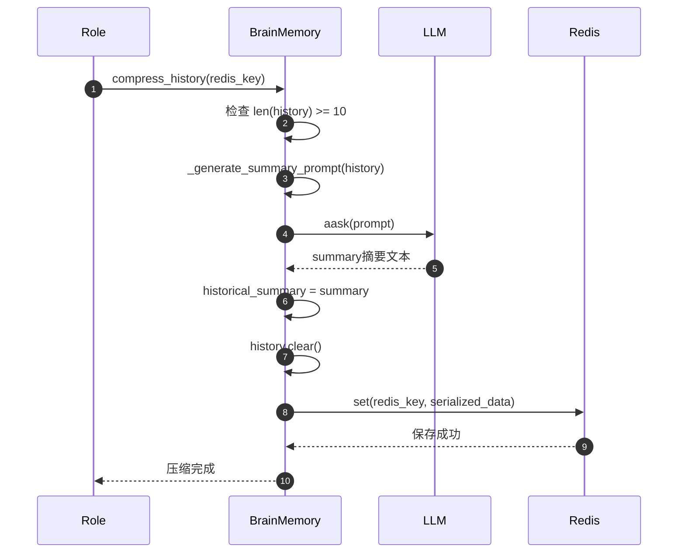

#### 异常与性能
- **错误处理**：
  - LLM调用失败：会抛出异常，建议捕获并降级（保留原始history）
  - Redis写入失败：仅影响持久化，不影响内存状态
- **性能要点**：
  - 压缩成本：单次LLM调用约1000 tokens（输入）+ 300 tokens（输出）
  - 触发频率：建议每10条消息或4000 tokens触发一次
  - 摘要质量：依赖LLM能力，GPT-4效果最佳
- **最佳实践**：
  - 设置max_token限制摘要长度
  - 保留原始history的备份（可选）
  - 在摘要中标注时间范围

### 3.5 MessageQueue.pop - 弹出消息

#### 基本信息
- **名称**：`MessageQueue.pop`
- **位置**：`metagpt/schema.py`
- **协议**：同步方法
- **幂等性**：否（每次调用弹出不同消息）

#### 请求结构体
```python
def pop(self) -> Optional[Message]:
    pass
```

#### 响应结构体
```python
返回值: Optional[Message]  # 队列最早的消息，队列为空时返回None
```

#### 核心代码
```python
class MessageQueue(BaseModel):
    _queue: list[Message] = PrivateAttr(default_factory=list)
    
    def pop(self) -> Optional[Message]:
        # FIFO策略：弹出最早的消息
        if self._queue:
            return self._queue.pop(0)
        return None
    
    def push(self, message: Message):
        # 去重后追加
        if message in self._queue:
            return
        self._queue.append(message)
```

**调用链上游**：
```python
# metagpt/roles/role.py
class Role:
    async def _observe(self) -> int:
        # 从消息队列中获取新消息
        if not self.rc.msg_buffer.empty():
            news = self.rc.msg_buffer.pop_all()
            self.rc.news = self.rc.memory.find_news(news)
            return len(self.rc.news)
        return 0
```

#### 时序图

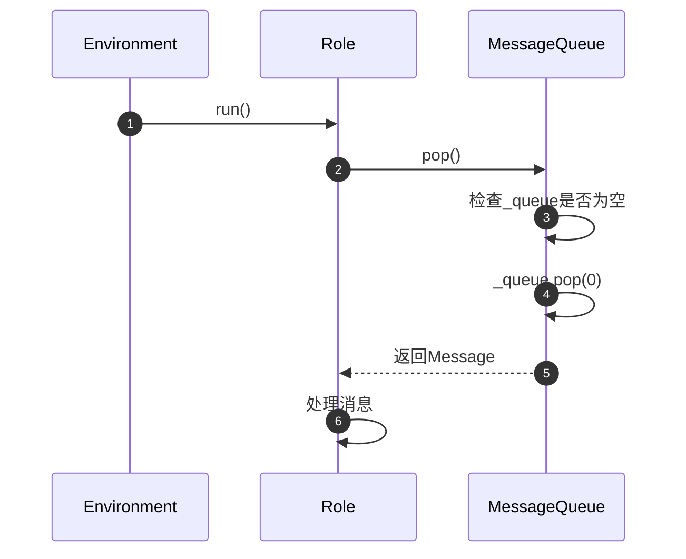

#### 异常与性能
- **错误处理**：
  - 队列为空：返回None（不抛异常）
  - 并发pop：非线程安全，需外部加锁
- **性能要点**：
  - 时间复杂度：O(n) pop(0)需移动后续元素
  - 优化方案：使用`collections.deque`替代list（O(1) popleft）
- **使用建议**：
  - 批量处理时使用`pop_all()`减少调用次数
  - 避免在循环中频繁pop

## 四、关键功能实现

### 4.1 消息索引机制

**功能目标**：快速查找特定动作触发的消息，避免线性扫描。

**实现原理**：
- 使用`defaultdict(list)`建立`cause_by -> [Message]`的倒排索引
- 在`add()`时同步更新索引
- 查询时O(1)直接返回

**核心代码**：
```python
class Memory:
    def __init__(self):
        self.storage = []
        self.index = defaultdict(list)
    
    def add(self, message: Message):
        self.storage.append(message)
        # 更新索引
        if message.cause_by:
            self.index[message.cause_by].append(message)
    
    def get_by_action(self, action) -> list[Message]:
        key = any_to_str(action)
        return self.index[key]
```

**索引维护**：
```python
def delete(self, message: Message):
    self.storage.remove(message)
    # 同步删除索引
    if message.cause_by and message in self.index[message.cause_by]:
        self.index[message.cause_by].remove(message)

def clear(self):
    self.storage = []
    self.index = defaultdict(list)
```

**复杂度对比**：

| 操作 | 无索引 | 有索引 |
|-----|-------|-------|
| 添加消息 | O(1) | O(1) |
| 按action查询 | O(n) | O(1) |
| 按role查询 | O(n) | O(n) 未索引 |
| 删除消息 | O(n) | O(n) |
| 内存占用 | n×msg_size | n×msg_size + idx_size |

### 4.2 长期记忆持久化

**功能目标**：将短期记忆持久化到文件系统，支持跨会话恢复。

**存储格式**：
```
DATA_PATH/
└── role_mem/
    └── {role_id}/
        ├── default__vector_store.json  # Faiss向量索引
        ├── docstore.json               # 原始文档
        └── index_store.json            # 元数据索引
```

**恢复流程**：
```mermaid
flowchart TB
    Start[Role初始化] --> CheckPath{检查role_mem_path}
    CheckPath -->|不存在| CreateNew[创建空索引]
    CheckPath -->|存在| LoadIndex[加载已有索引]
    
    CreateNew --> InitEngine[SimpleEngine.from_objs([])]
    LoadIndex --> InitEngine2[SimpleEngine.from_index()]
    
    InitEngine --> Ready[就绪状态]
    InitEngine2 --> Ready
    
    Ready --> AddMsg[add(message)]
    AddMsg --> Persist{需要持久化?}
    Persist -->|是| SaveIndex[persist()]
    Persist -->|否| Ready
```

**核心代码**：
```python
class MemoryStorage:
    def recover_memory(self, role_id: str):
        self.role_id = role_id
        self.role_mem_path = Path(DATA_PATH / f"role_mem/{role_id}/")
        self.role_mem_path.mkdir(parents=True, exist_ok=True)
        
        vector_store_path = self.role_mem_path / "default__vector_store.json"
        
        if vector_store_path.exists():
            # 恢复已有记忆
            self.faiss_engine = SimpleEngine.from_index(
                index_config=FAISSIndexConfig(persist_path=self.role_mem_path),
                retriever_configs=[FAISSRetrieverConfig()],
                embed_model=self.embedding,
            )
        else:
            # 创建新记忆
            self.faiss_engine = SimpleEngine.from_objs(
                objs=[],
                retriever_configs=[FAISSRetrieverConfig()],
                embed_model=self.embedding,
            )
        
        self._initialized = True
    
    def persist(self):
        if self.faiss_engine:
            storage_context = self.faiss_engine.retriever._index.storage_context
            storage_context.persist(self.role_mem_path)
```

**增量持久化**：
```python
class LongtermMemory(Memory):
    def __init__(self):
        super().__init__()
        self.memory_storage = MemoryStorage()
    
    def recover_memory(self, role_id: str):
        # 从磁盘恢复
        messages = self.memory_storage.recover_memory(role_id)
        self.add_batch(messages)
    
    def persist(self):
        # 仅持久化新增消息
        new_messages = [
            msg for msg in self.storage
            if not msg.metadata.get("persisted")
        ]
        
        for msg in new_messages:
            self.memory_storage.add(msg)
            msg.metadata["persisted"] = True
        
        self.memory_storage.persist()
```

### 4.3 语义相似度检索

**功能目标**：基于向量相似度检索历史相关消息，支持模糊匹配。

**技术栈**：
- **Embedding模型**：OpenAI text-embedding-ada-002 或本地模型
- **向量数据库**：Faiss（CPU/GPU）
- **相似度度量**：L2距离（欧氏距离）

**检索流程**：
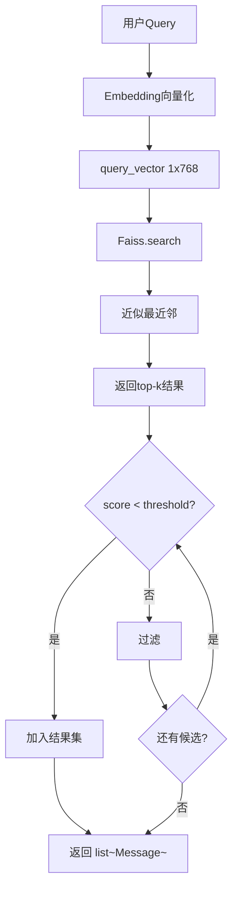

**核心代码**：
```python
async def search_similar(self, message: Message, k=4) -> list[Message]:
    # 1) 调用Faiss引擎
    resp = await self.faiss_engine.aretrieve(message.content)
    
    # 2) 相似度过滤
    filtered = []
    for item in resp:
        # score是L2距离，越小越相似
        if item.score < self.threshold:
            filtered.append(item.metadata.get("obj"))
    
    return filtered[:k]
```

**Faiss索引构建**：
```python
# metagpt/rag/engines/simple.py
def _build_faiss_index(self, docs: list[Document]):
    # 1) 向量化所有文档
    vectors = []
    for doc in docs:
        vector = self.embed_model.get_embedding(doc.content)
        vectors.append(vector)
    
    vectors = np.array(vectors).astype('float32')
    
    # 2) 构建Faiss索引
    dimension = vectors.shape[1]
    index = faiss.IndexFlatL2(dimension)
    index.add(vectors)
    
    return index
```

**性能优化**：
```python
# 使用IVF索引加速查询（适合大规模数据）
def _build_ivf_index(self, vectors: np.ndarray):
    dimension = vectors.shape[1]
    nlist = 100  # 聚类中心数
    quantizer = faiss.IndexFlatL2(dimension)
    index = faiss.IndexIVFFlat(quantizer, dimension, nlist)
    
    # 训练
    index.train(vectors)
    # 添加向量
    index.add(vectors)
    # 设置探测的聚类数
    index.nprobe = 10
    
    return index
```

### 4.4 Redis缓存集成

**功能目标**：将BrainMemory缓存到Redis，加速跨请求访问。

**缓存策略**：
- **写策略**：Write-through（同步写入Redis）
- **失效策略**：TTL过期（默认30分钟）
- **一致性**：通过`is_dirty`标志判断是否需要写入

**核心代码**：
```python
class BrainMemory:
    async def loads(self, redis_key: str) -> "BrainMemory":
        redis = Redis(self.config.redis)
        v = await redis.get(key=redis_key)
        
        if v:
            # 从Redis反序列化
            bm = BrainMemory.parse_raw(v)
            bm.is_dirty = False
            return bm
        
        # 缓存未命中，返回空实例
        return BrainMemory()
    
    async def dumps(self, redis_key: str, timeout_sec: int = 1800):
        if not self.is_dirty:
            return  # 无变更，跳过
        
        redis = Redis(self.config.redis)
        v = self.model_dump_json()
        
        if self.cacheable:
            await redis.set(key=redis_key, data=v, timeout_sec=timeout_sec)
        
        self.is_dirty = False
    
    @staticmethod
    def to_redis_key(prefix: str, user_id: str, chat_id: str):
        return f"{prefix}:{user_id}:{chat_id}"
```

**使用示例**：
```python
# 加载缓存
redis_key = BrainMemory.to_redis_key("assistant", user_id="alice", chat_id="session_123")
brain_memory = await BrainMemory().loads(redis_key)

# 修改数据
brain_memory.add_talk(Message(content="你好"))
brain_memory.add_answer(Message(content="你好，有什么可以帮您？"))

# 保存缓存
await brain_memory.dumps(redis_key, timeout_sec=1800)
```

**缓存key设计**：
```
{prefix}:{user_id}:{chat_id}

示例：
- assistant:alice:session_123
- chatbot:bob:conv_456
```

**Redis配置**：
```yaml
# config2.yaml
redis:
  host: localhost
  port: 6379
  db: 0
  password: null
```

### 4.5 消息去重机制

**功能目标**：避免重复添加相同消息，节省内存和索引开销。

**去重策略**：
1. **基于`id`**：Message.id唯一标识符（UUID）
2. **基于内容**：重写`__eq__`方法比较关键字段
3. **ignore_id模式**：统一id为固定值，强制使用内容去重

**实现代码**：
```python
# metagpt/schema.py
class Message(BaseModel):
    id: str = Field(default="", validate_default=True)
    
    @field_validator("id", mode="before")
    @classmethod
    def check_id(cls, id: str) -> str:
        return id if id else uuid.uuid4().hex
    
    def __eq__(self, other: "Message"):
        # 比较id和content
        if self.id != IGNORED_MESSAGE_ID and other.id != IGNORED_MESSAGE_ID:
            return self.id == other.id
        else:
            return self.content == other.content
    
    def __hash__(self):
        return hash((self.id, self.content))
```

**Memory去重**：
```python
class Memory:
    def add(self, message: Message):
        if self.ignore_id:
            message.id = IGNORED_MESSAGE_ID
        
        # 去重检查
        if message in self.storage:
            return
        
        self.storage.append(message)
```

**性能对比**：

| 去重策略 | 时间复杂度 | 空间复杂度 | 适用场景 |
|---------|----------|-----------|---------|
| 无去重 | O(1) | O(n) | 确保上层无重复 |
| 基于id | O(n) | O(n) | 需要精确去重 |
| 基于content | O(n) | O(n) | 允许同id不同内容 |
| 使用set | O(1) | O(n) | 需要高效去重 |

**优化方案**：
```python
class Memory:
    def __init__(self):
        self.storage = []
        self.index = defaultdict(list)
        self._id_set = set()  # 维护id集合
    
    def add(self, message: Message):
        if message.id in self._id_set:
            return
        
        self.storage.append(message)
        self._id_set.add(message.id)
        
        if message.cause_by:
            self.index[message.cause_by].append(message)
```

## 五、最佳实践

### 5.1 何时使用不同类型的记忆

**决策树**：
```mermaid
flowchart TB
    Start{记忆需求} --> SessionBased{会话级别}
    Start --> LongTerm{长期存储}
    Start --> Semantic{语义检索}
    
    SessionBased --> ShortHistory{消息数<100}
    ShortHistory -->|是| UseMemory[使用Memory]
    ShortHistory -->|否| Compress{需要压缩}
    Compress -->|是| UseBrain[使用BrainMemory]
    Compress -->|否| SplitSession[拆分会话]
    
    LongTerm --> NeedSearch{需要检索}
    NeedSearch -->|是| UseStorage[使用MemoryStorage]
    NeedSearch -->|否| UsePersist[使用persist()]
    
    Semantic --> VectorSearch[使用MemoryStorage]
```

**推荐配置**：

| 场景 | 推荐方案 | 理由 |
|-----|---------|------|
| 单轮对话 | Memory | 轻量，无持久化需求 |
| 多轮对话（<10轮） | Memory | 内存开销小，查询快 |
| 长对话（10-100轮） | BrainMemory | 支持压缩和缓存 |
| 跨会话记忆 | MemoryStorage | 向量检索，语义匹配 |
| 知识库问答 | MemoryStorage + BrainMemory | 结合检索和压缩 |

### 5.2 记忆压缩策略

**触发条件**：
```python
def should_compress(memory: BrainMemory) -> bool:
    # 条件1：消息数超过阈值
    if len(memory.history) > 10:
        return True
    
    # 条件2：Token数超过阈值
    total_tokens = sum(
        len(msg.content) / 4  # 粗略估算
        for msg in memory.history
    )
    if total_tokens > 4000:
        return True
    
    return False
```

**压缩提示词模板**：
```python
SUMMARY_PROMPT = """请总结以下对话的核心要点，保留关键信息：

{conversation_history}

要求：
1. 提取主要话题和决策
2. 保留未完成的任务
3. 控制在300字以内
4. 使用第三人称描述

摘要："""
```

**分级压缩**：
```python
class HierarchicalCompression:
    async def compress(self, history: list[Message]):
        # Level 1: 每10条压缩一次
        if len(history) % 10 == 0:
            chunk = history[-10:]
            summary_l1 = await self.llm.aask(
                self._gen_prompt(chunk)
            )
            self.summaries_l1.append(summary_l1)
        
        # Level 2: 每100条压缩Level 1摘要
        if len(self.summaries_l1) >= 10:
            summary_l2 = await self.llm.aask(
                self._gen_prompt(self.summaries_l1)
            )
            self.summaries_l2.append(summary_l2)
            self.summaries_l1.clear()
```

### 5.3 性能优化建议

**1. 索引优化**
```python
class FastMemory(Memory):
    def __init__(self):
        super().__init__()
        # 多索引
        self.role_index = defaultdict(list)
        self.time_index = []
    
    def add(self, message: Message):
        super().add(message)
        # 更新role索引
        self.role_index[message.role].append(message)
        # 时间索引（自动排序）
        self.time_index.append((message.metadata.get("timestamp"), message))
    
    def get_by_role(self, role: str) -> list[Message]:
        return self.role_index[role]  # O(1)
```

**2. 批量操作**
```python
# 不推荐：逐条添加
for msg in messages:
    memory.add(msg)

# 推荐：批量添加
memory.add_batch(messages)
```

**3. 延迟持久化**
```python
class LazyPersistMemory:
    def __init__(self):
        self.memory = Memory()
        self.dirty_count = 0
        self.persist_threshold = 100
    
    def add(self, message: Message):
        self.memory.add(message)
        self.dirty_count += 1
        
        # 每100条消息持久化一次
        if self.dirty_count >= self.persist_threshold:
            self.persist()
            self.dirty_count = 0
```

**4. 缓存热点消息**
```python
from functools import lru_cache

class CachedMemory(Memory):
    @lru_cache(maxsize=128)
    def get_by_action(self, action: str) -> list[Message]:
        return super().get_by_action(action)
```

### 5.4 故障恢复

**场景1：Redis缓存失效**
```python
async def load_with_fallback(redis_key: str, backup_path: Path):
    try:
        # 尝试从Redis加载
        brain = await BrainMemory().loads(redis_key)
        if brain.history:
            return brain
    except Exception as e:
        logger.warning(f"Redis load failed: {e}")
    
    # 降级到文件系统
    if backup_path.exists():
        with open(backup_path) as f:
            data = json.load(f)
            return BrainMemory(**data)
    
    return BrainMemory()
```

**场景2：Faiss索引损坏**
```python
def recover_faiss_index(role_id: str):
    storage = MemoryStorage()
    try:
        storage.recover_memory(role_id)
    except Exception as e:
        logger.error(f"Faiss index corrupted: {e}")
        
        # 清理损坏的索引
        storage.clean()
        
        # 从备份重建
        backup_messages = load_backup_messages(role_id)
        for msg in backup_messages:
            storage.add(msg)
        
        storage.persist()
```

**场景3：内存溢出**
```python
class BoundedMemory(Memory):
    def __init__(self, max_size: int = 1000):
        super().__init__()
        self.max_size = max_size
    
    def add(self, message: Message):
        if len(self.storage) >= self.max_size:
            # 删除最旧的消息
            oldest = self.delete_newest()
            logger.warning(f"Memory overflow, removed: {oldest.id}")
        
        super().add(message)
```

### 5.5 调试技巧

**1. 打印记忆内容**
```python
def debug_memory(memory: Memory):
    print(f"Total messages: {memory.count()}")
    print(f"Index keys: {list(memory.index.keys())}")
    
    for action, msgs in memory.index.items():
        print(f"\n{action}: {len(msgs)} messages")
        for msg in msgs[:3]:  # 仅打印前3条
            print(f"  - {msg.role}: {msg.content[:50]}...")
```

**2. 导出记忆快照**
```python
def export_memory(memory: Memory, path: Path):
    snapshot = {
        "timestamp": datetime.now().isoformat(),
        "count": memory.count(),
        "messages": [
            {
                "id": msg.id,
                "role": msg.role,
                "content": msg.content,
                "cause_by": msg.cause_by,
            }
            for msg in memory.storage
        ]
    }
    
    with open(path, "w") as f:
        json.dump(snapshot, f, indent=2, ensure_ascii=False)
```

**3. 可视化消息流**
```python
def visualize_message_flow(memory: Memory):
    import networkx as nx
    import matplotlib.pyplot as plt
    
    G = nx.DiGraph()
    
    for msg in memory.storage:
        G.add_node(msg.id, label=msg.cause_by)
        
        # 根据send_to添加边
        for target in msg.send_to:
            if target != MESSAGE_ROUTE_TO_ALL:
                G.add_edge(msg.sent_from, target)
    
    nx.draw(G, with_labels=True)
    plt.show()
```

## 六、常见问题

### Q1: 如何选择Embedding模型？

**考虑因素**：
- **性能**：OpenAI ada-002（维度1536）> 本地模型（768）
- **成本**：本地模型免费，OpenAI按调用量计费
- **中文支持**：优先选择m3e、text2vec-chinese等本地模型

**配置示例**：
```python
# OpenAI Embedding
from metagpt.utils.embedding import get_embedding
embedding = get_embedding()  # 默认ada-002

# 本地Embedding
from llama_index.embeddings.huggingface import HuggingFaceEmbedding
embedding = HuggingFaceEmbedding(model_name="BAAI/bge-small-zh-v1.5")
```

### Q2: Memory和MemoryStorage如何配合使用？

**推荐模式**：
```python
class HybridMemory:
    def __init__(self):
        self.short_term = Memory()  # 短期（当前会话）
        self.long_term = MemoryStorage()  # 长期（跨会话）
    
    def add(self, message: Message):
        # 短期记忆立即可用
        self.short_term.add(message)
        
        # 长期记忆异步添加（避免阻塞）
        asyncio.create_task(self._add_to_long_term(message))
    
    async def _add_to_long_term(self, message: Message):
        self.long_term.add(message)
        
        # 定期持久化
        if self.short_term.count() % 10 == 0:
            self.long_term.persist()
    
    async def search(self, query: str) -> list[Message]:
        # 先查短期记忆
        recent = self.short_term.try_remember(query)
        
        # 再查长期记忆
        similar = await self.long_term.search_similar(
            Message(content=query), k=5
        )
        
        # 合并去重
        return list(set(recent + similar))
```

### Q3: 如何处理大规模消息（10万+）？

**方案1：分片存储**
```python
class ShardedMemoryStorage:
    def __init__(self, num_shards: int = 10):
        self.shards = [
            MemoryStorage() for _ in range(num_shards)
        ]
    
    def _get_shard(self, message: Message) -> MemoryStorage:
        # 基于消息id哈希分片
        shard_id = hash(message.id) % len(self.shards)
        return self.shards[shard_id]
    
    def add(self, message: Message):
        shard = self._get_shard(message)
        shard.add(message)
    
    async def search_similar(self, message: Message, k=4):
        # 并发查询所有分片
        tasks = [
            shard.search_similar(message, k=k)
            for shard in self.shards
        ]
        results = await asyncio.gather(*tasks)
        
        # 合并结果并重新排序
        all_results = []
        for shard_results in results:
            all_results.extend(shard_results)
        
        return sorted(all_results, key=lambda x: x.score)[:k]
```

**方案2：时间窗口清理**
```python
def cleanup_old_messages(memory: Memory, days: int = 30):
    cutoff = datetime.now() - timedelta(days=days)
    
    to_remove = [
        msg for msg in memory.storage
        if msg.metadata.get("timestamp", datetime.now()) < cutoff
    ]
    
    for msg in to_remove:
        memory.delete(msg)
```

### Q4: BrainMemory的Redis依赖是否必须？

**答案**：否，Redis是可选的缓存层。

**无Redis模式**：
```python
class BrainMemory:
    async def loads(self, file_path: Path) -> "BrainMemory":
        if file_path.exists():
            with open(file_path) as f:
                data = json.load(f)
                return BrainMemory(**data)
        return BrainMemory()
    
    async def dumps(self, file_path: Path):
        if not self.is_dirty:
            return
        
        with open(file_path, "w") as f:
            json.dump(self.model_dump(), f)
        
        self.is_dirty = False
```

### Q5: 如何实现消息优先级队列？

**实现方案**：
```python
import heapq
from dataclasses import dataclass, field

@dataclass(order=True)
class PrioritizedMessage:
    priority: int
    message: Message = field(compare=False)

class PriorityMessageQueue:
    def __init__(self):
        self._queue = []
    
    def push(self, message: Message, priority: int = 0):
        item = PrioritizedMessage(priority, message)
        heapq.heappush(self._queue, item)
    
    def pop(self) -> Optional[Message]:
        if self._queue:
            return heapq.heappop(self._queue).message
        return None
```

**使用示例**：
```python
queue = PriorityMessageQueue()
queue.push(Message(content="普通消息"), priority=5)
queue.push(Message(content="紧急消息"), priority=1)  # 数字越小优先级越高
queue.push(Message(content="低优先级"), priority=10)

# 弹出顺序：紧急消息 -> 普通消息 -> 低优先级
msg = queue.pop()
```

---

**文档版本**：v1.0  
**最后更新**：2025-01-XX  
**维护者**：MetaGPT团队

