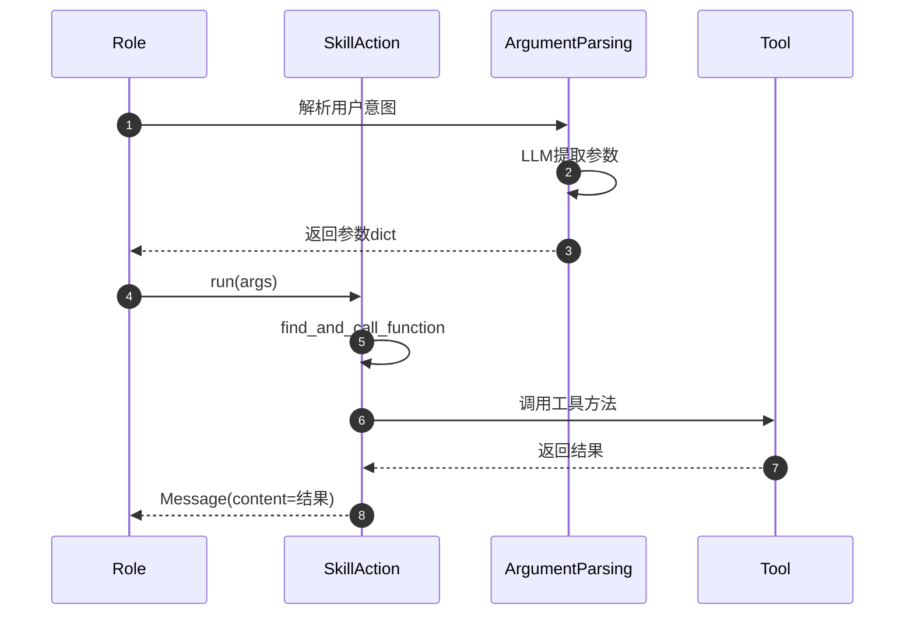
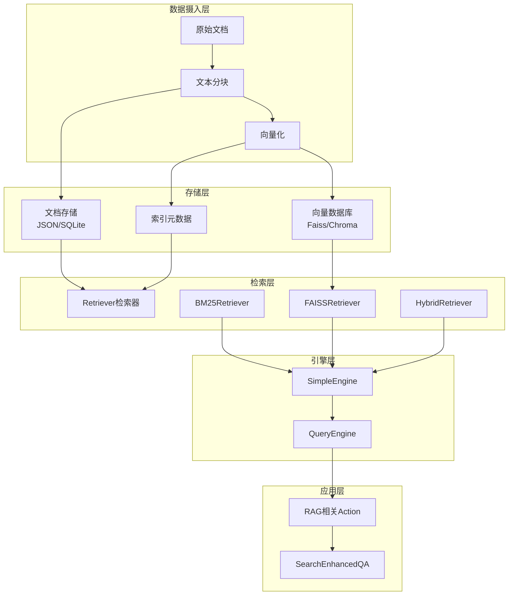
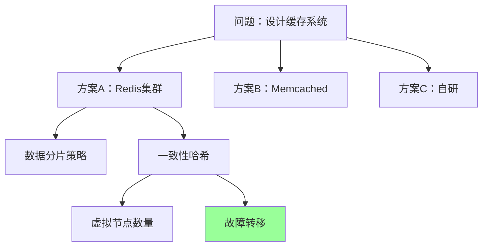

# MetaGPT-06-工具与RAG系统

## 一、工具系统

### 1.1 模块概览

工具系统（Tool System）为Agent提供与外部世界交互的能力，包括文件操作、终端命令、网页爬取、API调用等。MetaGPT采用统一的工具注册机制，支持动态加载和智能推荐。

**核心组件**：
- **ToolRegistry**：全局工具注册表，管理所有可用工具
- **@register_tool装饰器**：声明式工具注册
- **ToolSchema**：工具的schema定义（参数、返回值、描述）
- **ToolRecommender**：基于需求推荐合适的工具
- **SkillAction**：执行工具调用的动作

**职责边界**：
- **输入**：工具名称、参数字典
- **输出**：执行结果（字符串、JSON、文件等）
- **上游**：`Role`（通过`tools`参数）、`SkillAction`
- **下游**：具体工具实现（Terminal、Editor、Browser等）

### 1.2 架构图

```mermaid
flowchart TB
    subgraph 角色层
        Role[Role with tools]
        Assistant[Assistant角色]
    end
    
    subgraph 动作层
        SkillAction[SkillAction]
        ArgumentParsing[ArgumentsParingAction]
    end
    
    subgraph 注册层
        Registry[ToolRegistry全局注册表]
        Decorator[@register_tool装饰器]
        Recommender[ToolRecommender推荐器]
    end
    
    subgraph 工具层
        Terminal[Terminal终端]
        Editor[Editor编辑器]
        Browser[Browser浏览器]
        WebScraping[WebScraping爬虫]
        Git[Git版本控制]
        DataPreprocess[DataPreprocess数据预处理]
        Others[其他15+工具...]
    end
    
    subgraph Schema层
        ToolSchema[ToolSchema定义]
        ToolConvert[代码->Schema转换]
    end
    
    Role --> Assistant
    Assistant --> SkillAction
    SkillAction --> ArgumentParsing
    ArgumentParsing --> Registry
    Registry --> Recommender
    
    Decorator --> Registry
    Terminal --> Decorator
    Editor --> Decorator
    Browser --> Decorator
    WebScraping --> Decorator
    Git --> Decorator
    DataPreprocess --> Decorator
    Others --> Decorator
    
    Registry --> ToolSchema
    ToolConvert --> ToolSchema
```

### 1.3 核心数据结构

#### Tool 工具类
```python
class Tool(BaseModel):
    name: str  # 工具名称
    path: str  # 工具代码路径
    schemas: dict  # schema定义（参数、返回值）
    code: str  # 源代码
    tags: list[str]  # 标签（用于分类和检索）
```

#### ToolSchema 定义
```python
class ToolSchema(BaseModel):
    tool_name: str
    description: str
    parameters: dict  # OpenAI Function Calling格式
    returns: dict  # 返回值类型
    examples: list[dict]  # 使用示例
```

### 1.4 关键API

#### 1.4.1 register_tool - 注册工具

**装饰器用法**：
```python
@register_tool(tags=["terminal", "execution"])
class Terminal:
    """终端命令执行工具"""
    
    async def execute(self, command: str) -> str:
        """执行Shell命令"""
        # （此处省略实现）
        pass
```

**手动注册**：
```python
TOOL_REGISTRY.register_tool(
    tool_name="CustomTool",
    tool_path="custom/path.py",
    schemas={
        "description": "自定义工具",
        "methods": {
            "run": {
                "description": "执行工具",
                "parameters": {"query": "str"}
            }
        }
    },
    tags=["custom"]
)
```

#### 1.4.2 validate_tool_names - 工具验证

**功能**：验证并加载工具列表
```python
def validate_tool_names(tools: list[str]) -> dict[str, Tool]:
    # 支持三种方式：
    # 1. 工具名称："Terminal"
    # 2. 工具标签："terminal"（加载该标签下所有工具）
    # 3. 文件路径："custom/tool.py"（动态注册）
    pass
```

**使用示例**：
```python
# 方式1：指定工具名
tools = validate_tool_names(["Terminal", "Editor"])

# 方式2：指定标签
tools = validate_tool_names(["data_analysis"])  # 加载所有数据分析工具

# 方式3：指定方法
tools = validate_tool_names(["Editor:read,write"])  # 仅加载Editor的read和write方法

# 方式4：混合使用
tools = validate_tool_names([
    "Terminal",
    "data_analysis",
    "Editor:read",
    "custom/my_tool.py"
])
```

#### 1.4.3 SkillAction - 工具执行

**核心代码**：
```python
class SkillAction(Action):
    skill: Skill
    args: Dict
    
    async def run(self, **kwargs) -> Message:
        # 1) 查找并调用工具函数
        rsp = await self.find_and_call_function(
            self.skill.name,
            args=self.args,
            **kwargs
        )
        
        # 2) 封装返回消息
        return Message(content=rsp, role="assistant", cause_by=self)
    
    async def find_and_call_function(self, skill_name: str, args: dict, **kwargs):
        # 1) 动态导入模块
        module_path, func_name = self._parse_skill_path(skill_name)
        module = importlib.import_module(module_path)
        func = getattr(module, func_name)
        
        # 2) 调用函数
        if asyncio.iscoroutinefunction(func):
            result = await func(**args, **kwargs)
        else:
            result = func(**args, **kwargs)
        
        return str(result)
```

**调用流程**：


### 1.5 内置工具清单

| 工具名 | 标签 | 主要功能 | 典型使用场景 |
|-------|------|---------|-------------|
| Terminal | terminal | 执行Shell命令 | 运行脚本、环境配置 |
| Editor | file | 文件CRUD操作 | 代码编辑、文件管理 |
| Browser | web | 网页浏览和交互 | UI测试、数据采集 |
| WebScraping | web | 网页内容爬取 | 信息提取、监控 |
| Git | version_control | Git操作 | 代码提交、分支管理 |
| DataPreprocess | data_analysis | 数据预处理 | 清洗、转换、标准化 |
| FeatureEngineering | data_analysis | 特征工程 | 特征提取、选择 |
| SDEngine | image_generation | Stable Diffusion | AI绘画 |
| EmailLogin | communication | 邮件收发 | 邮件通知、自动化 |
| CRTool | code_review | 代码审查 | 质量检查、静态分析 |
| Deployer | deployment | 部署服务 | 发布、回滚 |

### 1.6 工具推荐机制

**ToolRecommender基类**：
```python
class ToolRecommender(BaseModel):
    tools: dict[str, Tool] = {}
    
    async def recommend_tools(self, task: str, topk: int = 5) -> list[Tool]:
        # 子类实现具体推荐策略
        pass
```

**三种推荐策略**：

1. **TypeMatchToolRecommender**：基于类型匹配
```python
# 根据任务关键词匹配工具标签
task = "爬取网页数据"
# 推荐：WebScraping, Browser（包含"web"标签）
```

2. **BM25ToolRecommender**：基于TF-IDF
```python
# 将task和tool descriptions进行BM25相似度计算
# 返回相似度最高的top-k工具
```

3. **EmbeddingToolRecommender**：基于语义向量
```python
# 使用Embedding模型计算task和tool的语义相似度
# 支持模糊匹配和跨语言
```

**使用示例**：
```python
recommender = EmbeddingToolRecommender(tools=all_tools)
recommended = await recommender.recommend_tools(
    task="我需要下载网页并提取其中的表格数据",
    topk=3
)
# 推荐：WebScraping, DataPreprocess, Editor
```

### 1.7 最佳实践

#### 1.7.1 自定义工具

```python
from metagpt.tools.tool_registry import register_tool

@register_tool(tags=["custom", "database"])
class DatabaseQuery:
    """数据库查询工具"""
    
    def __init__(self, connection_string: str):
        self.conn = self._create_connection(connection_string)
    
    async def query(self, sql: str) -> list[dict]:
        """执行SQL查询
        
        Args:
            sql: SQL查询语句
            
        Returns:
            查询结果列表
        """
        cursor = await self.conn.execute(sql)
        results = await cursor.fetchall()
        return [dict(row) for row in results]
    
    async def insert(self, table: str, data: dict) -> int:
        """插入数据
        
        Args:
            table: 表名
            data: 数据字典
            
        Returns:
            受影响的行数
        """
        # （此处省略实现）
        pass
```

#### 1.7.2 在Role中使用工具

```python
from metagpt.roles import Role
from metagpt.actions.skill_action import SkillAction

class DataAnalystRole(Role):
    def __init__(self, **kwargs):
        super().__init__(**kwargs)
        
        # 声明需要的工具
        self.tools = [
            "DataPreprocess",
            "FeatureEngineering",
            "Terminal:execute"
        ]
        
        # 工具会自动加载和验证
        self._init_actions([SkillAction])
    
    async def _think(self) -> bool:
        # 根据任务推荐工具
        task = self.rc.important_memory[0].content
        recommended_tools = await self.recommend_tools(task)
        
        # 选择工具并设置参数
        self.rc.todo = SkillAction(
            skill=recommended_tools[0],
            args={"data_path": "data.csv"}
        )
        return True
```

---

## 二、RAG系统

### 2.1 模块概览

RAG（Retrieval-Augmented Generation）系统为MetaGPT提供知识检索能力，支持从文档库中检索相关信息以增强LLM的生成质量。

**核心组件**：
- **DocumentStore**：文档存储和索引
- **Retriever**：检索器（BM25、Faiss、Chroma等）
- **SimpleEngine**：简化的RAG引擎
- **Embedding**：向量化模型

**技术栈**：
- **向量数据库**：Faiss、Chroma、Elasticsearch
- **Embedding模型**：OpenAI ada-002、本地模型（BGE、m3e）
- **索引引擎**：LlamaIndex框架

### 2.2 架构图



### 2.3 核心数据结构

#### Document 文档类
```python
class Document(BaseModel):
    content: str  # 文档内容
    metadata: dict  # 元数据（来源、时间戳等）
    embedding: Optional[list[float]] = None  # 向量
```

#### IndexConfig 索引配置
```python
class FAISSIndexConfig(BaseModel):
    persist_path: Path  # 持久化路径
    dimension: int = 768  # 向量维度
    index_type: str = "flat"  # flat/ivf/hnsw
```

### 2.4 关键API

#### 2.4.1 SimpleEngine.from_docs - 构建索引

```python
from metagpt.rag.engines.simple import SimpleEngine
from metagpt.rag.schema import FAISSRetrieverConfig

# 从文档列表构建索引
docs = [
    Document(content="MetaGPT是一个多智能体框架"),
    Document(content="MetaGPT支持角色定制"),
]

engine = SimpleEngine.from_docs(
    docs=docs,
    retriever_configs=[FAISSRetrieverConfig(top_k=3)]
)
```

#### 2.4.2 SimpleEngine.aretrieve - 检索

```python
# 检索相关文档
results = await engine.aretrieve("如何定制角色？")

for item in results:
    print(f"Score: {item.score}")
    print(f"Content: {item.node.text}")
```

#### 2.4.3 DocumentStore - 文档管理

```python
from metagpt.document_store import ChromaStore

# 初始化文档库
store = ChromaStore("project_docs")

# 添加文档
await store.add(Document(content="文档内容"))

# 搜索
results = await store.search("查询关键词", top_k=5)

# 删除
await store.delete(doc_ids=["doc_id_1"])
```

### 2.5 最佳实践

#### 2.5.1 文档分块策略

```python
from metagpt.rag.chunker import RecursiveCharacterTextSplitter

splitter = RecursiveCharacterTextSplitter(
    chunk_size=500,  # 块大小（字符数）
    chunk_overlap=50,  # 重叠大小
    separators=["\n\n", "\n", "。", "！", "？"]
)

chunks = splitter.split_text(long_document)
```

#### 2.5.2 混合检索

```python
from metagpt.rag.retrievers import HybridRetriever

# 结合BM25和向量检索
retriever = HybridRetriever(
    bm25_weight=0.3,
    vector_weight=0.7,
    top_k=10
)

results = await retriever.retrieve(query)
```

#### 2.5.3 在Action中使用RAG

```python
from metagpt.actions import Action

class RAGEnhancedAction(Action):
    def __init__(self, knowledge_base: SimpleEngine, **kwargs):
        super().__init__(**kwargs)
        self.kb = knowledge_base
    
    async def run(self, query: str) -> Message:
        # 1) 检索相关文档
        docs = await self.kb.aretrieve(query, top_k=3)
        context = "\n".join([doc.node.text for doc in docs])
        
        # 2) 构造增强提示词
        prompt = f"""参考以下文档回答问题：

{context}

问题：{query}

回答："""
        
        # 3) 调用LLM
        response = await self._aask(prompt)
        return Message(content=response)
```

---

## 三、策略与学习系统

### 3.1 模块概览

策略系统（Strategy）和经验池（ExpPool）为MetaGPT提供高级推理能力和持续学习机制。

**核心组件**：
- **TreeofThought (ToT)**：树状思维推理
- **MCTSSolver**：蒙特卡洛树搜索求解器
- **ExpPool**：经验池，存储成功/失败案例
- **Scorer**：经验评分器

### 3.2 ToT 树状思维

**原理**：通过树搜索探索多条推理路径，选择最优解。

```python
from metagpt.strategy.tot import TreeofThought, MCTSSolver

tot = TreeofThought(
    solver=MCTSSolver(
        max_iterations=10,
        exploration_weight=1.4
    )
)

solution = await tot.solve(
    problem="设计一个分布式缓存系统",
    initial_prompt="首先分析需求"
)
```

**搜索树可视化**：


### 3.3 ExpPool 经验池

**功能**：存储和检索成功的执行案例。

```python
from metagpt.exp_pool.manager import ExpPoolManager

# 初始化经验池
pool = ExpPoolManager(path="exp_pool.json")

# 添加经验
pool.add_experience(
    task="生成单元测试",
    solution="使用pytest框架...",
    score=0.95
)

# 检索相似经验
similar_exps = pool.retrieve(
    query="如何生成测试用例",
    top_k=3
)
```

**评分器**：
```python
from metagpt.exp_pool.scorer import Scorer

scorer = Scorer()
score = await scorer.score(
    task="编写Dockerfile",
    solution=dockerfile_content
)
# 返回0-1之间的分数
```

### 3.4 最佳实践

#### 使用ToT解决复杂问题

```python
class ComplexProblemSolver(Role):
    def __init__(self, **kwargs):
        super().__init__(**kwargs)
        self.tot = TreeofThought()
    
    async def _act(self) -> Message:
        problem = self.rc.memory.get()[-1].content
        
        # 使用ToT求解
        solution = await self.tot.solve(
            problem=problem,
            max_depth=5,
            num_candidates=3
        )
        
        return Message(content=solution)
```

---

**文档版本**：v1.0  
**最后更新**：2025-01-XX  
**维护者**：MetaGPT团队

