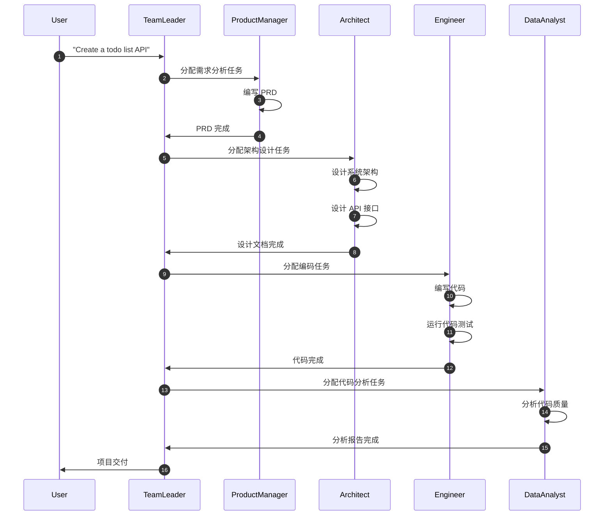

# MetaGPT-99-使用示例与最佳实践

本文档提供 MetaGPT 框架的实战使用示例、最佳实践、常见问题解决方案和具体案例，帮助开发者快速上手并精通框架的各种使用场景。

---

## 目录

1. [快速入门](#1-快速入门)
2. [自定义单Agent](#2-自定义单agent)
3. [自定义多Agent协作](#3-自定义多agent协作)
4. [软件开发完整流程](#4-软件开发完整流程)
5. [数据分析与代码生成](#5-数据分析与代码生成)
6. [高级特性](#6-高级特性)
7. [性能优化](#7-性能优化)
8. [常见问题与解决方案](#8-常见问题与解决方案)
9. [生产环境部署](#9-生产环境部署)
10. [扩展开发指南](#10-扩展开发指南)

---

## 1. 快速入门

### 1.1 安装与配置

```bash
# 1. 安装 MetaGPT
pip install metagpt

# 2. 初始化配置
metagpt --init-config

# 3. 编辑配置文件
vim ~/.metagpt/config2.yaml
```

**配置文件示例**（`~/.metagpt/config2.yaml`）：

```yaml
llm:
  api_type: "openai"
  model: "gpt-4-turbo"
  base_url: "https://api.openai.com/v1"
  api_key: "sk-..."  # 替换为实际 API Key

workspace:
  path: "./workspace"

logs:
  level: "INFO"
```

### 1.2 第一个程序

**方式一：CLI 命令行**

```bash
metagpt "Create a simple calculator that supports +, -, *, /"
```

**方式二：Python API**

```python
from metagpt.software_company import generate_repo

# 生成项目
project_path = generate_repo(
    idea="Create a simple calculator",
    investment=3.0,  # 预算 3 美元
    n_round=5,  # 最多 5 轮
)

print(f"Project generated at: {project_path}")
```

### 1.3 输出结果

执行后会在 `./workspace/` 目录下生成完整的项目结构：

```
workspace/
├── docs/
│   ├── prd/
│   │   └── 20231205_PRD.md  # 产品需求文档
│   ├── system_design/
│   │   └── 20231205_design.md  # 系统设计文档
│   └── api_spec/
│       └── 20231205_api.md  # API 设计文档
├── resources/
│   └── ...  # 生成的资源文件
└── src/
    ├── main.py  # 主程序
    ├── calculator.py  # 业务逻辑
    └── test_calculator.py  # 单元测试
```

---

## 2. 自定义单Agent

### 2.1 简单Agent：代码生成器

```python
import asyncio
import re
from metagpt.actions import Action
from metagpt.roles import Role
from metagpt.schema import Message
from metagpt.logs import logger

# 定义自定义动作
class SimpleWriteCode(Action):
    """编写Python代码"""
    
    PROMPT_TEMPLATE: str = """
    Write a python function that can {instruction} and provide two runnable test cases.
    Return ```python your_code_here ``` with NO other texts.
    """
    
    name: str = "SimpleWriteCode"
    
    async def run(self, instruction: str):
        # 构建提示词
        prompt = self.PROMPT_TEMPLATE.format(instruction=instruction)
        
        # 调用 LLM
        rsp = await self._aask(prompt)
        
        # 解析代码
        code_text = self.parse_code(rsp)
        
        return code_text
    
    @staticmethod
    def parse_code(rsp):
        """从响应中提取代码块"""
        pattern = r"```python(.*)```"
        match = re.search(pattern, rsp, re.DOTALL)
        return match.group(1) if match else rsp

# 定义自定义角色
class SimpleCoder(Role):
    """简单的代码生成器"""
    
    name: str = "Alice"
    profile: str = "SimpleCoder"
    goal: str = "Write Python code based on user requirements"
    
    def __init__(self, **kwargs):
        super().__init__(**kwargs)
        self.set_actions([SimpleWriteCode])  # 设置可执行的动作
    
    async def _act(self) -> Message:
        """执行动作"""
        logger.info(f"{self.name}: executing {self.rc.todo.name}")
        
        # 获取最近的消息作为指令
        msg = self.get_memories(k=1)[0]
        
        # 执行动作
        code_text = await self.rc.todo.run(msg.content)
        
        # 返回结果消息
        return Message(
            content=code_text,
            role=self.profile,
            cause_by=type(self.rc.todo)
        )

# 使用示例
async def main():
    role = SimpleCoder()
    result = await role.run("write a function that calculates the product of a list")
    logger.info(f"Generated code:\n{result.content}")

if __name__ == "__main__":
    asyncio.run(main())
```

### 2.2 多动作Agent：代码生成+执行

```python
import subprocess
from metagpt.roles.role import RoleReactMode

class SimpleRunCode(Action):
    """运行Python代码"""
    
    name: str = "SimpleRunCode"
    
    async def run(self, code_text: str):
        # 使用subprocess运行代码
        result = subprocess.run(
            ["python3", "-c", code_text],
            capture_output=True,
            text=True,
            timeout=10  # 10秒超时
        )
        
        output = result.stdout if result.returncode == 0 else result.stderr
        logger.info(f"Code execution result:\n{output}")
        
        return output

class RunnableCoder(Role):
    """可运行的代码生成器"""
    
    name: str = "Alice"
    profile: str = "RunnableCoder"
    
    def __init__(self, **kwargs):
        super().__init__(**kwargs)
        
        # 设置多个动作：先生成代码，再运行代码
        self.set_actions([SimpleWriteCode, SimpleRunCode])
        
        # 使用 BY_ORDER 模式：按顺序执行动作
        self._set_react_mode(react_mode=RoleReactMode.BY_ORDER.value)
    
    async def _act(self) -> Message:
        """执行当前待办动作"""
        logger.info(f"{self.name}: executing {self.rc.todo.name}")
        
        # 获取最近的消息
        msg = self.get_memories(k=1)[0]
        
        # 执行动作（自动按顺序选择）
        result = await self.rc.todo.run(msg.content)
        
        # 创建消息并保存到记忆
        msg = Message(
            content=result,
            role=self.profile,
            cause_by=type(self.rc.todo)
        )
        self.rc.memory.add(msg)
        
        return msg

# 使用示例
async def main():
    role = RunnableCoder()
    
    # 第一轮：生成代码
    result1 = await role.run("write a function that calculates factorial")
    logger.info(f"Generated code:\n{result1.content}")
    
    # 第二轮：运行代码
    result2 = await role.run("")
    logger.info(f"Execution result:\n{result2.content}")

if __name__ == "__main__":
    asyncio.run(main())
```

---

## 3. 自定义多Agent协作

### 3.1 简单协作：Coder + Tester + Reviewer

```python
from metagpt.team import Team
from metagpt.actions import UserRequirement

# === 动作定义 ===

class SimpleWriteTest(Action):
    """编写测试用例"""
    
    PROMPT_TEMPLATE: str = """
    Context: {context}
    Write {k} unit tests using pytest for the given function.
    Return ```python your_code_here ``` with NO other texts.
    """
    
    name: str = "SimpleWriteTest"
    
    async def run(self, context: str, k: int = 3):
        prompt = self.PROMPT_TEMPLATE.format(context=context, k=k)
        rsp = await self._aask(prompt)
        return parse_code(rsp)

class SimpleWriteReview(Action):
    """代码审查"""
    
    PROMPT_TEMPLATE: str = """
    Context: {context}
    Review the test cases and provide critical comments.
    """
    
    name: str = "SimpleWriteReview"
    
    async def run(self, context: str):
        prompt = self.PROMPT_TEMPLATE.format(context=context)
        rsp = await self._aask(prompt)
        return rsp

# === 角色定义 ===

class SimpleCoder(Role):
    """代码编写者"""
    
    name: str = "Alice"
    profile: str = "SimpleCoder"
    
    def __init__(self, **kwargs):
        super().__init__(**kwargs)
        self.set_actions([SimpleWriteCode])
        self._watch([UserRequirement])  # 监听用户需求

class SimpleTester(Role):
    """测试编写者"""
    
    name: str = "Bob"
    profile: str = "SimpleTester"
    
    def __init__(self, **kwargs):
        super().__init__(**kwargs)
        self.set_actions([SimpleWriteTest])
        self._watch([SimpleWriteCode])  # 监听代码生成
    
    async def _act(self) -> Message:
        logger.info(f"{self.name}: writing tests")
        
        # 获取所有历史消息作为上下文
        context = self.get_memories()
        
        # 执行测试编写
        code_text = await self.rc.todo.run(context, k=5)
        
        return Message(
            content=code_text,
            role=self.profile,
            cause_by=type(self.rc.todo)
        )

class SimpleReviewer(Role):
    """代码审查者"""
    
    name: str = "Charlie"
    profile: str = "SimpleReviewer"
    
    def __init__(self, **kwargs):
        super().__init__(**kwargs)
        self.set_actions([SimpleWriteReview])
        self._watch([SimpleWriteTest])  # 监听测试代码

# === 团队运行 ===

async def main():
    # 创建团队
    team = Team()
    
    # 雇佣角色
    team.hire([
        SimpleCoder(),
        SimpleTester(),
        SimpleReviewer(),
    ])
    
    # 设置预算
    team.invest(investment=3.0)
    
    # 发布需求
    team.run_project("write a function that calculates the product of a list")
    
    # 运行团队（最多5轮）
    await team.run(n_round=5)
    
    # 查看结果
    logger.info(f"Total cost: ${team.cost_manager.total_cost:.2f}")
    logger.info(f"Messages exchanged: {len(team.env.history)}")

if __name__ == "__main__":
    asyncio.run(main())
```

### 3.2 辩论系统：多Agent对话

```python
class SpeakAloud(Action):
    """在辩论中发言"""
    
    PROMPT_TEMPLATE: str = """
    ## BACKGROUND
    You are {name}, debating with {opponent_name}.
    
    ## DEBATE HISTORY
    {context}
    
    ## YOUR TURN
    Respond to your opponent's latest argument, state your position,
    defend your arguments, and attack your opponent's arguments.
    Craft a strong and emotional response in 80 words.
    """
    
    name: str = "SpeakAloud"
    
    async def run(self, context: str, name: str, opponent_name: str):
        prompt = self.PROMPT_TEMPLATE.format(
            context=context,
            name=name,
            opponent_name=opponent_name
        )
        rsp = await self._aask(prompt)
        return rsp

class Debator(Role):
    """辩论者"""
    
    name: str = ""
    profile: str = ""
    opponent_name: str = ""
    
    def __init__(self, **data):
        super().__init__(**data)
        self.set_actions([SpeakAloud])
        self._watch([UserRequirement, SpeakAloud])
    
    async def _observe(self) -> int:
        """只接收对手发给自己的消息"""
        await super()._observe()
        
        # 过滤消息：只保留发给自己的消息
        self.rc.news = [
            msg for msg in self.rc.news
            if msg.send_to == {self.name}
        ]
        
        return len(self.rc.news)
    
    async def _act(self) -> Message:
        """发表辩论观点"""
        logger.info(f"{self.name}: speaking")
        
        # 构建辩论上下文
        memories = self.get_memories()
        context = "\n".join(
            f"{msg.sent_from}: {msg.content}"
            for msg in memories
        )
        
        # 生成发言
        rsp = await self.rc.todo.run(
            context=context,
            name=self.name,
            opponent_name=self.opponent_name
        )
        
        # 创建消息并发送给对手
        msg = Message(
            content=rsp,
            role=self.profile,
            cause_by=type(self.rc.todo),
            sent_from=self.name,
            send_to=self.opponent_name,  # 明确发送给对手
        )
        self.rc.memory.add(msg)
        
        return msg

# 使用示例
async def debate():
    # 创建两个辩论者
    alice = Debator(
        name="Alice",
        profile="Pro",
        opponent_name="Bob"
    )
    
    bob = Debator(
        name="Bob",
        profile="Con",
        opponent_name="Alice"
    )
    
    # 创建团队
    team = Team()
    team.hire([alice, bob])
    team.invest(3.0)
    
    # 发起辩论主题，指定 Alice 先发言
    team.run_project(
        idea="Topic: AI will replace most human jobs",
        send_to="Alice"
    )
    
    # 运行 10 轮辩论
    await team.run(n_round=10)

if __name__ == "__main__":
    asyncio.run(debate())
```

---

## 4. 软件开发完整流程

### 4.1 使用内置角色

```python
from metagpt.software_company import generate_repo
from metagpt.roles import (
    ProductManager,
    Architect,
    Engineer2,
    DataAnalyst,
    TeamLeader,
)

# 方式一：使用便捷函数
project_path = generate_repo(
    idea="Create a RESTful API for a todo list application",
    investment=5.0,
    n_round=10,
    code_review=True,  # 启用代码审查
    project_name="todo_api",
)

# 方式二：手动组建团队
from metagpt.team import Team
from metagpt.context import Context
from metagpt.config2 import config

async def build_todo_api():
    # 初始化上下文
    ctx = Context(config=config)
    
    # 创建团队
    team = Team(context=ctx)
    
    # 雇佣角色
    team.hire([
        TeamLeader(),      # 团队协调者
        ProductManager(),  # 产品经理
        Architect(),       # 架构师
        Engineer2(),       # 工程师
        DataAnalyst(),     # 数据分析师
    ])
    
    # 设置预算
    team.invest(5.0)
    
    # 运行项目
    await team.run(
        n_round=10,
        idea="Create a RESTful API for a todo list application"
    )
    
    # 查看结果
    print(f"Project path: {ctx.kwargs.get('project_path')}")
    print(f"Total cost: ${team.cost_manager.total_cost:.2f}")

if __name__ == "__main__":
    asyncio.run(build_todo_api())
```

### 4.2 工作流详解



### 4.3 自定义工作流

```python
from metagpt.roles import Role
from metagpt.actions import Action

# 定义自定义动作
class AnalyzeRequirement(Action):
    """需求分析"""
    async def run(self, requirement: str):
        prompt = f"Analyze the following requirement: {requirement}"
        return await self._aask(prompt)

class GenerateTestData(Action):
    """生成测试数据"""
    async def run(self, api_spec: str):
        prompt = f"Generate test data for API: {api_spec}"
        return await self._aask(prompt)

class PerformanceTest(Action):
    """性能测试"""
    async def run(self, code: str):
        prompt = f"Analyze performance of: {code}"
        return await self._aask(prompt)

# 定义自定义角色
class RequirementAnalyst(Role):
    name: str = "Analyst"
    profile: str = "RequirementAnalyst"
    
    def __init__(self, **kwargs):
        super().__init__(**kwargs)
        self.set_actions([AnalyzeRequirement])
        self._watch([UserRequirement])

class QAEngineer(Role):
    name: str = "QA"
    profile: str = "QAEngineer"
    
    def __init__(self, **kwargs):
        super().__init__(**kwargs)
        self.set_actions([
            GenerateTestData,
            PerformanceTest,
        ])
        self._watch([WriteCode])

# 组建自定义团队
async def custom_workflow():
    team = Team()
    team.hire([
        RequirementAnalyst(),  # 需求分析师
        ProductManager(),      # 产品经理
        Architect(),           # 架构师
        Engineer2(),           # 工程师
        QAEngineer(),          # QA 工程师
    ])
    
    team.invest(8.0)
    await team.run(
        n_round=15,
        idea="Build a high-performance e-commerce platform"
    )

if __name__ == "__main__":
    asyncio.run(custom_workflow())
```

---

## 5. 数据分析与代码生成

### 5.1 Data Interpreter 示例

```python
from metagpt.roles.di.data_interpreter import DataInterpreter

async def data_analysis():
    # 创建数据解释器
    di = DataInterpreter()
    
    # 执行数据分析任务
    result = await di.run(
        "Analyze the sklearn Iris dataset, create visualizations, "
        "and build a classification model"
    )
    
    logger.info(f"Analysis complete: {result}")

# 多步骤数据分析
async def advanced_analysis():
    di = DataInterpreter()
    
    # 步骤 1：加载数据
    await di.run("Load the Titanic dataset from a CSV file")
    
    # 步骤 2：数据清洗
    await di.run("Clean the data by handling missing values")
    
    # 步骤 3：探索性数据分析
    await di.run("Perform EDA with visualizations")
    
    # 步骤 4：构建模型
    await di.run("Build a survival prediction model")
    
    # 步骤 5：评估模型
    await di.run("Evaluate the model and show metrics")

if __name__ == "__main__":
    asyncio.run(advanced_analysis())
```

### 5.2 自动化机器学习

```python
from metagpt.roles.di.data_interpreter import DataInterpreter

async def automl_pipeline():
    di = DataInterpreter()
    
    task = """
    1. Load the Boston housing dataset
    2. Perform feature engineering
    3. Try multiple regression models (Linear, Random Forest, XGBoost)
    4. Compare model performance
    5. Select the best model and show predictions
    """
    
    result = await di.run(task)
    logger.info(f"AutoML complete: {result}")

if __name__ == "__main__":
    asyncio.run(automl_pipeline())
```

---

## 6. 高级特性

### 6.1 工具集成

```python
from metagpt.tools.tool_registry import register_tool
from metagpt.roles.di.role_zero import RoleZero

# 定义自定义工具
@register_tool()
class DatabaseTool:
    """数据库操作工具"""
    
    async def query(self, sql: str) -> list:
        """执行 SQL 查询"""
        # 实现数据库查询逻辑
        return [{"id": 1, "name": "Alice"}]
    
    async def insert(self, table: str, data: dict) -> bool:
        """插入数据"""
        # 实现数据插入逻辑
        return True

# 在角色中使用工具
class DataEngineer(RoleZero):
    tools: list[str] = ["DatabaseTool"]
    
    def __init__(self, **kwargs):
        super().__init__(**kwargs)
        self.db = DatabaseTool()
        
        # 注册工具执行映射
        self.tool_execution_map.update({
            "DatabaseTool.query": self.db.query,
            "DatabaseTool.insert": self.db.insert,
        })

# 使用示例
async def use_tools():
    engineer = DataEngineer()
    result = await engineer.run(
        "Query all users from the database and analyze their behavior"
    )
    logger.info(f"Result: {result}")

if __name__ == "__main__":
    asyncio.run(use_tools())
```

### 6.2 RAG（检索增强生成）

```python
from metagpt.rag import RAGEngine
from metagpt.roles import Role

class KnowledgeAgent(Role):
    """具备知识库的Agent"""
    
    def __init__(self, **kwargs):
        super().__init__(**kwargs)
        
        # 初始化 RAG 引擎
        self.rag = RAGEngine()
        
        # 添加知识文档
        self.rag.add_documents([
            "docs/manual.md",
            "docs/api_reference.md",
        ])
    
    async def _act(self) -> Message:
        # 获取用户问题
        question = self.get_memories(k=1)[0].content
        
        # 从知识库检索相关文档
        relevant_docs = await self.rag.retrieve(question, top_k=3)
        
        # 基于检索结果回答问题
        context = "\n".join([doc.content for doc in relevant_docs])
        prompt = f"Context:\n{context}\n\nQuestion: {question}\nAnswer:"
        
        answer = await self.llm.aask(prompt)
        
        return Message(content=answer, role=self.profile)

# 使用示例
async def qa_with_rag():
    agent = KnowledgeAgent()
    result = await agent.run("How do I configure the API key?")
    logger.info(f"Answer: {result.content}")

if __name__ == "__main__":
    asyncio.run(qa_with_rag())
```

### 6.3 状态持久化与恢复

```python
from pathlib import Path

# 保存团队状态
async def save_team_state():
    team = Team()
    team.hire([ProductManager(), Architect(), Engineer2()])
    team.invest(5.0)
    
    # 运行几轮
    await team.run(n_round=3, idea="Build a chat app")
    
    # 序列化状态
    stg_path = Path("./storage/team")
    team.serialize(stg_path)
    logger.info(f"Team state saved to {stg_path}")

# 恢复团队状态并继续运行
async def recover_team_state():
    from metagpt.context import Context
    from metagpt.config2 import config
    
    ctx = Context(config=config)
    stg_path = Path("./storage/team")
    
    # 反序列化恢复
    team = Team.deserialize(stg_path=stg_path, context=ctx)
    
    # 继续运行
    await team.run(n_round=5)  # 再运行5轮
    logger.info("Team recovered and continued")

# 使用示例
if __name__ == "__main__":
    # 第一次运行：保存状态
    asyncio.run(save_team_state())
    
    # 第二次运行：恢复并继续
    asyncio.run(recover_team_state())
```

---

## 7. 性能优化

### 7.1 成本控制

```python
from metagpt.utils.cost_manager import CostManager

# 策略 1：使用更便宜的模型
config.llm.model = "gpt-3.5-turbo"  # 而不是 gpt-4

# 策略 2：分级使用模型
class SmartRole(Role):
    def __init__(self, **kwargs):
        super().__init__(**kwargs)
        
        # 简单任务使用便宜模型
        self.simple_action = Action(llm_name_or_type="gpt-3.5-turbo")
        
        # 复杂任务使用强大模型
        self.complex_action = Action(llm_name_or_type="gpt-4")

# 策略 3：严格预算控制
team = Team()
team.invest(5.0)  # 限制最大成本

try:
    await team.run(n_round=20, idea="Build a complex system")
except NoMoneyException as e:
    logger.warning(f"Budget exceeded: {e}")
    # 保存当前状态并停止
    team.serialize(Path("./storage/interrupted"))

# 策略 4：实时监控成本
team = Team()
team.invest(10.0)

for i in range(10):
    await team.env.run()
    
    cost = team.cost_manager.total_cost
    logger.info(f"Round {i+1}: Cost = ${cost:.2f}")
    
    if cost > 8.0:
        logger.warning("Approaching budget limit, stopping...")
        break
```

### 7.2 并发优化

```python
# MetaGPT 默认并发执行角色
# 可通过控制角色数量优化性能

# 好的实践：3-5个角色
team = Team()
team.hire([
    ProductManager(),
    Architect(),
    Engineer2(),
])

# 避免：过多角色导致混乱
# team.hire([Role1(), Role2(), ..., Role20()])  # 不推荐

# 如需大量任务，使用队列模式
class TaskQueue(Role):
    def __init__(self, **kwargs):
        super().__init__(**kwargs)
        self.task_queue = []
    
    async def _act(self):
        if not self.task_queue:
            return None
        
        # 每次处理一个任务
        task = self.task_queue.pop(0)
        result = await self.process_task(task)
        
        return Message(content=result)
```

### 7.3 缓存优化

```python
from functools import lru_cache

class CachedAction(Action):
    """带缓存的Action"""
    
    @lru_cache(maxsize=100)
    async def _aask_cached(self, prompt: str):
        """缓存 LLM 响应"""
        return await self._aask(prompt)
    
    async def run(self, context: str):
        # 使用缓存版本
        result = await self._aask_cached(context)
        return result

# 自定义缓存策略
class SmartCacheRole(Role):
    def __init__(self, **kwargs):
        super().__init__(**kwargs)
        self.response_cache = {}
    
    async def _act(self) -> Message:
        msg = self.get_memories(k=1)[0]
        
        # 检查缓存
        cache_key = hashlib.md5(msg.content.encode()).hexdigest()
        
        if cache_key in self.response_cache:
            logger.info("Using cached response")
            return self.response_cache[cache_key]
        
        # 未命中缓存，调用 LLM
        result = await self.rc.todo.run(msg.content)
        
        # 保存到缓存
        response = Message(content=result, role=self.profile)
        self.response_cache[cache_key] = response
        
        return response
```

---

## 8. 常见问题与解决方案

### 8.1 API Key 相关

**问题 1：API Key 无效**

```bash
# 错误信息
openai.error.AuthenticationError: Incorrect API key provided

# 解决方案
# 1. 检查配置文件
cat ~/.metagpt/config2.yaml

# 2. 确认 API Key 正确
# 3. 尝试使用环境变量
export OPENAI_API_KEY="sk-..."
```

**问题 2：API 调用限流**

```python
# 添加重试机制
from tenacity import retry, wait_exponential, stop_after_attempt

class ResilientAction(Action):
    @retry(
        wait=wait_exponential(multiplier=1, min=4, max=60),
        stop=stop_after_attempt(3)
    )
    async def run(self, context: str):
        try:
            return await self._aask(context)
        except openai.error.RateLimitError as e:
            logger.warning(f"Rate limit hit: {e}")
            raise
```

### 8.2 角色协作问题

**问题：角色无法接收消息**

```python
# 原因：watch 列表未正确设置
# 错误示例
class MyRole(Role):
    def __init__(self):
        super().__init__()
        self.set_actions([MyAction])
        # 缺少 _watch()

# 正确示例
class MyRole(Role):
    def __init__(self):
        super().__init__()
        self.set_actions([MyAction])
        self._watch([UpstreamAction])  # 监听上游动作
```

**问题：消息发送给错误的角色**

```python
# 使用明确的消息路由
msg = Message(
    content="Hello",
    send_to={"TargetRoleName"},  # 明确指定接收者
)

# 或使用广播
msg = Message(
    content="Announcement",
    send_to={MESSAGE_ROUTE_TO_ALL},  # 发送给所有角色
)
```

### 8.3 代码生成问题

**问题：生成的代码无法运行**

```python
# 添加代码验证步骤
class ValidatedWriteCode(Action):
    async def run(self, instruction: str):
        # 生成代码
        code = await self._aask(f"Write code: {instruction}")
        
        # 验证代码语法
        try:
            compile(code, '<string>', 'exec')
            logger.info("Code syntax valid")
        except SyntaxError as e:
            logger.error(f"Syntax error: {e}")
            # 请求 LLM 修复
            code = await self._aask(f"Fix this code:\n{code}\nError: {e}")
        
        return code
```

### 8.4 内存溢出

**问题：长时间运行导致内存增长**

```python
# 解决方案 1：禁用不必要的记忆
class StatelessRole(Role):
    def __init__(self):
        super().__init__()
        self.enable_memory = False  # 禁用记忆

# 解决方案 2：定期清理记忆
class MemoryManagedRole(Role):
    async def _act(self):
        # 只保留最近 10 条消息
        if len(self.rc.memory.storage) > 10:
            self.rc.memory.storage = self.rc.memory.storage[-10:]
        
        return await super()._act()

# 解决方案 3：使用外部存储
# 配置 Redis 作为记忆存储
config.memory.storage = "redis://localhost:6379"
```

---

## 9. 生产环境部署

### 9.1 Docker 部署

**Dockerfile**：

```dockerfile
FROM python:3.9-slim

WORKDIR /app

# 安装依赖
COPY requirements.txt .
RUN pip install --no-cache-dir -r requirements.txt

# 复制代码
COPY . .

# 配置文件
ENV METAGPT_CONFIG=/app/config/config2.yaml

CMD ["python", "main.py"]
```

**docker-compose.yml**：

```yaml
version: '3.8'

services:
  metagpt:
    build: .
    environment:
      - OPENAI_API_KEY=${OPENAI_API_KEY}
    volumes:
      - ./workspace:/app/workspace
      - ./config:/app/config
    restart: unless-stopped
```

### 9.2 API 服务部署

```python
from fastapi import FastAPI, HTTPException
from pydantic import BaseModel

app = FastAPI()

class TaskRequest(BaseModel):
    idea: str
    investment: float = 3.0
    n_round: int = 5

@app.post("/generate")
async def generate_project(request: TaskRequest):
    try:
        project_path = generate_repo(
            idea=request.idea,
            investment=request.investment,
            n_round=request.n_round
        )
        
        return {
            "status": "success",
            "project_path": project_path
        }
    
    except Exception as e:
        raise HTTPException(status_code=500, detail=str(e))

# 运行服务
# uvicorn api:app --host 0.0.0.0 --port 8000
```

### 9.3 监控与日志

```python
import logging
from prometheus_client import Counter, Histogram

# 配置日志
logging.basicConfig(
    level=logging.INFO,
    format='%(asctime)s - %(name)s - %(levelname)s - %(message)s',
    handlers=[
        logging.FileHandler('metagpt.log'),
        logging.StreamHandler()
    ]
)

# Prometheus 指标
llm_requests = Counter('metagpt_llm_requests_total', 'Total LLM requests')
llm_latency = Histogram('metagpt_llm_latency_seconds', 'LLM request latency')

class MonitoredAction(Action):
    async def run(self, context: str):
        llm_requests.inc()  # 增加计数
        
        with llm_latency.time():  # 记录延迟
            result = await self._aask(context)
        
        return result
```

---

## 10. 扩展开发指南

### 10.1 自定义 LLM Provider

```python
from metagpt.provider.base_llm import BaseLLM
from metagpt.provider.llm_provider_registry import register_provider
from metagpt.configs.llm_config import LLMType

@register_provider([LLMType.CUSTOM])
class CustomLLM(BaseLLM):
    def __init__(self, config):
        self.config = config
        self.client = CustomClient(api_key=config.api_key)
    
    async def aask(self, prompt: str, **kwargs) -> str:
        response = await self.client.chat(
            messages=[{"role": "user", "content": prompt}]
        )
        return response.choices[0].message.content
    
    async def acompletion(self, messages: list, **kwargs):
        return await self.client.chat(messages=messages)

# 使用自定义 Provider
config.llm.api_type = "custom"
config.llm.api_key = "your-api-key"
```

### 10.2 自定义 Environment

```python
from metagpt.environment.base_env import ExtEnv, mark_as_readable, mark_as_writeable

class GameEnv(ExtEnv):
    """自定义游戏环境"""
    
    game_state: dict = {"score": 0, "level": 1}
    
    @mark_as_readable
    def get_game_state(self):
        """角色可读取游戏状态"""
        return self.game_state
    
    @mark_as_writeable
    def execute_action(self, action_type: str, params: dict):
        """角色可执行游戏动作"""
        if action_type == "move":
            self.game_state["score"] += 10
        
        return {"success": True, "new_state": self.game_state}

# 使用自定义环境
env = GameEnv()
team = Team()
team.env = env
team.hire([GameAIRole()])
await team.run(n_round=100, idea="Play the game")
```

---

**文档版本**：v1.0  
**最后更新**：2025-10-05  
**维护者**：MetaGPT 团队

**附录：更多资源**
- 官方文档：https://docs.deepwisdom.ai
- GitHub 仓库：https://github.com/geekan/MetaGPT
- Discord 社区：https://discord.gg/ZRHeExS6xv

