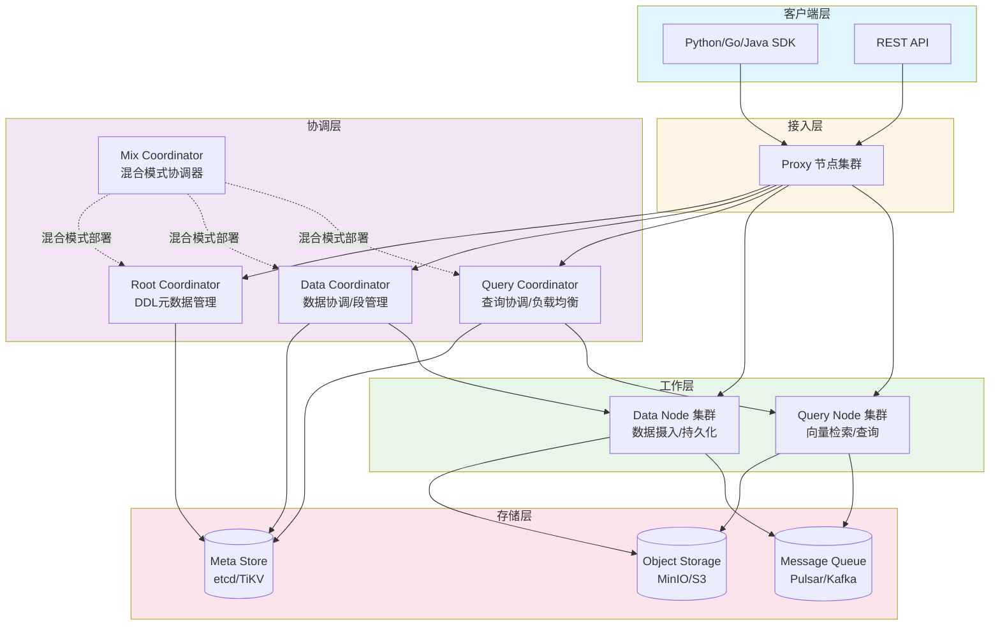
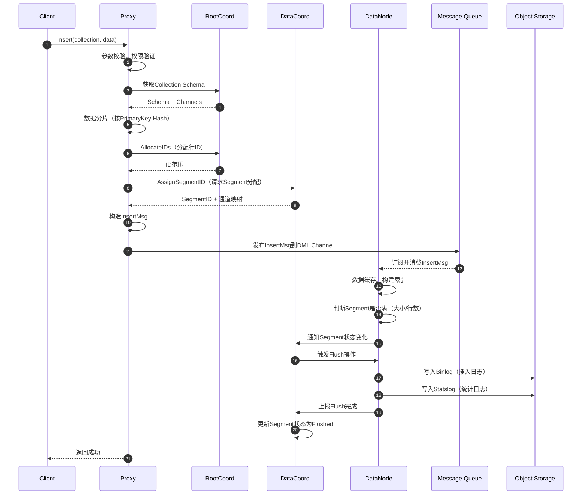
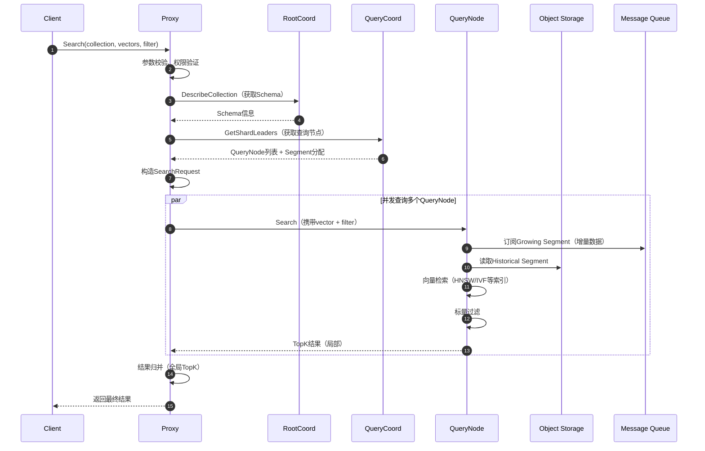

# Milvus-00-总览

## 0. 摘要

### 0.1 项目目标与核心能力

Milvus是一个云原生向量数据库系统，专门为AI应用设计，用于高效组织和检索海量非结构化数据（如文本、图像、多模态信息）。核心能力包括：

- **向量检索**：支持十亿级向量的高性能检索，提供多种索引类型（HNSW、IVF、FLAT、SCANN、DiskANN等）
- **实时性**：支持流式数据更新，确保数据实时性
- **分布式架构**：计算与存储分离，支持水平扩展
- **多租户**：支持数据库、集合、分区、分区键多级隔离
- **混合检索**：结合稠密向量（语义搜索）和稀疏向量（全文检索）
- **数据安全**：强制用户认证、TLS加密、基于角色的访问控制（RBAC）

### 0.2 运行环境

**语言与运行时**：

- Go 1.24.4+（服务层）
- C++ 11+（核心向量搜索引擎）
- Python 3.8-3.11（客户端SDK）

**关键依赖**：

- etcd/TiKV：元数据存储与服务发现
- MinIO/S3/Azure Blob：对象存储
- Pulsar/Kafka：消息队列
- gRPC：服务间通信

**部署形态**：

- Standalone：单机模式，适合快速开始和开发
- Cluster：分布式集群模式，计算存储分离，K8s原生
- Lite：轻量级版本，通过`pip install pymilvus`直接使用

### 0.3 核心能力边界与非目标

**核心能力**：

- 向量存储与检索
- 标量过滤
- 混合查询（向量+标量）
- 流式数据摄入
- 数据持久化

**非目标**：

- 不是通用关系型数据库
- 不提供SQL完整语义
- 不支持事务ACID特性
- 不支持复杂JOIN操作

## 1. 整体架构图



### 1.1 架构说明

**组件职责**：

1. **Proxy（接入层）**：
   - 客户端请求统一入口
   - 请求路由与负载均衡
   - 权限验证与限流
   - 结果聚合与返回

2. **Root Coordinator（根协调器）**：
   - DDL操作处理（创建/删除集合、分区）
   - 时间戳分配（TSO）
   - Schema管理
   - 数据定义元数据维护

3. **Data Coordinator（数据协调器）**：
   - Segment生命周期管理
   - 数据通道分配
   - 数据节点任务调度
   - Compaction触发与监控
   - 垃圾回收

4. **Query Coordinator（查询协调器）**：
   - Collection加载状态管理
   - Segment分配与负载均衡
   - Handoff协调（刷新的Segment转交）
   - 查询节点健康监控

5. **Data Node（数据节点）**：
   - 流式数据消费
   - 数据缓存与Binlog生成
   - Segment刷新到对象存储
   - 数据Compaction

6. **Query Node（查询节点）**：
   - Historical Segment加载
   - Growing Segment订阅
   - 向量检索执行
   - 标量过滤

**数据流与控制流**：

- **控制流**：Client → Proxy → Coordinator → Worker Node（同步gRPC调用）
- **数据流**：
  - 写入：Client → Proxy → Message Queue → Data Node → Object Storage
  - 查询：Client → Proxy → Query Node → Object Storage

**耦合关系**：

- Proxy与所有Coordinator松耦合（通过gRPC）
- Coordinator与Worker Node之间为管理关系
- 所有组件与存储层解耦

### 1.2 高可用与扩展性

**高可用**：

- 所有Coordinator支持Active-Standby模式
- Worker Node无状态，故障后自动重新分配任务
- etcd集群部署保证元数据高可用
- Object Storage和Message Queue本身具备高可用

**扩展性**：

- Proxy、Data Node、Query Node支持水平扩展
- 根据负载动态增减Worker Node
- Segment级别的数据分片

## 2. 全局时序图（数据写入与查询闭环）

### 2.1 数据写入流程



**时序图说明**：

1. **前置校验**（步骤1-3）：Proxy验证请求合法性，获取Collection元信息
2. **资源分配**（步骤4-7）：分配主键ID和Segment，确定数据落盘位置
3. **消息发布**（步骤8-9）：数据封装为消息写入MessageQueue，实现解耦
4. **数据消费**（步骤10-11）：DataNode异步消费，缓存数据构建内存索引
5. **持久化**（步骤12-16）：达到阈值后触发Flush，数据写入Object Storage

**幂等性**：

- 客户端可重试，Proxy通过PrimaryKey去重
- Segment分配幂等，相同请求返回相同SegmentID

**错误语义**：

- Schema不存在：返回错误，客户端需先创建Collection
- Segment分配失败：自动重试，超时后返回错误
- Message Queue不可用：写入失败，客户端需重试

### 2.2 查询流程



**时序图说明**：

1. **查询准备**（步骤1-5）：获取Collection元信息和QueryNode分片信息
2. **并发查询**（步骤6-11）：Proxy并发向多个QueryNode发起查询
3. **数据访问**（步骤8-9）：QueryNode同时读取Historical（已刷新）和Growing（增量）Segment
4. **检索与过滤**（步骤10-11）：执行向量近似搜索和标量过滤
5. **结果合并**（步骤13-14）：Proxy执行全局TopK归并

**超时与重试**：

- Proxy设置超时时间（默认60s）
- QueryNode超时或失败，Proxy可重试其他副本
- 支持Replica多副本查询，提升可用性

**性能优化点**：

- Segment级别并行检索
- 向量索引加速（避免暴力搜索）
- 结果缓存与预取

## 3. 模块边界与交互图

### 3.1 模块清单

| 模块 | 路径 | 职责 | 对外API |
|------|------|------|---------|
| **Proxy** | `internal/proxy` | 接入层，请求路由 | gRPC MilvusService |
| **Root Coordinator** | `internal/rootcoord` | DDL管理，TSO分配 | gRPC RootCoord |
| **Data Coordinator** | `internal/datacoord` | 数据协调，Segment管理 | gRPC DataCoord |
| **Query Coordinator** | `internal/querycoordv2` | 查询协调，负载均衡 | gRPC QueryCoord |
| **Data Node** | `internal/datanode` | 数据消费，持久化 | gRPC DataNode |
| **Query Node** | `internal/querynodev2` | 向量检索，查询执行 | gRPC QueryNode |
| **Storage** | `internal/storage` | 对象存储抽象 | - |
| **MetaStore** | `internal/metastore` | 元数据CRUD封装 | - |
| **Allocator** | `internal/allocator` | ID/Timestamp分配器 | - |

### 3.2 模块交互矩阵

| 调用方 → 被调方 | Proxy | RootCoord | DataCoord | QueryCoord | DataNode | QueryNode |
|----------------|-------|-----------|-----------|------------|----------|-----------|
| **Proxy** | - | DDL操作<br/>同步 | Segment分配<br/>同步 | GetShardLeaders<br/>同步 | - | Search/Query<br/>同步 |
| **RootCoord** | - | - | 通知Collection变更<br/>异步 | 通知Collection变更<br/>异步 | - | - |
| **DataCoord** | - | AllocTimestamp<br/>同步 | - | - | FlushSegment<br/>同步 | - |
| **QueryCoord** | - | DescribeCollection<br/>同步 | GetSegmentInfo<br/>同步 | - | - | LoadSegment<br/>同步 |
| **DataNode** | - | - | ReportSegment<br/>异步 | - | - | - |
| **QueryNode** | - | - | - | ReportSegment<br/>异步 | - | - |

**交互说明**：

- **同步调用**：通过gRPC直接调用，等待响应
- **异步消息**：通过Message Queue解耦，发送者不等待
- **共享存储**：通过etcd共享元数据，无直接调用

### 3.3 数据一致性保证

**时间戳机制（TSO）**：

- RootCoord作为TSO服务，全局单调递增
- 所有写操作携带Timestamp，保证因果一致性
- Query操作指定Timestamp，读取该时刻一致性快照

**Segment状态机**：

```
Growing → Sealed → Flushing → Flushed → Dropped
```

- Growing：数据写入中
- Sealed：不再接受新数据
- Flushing：正在刷新到Object Storage
- Flushed：持久化完成
- Dropped：已删除

**Handoff机制**：

- DataNode完成Flush后，通知QueryCoord
- QueryCoord触发Handoff：QueryNode从Growing切换到Historical
- 保证查询不丢数据

## 4. 关键设计与权衡

### 4.1 计算存储分离

**设计动机**：

- 独立扩展计算（QueryNode）和存储容量
- 降低成本（Object Storage更便宜）
- 支持云原生部署

**权衡**：

- 查询需从远程存储加载数据，延迟增加
- 通过本地缓存和索引缓解

### 4.2 事件驱动架构

**Message Queue的作用**：

- 解耦写入路径和数据处理
- 提供数据replay能力（故障恢复）
- 支持多订阅者（例如CDC）

**权衡**：

- 引入额外组件，增加运维复杂度
- 端到端延迟略高于直接写入

### 4.3 Segment设计

**Segment大小**：

- 默认512MB或100万行
- 过小：元数据膨胀，查询并发度高
- 过大：内存压力大，Compaction耗时长

**Compaction策略**：

- InnerSegment Compaction：合并小Segment
- MixCompaction：合并删除标记，减少空间浪费

### 4.4 索引策略

**支持的索引类型**：

- FLAT：精确检索，适合小数据集
- IVF_FLAT、IVF_SQ8、IVF_PQ：聚类+量化，平衡性能与召回率
- HNSW：基于图的索引，高召回率但内存占用大
- DiskANN：磁盘索引，支持超大规模数据

**权衡**：

- 精确度 vs 性能：FLAT最精确但慢，HNSW快但近似
- 内存 vs 磁盘：HNSW内存型，DiskANN磁盘型

## 5. 性能关键路径与可观测性

### 5.1 性能关键路径

**写入路径**：

1. Proxy序列化（5-10ms）
2. Message Queue延迟（1-5ms）
3. DataNode消费与缓存（< 1ms）
4. Flush到Object Storage（取决于网络，100-500ms）

**查询路径**（P99目标 < 100ms）：

1. Proxy路由（1-2ms）
2. QueryNode加载Segment（首次查询，100-1000ms）
3. 向量检索（10-50ms，取决于索引）
4. 结果归并（1-5ms）

### 5.2 可观测性指标

**关键Metrics**：

- `milvus_proxy_req_count`：请求计数
- `milvus_proxy_req_latency`：请求延迟（P50/P95/P99）
- `milvus_querynode_search_latency`：查询延迟
- `milvus_datanode_flushed_size`：刷新数据量
- `milvus_segment_num`：Segment数量

**日志**：

- 使用zap结构化日志
- 日志级别：Debug/Info/Warn/Error
- 慢查询日志（默认 > 5s）

**Tracing**：

- OpenTelemetry集成
- 支持导出到Jaeger/Zipkin
- Span覆盖关键路径

## 6. 配置项

### 6.1 关键配置

**Proxy配置**：

- `proxy.replicas`：Proxy副本数
- `proxy.timeTickInterval`：时间戳同步间隔

**DataCoord配置**：

- `dataCoord.segment.maxSize`：Segment最大大小（默认512MB）
- `dataCoord.segment.sealProportion`：Seal比例（默认0.75）
- `dataCoord.enableCompaction`：是否启用Compaction

**QueryCoord配置**：

- `queryCoord.balanceIntervalSeconds`：负载均衡间隔
- `queryCoord.overloadedMemoryThresholdPercentage`：内存过载阈值

**Common配置**：

- `common.retentionDuration`：数据保留时长
- `common.indexSliceSize`：索引切片大小

## 7. 典型使用示例与最佳实践

### 7.1 快速开始（Milvus Lite）

```python
from pymilvus import MilvusClient

# 创建本地数据库
client = MilvusClient("milvus_demo.db")

# 创建Collection
client.create_collection(
    collection_name="demo",
    dimension=768  # 向量维度
)

# 插入数据
data = [
    {"id": 1, "vector": [0.1] * 768, "text": "hello"},
    {"id": 2, "vector": [0.2] * 768, "text": "world"}
]
client.insert(collection_name="demo", data=data)

# 查询
results = client.search(
    collection_name="demo",
    data=[[0.1] * 768],  # 查询向量
    limit=10,
    output_fields=["text"]
)
print(results)
```

### 7.2 生产环境部署（Cluster模式）

**Helm部署**：

```bash
helm repo add milvus https://zilliztech.github.io/milvus-helm
helm install milvus milvus/milvus --set cluster.enabled=true
```

**资源配置建议**：

- **Proxy**：2核4GB，副本数≥2
- **Coordinator**：2核4GB，单副本（支持Active-Standby）
- **QueryNode**：8核32GB，根据数据量扩展
- **DataNode**：4核16GB，根据写入吞吐扩展

### 7.3 最佳实践

**数据建模**：

- 合理设计分区（Partition），避免单分区过大
- 使用分区键（Partition Key）实现多租户隔离
- 主键选择：使用整数类型性能更好

**索引选择**：

- 小数据集（< 100万）：FLAT
- 中等数据集（100万-1000万）：HNSW
- 大数据集（> 1000万）：IVF_PQ或DiskANN

**查询优化**：

- 使用标量过滤缩小检索范围
- 设置合理的`nprobe`和`ef`参数
- 批量查询（Batch Search）提升吞吐

**监控告警**：

- 监控QueryNode内存使用率，避免OOM
- 监控Segment数量，及时触发Compaction
- 设置慢查询告警

## 8. 扩展阅读

- [Milvus官方文档](https://milvus.io/docs)
- [Architecture Overview](https://milvus.io/docs/architecture_overview.md)
- [Milvus GitHub](https://github.com/milvus-io/milvus)
- [向量数据库白皮书](https://zilliz.com/vector-database-benchmark-tool)

---

**文档版本**：1.0  
**生成时间**：2025-01-XX  
**适用Milvus版本**：v2.5+
