# Milvus-01-Proxy

## 模块概览

## 1. 模块职责

Proxy模块作为Milvus系统的接入层，承担以下核心职责：

### 1.1 核心功能

- **统一入口**：接收所有客户端请求（DDL、DML、DQL）
- **请求路由**：根据请求类型路由到对应的Coordinator或Worker Node
- **权限验证**：身份认证、RBAC权限检查
- **限流保护**：基于配额的请求限流，防止系统过载
- **结果聚合**：聚合多个QueryNode的查询结果，返回全局TopK
- **负载均衡**：在多个QueryNode之间分配查询负载

### 1.2 输入输出

**输入**：

- 客户端gRPC请求（Python/Go/Java SDK）
- RESTful API请求
- 其他Coordinator的内部调用

**输出**：

- 客户端响应（成功/失败状态、数据结果）
- 向Coordinator发起的RPC调用
- 向DataNode/QueryNode发起的RPC调用

### 1.3 上下游依赖

**上游（调用方）**：

- 客户端SDK
- RESTful API网关

**下游（被调用）**：

- **RootCoord**：DDL操作、TSO分配、Schema查询
- **DataCoord**：Segment分配、Channel分配
- **QueryCoord**：查询节点信息、Collection加载状态
- **DataNode**：（无直接调用）
- **QueryNode**：Search、Query操作
- **MetaCache**：Collection/Schema元数据缓存

### 1.4 生命周期

```
创建 → 初始化 → 启动 → 运行 → 停止
```

**初始化阶段**（Init）：

- 连接etcd，注册Session
- 初始化ID分配器、Timestamp分配器
- 初始化Channel管理器
- 初始化任务调度器
- 初始化MetaCache

**启动阶段**（Start）：

- 启动Shard管理器
- 启动任务调度器
- 启动ID分配器
- 状态设置为Healthy

**运行阶段**：

- 处理客户端请求
- 维护心跳
- 更新元数据缓存

**停止阶段**（Stop）：

- 关闭ID分配器
- 关闭任务调度器
- 停止Session
- 关闭Shard管理器

## 2. 模块架构图

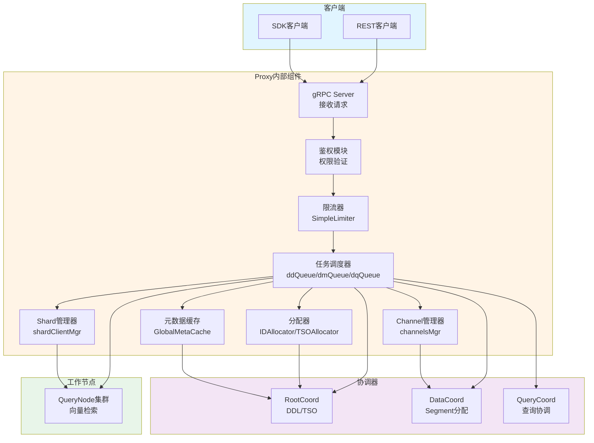
```mermaid
flowchart TB
    subgraph Client["客户端"]
        SDK[SDK客户端]
        REST[REST客户端]
    end
    
    subgraph ProxyComponents["Proxy内部组件"]
        direction TB
        EntryPoint[gRPC Server<br/>接收请求]
        Auth[鉴权模块<br/>权限验证]
        RateLimiter[限流器<br/>SimpleLimiter]
        TaskScheduler[任务调度器<br/>ddQueue/dmQueue/dqQueue]
        MetaCache[元数据缓存<br/>GlobalMetaCache]
        ShardMgr[Shard管理器<br/>shardClientMgr]
        ChannelMgr[Channel管理器<br/>channelsMgr]
        Allocators[分配器<br/>IDAllocator/TSOAllocator]
    end
    
    subgraph Coordinators["协调器"]
        RootCoord[RootCoord<br/>DDL/TSO]
        DataCoord[DataCoord<br/>Segment分配]
        QueryCoord[QueryCoord<br/>查询协调]
    end
    
    subgraph Workers["工作节点"]
        QueryNode[QueryNode集群<br/>向量检索]
    end
    
    SDK --> EntryPoint
    REST --> EntryPoint
    EntryPoint --> Auth
    Auth --> RateLimiter
    RateLimiter --> TaskScheduler
    
    TaskScheduler --> MetaCache
    TaskScheduler --> ShardMgr
    TaskScheduler --> ChannelMgr
    TaskScheduler --> Allocators
    
    MetaCache --> RootCoord
    ShardMgr --> QueryNode
    ChannelMgr --> DataCoord
    Allocators --> RootCoord
    
    TaskScheduler --> RootCoord
    TaskScheduler --> DataCoord
    TaskScheduler --> QueryCoord
    TaskScheduler --> QueryNode
    
    style ProxyComponents fill:#fff4e6
    style Client fill:#e1f5ff
    style Coordinators fill:#f3e5f5
    style Workers fill:#e8f5e9
```

### 2.1 架构说明

#### 2.1.1 组件职责

**gRPC Server**：

- 实现`milvuspb.MilvusService`接口
- 接收并解析客户端请求
- 路由到对应的处理函数

**鉴权模块**：

- 验证用户身份（用户名/密码、Token）
- 检查RBAC权限（Collection/Database级别）
- 缓存权限信息，减少RootCoord调用

**限流器（SimpleLimiter）**：

- 基于Token Bucket算法
- 支持DML/DQL分类限流
- 配额管理（QPS、带宽、并发）

**任务调度器（TaskScheduler）**：

- 管理三个任务队列：
  - `ddQueue`：DDL任务（CreateCollection、DropCollection等）
  - `dmQueue`：DML任务（Insert、Delete、Upsert等）
  - `dqQueue`：DQL任务（Search、Query等）
- 串行执行DDL，并发执行DML/DQL
- 任务超时管理

**元数据缓存（GlobalMetaCache）**：

- 缓存Collection Schema
- 缓存Partition信息
- 缓存Shard信息（Query Node映射）
- 失效策略：接收RootCoord的失效通知

**Shard管理器（shardClientMgr）**：

- 维护QueryNode连接池
- 负载均衡策略（RoundRobin、LookAside）
- 健康检查

**Channel管理器（channelsMgr）**：

- 管理DML Channel（数据写入通道）
- Channel与Collection的映射
- 消息生产者管理

**分配器**：

- **IDAllocator**：分配行ID（PrimaryKey为AutoID时）
- **TSOAllocator**：分配全局时间戳

#### 2.1.2 边界条件

**并发控制**：

- DDL串行执行，避免元数据冲突
- DML/DQL并发执行，提升吞吐
- 任务队列有容量限制（默认1024）

**超时设置**：

- 默认请求超时：60秒
- DDL操作超时：可配置，默认10分钟
- RPC调用超时：可配置，默认5秒

**幂等性**：

- Insert操作：按PrimaryKey去重
- Delete操作：删除不存在的数据不报错
- DDL操作：重复创建Collection返回已存在错误

#### 2.1.3 异常与回退

**Coordinator不可用**：

- 自动重试（指数退避）
- 超过最大重试次数返回错误
- 客户端需处理错误并重试

**QueryNode不可用**：

- 负载均衡器自动切换到其他副本
- 若所有副本不可用，返回错误

**限流触发**：

- 返回`RateLimitExceeded`错误
- 客户端需实现退避重试

**MetaCache失效**：

- 接收失效通知后清空缓存
- 下次请求时重新从RootCoord获取

#### 2.1.4 性能与容量假设

**请求处理能力**：

- 单Proxy QPS：5000-10000（取决于请求类型）
- 推荐部署：2-4个Proxy实例

**内存占用**：

- 基础内存：500MB
- MetaCache：按Collection数量线性增长，约1MB/Collection
- 连接池：每个QueryNode约10MB

**缓存命中率**：

- MetaCache命中率：> 95%（稳定状态）
- Shard信息缓存命中率：> 99%

#### 2.1.5 版本兼容说明

**向后兼容**：

- gRPC接口支持协议兼容（Protobuf向后兼容）
- 新增字段使用Optional，旧客户端可忽略

**滚动升级**：

- 支持Proxy滚动升级（无服务中断）
- 客户端SDK自动重连

## 3. 核心流程剖析

### 3.1 请求处理流程

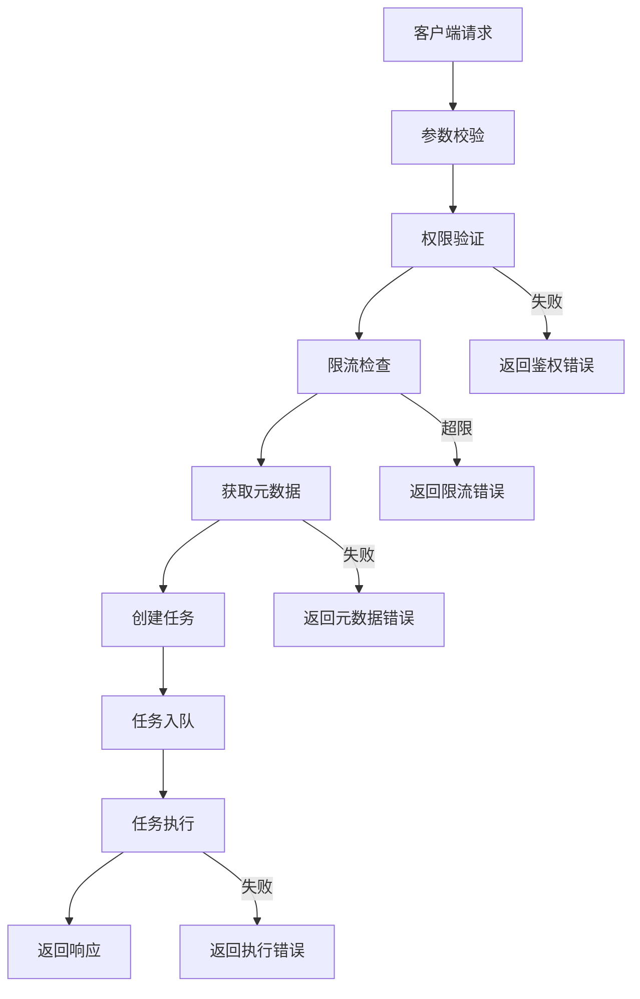
```mermaid
flowchart TD
    Start[客户端请求] --> Validate[参数校验]
    Validate --> Auth[权限验证]
    Auth --> RateLimit[限流检查]
    RateLimit --> GetMeta[获取元数据]
    GetMeta --> CreateTask[创建任务]
    CreateTask --> Enqueue[任务入队]
    Enqueue --> Execute[任务执行]
    Execute --> Response[返回响应]
    
    Auth -->|失败| Error1[返回鉴权错误]
    RateLimit -->|超限| Error2[返回限流错误]
    GetMeta -->|失败| Error3[返回元数据错误]
    Execute -->|失败| Error4[返回执行错误]
```

### 3.2 Insert操作流程（核心代码）

```go
// Insert 数据插入接口
// 参数：
//   ctx: 上下文，携带超时、Trace等信息
//   request: 插入请求，包含CollectionName、PartitionName、FieldsData
// 返回：
//   *milvuspb.MutationResult: 插入结果，包含IDs、Timestamp
//   error: 错误信息
func (node *Proxy) Insert(ctx context.Context, request *milvuspb.InsertRequest) (*milvuspb.MutationResult, error) {
    // 1. 健康检查
    if err := merr.CheckHealthy(node.GetStateCode()); err != nil {
        return &milvuspb.MutationResult{Status: merr.Status(err)}, nil
    }
    
    // 2. 参数校验
    if err := validateInsertRequest(request); err != nil {
        return &milvuspb.MutationResult{Status: merr.Status(err)}, nil
    }
    
    // 3. 权限验证
    if err := node.checkPrivilege(ctx, request.DbName, request.CollectionName, "Insert"); err != nil {
        return &milvuspb.MutationResult{Status: merr.Status(err)}, nil
    }
    
    // 4. 限流检查
    if err := node.simpleLimiter.Check(request.DbName, request.CollectionName, internalpb.RateType_DMLInsert, request.NumRows); err != nil {
        return &milvuspb.MutationResult{Status: merr.Status(err)}, nil
    }
    
    // 5. 获取Collection Schema
    collectionInfo, err := globalMetaCache.GetCollectionInfo(ctx, request.DbName, request.CollectionName)
    if err != nil {
        return &milvuspb.MutationResult{Status: merr.Status(err)}, nil
    }
    
    // 6. 分配行ID（如果PrimaryKey是AutoID）
    if collectionInfo.Schema.AutoID {
        rowNum := len(request.FieldsData[0].FieldData)
        idBegin, idEnd, err := node.rowIDAllocator.Alloc(uint32(rowNum))
        if err != nil {
            return &milvuspb.MutationResult{Status: merr.Status(err)}, nil
        }
        // 填充AutoID
        fillAutoID(request.FieldsData, idBegin, idEnd)
    }
    
    // 7. 数据分片（按PrimaryKey Hash）
    shards := hashPrimaryKeys(request.FieldsData, collectionInfo.ShardNum)
    
    // 8. 为每个Shard分配Segment
    segmentAllocs := make(map[string]*datapb.SegmentIDRequest)
    for shardIndex, data := range shards {
        segmentAllocs[shardIndex] = &datapb.SegmentIDRequest{
            Count: uint32(len(data)),
            ChannelName: collectionInfo.VChannels[shardIndex],
        }
    }
    segmentIDs, err := node.mixCoord.AssignSegmentID(ctx, &datapb.AssignSegmentIDRequest{
        SegmentIDRequests: segmentAllocs,
    })
    if err != nil {
        return &milvuspb.MutationResult{Status: merr.Status(err)}, nil
    }
    
    // 9. 构造InsertMsg并发布到MessageQueue
    for shardIndex, data := range shards {
        insertMsg := &msgstream.InsertMsg{
            BaseMsg: msgstream.BaseMsg{
                BeginTimestamp: request.Base.Timestamp,
                EndTimestamp:   request.Base.Timestamp,
            },
            InsertRequest: msgpb.InsertRequest{
                CollectionID: collectionInfo.CollectionID,
                PartitionID:  collectionInfo.PartitionID,
                SegmentID:    segmentIDs[shardIndex],
                FieldsData:   data,
                NumRows:      uint64(len(data)),
            },
        }
        
        // 发布到对应的DML Channel
        err := node.chMgr.getOrCreateDMLStream(collectionInfo.CollectionID).Produce(ctx, insertMsg)
        if err != nil {
            return &milvuspb.MutationResult{Status: merr.Status(err)}, nil
    }
    }
    
    // 10. 返回结果
    return &milvuspb.MutationResult{
        Status: merr.Success(),
        IDs:    extractPrimaryKeys(request.FieldsData),
        Timestamp: request.Base.Timestamp,
    }, nil
}
```

**流程说明**：

1. **健康检查**：确保Proxy状态为Healthy
2. **参数校验**：检查CollectionName非空、FieldsData格式正确
3. **权限验证**：检查用户是否有Insert权限
4. **限流检查**：检查是否超过DML配额
5. **Schema查询**：从MetaCache获取Collection元信息
6. **ID分配**：为AutoID字段分配唯一ID
7. **数据分片**：按PrimaryKey哈希分配到不同Shard
8. **Segment分配**：向DataCoord请求Segment ID
9. **消息发布**：构造InsertMsg发布到Message Queue
10. **返回结果**：返回插入成功的ID列表

### 3.3 Search操作流程（核心代码）

```go
// Search 向量检索接口
// 参数：
//   ctx: 上下文
//   request: 检索请求，包含CollectionName、Vector、TopK、MetricType
// 返回：
//   *milvuspb.SearchResults: 检索结果
//   error: 错误信息
func (node *Proxy) Search(ctx context.Context, request *milvuspb.SearchRequest) (*milvuspb.SearchResults, error) {
    // 1-4步与Insert类似：健康检查、参数校验、权限验证、限流检查
    
    // 5. 获取Collection信息
    collectionInfo, err := globalMetaCache.GetCollectionInfo(ctx, request.DbName, request.CollectionName)
    if err != nil {
        return &milvuspb.SearchResults{Status: merr.Status(err)}, nil
    }
    
    // 6. 获取QueryNode分片信息
    shardLeaders, err := globalMetaCache.GetShards(ctx, request.DbName, request.CollectionName)
    if err != nil {
        return &milvuspb.SearchResults{Status: merr.Status(err)}, nil
    }
    
    // 7. 构造SearchRequest分发到每个Shard
    searchRequests := make([]*querypb.SearchRequest, 0, len(shardLeaders))
    for _, leader := range shardLeaders {
        searchRequests = append(searchRequests, &querypb.SearchRequest{
            Req:             request,
            DmlChannels:     []string{leader.ChannelName},
            SegmentIDs:      leader.SegmentIDs,
            FromShardLeader: true,
        })
    }
    
    // 8. 并发查询所有Shard
    results := make([]*internalpb.SearchResults, len(searchRequests))
    var wg sync.WaitGroup
    var mu sync.Mutex
    errors := make([]error, len(searchRequests))
    
    for i, req := range searchRequests {
        wg.Add(1)
        go func(index int, request *querypb.SearchRequest) {
            defer wg.Done()
            
            // 选择QueryNode（负载均衡）
            queryNode, err := node.shardMgr.GetQueryNode(shardLeaders[index].NodeID)
            if err != nil {
                mu.Lock()
                errors[index] = err
                mu.Unlock()
                return
            }
            
            // 发起RPC调用
            result, err := queryNode.Search(ctx, request)
            if err != nil {
                mu.Lock()
                errors[index] = err
                mu.Unlock()
                return
            }
            
            mu.Lock()
            results[index] = result
            mu.Unlock()
        }(i, req)
    }
    wg.Wait()
    
    // 9. 检查错误
    for _, err := range errors {
        if err != nil {
            return &milvuspb.SearchResults{Status: merr.Status(err)}, nil
        }
    }
    
    // 10. 归并结果（全局TopK）
    finalResult := mergeSearchResults(results, request.TopK)
    
    return &milvuspb.SearchResults{
        Status:  merr.Success(),
        Results: finalResult,
    }, nil
}

// mergeSearchResults 归并多个Shard的检索结果
// 参数：
//   results: 各Shard的局部TopK结果
//   topK: 全局TopK数量
// 返回：
//   *schemapb.SearchResultData: 全局TopK结果
func mergeSearchResults(results []*internalpb.SearchResults, topK int64) *schemapb.SearchResultData {
    // 使用最小堆归并各Shard的结果
    heap := &ResultHeap{}
    heap.Init(topK)
    
    for _, result := range results {
        for _, item := range result.GetSlicedBlob() {
            heap.Push(item)
        }
    }
    
    // 提取TopK结果
    return heap.GetTopK()
}
```

**流程说明**：

1-4. 前置检查（同Insert）

1. 查询Collection元信息
2. 获取Shard信息（QueryNode映射）
3. 构造分片查询请求
4. 并发查询所有Shard
5. 错误检查
6. 归并结果（全局TopK）

### 3.4 复杂度分析

**Insert操作**：

- 时间复杂度：O(N)，N为插入行数
- 空间复杂度：O(N)
- 瓶颈：数据序列化、Message Queue写入

**Search操作**：

- 时间复杂度：O(K * log(M))，K为TopK，M为总结果数
- 空间复杂度：O(K * S)，S为Shard数量
- 瓶颈：QueryNode向量检索、网络传输、结果归并

## 4. 关键数据结构

### 4.1 Proxy结构体

```go
// Proxy Milvus接入层核心结构
type Proxy struct {
    ctx    context.Context    // 上下文
    cancel context.CancelFunc  // 取消函数
    
    stateCode atomic.Int32  // 状态码（Abnormal/Initializing/Healthy）
    
    // 协调器客户端
    mixCoord types.MixCoordClient  // 混合协调器客户端
    
    // 资源管理
    rowIDAllocator *allocator.IDAllocator      // 行ID分配器
    tsoAllocator   *timestampAllocator         // 时间戳分配器
    
    // 任务调度
    sched *taskScheduler  // 任务调度器（管理三个队列）
    
    // 限流
    simpleLimiter *SimpleLimiter  // 简单限流器
    
    // 通道与分片管理
    chMgr    channelsMgr      // 通道管理器
    shardMgr shardClientMgr   // 分片客户端管理器
    
    // 会话与注册
    session *sessionutil.Session  // etcd会话
    
    // 负载均衡
    lbPolicy LBPolicy  // 负载均衡策略
    
    // 资源管理
    resourceManager resource.Manager  // 资源管理器
}
```

### 4.2 TaskScheduler结构体

```go
// taskScheduler 任务调度器
type taskScheduler struct {
    ctx    context.Context
    cancel context.CancelFunc
    wg     sync.WaitGroup
    
    // 三个任务队列
    ddQueue *TaskQueue  // DDL队列（串行）
    dmQueue *TaskQueue  // DML队列（并发）
    dqQueue *TaskQueue  // DQL队列（并发）
    
    // 分配器
    tsoAllocator *timestampAllocator
}

// TaskQueue 任务队列
type TaskQueue struct {
    tasks chan task  // 任务通道
    maxCapacity int  // 最大容量
}
```

### 4.3 MetaCache结构体

```go
// MetaCache Collection元数据缓存
type MetaCache struct {
    mu sync.RWMutex
    
    // Collection映射：dbName -> collectionName -> CollectionInfo
    collectionInfo map[string]map[string]*CollectionInfo
    
    // Shard映射：dbName -> collectionName -> ShardLeaders
    shardLeaders map[string]map[string]*ShardLeaders
    
    // 失效时间戳
    invalidateTimestamp map[int64]uint64
}

// CollectionInfo Collection元信息
type CollectionInfo struct {
    CollectionID   int64
    Schema         *schemapb.CollectionSchema
    ShardNum       int32
    VChannels      []string  // Virtual Channel列表
    PartitionIDs   []int64
    CreatedTimestamp uint64
}
```

## 5. 配置与可观测

### 5.1 关键配置项

| 配置项 | 默认值 | 说明 |
|--------|--------|------|
| `proxy.port` | 19530 | gRPC监听端口 |
| `proxy.maxTaskNum` | 1024 | 任务队列最大长度 |
| `proxy.timeTickInterval` | 200ms | 时间戳同步间隔 |
| `proxy.msgStreamTimeTickBufSize` | 512 | TimeTick缓冲大小 |
| `proxy.maxNameLength` | 255 | Collection/Field名称最大长度 |
| `proxy.maxFieldNum` | 64 | Collection最大字段数 |
| `proxy.maxDimension` | 32768 | 向量最大维度 |
| `proxy.maxShardNum` | 64 | Collection最大Shard数 |

### 5.2 Metrics指标

**请求指标**：

- `milvus_proxy_req_count`：请求计数（按类型、状态）
- `milvus_proxy_req_latency`：请求延迟（P50/P95/P99）
- `milvus_proxy_insert_latency`：插入延迟
- `milvus_proxy_search_latency`：检索延迟

**限流指标**：

- `milvus_proxy_rate_limit_req_count`：限流请求数
- `milvus_proxy_quota_check_latency`：配额检查延迟

**缓存指标**：

- `milvus_proxy_meta_cache_hit_count`：元数据缓存命中数
- `milvus_proxy_meta_cache_miss_count`：元数据缓存未命中数

**连接指标**：

- `milvus_proxy_connection_num`：当前连接数
- `milvus_proxy_register_user_num`：注册用户数

### 5.3 日志

**关键日志**：

- 请求接收与处理：`Info`级别
- 权限验证失败：`Warn`级别
- 限流触发：`Warn`级别
- RPC调用失败：`Error`级别
- 慢查询（> 5s）：`Warn`级别

## 6. 扩展点

### 6.1 负载均衡策略

当前支持：

- **LookAsideBalancer**：优先选择负载最低的QueryNode
- **RoundRobinBalancer**：轮询选择QueryNode

扩展方式：

```go
type LBPolicy interface {
    SelectNode(ctx context.Context, availableNodes []int64) (int64, error)
}
```

### 6.2 限流策略

当前支持：

- Token Bucket算法
- 按Database/Collection粒度限流

扩展方式：

```go
type Limiter interface {
    Check(db, collection string, rateType RateType, n int64) error
}
```

---

**相关文档**：

- [Milvus-01-Proxy-API.md](./Milvus-01-Proxy-API.md)
- [Milvus-01-Proxy-数据结构.md](./Milvus-01-Proxy-数据结构.md)
- [Milvus-01-Proxy-时序图.md](./Milvus-01-Proxy-时序图.md)

---

## API接口

本文档详细说明Proxy模块对外提供的所有API接口，包括DDL、DML、DQL操作。

## API分类

Proxy模块实现`milvuspb.MilvusService`接口，提供以下类别的API：

1. **DDL（数据定义）**：CreateCollection、DropCollection、AlterCollection等
2. **DML（数据操作）**：Insert、Delete、Upsert
3. **DQL（数据查询）**：Search、Query、Get
4. **管理类**：CreateUser、CreateRole、ShowCollections等
5. **系统类**：GetComponentStates、GetMetrics等

---

## 1. DDL API

### 1.1 CreateCollection

#### 基本信息
- **名称**：`CreateCollection`
- **协议**：gRPC `milvuspb.MilvusService/CreateCollection`
- **幂等性**：否（重复创建返回已存在错误）

#### 请求结构体

```go
// CreateCollectionRequest 创建集合请求
type CreateCollectionRequest struct {
    Base              *commonpb.MsgBase       // 基础消息信息（MsgID、Timestamp等）
    DbName            string                   // 数据库名，默认为空表示default数据库
    CollectionName    string                   // 集合名，必填，长度1-255
    Schema            []byte                   // Schema序列化字节，protobuf格式
    ShardsNum         int32                    // Shard数量，默认2，取值范围[1, 64]
    ConsistencyLevel  commonpb.ConsistencyLevel // 一致性级别
    Properties        []*commonpb.KeyValuePair  // 扩展属性
    NumPartitions     int64                    // 分区数（用于Partition Key）
}
```

#### 请求字段表

| 字段 | 类型 | 必填 | 默认值 | 约束 | 说明 |
|------|------|------|--------|------|------|
| DbName | string | 否 | "" | 长度≤255 | 数据库名，空表示default |
| CollectionName | string | 是 | - | 长度1-255，字母数字下划线 | 集合名 |
| Schema | bytes | 是 | - | 有效的CollectionSchema | 序列化后的Schema |
| ShardsNum | int32 | 否 | 2 | [1, 64] | 数据分片数量 |
| ConsistencyLevel | enum | 否 | Bounded | - | Strong/Bounded/Eventually |
| Properties | kv[] | 否 | [] | - | 扩展属性（如TTL、MMap） |
| NumPartitions | int64 | 否 | 0 | [0, 4096] | Partition Key分区数 |

#### 响应结构体

```go
// Status 通用状态响应
type Status struct {
    ErrorCode commonpb.ErrorCode  // 错误码（Success/UnexpectedError等）
    Reason    string              // 错误原因描述
    Code      int32               // 内部错误码
    Retriable bool                // 是否可重试
    Detail    string              // 详细错误信息
}
```

#### 响应字段表

| 字段 | 类型 | 说明 |
|------|------|------|
| ErrorCode | enum | Success=0, UnexpectedError=1, CollectionAlreadyExists=40 |
| Reason | string | 错误原因（如"collection already exists"） |
| Code | int32 | gRPC状态码 |
| Retriable | bool | 是否建议重试 |
| Detail | string | 详细堆栈信息（仅调试模式） |

#### 入口函数与核心代码

```go
// CreateCollection 创建集合
// 功能：解析Schema，分配CollectionID，持久化元数据
// 参数：
//   ctx: 请求上下文，包含超时、Trace信息
//   request: 创建集合请求
// 返回：
//   *commonpb.Status: 操作状态
//   error: Go层错误（通常为nil，错误信息在Status中）
func (node *Proxy) CreateCollection(ctx context.Context, request *milvuspb.CreateCollectionRequest) (*commonpb.Status, error) {
    // 1. 健康检查
    if err := merr.CheckHealthy(node.GetStateCode()); err != nil {
        return merr.Status(err), nil
    }
    
    // 2. 创建任务对象
    cct := &createCollectionTask{
        ctx:                     ctx,
        Condition:               NewTaskCondition(ctx),
        CreateCollectionRequest: request,
        mixCoord:                node.mixCoord,  // RootCoord客户端
    }
    
    // 3. 任务入队（DDL队列，串行执行）
    if err := node.sched.ddQueue.Enqueue(cct); err != nil {
        return merr.Status(err), nil
    }
    
    // 4. 等待任务完成
    if err := cct.WaitToFinish(); err != nil {
        return merr.Status(err), nil
    }
    
    return cct.result, nil
}
```

#### 调用链与上层函数

**任务执行逻辑**：

```go
// createCollectionTask.Execute 任务执行
func (cct *createCollectionTask) Execute(ctx context.Context) error {
    // 1. 解析Schema（从protobuf bytes反序列化）
    schema := &schemapb.CollectionSchema{}
    if err := proto.Unmarshal(cct.Schema, schema); err != nil {
        return err
    }
    
    // 2. 参数校验
    if err := validateCollectionName(cct.CollectionName); err != nil {
        return err
    }
    if err := validateSchema(schema); err != nil {
        return err
    }
    
    // 3. 调用RootCoord创建Collection
    resp, err := cct.mixCoord.CreateCollection(ctx, &milvuspb.CreateCollectionRequest{
        Base:             cct.Base,
        DbName:           cct.DbName,
        CollectionName:   cct.CollectionName,
        Schema:           cct.Schema,
        ShardsNum:        cct.ShardsNum,
        ConsistencyLevel: cct.ConsistencyLevel,
    })
    
    if err != nil {
        return err
    }
    
    // 4. 等待Collection元数据同步（从etcd）
    time.Sleep(50 * time.Millisecond)
    
    cct.result = resp
    return nil
}
```

#### 时序图

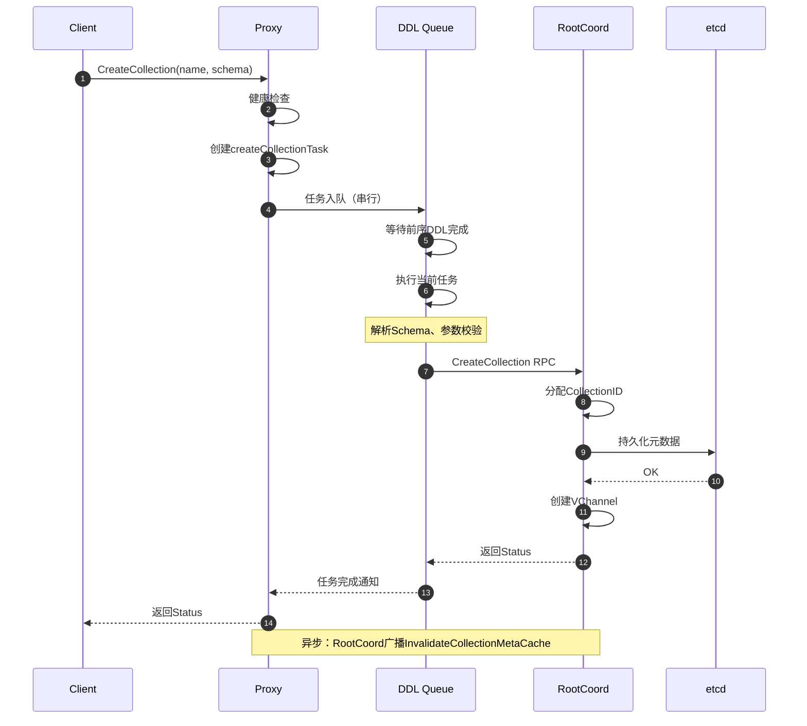
```mermaid
sequenceDiagram
    autonumber
    participant C as Client
    participant P as Proxy
    participant Q as DDL Queue
    participant RC as RootCoord
    participant E as etcd
    
    C->>P: CreateCollection(name, schema)
    P->>P: 健康检查
    P->>P: 创建createCollectionTask
    P->>Q: 任务入队（串行）
    Q->>Q: 等待前序DDL完成
    Q->>Q: 执行当前任务
    Note over Q: 解析Schema、参数校验
    Q->>RC: CreateCollection RPC
    RC->>RC: 分配CollectionID
    RC->>E: 持久化元数据
    E-->>RC: OK
    RC->>RC: 创建VChannel
    RC-->>Q: 返回Status
    Q-->>P: 任务完成通知
    P-->>C: 返回Status
    
    Note over P,RC: 异步：RootCoord广播InvalidateCollectionMetaCache
```

**时序图说明**：

1. **步骤1-3**：客户端发起请求，Proxy进行健康检查并创建任务
2. **步骤4-6**：任务进入DDL队列，串行执行避免并发冲突
3. **步骤7-8**：解析并校验Schema（字段类型、主键、向量维度等）
4. **步骤9-13**：调用RootCoord执行实际创建逻辑，包括ID分配、元数据持久化
5. **步骤14-16**：返回结果给客户端

**边界条件**：

- Collection已存在：返回`CollectionAlreadyExists`错误
- Schema无效（缺少主键、向量字段）：返回`InvalidSchema`错误
- ShardsNum超出范围：自动调整到[1, 64]

#### 异常与回退

**常见错误**：

| 错误码 | 错误原因 | 处理建议 |
|--------|----------|----------|
| CollectionAlreadyExists | 集合名已存在 | 检查名称或先删除旧集合 |
| InvalidSchema | Schema格式错误 | 检查字段定义、主键、向量维度 |
| ExceedMaxCollectionNum | 超过最大集合数 | 删除无用集合或联系管理员 |
| DatabaseNotFound | 数据库不存在 | 先创建数据库 |

**回退策略**：

- RootCoord创建失败：不影响系统状态，可直接重试
- etcd写入失败：RootCoord自动回滚，释放CollectionID

#### 实践与最佳实践

**使用示例（Python SDK）**：

```python
from pymilvus import CollectionSchema, FieldSchema, DataType, Collection

# 1. 定义Schema
fields = [
    FieldSchema(name="id", dtype=DataType.INT64, is_primary=True, auto_id=False),
    FieldSchema(name="embedding", dtype=DataType.FLOAT_VECTOR, dim=768),
    FieldSchema(name="text", dtype=DataType.VARCHAR, max_length=65535)
]
schema = CollectionSchema(fields, description="文档向量库")

# 2. 创建Collection
collection = Collection(
    name="documents",
    schema=schema,
    shards_num=4,  # 4个Shard，适合中等规模数据
    consistency_level="Bounded"  # 有界一致性，平衡性能与一致性
)
```

**最佳实践**：

1. **Shard数量选择**：
   - 小数据集（< 100万向量）：1-2 Shard
   - 中等数据集（100万-1000万）：2-4 Shard
   - 大数据集（> 1000万）：4-8 Shard
   - 经验公式：`shards_num = ceil(total_vectors / 1000000)`

2. **ConsistencyLevel选择**：
   - `Strong`：强一致性，写入后立即可见，性能稍低
   - `Bounded`：有界一致性，默认1秒延迟，推荐
   - `Eventually`：最终一致性，性能最高，适合实时性要求低的场景

3. **Schema设计**：
   - 主键字段建议使用INT64（比VARCHAR性能更好）
   - 向量维度建议为8的倍数（利用SIMD优化）
   - 标量字段不宜过多（建议≤20个），影响检索性能

4. **Properties配置**：

   ```python
   collection = Collection(
       name="documents",
       schema=schema,
       properties={
           "collection.ttl.seconds": "86400",  # 数据保留1天
           "mmap.enabled": "true"  # 启用mmap，节省内存
       }
   )
```

---

### 1.2 DropCollection

#### 基本信息
- **名称**：`DropCollection`
- **协议**：gRPC `milvuspb.MilvusService/DropCollection`
- **幂等性**：是（删除不存在的集合不报错）

#### 请求结构体

```go
type DropCollectionRequest struct {
    Base           *commonpb.MsgBase
    DbName         string  // 数据库名
    CollectionName string  // 集合名，必填
}
```

#### 请求字段表

| 字段 | 类型 | 必填 | 默认值 | 约束 | 说明 |
|------|------|------|--------|------|------|
| DbName | string | 否 | "" | - | 数据库名 |
| CollectionName | string | 是 | - | 长度1-255 | 待删除的集合名 |

#### 入口函数与核心代码

```go
// DropCollection 删除集合
func (node *Proxy) DropCollection(ctx context.Context, request *milvuspb.DropCollectionRequest) (*commonpb.Status, error) {
    if err := merr.CheckHealthy(node.GetStateCode()); err != nil {
        return merr.Status(err), nil
    }
    
    dct := &dropCollectionTask{
        ctx:                    ctx,
        Condition:              NewTaskCondition(ctx),
        DropCollectionRequest:  request,
        mixCoord:               node.mixCoord,
        chMgr:                  node.chMgr,
    }
    
    // 入DDL队列
    if err := node.sched.ddQueue.Enqueue(dct); err != nil {
        return merr.Status(err), nil
    }
    
    if err := dct.WaitToFinish(); err != nil {
        return merr.Status(err), nil
    }
    
    return dct.result, nil
}
```

#### 调用链

```go
// dropCollectionTask.Execute 任务执行
func (dct *dropCollectionTask) Execute(ctx context.Context) error {
    // 1. 调用RootCoord删除Collection
    resp, err := dct.mixCoord.DropCollection(ctx, dct.DropCollectionRequest)
    if err != nil {
        return err
    }
    
    // 2. 清理本地Channel管理器
    collID, _ := globalMetaCache.GetCollectionID(ctx, dct.DbName, dct.CollectionName)
    dct.chMgr.removeDMLStream(collID)
    
    // 3. 清理MetaCache
    globalMetaCache.RemoveCollection(ctx, dct.DbName, dct.CollectionName)
    
    dct.result = resp
    return nil
}
```

#### 时序图

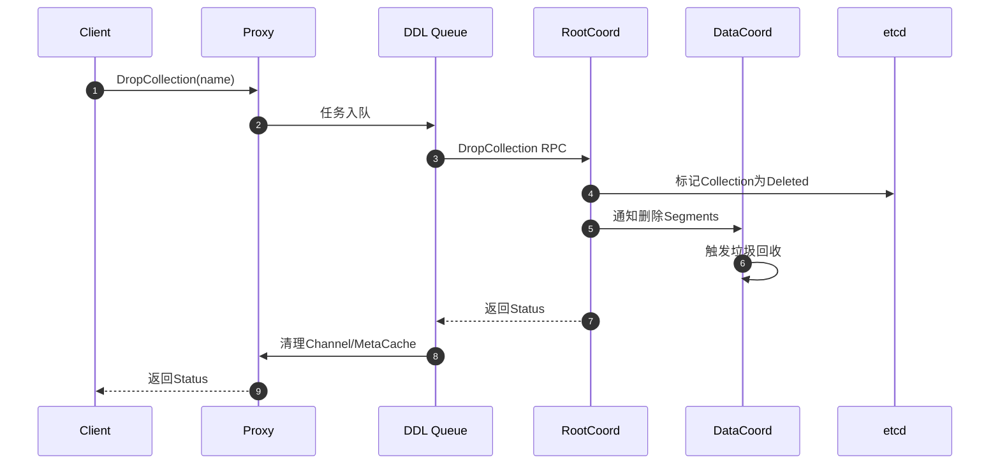
```mermaid
sequenceDiagram
    autonumber
    participant C as Client
    participant P as Proxy
    participant Q as DDL Queue
    participant RC as RootCoord
    participant DC as DataCoord
    participant E as etcd
    
    C->>P: DropCollection(name)
    P->>Q: 任务入队
    Q->>RC: DropCollection RPC
    RC->>E: 标记Collection为Deleted
    RC->>DC: 通知删除Segments
    DC->>DC: 触发垃圾回收
    RC-->>Q: 返回Status
    Q->>P: 清理Channel/MetaCache
    P-->>C: 返回Status
```

#### 异常与回退

**常见错误**：

- CollectionNotFound：集合不存在（幂等，返回成功）
- CollectionNotEmpty：集合有数据（Milvus允许删除，无此限制）

**最佳实践**：

- 删除前先Release：避免QueryNode仍在加载数据
- 批量删除：使用循环调用，注意限流

---

## 2. DML API

### 2.1 Insert

#### 基本信息
- **名称**：`Insert`
- **协议**：gRPC `milvuspb.MilvusService/Insert`
- **幂等性**：部分（按PrimaryKey去重，重复插入会被忽略）

#### 请求结构体

```go
type InsertRequest struct {
    Base           *commonpb.MsgBase
    DbName         string                 // 数据库名
    CollectionName string                 // 集合名
    PartitionName  string                 // 分区名，可选
    FieldsData     []*schemapb.FieldData  // 字段数据（列式存储）
    HashKeys       []uint32               // 预计算的Hash值（可选）
    NumRows        uint32                 // 行数
}

// FieldData 字段数据（支持多种类型）
type FieldData struct {
    Type      schemapb.DataType  // 字段类型
    FieldName string             // 字段名
    FieldId   int64              // 字段ID
    IsDynamic bool               // 是否动态字段
    
    // 根据Type选择对应字段：
    Scalars   *schemapb.ScalarField  // 标量数据
    Vectors   *schemapb.VectorField  // 向量数据
}
```

#### 请求字段表

| 字段 | 类型 | 必填 | 默认值 | 约束 | 说明 |
|------|------|------|--------|------|------|
| DbName | string | 否 | "" | - | 数据库名 |
| CollectionName | string | 是 | - | - | 集合名 |
| PartitionName | string | 否 | "_default" | - | 分区名 |
| FieldsData | FieldData[] | 是 | - | 必须包含所有必填字段 | 列式数据 |
| NumRows | uint32 | 是 | - | [1, 10000] | 单次插入行数 |

#### 响应结构体

```go
type MutationResult struct {
    Status     *commonpb.Status        // 操作状态
    IDs        *schemapb.IDs           // 插入后的主键ID列表
    SuccIndex  []uint32                // 成功插入的行索引
    ErrIndex   []uint32                // 失败的行索引
    Acknowledged bool                   // 是否已确认写入
    InsertCnt  int64                   // 成功插入数量
    DeleteCnt  int64                   // 删除数量（Insert时为0）
    UpsertCnt  int64                   // Upsert数量
    Timestamp  uint64                  // 操作时间戳
}
```

#### 响应字段表

| 字段 | 类型 | 说明 |
|------|------|------|
| Status | Status | 操作状态 |
| IDs | IDs | 插入的主键ID（自增ID或用户提供） |
| InsertCnt | int64 | 成功插入数量 |
| Timestamp | uint64 | 操作时间戳（用于一致性查询） |

#### 入口函数与核心代码

```go
// Insert 数据插入
func (node *Proxy) Insert(ctx context.Context, request *milvuspb.InsertRequest) (*milvuspb.MutationResult, error) {
    if err := merr.CheckHealthy(node.GetStateCode()); err != nil {
        return &milvuspb.MutationResult{Status: merr.Status(err)}, nil
    }
    
    // 1. 创建插入任务
    it := &insertTask{
        ctx:       ctx,
        Condition: NewTaskCondition(ctx),
        insertMsg: &msgstream.InsertMsg{
            InsertRequest: &msgpb.InsertRequest{
                DbName:         request.DbName,
                CollectionName: request.CollectionName,
                PartitionName:  request.PartitionName,
                FieldsData:     request.FieldsData,
                NumRows:        uint64(request.NumRows),
            },
        },
        idAllocator: node.rowIDAllocator,
        chMgr:       node.chMgr,
    }
    
    // 2. 入DML队列（并发执行）
    if err := node.sched.dmQueue.Enqueue(it); err != nil {
        return &milvuspb.MutationResult{Status: merr.Status(err)}, nil
    }
    
    // 3. 等待完成
    if err := it.WaitToFinish(); err != nil {
        return &milvuspb.MutationResult{Status: merr.Status(err)}, nil
    }
    
    return it.result, nil
}
```

#### 调用链

```go
// insertTask.Execute 插入任务执行
func (it *insertTask) Execute(ctx context.Context) error {
    // 1. 获取Collection元信息
    collID, err := globalMetaCache.GetCollectionID(ctx, it.insertMsg.DbName, it.insertMsg.CollectionName)
    if err != nil {
        return err
    }
    
    // 2. 分配主键ID（如果AutoID=true）
    if it.schema.AutoID {
        idBegin, idEnd, err := it.idAllocator.Alloc(uint32(it.insertMsg.NumRows))
        if err != nil {
            return err
        }
        // 填充ID到PrimaryKey字段
        fillAutoID(it.insertMsg.FieldsData, idBegin, idEnd)
    }
    
    // 3. 数据分片（按PrimaryKey哈希）
    hashValues := hashPrimaryKeys(it.insertMsg.FieldsData, it.schema)
    
    // 4. 按Shard分组数据
    shardData := groupByHash(it.insertMsg.FieldsData, hashValues, it.schema.ShardNum)
    
    // 5. 为每个Shard分配Segment
    channelNames, err := it.chMgr.getVChannels(collID)
    if err != nil {
        return err
    }
    
    // 6. 发布InsertMsg到MessageQueue
    for shardIdx, data := range shardData {
        insertMsg := &msgstream.InsertMsg{
            InsertRequest: &msgpb.InsertRequest{
                CollectionID: collID,
                PartitionID:  it.partitionID,
                FieldsData:   data,
                NumRows:      uint64(len(data)),
            },
        }
        
        // 获取或创建DML Stream
        stream, err := it.chMgr.getOrCreateDMLStream(collID)
        if err != nil {
            return err
        }
        
        // 发布消息
        if err := stream.Produce(ctx, insertMsg); err != nil {
            return err
        }
    }
    
    // 7. 构造返回结果
    it.result = &milvuspb.MutationResult{
        Status:    merr.Success(),
        IDs:       extractPrimaryKeys(it.insertMsg.FieldsData),
        InsertCnt: int64(it.insertMsg.NumRows),
        Timestamp: it.insertMsg.BeginTimestamp,
    }
    
    return nil
}
```

#### 时序图

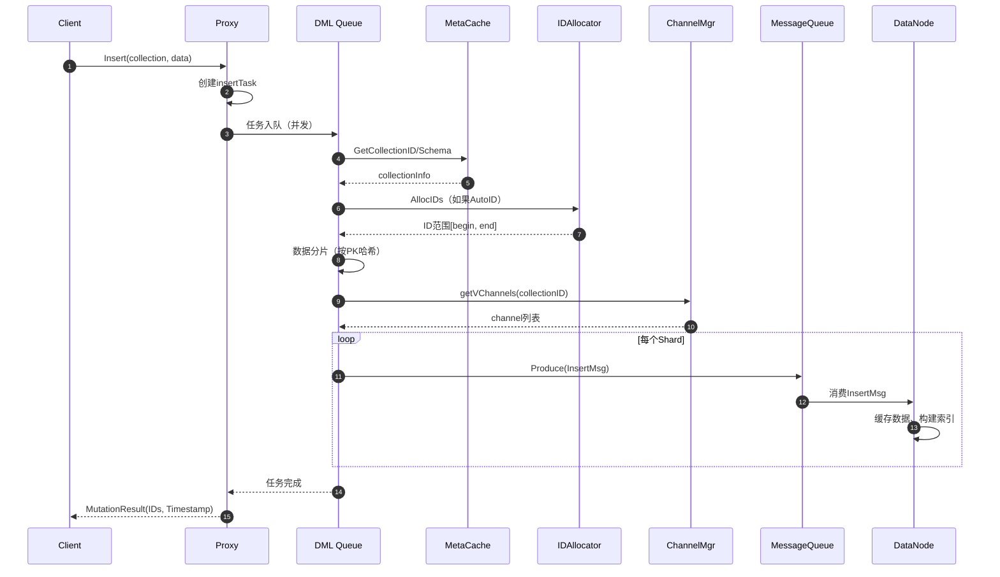
```mermaid
sequenceDiagram
    autonumber
    participant C as Client
    participant P as Proxy
    participant Q as DML Queue
    participant MC as MetaCache
    participant ID as IDAllocator
    participant CH as ChannelMgr
    participant MQ as MessageQueue
    participant DN as DataNode
    
    C->>P: Insert(collection, data)
    P->>P: 创建insertTask
    P->>Q: 任务入队（并发）
    Q->>MC: GetCollectionID/Schema
    MC-->>Q: collectionInfo
    Q->>ID: AllocIDs（如果AutoID）
    ID-->>Q: ID范围[begin, end]
    Q->>Q: 数据分片（按PK哈希）
    Q->>CH: getVChannels(collectionID)
    CH-->>Q: channel列表
    
    loop 每个Shard
        Q->>MQ: Produce(InsertMsg)
        MQ->>DN: 消费InsertMsg
        DN->>DN: 缓存数据、构建索引
    end
    
    Q-->>P: 任务完成
    P-->>C: MutationResult(IDs, Timestamp)
```

**时序图说明**：

1. **步骤1-3**：客户端发起插入请求，创建任务并入队
2. **步骤4-5**：查询Collection元信息（Schema、ShardNum等）
3. **步骤6-7**：如果主键是AutoID，分配唯一ID
4. **步骤8**：按主键哈希将数据分配到不同Shard
5. **步骤9-10**：获取Virtual Channel列表
6. **步骤11-14**：并发向多个Shard的Channel发布InsertMsg
7. **步骤15-16**：DataNode异步消费消息，缓存数据
8. **步骤17-18**：返回插入结果（包含主键ID和Timestamp）

**边界条件**：

- 单次最大插入行数：10000行（可配置）
- 字段数量：≤64个
- 向量维度：≤32768
- 字符串最大长度：65535字符

#### 异常与回退

**常见错误**：

| 错误码 | 错误原因 | 处理建议 |
|--------|---------|----------|
| InvalidFieldData | 字段类型不匹配 | 检查Schema定义 |
| MissingRequiredField | 缺少必填字段 | 补全所有必填字段 |
| ExceedMaxRows | 超过单次最大行数 | 分批插入 |
| RateLimitExceeded | 触发限流 | 降低QPS或增加配额 |

**回退策略**：

- Proxy失败：客户端可直接重试
- MessageQueue失败：Proxy自动重试3次
- DataNode消费失败：自动重试，超时后丢弃（需客户端重新插入）

#### 实践与最佳实践

**批量插入示例（Python SDK）**：

```python
from pymilvus import Collection
import numpy as np

collection = Collection("documents")

# 批量数据准备
batch_size = 1000
entities = [
    [i for i in range(batch_size)],  # id字段
    np.random.random((batch_size, 768)).tolist(),  # embedding字段
    [f"text_{i}" for i in range(batch_size)]  # text字段
]

# 插入数据
result = collection.insert(entities)
print(f"插入{result.insert_count}条数据, Timestamp: {result.timestamp}")

# 使用Timestamp查询（一致性）
collection.query(
    expr="id < 100",
    guarantee_timestamp=result.timestamp  # 保证能查到刚插入的数据
)
```

**最佳实践**：

1. **批量大小**：
   - 推荐1000-5000行/批
   - 过小：网络开销大
   - 过大：内存压力大，失败重试成本高

2. **并发控制**：

   ```python
   from concurrent.futures import ThreadPoolExecutor
   
   def insert_batch(data):
       return collection.insert(data)
   
   with ThreadPoolExecutor(max_workers=4) as executor:
       futures = [executor.submit(insert_batch, batch) for batch in batches]
       results = [f.result() for f in futures]
```

3. **错误处理**：

   ```python
   from pymilvus import exceptions
   
   try:
       result = collection.insert(entities)
   except exceptions.MilvusException as e:
       if e.code == exceptions.ErrorCode.RateLimitExceeded:
           time.sleep(1)  # 等待后重试
           result = collection.insert(entities)
       else:
           raise
```

4. **性能优化**：
   - 预计算HashKeys：减少Proxy计算开销
   - 使用流式插入（FixedWidthInsert）：适合超大批量
   - 关闭AutoFlush：手动控制Flush时机

---

### 2.2 Delete

#### 基本信息
- **名称**：`Delete`
- **协议**：gRPC `milvuspb.MilvusService/Delete`
- **幂等性**：是（删除不存在的ID不报错）

#### 请求结构体

```go
type DeleteRequest struct {
    Base           *commonpb.MsgBase
    DbName         string  // 数据库名
    CollectionName string  // 集合名
    PartitionName  string  // 分区名（可选）
    Expr           string  // 删除表达式（如"id in [1, 2, 3]"）
}
```

#### 请求字段表

| 字段 | 类型 | 必填 | 默认值 | 约束 | 说明 |
|------|------|------|--------|------|------|
| CollectionName | string | 是 | - | - | 集合名 |
| Expr | string | 是 | - | 有效的布尔表达式 | 删除条件 |
| PartitionName | string | 否 | "" | - | 分区名（限制删除范围） |

#### 入口函数与核心代码

```go
// Delete 数据删除
func (node *Proxy) Delete(ctx context.Context, request *milvuspb.DeleteRequest) (*milvuspb.MutationResult, error) {
    if err := merr.CheckHealthy(node.GetStateCode()); err != nil {
        return &milvuspb.MutationResult{Status: merr.Status(err)}, nil
    }
    
    dt := &deleteTask{
        ctx:           ctx,
        Condition:     NewTaskCondition(ctx),
        DeleteRequest: request,
        chMgr:         node.chMgr,
    }
    
    // 入DML队列
    if err := node.sched.dmQueue.Enqueue(dt); err != nil {
        return &milvuspb.MutationResult{Status: merr.Status(err)}, nil
    }
    
    if err := dt.WaitToFinish(); err != nil {
        return &milvuspb.MutationResult{Status: merr.Status(err)}, nil
    }
    
    return dt.result, nil
}
```

#### 调用链

```go
// deleteTask.Execute 删除任务执行
func (dt *deleteTask) Execute(ctx context.Context) error {
    // 1. 解析删除表达式（如"id in [1, 2, 3]"）
    primaryKeys, err := parsePrimaryKeysFromExpr(dt.Expr, dt.schema)
    if err != nil {
        return err
    }
    
    // 2. 按PrimaryKey哈希分片
    hashValues := hashPrimaryKeys(primaryKeys, dt.schema)
    shardData := groupByHash(primaryKeys, hashValues, dt.schema.ShardNum)
    
    // 3. 为每个Shard生成DeleteMsg
    for shardIdx, keys := range shardData {
        deleteMsg := &msgstream.DeleteMsg{
            DeleteRequest: &msgpb.DeleteRequest{
                CollectionID:  dt.collectionID,
                PartitionID:   dt.partitionID,
                PrimaryKeys:   keys,
                Timestamps:    []uint64{dt.BeginTimestamp},
            },
        }
        
        // 发布到MessageQueue
        stream, _ := dt.chMgr.getOrCreateDMLStream(dt.collectionID)
        if err := stream.Produce(ctx, deleteMsg); err != nil {
            return err
        }
    }
    
    // 4. 返回结果
    dt.result = &milvuspb.MutationResult{
        Status:    merr.Success(),
        DeleteCnt: int64(len(primaryKeys)),
        Timestamp: dt.BeginTimestamp,
    }
    
    return nil
}
```

#### 时序图

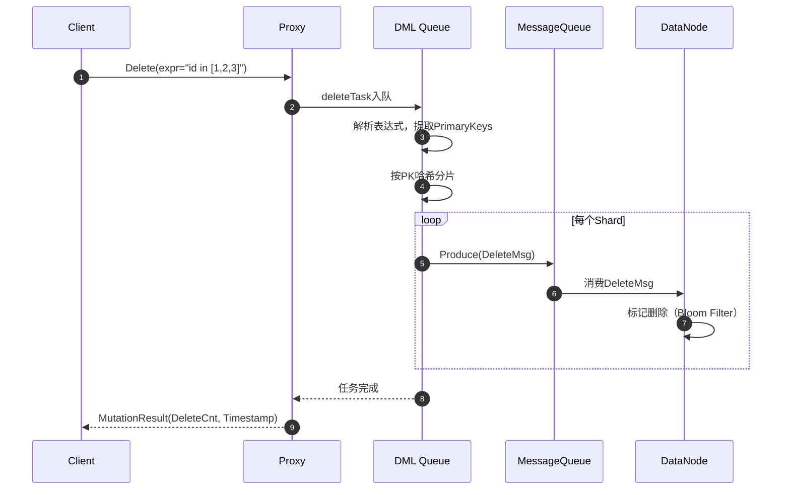
```mermaid
sequenceDiagram
    autonumber
    participant C as Client
    participant P as Proxy
    participant Q as DML Queue
    participant MQ as MessageQueue
    participant DN as DataNode
    
    C->>P: Delete(expr="id in [1,2,3]")
    P->>Q: deleteTask入队
    Q->>Q: 解析表达式，提取PrimaryKeys
    Q->>Q: 按PK哈希分片
    
    loop 每个Shard
        Q->>MQ: Produce(DeleteMsg)
        MQ->>DN: 消费DeleteMsg
        DN->>DN: 标记删除（Bloom Filter）
    end
    
    Q-->>P: 任务完成
    P-->>C: MutationResult(DeleteCnt, Timestamp)
```

#### 最佳实践

**复杂删除表达式**：

```python
# 删除单个ID
collection.delete(expr="id == 100")

# 删除ID范围
collection.delete(expr="id > 1000 and id < 2000")

# 删除多个ID
collection.delete(expr="id in [1, 2, 3, 4, 5]")

# 结合标量字段
collection.delete(expr="id < 1000 and status == 'archived'")
```

**注意事项**：

- 删除是逻辑删除（标记），物理删除由Compaction完成
- 删除后需要等待Compaction才能释放空间
- 大批量删除建议分批（每批≤1000个ID）

---

## 3. DQL API

### 3.1 Search

#### 基本信息
- **名称**：`Search`
- **协议**：gRPC `milvuspb.MilvusService/Search`
- **幂等性**：是（相同查询返回相同结果）

#### 请求结构体

```go
type SearchRequest struct {
    Base                  *commonpb.MsgBase
    DbName                string                // 数据库名
    CollectionName        string                // 集合名
    PartitionNames        []string              // 分区名列表
    Dsl                   string                // 废弃，使用Expr
    PlaceholderGroup      []byte                // 查询向量（序列化）
    DslType               commonpb.DslType      // DSL类型（BoolExprV1）
    OutputFields          []string              // 返回字段列表
    SearchParams          []*commonpb.KeyValuePair  // 搜索参数
    TravelTimestamp       uint64                // 时间旅行时间戳
    GuaranteeTimestamp    uint64                // 保证时间戳
    Nq                    int64                 // 查询向量数量
    Radius                float32               // Range Search半径
    RangeFilter           float32               // Range Search过滤阈值
    IgnoreGrowing         bool                  // 忽略Growing Segment
}
```

#### 请求字段表

| 字段 | 类型 | 必填 | 默认值 | 约束 | 说明 |
|------|------|------|--------|------|------|
| CollectionName | string | 是 | - | - | 集合名 |
| PlaceholderGroup | bytes | 是 | - | 序列化的向量 | 查询向量 |
| SearchParams | kv[] | 是 | - | 包含metric_type、topk等 | 搜索参数 |
| OutputFields | string[] | 否 | [] | - | 返回字段（不含向量） |
| PartitionNames | string[] | 否 | [] | - | 指定分区搜索 |
| GuaranteeTimestamp | uint64 | 否 | 0 | - | 一致性保证 |

#### SearchParams参数

| 参数 | 类型 | 必填 | 说明 |
|------|------|------|------|
| anns_field | string | 是 | 向量字段名 |
| topk | int | 是 | TopK数量[1, 16384] |
| metric_type | string | 是 | 距离度量（L2、IP、COSINE） |
| params | JSON | 否 | 索引参数（nprobe、ef等） |
| offset | int | 否 | 分页偏移[0, 16384] |
| round_decimal | int | 否 | 距离精度（小数位数） |

#### 响应结构体

```go
type SearchResults struct {
    Status      *commonpb.Status        // 操作状态
    Results     *schemapb.SearchResultData  // 搜索结果
    CollectionName string               // 集合名
}

type SearchResultData struct {
    NumQueries int64                   // 查询向量数量
    TopK       int64                   // TopK
    FieldsData []*schemapb.FieldData   // 返回字段数据
    Scores     []float32               // 距离分数
    Ids        *schemapb.IDs           // 主键ID
    Topks      []int64                 // 每个查询实际返回数量
}
```

#### 入口函数与核心代码

```go
// Search 向量检索
func (node *Proxy) Search(ctx context.Context, request *milvuspb.SearchRequest) (*milvuspb.SearchResults, error) {
    if err := merr.CheckHealthy(node.GetStateCode()); err != nil {
        return &milvuspb.SearchResults{Status: merr.Status(err)}, nil
    }
    
    st := &searchTask{
        ctx:           ctx,
        Condition:     NewTaskCondition(ctx),
        SearchRequest: request,
        shardMgr:      node.shardMgr,
        lbPolicy:      node.lbPolicy,
    }
    
    // 入DQL队列（并发执行）
    if err := node.sched.dqQueue.Enqueue(st); err != nil {
        return &milvuspb.SearchResults{Status: merr.Status(err)}, nil
    }
    
    if err := st.WaitToFinish(); err != nil {
        return &milvuspb.SearchResults{Status: merr.Status(err)}, nil
    }
    
    return st.result, nil
}
```

#### 调用链

```go
// searchTask.Execute 搜索任务执行
func (st *searchTask) Execute(ctx context.Context) error {
    // 1. 获取Shard信息
    shardLeaders, err := globalMetaCache.GetShards(ctx, st.DbName, st.CollectionName)
    if err != nil {
        return err
    }
    
    // 2. 构造QueryNode搜索请求
    searchRequests := make([]*querypb.SearchRequest, len(shardLeaders))
    for i, leader := range shardLeaders {
        searchRequests[i] = &querypb.SearchRequest{
            Req:             st.SearchRequest,
            DmlChannels:     []string{leader.ChannelName},
            SegmentIDs:      leader.SegmentIDs,
            FromShardLeader: true,
        }
    }
    
    // 3. 并发查询所有Shard
    results := make([]*internalpb.SearchResults, len(searchRequests))
    var wg sync.WaitGroup
    var mu sync.Mutex
    errors := make([]error, len(searchRequests))
    
    for i, req := range searchRequests {
        wg.Add(1)
        go func(index int, request *querypb.SearchRequest) {
            defer wg.Done()
            
            // 选择QueryNode（负载均衡）
            queryNode, err := st.lbPolicy.SelectNode(ctx, shardLeaders[index].NodeIDs)
            if err != nil {
                mu.Lock()
                errors[index] = err
                mu.Unlock()
                return
            }
            
            // 发起RPC调用
            result, err := queryNode.Search(ctx, request)
            mu.Lock()
            if err != nil {
                errors[index] = err
            } else {
                results[index] = result
            }
            mu.Unlock()
        }(i, req)
    }
    wg.Wait()
    
    // 4. 检查错误
    for _, err := range errors {
        if err != nil {
            return err
        }
    }
    
    // 5. 归并结果（全局TopK）
    finalResult, err := mergeSearchResults(results, st.SearchRequest.Nq, st.topK)
    if err != nil {
        return err
    }
    
    st.result = &milvuspb.SearchResults{
        Status:  merr.Success(),
        Results: finalResult,
    }
    
    return nil
}

// mergeSearchResults 归并多个Shard的检索结果
func mergeSearchResults(results []*internalpb.SearchResults, nq int64, topK int64) (*schemapb.SearchResultData, error) {
    // 为每个查询向量创建最小堆
    heaps := make([]*ResultHeap, nq)
    for i := range heaps {
        heaps[i] = NewResultHeap(topK)
    }
    
    // 将所有Shard的结果放入堆
    for _, result := range results {
        for queryIdx := 0; queryIdx < int(nq); queryIdx++ {
            // 提取该查询的所有结果
            offset := queryIdx * int(topK)
            for k := 0; k < int(topK); k++ {
                if offset+k >= len(result.Scores) {
                    break
                }
                heaps[queryIdx].Push(&SearchResult{
                    ID:    result.Ids.GetIntId().Data[offset+k],
                    Score: result.Scores[offset+k],
                    Fields: extractFields(result.FieldsData, offset+k),
                })
            }
        }
    }
    
    // 从堆中提取TopK结果
    merged := &schemapb.SearchResultData{
        NumQueries: nq,
        TopK:       topK,
        Ids:        &schemapb.IDs{IdField: &schemapb.IDs_IntId{IntId: &schemapb.LongArray{Data: []int64{}}}},
        Scores:     []float32{},
        Topks:      []int64{},
    }
    
    for _, heap := range heaps {
        topKResults := heap.GetTopK()
        merged.Topks = append(merged.Topks, int64(len(topKResults)))
        for _, result := range topKResults {
            merged.Ids.GetIntId().Data = append(merged.Ids.GetIntId().Data, result.ID)
            merged.Scores = append(merged.Scores, result.Score)
        }
    }
    
    return merged, nil
}
```

#### 时序图

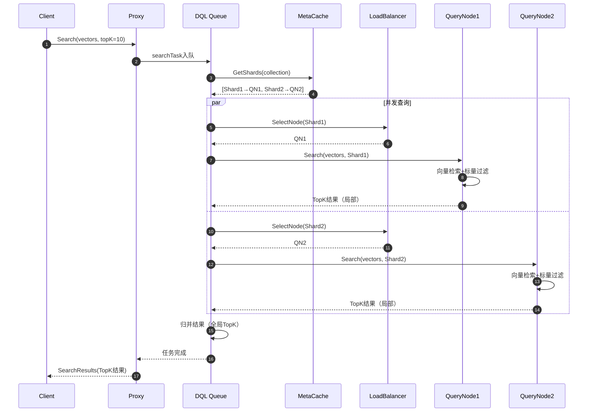
```mermaid
sequenceDiagram
    autonumber
    participant C as Client
    participant P as Proxy
    participant Q as DQL Queue
    participant MC as MetaCache
    participant LB as LoadBalancer
    participant QN1 as QueryNode1
    participant QN2 as QueryNode2
    
    C->>P: Search(vectors, topK=10)
    P->>Q: searchTask入队
    Q->>MC: GetShards(collection)
    MC-->>Q: [Shard1→QN1, Shard2→QN2]
    
    par 并发查询
        Q->>LB: SelectNode(Shard1)
        LB-->>Q: QN1
        Q->>QN1: Search(vectors, Shard1)
        QN1->>QN1: 向量检索+标量过滤
        QN1-->>Q: TopK结果（局部）
    and
        Q->>LB: SelectNode(Shard2)
        LB-->>Q: QN2
        Q->>QN2: Search(vectors, Shard2)
        QN2->>QN2: 向量检索+标量过滤
        QN2-->>Q: TopK结果（局部）
    end
    
    Q->>Q: 归并结果（全局TopK）
    Q-->>P: 任务完成
    P-->>C: SearchResults(TopK结果)
```

#### 最佳实践

**基础检索示例**：

```python
from pymilvus import Collection
import numpy as np

collection = Collection("documents")

# 准备查询向量
query_vectors = np.random.random((1, 768)).tolist()

# 基础检索
results = collection.search(
    data=query_vectors,
    anns_field="embedding",
    param={"metric_type": "L2", "params": {"nprobe": 10}},
    limit=10,  # TopK
    output_fields=["id", "text"]
)

for hits in results:
    for hit in hits:
        print(f"ID: {hit.id}, 距离: {hit.distance}, 文本: {hit.entity.get('text')}")
```

**高级检索（标量过滤）**：

```python
# 结合标量过滤
results = collection.search(
    data=query_vectors,
    anns_field="embedding",
    param={"metric_type": "COSINE", "params": {"ef": 64}},
    limit=10,
    expr="status == 'published' and views > 1000",  # 标量过滤
    output_fields=["title", "author", "views"]
)
```

**Range Search**：

```python
# 范围检索（返回距离在[0.5, 0.8]内的所有结果）
results = collection.search(
    data=query_vectors,
    anns_field="embedding",
    param={"metric_type": "L2"},
    limit=100,  # 最大返回数量
    radius=0.5,  # 最小距离
    range_filter=0.8  # 最大距离
)
```

**批量检索**：

```python
# 批量查询（多个查询向量）
query_vectors = np.random.random((10, 768)).tolist()  # 10个查询
results = collection.search(
    data=query_vectors,
    anns_field="embedding",
    param={"metric_type": "IP", "params": {"nprobe": 16}},
    limit=5
)

# results是一个列表，每个元素对应一个查询向量的TopK结果
for idx, hits in enumerate(results):
    print(f"查询{idx}的结果:")
    for hit in hits:
        print(f"  ID: {hit.id}, 得分: {hit.score}")
```

**性能优化参数**：

```python
# HNSW索引参数
results = collection.search(
    data=query_vectors,
    anns_field="embedding",
    param={
        "metric_type": "L2",
        "params": {
            "ef": 128  # HNSW搜索深度，越大召回率越高但速度越慢
        }
    },
    limit=10
)

# IVF索引参数
results = collection.search(
    data=query_vectors,
    anns_field="embedding",
    param={
        "metric_type": "IP",
        "params": {
            "nprobe": 32  # 搜索的聚类中心数，越大召回率越高但速度越慢
        }
    },
    limit=10
)
```

**一致性保证**：

```python
# 使用Timestamp保证一致性
insert_result = collection.insert(entities)

# 保证能查到刚插入的数据
results = collection.search(
    data=query_vectors,
    anns_field="embedding",
    param={"metric_type": "L2"},
    limit=10,
    guarantee_timestamp=insert_result.timestamp  # 使用插入时的时间戳
)
```

---

## 4. 管理类API（简要说明）

由于篇幅限制，以下API提供简要说明：

### 4.1 Collection管理

| API | 功能 | 请求参数 | 响应 |
|-----|------|----------|------|
| **DescribeCollection** | 查询Collection元信息 | CollectionName | Schema、ShardNum、CollectionID |
| **ShowCollections** | 列出所有Collection | DbName | CollectionNames[] |
| **HasCollection** | 检查Collection是否存在 | CollectionName | bool |
| **AlterCollection** | 修改Collection属性 | CollectionName、Properties | Status |
| **RenameCollection** | 重命名Collection | OldName、NewName | Status |

### 4.2 Partition管理

| API | 功能 | 请求参数 | 响应 |
|-----|------|----------|------|
| **CreatePartition** | 创建分区 | CollectionName、PartitionName | Status |
| **DropPartition** | 删除分区 | CollectionName、PartitionName | Status |
| **ShowPartitions** | 列出所有分区 | CollectionName | PartitionNames[] |
| **HasPartition** | 检查分区是否存在 | CollectionName、PartitionName | bool |

### 4.3 Index管理

| API | 功能 | 请求参数 | 响应 |
|-----|------|----------|------|
| **CreateIndex** | 创建索引 | CollectionName、FieldName、IndexParams | Status |
| **DropIndex** | 删除索引 | CollectionName、FieldName、IndexName | Status |
| **DescribeIndex** | 查询索引信息 | CollectionName、FieldName | IndexDescriptions[] |

### 4.4 Load/Release

| API | 功能 | 请求参数 | 响应 |
|-----|------|----------|------|
| **LoadCollection** | 加载Collection到内存 | CollectionName、ReplicaNumber | Status |
| **ReleaseCollection** | 从内存卸载Collection | CollectionName | Status |
| **GetLoadingProgress** | 查询加载进度 | CollectionName | Progress% |
| **GetLoadState** | 查询加载状态 | CollectionName | LoadState |

### 4.5 权限管理

| API | 功能 | 请求参数 | 响应 |
|-----|------|----------|------|
| **CreateCredential** | 创建用户 | Username、Password | Status |
| **DeleteCredential** | 删除用户 | Username | Status |
| **UpdateCredential** | 更新密码 | Username、OldPassword、NewPassword | Status |
| **ListCredUsers** | 列出所有用户 | - | Usernames[] |

---

## 5. 系统类API

### 5.1 GetComponentStates

**功能**：查询Proxy健康状态

**请求**：

```go
type GetComponentStatesRequest struct {}
```

**响应**：

```go
type ComponentStates struct {
    State  *ComponentInfo    // 状态信息
    Status *commonpb.Status  // 操作状态
}

type ComponentInfo struct {
    NodeID    int64                 // 节点ID
    Role      string                // 角色（Proxy）
    StateCode commonpb.StateCode    // 状态码（Healthy/Abnormal）
}
```

**使用场景**：

- 健康检查
- 负载均衡器探活
- 监控告警

### 5.2 GetMetrics

**功能**：查询Proxy运行指标

**请求**：

```go
type GetMetricsRequest struct {
    Base    *commonpb.MsgBase
    Request string  // JSON格式的指标查询请求
}
```

**支持的指标类型**：

- `system_info`：系统信息（CPU、内存、版本等）
- `connected_clients`：连接客户端数
- `quota_metrics`：配额使用情况

---

## 6. API使用最佳实践总结

### 6.1 错误处理

```python
from pymilvus import Collection, exceptions

collection = Collection("test")

try:
    results = collection.search(...)
except exceptions.MilvusException as e:
    if e.code == exceptions.ErrorCode.CollectionNotFound:
        print("集合不存在，请先创建")
    elif e.code == exceptions.ErrorCode.RateLimitExceeded:
        print("触发限流，请降低QPS")
    else:
        print(f"未知错误: {e}")
```

### 6.2 性能优化

**批量操作**：

- Insert：单批1000-5000行
- Search：单批≤10个查询向量
- Delete：单批≤1000个ID

**并发控制**：

- 单Proxy：4-8并发连接
- 多Proxy：水平扩展

**连接复用**：

```python
from pymilvus import connections

# 创建连接池
connections.connect(
    alias="default",
    host="localhost",
    port="19530",
    pool_size=10  # 连接池大小
)
```

### 6.3 监控指标

**关键Metrics**：

- `milvus_proxy_req_latency`：请求延迟
- `milvus_proxy_req_count`：请求计数
- `milvus_proxy_rate_limit_req_count`：限流请求数

**告警阈值**：

- 请求延迟P99 > 1s
- 限流请求数 > 10% QPS
- 连接数 > 80%最大连接数

---

**相关文档**：

- [Milvus-01-Proxy-概览.md](./Milvus-01-Proxy-概览.md)
- [Milvus-01-Proxy-数据结构.md](./Milvus-01-Proxy-数据结构.md)
- [Milvus-01-Proxy-时序图.md](./Milvus-01-Proxy-时序图.md)
- [Milvus API参考](https://milvus.io/api-reference/pymilvus/v2.4.x/About.md)

---

## 数据结构

本文档详细说明Proxy模块中的关键数据结构，包括核心类、任务类、缓存类等。

## 1. 核心数据结构 UML图

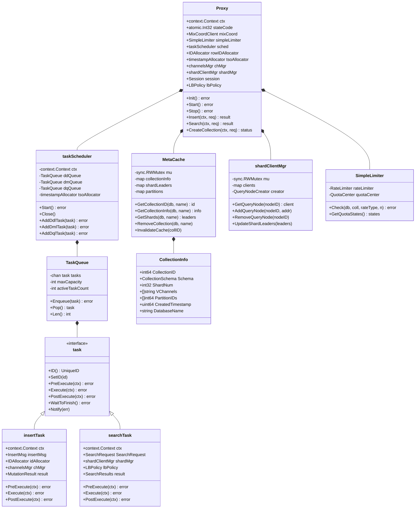
```mermaid
classDiagram
    class Proxy {
        +context.Context ctx
        +atomic.Int32 stateCode
        +MixCoordClient mixCoord
        +SimpleLimiter simpleLimiter
        +taskScheduler sched
        +IDAllocator rowIDAllocator
        +timestampAllocator tsoAllocator
        +channelsMgr chMgr
        +shardClientMgr shardMgr
        +Session session
        +LBPolicy lbPolicy
        
        +Init() error
        +Start() error
        +Stop() error
        +Insert(ctx, req) result
        +Search(ctx, req) result
        +CreateCollection(ctx, req) status
    }
    
    class taskScheduler {
        -context.Context ctx
        -TaskQueue ddQueue
        -TaskQueue dmQueue
        -TaskQueue dqQueue
        -timestampAllocator tsoAllocator
        
        +Start() error
        +Close()
        +AddDdlTask(task) error
        +AddDmlTask(task) error
        +AddDqlTask(task) error
    }
    
    class TaskQueue {
        -chan task tasks
        -int maxCapacity
        -int activeTaskCount
        
        +Enqueue(task) error
        +Pop() task
        +Len() int
    }
    
    class task {
        <<interface>>
        +ID() UniqueID
        +SetID(id)
        +PreExecute(ctx) error
        +Execute(ctx) error
        +PostExecute(ctx) error
        +WaitToFinish() error
        +Notify(err)
    }
    
    class insertTask {
        +context.Context ctx
        +InsertMsg insertMsg
        +IDAllocator idAllocator
        +channelsMgr chMgr
        +MutationResult result
        
        +PreExecute(ctx) error
        +Execute(ctx) error
        +PostExecute(ctx) error
    }
    
    class searchTask {
        +context.Context ctx
        +SearchRequest SearchRequest
        +shardClientMgr shardMgr
        +LBPolicy lbPolicy
        +SearchResults result
        
        +PreExecute(ctx) error
        +Execute(ctx) error
        +PostExecute(ctx) error
    }
    
    class MetaCache {
        -sync.RWMutex mu
        -map collectionInfo
        -map shardLeaders
        -map partitions
        
        +GetCollectionID(db, name) id
        +GetCollectionInfo(db, name) info
        +GetShards(db, name) leaders
        +RemoveCollection(db, name)
        +InvalidateCache(collID)
    }
    
    class CollectionInfo {
        +int64 CollectionID
        +CollectionSchema Schema
        +int32 ShardNum
        +[]string VChannels
        +[]int64 PartitionIDs
        +uint64 CreatedTimestamp
        +string DatabaseName
    }
    
    class shardClientMgr {
        -sync.RWMutex mu
        -map clients
        -QueryNodeCreator creator
        
        +GetQueryNode(nodeID) client
        +AddQueryNode(nodeID, addr)
        +RemoveQueryNode(nodeID)
        +UpdateShardLeaders(leaders)
    }
    
    class SimpleLimiter {
        -RateLimiter rateLimiter
        -QuotaCenter quotaCenter
        
        +Check(db, coll, rateType, n) error
        +GetQuotaStates() states
    }
    
    Proxy *-- taskScheduler
    Proxy *-- MetaCache
    Proxy *-- shardClientMgr
    Proxy *-- SimpleLimiter
    taskScheduler *-- TaskQueue
    TaskQueue *-- task
    task <|-- insertTask
    task <|-- searchTask
    MetaCache *-- CollectionInfo
```

**UML图说明**：

### 1.1 核心组件关系

1. **Proxy**：核心入口，聚合所有子组件
2. **taskScheduler**：任务调度器，管理三个任务队列（DDL/DML/DQL）
3. **TaskQueue**：任务队列，FIFO存储待执行任务
4. **task接口**：所有任务的统一接口，定义执行生命周期
5. **MetaCache**：元数据缓存，减少RootCoord调用
6. **shardClientMgr**：Shard客户端管理器，维护QueryNode连接池
7. **SimpleLimiter**：限流器，实现配额管理

### 1.2 设计模式

- **Strategy模式**：task接口实现不同类型任务（Insert/Search/DDL等）
- **Singleton模式**：globalMetaCache全局单例
- **Factory模式**：QueryNodeCreator创建QueryNode客户端
- **Observer模式**：TaskCondition实现任务完成通知

---

## 2. Proxy结构体详解

### 2.1 字段说明

```go
// Proxy Milvus接入层核心结构体
type Proxy struct {
    // 上下文与生命周期管理
    ctx    context.Context      // 全局上下文，用于控制生命周期
    cancel context.CancelFunc   // 取消函数，触发优雅关闭
    wg     sync.WaitGroup       // 等待组，等待goroutine退出
    
    // 状态管理
    stateCode atomic.Int32      // 原子状态码：Abnormal=0, Initializing=1, Healthy=2
    
    // 服务端信息
    address string               // 服务地址（host:port）
    ip      string              // IP地址
    port    int                 // 端口号
    
    // RPC客户端
    mixCoord types.MixCoordClient  // 混合协调器客户端（封装RootCoord/DataCoord/QueryCoord）
    
    // 资源分配器
    rowIDAllocator *allocator.IDAllocator        // 行ID分配器（AutoID场景）
    tsoAllocator   *timestampAllocator          // 时间戳分配器（TSO）
    
    // 任务调度
    sched *taskScheduler         // 任务调度器
    
    // 限流与配额
    simpleLimiter *SimpleLimiter  // 限流器
    
    // 通道与分片管理
    chMgr    channelsMgr         // DML Channel管理器
    shardMgr shardClientMgr      // Shard客户端管理器（QueryNode连接池）
    
    // Session与服务发现
    session *sessionutil.Session  // etcd会话，用于服务注册与心跳
    
    // 负载均衡
    lbPolicy LBPolicy            // 负载均衡策略（RoundRobin/LookAside）
    
    // 回调函数
    startCallbacks []func()      // 启动回调
    closeCallbacks []func()      // 关闭回调
    
    // 特性开关
    enableMaterializedView      bool  // 是否启用物化视图
    enableComplexDeleteLimit    bool  // 是否启用复杂删除限流
    
    // 监控与指标
    metricsCacheManager *metricsinfo.MetricsCacheManager  // 指标缓存管理器
    slowQueries         *expirable.LRU[Timestamp, *metricsinfo.SlowQuery]  // 慢查询缓存
    
    // 资源管理
    resourceManager resource.Manager  // 资源管理器（内存、CPU等）
}
```

### 2.2 生命周期方法

| 方法 | 阶段 | 功能 | 调用顺序 |
|------|------|------|----------|
| `NewProxy` | 创建 | 创建Proxy实例，初始化基础字段 | 1 |
| `Init` | 初始化 | 初始化Session、分配器、调度器、MetaCache | 2 |
| `Start` | 启动 | 启动调度器、分配器，注册服务 | 3 |
| `Register` | 注册 | 注册到etcd，开始接收请求 | 4 |
| `Stop` | 停止 | 停止调度器、关闭连接、注销服务 | 5 |

### 2.3 核心方法

**健康检查**：

```go
// GetStateCode 获取当前状态码
func (node *Proxy) GetStateCode() commonpb.StateCode {
    return commonpb.StateCode(node.stateCode.Load())
}

// UpdateStateCode 更新状态码（原子操作）
func (node *Proxy) UpdateStateCode(code commonpb.StateCode) {
    node.stateCode.Store(int32(code))
}
```

**资源获取**：

```go
// GetRateLimiter 获取限流器
func (node *Proxy) GetRateLimiter() (types.Limiter, error) {
    if node.simpleLimiter == nil {
        return nil, errors.New("nil rate limiter")
    }
    return node.simpleLimiter, nil
}
```

---

## 3. 任务相关数据结构

### 3.1 task接口

```go
// task 任务接口，定义任务执行生命周期
type task interface {
    // 基础方法
    ID() UniqueID                  // 获取任务唯一ID
    SetID(uid UniqueID)            // 设置任务ID
    Name() string                  // 获取任务名称
    Type() commonpb.MsgType        // 获取任务类型（Insert/Search等）
    
    // 时间戳
    BeginTs() Timestamp            // 获取开始时间戳
    EndTs() Timestamp              // 获取结束时间戳
    SetTs(ts Timestamp)            // 设置时间戳
    
    // 执行阶段
    PreExecute(ctx context.Context) error   // 前置处理（参数校验、权限验证）
    Execute(ctx context.Context) error      // 核心执行逻辑
    PostExecute(ctx context.Context) error  // 后置处理（结果封装）
    
    // 异步通知
    WaitToFinish() error           // 等待任务完成
    Notify(err error)              // 通知任务完成
    
    // 上下文
    Context() context.Context      // 获取任务上下文
    Cancel()                       // 取消任务
}
```

**接口说明**：

- **执行阶段**：三阶段模式确保任务结构清晰
  1. PreExecute：参数校验、权限验证、元数据查询
  2. Execute：核心业务逻辑（RPC调用、消息发布等）
  3. PostExecute：结果封装、指标上报

- **异步机制**：
  - `WaitToFinish()`：阻塞等待任务完成
  - `Notify(err)`：任务完成后通知等待者

### 3.2 insertTask结构体

```go
// insertTask 插入任务
type insertTask struct {
    // 嵌入Condition实现异步通知
    Condition
    
    // 上下文
    ctx context.Context
    
    // 请求数据
    insertMsg *msgstream.InsertMsg    // 插入消息（包含所有字段数据）
    
    // 依赖组件
    idAllocator     *allocator.IDAllocator  // ID分配器（AutoID场景）
    chMgr           channelsMgr             // Channel管理器
    segmentIDAssigner segmentIDAssigner     // Segment分配器
    
    // 元数据
    collectionID   int64                    // 集合ID
    partitionID    int64                    // 分区ID
    schema         *schemapb.CollectionSchema  // Schema信息
    partitionKeys  *schemapb.FieldData      // Partition Key数据
    
    // 结果
    result *milvuspb.MutationResult        // 插入结果
    
    // 时间戳
    ts             Timestamp                // 任务时间戳
    rowIDBegin     int64                    // 分配的行ID起始值
    rowIDEnd       int64                    // 分配的行ID结束值
}
```

**关键字段**：

| 字段 | 类型 | 说明 |
|------|------|------|
| insertMsg | *InsertMsg | 包含所有插入数据（列式存储） |
| idAllocator | *IDAllocator | AutoID场景下分配唯一ID |
| chMgr | channelsMgr | 管理DML Channel，用于发布消息 |
| schema | *CollectionSchema | 集合Schema，用于数据校验和分片 |
| result | *MutationResult | 插入结果（包含主键ID和Timestamp） |

**执行流程**：

```go
// PreExecute 前置处理
func (it *insertTask) PreExecute(ctx context.Context) error {
    // 1. 获取Collection元信息
    it.schema, err = globalMetaCache.GetCollectionSchema(ctx, it.insertMsg.DbName, it.insertMsg.CollectionName)
    
    // 2. 参数校验
    if err := validateInsertRequest(it.insertMsg, it.schema); err != nil {
        return err
    }
    
    // 3. 分配时间戳
    it.ts, err = it.tsoAllocator.AllocOne(ctx)
    
    return nil
}

// Execute 核心执行
func (it *insertTask) Execute(ctx context.Context) error {
    // 1. 分配行ID（AutoID场景）
    if it.schema.AutoID {
        it.rowIDBegin, it.rowIDEnd, err = it.idAllocator.Alloc(uint32(it.insertMsg.NumRows))
        fillAutoID(it.insertMsg.FieldsData, it.rowIDBegin, it.rowIDEnd)
    }
    
    // 2. 数据分片
    hashValues := hashPrimaryKeys(it.insertMsg.FieldsData, it.schema)
    shardData := groupByHash(it.insertMsg.FieldsData, hashValues, it.schema.ShardNum)
    
    // 3. 发布消息到MessageQueue
    for shardIdx, data := range shardData {
        insertMsg := constructInsertMsg(data, it.collectionID, it.partitionID, it.ts)
        stream, _ := it.chMgr.getOrCreateDMLStream(it.collectionID)
        err = stream.Produce(ctx, insertMsg)
    }
    
    return nil
}

// PostExecute 后置处理
func (it *insertTask) PostExecute(ctx context.Context) error {
    // 构造返回结果
    it.result = &milvuspb.MutationResult{
        Status:    merr.Success(),
        IDs:       extractPrimaryKeys(it.insertMsg.FieldsData),
        InsertCnt: int64(it.insertMsg.NumRows),
        Timestamp: it.ts,
    }
    return nil
}
```

### 3.3 searchTask结构体

```go
// searchTask 搜索任务
type searchTask struct {
    Condition
    
    ctx context.Context
    
    // 请求参数
    *milvuspb.SearchRequest        // 搜索请求（包含向量、TopK、过滤条件等）
    
    // 依赖组件
    shardMgr shardClientMgr        // Shard客户端管理器
    lbPolicy LBPolicy              // 负载均衡策略
    
    // 元数据
    collectionID int64              // 集合ID
    schema       *schemapb.CollectionSchema  // Schema
    partitionIDs []int64            // 分区ID列表
    
    // 查询参数解析
    topK       int64                // TopK数量
    metricType string               // 距离度量类型（L2/IP/COSINE）
    nq         int64                // 查询向量数量
    searchParams map[string]string  // 搜索参数（nprobe、ef等）
    
    // 结果
    result *milvuspb.SearchResults  // 搜索结果
}
```

**执行流程**：

```go
// PreExecute 前置处理
func (st *searchTask) PreExecute(ctx context.Context) error {
    // 1. 获取Collection元信息
    st.schema, err = globalMetaCache.GetCollectionSchema(ctx, st.DbName, st.CollectionName)
    
    // 2. 解析搜索参数
    st.parseSearchParams()  // 提取topK、metricType、nprobe等
    
    // 3. 参数校验
    if err := validateSearchRequest(st.SearchRequest, st.schema); err != nil {
        return err
    }
    
    return nil
}

// Execute 核心执行
func (st *searchTask) Execute(ctx context.Context) error {
    // 1. 获取Shard信息
    shardLeaders, err := globalMetaCache.GetShards(ctx, st.DbName, st.CollectionName)
    
    // 2. 构造QueryNode请求
    searchRequests := make([]*querypb.SearchRequest, len(shardLeaders))
    for i, leader := range shardLeaders {
        searchRequests[i] = &querypb.SearchRequest{
            Req:             st.SearchRequest,
            DmlChannels:     []string{leader.ChannelName},
            SegmentIDs:      leader.SegmentIDs,
        }
    }
    
    // 3. 并发查询所有Shard
    results := parallelSearch(ctx, searchRequests, st.shardMgr, st.lbPolicy)
    
    // 4. 归并结果（全局TopK）
    mergedResult := mergeSearchResults(results, st.nq, st.topK)
    
    st.result = &milvuspb.SearchResults{
        Status:  merr.Success(),
        Results: mergedResult,
    }
    
    return nil
}
```

### 3.4 TaskCondition（任务条件变量）

```go
// TaskCondition 任务条件变量，实现异步通知
type TaskCondition struct {
    done chan error         // 完成通道
    ctx  context.Context    // 任务上下文
}

// WaitToFinish 等待任务完成
func (tc *TaskCondition) WaitToFinish() error {
    select {
    case <-tc.ctx.Done():
        return tc.ctx.Err()  // 上下文取消
    case err := <-tc.done:
        return err           // 任务完成（成功或失败）
    }
}

// Notify 通知任务完成
func (tc *TaskCondition) Notify(err error) {
    tc.done <- err
}
```

**设计模式**：类似Go的`sync.Cond`，但基于channel实现，支持超时和取消。

---

## 4. 缓存相关数据结构

### 4.1 MetaCache结构体

```go
// MetaCache Collection元数据缓存（全局单例）
type MetaCache struct {
    mu sync.RWMutex  // 读写锁
    
    // Collection信息缓存：dbName -> collectionName -> CollectionInfo
    collectionInfo map[string]map[string]*CollectionInfo
    
    // CollectionID反向映射：collectionID -> []collectionName（支持Alias）
    collectionIDToName map[int64][]string
    
    // Shard信息缓存：dbName -> collectionName -> ShardLeaders
    shardLeaders map[string]map[string]*ShardLeaders
    
    // 分区信息缓存：dbName -> collectionName -> []PartitionInfo
    partitions map[string]map[string][]*PartitionInfo
    
    // 失效时间戳：collectionID -> timestamp（用于并发控制）
    invalidateTimestamp map[int64]uint64
    
    // RootCoord客户端（用于Cache Miss时查询）
    mixCoord types.MixCoordClient
}
```

**核心方法**：

```go
// GetCollectionID 获取Collection ID（带缓存）
func (m *MetaCache) GetCollectionID(ctx context.Context, dbName, collectionName string) (int64, error) {
    m.mu.RLock()
    if info, ok := m.collectionInfo[dbName][collectionName]; ok {
        m.mu.RUnlock()
        return info.CollectionID, nil
    }
    m.mu.RUnlock()
    
    // Cache Miss，从RootCoord查询
    resp, err := m.mixCoord.DescribeCollection(ctx, &milvuspb.DescribeCollectionRequest{
        DbName:         dbName,
        CollectionName: collectionName,
    })
    if err != nil {
        return 0, err
    }
    
    // 更新缓存
    m.mu.Lock()
    defer m.mu.Unlock()
    m.collectionInfo[dbName][collectionName] = &CollectionInfo{
        CollectionID: resp.CollectionID,
        Schema:       resp.Schema,
        // ... 其他字段
    }
    
    return resp.CollectionID, nil
}

// RemoveCollection 移除Collection缓存
func (m *MetaCache) RemoveCollection(ctx context.Context, dbName, collectionName string) {
    m.mu.Lock()
    defer m.mu.Unlock()
    
    if info, ok := m.collectionInfo[dbName][collectionName]; ok {
        // 删除正向映射
        delete(m.collectionInfo[dbName], collectionName)
        
        // 删除反向映射
        delete(m.collectionIDToName, info.CollectionID)
        
        // 删除Shard信息
        delete(m.shardLeaders[dbName], collectionName)
    }
}

// InvalidateCache 失效指定Collection的缓存
func (m *MetaCache) InvalidateCache(collectionID int64, timestamp uint64) {
    m.mu.Lock()
    defer m.mu.Unlock()
    
    // 更新失效时间戳
    m.invalidateTimestamp[collectionID] = timestamp
    
    // 删除所有相关缓存（包括Alias）
    if names, ok := m.collectionIDToName[collectionID]; ok {
        for _, name := range names {
            // 遍历所有数据库
            for dbName := range m.collectionInfo {
                delete(m.collectionInfo[dbName], name)
                delete(m.shardLeaders[dbName], name)
            }
        }
    }
}
```

**缓存失效策略**：

1. **主动失效**：RootCoord通过`InvalidateCollectionMetaCache` RPC通知Proxy
2. **被动失效**：Proxy调用RootCoord API时发现版本不匹配，自动失效
3. **TTL失效**：（未实现）基于时间的自动过期

### 4.2 CollectionInfo结构体

```go
// CollectionInfo Collection元信息
type CollectionInfo struct {
    // 基础信息
    CollectionID   int64      // 集合ID（全局唯一）
    CollectionName string     // 集合名
    DatabaseName   string     // 数据库名
    DatabaseID     int64      // 数据库ID
    
    // Schema
    Schema *schemapb.CollectionSchema  // 集合Schema（字段定义）
    
    // 分片信息
    ShardNum      int32       // Shard数量
    VChannels     []string    // Virtual Channel列表
    PChannels     []string    // Physical Channel列表
    
    // 分区信息
    PartitionIDs   []int64    // 所有分区ID
    PartitionNames []string   // 所有分区名
    
    // 时间戳
    CreatedTimestamp uint64    // 创建时间戳
    
    // 属性
    Properties map[string]string  // 扩展属性（TTL、MMap等）
    
    // 一致性级别
    ConsistencyLevel commonpb.ConsistencyLevel  // Strong/Bounded/Eventually
    
    // 状态
    State commonpb.CollectionState  // CollectionCreated/CollectionCreating/CollectionDropping/CollectionDropped
}
```

**字段映射规则**：

| CollectionInfo字段 | RootCoord API响应字段 | 说明 |
|-------------------|----------------------|------|
| CollectionID | DescribeCollectionResponse.CollectionID | 集合唯一标识 |
| Schema | DescribeCollectionResponse.Schema | 字段定义 |
| VChannels | DescribeCollectionResponse.VirtualChannelNames | 虚拟通道 |
| PartitionIDs | ShowPartitionsResponse.PartitionIDs | 分区列表 |

### 4.3 ShardLeaders结构体

```go
// ShardLeaders Shard领导者信息
type ShardLeaders struct {
    CollectionID int64                // 集合ID
    Shards       []*ShardLeaderInfo   // 每个Shard的领导者信息
}

// ShardLeaderInfo 单个Shard的领导者信息
type ShardLeaderInfo struct {
    ChannelName string     // DML Channel名称
    LeaderID    int64      // 领导QueryNode ID
    LeaderAddr  string     // 领导QueryNode地址
    NodeIDs     []int64    // 所有副本QueryNode ID列表
    SegmentIDs  []int64    // 该Shard负责的Segment ID列表
}
```

**使用场景**：

- Search/Query时选择QueryNode
- 负载均衡时选择最优节点
- 故障转移时切换到副本节点

**数据来源**：

```go
// 从QueryCoord获取Shard信息
resp, err := queryCoord.GetShardLeaders(ctx, &querypb.GetShardLeadersRequest{
    CollectionID: collectionID,
})

// 转换为ShardLeaders结构
shardLeaders := &ShardLeaders{
    CollectionID: collectionID,
    Shards:       make([]*ShardLeaderInfo, len(resp.Shards)),
}
for i, shard := range resp.Shards {
    shardLeaders.Shards[i] = &ShardLeaderInfo{
        ChannelName: shard.ChannelName,
        LeaderID:    shard.LeaderID,
        LeaderAddr:  shard.LeaderAddr,
        NodeIDs:     shard.NodeIds,
    }
}
```

---

## 5. 限流相关数据结构

### 5.1 SimpleLimiter结构体

```go
// SimpleLimiter 简单限流器
type SimpleLimiter struct {
    // 配额中心
    quotaCenter *QuotaCenter
    
    // 等待间隔
    allocWaitInterval time.Duration
    
    // 重试次数
    allocRetryTimes uint
}

// Check 检查是否超过配额
// 参数：
//   db: 数据库名
//   collection: 集合名
//   rateType: 速率类型（DMLInsert/DMLDelete/DQLSearch/DQLQuery）
//   n: 请求数量（行数、查询数等）
// 返回：
//   error: 超过配额时返回RateLimitExceeded错误
func (rl *SimpleLimiter) Check(db, collection string, rateType internalpb.RateType, n int64) error {
    // 1. 获取配额限制
    limit := rl.quotaCenter.GetQuotaLimit(db, collection, rateType)
    
    // 2. 尝试分配配额
    for i := uint(0); i < rl.allocRetryTimes; i++ {
        ok := rl.quotaCenter.TryAlloc(db, collection, rateType, n)
        if ok {
            return nil
        }
        
        // 等待后重试
        time.Sleep(rl.allocWaitInterval)
    }
    
    // 3. 超过重试次数，返回限流错误
    return merr.WrapErrServiceRateLimitExceeded(float64(limit))
}
```

### 5.2 QuotaCenter结构体

```go
// QuotaCenter 配额中心
type QuotaCenter struct {
    mu sync.RWMutex
    
    // 配额限制：db -> collection -> rateType -> limit
    quotaLimits map[string]map[string]map[internalpb.RateType]float64
    
    // Token Bucket实现
    buckets map[string]map[string]map[internalpb.RateType]*TokenBucket
}

// TokenBucket Token桶算法实现
type TokenBucket struct {
    capacity   float64    // 桶容量
    tokens     float64    // 当前令牌数
    rate       float64    // 令牌生成速率（tokens/second）
    lastUpdate time.Time  // 上次更新时间
    mu         sync.Mutex
}

// TryAlloc 尝试分配令牌
func (tb *TokenBucket) TryAlloc(n float64) bool {
    tb.mu.Lock()
    defer tb.mu.Unlock()
    
    // 1. 根据时间差补充令牌
    now := time.Now()
    elapsed := now.Sub(tb.lastUpdate).Seconds()
    tb.tokens = math.Min(tb.capacity, tb.tokens+elapsed*tb.rate)
    tb.lastUpdate = now
    
    // 2. 尝试消费令牌
    if tb.tokens >= n {
        tb.tokens -= n
        return true
    }
    
    return false
}
```

**Token Bucket算法说明**：

1. **容量（capacity）**：桶的最大令牌数，对应突发流量容忍度
2. **速率（rate）**：令牌生成速率，对应平均QPS限制
3. **令牌补充**：每次检查时根据时间差补充令牌
4. **令牌消费**：请求到来时消费对应数量的令牌

**配置示例**：

```yaml
quotaAndLimits:
  dml:
    insertRate:
      max: 1000           # 最大1000行/秒
      collection:
        max: 500          # 单Collection最大500行/秒
  dql:
    searchRate:
      max: 100            # 最大100次/秒
      collection:
        max: 50           # 单Collection最大50次/秒
```

---

## 6. 通道与分片管理数据结构

### 6.1 channelsMgr接口

```go
// channelsMgr DML Channel管理器接口
type channelsMgr interface {
    // 获取Collection的Virtual Channel列表
    getVChannels(collectionID int64) ([]string, error)
    
    // 获取或创建DML Stream
    getOrCreateDMLStream(collectionID int64) (msgstream.MsgStream, error)
    
    // 移除DML Stream
    removeDMLStream(collectionID int64)
}
```

### 6.2 shardClientMgr接口

```go
// shardClientMgr Shard客户端管理器接口
type shardClientMgr interface {
    // 获取QueryNode客户端
    GetQueryNode(nodeID int64) (types.QueryNodeClient, error)
    
    // 更新Shard领导者信息
    UpdateShardLeaders(collectionID int64, leaders *ShardLeaders) error
    
    // 关闭所有客户端
    Close()
}
```

**实现类shardClientMgrImpl**：

```go
type shardClientMgrImpl struct {
    mu sync.RWMutex
    
    // QueryNode客户端池：nodeID -> client
    clients map[int64]types.QueryNodeClient
    
    // 客户端创建函数
    creator QueryNodeCreator
}

// GetQueryNode 获取QueryNode客户端（带连接池）
func (mgr *shardClientMgrImpl) GetQueryNode(nodeID int64) (types.QueryNodeClient, error) {
    mgr.mu.RLock()
    if client, ok := mgr.clients[nodeID]; ok {
        mgr.mu.RUnlock()
        return client, nil
    }
    mgr.mu.RUnlock()
    
    // 创建新客户端
    mgr.mu.Lock()
    defer mgr.mu.Unlock()
    
    // Double check
    if client, ok := mgr.clients[nodeID]; ok {
        return client, nil
    }
    
    // 从etcd获取节点地址
    addr, err := mgr.getNodeAddr(nodeID)
    if err != nil {
        return nil, err
    }
    
    // 创建gRPC客户端
    client, err := mgr.creator(context.Background(), addr, nodeID)
    if err != nil {
        return nil, err
    }
    
    mgr.clients[nodeID] = client
    return client, nil
}
```

---

## 7. 负载均衡数据结构

### 7.1 LBPolicy接口

```go
// LBPolicy 负载均衡策略接口
type LBPolicy interface {
    // 从可用节点中选择一个
    SelectNode(ctx context.Context, availableNodes []int64) (int64, error)
    
    // 更新节点负载信息
    UpdateMetrics(nodeID int64, metrics *NodeMetrics)
    
    // 启动策略（后台线程更新负载信息）
    Start(ctx context.Context)
    
    // 关闭策略
    Close()
}
```

### 7.2 LookAsideBalancer（负载感知策略）

```go
// LookAsideBalancer 基于负载的负载均衡器
type LookAsideBalancer struct {
    mu sync.RWMutex
    
    // 节点负载信息：nodeID -> NodeMetrics
    nodeMetrics map[int64]*NodeMetrics
    
    // Shard管理器（用于查询可用节点）
    shardMgr shardClientMgr
}

// NodeMetrics 节点负载指标
type NodeMetrics struct {
    NodeID          int64      // 节点ID
    TotalMemory     uint64     // 总内存
    UsedMemory      uint64     // 已用内存
    CPUUsage        float64    // CPU使用率（0-1）
    QueryQueueLen   int        // 查询队列长度
    LastUpdateTime  time.Time  // 最后更新时间
}

// SelectNode 选择负载最低的节点
func (lb *LookAsideBalancer) SelectNode(ctx context.Context, availableNodes []int64) (int64, error) {
    if len(availableNodes) == 0 {
        return 0, errors.New("no available nodes")
    }
    
    lb.mu.RLock()
    defer lb.mu.RUnlock()
    
    // 计算每个节点的负载分数
    minScore := math.MaxFloat64
    selectedNode := availableNodes[0]
    
    for _, nodeID := range availableNodes {
        metrics, ok := lb.nodeMetrics[nodeID]
        if !ok {
            continue  // 没有负载信息，跳过
        }
        
        // 负载分数 = CPU使用率 * 0.5 + 内存使用率 * 0.3 + 队列长度/100 * 0.2
        memUsage := float64(metrics.UsedMemory) / float64(metrics.TotalMemory)
        score := metrics.CPUUsage*0.5 + memUsage*0.3 + float64(metrics.QueryQueueLen)/100*0.2
        
        if score < minScore {
            minScore = score
            selectedNode = nodeID
        }
    }
    
    return selectedNode, nil
}
```

### 7.3 RoundRobinBalancer（轮询策略）

```go
// RoundRobinBalancer 轮询负载均衡器
type RoundRobinBalancer struct {
    mu      sync.Mutex
    counter map[string]uint64  // key: Shard标识，value: 计数器
}

// SelectNode 轮询选择节点
func (rb *RoundRobinBalancer) SelectNode(ctx context.Context, availableNodes []int64) (int64, error) {
    if len(availableNodes) == 0 {
        return 0, errors.New("no available nodes")
    }
    
    rb.mu.Lock()
    defer rb.mu.Unlock()
    
    // 获取当前Shard的计数器
    shardKey := fmt.Sprintf("%v", availableNodes)
    counter := rb.counter[shardKey]
    
    // 选择节点
    selectedNode := availableNodes[counter%uint64(len(availableNodes))]
    
    // 递增计数器
    rb.counter[shardKey]++
    
    return selectedNode, nil
}
```

---

## 8. 数据结构使用示例

### 8.1 MetaCache使用

```go
// 获取Collection Schema
schema, err := globalMetaCache.GetCollectionSchema(ctx, "default", "my_collection")
if err != nil {
    // Cache Miss，自动从RootCoord查询并缓存
    log.Error("failed to get schema", zap.Error(err))
    return err
}

// 使用Schema进行数据校验
for _, field := range schema.Fields {
    if field.IsPrimaryKey {
        // 处理主键字段
    }
}
```

### 8.2 ShardClientMgr使用

```go
// 获取Shard信息
shardLeaders, err := globalMetaCache.GetShards(ctx, "default", "my_collection")
if err != nil {
    return err
}

// 为每个Shard发起查询
for _, leader := range shardLeaders.Shards {
    // 负载均衡选择节点
    nodeID, err := lbPolicy.SelectNode(ctx, leader.NodeIDs)
    if err != nil {
        continue
    }
    
    // 获取QueryNode客户端
    queryNode, err := shardMgr.GetQueryNode(nodeID)
    if err != nil {
        continue
    }
    
    // 发起RPC调用
    result, err := queryNode.Search(ctx, searchRequest)
}
```

### 8.3 限流器使用

```go
// 检查是否超过配额
err := limiter.Check("default", "my_collection", internalpb.RateType_DQLSearch, 1)
if err != nil {
    // 触发限流
    return &milvuspb.SearchResults{
        Status: merr.Status(merr.ErrServiceRateLimitExceeded),
    }, nil
}

// 正常执行查询
result, err := executeSearch(ctx, request)
```

---

**相关文档**：

- [Milvus-01-Proxy-概览.md](./Milvus-01-Proxy-概览.md)
- [Milvus-01-Proxy-API.md](./Milvus-01-Proxy-API.md)
- [Milvus-01-Proxy-时序图.md](./Milvus-01-Proxy-时序图.md)

---

## 时序图

本文档提供Proxy模块核心API的详细时序图，展示各类请求从接收到响应的完整调用链路。

## 1. CreateCollection 时序图

### 1.1 完整流程

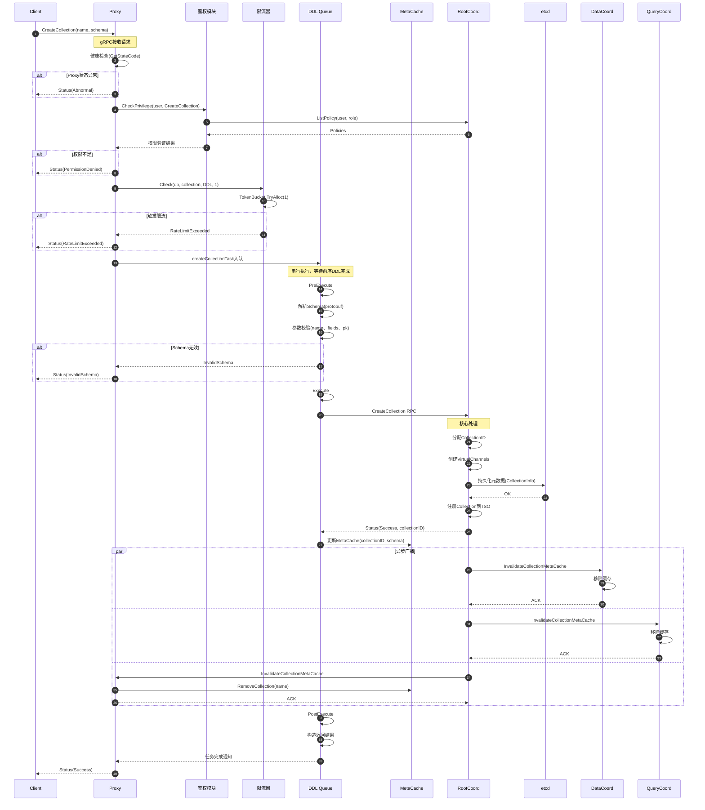
```mermaid
sequenceDiagram
    autonumber
    participant C as Client
    participant P as Proxy
    participant Auth as 鉴权模块
    participant RL as 限流器
    participant DDL as DDL Queue
    participant MC as MetaCache
    participant RC as RootCoord
    participant E as etcd
    participant DC as DataCoord
    participant QC as QueryCoord
    
    C->>P: CreateCollection(name, schema)
    Note over P: gRPC接收请求
    
    P->>P: 健康检查(GetStateCode)
    alt Proxy状态异常
        P-->>C: Status(Abnormal)
    end
    
    P->>Auth: CheckPrivilege(user, CreateCollection)
    Auth->>RC: ListPolicy(user, role)
    RC-->>Auth: Policies
    Auth-->>P: 权限验证结果
    alt 权限不足
        P-->>C: Status(PermissionDenied)
    end
    
    P->>RL: Check(db, collection, DDL, 1)
    RL->>RL: TokenBucket.TryAlloc(1)
    alt 触发限流
        RL-->>P: RateLimitExceeded
        P-->>C: Status(RateLimitExceeded)
    end
    
    P->>DDL: createCollectionTask入队
    Note over DDL: 串行执行，等待前序DDL完成
    
    DDL->>DDL: PreExecute
    DDL->>DDL: 解析Schema(protobuf)
    DDL->>DDL: 参数校验(name、fields、pk)
    alt Schema无效
        DDL-->>P: InvalidSchema
        P-->>C: Status(InvalidSchema)
    end
    
    DDL->>DDL: Execute
    DDL->>RC: CreateCollection RPC
    Note over RC: 核心处理
    RC->>RC: 分配CollectionID
    RC->>RC: 创建VirtualChannels
    RC->>E: 持久化元数据(CollectionInfo)
    E-->>RC: OK
    RC->>RC: 注册Collection到TSO
    RC-->>DDL: Status(Success, collectionID)
    
    DDL->>MC: 更新MetaCache(collectionID, schema)
    
    par 异步广播
        RC->>DC: InvalidateCollectionMetaCache
        DC->>DC: 移除缓存
        DC-->>RC: ACK
    and
        RC->>QC: InvalidateCollectionMetaCache
        QC->>QC: 移除缓存
        QC-->>RC: ACK
    and
        RC->>P: InvalidateCollectionMetaCache
        P->>MC: RemoveCollection(name)
        P-->>RC: ACK
    end
    
    DDL->>DDL: PostExecute
    DDL->>DDL: 构造返回结果
    DDL-->>P: 任务完成通知
    P-->>C: Status(Success)
```

### 1.2 时序图关键点说明

**步骤1-4：请求接收与健康检查**

- Proxy通过gRPC接收客户端请求
- 检查Proxy状态（Healthy/Initializing/Abnormal）
- 状态异常时直接返回错误，避免级联失败

**步骤5-8：权限验证**

- 调用鉴权模块检查用户权限
- 鉴权模块从RootCoord获取用户的策略（Policy）
- 检查是否有`CreateCollection`权限
- 权限不足时返回`PermissionDenied`错误

**步骤9-13：限流检查**

- 限流器基于TokenBucket算法
- DDL操作通常配额较大，很少触发限流
- 限流触发时返回`RateLimitExceeded`，建议客户端退避重试

**步骤14-15：任务入队**

- 创建`createCollectionTask`对象
- 进入DDL队列（串行执行）
- DDL队列保证元数据操作的顺序性

**步骤16-22：PreExecute阶段**

- 解析Schema（从protobuf bytes反序列化）
- 校验参数：
  - Collection名称合法性（长度、字符集）
  - 字段定义完整性（必须有主键、向量字段）
  - 向量维度有效性（≤32768）
  - Shard数量合理性（1-64）

**步骤23-31：Execute阶段（核心）**

- 调用RootCoord的`CreateCollection` RPC
- RootCoord执行：
  1. 分配全局唯一CollectionID
  2. 创建VirtualChannels（数量=ShardsNum）
  3. 持久化元数据到etcd
  4. 注册到TSO服务（分配时间戳）
- 返回成功状态和CollectionID

**步骤32：MetaCache更新**

- Proxy更新本地MetaCache
- 后续请求可直接从缓存读取，无需调用RootCoord

**步骤33-44：异步广播失效通知**

- RootCoord并发向所有Proxy、DataCoord、QueryCoord广播
- 各组件收到通知后移除本地缓存
- 保证分布式缓存一致性

**步骤45-48：PostExecute与返回**

- 构造返回结果
- 通知等待者任务完成
- 返回Status给客户端

### 1.3 异常场景

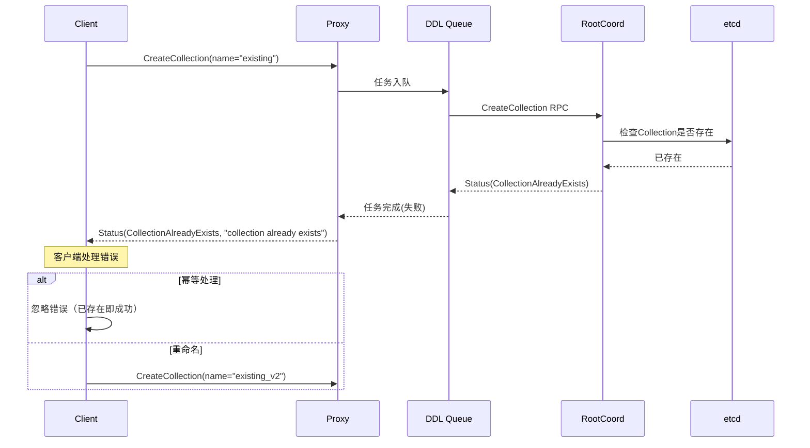
```mermaid
sequenceDiagram
    participant C as Client
    participant P as Proxy
    participant DDL as DDL Queue
    participant RC as RootCoord
    participant E as etcd
    
    C->>P: CreateCollection(name="existing")
    P->>DDL: 任务入队
    DDL->>RC: CreateCollection RPC
    RC->>E: 检查Collection是否存在
    E-->>RC: 已存在
    RC-->>DDL: Status(CollectionAlreadyExists)
    DDL-->>P: 任务完成(失败)
    P-->>C: Status(CollectionAlreadyExists, "collection already exists")
    
    Note over C: 客户端处理错误
    alt 幂等处理
        C->>C: 忽略错误（已存在即成功）
    else 重命名
        C->>P: CreateCollection(name="existing_v2")
    end
```

---

## 2. Insert 时序图

### 2.1 完整流程

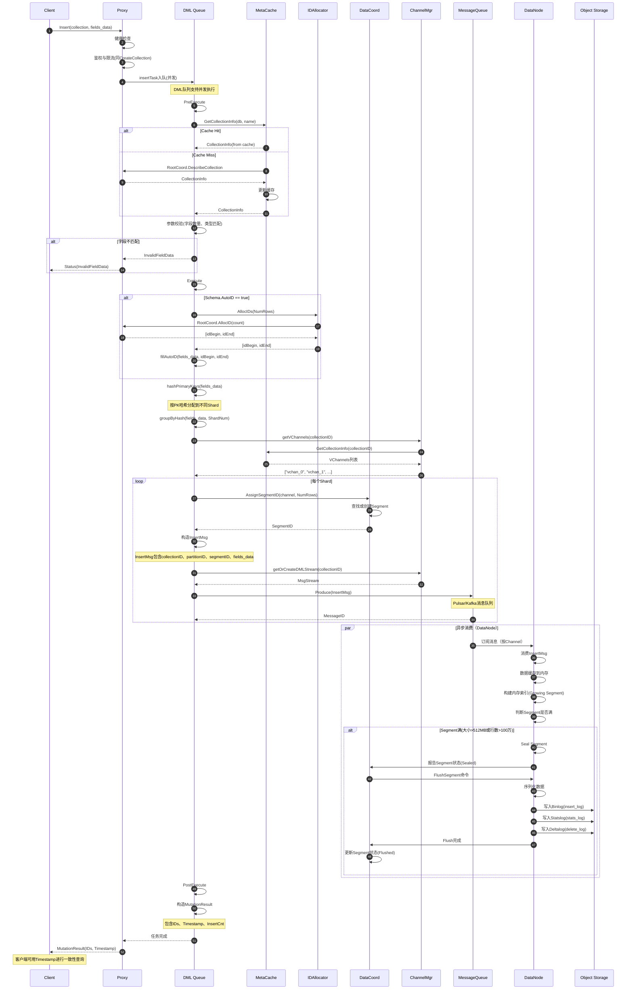
```mermaid
sequenceDiagram
    autonumber
    participant C as Client
    participant P as Proxy
    participant DML as DML Queue
    participant MC as MetaCache
    participant ID as IDAllocator
    participant DC as DataCoord
    participant CH as ChannelMgr
    participant MQ as MessageQueue
    participant DN as DataNode
    participant OS as Object Storage
    
    C->>P: Insert(collection, fields_data)
    
    P->>P: 健康检查
    P->>P: 鉴权与限流(同CreateCollection)
    
    P->>DML: insertTask入队(并发)
    Note over DML: DML队列支持并发执行
    
    DML->>DML: PreExecute
    DML->>MC: GetCollectionInfo(db, name)
    alt Cache Hit
        MC-->>DML: CollectionInfo(from cache)
    else Cache Miss
        MC->>P: RootCoord.DescribeCollection
        P-->>MC: CollectionInfo
        MC->>MC: 更新缓存
        MC-->>DML: CollectionInfo
    end
    
    DML->>DML: 参数校验(字段数量、类型匹配)
    alt 字段不匹配
        DML-->>P: InvalidFieldData
        P-->>C: Status(InvalidFieldData)
    end
    
    DML->>DML: Execute
    
    alt Schema.AutoID == true
        DML->>ID: AllocIDs(NumRows)
        ID->>P: RootCoord.AllocID(count)
        P-->>ID: [idBegin, idEnd]
        ID-->>DML: [idBegin, idEnd]
        DML->>DML: fillAutoID(fields_data, idBegin, idEnd)
    end
    
    DML->>DML: hashPrimaryKeys(fields_data)
    Note over DML: 按PK哈希分配到不同Shard
    DML->>DML: groupByHash(fields_data, ShardNum)
    
    DML->>CH: getVChannels(collectionID)
    CH->>MC: GetCollectionInfo(collectionID)
    MC-->>CH: VChannels列表
    CH-->>DML: ["vchan_0", "vchan_1", ...]
    
    loop 每个Shard
        DML->>DC: AssignSegmentID(channel, NumRows)
        DC->>DC: 查找或创建Segment
        DC-->>DML: SegmentID
        
        DML->>DML: 构造InsertMsg
        Note over DML: InsertMsg包含collectionID、partitionID、segmentID、fields_data
        
        DML->>CH: getOrCreateDMLStream(collectionID)
        CH-->>DML: MsgStream
        
        DML->>MQ: Produce(InsertMsg)
        Note over MQ: Pulsar/Kafka消息队列
        MQ-->>DML: MessageID
    end
    
    par 异步消费（DataNode）
        MQ->>DN: 订阅消息（按Channel）
        DN->>DN: 消费InsertMsg
        DN->>DN: 数据缓存到内存
        DN->>DN: 构建内存索引(Growing Segment)
        
        DN->>DN: 判断Segment是否满
        alt Segment满(大小>512MB或行数>100万)
            DN->>DN: Seal Segment
            DN->>DC: 报告Segment状态(Sealed)
            DC->>DN: FlushSegment命令
            DN->>DN: 序列化数据
            DN->>OS: 写入Binlog(insert_log)
            DN->>OS: 写入Statslog(stats_log)
            DN->>OS: 写入Deltalog(delete_log)
            DN->>DC: Flush完成
            DC->>DC: 更新Segment状态(Flushed)
        end
    end
    
    DML->>DML: PostExecute
    DML->>DML: 构造MutationResult
    Note over DML: 包含IDs、Timestamp、InsertCnt
    DML-->>P: 任务完成
    
    P-->>C: MutationResult(IDs, Timestamp)
    Note over C: 客户端可用Timestamp进行一致性查询
```

### 2.2 时序图关键点说明

**步骤1-5：请求接收与前置检查**

- 与CreateCollection类似的健康检查、鉴权、限流
- DML任务进入并发队列（与DDL串行不同）

**步骤6-13：MetaCache查询**

- 优先从本地缓存获取Collection元信息
- Cache Miss时调用RootCoord并更新缓存
- 缓存命中率通常>95%

**步骤14-17：参数校验**

- 检查字段数量是否匹配Schema
- 检查字段类型是否匹配（Int64/Float/Vector等）
- 检查向量维度是否正确
- 检查主键是否存在（非AutoID场景）

**步骤18-24：AutoID处理**

- 如果主键字段标记为AutoID
- 调用IDAllocator分配唯一ID
- IDAllocator从RootCoord批量分配（每次1000个）
- 填充ID到主键字段

**步骤25-27：数据分片**

- 按主键哈希值分配到不同Shard
- 哈希算法：`hash(primaryKey) % ShardNum`
- 保证相同主键总是路由到同一Shard（Upsert/Delete一致性）

**步骤28-31：Channel查询**

- 获取Collection的VirtualChannel列表
- 每个Shard对应一个VChannel
- VChannel映射到PChannel（物理通道）

**步骤32-41：消息发布**

- 为每个Shard生成InsertMsg
- 调用DataCoord分配SegmentID
- 构造消息并发布到MessageQueue
- 返回MessageID作为确认

**步骤42-53：异步消费（DataNode）**

- DataNode订阅对应的Channel
- 消费InsertMsg并缓存数据
- 构建内存索引（Growing Segment）
- Segment满时触发Flush：
  1. Seal Segment（不再接受新数据）
  2. 序列化数据为Binlog
  3. 写入Object Storage
  4. 通知DataCoord更新状态

**步骤54-58：返回结果**

- 构造MutationResult
- 包含插入的主键ID列表
- 包含操作Timestamp（用于一致性查询）

### 2.3 数据分片示意

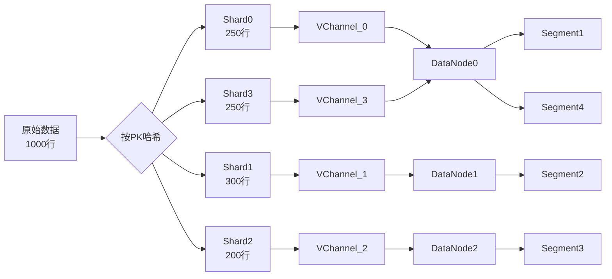
```mermaid
flowchart LR
    Data[原始数据<br/>1000行] --> Hash{按PK哈希}
    Hash --> Shard0[Shard0<br/>250行]
    Hash --> Shard1[Shard1<br/>300行]
    Hash --> Shard2[Shard2<br/>200行]
    Hash --> Shard3[Shard3<br/>250行]
    
    Shard0 --> VC0[VChannel_0]
    Shard1 --> VC1[VChannel_1]
    Shard2 --> VC2[VChannel_2]
    Shard3 --> VC3[VChannel_3]
    
    VC0 --> DN0[DataNode0]
    VC1 --> DN1[DataNode1]
    VC2 --> DN2[DataNode2]
    VC3 --> DN0
    
    DN0 --> Seg1[Segment1]
    DN1 --> Seg2[Segment2]
    DN2 --> Seg3[Segment3]
    DN0 --> Seg4[Segment4]
```

---

## 3. Search 时序图

### 3.1 完整流程

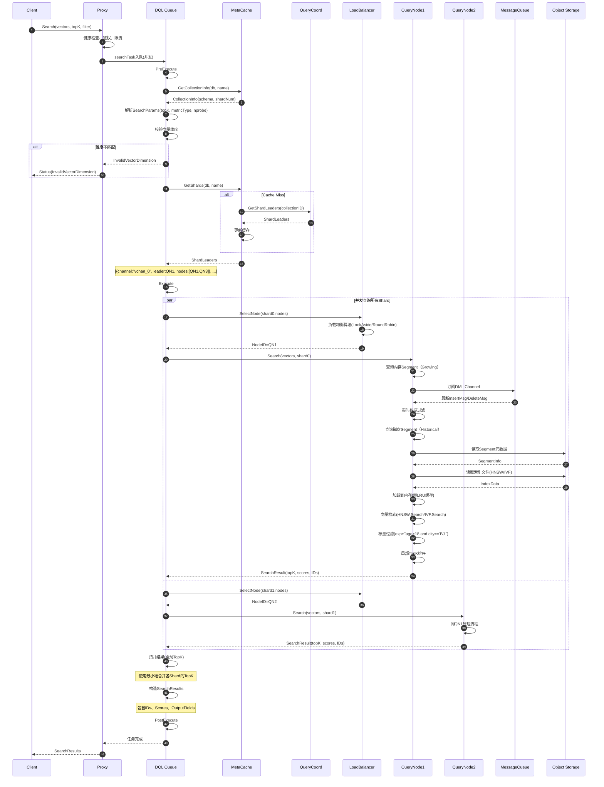
```mermaid
sequenceDiagram
    autonumber
    participant C as Client
    participant P as Proxy
    participant DQL as DQL Queue
    participant MC as MetaCache
    participant QC as QueryCoord
    participant LB as LoadBalancer
    participant QN1 as QueryNode1
    participant QN2 as QueryNode2
    participant MQ as MessageQueue
    participant OS as Object Storage
    
    C->>P: Search(vectors, topK, filter)
    
    P->>P: 健康检查、鉴权、限流
    
    P->>DQL: searchTask入队(并发)
    
    DQL->>DQL: PreExecute
    DQL->>MC: GetCollectionInfo(db, name)
    MC-->>DQL: CollectionInfo(schema, shardNum)
    
    DQL->>DQL: 解析SearchParams(topK, metricType, nprobe)
    DQL->>DQL: 校验向量维度
    alt 维度不匹配
        DQL-->>P: InvalidVectorDimension
        P-->>C: Status(InvalidVectorDimension)
    end
    
    DQL->>MC: GetShards(db, name)
    alt Cache Miss
        MC->>QC: GetShardLeaders(collectionID)
        QC-->>MC: ShardLeaders
        MC->>MC: 更新缓存
    end
    MC-->>DQL: ShardLeaders
    Note over DQL: [{channel:"vchan_0", leader:QN1, nodes:[QN1,QN3]}, ...]
    
    DQL->>DQL: Execute
    
    par 并发查询所有Shard
        DQL->>LB: SelectNode(shard0.nodes)
        LB->>LB: 负载均衡算法(LookAside/RoundRobin)
        LB-->>DQL: NodeID=QN1
        
        DQL->>QN1: Search(vectors, shard0)
        
        QN1->>QN1: 查询内存Segment（Growing）
        QN1->>MQ: 订阅DML Channel
        MQ-->>QN1: 最新InsertMsg/DeleteMsg
        QN1->>QN1: 实时数据过滤
        
        QN1->>QN1: 查询磁盘Segment（Historical）
        QN1->>OS: 读取Segment元数据
        OS-->>QN1: SegmentInfo
        QN1->>OS: 读取索引文件(HNSW/IVF)
        OS-->>QN1: IndexData
        QN1->>QN1: 加载到内存(带LRU缓存)
        
        QN1->>QN1: 向量检索(HNSW.Search/IVF.Search)
        QN1->>QN1: 标量过滤(expr:"age>18 and city=='BJ'")
        QN1->>QN1: 局部TopK排序
        QN1-->>DQL: SearchResult(topK, scores, IDs)
        
    and
        DQL->>LB: SelectNode(shard1.nodes)
        LB-->>DQL: NodeID=QN2
        
        DQL->>QN2: Search(vectors, shard1)
        QN2->>QN2: 同QN1处理流程
        QN2-->>DQL: SearchResult(topK, scores, IDs)
    end
    
    DQL->>DQL: 归并结果(全局TopK)
    Note over DQL: 使用最小堆合并各Shard的TopK
    
    DQL->>DQL: 构造SearchResults
    Note over DQL: 包含IDs、Scores、OutputFields
    
    DQL->>DQL: PostExecute
    DQL-->>P: 任务完成
    
    P-->>C: SearchResults
```

### 3.2 时序图关键点说明

**步骤1-5：请求接收与前置检查**

- 同Insert流程

**步骤6-11：元数据查询**

- 获取Collection Schema（校验向量维度）
- 解析搜索参数（topK、metric_type、nprobe等）

**步骤12-19：Shard信息查询**

- 从MetaCache获取Shard领导者信息
- Cache Miss时查询QueryCoord
- ShardLeaders包含：
  - ChannelName：DML Channel名称
  - LeaderID：主节点ID
  - NodeIDs：所有副本节点ID列表

**步骤20-46：并发查询**

- Proxy并发向所有Shard发起查询
- 每个Shard独立执行：
  1. **负载均衡**：从副本节点中选择一个
  2. **Growing查询**：查询内存中的增量数据
  3. **Historical查询**：查询已刷新的磁盘数据
  4. **向量检索**：使用索引（HNSW/IVF）加速
  5. **标量过滤**：应用过滤表达式
  6. **局部TopK**：返回该Shard的TopK结果

**步骤47-50：结果归并**

- 使用最小堆（Min Heap）归并各Shard结果
- 时间复杂度：O(K * log(M))，K=TopK，M=Shard数*TopK
- 保证全局TopK准确性

**步骤51-55：返回结果**

- 构造SearchResults
- 包含：主键ID、距离分数、输出字段数据

### 3.3 负载均衡决策

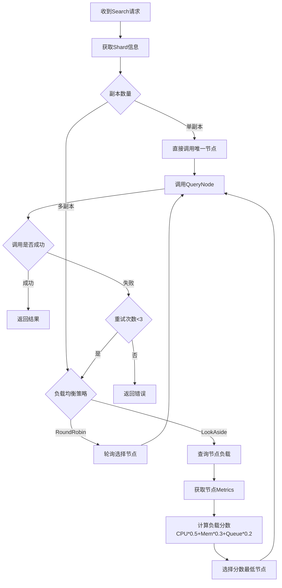
```mermaid
flowchart TD
    Start[收到Search请求] --> GetShards[获取Shard信息]
    GetShards --> CheckReplicas{副本数量}
    
    CheckReplicas -->|单副本| DirectCall[直接调用唯一节点]
    CheckReplicas -->|多副本| LBStrategy{负载均衡策略}
    
    LBStrategy -->|RoundRobin| RR[轮询选择节点]
    LBStrategy -->|LookAside| LA[查询节点负载]
    
    LA --> GetMetrics[获取节点Metrics]
    GetMetrics --> CalcScore[计算负载分数<br/>CPU*0.5+Mem*0.3+Queue*0.2]
    CalcScore --> SelectMin[选择分数最低节点]
    
    RR --> CallNode[调用QueryNode]
    DirectCall --> CallNode
    SelectMin --> CallNode
    
    CallNode --> CheckResult{调用是否成功}
    CheckResult -->|成功| ReturnResult[返回结果]
    CheckResult -->|失败| Retry{重试次数<3}
    Retry -->|是| LBStrategy
    Retry -->|否| ReturnError[返回错误]
```

### 3.4 查询并发度


```mermaid
gantt
    title Search并发执行时间线
    dateFormat SSS
    axisFormat %L ms
    
    section Proxy
    接收请求           :done, p1, 000, 2ms
    解析参数           :done, p2, after p1, 3ms
    任务入队           :done, p3, after p2, 1ms
    
    section Shard0
    负载均衡          :active, s01, 006, 2ms
    RPC调用           :active, s02, after s01, 5ms
    向量检索          :active, s03, after s02, 50ms
    返回结果          :active, s04, after s03, 2ms
    
    section Shard1
    负载均衡          :active, s11, 006, 2ms
    RPC调用           :active, s12, after s11, 5ms
    向量检索          :active, s13, after s12, 45ms
    返回结果          :active, s14, after s13, 2ms
    
    section Shard2
    负载均衡          :active, s21, 006, 2ms
    RPC调用           :active, s22, after s21, 5ms
    向量检索          :active, s23, after s22, 55ms
    返回结果          :active, s24, after s23, 2ms
    
    section Proxy
    结果归并          :crit, p4, 070, 5ms
    返回客户端        :crit, p5, after p4, 2ms
```

**说明**：

- 并发查询3个Shard，总耗时取决于最慢的Shard（约65ms）
- 串行查询总耗时 = 50+45+55 = 150ms
- 并发带来2-3倍性能提升

---

## 4. Delete 时序图

### 4.1 完整流程

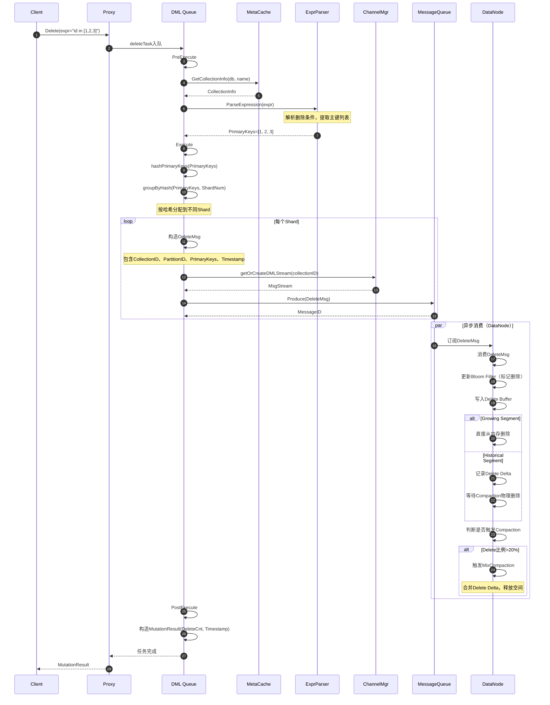
```mermaid
sequenceDiagram
    autonumber
    participant C as Client
    participant P as Proxy
    participant DML as DML Queue
    participant MC as MetaCache
    participant Parser as ExprParser
    participant CH as ChannelMgr
    participant MQ as MessageQueue
    participant DN as DataNode
    
    C->>P: Delete(expr="id in [1,2,3]")
    
    P->>DML: deleteTask入队
    
    DML->>DML: PreExecute
    DML->>MC: GetCollectionInfo(db, name)
    MC-->>DML: CollectionInfo
    
    DML->>Parser: ParseExpression(expr)
    Note over Parser: 解析删除条件，提取主键列表
    Parser-->>DML: PrimaryKeys=[1, 2, 3]
    
    DML->>DML: Execute
    
    DML->>DML: hashPrimaryKeys(PrimaryKeys)
    DML->>DML: groupByHash(PrimaryKeys, ShardNum)
    Note over DML: 按哈希分配到不同Shard
    
    loop 每个Shard
        DML->>DML: 构造DeleteMsg
        Note over DML: 包含CollectionID、PartitionID、PrimaryKeys、Timestamp
        
        DML->>CH: getOrCreateDMLStream(collectionID)
        CH-->>DML: MsgStream
        
        DML->>MQ: Produce(DeleteMsg)
        MQ-->>DML: MessageID
    end
    
    par 异步消费（DataNode）
        MQ->>DN: 订阅DeleteMsg
        DN->>DN: 消费DeleteMsg
        DN->>DN: 更新Bloom Filter（标记删除）
        DN->>DN: 写入Delete Buffer
        
        alt Growing Segment
            DN->>DN: 直接从内存删除
        else Historical Segment
            DN->>DN: 记录Delete Delta
            DN->>DN: 等待Compaction物理删除
        end
        
        DN->>DN: 判断是否触发Compaction
        alt Delete比例>20%
            DN->>DN: 触发MixCompaction
            Note over DN: 合并Delete Delta，释放空间
        end
    end
    
    DML->>DML: PostExecute
    DML->>DML: 构造MutationResult(DeleteCnt, Timestamp)
    DML-->>P: 任务完成
    
    P-->>C: MutationResult
```

### 4.2 删除机制说明

**逻辑删除**：

- Delete操作仅标记删除，不立即物理删除
- 使用Bloom Filter快速判断数据是否被删除
- 查询时过滤已删除数据

**物理删除**：

- 由Compaction任务执行
- 合并Delete Delta到Segment
- 释放存储空间

**删除流程**：

```
逻辑删除（立即） → 查询过滤（实时） → 物理删除（异步）
```

---

## 5. Query 时序图

### 5.1 完整流程

Query与Search类似，但有以下区别：

| 特性 | Search | Query |
|------|--------|-------|
| **查询方式** | 向量近邻搜索 | 标量过滤查询 |
| **输入** | 向量+过滤条件 | 仅过滤条件（expr） |
| **输出** | TopK结果 | 所有匹配结果 |
| **性能** | 取决于索引 | 取决于过滤条件选择性 |

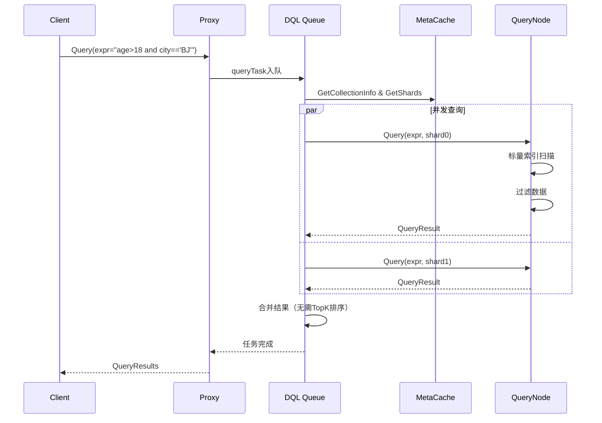
```mermaid
sequenceDiagram
    participant C as Client
    participant P as Proxy
    participant DQL as DQL Queue
    participant MC as MetaCache
    participant QN as QueryNode
    
    C->>P: Query(expr="age>18 and city=='BJ'")
    
    P->>DQL: queryTask入队
    
    DQL->>MC: GetCollectionInfo & GetShards
    
    par 并发查询
        DQL->>QN: Query(expr, shard0)
        QN->>QN: 标量索引扫描
        QN->>QN: 过滤数据
        QN-->>DQL: QueryResult
    and
        DQL->>QN: Query(expr, shard1)
        QN-->>DQL: QueryResult
    end
    
    DQL->>DQL: 合并结果（无需TopK排序）
    DQL-->>P: 任务完成
    P-->>C: QueryResults
```

---

## 6. 总结与性能分析

### 6.1 API延迟对比

| API | P50 | P95 | P99 | 瓶颈 |
|-----|-----|-----|-----|------|
| **CreateCollection** | 50ms | 100ms | 200ms | etcd写入 |
| **Insert** | 5ms | 20ms | 50ms | Message Queue |
| **Search** | 20ms | 80ms | 150ms | 向量检索 |
| **Query** | 10ms | 40ms | 100ms | 标量索引 |
| **Delete** | 5ms | 15ms | 30ms | Message Queue |

### 6.2 并发度

| 队列类型 | 并发度 | 说明 |
|---------|--------|------|
| **DDL Queue** | 串行（1） | 保证元数据一致性 |
| **DML Queue** | 并发（可配置） | 默认64并发 |
| **DQL Queue** | 并发（可配置） | 默认64并发 |

### 6.3 优化建议

**Insert优化**：

- 批量插入（1000-5000行/批）
- 预计算HashKeys
- 使用流式API（FixedWidthInsert）

**Search优化**：

- 合理设置TopK（≤1000）
- 使用标量过滤缩小范围
- 批量查询（≤10个向量/批）

**Delete优化**：

- 批量删除（≤1000个ID/批）
- 定期触发Compaction释放空间

---

**相关文档**：

- [Milvus-01-Proxy-概览.md](./Milvus-01-Proxy-概览.md)
- [Milvus-01-Proxy-API.md](./Milvus-01-Proxy-API.md)
- [Milvus-01-Proxy-数据结构.md](./Milvus-01-Proxy-数据结构.md)

---
