# Milvus-02-RootCoord

## 模块概览

## 1. 模块概述

### 1.1 职责定义

RootCoord（根协调器）是Milvus的核心控制平面组件，负责元数据管理、全局ID/时间戳分配和DDL操作协调。

**核心职责**：

1. **DDL操作管理**
   - CreateCollection/DropCollection
   - CreatePartition/DropPartition
   - CreateDatabase/DropDatabase
   - CreateIndex/DropIndex

2. **TSO服务（Timestamp Oracle）**
   - 全局时间戳分配
   - 保证分布式事务顺序
   - MVCC版本控制基础

3. **ID分配服务**
   - CollectionID、PartitionID分配
   - SegmentID、RowID分配（通过GlobalIDAllocator）

4. **元数据管理**
   - Collection Schema维护
   - Database/Partition信息
   - 用户权限（RBAC）

5. **配额与限流**
   - 全局配额管理
   - 集合级别限流策略
   - 资源使用统计

### 1.2 架构图

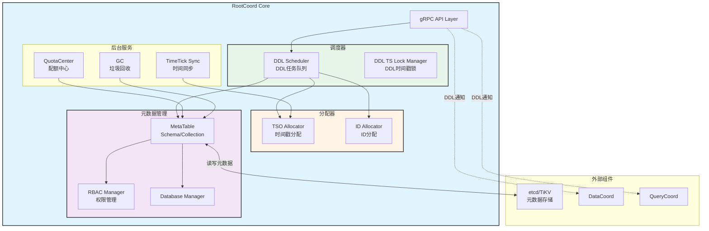

### 1.3 核心API

| API | 功能 | 调用频率 | 重要性 |
|-----|------|---------|--------|
| **CreateCollection** | 创建集合 | 低 | ⭐⭐⭐⭐⭐ |
| **DropCollection** | 删除集合 | 低 | ⭐⭐⭐⭐ |
| **DescribeCollection** | 查询Collection元信息 | 高 | ⭐⭐⭐⭐⭐ |
| **AllocTimestamp** | 分配时间戳 | 极高 | ⭐⭐⭐⭐⭐ |
| **AllocID** | 分配全局ID | 高 | ⭐⭐⭐⭐ |

### 1.4 TSO机制

**TSO（Timestamp Oracle）原理**：

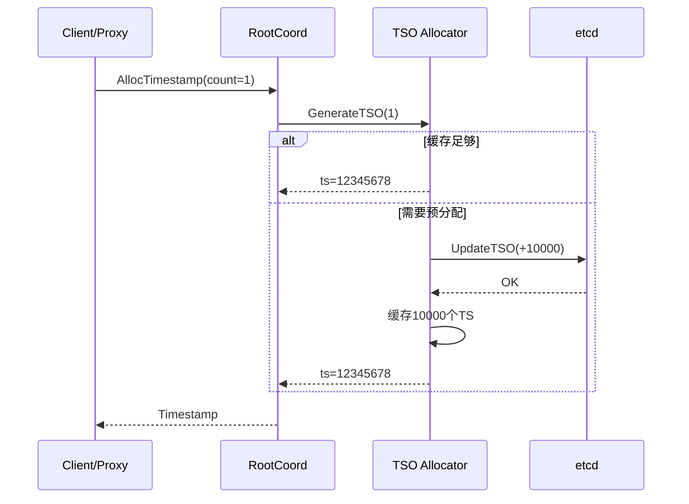

**TSO格式**（64位）：

```
|<--  Physical Time (46 bits) -->|<-- Logical Counter (18 bits) -->|
|   毫秒级物理时间戳                |   逻辑计数器（单位时间内的序号）    |
```

**特性**：

- **全局单调递增**：保证分布式顺序
- **物理时间关联**：便于调试和时间旅行
- **高吞吐**：批量分配，减少etcd访问

---

## 2. 核心流程

### 2.1 CreateCollection流程

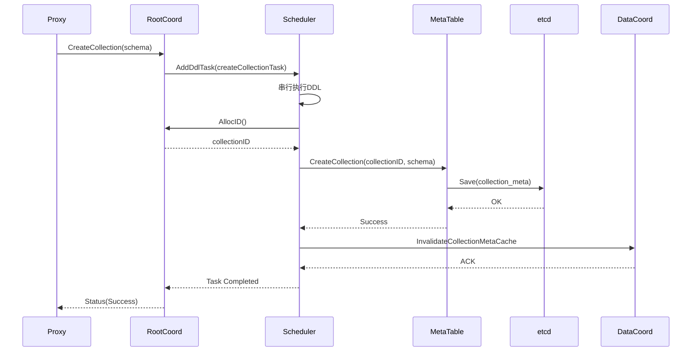

### 2.2 AllocTimestamp高频调用优化

**批量分配策略**：

```go
// TSO Allocator缓存机制
type GlobalTSOAllocator struct {
    lastPhysical int64        // 上次物理时间
    lastLogical  int64        // 上次逻辑计数
    maxLogical   int64        // 最大逻辑计数（262144）
    
    // 批量预分配减少etcd访问
    UpdateTimestampStep = 50ms  // 每50ms更新一次etcd
}

// 性能数据：
// - 单次etcd更新支持：50ms内所有TS请求
// - QPS：>100万/秒（单个RootCoord）
```

---

## 3. 关键设计

### 3.1 DDL串行化

**问题**：并发DDL可能导致元数据不一致

**解决**：DDL Scheduler串行执行

```go
type scheduler struct {
    ddlQueue chan task  // DDL任务队列
    // 串行处理，保证顺序性
}

// DDL执行流程
func (s *scheduler) Start() {
    go func() {
        for task := range s.ddlQueue {
            task.PreExecute()
            task.Execute()   // 持有DDL时间戳锁
            task.PostExecute()
        }
    }()
}
```

### 3.2 MVCC与时间旅行

**机制**：基于TSO实现多版本并发控制

```
写入：Insert(data, ts=100)
查询：Search(ts=100)  → 查询≤100的所有数据
删除：Delete(id, ts=150) → 标记删除
查询：Search(ts=120)  → 仍可见（未删除）
查询：Search(ts=160)  → 不可见（已删除）
```

### 3.3 元数据缓存策略

**两级缓存**：

1. **RootCoord内存缓存**：MetaTable
2. **Proxy缓存**：globalMetaCache

**失效机制**：

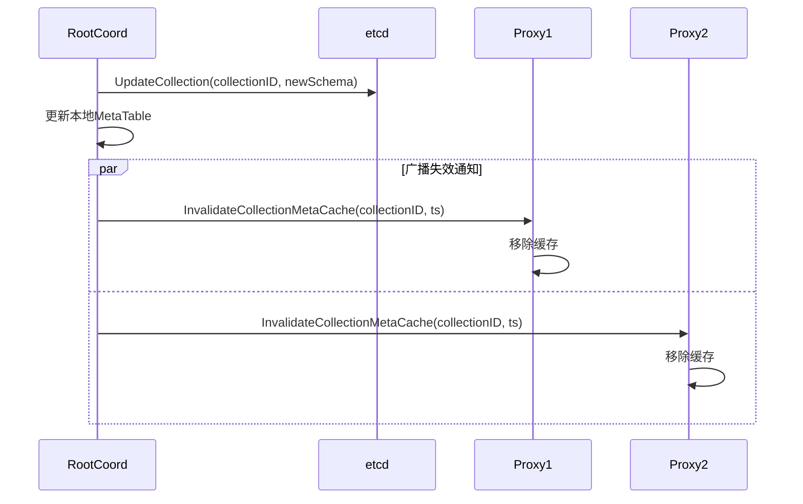

---

## 4. 性能与容量

### 4.1 性能指标

| 指标 | 数值 | 说明 |
|------|------|------|
| **AllocTimestamp QPS** | >100万 | 单RootCoord |
| **AllocID QPS** | >10万 | 批量分配 |
| **CreateCollection延迟** | P99: 200ms | 包含etcd写入 |
| **DescribeCollection延迟** | P99: 10ms | 内存缓存 |

### 4.2 容量规划

| 维度 | 容量 | 限制因素 |
|------|------|----------|
| **Database数量** | 1000 | 内存 |
| **Collection数量** | 10000 | 内存+etcd |
| **Field数量/Collection** | 256 | Schema大小 |
| **Partition数量/Collection** | 4096 | 元数据量 |

---

## 5. 配置参数

```yaml
rootCoord:
  dmlChannelNum: 16           # DML Channel数量
  maxPartitionNum: 4096       # 单Collection最大分区数
  minSegmentSizeToEnableIndex: 1024  # 最小索引大小(MB)
  
  # TSO配置
  tso:
    updateInterval: 50ms      # TSO更新间隔
    saveInterval: 3000ms      # TSO持久化间隔
    
  # GC配置
  gc:
    interval: 3600            # GC周期(秒)
    missingTolerance: 86400   # 数据丢失容忍时间
```

---

**相关文档**：

- [Milvus-00-总览.md](./Milvus-00-总览.md)
- [Milvus-01-Proxy-概览.md](./Milvus-01-Proxy-概览.md)
- [Milvus-03-DataCoord-概览.md](./Milvus-03-DataCoord-概览.md)

---

## API接口

## 核心API列表

RootCoord作为元数据管理中心，提供以下类别的API：

| 类别 | API数量 | 主要功能 |
|------|---------|----------|
| **Collection管理** | 8个 | CreateCollection、DropCollection、DescribeCollection等 |
| **Partition管理** | 4个 | CreatePartition、DropPartition、ShowPartitions等 |
| **Database管理** | 4个 | CreateDatabase、DropDatabase、ListDatabases等 |
| **资源分配** | 2个 | AllocTimestamp、AllocID |
| **权限管理** | 10+个 | CreateCredential、CreateRole、GrantPrivilege等 |

---

## 1. CreateCollection

### 基本信息
- **功能**：创建Collection及其Schema
- **协议**：gRPC `milvuspb.MilvusService/CreateCollection`
- **幂等性**：否

### 请求参数

```go
type CreateCollectionRequest struct {
    Base              *commonpb.MsgBase
    DbName            string                   // 数据库名
    CollectionName    string                   // 集合名
    Schema            []byte                   // 序列化的Schema
    ShardsNum         int32                    // Shard数量
    ConsistencyLevel  commonpb.ConsistencyLevel
    Properties        []*commonpb.KeyValuePair
    NumPartitions     int64                    // Partition Key分区数
}
```

### 核心执行流程

```go
func (c *Core) CreateCollection(ctx context.Context, in *milvuspb.CreateCollectionRequest) (*commonpb.Status, error) {
    // 1. 健康检查
    if err := merr.CheckHealthy(c.GetStateCode()); err != nil {
        return merr.Status(err), nil
    }
    
    // 2. 创建任务
    t := &createCollectionTask{
        baseTask: newBaseTask(ctx, c),
        Req:      in,
    }
    
    // 3. 加入调度器（串行执行）
    if err := c.scheduler.AddTask(t); err != nil {
        return merr.Status(err), nil
    }
    
    // 4. 等待完成
    if err := t.WaitToFinish(); err != nil {
        return merr.Status(err), nil
    }
    
    return merr.Success(), nil
}

// 任务执行逻辑
func (t *createCollectionTask) Execute(ctx context.Context) error {
    // 1. 解析Schema
    schema := &schemapb.CollectionSchema{}
    proto.Unmarshal(t.Req.Schema, schema)
    
    // 2. 参数校验
    if err := t.validate(ctx); err != nil {
        return err
    }
    
    // 3. 分配CollectionID
    t.collID, err = t.core.idAllocator.AllocOne()
    
    // 4. 创建VirtualChannels
    t.channels = t.core.chanTimeTick.getChannels(t.Req.ShardsNum)
    
    // 5. 持久化元数据
    err = t.core.meta.AddCollection(ctx, &model.Collection{
        CollectionID:     t.collID,
        Name:             t.Req.CollectionName,
        Schema:           schema,
        VirtualChannels:  t.channels.virtualChannels,
        PhysicalChannels: t.channels.physicalChannels,
    })
    
    // 6. 广播失效通知
    t.core.broker.BroadcastAlteredCollection(ctx, &milvuspb.AlterCollectionRequest{
        CollectionID: t.collID,
    })
    
    return nil
}
```

### 时序图

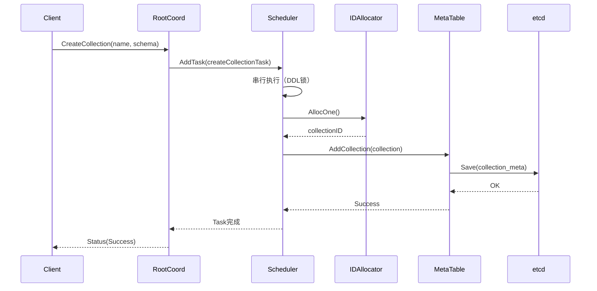

---

## 2. AllocTimestamp

### 基本信息
- **功能**：分配全局时间戳（TSO）
- **调用频率**：极高（每个DML/DQL操作）
- **性能要求**：P99 < 10ms

### 请求参数

```go
type AllocTimestampRequest struct {
    Base           *commonpb.MsgBase
    Count          uint32  // 分配数量
    BlockTimestamp uint64  // 阻塞等待时间戳（可选）
}
```

### 响应参数

```go
type AllocTimestampResponse struct {
    Status    *commonpb.Status
    Timestamp uint64  // 起始时间戳
    Count     uint32  // 分配数量
}
```

### 核心实现

```go
func (c *Core) AllocTimestamp(ctx context.Context, in *rootcoordpb.AllocTimestampRequest) (*rootcoordpb.AllocTimestampResponse, error) {
    // 1. 健康检查
    if err := merr.CheckHealthy(c.GetStateCode()); err != nil {
        return &rootcoordpb.AllocTimestampResponse{
            Status: merr.Status(err),
        }, nil
    }
    
    // 2. BlockTimestamp处理（等待物理时间）
    if in.BlockTimestamp > 0 {
        blockTime, _ := tsoutil.ParseTS(in.BlockTimestamp)
        lastTime := c.tsoAllocator.GetLastSavedTime()
        deltaDuration := blockTime.Sub(lastTime)
        if deltaDuration > 0 {
            time.Sleep(deltaDuration + 200*time.Millisecond)
        }
    }
    
    // 3. 生成TSO
    ts, err := c.tsoAllocator.GenerateTSO(in.GetCount())
    if err != nil {
        return &rootcoordpb.AllocTimestampResponse{
            Status: merr.Status(err),
        }, nil
    }
    
    // 4. 返回第一个可用时间戳
    ts = ts - uint64(in.GetCount()) + 1
    
    return &rootcoordpb.AllocTimestampResponse{
        Status:    merr.Success(),
        Timestamp: ts,
        Count:     in.GetCount(),
    }, nil
}
```

### TSO生成机制

```go
// GlobalTSOAllocator TSO分配器
type GlobalTSOAllocator struct {
    lastPhysical int64   // 上次物理时间（毫秒）
    lastLogical  int64   // 上次逻辑计数器
    maxLogical   int64   // 最大逻辑计数器（262144）
    
    kvBase kv.TxnKV      // etcd/TiKV
}

func (gta *GlobalTSOAllocator) GenerateTSO(count uint32) (uint64, error) {
    gta.mu.Lock()
    defer gta.mu.Unlock()
    
    // 1. 获取当前物理时间
    physical := time.Now().UnixMilli()
    
    // 2. 如果物理时间前进，重置逻辑计数器
    if physical > gta.lastPhysical {
        gta.lastPhysical = physical
        gta.lastLogical = 0
    }
    
    // 3. 检查逻辑计数器是否溢出
    if gta.lastLogical+int64(count) >= gta.maxLogical {
        // 等待下一毫秒
        time.Sleep(time.Millisecond)
        gta.lastPhysical = time.Now().UnixMilli()
        gta.lastLogical = 0
    }
    
    // 4. 生成TSO
    ts := uint64(gta.lastPhysical)<<18 | uint64(gta.lastLogical)
    gta.lastLogical += int64(count)
    
    // 5. 定期持久化到etcd（每3秒）
    if time.Since(gta.lastSaveTime) > 3*time.Second {
        gta.kvBase.Save(tsoKey, gta.lastPhysical)
        gta.lastSaveTime = time.Now()
    }
    
    return ts, nil
}
```

### TSO格式

```
 64 bits TSO
|<----  Physical (46 bits)  ---->|<-- Logical (18 bits) -->|
|   毫秒级物理时间戳              |   逻辑计数器（0-262143） |

示例：
  Physical: 1704067200000 (2024-01-01 00:00:00)
  Logical:  12345
  TSO:      1704067200000 << 18 | 12345 = 446676598505558329
```

---

## 3. DescribeCollection

### 基本信息
- **功能**：查询Collection元信息
- **调用频率**：高
- **性能**：P99 < 10ms（内存缓存）

### 请求参数

```go
type DescribeCollectionRequest struct {
    Base           *commonpb.MsgBase
    DbName         string
    CollectionName string
    CollectionID   int64  // 可选
    TimeStamp      uint64 // 时间旅行
}
```

### 响应参数

```go
type DescribeCollectionResponse struct {
    Status              *commonpb.Status
    Schema              *schemapb.CollectionSchema
    CollectionID        int64
    VirtualChannelNames []string
    PhysicalChannelNames []string
    CreatedTimestamp    uint64
    CreatedUtcTimestamp uint64
    ShardsNum           int32
    ConsistencyLevel    commonpb.ConsistencyLevel
    CollectionName      string
    Properties          []*commonpb.KeyValuePair
    DbName              string
    NumPartitions       int64
}
```

### 核心实现

```go
func (c *Core) describeCollectionImpl(ctx context.Context, in *milvuspb.DescribeCollectionRequest, allowUnavailable bool) (*milvuspb.DescribeCollectionResponse, error) {
    // 1. 健康检查
    if err := merr.CheckHealthy(c.GetStateCode()); err != nil {
        return &milvuspb.DescribeCollectionResponse{
            Status: merr.Status(err),
        }, nil
    }
    
    // 2. 确定查询时间戳
    ts := typeutil.MaxTimestamp
    if in.TimeStamp != 0 {
        ts = in.TimeStamp
    }
    
    // 3. 从MetaTable查询
    var coll *model.Collection
    var err error
    
    if in.CollectionID != 0 {
        coll, err = c.meta.GetCollectionByID(ctx, in.DbName, in.CollectionID, ts, allowUnavailable)
    } else {
        coll, err = c.meta.GetCollectionByName(ctx, in.DbName, in.CollectionName, ts)
    }
    
    if err != nil {
        return &milvuspb.DescribeCollectionResponse{
            Status: merr.Status(err),
        }, nil
    }
    
    // 4. 构造响应
    return &milvuspb.DescribeCollectionResponse{
        Status:               merr.Success(),
        Schema:               coll.Schema,
        CollectionID:         coll.CollectionID,
        VirtualChannelNames:  coll.VirtualChannelNames,
        PhysicalChannelNames: coll.PhysicalChannelNames,
        CreatedTimestamp:     coll.CreateTime,
        ShardsNum:            coll.ShardsNum,
        ConsistencyLevel:     coll.ConsistencyLevel,
        CollectionName:       coll.Name,
        Properties:           coll.Properties,
        DbName:               in.DbName,
        NumPartitions:        coll.NumPartitions,
    }, nil
}
```

---

## 4. CreatePartition

### 基本信息
- **功能**：创建分区
- **幂等性**：否

### 请求参数

```go
type CreatePartitionRequest struct {
    Base           *commonpb.MsgBase
    DbName         string
    CollectionName string
    PartitionName  string
}
```

### 核心流程

```go
func (t *createPartitionTask) Execute(ctx context.Context) error {
    // 1. 获取Collection信息
    coll, err := t.core.meta.GetCollectionByName(ctx, t.Req.DbName, t.Req.CollectionName, typeutil.MaxTimestamp)
    
    // 2. 检查分区数量限制
    if len(coll.Partitions) >= int(Params.RootCoordCfg.MaxPartitionNum.GetAsInt64()) {
        return fmt.Errorf("partition number (%d) exceeds max configuration (%d)",
            len(coll.Partitions), Params.RootCoordCfg.MaxPartitionNum.GetAsInt64())
    }
    
    // 3. 分配PartitionID
    partID, err := t.core.idAllocator.AllocOne()
    
    // 4. 添加分区
    err = t.core.meta.AddPartition(ctx, coll.CollectionID, &model.Partition{
        PartitionID:   partID,
        PartitionName: t.Req.PartitionName,
        CollectionID:  coll.CollectionID,
    })
    
    return nil
}
```

---

## 5. 其他重要API（简要说明）

### 5.1 DropCollection

**功能**：删除Collection及其所有Partition、Segment

**核心逻辑**：

1. 标记Collection状态为`CollectionDropping`
2. 通知DataCoord/QueryCoord释放资源
3. 删除etcd中的元数据
4. 触发垃圾回收

### 5.2 ShowCollections

**功能**：列出指定Database的所有Collection

**核心逻辑**：

```go
func (t *showCollectionTask) Execute(ctx context.Context) error {
    colls, err := t.core.meta.ListCollections(ctx, t.Req.DbName, t.Req.TimeStamp, true)
    
    t.Rsp.CollectionNames = make([]string, len(colls))
    t.Rsp.CollectionIds = make([]int64, len(colls))
    
    for i, coll := range colls {
        t.Rsp.CollectionNames[i] = coll.Name
        t.Rsp.CollectionIds[i] = coll.CollectionID
    }
    
    return nil
}
```

### 5.3 AllocID

**功能**：分配全局唯一ID（CollectionID、PartitionID、SegmentID等）

**实现**：基于etcd实现的GlobalIDAllocator

```go
func (c *Core) AllocID(ctx context.Context, in *rootcoordpb.AllocIDRequest) (*rootcoordpb.AllocIDResponse, error) {
    start, end, err := c.idAllocator.Alloc(in.Count)
    
    return &rootcoordpb.AllocIDResponse{
        Status: merr.Success(),
        ID:     start,
        Count:  in.Count,
    }, nil
}
```

---

## 6. 性能优化

### 6.1 TSO性能优化

**批量分配**：

- 每次etcd更新预分配50ms的时间戳
- 单个RootCoord支持>100万QPS

**本地缓存**：

```go
type tsoCache struct {
    physical int64
    logical  int64
    maxLogical int64
}

// 避免频繁访问etcd
```

### 6.2 MetaTable缓存

**两级缓存**：

1. RootCoord内存缓存（MetaTable）
2. Proxy缓存（globalMetaCache）

**失效策略**：

- 主动失效：DDL操作后广播`InvalidateCollectionMetaCache`
- 被动失效：Proxy定期刷新（可配置）

---

## 7. 配置参数

```yaml
rootCoord:
  dmlChannelNum: 16              # DML Channel数量
  maxPartitionNum: 4096          # 单Collection最大分区数
  minSegmentSizeToEnableIndex: 1024  # 最小索引大小(MB)
  
  # TSO配置
  tso:
    updateInterval: 50ms         # TSO更新间隔
    saveInterval: 3000ms         # TSO持久化间隔
```

---

**相关文档**：

- [Milvus-02-RootCoord-概览.md](./Milvus-02-RootCoord-概览.md)
- [Milvus-02-RootCoord-数据结构.md](./Milvus-02-RootCoord-数据结构.md)
- [Milvus-02-RootCoord-时序图.md](./Milvus-02-RootCoord-时序图.md)

---

## 数据结构

## 1. 核心数据结构UML图

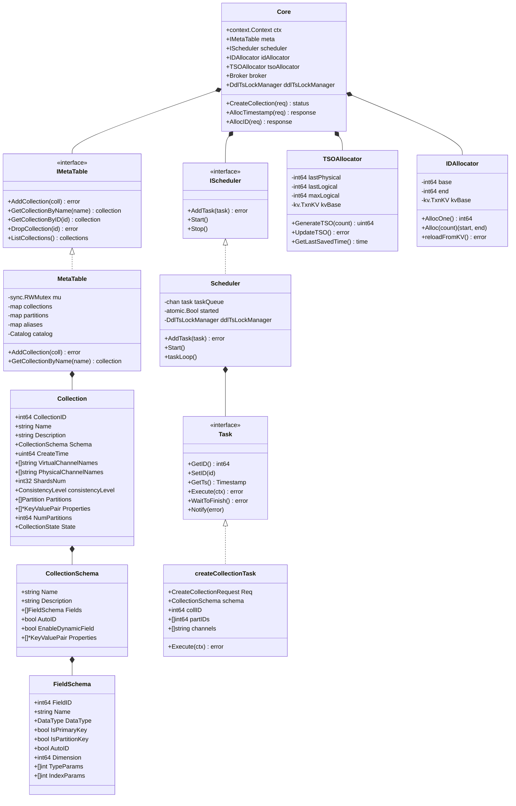

## 2. Core结构体详解

```go
// Core RootCoord核心结构体
type Core struct {
    // 上下文与生命周期
    ctx    context.Context
    cancel context.CancelFunc
    wg     sync.WaitGroup
    
    // etcd/TiKV客户端
    etcdCli *clientv3.Client
    tikvCli *txnkv.Client
    
    // 地址与Session
    address string
    session sessionutil.SessionInterface
    
    // 元数据管理
    meta IMetaTable  // MetaTable接口
    
    // 任务调度
    scheduler IScheduler  // DDL任务调度器
    
    // Broker（与其他组件通信）
    broker Broker
    
    // DDL时间戳锁管理器
    ddlTsLockManager DdlTsLockManager
    
    // 资源分配器
    idAllocator  allocator.Interface     // ID分配器
    tsoAllocator tso2.Allocator          // TSO分配器
    
    // Coordinator客户端
    mixCoord types.MixCoord
    
    // 配额中心
    quotaCenter *QuotaCenter
    
    // 垃圾回收
    garbageCollector GarbageCollector
    
    // Proxy管理
    proxyCreator       proxyutil.ProxyCreator
    proxyWatcher       *proxyutil.ProxyWatcher
    proxyClientManager proxyutil.ProxyClientManagerInterface
    
    // 时间同步
    chanTimeTick *timetickSync
    
    // 状态码
    stateCode atomic.Int32
}
```

## 3. MetaTable数据结构

### 3.1 MetaTable结构体

```go
// MetaTable Collection元数据管理
type MetaTable struct {
    sync.RWMutex
    
    // Collection缓存：dbID -> collectionID -> Collection
    collID2Meta map[typeutil.UniqueID]*model.Collection
    
    // Collection名称索引：dbID -> collectionName -> collectionID
    collName2ID map[typeutil.UniqueID]map[string]typeutil.UniqueID
    
    // Collection别名：dbID -> alias -> collectionID
    collAlias2ID map[typeutil.UniqueID]map[string]typeutil.UniqueID
    
    // Partition缓存：partitionID -> Partition
    partID2Meta map[typeutil.UniqueID]*model.Partition
    
    // Database缓存：dbName -> Database
    names2DatabaseID map[string]typeutil.UniqueID
    dbID2Meta        map[typeutil.UniqueID]*model.Database
    
    // 持久化层
    catalog metastore.RootCoordCatalog
}
```

### 3.2 Collection模型

```go
// Collection Collection元数据模型
type Collection struct {
    // 基础信息
    CollectionID      int64                      // Collection ID
    DBID              int64                      // Database ID
    Name              string                     // Collection名称
    Description       string                     // 描述
    AutoID            bool                       // 是否自动生成ID
    
    // Schema
    Schema            *schemapb.CollectionSchema // 字段Schema
    
    // 字段映射
    FieldIndexes      []*model.Index             // 字段索引
    
    // 虚拟通道
    VirtualChannelNames  []string                // Virtual Channel名称
    PhysicalChannelNames []string                // Physical Channel名称
    ShardsNum            int32                   // Shard数量
    
    // 分区
    Partitions        []*Partition               // 所有分区
    
    // 时间戳
    CreateTime        uint64                     // 创建时间戳
    StartPositions    []*commonpb.KeyDataPair    // 起始位置
    
    // 一致性
    ConsistencyLevel  commonpb.ConsistencyLevel  // 一致性级别
    
    // 状态
    State             pb.CollectionState         // Collection状态
    
    // 扩展属性
    Properties        []*commonpb.KeyValuePair   // 扩展属性
    
    // Partition Key
    NumPartitions     int64                      // Partition Key分区数
}
```

### 3.3 CollectionSchema

```go
// CollectionSchema Schema定义
type CollectionSchema struct {
    Name              string                     // Schema名称
    Description       string                     // 描述
    AutoID            bool                       // 是否自动生成ID
    Fields            []*FieldSchema             // 字段列表
    EnableDynamicField bool                      // 是否启用动态字段
    Properties        []*commonpb.KeyValuePair   // 扩展属性
}

// FieldSchema 字段Schema
type FieldSchema struct {
    FieldID           int64                      // 字段ID
    Name              string                     // 字段名
    IsPrimaryKey      bool                       // 是否主键
    Description       string                     // 描述
    DataType          schemapb.DataType          // 数据类型
    TypeParams        []*commonpb.KeyValuePair   // 类型参数
    IndexParams       []*commonpb.KeyValuePair   // 索引参数
    AutoID            bool                       // 是否自动生成
    State             schemapb.FieldState        // 字段状态
    ElementType       schemapb.DataType          // 元素类型（Array）
    DefaultValue      *schemapb.ValueField       // 默认值
    IsDynamic         bool                       // 是否动态字段
    IsPartitionKey    bool                       // 是否Partition Key
    IsClusteringKey   bool                       // 是否Clustering Key
    Nullable          bool                       // 是否可空
}
```

### 3.4 CollectionState状态机

```go
// CollectionState Collection状态
type CollectionState int32

const (
    CollectionCreated     CollectionState = 0  // 已创建
    CollectionCreating    CollectionState = 1  // 创建中
    CollectionDropping    CollectionState = 2  // 删除中
    CollectionDropped     CollectionState = 3  // 已删除
)

// 状态转换
// Created → Dropping → Dropped
// Creating → Created
// Creating → Dropping → Dropped (创建失败)
```

## 4. Scheduler调度器

### 4.1 Scheduler结构体

```go
// scheduler DDL任务调度器
type scheduler struct {
    ctx    context.Context
    cancel context.CancelFunc
    wg     sync.WaitGroup
    
    // 任务队列
    taskQueue chan task
    
    // 启动标志
    started atomic.Bool
    
    // 资源分配器
    idAllocator  allocator.Interface
    tsoAllocator tso2.Allocator
    
    // DDL时间戳锁
    ddlTsLockManager DdlTsLockManager
}
```

### 4.2 Task接口

```go
// task DDL任务接口
type task interface {
    GetID() int64
    SetID(id int64)
    GetTs() Timestamp
    SetTs(ts Timestamp)
    GetType() commonpb.MsgType
    Execute(ctx context.Context) error
    WaitToFinish() error
    Notify(err error)
}
```

### 4.3 createCollectionTask

```go
// createCollectionTask 创建Collection任务
type createCollectionTask struct {
    baseTask
    
    // 请求
    Req *milvuspb.CreateCollectionRequest
    
    // 解析后的Schema
    schema *schemapb.CollectionSchema
    
    // 分配的资源
    collID         UniqueID     // Collection ID
    partIDs        []UniqueID   // Partition IDs
    channels       collectionChannels  // Channels
    dbID           UniqueID     // Database ID
    partitionNames []string     // Partition名称
}

func (t *createCollectionTask) Execute(ctx context.Context) error {
    // 1. 解析Schema
    t.schema = &schemapb.CollectionSchema{}
    proto.Unmarshal(t.Req.Schema, t.schema)
    
    // 2. 参数校验
    if err := t.validate(ctx); err != nil {
        return err
    }
    
    // 3. 分配CollectionID
    t.collID, _ = t.core.idAllocator.AllocOne()
    
    // 4. 创建VirtualChannels
    t.channels = t.core.chanTimeTick.getChannels(t.Req.ShardsNum)
    
    // 5. 添加Collection
    coll := &model.Collection{
        CollectionID:         t.collID,
        Name:                 t.Req.CollectionName,
        Schema:               t.schema,
        VirtualChannelNames:  t.channels.virtualChannels,
        PhysicalChannelNames: t.channels.physicalChannels,
        ShardsNum:            t.Req.ShardsNum,
        ConsistencyLevel:     t.Req.ConsistencyLevel,
        CreateTime:           t.GetTs(),
        State:                pb.CollectionState_CollectionCreated,
    }
    
    err := t.core.meta.AddCollection(ctx, coll)
    
    return err
}
```

## 5. TSO与ID分配器

### 5.1 TSOAllocator

```go
// GlobalTSOAllocator 全局TSO分配器
type GlobalTSOAllocator struct {
    mu sync.Mutex
    
    // TSO状态
    lastPhysical int64   // 上次物理时间（毫秒）
    lastLogical  int64   // 上次逻辑计数器
    maxLogical   int64   // 最大逻辑计数器（262144 = 2^18）
    
    // 持久化
    kvBase kv.TxnKV      // etcd/TiKV
    key    string        // TSO存储key
    
    // 更新间隔
    updateInterval time.Duration  // 50ms
    saveInterval   time.Duration  // 3s
    
    lastSaveTime time.Time
}

// GenerateTSO 生成TSO
func (gta *GlobalTSOAllocator) GenerateTSO(count uint32) (uint64, error) {
    gta.mu.Lock()
    defer gta.mu.Unlock()
    
    // 获取当前物理时间
    physical := time.Now().UnixMilli()
    
    // 物理时间前进，重置逻辑计数器
    if physical > gta.lastPhysical {
        gta.lastPhysical = physical
        gta.lastLogical = 0
    }
    
    // 检查逻辑计数器溢出
    if gta.lastLogical+int64(count) >= gta.maxLogical {
        // 等待下一毫秒
        time.Sleep(time.Millisecond)
        gta.lastPhysical = time.Now().UnixMilli()
        gta.lastLogical = 0
    }
    
    // 生成TSO
    ts := uint64(gta.lastPhysical)<<18 | uint64(gta.lastLogical)
    gta.lastLogical += int64(count)
    
    return ts, nil
}
```

### 5.2 IDAllocator

```go
// GlobalIDAllocator 全局ID分配器
type GlobalIDAllocator struct {
    mu sync.Mutex
    
    // ID范围
    base int64   // 当前ID范围起始
    end  int64   // 当前ID范围结束
    
    // 持久化
    kvBase kv.TxnKV
    key    string
    
    // 批量分配大小
    allocSize int64  // 10000
}

// AllocOne 分配单个ID
func (gia *GlobalIDAllocator) AllocOne() (int64, error) {
    gia.mu.Lock()
    defer gia.mu.Unlock()
    
    // 检查是否需要重新加载
    if gia.base >= gia.end {
        if err := gia.reloadFromKV(); err != nil {
            return 0, err
        }
    }
    
    id := gia.base
    gia.base++
    
    return id, nil
}

// reloadFromKV 从etcd重新加载ID范围
func (gia *GlobalIDAllocator) reloadFromKV() error {
    // 1. 获取当前值
    val, err := gia.kvBase.Load(gia.key)
    if err != nil {
        return err
    }
    
    currentEnd := parseInt64(val)
    
    // 2. 更新etcd（CAS操作）
    newEnd := currentEnd + gia.allocSize
    err = gia.kvBase.CompareAndSwap(gia.key, val, toString(newEnd))
    if err != nil {
        return err
    }
    
    // 3. 更新本地范围
    gia.base = currentEnd
    gia.end = newEnd
    
    return nil
}
```

## 6. DdlTsLockManager

```go
// ddlTsLockManager DDL时间戳锁管理器
type ddlTsLockManager struct {
    lastTs        atomic.Uint64   // 最后的DDL时间戳
    inProgressCnt atomic.Int32    // 正在进行的DDL数量
    tsoAllocator  tso.Allocator   // TSO分配器
    mu            sync.Mutex      // 互斥锁
}

// GetMinDdlTs 获取最小DDL时间戳
func (c *ddlTsLockManager) GetMinDdlTs() Timestamp {
    // 如果有正在进行的DDL，返回上次的时间戳
    if c.inProgressCnt.Load() > 0 {
        return c.lastTs.Load()
    }
    
    // 否则分配新的时间戳
    c.Lock()
    defer c.Unlock()
    
    ts, err := c.tsoAllocator.GenerateTSO(1)
    if err != nil {
        return c.lastTs.Load()
    }
    
    c.UpdateLastTs(ts)
    return ts
}

// 用途：保证DDL操作的时间戳顺序性
// - DDL开始：AddRefCnt(1)
// - DDL结束：AddRefCnt(-1)
// - TimeTick：GetMinDdlTs()
```

---

**相关文档**：

- [Milvus-02-RootCoord-概览.md](./Milvus-02-RootCoord-概览.md)
- [Milvus-02-RootCoord-API.md](./Milvus-02-RootCoord-API.md)
- [Milvus-02-RootCoord-时序图.md](./Milvus-02-RootCoord-时序图.md)

---

## 时序图

## 1. CreateCollection时序图

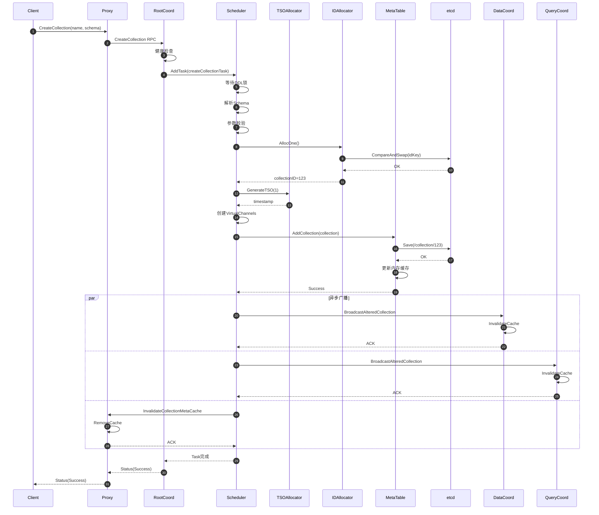

**时序图说明**：

1. **步骤1-4**：Client通过Proxy发起CreateCollection请求
2. **步骤5-7**：任务进入DDL Scheduler，等待串行执行
3. **步骤8-11**：分配CollectionID（从etcd批量预分配）
4. **步骤12-13**：分配创建时间戳
5. **步骤14**：创建VirtualChannels（从Channel池分配）
6. **步骤15-19**：持久化元数据到etcd，更新内存缓存
7. **步骤20-29**：并发广播失效通知到所有组件
8. **步骤30-32**：返回成功状态

---

## 2. AllocTimestamp时序图

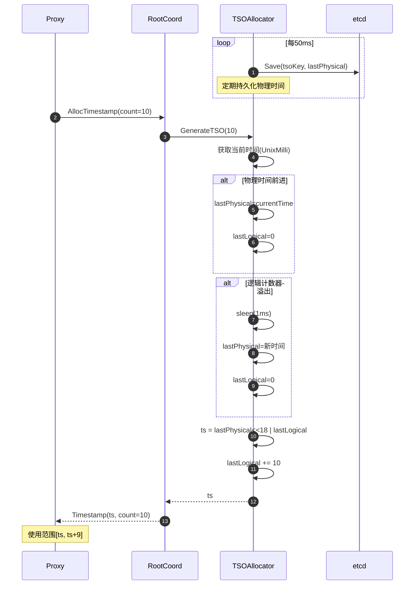

**TSO生成机制**：

```
时间轴：
  t0: physical=1000, logical=0      → TSO=1000<<18|0   = 262144000
  t1: physical=1000, logical=10     → TSO=1000<<18|10  = 262144010
  t2: physical=1000, logical=262143 → TSO=1000<<18|262143
  t3: physical=1001, logical=0      → TSO=1001<<18|0   = 262406144

特性：

- 单调递增：保证分布式顺序
- 高精度：毫秒+逻辑计数器
- 高性能：本地生成，减少etcd访问

```

---

## 3. DescribeCollection时序图

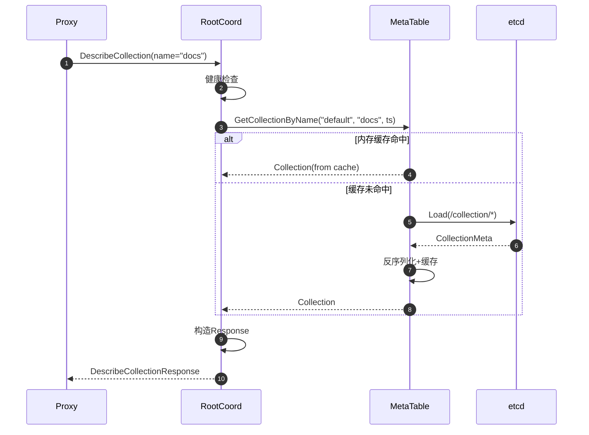

**缓存策略**：

```
Cache Key: dbID + collectionName
Cache Value: *model.Collection

失效时机：

1. DDL操作（CreateCollection/DropCollection/AlterCollection）
2. 接收到InvalidateCollectionMetaCache通知
3. 查询时发现版本不匹配（etcd比缓存新）

性能：

- Cache Hit: P99 < 5ms
- Cache Miss: P99 < 20ms (包含etcd查询)

```

---

## 4. CreatePartition时序图

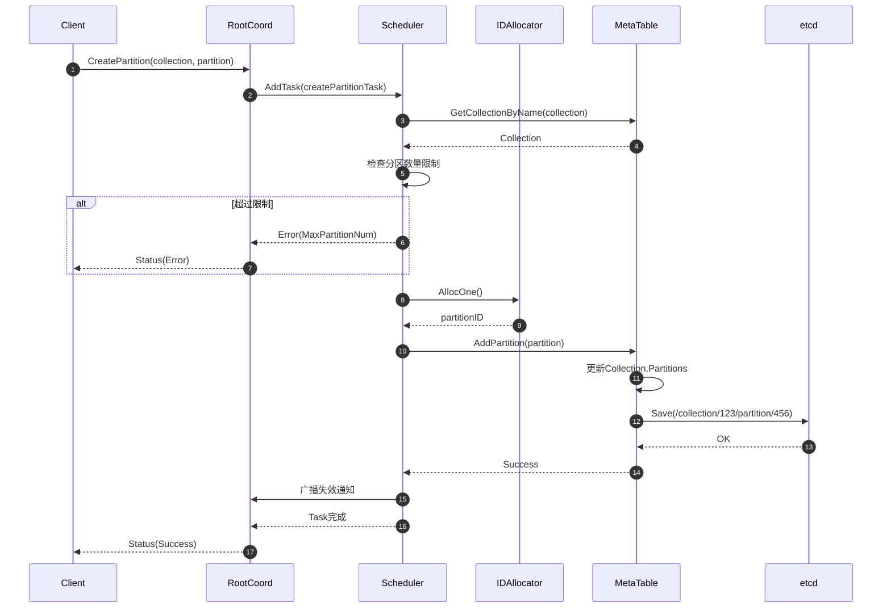

---

## 5. DropCollection时序图

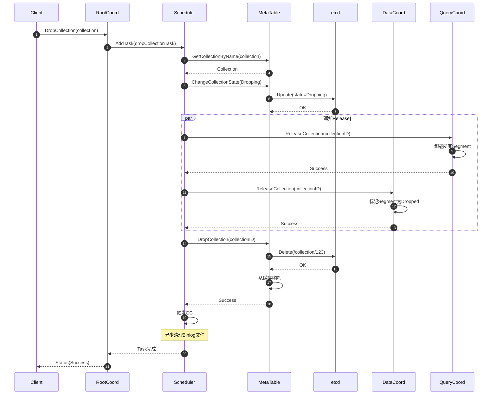

**状态转换**：

```
CollectionCreated → CollectionDropping → CollectionDropped

步骤：

1. 标记为Dropping（不可见）
2. 通知QueryCoord/DataCoord释放资源
3. 删除etcd元数据
4. 异步GC清理Object Storage文件

```

---

## 6. ShowCollections时序图

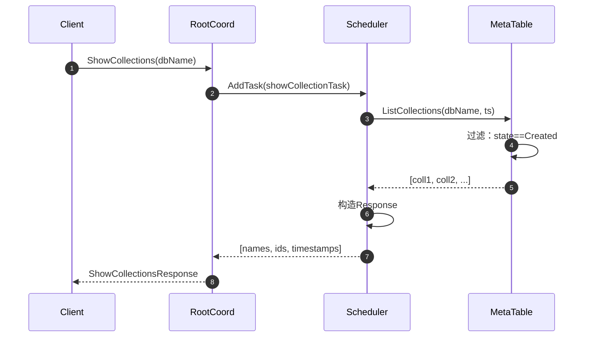

---

## 7. 时间旅行（Time Travel）

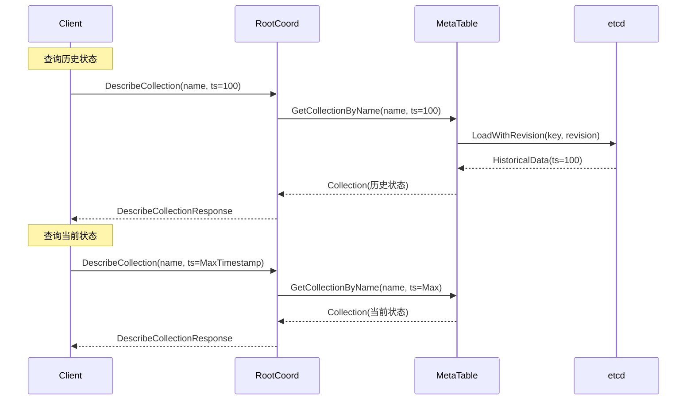

**时间旅行用途**：

1. **MVCC查询**：查询历史版本的Collection
2. **一致性保证**：使用特定Timestamp保证读一致性
3. **调试与审计**：回溯DDL操作历史

**实现机制**：

```go
// etcd支持基于Revision的查询
// Timestamp → Revision映射（单调递增）

func (m *MetaTable) GetCollectionByName(dbName, name string, ts Timestamp) (*Collection, error) {
    if ts == MaxTimestamp {
        // 查询最新版本（从缓存）
        return m.cache[dbName][name], nil
    }
    
    // 查询历史版本（从etcd）
    revision := m.timestampToRevision(ts)
    data := m.etcdCli.Get(ctx, collectionKey, clientv3.WithRev(revision))
    
    return parseCollection(data), nil
}
```

---

## 8. DDL串行化机制

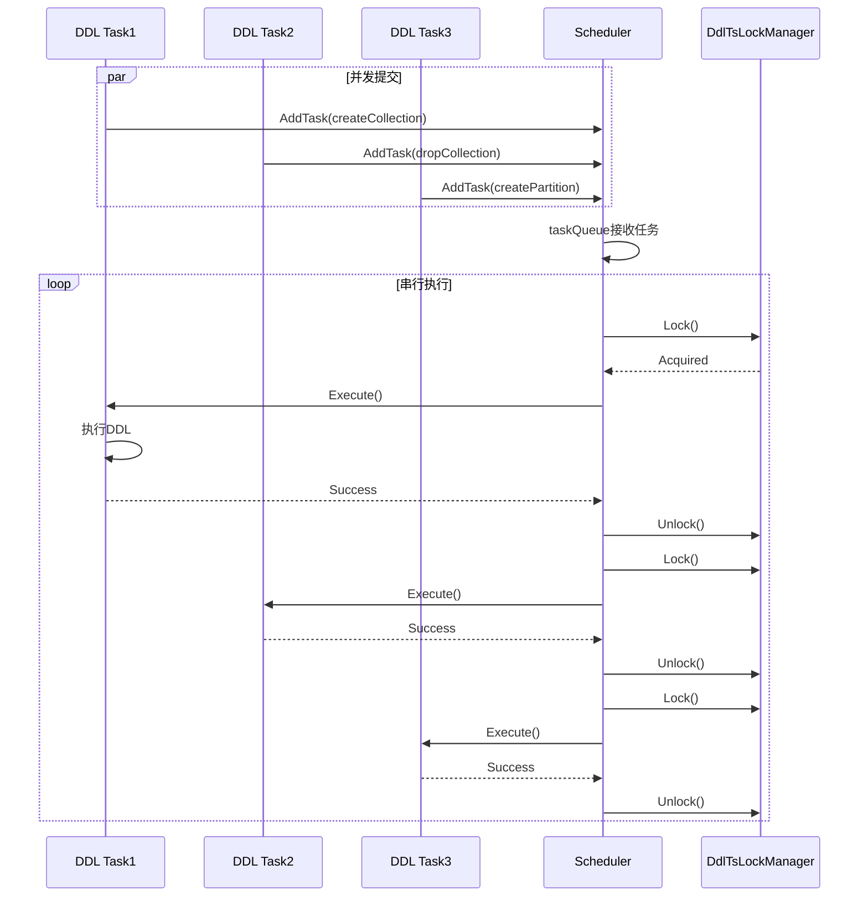

**串行化原因**：

1. **元数据一致性**：避免并发修改导致冲突
2. **Timestamp顺序性**：保证DDL操作的全局顺序
3. **简化实现**：无需复杂的并发控制

**性能影响**：

- DDL操作频率低（通常<1/秒）
- 串行化对系统吞吐影响小
- DML/DQL操作不受影响（并发执行）

---

**相关文档**：

- [Milvus-02-RootCoord-概览.md](./Milvus-02-RootCoord-概览.md)
- [Milvus-02-RootCoord-API.md](./Milvus-02-RootCoord-API.md)
- [Milvus-02-RootCoord-数据结构.md](./Milvus-02-RootCoord-数据结构.md)

---
