# Milvus-03-DataCoord-概览

## 1. 模块概述

### 1.1 职责定义

DataCoord（数据协调器）是Milvus数据管理层的核心组件，负责数据的生命周期管理、存储优化和资源调度。

**核心职责**：

1. **Segment生命周期管理**
   - Segment分配与创建
   - Growing → Sealed → Flushed → Indexed状态转换
   - Segment元数据维护

2. **数据持久化协调**
   - 触发DataNode Flush操作
   - 监控Flush进度
   - 管理Binlog文件

3. **Compaction调度**
   - 自动触发Compaction任务
   - 分配Compaction资源
   - 监控Compaction进度

4. **Channel与DataNode管理**
   - Channel分配与负载均衡
   - DataNode注册与心跳监控
   - 故障检测与恢复

5. **索引管理协调**
   - 触发索引构建任务
   - 监控索引构建进度
   - 管理索引文件元数据

6. **垃圾回收（GC）**
   - 清理过期Segment
   - 清理无效Binlog文件
   - 回收Object Storage空间

### 1.2 输入与输出

**输入**：

- **Proxy**：AssignSegmentID请求（数据写入）
- **DataNode**：Flush完成通知、Compaction进度
- **RootCoord**：Collection/Partition DDL事件
- **etcd/TiKV**：Segment元数据持久化
- **Object Storage**：Binlog/Deltalog文件元数据

**输出**：

- **DataNode**：Flush/Compaction任务
- **QueryCoord**：Handoff通知（Segment状态变更）
- **etcd/TiKV**：元数据更新
- **监控系统**：Metrics指标

### 1.3 上下游依赖

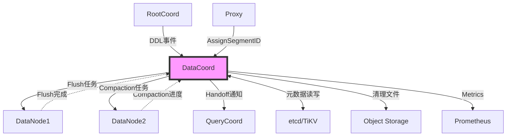

**依赖关系说明**：

| 依赖组件 | 依赖类型 | 用途 |
|---------|---------|------|
| **RootCoord** | 强依赖 | 获取Collection元信息、DDL事件订阅 |
| **DataNode** | 强依赖 | 执行Flush/Compaction任务 |
| **QueryCoord** | 弱依赖 | 通知Segment状态变更（Handoff） |
| **etcd/TiKV** | 强依赖 | 元数据持久化与Watch |
| **Object Storage** | 强依赖 | Binlog文件管理 |

### 1.4 生命周期

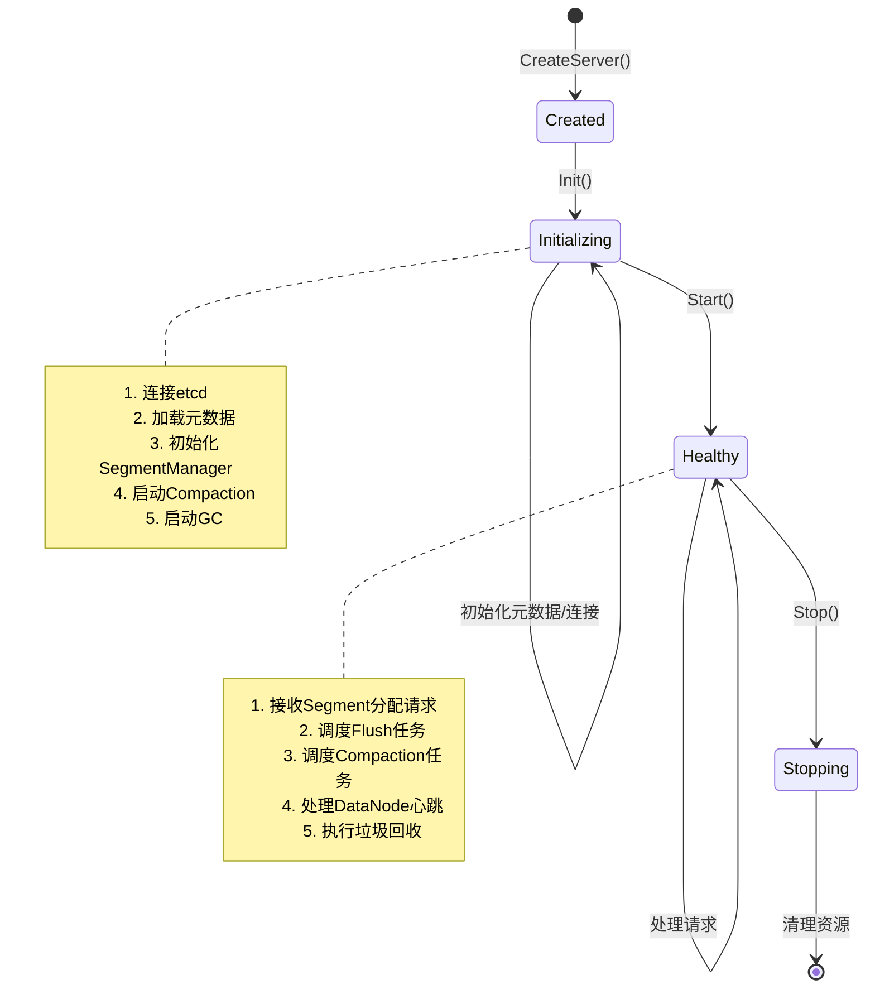

**生命周期阶段**：

| 阶段 | 状态码 | 主要操作 | 耗时 |
|------|--------|----------|------|
| **Created** | - | 创建Server实例 | <1ms |
| **Initializing** | StateCode_Initializing | 连接依赖组件、加载元数据 | 1-5s |
| **Healthy** | StateCode_Healthy | 正常服务 | - |
| **Stopping** | StateCode_Abnormal | 停止后台任务、关闭连接 | 1-3s |

---

## 2. 架构设计

### 2.1 模块架构图

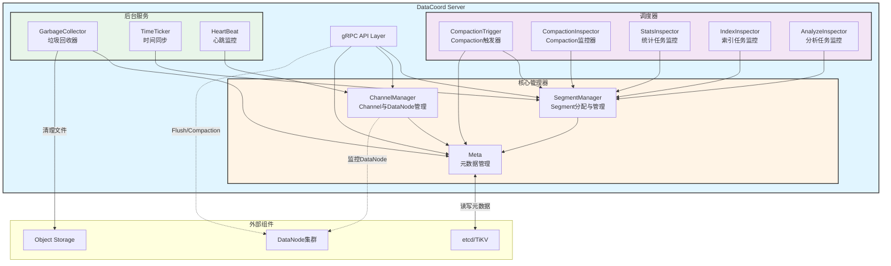

**架构层次**：

1. **API层**：gRPC接口，处理外部请求
2. **核心管理器**：Segment、Channel、Meta管理
3. **调度器**：Compaction、索引、统计任务调度
4. **后台服务**：GC、心跳监控、时间同步

### 2.2 核心组件说明

#### 2.2.1 SegmentManager

**职责**：Segment分配与生命周期管理

**核心功能**：

- `AllocSegment`：为数据写入分配Segment
- `SealSegment`：将Growing Segment标记为Sealed
- `DropSegment`：删除Segment元数据
- `GetFlushableSegments`：获取可Flush的Segment列表

**Segment状态机**：

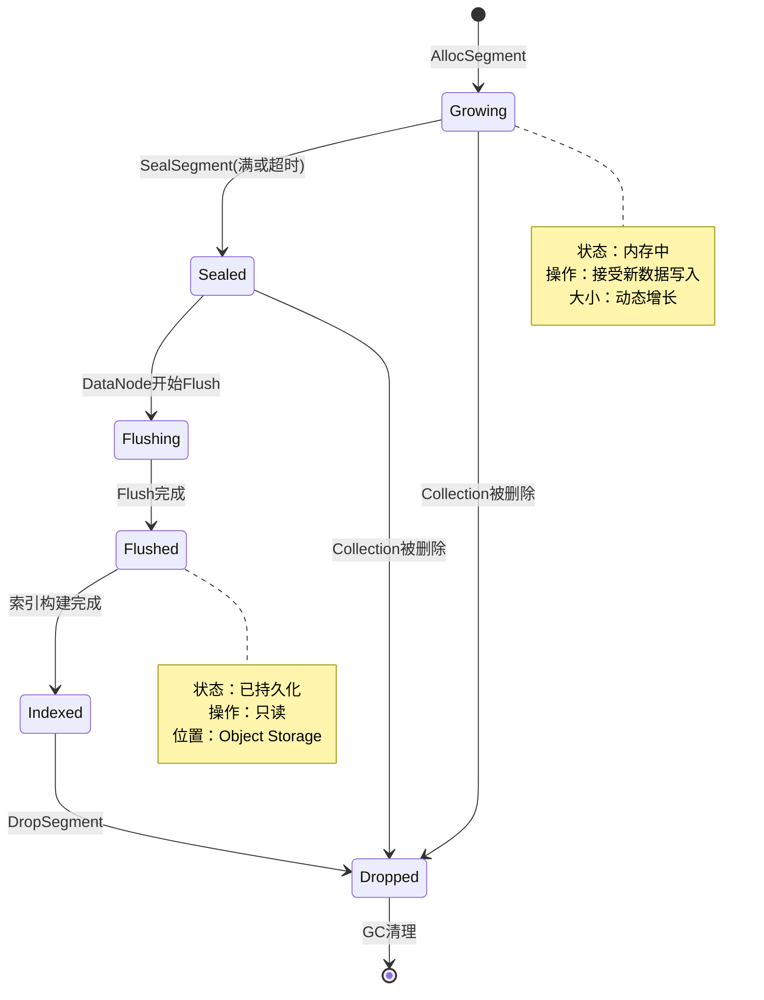

**Segment分配策略**：

```go
// 分配策略：优先复用未满Segment，不存在则创建新Segment
func (m *SegmentManager) AllocSegment(collectionID, partitionID int64, channelName string, count int64) ([]*Allocation, error) {
    // 1. 查找未满的Growing Segment
    segment := m.meta.GetGrowingSegment(collectionID, partitionID, channelName)
    
    // 2. 检查容量是否足够
    if segment != nil && segment.AvailableSize >= count {
        allocation := &Allocation{
            SegmentID: segment.ID,
            NumOfRows: count,
            ExpireTime: time.Now().Add(SegmentExpireDuration),
        }
        return []*Allocation{allocation}, nil
    }
    
    // 3. 创建新Segment
    newSegmentID, err := m.allocator.AllocID()
    if err != nil {
        return nil, err
    }
    
    segment = &SegmentInfo{
        SegmentID:    newSegmentID,
        CollectionID: collectionID,
        PartitionID:  partitionID,
        State:        commonpb.SegmentState_Growing,
        MaxSize:      SegmentMaxSize,  // 默认512MB
        Channel:      channelName,
    }
    
    m.meta.AddSegment(segment)
    
    return []*Allocation{{SegmentID: newSegmentID, NumOfRows: count}}, nil
}
```

#### 2.2.2 ChannelManager

**职责**：管理DML Channel与DataNode的映射关系

**核心功能**：

- `Watch`：为Channel分配DataNode
- `Release`：释放Channel（Collection被删除）
- `GetDataNode`：查询Channel对应的DataNode
- `Balance`：负载均衡（将Channel迁移到其他DataNode）

**Channel分配示意**：

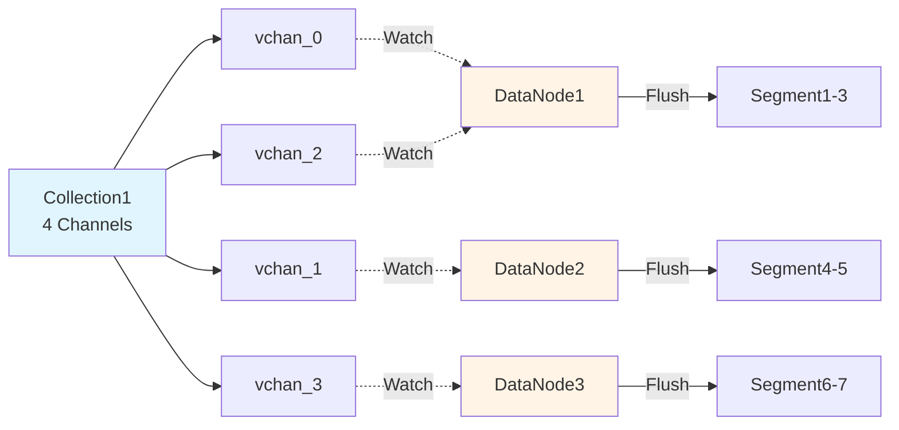

#### 2.2.3 Meta

**职责**：管理Segment元数据的内存缓存与持久化

**数据结构**：

```go
type meta struct {
    sync.RWMutex
    
    // Segment元数据：segmentID -> SegmentInfo
    segments map[UniqueID]*SegmentInfo
    
    // Collection -> Segments映射
    collections map[UniqueID][]UniqueID
    
    // Channel -> Segments映射
    channelSegments map[string][]UniqueID
    
    // 元数据持久化层
    catalog metastore.DataCoordCatalog
    
    // Collection信息缓存
    collectionInfos map[UniqueID]*collectionInfo
}
```

**元数据操作**：

| 操作 | 说明 | 持久化 |
|------|------|--------|
| `AddSegment` | 添加新Segment | 是 |
| `UpdateSegment` | 更新Segment状态 | 是 |
| `DropSegment` | 删除Segment | 是 |
| `GetSegment` | 查询Segment信息 | 否（内存） |
| `ListSegments` | 列出Collection的Segment | 否（内存） |

#### 2.2.4 CompactionTrigger

**职责**：自动触发Compaction任务

**触发策略**：

1. **时间触发**：定期扫描（每10分钟）
2. **事件触发**：Segment Flush完成后检查
3. **手动触发**：用户主动调用API

**Compaction类型**：

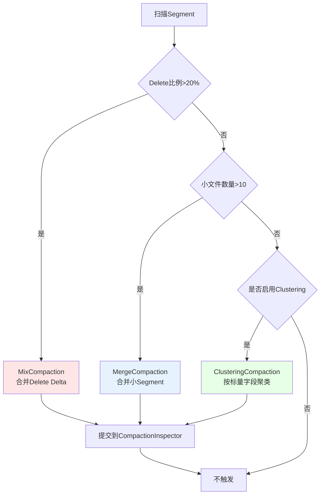

**Compaction收益评估**：

```go
// 计算Compaction收益分数
func (t *compactionTrigger) calculateScore(segments []*SegmentInfo) float64 {
    var totalSize int64
    var totalDeleted int64
    var fragmentScore float64
    
    for _, seg := range segments {
        totalSize += seg.Size
        totalDeleted += seg.NumOfRows * seg.DeleteRatio
        
        // 碎片化分数：小文件越多，分数越高
        if seg.Size < SmallSegmentThreshold {
            fragmentScore += 1.0
        }
    }
    
    deleteRatio := float64(totalDeleted) / float64(totalSize)
    
    // 综合分数 = 删除比例 * 0.7 + 碎片化分数 * 0.3
    return deleteRatio*0.7 + (fragmentScore/float64(len(segments)))*0.3
}
```

#### 2.2.5 GarbageCollector

**职责**：清理无效数据，回收存储空间

**清理对象**：

1. **Dropped Segment的Binlog**
2. **Compaction后的旧Segment**
3. **过期的临时文件**
4. **孤立的索引文件**

**GC流程**：

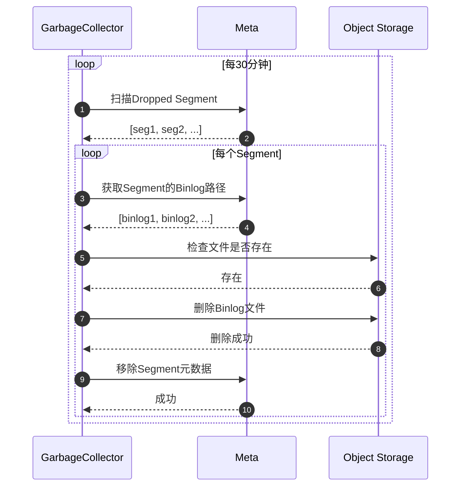

---

## 3. 核心流程

### 3.1 Segment分配流程

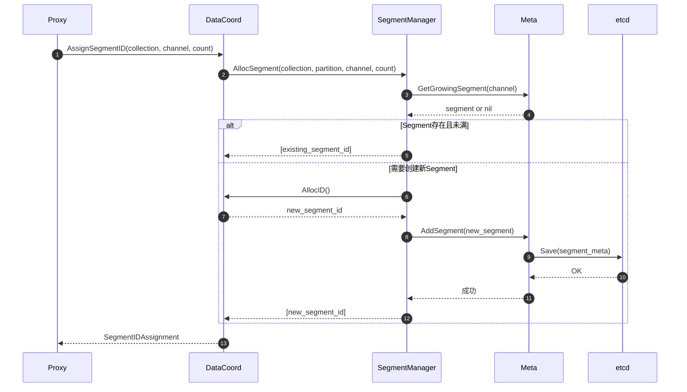

**流程说明**：

1. **步骤1-2**：Proxy请求分配Segment（Insert操作）
2. **步骤3-4**：查询是否有可用的Growing Segment
3. **步骤5-6**：如果存在且容量足够，直接返回
4. **步骤7-12**：创建新Segment，分配ID并持久化元数据
5. **步骤13**：返回SegmentID给Proxy

**边界条件**：

- 单个Segment最大512MB或100万行
- 超时时间：30秒
- 并发安全：Meta层使用RWMutex保护

### 3.2 Flush流程

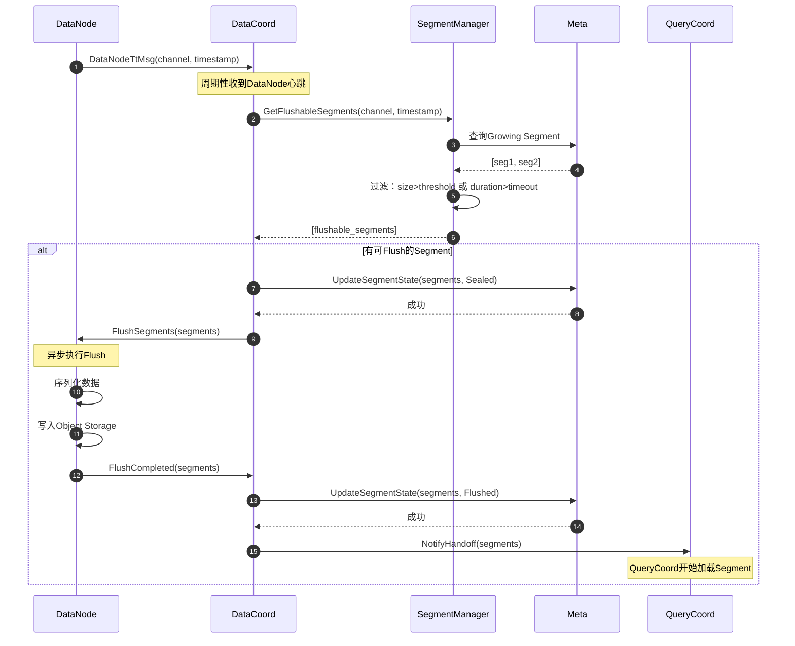

**Flush触发条件**：

| 条件 | 阈值 | 说明 |
|------|------|------|
| **Segment大小** | ≥512MB | 达到最大容量 |
| **数据行数** | ≥100万行 | 行数上限 |
| **时间** | ≥10分钟 | 避免小文件 |
| **手动Flush** | API调用 | 用户主动触发 |

### 3.3 Compaction流程

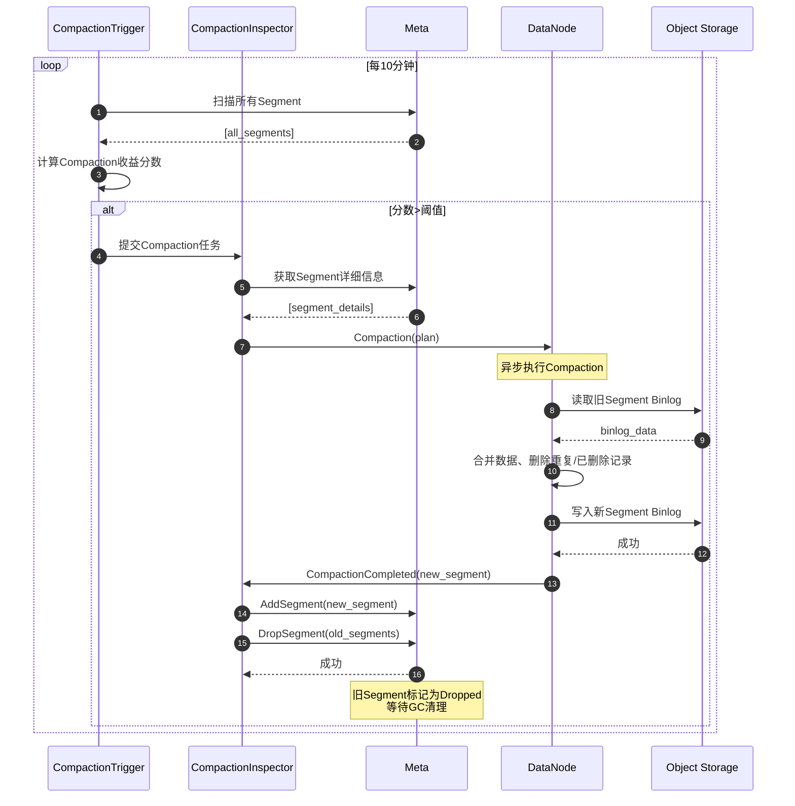

**Compaction类型对比**：

| 类型 | 目的 | 输入 | 输出 | 触发条件 |
|------|------|------|------|----------|
| **MixCompaction** | 清理删除数据 | 1个Segment | 1个Segment | DeleteRatio>20% |
| **MergeCompaction** | 合并小文件 | N个小Segment | 1个大Segment | 小文件数>10 |
| **ClusteringCompaction** | 数据聚类 | N个Segment | N个Segment | 用户配置 |

---

## 4. 关键算法与设计

### 4.1 Segment分配策略

**目标**：最大化Segment利用率，减少小文件数量

**策略**：

1. 优先填充未满的Growing Segment
2. 单个Channel串行分配（避免并发冲突）
3. 预留10%容量（避免频繁Seal）

```go
// Segment分配核心逻辑
func (m *SegmentManager) selectOrCreateSegment(channel string, count int64) (*SegmentInfo, error) {
    // 1. 获取Channel的所有Growing Segment
    segments := m.meta.GetGrowingSegments(channel)
    
    // 2. 按可用空间排序，优先选择最满的Segment（减少碎片）
    sort.Slice(segments, func(i, j int) bool {
        return segments[i].AvailableSize < segments[j].AvailableSize
    })
    
    // 3. 查找容量足够的Segment
    for _, seg := range segments {
        if seg.AvailableSize >= count {
            return seg, nil
        }
    }
    
    // 4. 无可用Segment，创建新Segment
    return m.createSegment(channel, count)
}
```

### 4.2 Flush时机决策

**目标**：平衡写入延迟与文件大小

**决策树**：

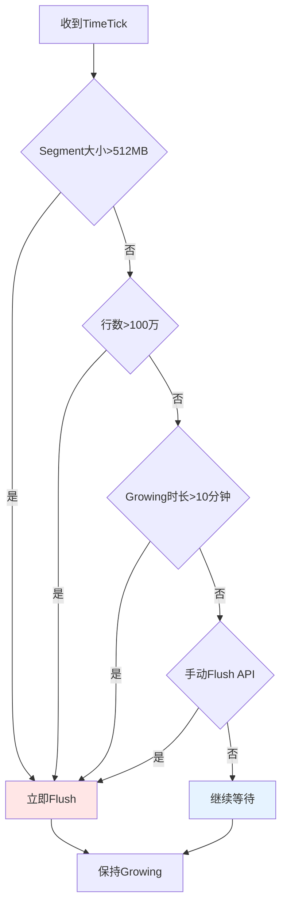

### 4.3 Compaction优先级算法

**目标**：优先处理收益最大的Compaction任务

**优先级计算公式**：

```
Priority = DeleteRatio * 0.4 + FragmentScore * 0.3 + AgeScore * 0.2 + SizeScore * 0.1
```

**各因子说明**：

| 因子 | 权重 | 计算方法 | 说明 |
|------|------|----------|------|
| **DeleteRatio** | 0.4 | deleted_rows / total_rows | 删除比例越高，优先级越高 |
| **FragmentScore** | 0.3 | small_files / total_files | 小文件比例越高，优先级越高 |
| **AgeScore** | 0.2 | days_since_last_compaction / 30 | 越久未Compact，优先级越高 |
| **SizeScore** | 0.1 | total_size / 10GB | 总大小越大，优先级越高 |

**实现代码**：

```go
// 计算Compaction优先级
func (t *compactionTrigger) calculatePriority(plan *CompactionPlan) float64 {
    var totalSize, totalRows, deletedRows int64
    var smallFileCount int
    
    for _, seg := range plan.Segments {
        totalSize += seg.Size
        totalRows += seg.NumRows
        deletedRows += seg.DeletedRows
        
        if seg.Size < SmallSegmentThreshold {
            smallFileCount++
        }
    }
    
    deleteRatio := float64(deletedRows) / float64(totalRows)
    fragmentScore := float64(smallFileCount) / float64(len(plan.Segments))
    ageScore := float64(time.Since(plan.LastCompactionTime).Hours()) / (30 * 24)
    sizeScore := float64(totalSize) / (10 * 1024 * 1024 * 1024) // 10GB
    
    return deleteRatio*0.4 + fragmentScore*0.3 + ageScore*0.2 + sizeScore*0.1
}
```

---

## 5. 性能与容量

### 5.1 性能指标

| 指标 | 数值 | 说明 |
|------|------|------|
| **AssignSegmentID延迟** | P50: 5ms, P99: 20ms | 包含元数据查询 |
| **Flush触发延迟** | <100ms | 从TimeTick到发送Flush命令 |
| **Compaction吞吐** | 100GB/小时/节点 | 取决于DataNode性能 |
| **GC扫描周期** | 30分钟 | 可配置 |
| **元数据查询QPS** | >10000 | 内存缓存 |

### 5.2 容量规划

**单个DataCoord支持规模**：

| 维度 | 容量 | 说明 |
|------|------|------|
| **Collection数量** | 1000 | 超过需要分片 |
| **Segment数量** | 100万 | 内存占用约10GB |
| **Channel数量** | 10000 | 对应DataNode数量 |
| **DataNode数量** | 1000 | 心跳监控 |
| **Compaction并发** | 100 | 可配置 |

### 5.3 监控指标

**关键Metrics**：

```yaml
# Segment相关
milvus_datacoord_segment_num:
  labels: [state, collection]  # Growing/Sealed/Flushed/Indexed
  
milvus_datacoord_segment_size:
  labels: [collection]
  unit: bytes

# Compaction相关
milvus_datacoord_compaction_task_num:
  labels: [state, type]  # Pending/Running/Completed/Failed
  
milvus_datacoord_compaction_latency:
  labels: [type]  # MixCompaction/MergeCompaction
  unit: seconds

# 性能相关
milvus_datacoord_assign_segment_latency:
  labels: []
  unit: milliseconds
  
milvus_datacoord_flush_latency:
  labels: [collection]
  unit: seconds
```

---

## 6. 配置参数

### 6.1 核心配置

```yaml
dataCoord:
  # Segment配置
  segment:
    maxSize: 536870912          # 512MB
    maxRows: 1000000            # 100万行
    sealProportion: 0.9         # 90%触发Seal
    assignmentExpiration: 2000  # 分配过期时间(ms)
    
  # Flush配置
  flush:
    maxIdleDuration: 600        # 10分钟无数据自动Flush
    minSizeToFlush: 1048576     # 最小1MB才Flush
    
  # Compaction配置
  compaction:
    enableAutoCompaction: true
    triggerInterval: 600        # 10分钟扫描一次
    minSegmentToMerge: 4        # 最少4个Segment才合并
    maxSegmentToMerge: 30       # 最多合并30个Segment
    
  # GC配置
  gc:
    interval: 1800              # 30分钟执行一次
    missingTolerance: 86400     # 文件丢失容忍时间(1天)
    dropTolerance: 86400        # Segment删除后保留时间(1天)
```

---

## 7. 故障处理

### 7.1 常见故障

| 故障类型 | 现象 | 原因 | 处理 |
|---------|------|------|------|
| **Segment分配失败** | AssignSegmentID超时 | etcd不可用 | 重试；检查etcd连接 |
| **Flush超时** | Segment长时间Sealed | DataNode故障 | 重新分配Channel |
| **Compaction堆积** | 任务pending数量增加 | DataNode性能不足 | 扩容DataNode |
| **元数据不一致** | 查询返回错误数据 | etcd数据损坏 | 重启DataCoord重新加载 |

### 7.2 降级策略

**当etcd不可用时**：

- 只读模式：继续提供Segment查询服务（基于内存缓存）
- 禁止新Segment创建
- 延迟Flush和Compaction任务

**当DataNode不足时**：

- 降低Flush触发阈值（减少Growing Segment）
- 暂停Compaction任务
- 告警通知运维扩容

---

## 8. 最佳实践

### 8.1 Segment大小调优

**推荐配置**：

| 数据特征 | Segment大小 | 原因 |
|---------|------------|------|
| **高频写入** | 256MB | 减少Flush延迟 |
| **低频写入** | 512MB | 减少小文件数量 |
| **大向量(>1024维)** | 1GB | 提高检索效率 |
| **小向量(<128维)** | 256MB | 平衡内存与性能 |

### 8.2 Compaction策略

**定期手动Compaction**：

```bash
# 在业务低峰期（如凌晨2点）手动触发
curl -X POST "http://datacoord:13333/api/v1/compaction" \
  -d '{"collectionID": 123}'
```

**监控Compaction积压**：

```promql
# 告警规则：Compaction任务pending数量>50
milvus_datacoord_compaction_task_num{state="pending"} > 50
```

### 8.3 容量规划

**估算公式**：

```
Segment数量 = 数据总大小 / Segment大小
内存占用 = Segment数量 * 10KB  # 每个Segment元数据约10KB
```

**示例**：

- 数据总量：10TB
- Segment大小：512MB
- Segment数量：10TB / 512MB = 20,000个
- 元数据内存：20,000 * 10KB = 200MB

---

**相关文档**：

- [Milvus-00-总览.md](./Milvus-00-总览.md)
- [Milvus-03-DataCoord-API.md](./Milvus-03-DataCoord-API.md) *(待生成)*
- [Milvus-03-DataCoord-数据结构.md](./Milvus-03-DataCoord-数据结构.md) *(待生成)*
- [Milvus-03-DataCoord-时序图.md](./Milvus-03-DataCoord-时序图.md) *(待生成)*
- [Milvus-05-DataNode-概览.md](./Milvus-05-DataNode-概览.md) *(待生成)*
