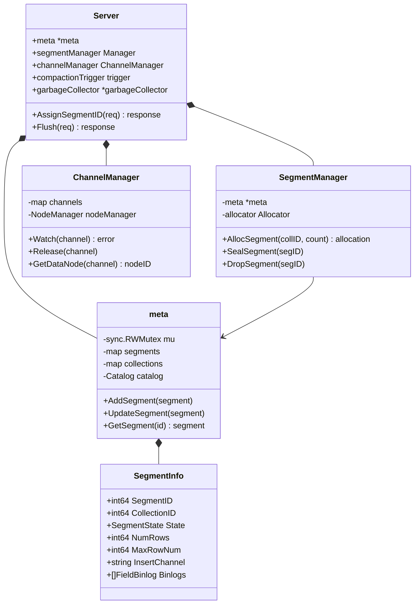
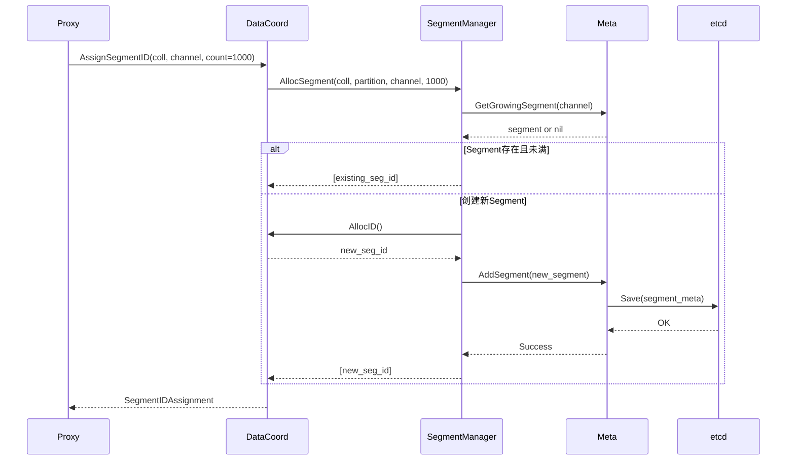
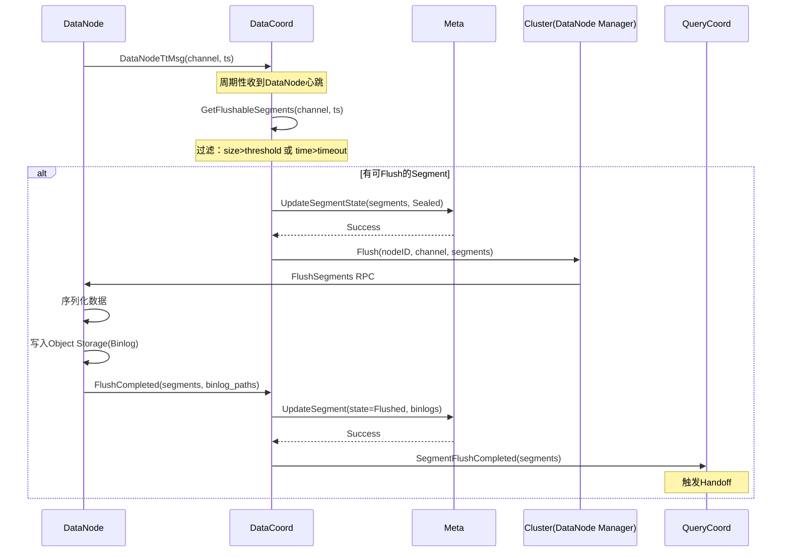
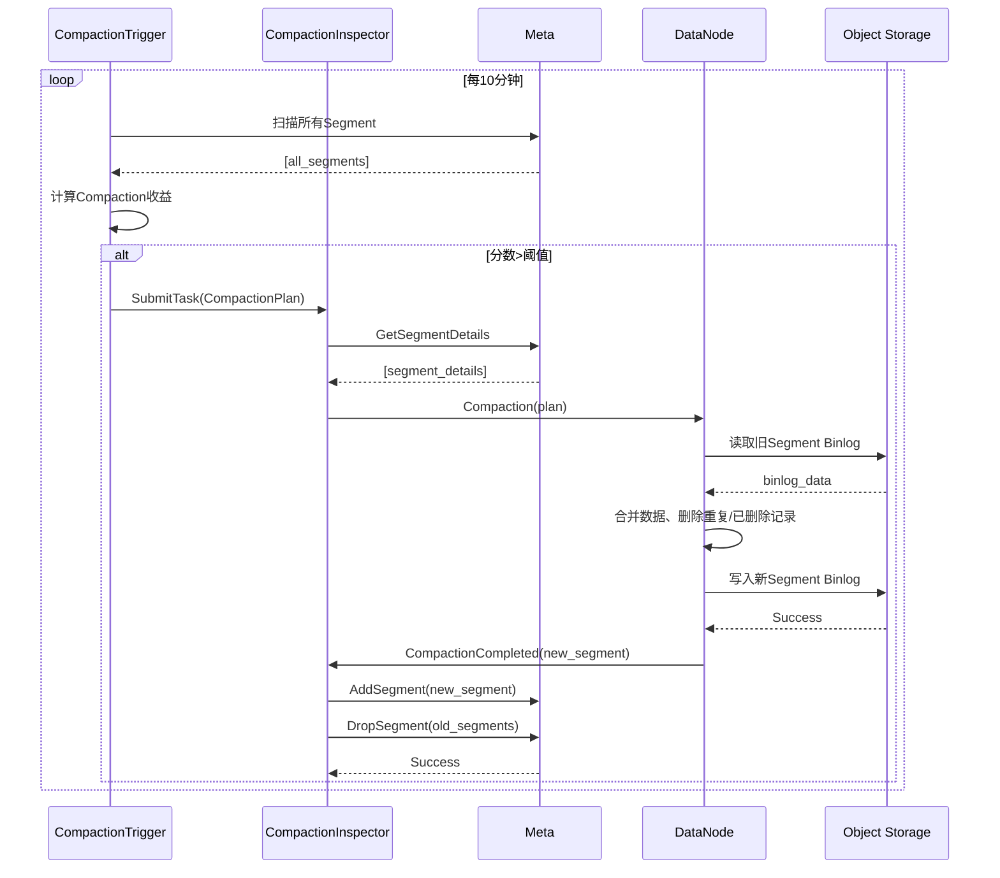
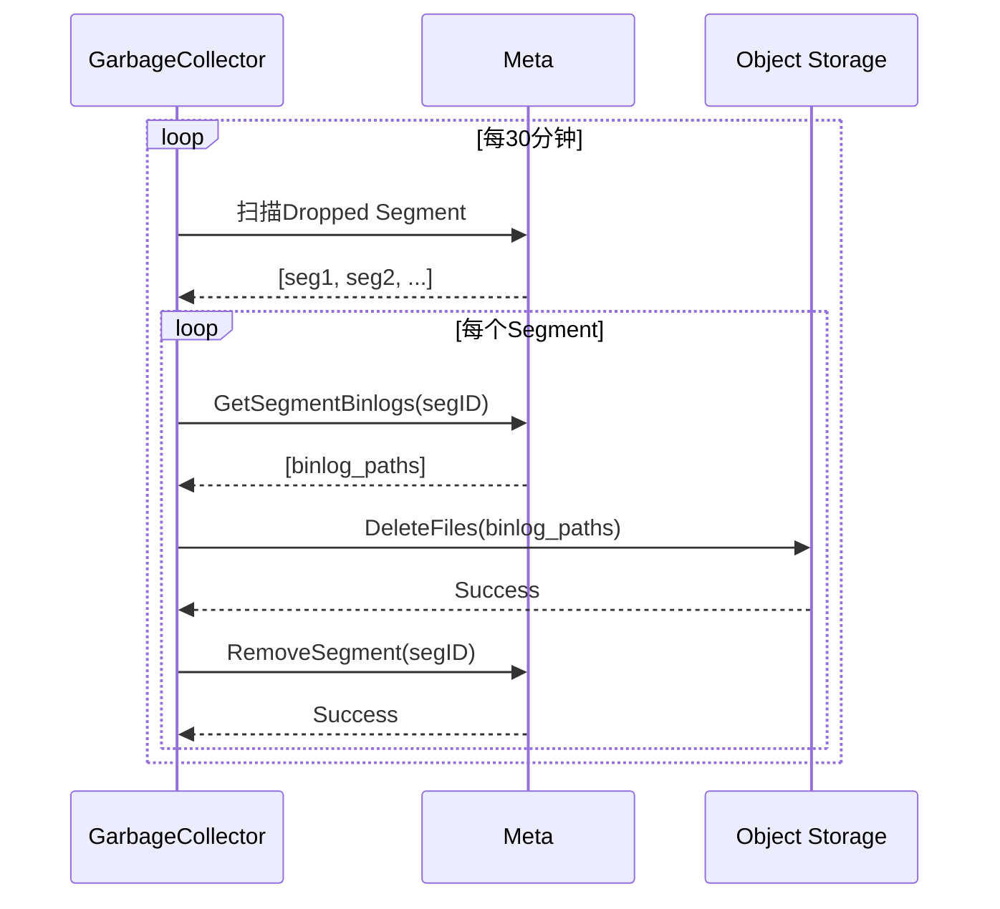

# Milvus-03-DataCoord-详细文档

本文档整合DataCoord的API、数据结构和关键时序图。

## 📋 目录
1. [核心API](#1-核心api)
2. [数据结构](#2-数据结构)
3. [关键时序图](#3-关键时序图)

---

## 1. 核心API

### 1.1 AssignSegmentID

**功能**：为数据写入分配Segment

**请求参数**：

```go
type AssignSegmentIDRequest struct {
    SegmentIDRequests []*SegmentIDRequest
}

type SegmentIDRequest struct {
    CollectionID int64
    PartitionID  int64
    ChannelName  string
    Count        uint32  // 需要写入的行数
}
```

**响应参数**：

```go
type SegmentIDAssignment struct {
    SegID        int64   // 分配的SegmentID
    ChannelName  string
    Count        uint32
    CollectionID int64
    PartitionID  int64
    ExpireTime   uint64  // 分配过期时间
}
```

**核心代码**：

```go
func (s *Server) AssignSegmentID(ctx context.Context, req *datapb.AssignSegmentIDRequest) (*datapb.AssignSegmentIDResponse, error) {
    assigns := make([]*datapb.SegmentIDAssignment, 0)
    
    for _, r := range req.SegmentIDRequests {
        // 调用SegmentManager分配
        allocations, err := s.segmentManager.AllocSegment(ctx,
            r.CollectionID, r.PartitionID, r.ChannelName, int64(r.Count), r.StorageVersion)
        
        for _, allocation := range allocations {
            assigns = append(assigns, &datapb.SegmentIDAssignment{
                SegID:        allocation.SegmentID,
                ChannelName:  r.ChannelName,
                Count:        uint32(allocation.NumOfRows),
                CollectionID: r.CollectionID,
                PartitionID:  r.PartitionID,
                ExpireTime:   allocation.ExpireTime,
            })
        }
    }
    
    return &datapb.AssignSegmentIDResponse{
        Status:      merr.Success(),
        SegIDAssignments: assigns,
    }, nil
}
```

### 1.2 Flush

**功能**：触发DataNode Flush操作

**请求参数**：

```go
type FlushRequest struct {
    DbID         int64
    CollectionID int64
    SegmentIDs   []int64  // 指定要Flush的Segment（可选）
}
```

**核心代码**：

```go
func (s *Server) Flush(ctx context.Context, req *datapb.FlushRequest) (*datapb.FlushResponse, error) {
    // 1. 分配Flush时间戳
    ts, err := s.allocator.AllocTimestamp(ctx)
    
    // 2. 执行Flush
    flushResult, err := s.flushCollection(ctx, req.CollectionID, ts, req.SegmentIDs)
    
    return &datapb.FlushResponse{
        Status:          merr.Success(),
        SegmentIDs:      flushResult.SegmentIDs,
        FlushSegmentIDs: flushResult.FlushSegmentIDs,
        TimeOfSeal:      flushResult.TimeOfSeal,
        FlushTs:         flushResult.FlushTs,
    }, nil
}

func (s *Server) flushCollection(ctx context.Context, collID int64, ts Timestamp, segIDs []int64) (*datapb.FlushResult, error) {
    // 1. 获取所有Channel
    channels := s.channelManager.GetChannelsByCollectionID(collID)
    
    // 2. 为每个Channel触发Flush
    for _, channel := range channels {
        segments := s.meta.GetSegmentsByChannel(channel)
        
        // 过滤：只Flush Growing Segment
        growingSegments := filterGrowingSegments(segments)
        
        // 调用DataNode Flush
        s.cluster.Flush(ctx, channel, growingSegments)
    }
    
    return &datapb.FlushResult{...}, nil
}
```

### 1.3 GetSegmentInfo

**功能**：查询Segment元信息

**请求参数**：

```go
type GetSegmentInfoRequest struct {
    SegmentIDs   []int64
    IncludeUnHealthy bool
}
```

**响应参数**：

```go
type SegmentInfo struct {
    ID             int64
    CollectionID   int64
    PartitionID    int64
    InsertChannel  string
    NumOfRows      int64
    State          commonpb.SegmentState  // Growing/Sealed/Flushed
    MaxRowNum      int64
    LastExpireTime uint64
    StartPosition  *msgpb.MsgPosition
    DmlPosition    *msgpb.MsgPosition
    Binlogs        []*FieldBinlog
    Statslogs      []*FieldBinlog
    Deltalogs      []*FieldBinlog
}
```

---

## 2. 数据结构

### 2.1 核心数据结构UML



### 2.2 SegmentInfo详解

```go
type SegmentInfo struct {
    // 标识
    SegmentID    int64
    CollectionID int64
    PartitionID  int64
    
    // 状态
    State        commonpb.SegmentState  // Growing/Sealed/Flushed/Dropped
    
    // 容量
    NumOfRows    int64   // 当前行数
    MaxRowNum    int64   // 最大行数（默认100万）
    
    // Channel
    InsertChannel string  // 所属DML Channel
    
    // 时间信息
    StartPosition  *msgpb.MsgPosition  // 起始消息位置
    DmlPosition    *msgpb.MsgPosition  // 最新DML位置
    LastExpireTime uint64              // 最后过期时间
    
    // Binlog文件
    Binlogs    []*FieldBinlog  // Insert Log
    Statslogs  []*FieldBinlog  // Stats Log
    Deltalogs  []*FieldBinlog  // Delete Log
    
    // 索引
    IndexInfos []*IndexInfo
    
    // Compaction
    CompactionFrom []int64  // 由哪些Segment Compact而来
    
    // 大小
    Size int64  // 字节数
}

// FieldBinlog 字段Binlog
type FieldBinlog struct {
    FieldID int64
    Binlogs []*Binlog
}

type Binlog struct {
    EntriesNum    int64
    TimestampFrom uint64
    TimestampTo   uint64
    LogPath       string  // Object Storage路径
    LogSize       int64
}
```

### 2.3 Segment状态机

```
Growing → Sealed → Flushing → Flushed → Indexed → Dropped

状态说明：

- Growing: 内存中，接受新数据
- Sealed: 已封闭，不再接受新数据
- Flushing: Flush进行中
- Flushed: 已持久化到Object Storage
- Indexed: 索引构建完成
- Dropped: 已标记删除，等待GC

```

### 2.4 SegmentManager

```go
type SegmentManager struct {
    meta      *meta
    allocator allocator.Allocator
    
    mu sync.RWMutex
    // Channel → Growing Segments
    segments map[string][]*SegmentInfo
}

// AllocSegment 分配Segment
func (sm *SegmentManager) AllocSegment(ctx context.Context, collID, partID int64, channelName string, count int64, version int64) ([]*Allocation, error) {
    // 1. 查找未满的Growing Segment
    segment := sm.getGrowingSegment(channelName, collID, partID)
    
    if segment != nil && segment.AvailableSize() >= count {
        // 复用现有Segment
        return []*Allocation{{
            SegmentID:  segment.ID,
            NumOfRows:  count,
            ExpireTime: time.Now().Add(SegmentExpireDuration).Unix(),
        }}, nil
    }
    
    // 2. 创建新Segment
    newSegID, err := sm.allocator.allocID(ctx)
    if err != nil {
        return nil, err
    }
    
    newSegment := &SegmentInfo{
        SegmentID:     newSegID,
        CollectionID:  collID,
        PartitionID:   partID,
        InsertChannel: channelName,
        State:         commonpb.SegmentState_Growing,
        MaxRowNum:     Params.SegmentMaxSize,
        NumOfRows:     0,
    }
    
    // 3. 持久化
    err = sm.meta.AddSegment(ctx, newSegment)
    
    return []*Allocation{{SegmentID: newSegID, NumOfRows: count}}, nil
}
```

---

## 3. 关键时序图

### 3.1 AssignSegmentID时序图



### 3.2 Flush时序图



### 3.3 Compaction时序图



### 3.4 GC流程时序图



---

## 4. 关键算法

### 4.1 Segment分配策略

```go
// 优先级：
// 1. 优先复用未满的Growing Segment（减少小文件）
// 2. 单个Channel串行分配（避免并发冲突）
// 3. 预留10%容量（避免频繁Seal）

func (sm *SegmentManager) selectOrCreateSegment(channel string, count int64) (*SegmentInfo, error) {
    segments := sm.getGrowingSegments(channel)
    
    // 按可用空间排序，优先选择最满的Segment
    sort.Slice(segments, func(i, j int) bool {
        return segments[i].AvailableSize() < segments[j].AvailableSize()
    })
    
    for _, seg := range segments {
        if seg.AvailableSize() >= count {
            return seg, nil
        }
    }
    
    // 无可用Segment，创建新的
    return sm.createSegment(channel, count)
}
```

### 4.2 Flush触发条件

```go
func (sm *SegmentManager) GetFlushableSegments(channel string, ts Timestamp) ([]int64, error) {
    segments := sm.getGrowingSegments(channel)
    flushable := []int64{}
    
    for _, seg := range segments {
        // 条件1：大小超过阈值（512MB）
        if seg.Size >= SegmentMaxSize {
            flushable = append(flushable, seg.ID)
            continue
        }
        
        // 条件2：行数超过阈值（100万）
        if seg.NumOfRows >= SegmentMaxRows {
            flushable = append(flushable, seg.ID)
            continue
        }
        
        // 条件3：时间超过阈值（10分钟）
        duration := time.Since(seg.CreateTime)
        if duration > SegmentFlushTimeout {
            flushable = append(flushable, seg.ID)
            continue
        }
    }
    
    return flushable, nil
}
```

### 4.3 Compaction优先级

```go
func (ct *compactionTrigger) calculatePriority(segments []*SegmentInfo) float64 {
    var totalSize, totalRows, deletedRows int64
    var smallFileCount int
    
    for _, seg := range segments {
        totalSize += seg.Size
        totalRows += seg.NumRows
        deletedRows += seg.DeletedRows
        
        if seg.Size < SmallSegmentThreshold {
            smallFileCount++
        }
    }
    
    deleteRatio := float64(deletedRows) / float64(totalRows)
    fragmentScore := float64(smallFileCount) / float64(len(segments))
    ageScore := float64(time.Since(segments[0].LastCompactionTime).Hours()) / (30 * 24)
    sizeScore := float64(totalSize) / (10 * 1024 * 1024 * 1024)
    
    // 加权计算优先级
    return deleteRatio*0.4 + fragmentScore*0.3 + ageScore*0.2 + sizeScore*0.1
}
```

---

**相关文档**：

- [Milvus-03-DataCoord-概览.md](./Milvus-03-DataCoord-概览.md)
- [Milvus-05-DataNode-概览.md](./Milvus-05-DataNode-概览.md)
