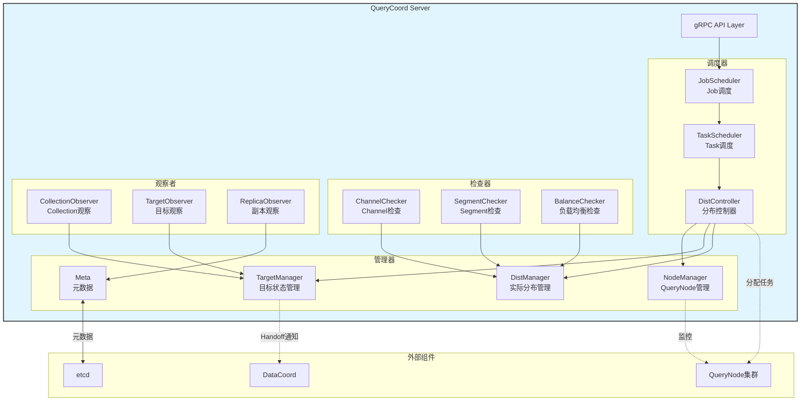
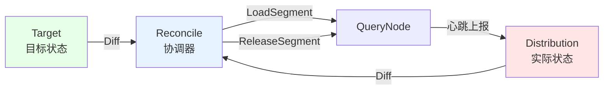
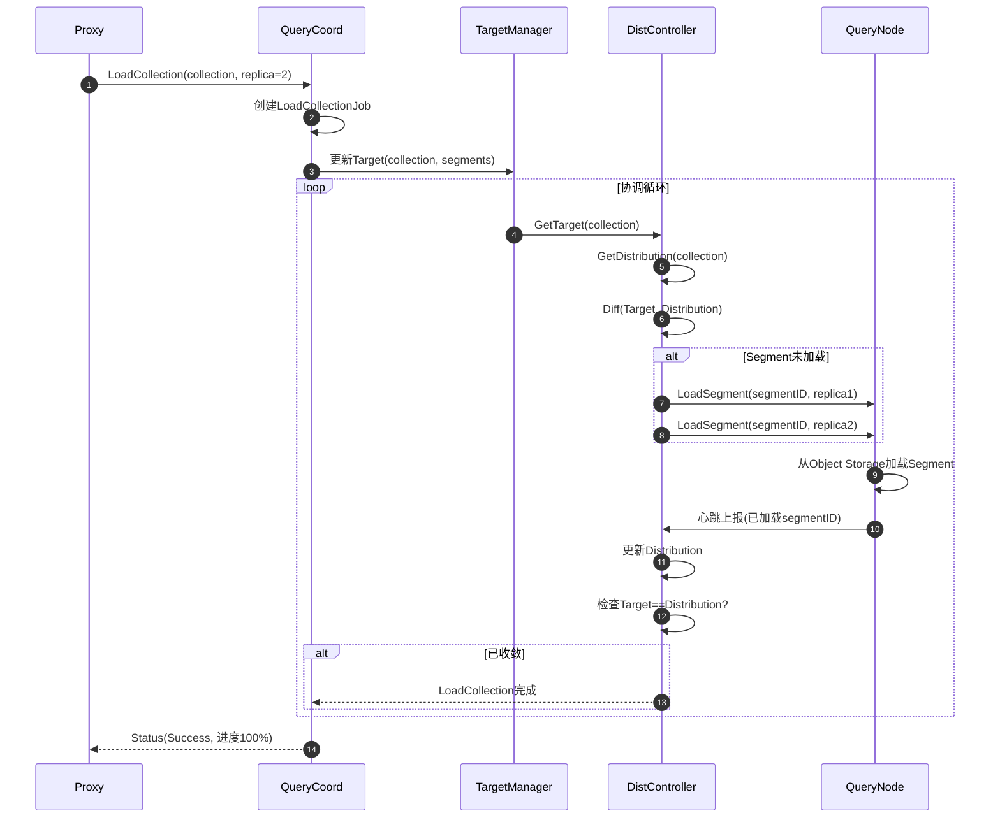
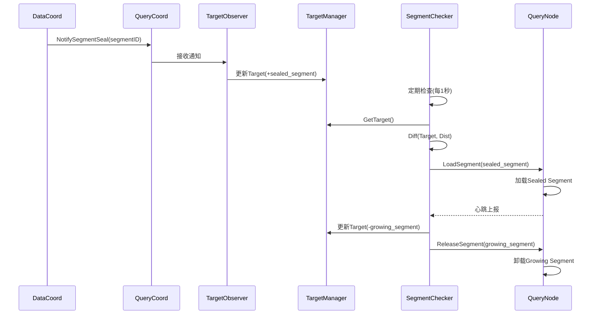
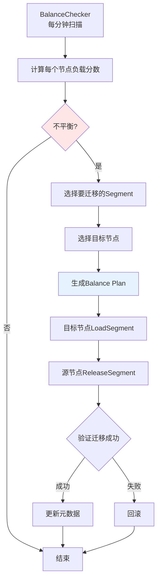
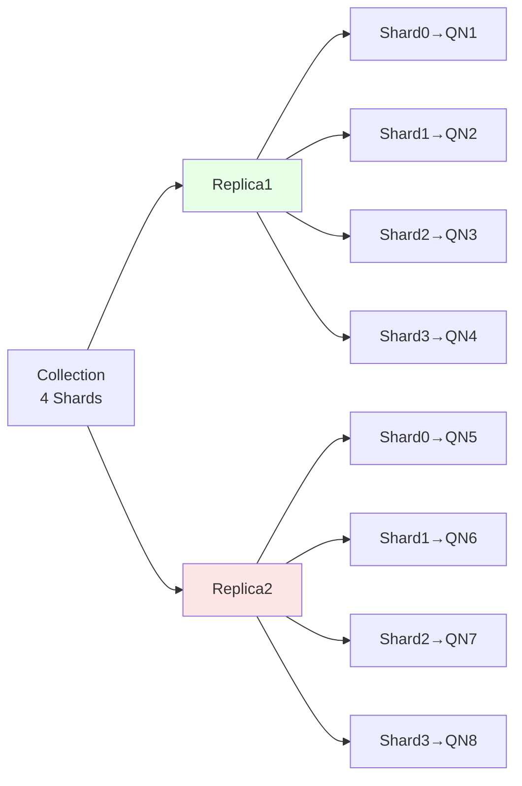

# Milvus-04-QueryCoord-概览

## 1. 模块概述

### 1.1 职责定义

QueryCoord（查询协调器）负责管理查询节点、协调数据加载和查询任务分配。

**核心职责**：

1. **QueryNode管理**
   - 节点注册与心跳监控
   - 节点资源统计
   - 故障检测与恢复

2. **Collection加载管理**
   - LoadCollection/ReleaseCollection
   - Segment分配到QueryNode
   - 副本管理（Replica）

3. **负载均衡**
   - Segment自动迁移
   - Channel负载均衡
   - 节点间负载均衡

4. **Handoff协调**
   - Growing → Sealed Segment切换
   - 通知QueryNode加载新Segment
   - 卸载旧Segment

5. **查询任务协调**
   - ShardLeader管理
   - 查询路由信息提供
   - DQL Channel管理

### 1.2 架构图



### 1.3 核心概念

**Target（目标状态）**：

- Collection应该加载哪些Segment
- 每个Segment应该在哪些节点上（副本数）

**Distribution（实际分布）**：

- 当前各QueryNode实际加载的Segment
- 实时收集QueryNode心跳获取

**Reconcile（协调）**：

- 对比Target与Distribution的差异
- 生成LoadSegment/ReleaseSegment任务
- 驱动Distribution收敛到Target



---

## 2. 核心流程

### 2.1 LoadCollection流程



### 2.2 Handoff流程

**触发场景**：DataNode Flush完成，Segment从Growing变为Sealed



### 2.3 负载均衡流程

**触发条件**：

- 节点间Segment数量差异>20%
- 节点内存使用率>80%
- 手动触发Balance API



---

## 3. 关键设计

### 3.1 副本管理（Replica）

**目的**：提高查询可用性和吞吐量



**负载均衡时选择副本**：

```go
// Proxy查询时选择副本
func selectReplica(replicas []*Replica) *Replica {
    // 轮询或基于负载选择
    return replicas[rand.Intn(len(replicas))]
}
```

### 3.2 Task与Job

**Job**：用户级操作（LoadCollection、ReleaseCollection）
**Task**：具体执行单元（LoadSegment、ReleaseSegment）

```
LoadCollectionJob
  ├── LoadSegmentTask (Segment1 → QN1)
  ├── LoadSegmentTask (Segment1 → QN2)  # 副本2
  ├── LoadSegmentTask (Segment2 → QN1)
  └── ...
```

### 3.3 Resource Group

**资源隔离**：将QueryNode划分到不同资源组

```yaml
ResourceGroups:

  - Name: "rg_high_priority"
    Nodes: [QN1, QN2, QN3]
    Capacity: 100GB
    
  - Name: "rg_low_priority"
    Nodes: [QN4, QN5]
    Capacity: 50GB

# Collection可指定ResourceGroup
LoadCollection(collection="important", resource_group="rg_high_priority")
```

---

## 4. 性能与容量

### 4.1 性能指标

| 指标 | 数值 | 说明 |
|------|------|------|
| **LoadCollection延迟** | 数据量/加载速度 | 10GB约10-30秒 |
| **Handoff延迟** | P99: 5秒 | Segment切换 |
| **Balance延迟** | 数据量/带宽 | 1GB约5-10秒 |
| **HeartBeat处理** | >10000 QPS | 来自QueryNode |

### 4.2 容量规划

| 维度 | 容量 | 说明 |
|------|------|------|
| **QueryNode数量** | 1000 | 单QueryCoord |
| **Loaded Collection数量** | 100 | 并发加载 |
| **Segment数量** | 100万 | 内存占用约5GB |

---

## 5. 配置参数

```yaml
queryCoord:
  # 心跳配置
  heartbeatAvailableTime: 10000  # QueryNode心跳超时(ms)
  
  # 负载均衡
  balanceIntervalSeconds: 60     # Balance检查周期
  balanceSegmentCntThreshold: 100  # 触发Balance的Segment差异阈值
  
  # 任务调度
  taskExecutionCap: 256          # 最大并发Task数
  
  # Handoff
  handoffSegmentNum: 4           # 每次Handoff的Segment数
```

---

**相关文档**：

- [Milvus-00-总览.md](./Milvus-00-总览.md)
- [Milvus-06-QueryNode-概览.md](./Milvus-06-QueryNode-概览.md) *(待生成)*
