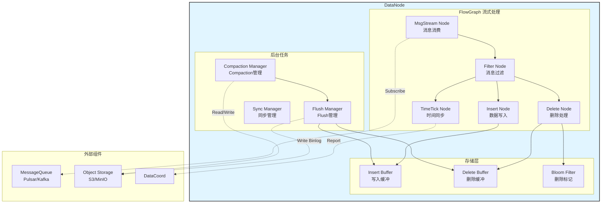
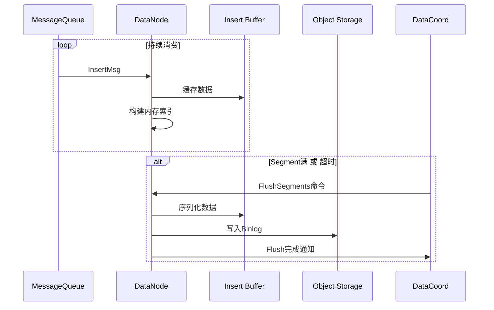
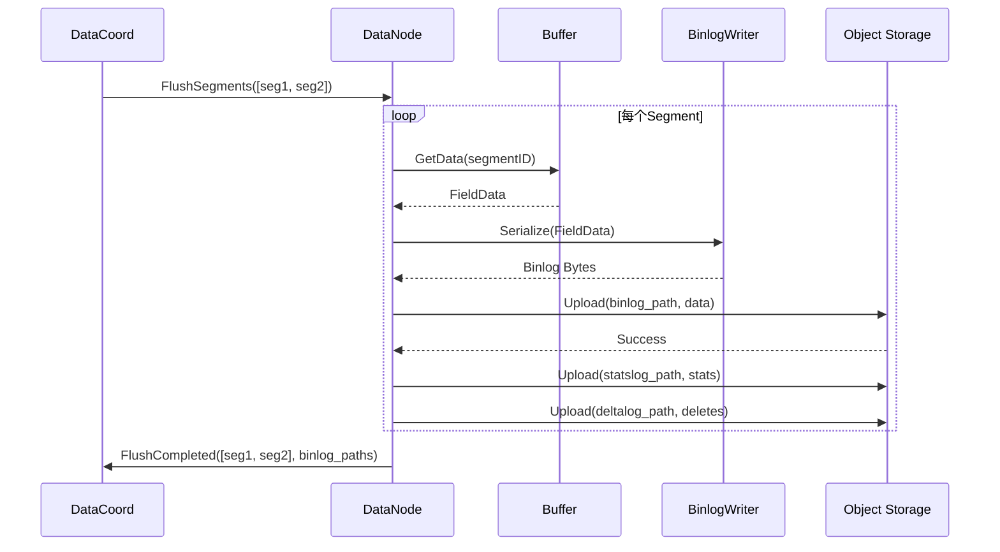

# Milvus-05-DataNode-概览

## 1. 模块概述

### 1.1 职责定义

DataNode负责数据消费、缓存和持久化，是Milvus数据写入路径的执行者。

**核心职责**：

1. **消息消费**
   - 订阅DML Channel（Pulsar/Kafka）
   - 消费InsertMsg/DeleteMsg
   - 维护消费进度（Checkpoint）

2. **数据缓存**
   - Growing Segment内存缓存
   - 构建内存索引（inverted index）
   - 处理Delete操作（Bloom Filter）

3. **数据Flush**
   - 接收DataCoord Flush命令
   - 序列化数据为Binlog格式
   - 写入Object Storage（S3/MinIO）

4. **Compaction执行**
   - 合并小Segment（MergeCompaction）
   - 清理删除数据（MixCompaction）
   - 数据聚类（ClusteringCompaction）

5. **时间同步**
   - 定期上报TimeTick到DataCoord
   - 保证数据可见性

### 1.2 架构图



### 1.3 核心数据流



---

## 2. 核心流程

### 2.1 FlowGraph机制

**FlowGraph**：流式数据处理框架

```go
// FlowGraph节点接口
type Node interface {
    Name() string
    Operate(in []Msg) []Msg
}

// 示例：Insert Node
type insertNode struct {
    insertBuffer *InsertBuffer
}

func (n *insertNode) Operate(in []Msg) []Msg {
    insertMsg := in[0].(*InsertMsg)
    
    // 写入缓冲区
    n.insertBuffer.Buffer(insertMsg.Data)
    
    // 传递给下游节点
    return []Msg{insertMsg}
}
```

**节点拓扑**：

```
MsgStream → Filter → Insert → Delete → TimeTick
                      ↓         ↓        ↓
                   Buffer    Buffer   Report
```

### 2.2 Flush流程



**Binlog格式**：

```
InsertLog:

  - 字段1.binlog (Int64字段)
  - 字段2.binlog (FloatVector字段)
  - ...

StatsLog:

  - segment_stats.json (行数、大小等)

DeltaLog:

  - delta.binlog (删除的PrimaryKey列表)

```

### 2.3 Compaction流程

**MixCompaction（清理删除数据）**：


**MergeCompaction（合并小文件）**：

```
输入: [Seg1(100MB), Seg2(50MB), Seg3(80MB)]
输出: [Seg_Merged(230MB)]
```

---

## 3. 关键设计

### 3.1 Insert Buffer

**目的**：缓存数据，减少Flush频率

```go
type InsertBuffer struct {
    // Channel -> SegmentID -> FieldData
    data map[string]map[int64]*FieldDataBuffer
    
    mu sync.RWMutex
}

// 写入数据
func (buf *InsertBuffer) Buffer(segmentID int64, fieldData *FieldData) {
    buf.mu.Lock()
    defer buf.mu.Unlock()
    
    if buf.data[segmentID] == nil {
        buf.data[segmentID] = NewFieldDataBuffer()
    }
    
    buf.data[segmentID].Append(fieldData)
}

// Flush时序列化
func (buf *InsertBuffer) Serialize(segmentID int64) ([]byte, error) {
    buf.mu.RLock()
    defer buf.mu.RUnlock()
    
    return buf.data[segmentID].MarshalBinlog()
}
```

### 3.2 Delete Buffer与Bloom Filter

**Delete处理**：

```go
type DeleteBuffer struct {
    // SegmentID -> PrimaryKeys
    deletes map[int64]*roaring.Bitmap
    
    // Bloom Filter：快速判断PK是否被删除
    bloomFilters map[int64]*BloomFilter
}

// 记录删除
func (buf *DeleteBuffer) Delete(segmentID int64, pk int64) {
    buf.deletes[segmentID].Add(pk)
    buf.bloomFilters[segmentID].Add(pk)
}

// 查询时过滤
func (buf *DeleteBuffer) IsDeleted(segmentID int64, pk int64) bool {
    // 先用Bloom Filter快速判断
    if !buf.bloomFilters[segmentID].Test(pk) {
        return false
    }
    
    // 再用精确数据确认
    return buf.deletes[segmentID].Contains(pk)
}
```

### 3.3 Checkpoint机制

**目的**：记录消费进度，支持故障恢复

```go
type Checkpoint struct {
    Channel  string
    Position msgstream.Position  // MessageQueue Position
    Timestamp uint64
}

// 定期持久化Checkpoint
func (dn *DataNode) saveCheckpoint() {
    for channel, pos := range dn.positions {
        checkpoint := &Checkpoint{
            Channel:   channel,
            Position:  pos,
            Timestamp: dn.latestTimestamp,
        }
        
        dn.etcd.Save(checkpointKey(channel), checkpoint)
    }
}

// 启动时恢复
func (dn *DataNode) recoverFromCheckpoint() {
    checkpoint := dn.etcd.Load(checkpointKey(channel))
    dn.msgStream.Seek(checkpoint.Position)
}
```

---

## 4. 性能与容量

### 4.1 性能指标

| 指标 | 数值 | 说明 |
|------|------|------|
| **Insert吞吐** | 10-50MB/s/node | 取决于CPU和内存 |
| **Flush延迟** | 1-5秒/GB | 取决于Object Storage带宽 |
| **Compaction吞吐** | 100GB/小时/node | CPU密集 |
| **内存占用** | 数据量*1.5 | 包含索引 |

### 4.2 容量规划

| 维度 | 容量 | 说明 |
|------|------|------|
| **Channel数量/节点** | 10-50 | 取决于CPU核数 |
| **Growing Segment缓存** | <内存50% | 避免OOM |
| **Compaction并发** | CPU核数*0.5 | CPU密集 |

---

## 5. 配置参数

```yaml
dataNode:
  # FlowGraph配置
  flowGraph:
    maxQueueLength: 1024      # 节点间队列长度
    maxParallelism: 1024      # 最大并行度
    
  # Flush配置
  flush:
    insertBufSize: 16777216   # 16MB
    deleteBufSize: 16777216   # 16MB
    
  # Compaction配置
  compaction:
    enabled: true
    memoryRatio: 0.5          # 最大使用50%内存
```

---

**相关文档**：

- [Milvus-00-总览.md](./Milvus-00-总览.md)
- [Milvus-03-DataCoord-概览.md](./Milvus-03-DataCoord-概览.md)
