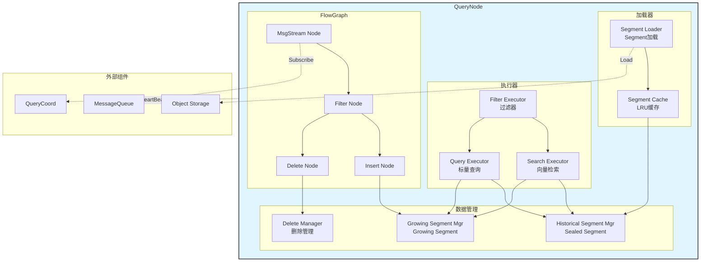
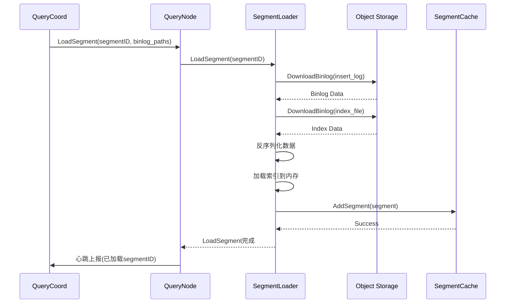
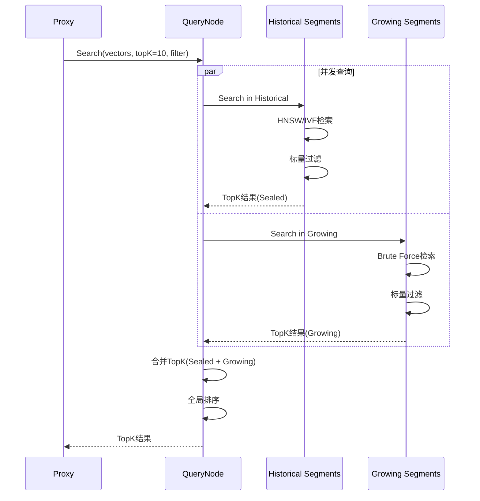
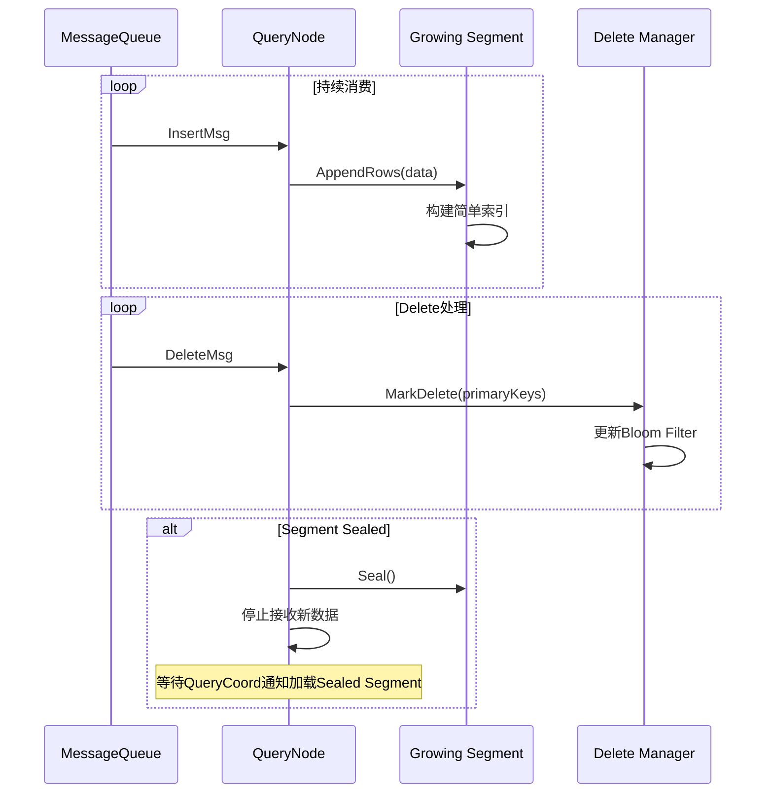

# Milvus-06-QueryNode-概览

## 1. 模块概述

### 1.1 职责定义

QueryNode负责向量检索和标量查询的执行，是Milvus查询路径的核心执行引擎。

**核心职责**：

1. **Segment加载**
   - 从Object Storage加载Sealed Segment
   - 加载索引文件（HNSW/IVF/DiskANN）
   - 管理内存Segment缓存（LRU）

2. **Growing Segment管理**
   - 订阅DML Channel
   - 维护增量数据（未Flush的数据）
   - 实时应用Delete操作

3. **向量检索**
   - 调用向量索引（Knowhere）
   - TopK合并（Sealed + Growing）
   - 距离计算与排序

4. **标量过滤**
   - 执行表达式过滤（expr："age>18"）
   - Bitmap索引加速
   - 结果集合并

5. **查询执行**
   - Query（标量查询）
   - Search（向量检索）
   - GetVector（根据ID获取向量）

### 1.2 架构图



### 1.3 Segment类型

**Historical Segment（Sealed）**：

- 已Flush到Object Storage
- 只读，不再变更
- 有索引（HNSW/IVF等）

**Growing Segment**：

- 内存中，未Flush
- 持续接收新数据
- 使用Brute Force检索或简单索引


---

## 2. 核心流程

### 2.1 LoadSegment流程



**加载优化**：

- **并发加载**：多个Segment并行下载
- **分片加载**：大Segment分批加载
- **Mmap模式**：索引使用Mmap减少内存

### 2.2 Search流程



**检索策略**：

| Segment类型 | 索引类型 | 检索算法 | 性能 |
|------------|---------|---------|------|
| **Historical** | HNSW | 图检索 | 高（毫秒级） |
| **Historical** | IVF | 倒排检索 | 中（10-50ms） |
| **Growing** | 无 | Brute Force | 低（秒级） |
| **Growing** | FLAT | 线性扫描 | 低 |

### 2.3 Growing Segment处理



---

## 3. 关键设计

### 3.1 Segment Cache（LRU）

**目的**：内存有限，无法加载所有Segment

```go
type SegmentCache struct {
    // LRU缓存
    cache *lru.Cache  // segmentID -> *Segment
    
    // 内存限制
    maxMemory int64
    usedMemory atomic.Int64
}

// 加载Segment（自动淘汰）
func (c *SegmentCache) LoadSegment(segmentID int64) (*Segment, error) {
    // 1. 检查缓存
    if seg, ok := c.cache.Get(segmentID); ok {
        return seg.(*Segment), nil
    }
    
    // 2. 加载新Segment
    newSeg := c.loader.Load(segmentID)
    
    // 3. 检查内存是否足够
    for c.usedMemory.Load() + newSeg.MemorySize > c.maxMemory {
        // 淘汰最久未使用的Segment
        c.cache.RemoveOldest()
    }
    
    // 4. 加入缓存
    c.cache.Add(segmentID, newSeg)
    c.usedMemory.Add(newSeg.MemorySize)
    
    return newSeg, nil
}
```

### 3.2 向量索引（Knowhere）

**Knowhere**：Milvus的向量索引库

支持的索引类型：

| 索引 | 适用场景 | 构建时间 | 查询性能 | 内存占用 |
|------|---------|---------|---------|---------|
| **FLAT** | 小数据集（<10万） | 无需构建 | 低 | 1x |
| **IVF_FLAT** | 中等数据集 | 快 | 中 | 1x |
| **IVF_PQ** | 大数据集 | 中 | 中 | 0.25x |
| **HNSW** | 高性能场景 | 慢 | 高 | 1.5x |
| **DiskANN** | 超大数据集 | 慢 | 中 | 0.1x（磁盘） |

**HNSW检索示例**：

```go
// HNSW索引检索
func (index *HNSWIndex) Search(vector []float32, topK int) ([]int64, []float32) {
    // 1. 从入口点开始
    entryPoint := index.entryPointID
    
    // 2. 贪心搜索（多层图）
    candidates := index.searchLayer(vector, entryPoint, topK, topLayer)
    
    // 3. 在最底层精确搜索
    results := index.searchLayer(vector, candidates, topK, layer0)
    
    // 4. 返回TopK结果
    return results.IDs, results.Distances
}
```

### 3.3 标量过滤

**表达式执行**：

```go
// 过滤表达式："age > 18 and city == 'Beijing'"
type BinaryExpr struct {
    Left  Expr       // FieldExpr{Field: "age"}
    Op    Operator   // GT
    Right Expr       // ConstExpr{Value: 18}
}

// 执行过滤
func (e *BinaryExpr) Eval(segment *Segment) *Bitmap {
    // 1. 评估左侧
    leftBitmap := e.Left.Eval(segment)
    
    // 2. 评估右侧
    rightBitmap := e.Right.Eval(segment)
    
    // 3. 应用操作符
    switch e.Op {
    case AND:
        return leftBitmap.And(rightBitmap)
    case OR:
        return leftBitmap.Or(rightBitmap)
    }
}
```

**Bitmap索引优化**：

```
字段: city
值: ["Beijing", "Shanghai", "Shenzhen"]

Bitmap索引:
  Beijing   -> [1, 0, 1, 0, 0]  # 行0和行2是Beijing
  Shanghai  -> [0, 1, 0, 0, 1]  # 行1和行4是Shanghai
  Shenzhen  -> [0, 0, 0, 1, 0]  # 行3是Shenzhen

查询: city == "Beijing"
结果: [1, 0, 1, 0, 0]  # 快速定位
```

---

## 4. 性能与容量

### 4.1 性能指标

| 指标 | 数值 | 说明 |
|------|------|------|
| **Search QPS** | 1000-10000 | 取决于索引类型 |
| **Search延迟** | P99: 50-200ms | HNSW索引 |
| **Load Segment** | 1GB/10秒 | 取决于网络带宽 |
| **内存占用** | 数据量*1.5 | 包含索引 |

### 4.2 索引性能对比

**测试数据**：100万向量，768维

| 索引 | 构建时间 | 查询QPS | 召回率 | 内存 |
|------|---------|---------|--------|------|
| **FLAT** | 0s | 10 | 100% | 3GB |
| **IVF_FLAT** | 30s | 1000 | 99% | 3GB |
| **HNSW** | 5分钟 | 5000 | 99.5% | 4.5GB |
| **DiskANN** | 10分钟 | 2000 | 98% | 300MB |

---

## 5. 配置参数

```yaml
queryNode:
  # 缓存配置
  cache:
    enabled: true
    memoryLimit: 16GB        # 最大内存
    
  # Growing Segment
  growingSegment:
    loadStrategy: "BruteForce"  # or "FLAT"
    
  # 并发配置
  search:
    topKMergeRatio: 10       # TopK合并批次
    segmentParallel: 4       # Segment并发数
    
  # 索引配置
  index:
    enableMmap: false        # 是否启用Mmap
    loadMode: "LoadAndRelease"  # LoadAndHold/LoadAndRelease
```

---

**相关文档**：

- [Milvus-00-总览.md](./Milvus-00-总览.md)
- [Milvus-04-QueryCoord-概览.md](./Milvus-04-QueryCoord-概览.md)
- [Milvus向量索引详解](https://milvus.io/docs/index.md)
