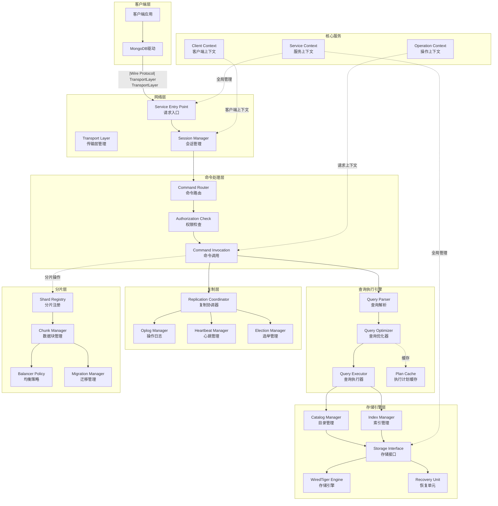
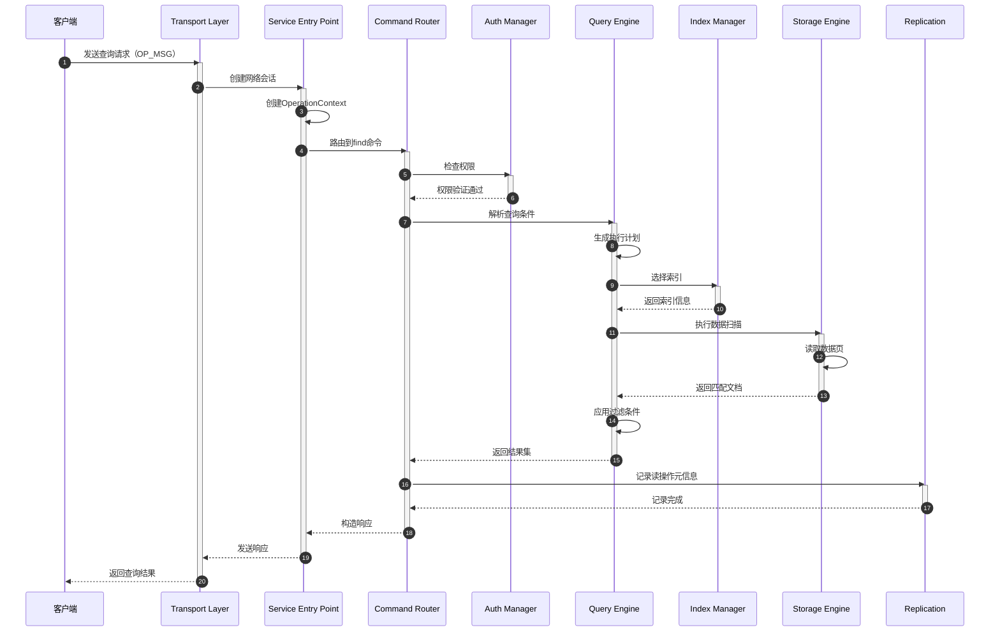
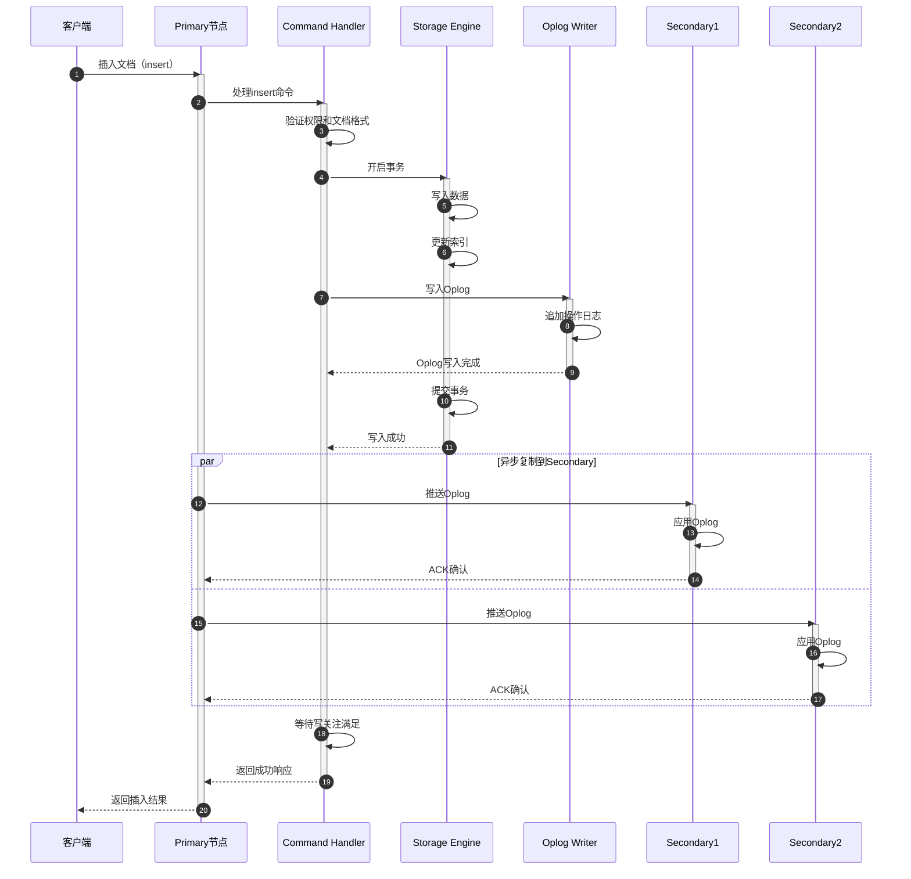
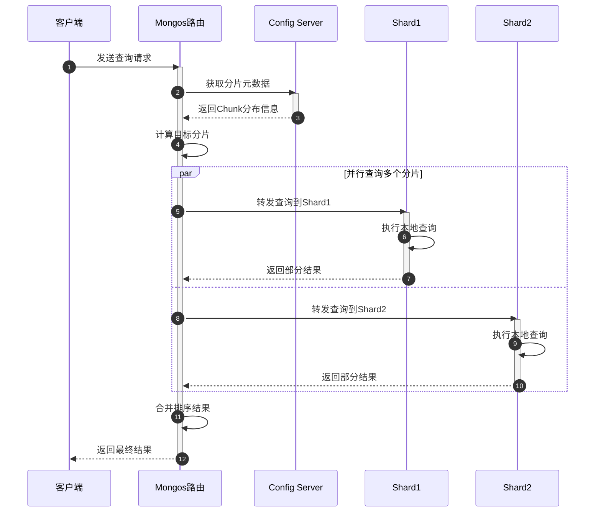

# MongoDB-00-总览

## 1. 摘要

### 1.1 项目目标

MongoDB是一个分布式文档型NoSQL数据库系统，提供高性能、高可用性和自动扩展功能。该项目实现了完整的数据库服务端，包括数据存储、查询处理、索引管理、复制、分片等核心功能。

### 1.2 项目边界

**包含范围：**
- 数据库服务端实现（mongod）
- 路由服务实现（mongos）
- 存储引擎接口及WiredTiger集成
- 查询执行引擎
- 复制协议（Replica Set）
- 分片协议（Sharding）
- 认证授权系统
- BSON数据格式处理
- RPC通信层

**不包含范围：**
- 客户端驱动（仅包含内部客户端）
- 可视化管理工具
- 云服务层（Atlas）

### 1.3 运行环境

- **语言：** C++17
- **构建系统：** Bazel
- **支持平台：** Linux、macOS、Windows
- **部署形态：** 单机、副本集、分片集群

## 2. 整体架构

### 2.1 系统架构图

### 2.2 架构说明

#### 2.2.1 图意概述

该架构图展示了MongoDB服务端的核心分层架构，从客户端请求到数据持久化的完整流程。系统采用经典的分层设计，每层职责清晰，模块间通过定义良好的接口交互。

#### 2.2.2 核心组件职责

**网络层：**
- `TransportLayer`：管理底层网络连接（TCP/Unix Socket/TLS）
- `ServiceEntryPoint`：请求入口点，负责请求分发
- `SessionManager`：管理客户端会话生命周期

**命令处理层：**
- `CommandRouter`：根据命令名称路由到具体Command实现
- `CommandInvocation`：命令执行的抽象封装
- `AuthCheck`：验证权限，基于角色访问控制（RBAC）

**查询执行引擎：**
- `Parser`：将查询语句解析为抽象语法树（AST）
- `Optimizer`：基于统计信息生成最优执行计划
- `Executor`：执行查询计划，支持多种执行算子（扫描、排序、聚合等）
- `PlanCache`：缓存已优化的执行计划，避免重复优化

**存储引擎层：**
- `CatalogManager`：管理数据库、集合元数据
- `IndexManager`：管理索引定义和生命周期
- `StorageInterface`：统一存储引擎接口，支持插件化
- `WiredTiger`：默认存储引擎，提供B+树和LSM树实现
- `RecoveryUnit`：事务恢复单元，支持ACID特性

**复制层：**
- `ReplCoordinator`：复制协议核心，管理副本集状态
- `OplogManager`：操作日志管理，用于数据复制和恢复
- `HeartbeatManager`：节点间心跳检测
- `ElectionManager`：Raft-like选举协议实现

**分片层：**
- `ShardRegistry`：维护分片拓扑信息
- `ChunkManager`：管理数据块分布和路由
- `BalancerPolicy`：数据均衡策略
- `MigrationManager`：数据块迁移协调

#### 2.2.3 关键边界条件

1. **并发控制：**
   - 使用分级锁（Global → Database → Collection → Document）
   - 支持意向锁和乐观并发控制
   - 读写操作通过`OperationContext`管理超时和中断

2. **超时机制：**
   - 请求级超时：`maxTimeMS`参数控制
   - 锁超时：避免长时间持锁导致系统阻塞
   - 网络超时：连接池和会话超时管理

3. **幂等性保证：**
   - 写操作通过`lsid`（逻辑会话ID）和`txnNumber`保证幂等
   - 支持可重试写操作（Retryable Writes）
   - 分布式事务通过两阶段提交保证原子性

4. **顺序保证：**
   - Oplog按严格顺序写入，保证复制顺序
   - 同一客户端会话内操作保证因果一致性
   - 分片环境下通过向量时钟保证全局顺序

#### 2.2.4 异常处理与回退

1. **网络异常：**
   - 连接池自动重连和健康检查
   - 客户端驱动层自动重试
   - 副本集故障转移（Failover）

2. **存储异常：**
   - 通过Checkpoint和Journal保证数据持久性
   - 事务回滚机制
   - 崩溃恢复流程（Startup Recovery）

3. **复制异常：**
   - 自动选举新Primary
   - Secondary落后时自动追赶
   - 初始同步（Initial Sync）和全量同步

4. **分片异常：**
   - 迁移失败自动回滚
   - 元数据版本管理避免并发冲突
   - 路由缓存自动刷新

#### 2.2.5 性能关键点

1. **查询优化：**
   - 基于成本的查询优化器（Cost-Based Optimizer）
   - 索引选择策略
   - 执行计划缓存命中率（目标 > 80%）

2. **并发处理：**
   - 文档级并发控制，减少锁竞争
   - Ticket机制限制并发读写数量
   - 无锁数据结构（Lock-Free Data Structures）

3. **I/O优化：**
   - 预读（Read-Ahead）和预写（Write-Ahead Log）
   - 批量刷盘减少磁盘I/O
   - 缓存命中率优化（目标 > 95%）

4. **网络优化：**
   - 批量操作减少网络往返
   - 流式传输大结果集
   - 压缩传输减少带宽消耗

#### 2.2.6 容量假设

- **单节点：** 支持数百GB到数TB数据
- **连接数：** 单节点支持数万并发连接
- **QPS：** 单节点支持数万到数十万QPS
- **副本集：** 建议3-7个节点
- **分片：** 支持数千个分片节点

#### 2.2.7 版本兼容与演进

1. **特性兼容版本（FCV）：**
   - 通过`featureCompatibilityVersion`控制特性启用
   - 支持滚动升级（Rolling Upgrade）
   - 向后兼容协议

2. **协议版本：**
   - Wire Protocol版本协商
   - 复制协议版本管理
   - IDL（接口定义语言）自动生成兼容代码

3. **存储格式：**
   - WiredTiger版本独立管理
   - 数据文件格式向后兼容
   - 索引格式演进策略

## 3. 全局时序图

### 3.1 典型查询请求流程

### 3.2 写入请求流程（副本集环境）

### 3.3 分片查询流程

### 3.4 时序图详细说明

#### 3.4.1 查询流程关键点

1. **请求解析：** Transport Layer将网络字节流解析为OP_MSG格式
2. **上下文创建：** 每个请求创建独立的OperationContext，包含超时、权限、会话信息
3. **命令路由：** 根据命令名称查找注册的Command实现类
4. **权限检查：** 基于RBAC模型检查用户角色和资源权限
5. **查询优化：** 解析查询条件，选择最优索引，生成执行计划
6. **数据读取：** 通过存储引擎接口读取数据页，应用过滤条件
7. **结果返回：** 构造BSON响应，通过网络层返回客户端

#### 3.4.2 写入流程关键点

1. **写入验证：** 检查文档格式、字段约束、唯一索引冲突
2. **事务开启：** 创建RecoveryUnit，支持回滚
3. **数据写入：** 先写数据后更新索引，保证一致性
4. **Oplog记录：** 写入操作日志，用于复制和恢复
5. **事务提交：** 两阶段提交保证原子性
6. **异步复制：** Primary推送Oplog到Secondary，无需等待全部ACK
7. **写关注等待：** 根据writeConcern配置等待复制确认

#### 3.4.3 分片查询关键点

1. **元数据查询：** 从Config Server获取Chunk分布
2. **分片定位：** 根据shard key计算目标分片
3. **并行查询：** 向多个分片并发发送请求
4. **结果合并：** Mongos合并排序多个分片的结果
5. **流式返回：** 大结果集分批返回，避免内存溢出

## 4. 模块交互矩阵

| 调用方模块 | 被调方模块 | 交互方式 | 错误语义 | 一致性要求 |
|-----------|-----------|---------|---------|-----------|
| Service Entry Point | Command Router | 同步调用 | 返回Status，异常传播 | 无状态 |
| Command Router | Auth Manager | 同步调用 | 权限不足抛异常 | 强一致读 |
| Command Invocation | Query Engine | 同步调用 | 返回Status，支持超时 | 取决于读关注 |
| Query Engine | Storage Interface | 同步调用 | 返回Status，支持中断 | 事务隔离级别控制 |
| Command Invocation | Replication Coordinator | 同步调用 | 返回Status，不可重试 | 强一致 |
| Primary | Secondary | 异步推送 | 重试直到成功 | 最终一致 |
| Mongos | Shard | 同步RPC | 超时重试，故障转移 | 取决于读关注 |
| Storage Interface | WiredTiger | 同步调用 | 返回错误码 | ACID事务 |
| Index Manager | Catalog Manager | 同步调用 | 返回Status | 强一致 |
| Balancer | Migration Manager | 异步协调 | 失败回滚 | 最终一致 |

## 5. 核心模块清单

以下是MongoDB源码的核心模块，与`src/mongo`目录结构一一对应：

| 序号 | 模块名称 | 目录路径 | 职责说明 |
|-----|---------|---------|---------|
| 01 | base | src/mongo/base | 基础工具类（Status、StringData、错误码） |
| 02 | bson | src/mongo/bson | BSON数据格式编解码 |
| 03 | platform | src/mongo/platform | 平台相关抽象（原子操作、锁、线程） |
| 04 | util | src/mongo/util | 通用工具（日志、时间、并发、网络） |
| 05 | transport | src/mongo/transport | 网络传输层（TCP、TLS、会话管理） |
| 06 | rpc | src/mongo/rpc | RPC协议（OP_MSG、命令序列化） |
| 07 | db-commands | src/mongo/db/commands | 命令处理（CRUD、DDL、管理命令） |
| 08 | db-query | src/mongo/db/query | 查询引擎（解析、优化、执行） |
| 09 | db-storage | src/mongo/db/storage | 存储引擎接口 |
| 10 | db-catalog | src/mongo/db/catalog | 目录管理（数据库、集合、索引元数据） |
| 11 | db-index | src/mongo/db/index | 索引管理（B树、全文、地理索引） |
| 12 | db-repl | src/mongo/db/repl | 复制协议（副本集、Oplog、选举） |
| 13 | db-auth | src/mongo/db/auth | 认证授权（RBAC、LDAP、Kerberos） |
| 14 | db-concurrency | src/mongo/db/concurrency | 并发控制（锁管理器、死锁检测） |
| 15 | db-exec | src/mongo/db/exec | 查询执行算子（扫描、排序、聚合） |
| 16 | s | src/mongo/s | 分片协议（路由、均衡、迁移） |
| 17 | executor | src/mongo/executor | 任务执行器（线程池、异步调度） |
| 18 | client | src/mongo/client | 内部客户端（DBClient、连接池） |
| 19 | crypto | src/mongo/crypto | 加密（TLS、字段级加密） |
| 20 | scripting | src/mongo/scripting | JavaScript引擎集成 |

## 6. 关键设计与权衡

### 6.1 一致性与事务

**设计选择：**
- **副本集：** 异步复制 + 可调写关注（Write Concern）
- **分布式事务：** 两阶段提交（2PC）协议
- **隔离级别：** 默认读已提交（Read Committed），支持快照隔离

**权衡分析：**
- 异步复制提高写入性能，但牺牲强一致性
- 通过`writeConcern: majority`保证持久性，但增加延迟
- 快照隔离提供一致性读，但增加存储开销

### 6.2 锁与并发

**设计选择：**
- **分级锁：** Global → Database → Collection → Document
- **意向锁：** 减少锁冲突检测开销
- **文档级并发：** WiredTiger提供MVCC

**权衡分析：**
- 分级锁简化设计，但可能导致锁竞争
- 文档级并发提高并行度，但增加存储引擎复杂度
- Ticket机制限制并发数，避免资源耗尽

### 6.3 性能关键路径

1. **热点数据路径：**
   - `find` → `Parser` → `Optimizer` → `Executor` → `StorageInterface`
   - 优化点：执行计划缓存、索引选择、批量预读

2. **写入路径：**
   - `insert` → `Validation` → `StorageEngine` → `IndexUpdate` → `Oplog`
   - 优化点：批量写入、延迟索引更新、Oplog批量刷盘

3. **复制路径：**
   - `OplogFetcher` → `OplogApplier` → `SyncSourceResolver`
   - 优化点：并行应用Oplog、批量应用、流式传输

### 6.4 可观测性

**日志系统（logv2）：**
- 结构化日志，支持JSON格式
- 动态调整日志级别
- 集成分布式追踪（OpenTelemetry）

**监控指标（FTDC）：**
- 全量诊断数据采集（Full-Time Diagnostic Data Capture）
- 低开销持续采集系统指标
- 支持性能分析和问题诊断

**性能分析工具：**
- 慢查询日志（Slow Query Log）
- 执行计划分析（explain）
- 性能剖析（Database Profiler）

### 6.5 配置项

**关键配置参数：**
- `storage.wiredTiger.engineConfig.cacheSizeGB`：缓存大小
- `replication.replSetName`：副本集名称
- `net.maxIncomingConnections`：最大连接数
- `operationProfiling.mode`：性能剖析级别
- `setParameter.internalQueryExecMaxBlockingSortBytes`：排序内存限制

## 7. 文档组织结构

本系列源码剖析文档按模块组织，每个模块包含以下文档：

1. **模块概览：** `MongoDB-XX-模块名-概览.md`
   - 模块职责、边界、依赖关系
   - 架构图和核心算法

2. **API详解：** `MongoDB-XX-模块名-API.md`
   - 对外API列表
   - 请求/响应结构体
   - 入口函数和调用链

3. **数据结构：** `MongoDB-XX-模块名-数据结构.md`
   - 核心数据结构UML图
   - 字段语义和关系映射

4. **时序图：** `MongoDB-XX-模块名-时序图.md`
   - 典型场景时序图
   - 异常处理流程

## 8. 阅读建议

**初级读者：**
1. 阅读本总览文档，理解整体架构
2. 学习`base`和`bson`模块，掌握基础数据结构
3. 了解`db-commands`模块，理解命令处理流程

**中级读者：**
1. 深入`db-query`模块，理解查询优化和执行
2. 学习`db-repl`模块，掌握复制协议
3. 了解`db-storage`模块，理解存储引擎接口

**高级读者：**
1. 研究`s`模块，掌握分片协议
2. 深入`db-exec`模块，理解执行算子实现
3. 学习`db-concurrency`模块，掌握并发控制

---

**文档版本：** v1.0  
**生成时间：** 2025-10-05  
**适用版本：** MongoDB 8.0+

