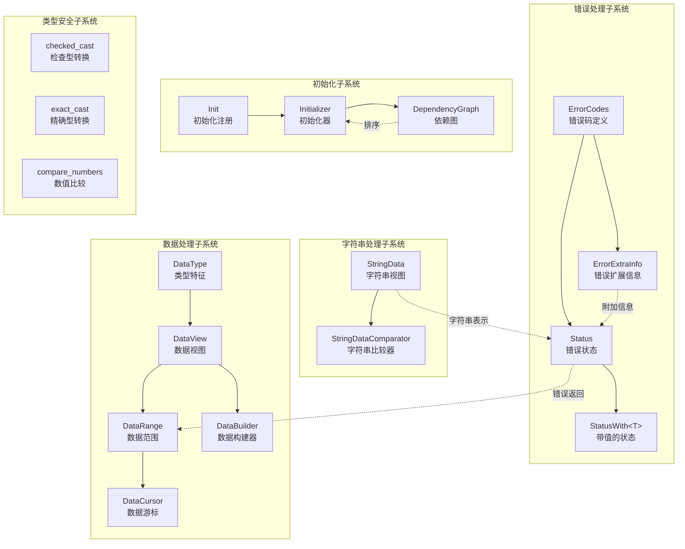

# MongoDB-01-Base模块

## 1. 模块概述

Base模块提供MongoDB项目的基础设施，包含核心数据类型、错误处理机制、数据序列化工具等。该模块被所有其他模块依赖，提供统一的底层抽象。

### 1.1 主要功能

- **错误处理：** 提供`Status`和`StatusWith<T>`类型，统一错误返回机制
- **错误码管理：** 集中管理所有错误码（`ErrorCodes`），支持错误信息扩展
- **字符串处理：** 提供轻量级字符串视图`StringData`，避免不必要的拷贝
- **数据类型转换：** 提供类型安全的转换工具（`checked_cast`、`exact_cast`）
- **数据序列化：** 提供通用的序列化/反序列化框架
- **初始化框架：** 提供系统初始化和依赖管理机制

### 1.2 输入/输出

**输入：**
- 错误码定义文件：`error_codes.yml`
- 各模块的初始化需求

**输出：**
- 编译时生成的错误码头文件
- 统一的错误处理接口
- 基础数据类型和工具函数

### 1.3 上下游依赖

**被依赖模块（下游）：**
- bson模块：使用`Status`、`StringData`
- db模块：使用错误处理和初始化框架
- 所有其他模块：使用基础数据类型

**依赖模块（上游）：**
- platform模块：平台相关的原子操作和编译器宏
- 标准库：STL容器和算法

### 1.4 生命周期

1. **编译时：** 运行`generate_error_codes.py`生成错误码头文件
2. **启动时：** 执行全局初始化器（Initializer）完成系统初始化
3. **运行时：** 提供持续的错误处理和数据类型支持
4. **关闭时：** 无特殊清理需求（RAII管理资源）

## 2. 模块架构

### 2.1 架构图



### 2.2 架构说明

#### 2.2.1 图意概述

该架构图展示了Base模块的五个核心子系统及其交互关系。每个子系统职责清晰，通过定义良好的接口相互协作，为上层模块提供稳定的基础设施。

#### 2.2.2 核心组件职责

**错误处理子系统：**
- `ErrorCodes`：集中定义所有错误码，编译时从YAML生成
- `Status`：表示操作结果状态，包含错误码和描述信息
- `StatusWith<T>`：扩展`Status`，支持携带返回值
- `ErrorExtraInfo`：错误扩展信息基类，允许特定错误附加额外数据

**字符串处理子系统：**
- `StringData`：轻量级字符串视图，避免内存分配和拷贝
- `StringDataComparator`：支持不同locale的字符串比较

**数据处理子系统：**
- `DataType`：数据类型特征系统，支持编译时类型检查
- `DataView`：内存数据视图，提供类型安全的读写接口
- `DataRange`：表示连续内存区域，支持范围检查
- `DataBuilder`：高效构建二进制数据
- `DataCursor`：顺序读取二进制数据

**初始化子系统：**
- `Initializer`：管理系统初始化流程
- `DependencyGraph`：解析初始化器依赖关系，确定执行顺序
- `Init`：初始化器注册宏，简化初始化代码编写

**类型安全子系统：**
- `checked_cast`：运行时类型检查的类型转换
- `exact_cast`：不允许隐式转换的精确类型转换
- `compare_numbers`：数值比较函数，处理不同类型数值比较

#### 2.2.3 关键边界条件

1. **Status对象语义：**
   - `Status::OK()`表示成功，不携带错误信息
   - 非OK状态必须包含错误码和描述信息
   - `Status`对象可复制，使用引用计数管理内部数据

2. **StringData使用约束：**
   - `StringData`不拥有字符串内存，调用者确保生命周期
   - 不保证以`\0`结尾，通过长度字段确定边界
   - 支持从`std::string`、`const char*`等隐式构造

3. **DataView读写安全：**
   - 读写操作检查边界，越界抛异常或返回错误
   - 支持大小端转换，确保跨平台兼容性
   - 提供常量和非常量版本，保证类型安全

4. **初始化顺序：**
   - 通过依赖图自动确定初始化顺序
   - 检测循环依赖，编译时报错
   - 支持多阶段初始化（prerequisites、dependents）

#### 2.2.4 异常处理与回退

1. **错误传播：**
   - 优先返回`Status`而非抛异常
   - 异常仅用于编程错误（如越界、空指针）
   - `uassert`/`invariant`区分可恢复和不可恢复错误

2. **资源管理：**
   - 使用RAII管理资源，无需显式清理
   - `Status`和`StatusWith`支持移动语义，避免拷贝
   - 引用计数自动管理共享数据

3. **类型转换失败：**
   - `checked_cast`失败时触发断言
   - `exact_cast`编译时检查，拒绝隐式转换
   - 数值比较处理溢出和精度损失

#### 2.2.5 性能关键点

1. **零拷贝字符串：**
   - `StringData`仅存储指针和长度，无内存分配
   - 字符串比较避免创建临时对象
   - 哈希计算直接基于字符串内容

2. **错误处理开销：**
   - 成功路径（`Status::OK()`）零开销，内联优化
   - 错误路径使用引用计数共享错误信息
   - `StatusWith<T>`针对小类型优化，避免堆分配

3. **数据序列化：**
   - `DataBuilder`使用内存池减少分配次数
   - `DataCursor`顺序读取，充分利用缓存局部性
   - 大小端转换使用编译器内置函数

#### 2.2.6 容量假设

- 错误码数量：约500个，编译时生成
- 初始化器数量：数千个，启动时执行
- `StringData`最大长度：2GB（int32最大值）
- `DataRange`最大长度：受内存限制

#### 2.2.7 版本兼容与演进

1. **错误码管理：**
   - 新错误码追加到`error_codes.yml`
   - 废弃错误码保留，标记为deprecated
   - 错误码值保持稳定，不重新分配

2. **API稳定性：**
   - 核心API保持向后兼容
   - 新增功能通过重载或模板特化实现
   - 废弃API通过编译器警告提示

3. **序列化格式：**
   - `DataView`支持版本化数据格式
   - 新增字段向后兼容，老版本忽略未知字段

## 3. 核心算法

### 3.1 Status错误处理机制

#### 3.1.1 算法目的

提供统一的错误处理机制，避免异常开销，支持错误信息的丰富表达。

#### 3.1.2 输入输出

**输入：**
- 错误码（`ErrorCodes::Error`）
- 错误描述（`std::string`）
- 可选的错误扩展信息（`ErrorExtraInfo`）

**输出：**
- `Status`对象，表示操作结果

#### 3.1.3 核心代码

```cpp
// Status类核心结构
class Status {
public:
    // 创建成功状态（零开销）
    constexpr static Status OK() {
        return {};
    }

    // 创建错误状态
    Status(ErrorCodes::Error code, std::string reason)
        : _error{_parseErrorInfo(code, std::move(reason), nullptr)} {}
    
    // 检查状态
    constexpr bool isOK() const {
        return !_error;
    }
    
    // 获取错误码
    constexpr ErrorCodes::Error code() const {
        return _error ? _error->code : ErrorCodes::OK;
    }
    
    // 获取错误描述
    const std::string& reason() const {
        // （省略空字符串单例处理）
        return _error->reason;
    }
    
    // 添加上下文信息
    Status& addContext(StringData reasonPrefix) {
        if (!isOK()) {
            _error = _error->clone();
            _error->reason = str::stream() << reasonPrefix 
                                          << " :: caused by :: " 
                                          << _error->reason;
        }
        return *this;
    }

private:
    // 错误信息结构体（引用计数管理）
    struct ErrorInfo {
        ErrorCodes::Error code;
        std::string reason;
        std::shared_ptr<const ErrorExtraInfo> extra;
        
        std::shared_ptr<ErrorInfo> clone() const;
    };
    
    std::shared_ptr<const ErrorInfo> _error;  // 仅在错误时非空
};

// StatusWith<T>：携带返回值的Status
template <typename T>
class StatusWith {
public:
    // 从成功值构造
    StatusWith(T value) 
        : _status(Status::OK()), _value(std::move(value)) {}
    
    // 从错误状态构造
    StatusWith(Status status) 
        : _status(std::move(status)) {
        invariant(!_status.isOK());
    }
    
    // 获取值（仅在OK时有效）
    T& getValue() {
        invariant(_status.isOK());
        return *_value;
    }
    
    const Status& getStatus() const { return _status; }
    
    bool isOK() const { return _status.isOK(); }

private:
    Status _status;
    boost::optional<T> _value;
};
```

### 3.2 StringData零拷贝字符串

#### 3.2.1 算法目的

提供轻量级字符串视图，避免不必要的内存分配和拷贝，提高字符串处理性能。

#### 3.2.2 核心代码

```cpp
class StringData {
public:
    // 从C字符串构造
    constexpr StringData(const char* str, size_t len)
        : _data(str), _size(len) {}
    
    // 从std::string构造
    StringData(const std::string& str)
        : _data(str.data()), _size(str.size()) {}
    
    // 访问接口
    constexpr const char* rawData() const { return _data; }
    constexpr size_t size() const { return _size; }
    constexpr bool empty() const { return _size == 0; }
    
    // 子串提取（零拷贝）
    constexpr StringData substr(size_t pos, size_t n = npos) const {
        // （省略边界检查）
        return StringData(_data + pos, std::min(n, _size - pos));
    }
    
    // 比较操作
    int compare(StringData other) const {
        int result = std::memcmp(_data, other._data, 
                                 std::min(_size, other._size));
        if (result != 0) return result;
        return _size < other._size ? -1 : (_size > other._size ? 1 : 0);
    }
    
    // 查找操作
    size_t find(char ch, size_t pos = 0) const {
        if (pos >= _size) return npos;
        const char* found = static_cast<const char*>(
            std::memchr(_data + pos, ch, _size - pos));
        return found ? found - _data : npos;
    }

private:
    const char* _data;  // 不拥有内存
    size_t _size;       // 字符串长度
};
```

### 3.3 初始化器依赖解析

#### 3.3.1 算法目的

解析初始化器之间的依赖关系，确定正确的初始化顺序，检测循环依赖。

#### 3.3.2 核心代码

```cpp
class DependencyGraph {
public:
    // 添加节点
    void addNode(std::string name) {
        _nodes[name] = Node{};
    }
    
    // 添加边（from依赖to）
    void addEdge(std::string from, std::string to) {
        _nodes[from].prerequisites.push_back(to);
        _nodes[to].dependents.push_back(from);
    }
    
    // 拓扑排序
    std::vector<std::string> topologicalSort() {
        std::vector<std::string> result;
        std::unordered_set<std::string> visited;
        std::unordered_set<std::string> inProgress;
        
        for (const auto& [name, node] : _nodes) {
            if (!visited.count(name)) {
                dfs(name, visited, inProgress, result);
            }
        }
        
        return result;
    }

private:
    struct Node {
        std::vector<std::string> prerequisites;  // 前置依赖
        std::vector<std::string> dependents;     // 依赖本节点的
    };
    
    void dfs(const std::string& name,
             std::unordered_set<std::string>& visited,
             std::unordered_set<std::string>& inProgress,
             std::vector<std::string>& result) {
        
        // 检测循环依赖
        if (inProgress.count(name)) {
            invariant(false, "Circular dependency detected");
        }
        
        if (visited.count(name)) {
            return;
        }
        
        inProgress.insert(name);
        
        // 递归处理前置依赖
        for (const auto& prereq : _nodes[name].prerequisites) {
            dfs(prereq, visited, inProgress, result);
        }
        
        inProgress.erase(name);
        visited.insert(name);
        result.push_back(name);
    }
    
    std::unordered_map<std::string, Node> _nodes;
};
```

## 4. 关键功能详细描述

### 4.1 错误处理系统核心功能

#### 4.1.1 Status类核心实现

Status类采用写时复制（COW）策略，通过引用计数的ErrorInfo结构体管理错误信息，实现高效的错误传播。

```cpp
class Status {
private:
    // 引用计数的错误信息结构体
    struct ErrorInfo : boost::intrusive_ref_counter<ErrorInfo> {
        ErrorCodes::Error code;
        std::string reason;
        std::shared_ptr<const ErrorExtraInfo> extra;
        
        ErrorInfo(ErrorCodes::Error c, std::string r, std::shared_ptr<const ErrorExtraInfo> e)
            : code(c), reason(std::move(r)), extra(std::move(e)) {}
    };
    
    boost::intrusive_ptr<ErrorInfo> _error;

public:
    // 1) 默认构造为成功状态（零开销）
    constexpr Status() noexcept = default;
    
    // 2) 错误状态构造（延迟分配ErrorInfo）
    Status(ErrorCodes::Error code, std::string reason) {
        if (code != ErrorCodes::OK) {
            _error = new ErrorInfo(code, std::move(reason), nullptr);
        }
    }
    
    // 3) 移动构造（零拷贝）
    Status(Status&& other) noexcept : _error(std::move(other._error)) {}
    
    // 4) 拷贝构造（引用计数递增）
    Status(const Status& other) : _error(other._error) {}
};
```

#### 4.1.2 StatusWith<T>模板类核心功能

StatusWith提供类型安全的结果封装，避免异常处理的性能开销。

```cpp
template<typename T>
class StatusWith {
private:
    Status _status;
    union {
        T _t;
    };
    
public:
    // 1) 成功值构造
    template<typename U = T>
    StatusWith(U&& val) : _status(Status::OK()) {
        new (&_t) T(std::forward<U>(val));
    }
    
    // 2) 错误状态构造
    StatusWith(Status status) : _status(std::move(status)) {
        dassert(!_status.isOK());
    }
    
    // 3) 类型安全的值访问
    T& getValue() & {
        invariant(_status.isOK());
        return _t;
    }
    
    const T& getValue() const& {
        invariant(_status.isOK());
        return _t;
    }
    
    T&& getValue() && {
        invariant(_status.isOK());
        return std::move(_t);
    }
};
```

### 4.2 初始化系统核心功能

#### 4.2.1 依赖图构建与拓扑排序

MongoDB的初始化系统基于有向无环图（DAG）进行依赖解析，支持并行初始化和确定性的执行顺序。

```cpp
class Initializer {
private:
    class Graph {
    private:
        DependencyGraph _graph;
        
    public:
        // 添加初始化器节点
        void add(std::string name,
                InitializerFunction initFn,
                DeinitializerFunction deinitFn,
                std::vector<std::string> prerequisites,
                std::vector<std::string> dependents) {
            
            auto payload = std::make_unique<Payload>();
            payload->initFn = std::move(initFn);
            payload->deinitFn = std::move(deinitFn);
            payload->initialized = false;
            
            _graph.addNode(std::move(name), 
                          std::move(prerequisites), 
                          std::move(dependents), 
                          std::move(payload));
        }
        
        // 拓扑排序（支持随机化避免依赖隐式顺序）
        std::vector<std::string> topSort(unsigned randomSeed) const {
            // 使用Kahn算法进行拓扑排序
            auto nodes = _graph.getNodes();
            std::vector<std::string> result;
            std::queue<std::string> ready;
            std::unordered_map<std::string, int> inDegree;
            
            // 计算入度
            for (const auto& [name, node] : nodes) {
                inDegree[name] = node->prerequisites.size();
                if (inDegree[name] == 0) {
                    ready.push(name);
                }
            }
            
            // 随机化同级节点顺序（避免隐式依赖）
            std::mt19937 rng(randomSeed);
            
            while (!ready.empty()) {
                // 随机选择一个可执行节点
                std::vector<std::string> candidates;
                while (!ready.empty()) {
                    candidates.push_back(ready.front());
                    ready.pop();
                }
                
                std::shuffle(candidates.begin(), candidates.end(), rng);
                
                for (const auto& nodeName : candidates) {
                    result.push_back(nodeName);
                    
                    // 更新依赖该节点的其他节点入度
                    for (const auto& dependent : nodes.at(nodeName)->dependents) {
                        if (--inDegree[dependent] == 0) {
                            ready.push(dependent);
                        }
                    }
                }
            }
            
            // 检查循环依赖
            if (result.size() != nodes.size()) {
                uasserted(ErrorCodes::GraphContainsCycle, 
                         "Circular dependency detected in initializers");
            }
            
            return result;
        }
    };
};
```

### 4.3 类型转换核心功能

#### 4.3.1 安全数值转换实现

MongoDB提供编译期和运行期的类型安全转换工具，在Debug模式提供严格检查，在Release模式保证零开销。

```cpp
// 安全的数值类型转换
template<typename To, typename From>
constexpr To checked_cast(From from) {
    if constexpr (kDebugBuild) {
        // Debug模式检查数值范围
        static_assert(std::is_arithmetic_v<From> && std::is_arithmetic_v<To>);
        if constexpr (std::is_signed_v<From> != std::is_signed_v<To>) {
            // 有符号/无符号转换检查
            invariant(from >= 0, "checked_cast: negative value to unsigned type");
        }
        if constexpr (sizeof(From) > sizeof(To)) {
            // 大类型到小类型转换检查
            invariant(from <= std::numeric_limits<To>::max(), 
                     "checked_cast: value too large");
        }
    }
    return static_cast<To>(from);
}

// 精确类型转换（不允许精度损失）
template<typename To, typename From>
constexpr To exact_cast(From from) {
    To result = static_cast<To>(from);
    if constexpr (kDebugBuild) {
        // 验证转换是精确的（无精度损失）
        invariant(static_cast<From>(result) == from, 
                 "exact_cast: precision loss detected");
    }
    return result;
}
```

## 5. API详细说明

### 5.1 Status类API

#### 5.1.1 基本信息

- **名称：** `Status`
- **作用：** 表示操作成功或失败状态，包含错误码和描述信息
- **线程安全性：** 是（不可变对象）

#### 5.1.2 核心方法

```cpp
class Status {
public:
    // 1) 创建成功状态（推荐使用）
    constexpr static Status OK() {
        return {}; // 默认构造即为成功状态
    }
    
    // 2) 创建错误状态
    Status(ErrorCodes::Error code, std::string reason) 
        : Status{code, std::move(reason), nullptr} {}
    
    // 3) 状态查询接口
    constexpr bool isOK() const {
        return !_error; // 无错误信息即为成功
    }
    
    constexpr ErrorCodes::Error code() const {
        return _error ? _error->code : ErrorCodes::OK;
    }
    
    const std::string& reason() const {
        return _error ? _error->reason : getEmptyString();
    }
    
    // 4) 错误上下文追加
    Status& addContext(StringData reasonPrefix) {
        if (!isOK()) {
            // 重新构造ErrorInfo，保持不可变性
            auto newReason = reasonPrefix + causedBy(_error->reason);
            _error = _createErrorInfo(_error->code, std::move(newReason), _error->extra);
        }
        return *this;
    }
    
    // 5) 序列化到BSON（用于网络传输）
    void serialize(BSONObjBuilder* builder) const {
        builder->append("code", code());
        builder->append("codeName", ErrorCodes::errorString(code()));
        if (!isOK()) {
            builder->append("errmsg", reason());
            if (const auto& ei = extraInfo())
                ei->serialize(builder); // 扩展信息序列化
        }
    }
};
```

### 5.2 StringData类API

#### 5.2.1 基本信息

- **名称：** `StringData`
- **作用：** 零拷贝字符串视图，类似std::string_view
- **生命周期：** 不拥有字符串内存，原始数据必须比StringData生命周期长

#### 5.2.2 核心方法

```cpp
class StringData {
public:
    // 1) 默认构造（空字符串）
    constexpr StringData() = default;
    
    // 2) C字符串构造（自动计算长度）
    constexpr StringData(const char* c)
        : StringData{c ? std::string_view{c} : std::string_view{}} {}
    
    // 3) 指定长度构造
    constexpr StringData(const char* c, size_type len) 
        : StringData(_checkedView(c, len)) {}
    
    // 4) std::string构造
    StringData(const std::string& s) 
        : StringData{std::string_view{s}} {}
    
    // 5) 基本访问操作
    constexpr const char* data() const noexcept {
        return _sv.data();
    }
    
    constexpr size_type size() const noexcept {
        return _sv.size();
    }
    
    constexpr bool empty() const noexcept {
        return _sv.empty();
    }
    
    // 6) 子串操作
    constexpr StringData substr(size_type pos = 0, size_type len = npos) const {
        return StringData(_sv.substr(pos, len));
    }
    
    // 7) 比较操作
    constexpr int compare(StringData other) const noexcept {
        return _sv.compare(other._sv);
    }
    
    // 8) 查找操作
    constexpr size_type find(StringData s, size_type pos = 0) const noexcept {
        return _sv.find(s._sv, pos);
    }
};
```

### 5.3 错误码管理API

#### 5.3.1 ErrorCodes枚举

```cpp
class ErrorCodes {
public:
    enum Error : std::int32_t {
        OK = 0,
        InternalError = 1,
        BadValue = 2,
        NoSuchKey = 4,
        // ... 400+ 错误码定义
        MaxError
    };
    
    // 1) 错误码到字符串转换
    static std::string errorString(Error err) {
        return getErrorCodeTable().find(err)->second;
    }
    
    // 2) 字符串到错误码转换
    static Error fromString(StringData name) {
        auto it = getNameToCodeMap().find(name);
        return it != getNameToCodeMap().end() ? it->second : UnknownError;
    }
    
    // 3) 错误分类判断
    static bool isNetworkError(Error err) {
        return err >= HostUnreachable && err <= NetworkTimeout;
    }
    
    static bool isRetriableError(Error err) {
        return isNetworkError(err) || err == InterruptedAtShutdown;
    }
};
```

### 5.4 初始化框架API

#### 5.4.1 MONGO_INITIALIZER宏

```cpp
// 初始化器注册宏
#define MONGO_INITIALIZER(name) \
    MONGO_INITIALIZER_WITH_PREREQS(name, (), ())

#define MONGO_INITIALIZER_WITH_PREREQS(name, prereqs, dependents) \
    static Status _initFunction##name(InitializerContext*); \
    static const bool _dummy##name = ::mongo::addInitializer( \
        #name, prereqs, dependents, _initFunction##name); \
    Status _initFunction##name(InitializerContext*)

// 使用示例
MONGO_INITIALIZER_WITH_PREREQS(LogManager, 
                              ("GlobalLogManager", "ThreadNameInitializer"), 
                              ("default"))
(InitializerContext* context) {
    // 初始化日志系统
    logv2::LogManager::global().startup();
    return Status::OK();
}
```

### 5.5 类型转换API

#### 5.5.1 checked_cast和exact_cast

```cpp
// 安全的数值类型转换
template<typename To, typename From>
constexpr To checked_cast(From from) {
    if constexpr (kDebugBuild) {
        // Debug模式检查数值范围  
        static_assert(std::is_arithmetic_v<From> && std::is_arithmetic_v<To>);
        if constexpr (std::is_signed_v<From> != std::is_signed_v<To>) {
            // 有符号/无符号转换检查
            invariant(from >= 0, "checked_cast: negative value to unsigned type");
        }
        if constexpr (sizeof(From) > sizeof(To)) {
            // 大类型到小类型转换检查
            invariant(from <= std::numeric_limits<To>::max(), 
                     "checked_cast: value too large");
        }
    }
    return static_cast<To>(from);
}

// 精确类型转换（不允许精度损失）
template<typename To, typename From>
constexpr To exact_cast(From from) {
    To result = static_cast<To>(from);
    if constexpr (kDebugBuild) {
        // 验证转换是精确的（无精度损失）
        invariant(static_cast<From>(result) == from, 
                 "exact_cast: precision loss detected");
    }
    return result;
}
```

## 6. 性能优化要点

### 6.1 Status使用最佳实践

**避免频繁构造：**
```cpp
// ❌ 低效：每次都构造新Status
Status validate(const BSONObj& obj) {
    if (obj.isEmpty()) 
        return Status(ErrorCodes::BadValue, "Empty object");
    return Status::OK(); // 新构造
}

// ✅ 高效：复用OK单例
static const Status kOK = Status::OK();
Status validate(const BSONObj& obj) {
    if (obj.isEmpty()) 
        return Status(ErrorCodes::BadValue, "Empty object");
    return kOK; // 复用单例
}
```

### 6.2 StringData使用最佳实践

**生命周期管理：**
```cpp
// ❌ 危险：StringData指向临时对象
StringData getBadFieldName() {
    std::string temp = "field_" + std::to_string(42);
    return StringData(temp); // temp析构后StringData无效
}

// ✅ 安全：确保原始数据生命周期
class BSONElement {
    const char* _data; // 指向持久化内存
public:
    StringData fieldName() const {
        return StringData(_data + 1); // 安全，_data生命周期足够长
    }
};
```

### 6.3 内存分配优化

**减少堆分配：**
```cpp
// ❌ 高开销：每次分配ErrorInfo
Status processMany(const std::vector<Item>& items) {
    for (const auto& item : items) {
        if (!item.isValid())
            return Status(ErrorCodes::BadValue, "Invalid item"); // 堆分配
    }
    return Status::OK();
}

// ✅ 低开销：预分配错误Status
static const Status kInvalidItemError(ErrorCodes::BadValue, "Invalid item");
Status processMany(const std::vector<Item>& items) {
    for (const auto& item : items) {
        if (!item.isValid())
            return kInvalidItemError; // 复用，无堆分配
    }
    return Status::OK();
}
```

Base模块作为MongoDB的基础设施，其API设计充分考虑了性能、安全性和易用性。Status和StringData是使用频率最高的类型，理解其实现细节对优化MongoDB应用性能至关重要。

---

**文档版本：** v1.0  
**生成时间：** 2025-10-05  
**适用版本：** MongoDB 8.0+
