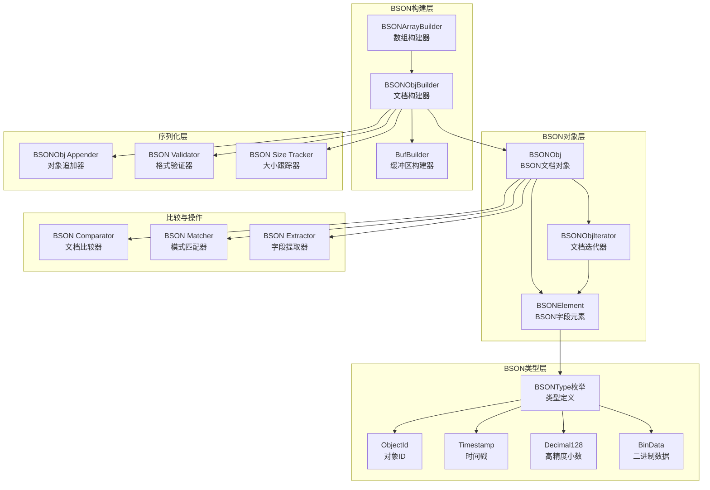
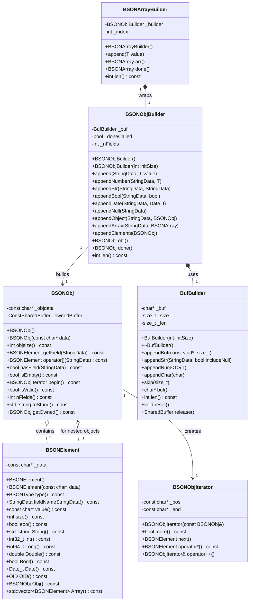
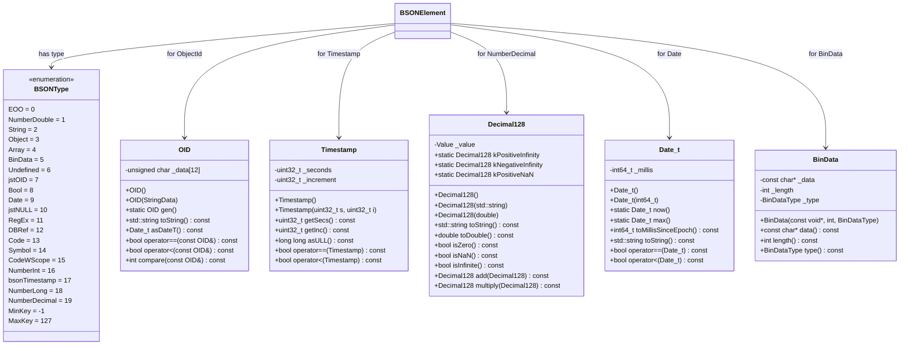

# MongoDB-02-BSON模块

## 1. 模块概述

BSON模块（`src/mongo/bson`）实现了MongoDB的核心数据格式——BSON（Binary JSON）。该模块提供高效的二进制序列化/反序列化功能，是所有数据存储和网络传输的基础。

### 1.1 主要功能

- **BSON编码：** 将结构化数据序列化为紧凑的二进制格式
- **BSON解码：** 将二进制数据反序列化为可操作的对象
- **类型系统：** 支持丰富的数据类型（String、Int32、Int64、Double、Date、ObjectId等）
- **零拷贝访问：** 直接在原始内存上操作，避免不必要的数据拷贝
- **文档构建：** 提供BSONObjBuilder高效构建BSON文档
- **元素遍历：** 支持快速遍历和查找BSON文档中的字段

### 1.2 输入/输出

**输入：**
- 结构化数据（C++对象、键值对）
- 二进制BSON字节流
- 字段路径和查询条件

**输出：**
- 序列化的BSON字节流
- BSONObj对象（可操作的文档表示）
- BSONElement对象（单个字段表示）

### 1.3 上下游依赖

**依赖模块（上游）：**
- base模块：使用`Status`、`StringData`等基础类型
- platform模块：字节序转换、内存对齐

**被依赖模块（下游）：**
- 几乎所有模块：BSON是数据交换的通用格式
- db-commands：命令请求和响应使用BSON
- db-storage：数据持久化使用BSON
- rpc：网络通信使用BSON

### 1.4 生命周期

1. **创建阶段：** 通过BSONObjBuilder构建BSON文档
2. **序列化：** 写入内存缓冲区或网络Socket
3. **传输/存储：** 二进制数据在网络或磁盘传输
4. **反序列化：** 从字节流构造BSONObj对象
5. **访问：** 通过BSONElement访问字段值
6. **销毁：** 引用计数归零时释放内存

## 2. 模块架构

### 2.1 架构图



### 2.2 架构说明

#### 2.2.1 图意概述

该架构图展示了BSON模块的五层结构：对象层、构建层、类型层、序列化层和操作层。从上至下，对象层提供只读访问接口，构建层提供写入接口，类型层定义数据类型，序列化层处理格式转换，操作层提供高级功能。

#### 2.2.2 核心组件职责

**BSON对象层：**
- `BSONObj`：BSON文档的不可变表示，内部指向原始字节流
- `BSONElement`：单个字段的表示，包含类型、字段名和值
- `BSONObjIterator`：顺序遍历文档中的所有字段

**BSON构建层：**
- `BSONObjBuilder`：高效构建BSON文档，支持链式调用
- `BSONArrayBuilder`：构建BSON数组，特殊的BSONObj
- `BufBuilder`：底层内存缓冲区管理，支持动态扩容

**BSON类型层：**
- `BSONType`：定义所有BSON类型（String、Int32、Double等）
- `ObjectId`：12字节全局唯一标识符
- `Timestamp`：复制协议使用的64位时间戳
- `Decimal128`：IEEE 754-2008高精度小数
- `BinData`：任意二进制数据容器

**序列化层：**
- `BSONObjAppender`：将BSON对象追加到缓冲区
- `BSONValidator`：验证BSON格式合法性
- `BSONSizeTracker`：跟踪构建过程中的文档大小

**比较与操作：**
- `BSONComparator`：按BSON类型规则比较文档
- `BSONMatcher`：判断文档是否匹配指定模式
- `BSONExtractor`：从文档中提取字段值

#### 2.2.3 关键边界条件

1. **文档大小限制：**
   - 默认最大：16MB（`BSONObjMaxUserSize`）
   - 内部使用：可达64MB（`BSONObjMaxInternalSize`）
   - 超过限制抛`BSONObjectTooLarge`异常

2. **字段名约束：**
   - 不能为空字符串
   - 不能包含`.`字符（用于嵌套字段路径）
   - 不能以`$`开头（保留给系统使用）
   - 最大长度受文档大小限制

3. **类型转换：**
   - 严格类型检查，不支持隐式转换
   - 类型不匹配抛`TypeMismatch`异常
   - 支持显式类型转换函数

4. **内存管理：**
   - `BSONObj`使用引用计数管理内存
   - 支持共享底层缓冲区，零拷贝传递
   - `BSONObjBuilder`使用内存池减少分配次数

#### 2.2.4 异常处理与回退

1. **解析失败：**
   - 格式错误：返回`Status::InvalidBSON`
   - 大小不一致：验证文档声明的大小与实际大小
   - 类型错误：未知或非法的类型标识符

2. **构建失败：**
   - 内存不足：缓冲区扩容失败，抛`std::bad_alloc`
   - 大小超限：文档超过16MB，抛异常
   - 字段名非法：包含保留字符，抛异常

3. **访问失败：**
   - 字段不存在：返回EOO类型的BSONElement
   - 类型不匹配：访问器抛`TypeMismatch`异常
   - 索引越界：数组访问越界，返回EOO

#### 2.2.5 性能关键点

1. **零拷贝设计：**
   - `BSONObj`仅存储指针，不拷贝数据
   - `BSONElement`直接指向原始字节流
   - 文档传递通过引用计数，避免深拷贝

2. **缓冲区管理：**
   - `BufBuilder`预分配内存，减少realloc次数
   - 默认初始大小512字节，指数增长
   - 支持`reserve()`预留空间

3. **字段查找优化：**
   - 小文档（<10字段）：线性查找，O(n)
   - 大文档：可选索引加速，O(1)
   - 嵌套字段：缓存路径解析结果

4. **类型处理：**
   - 定长类型（Int32、Double）：直接内存访问
   - 变长类型（String、Array）：需要解析长度字段
   - 复杂类型（Decimal128）：专门优化的解码逻辑

#### 2.2.6 容量假设

- 单个文档最大：16MB（用户数据）或64MB（内部）
- 字段数量：无硬限制，受文档大小约束
- 嵌套深度：最大100层（递归限制）
- 数组元素：无硬限制，受文档大小约束
- ObjectId唯一性：理论上2^96个不重复ID

#### 2.2.7 版本兼容与演进

1. **BSON规范版本：**
   - 遵循BSON 1.1规范（bsonspec.org）
   - 新增类型向后兼容
   - 废弃类型保留解析支持

2. **类型演进：**
   - Symbol类型：已废弃，映射到String
   - Decimal128：MongoDB 3.4引入
   - 未来可能：UUID类型原生支持

3. **编码格式：**
   - 小端字节序（Little Endian）
   - UTF-8字符串编码
   - IEEE 754浮点数格式

## 3. 核心算法

### 3.1 BSON编码算法

#### 3.1.1 算法目的

将结构化数据高效地序列化为紧凑的二进制格式，支持快速解析和零拷贝访问。

#### 3.1.2 输入输出

**输入：**
- 键值对集合（字段名和值）
- 字段类型信息

**输出：**
- 二进制字节流（BSON格式）

#### 3.1.3 BSON格式规范

```
BSON文档格式：
+-------------------+
| int32 totalSize   | 4字节：文档总长度（包含此字段）
+-------------------+
| element1          | 字段1
+-------------------+
| element2          | 字段2
+-------------------+
| ...               | 更多字段
+-------------------+
| 0x00 (EOO)        | 1字节：文档结束标记
+-------------------+

BSON元素格式：
+-------------------+
| byte type         | 1字节：类型标识符
+-------------------+
| cstring name      | 字段名（以\0结尾）
+-------------------+
| value             | 值（格式取决于类型）
+-------------------+

常见类型值格式：
- String:    int32 length + UTF-8字符串 + \0
- Int32:     int32值（4字节）
- Int64:     int64值（8字节）
- Double:    double值（8字节，IEEE 754）
- Object:    嵌套BSON文档
- Array:     BSON文档（字段名为"0", "1", "2"...）
- Boolean:   byte值（0x00或0x01）
- Date:      int64毫秒时间戳
- ObjectId:  12字节二进制
- Null:      无值
```

#### 3.1.4 核心代码

```cpp
// BSONObjBuilder核心实现
class BSONObjBuilder {
public:
    BSONObjBuilder() : _buf(512), _doneCalled(false) {
        // 1) 预留4字节存储文档大小
        _buf.skip(sizeof(int32_t));
    }
    
    // 追加String字段
    BSONObjBuilder& append(StringData fieldName, StringData value) {
        // 1) 写入类型标识符
        _buf.appendChar(static_cast<char>(BSONType::String));
        
        // 2) 写入字段名（以\0结尾）
        _buf.appendStr(fieldName, true);
        
        // 3) 写入字符串长度（包含\0）
        int32_t len = value.size() + 1;
        _buf.appendNum(len);
        
        // 4) 写入字符串内容
        _buf.appendStr(value, true);
        
        return *this;
    }
    
    // 追加Int32字段
    BSONObjBuilder& append(StringData fieldName, int32_t value) {
        _buf.appendChar(static_cast<char>(BSONType::NumberInt));
        _buf.appendStr(fieldName, true);
        _buf.appendNum(value);
        return *this;
    }
    
    // 追加嵌套对象
    BSONObjBuilder& append(StringData fieldName, const BSONObj& obj) {
        _buf.appendChar(static_cast<char>(BSONType::Object));
        _buf.appendStr(fieldName, true);
        
        // 直接追加整个BSON文档
        _buf.appendBuf(obj.objdata(), obj.objsize());
        
        return *this;
    }
    
    // 完成构建，生成BSONObj
    BSONObj obj() {
        if (!_doneCalled) {
            _done();
        }
        
        // 创建BSONObj，共享缓冲区
        return BSONObj(_buf.buf(), BSONObj::ShareOwnership(_buf.release()));
    }

private:
    void _done() {
        // 1) 写入文档结束标记
        _buf.appendChar(0);
        
        // 2) 回填文档大小到开头4字节
        int32_t totalSize = _buf.len();
        DataView(_buf.buf()).write<LittleEndian<int32_t>>(totalSize);
        
        _doneCalled = true;
    }
    
    BufBuilder _buf;      // 底层缓冲区
    bool _doneCalled;     // 是否已完成
};
```

### 3.2 BSON解码与字段访问

#### 3.2.1 算法目的

从二进制字节流快速解析BSON文档，提供零拷贝的字段访问。

#### 3.2.2 核心代码

```cpp
// BSONObj核心实现
class BSONObj {
public:
    // 从字节流构造（零拷贝）
    explicit BSONObj(const char* bsonData) {
        // 1) 验证基本格式
        uassert(ErrorCodes::InvalidBSON,
                "BSON data too small",
                bsonData != nullptr);
        
        // 2) 读取文档大小
        int32_t size = ConstDataView(bsonData).read<LittleEndian<int32_t>>();
        
        // 3) 基本大小检查
        uassert(ErrorCodes::InvalidBSON,
                "BSON object size is invalid",
                size >= kMinBSONLength && size <= BSONObjMaxInternalSize);
        
        // 4) 仅存储指针，不拷贝数据
        _objdata = bsonData;
    }
    
    // 获取字段值
    BSONElement getField(StringData fieldName) const {
        // 1) 创建迭代器
        BSONObjIterator it(*this);
        
        // 2) 线性查找字段
        while (it.more()) {
            BSONElement elem = it.next();
            if (elem.fieldNameStringData() == fieldName) {
                return elem;
            }
        }
        
        // 3) 未找到，返回EOO
        return BSONElement();
    }
    
    // 获取嵌套字段（支持点分路径）
    BSONElement getFieldDotted(StringData path) const {
        // "user.address.city" -> ["user", "address", "city"]
        
        BSONObj current = *this;
        size_t dotPos = 0;
        
        while ((dotPos = path.find('.')) != std::string::npos) {
            // 1) 提取路径段
            StringData segment = path.substr(0, dotPos);
            
            // 2) 获取字段
            BSONElement elem = current.getField(segment);
            if (elem.eoo() || elem.type() != BSONType::Object) {
                return BSONElement();  // 路径不存在
            }
            
            // 3) 进入嵌套对象
            current = elem.Obj();
            path = path.substr(dotPos + 1);
        }
        
        // 4) 获取最后一段
        return current.getField(path);
    }
    
    // 文档大小
    int objsize() const {
        return ConstDataView(_objdata).read<LittleEndian<int32_t>>();
    }

private:
    const char* _objdata;  // 指向BSON字节流
};
```

## 4. 数据结构详细说明

### 4.1 核心数据结构UML图

#### 4.1.1 BSONObj类图



#### 4.1.2 BSON类型系统类图



### 4.2 字段详细说明

#### 4.2.1 BSONObj字段说明

| 字段名 | 类型 | 访问权限 | 说明 |
|--------|------|---------|------|
| _objdata | const char* | private | 指向BSON字节流起始位置，前4字节为文档大小 |
| _ownedBuffer | ConstSharedBuffer | private | 可选的缓冲区所有权，支持引用计数共享 |

**字段语义：**
- `_objdata`：始终非空，指向有效的BSON数据。即使文档为空，也指向`{}`（5字节）
- `_ownedBuffer`：当BSONObj拥有内存时非空，否则为空（引用外部内存）

**内存管理策略：**
1. **非拥有模式：** `_ownedBuffer`为空，`_objdata`指向外部内存，调用者负责生命周期
2. **拥有模式：** `_ownedBuffer`持有SharedBuffer，通过引用计数管理，BSONObj析构时自动释放
3. **共享模式：** 多个BSONObj共享同一`_ownedBuffer`，最后一个析构时释放

#### 4.2.2 BSONElement字段说明

| 字段名 | 类型 | 访问权限 | 说明 |
|--------|------|---------|------|
| _data | const char* | private | 指向BSON元素起始位置（类型字节） |

**内存布局：**
```
_data指向：
+-------+----------+-----+-------+
| type  | name\0   | ... | value |
+-------+----------+-----+-------+
  1字节   可变长      1字节  可变长
```

#### 4.2.3 BSONType枚举说明

| 类型值 | 类型名 | 值大小 | 说明 |
|--------|--------|--------|------|
| 0 | EOO | 0 | 文档结束标记（End Of Object） |
| 1 | NumberDouble | 8字节 | IEEE 754双精度浮点数 |
| 2 | String | 可变 | UTF-8字符串，前4字节为长度 |
| 3 | Object | 可变 | 嵌套BSON文档 |
| 4 | Array | 可变 | BSON数组（字段名为"0","1","2"...） |
| 5 | BinData | 可变 | 二进制数据，前4字节为长度 |
| 7 | jstOID | 12字节 | ObjectId（全局唯一标识符） |
| 8 | Bool | 1字节 | 布尔值（0x00或0x01） |
| 9 | Date | 8字节 | UTC毫秒时间戳 |
| 10 | jstNULL | 0 | null值 |
| 16 | NumberInt | 4字节 | 32位有符号整数 |
| 17 | bsonTimestamp | 8字节 | 内部时间戳（复制协议使用） |
| 18 | NumberLong | 8字节 | 64位有符号整数 |
| 19 | NumberDecimal | 16字节 | IEEE 754-2008 Decimal128 |

#### 4.2.4 OID（ObjectId）字段说明

**12字节结构：**
```
+----------+--------+---------+----------+
| 4字节    | 3字节  | 2字节   | 3字节    |
| 时间戳   | 机器ID | 进程ID  | 计数器   |
+----------+--------+---------+----------+
```

| 字节范围 | 含义 | 说明 |
|---------|------|------|
| 0-3 | 时间戳 | Unix时间戳（秒），保证时间有序性 |
| 4-6 | 机器标识 | 机器/主机标识符，hash(hostname) |
| 7-8 | 进程ID | 进程标识符，确保同机多进程唯一 |
| 9-11 | 计数器 | 递增计数器，确保同进程同秒唯一 |

## 5. API详细说明

### 5.1 BSONObj类API

#### 5.1.1 基本信息

- **名称：** `BSONObj`
- **作用：** BSON对象的C++表示，支持智能指针语义
- **内存模型：** 引用计数，非线程安全的拷贝/析构

#### 5.1.2 核心方法

```cpp
class BSONObj {
public:
    // 1) 默认构造（空对象{}）
    BSONObj() {
        _objdata = kEmptyObjectPrototype; // 指向静态空对象
    }
    
    // 2) 从BSON数据构造
    template <typename Traits = DefaultSizeTrait>
    explicit BSONObj(const char* bsonData, Traits t = Traits{}) {
        init<Traits>(bsonData);
    }
    
    // 3) 从共享缓冲区构造
    explicit BSONObj(ConstSharedBuffer ownedBuffer)
        : _objdata(ownedBuffer.get() ? ownedBuffer.get() : BSONObj().objdata()),
          _ownedBuffer(std::move(ownedBuffer)) {}
    
    // 4) 基本属性查询
    bool isEmpty() const {
        return objsize() <= 5; // 空对象只有长度(4字节) + EOO(1字节)
    }
    
    int objsize() const {
        return ConstDataView(objdata()).read<LittleEndian<int>>();
    }
    
    int nFields() const {
        int count = 0;
        BSONObjIterator it(*this);
        while (it.more()) {
            it.next();
            count++;
        }
        return count;
    }
    
    // 5) 字段访问接口
    BSONElement getField(StringData name) const {
        BSONObjIterator it(*this);
        while (it.more()) {
            BSONElement e = it.next();
            if (e.fieldNameStringData() == name)
                return e;
        }
        return BSONElement(); // 返回EOO元素
    }
    
    BSONElement operator[](StringData field) const {
        return getField(field);
    }
    
    // 6) 嵌套字段访问（支持点号路径）
    BSONElement getFieldDotted(StringData name) const {
        if (name.find('.') == std::string::npos) {
            return getField(name);
        }
        
        // 递归解析点号路径
        size_t dot = name.find('.');
        StringData prefix = name.substr(0, dot);
        StringData suffix = name.substr(dot + 1);
        
        BSONElement sub = getField(prefix);
        if (sub.type() == BSONType::Object) {
            return sub.Obj().getFieldDotted(suffix);
        }
        return BSONElement(); // 路径不存在
    }
    
    // 7) 对象比较
    int woCompare(const BSONObj& r, const Ordering& order = Ordering::make(BSONObj())) const {
        BSONObjIterator i(*this);
        BSONObjIterator j(r);
        
        while (i.more() && j.more()) {
            BSONElement l = i.next();
            BSONElement r = j.next();
            int cmp = l.woCompare(r, false);
            if (cmp != 0) return cmp;
        }
        
        // 字段数量不同的处理
        if (i.more()) return 1;
        if (j.more()) return -1;
        return 0;
    }
    
    // 8) 序列化到JSON
    std::string jsonString(JsonStringFormat format = ExtendedRelaxedV200) const {
        BSONObjBuilder builder;
        // （此处省略格式转换细节）
        return builder.obj().toString();
    }
};
```

### 5.2 BSONObjBuilder类API

#### 5.2.1 基本信息

- **名称：** `BSONObjBuilder`
- **作用：** BSON对象构建器，支持流式API和高效内存管理
- **缓冲区策略：** 初始64字节，按需扩展

#### 5.2.2 核心方法

```cpp
class BSONObjBuilder {
private:
    BufBuilder _b;              // 内部缓冲区
    int _offset;               // 当前写入偏移
    
public:
    // 1) 构造函数（指定初始容量）
    explicit BSONObjBuilder(int initsize = kBSONObjBuilderInitialCapacity) 
        : _b(initsize + 4), _offset(4) {
        // 预留4字节存储对象总长度
        _b.skip(4);
    }
    
    // 2) 基本类型追加
    BSONObjBuilder& append(StringData fieldName, int val) {
        _b.appendNum(static_cast<char>(BSONType::numberInt));
        _b.appendStr(fieldName);
        _b.appendNum(val);
        return *this;
    }
    
    BSONObjBuilder& append(StringData fieldName, StringData str) {
        _b.appendNum(static_cast<char>(BSONType::string));
        _b.appendStr(fieldName);
        _b.appendNum(static_cast<int>(str.size() + 1)); // 包含null终止符
        _b.appendStr(str);
        _b.appendChar('\0');
        return *this;
    }
    
    // 3) 嵌套对象追加
    BSONObjBuilder& append(StringData fieldName, const BSONObj& obj) {
        _b.appendNum(static_cast<char>(BSONType::object));
        _b.appendStr(fieldName);
        _b.appendBuf(obj.objdata(), obj.objsize());
        return *this;
    }
    
    // 4) 条件追加
    BSONObjBuilder& appendIf(bool condition, StringData fieldName, int val) {
        if (condition) {
            append(fieldName, val);
        }
        return *this;
    }
    
    // 5) 完成构建
    BSONObj obj() {
        if (_doneCalled) {
            return BSONObj(_b.buf()); // 复用已完成的缓冲区
        }
        return done();
    }
    
private:
    BSONObj done() {
        _doneCalled = true;
        _b.appendChar(EOO); // 添加结束标记
        
        // 回填对象总长度
        int totalSize = _b.len();
        DataView(_b.buf()).write<LittleEndian<int>>(totalSize);
        
        return BSONObj(_b.buf());
    }
};
```

### 5.3 BSONElement类API

#### 5.3.1 基本信息

- **名称：** `BSONElement`
- **作用：** BSON元素的C++表示，包含字段名、类型和值
- **内存模型：** 轻量级指针，指向BSONObj内部数据

#### 5.3.2 核心方法

```cpp
class BSONElement {
private:
    const char* _data;  // 指向元素在BSON中的位置
    int _fieldNameSize; // 字段名长度（缓存优化）
    
public:
    // 1) 类型查询
    BSONType type() const {
        return static_cast<BSONType>(*_data);
    }
    
    // 2) 字段名访问
    StringData fieldNameStringData() const {
        return StringData(_data + 1, _fieldNameSize - 1);
    }
    
    const char* fieldName() const {
        return _data + 1;
    }
    
    // 3) 值访问（类型安全）
    template<typename T>
    T value() const {
        if constexpr (std::is_same_v<T, int>) {
            if (type() != BSONType::numberInt) {
                uasserted(ErrorCodes::TypeMismatch, "Expected int type");
            }
            return ConstDataView(valueData()).read<LittleEndian<int>>();
        } else if constexpr (std::is_same_v<T, std::string>) {
            if (type() != BSONType::string) {
                uasserted(ErrorCodes::TypeMismatch, "Expected string type");
            }
            int strLen = ConstDataView(valueData()).read<LittleEndian<int>>();
            return std::string(valueData() + 4, strLen - 1); // 去除null终止符
        }
        // 其他类型处理...
    }
    
    // 4) 数值类型统一访问
    double numberDouble() const {
        switch (type()) {
            case BSONType::numberDouble:
                return ConstDataView(valueData()).read<LittleEndian<double>>();
            case BSONType::numberInt:
                return static_cast<double>(ConstDataView(valueData()).read<LittleEndian<int>>());
            case BSONType::numberLong:
                return static_cast<double>(ConstDataView(valueData()).read<LittleEndian<long long>>());
            default:
                uasserted(ErrorCodes::TypeMismatch, "Element is not a number");
        }
    }
    
    // 5) 对象/数组访问
    BSONObj Obj() const {
        if (type() == BSONType::object || type() == BSONType::array) {
            return BSONObj(valueData());
        }
        return BSONObj(); // 返回空对象
    }
    
    // 6) 判断方法
    bool eoo() const {
        return type() == BSONType::eoo;
    }
    
    bool isNumber() const {
        BSONType t = type();
        return t == BSONType::numberDouble || 
               t == BSONType::numberInt || 
               t == BSONType::numberLong ||
               t == BSONType::numberDecimal;
    }
    
private:
    const char* valueData() const {
        return _data + 1 + _fieldNameSize;
    }
};
```

### 5.4 BSON数组API

#### 5.4.1 BSONArray类

```cpp
struct BSONArray : BSONObj {
    // 继承BSONObj的所有功能
    BSONArray() : BSONObj() {}
    explicit BSONArray(const BSONObj& obj) : BSONObj(obj) {}
    
    // 数组特有的访问方法
    BSONElement operator[](int index) const {
        return BSONObj::operator[](std::to_string(index));
    }
    
    // 获取数组长度（通过遍历计算）
    int size() const {
        return nFields();
    }
    
    // 转换为vector
    template<typename T>
    std::vector<T> toVector() const {
        std::vector<T> result;
        BSONObjIterator it(*this);
        while (it.more()) {
            BSONElement e = it.next();
            result.push_back(e.value<T>());
        }
        return result;
    }
};
```

#### 5.4.2 BSONArrayBuilder类

```cpp  
class BSONArrayBuilder {
private:
    BSONObjBuilder _b;
    int _i;  // 当前数组索引
    
public:
    BSONArrayBuilder() : _i(0) {}
    
    // 追加元素（自动生成索引）
    template<typename T>
    BSONArrayBuilder& append(const T& val) {
        _b.append(std::to_string(_i++), val);
        return *this;
    }
    
    // 流式操作符
    template<typename T>
    BSONArrayBuilder& operator<<(const T& val) {
        return append(val);
    }
    
    // 完成构建
    BSONArray arr() {
        return BSONArray(_b.obj());
    }
    
    // 获取当前大小
    int len() const {
        return _i;
    }
};
```

### 5.5 类型系统API

#### 5.5.1 BSONType枚举和工具函数

```cpp
enum class BSONType : int {
    minKey = -1,        // 最小值类型
    eoo = 0,           // 对象结束标记
    numberDouble = 1,   // 64位浮点数
    string = 2,        // UTF-8字符串
    object = 3,        // 嵌套对象
    array = 4,         // 数组
    binData = 5,       // 二进制数据
    oid = 7,          // ObjectId
    boolean = 8,       // 布尔值
    date = 9,         // 日期时间
    null = 10,        // null值
    numberInt = 16,   // 32位整数
    timestamp = 17,   // 时间戳
    numberLong = 18,  // 64位整数
    numberDecimal = 19, // 128位十进制
    maxKey = 127      // 最大值类型
};

// 类型判断工具函数
inline bool isNumber(BSONType type) {
    return type == BSONType::numberDouble ||
           type == BSONType::numberInt ||
           type == BSONType::numberLong ||
           type == BSONType::numberDecimal;
}

// 类型优先级比较（用于排序）
int compareTypes(BSONType lhs, BSONType rhs);
```

### 5.6 JSON转换API

#### 5.6.1 JSON序列化

```cpp
// BSON到JSON转换
class BSONObj {
public:
    enum JsonStringFormat {
        ExtendedRelaxedV200,  // MongoDB Extended JSON v2.0 Relaxed
        ExtendedCanonicalV200, // MongoDB Extended JSON v2.0 Canonical
        LegacyStrict         // 传统严格格式
    };
    
    std::string jsonString(JsonStringFormat format = ExtendedRelaxedV200) const {
        StringBuilder builder;
        _jsonStringBuffer(format, 0, true, &builder);
        return builder.str();
    }
};

// JSON到BSON转换
StatusWith<BSONObj> fromjson(StringData jsonString) {
    try {
        // 使用JSON解析器
        JSONParser parser(jsonString);
        return parser.parse();
    } catch (const std::exception& e) {
        return Status(ErrorCodes::FailedToParse, 
                     str::stream() << "JSON parse error: " << e.what());
    }
}
```

## 6. 数据结构使用场景

### 6.1 文档构建场景

```cpp
// 场景：构建用户文档
BSONObjBuilder builder;

// 1) 基本字段
builder.append("_id", OID::gen());
builder.append("name", "Alice");
builder.append("age", 30);
builder.append("active", true);

// 2) 嵌套对象
BSONObjBuilder addressBuilder;
addressBuilder.append("city", "Beijing");
addressBuilder.append("country", "China");
builder.append("address", addressBuilder.obj());

// 3) 数组
BSONArrayBuilder tagsBuilder;
tagsBuilder.append("developer");
tagsBuilder.append("mongodb");
builder.append("tags", tagsBuilder.arr());

// 4) 生成文档
BSONObj userDoc = builder.obj();
```

### 6.2 文档解析场景

```cpp
// 场景：解析网络接收的BSON数据
const char* bsonData = receiveFromNetwork();
BSONObj doc(bsonData);

// 1) 访问顶层字段
std::string name = doc["name"].String();
int age = doc["age"].Int();

// 2) 访问嵌套字段
BSONObj address = doc["address"].Obj();
std::string city = address["city"].String();

// 或使用点分路径
std::string city2 = doc.getFieldDotted("address.city").String();

// 3) 遍历数组
BSONElement tagsElem = doc["tags"];
if (tagsElem.type() == BSONType::Array) {
    for (auto tag : tagsElem.Array()) {
        std::cout << tag.String() << std::endl;
    }
}

// 4) 遍历所有字段
for (auto elem : doc) {
    std::cout << elem.fieldNameStringData() 
              << ": " << elem.toString() << std::endl;
}
```

## 7. 性能优化要点

### 7.1 内存管理最佳实践

**避免不必要的拷贝：**
```cpp
// ❌ 低效：多次拷贝BSONObj 
void processDocs(const std::vector<BSONObj>& docs) {
    for (BSONObj doc : docs) {  // 拷贝构造
        BSONObj copy = doc;     // 再次拷贝
        process(copy);
    }
}

// ✅ 高效：引用传递
void processDocs(const std::vector<BSONObj>& docs) {
    for (const BSONObj& doc : docs) {  // 引用，无拷贝
        process(doc);
    }
}
```

### 7.2 BSONObjBuilder优化

**预分配缓冲区：**
```cpp
// ❌ 低效：频繁扩容
BSONObj buildLargeDoc() {
    BSONObjBuilder builder; // 默认64字节，需要多次扩容
    for (int i = 0; i < 1000; ++i) {
        builder.append("field" + std::to_string(i), i);
    }
    return builder.obj();
}

// ✅ 高效：预估大小
BSONObj buildLargeDoc() {
    BSONObjBuilder builder(16 * 1024); // 预分配16KB
    for (int i = 0; i < 1000; ++i) {
        builder.append("field" + std::to_string(i), i);
    }
    return builder.obj();
}
```

### 7.3 字段访问优化

**缓存字段查找：**
```cpp
// ❌ 低效：重复查找
void processDoc(const BSONObj& doc) {
    if (doc.hasField("name")) {
        std::string name = doc["name"].String(); // 第一次查找
        if (doc["name"].String().length() > 10) { // 第二次查找
            // 处理长名称
        }
    }
}

// ✅ 高效：缓存元素
void processDoc(const BSONObj& doc) {
    BSONElement nameElem = doc["name"]; // 只查找一次
    if (!nameElem.eoo()) {
        std::string name = nameElem.String();
        if (name.length() > 10) {
            // 处理长名称
        }
    }
}
```

BSON模块作为MongoDB的数据格式基础，其API设计兼顾了性能和易用性。理解BSON的内存布局和API特性，对于编写高效的MongoDB应用程序至关重要。

---

**文档版本：** v1.0  
**生成时间：** 2025-10-05  
**适用版本：** MongoDB 8.0+
