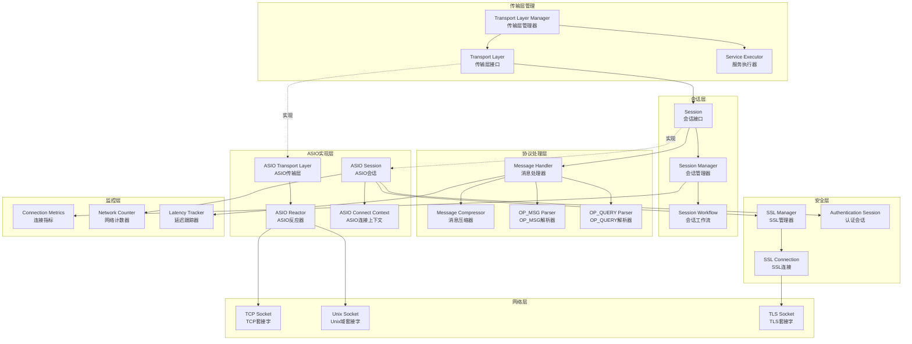
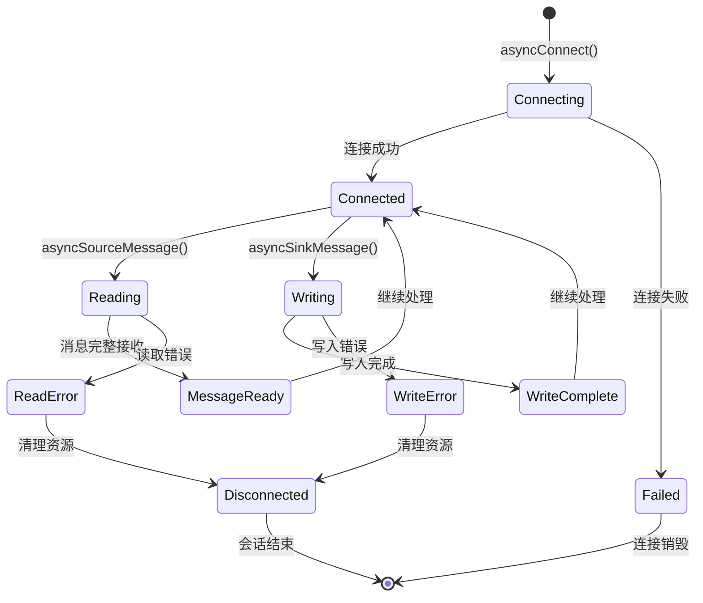
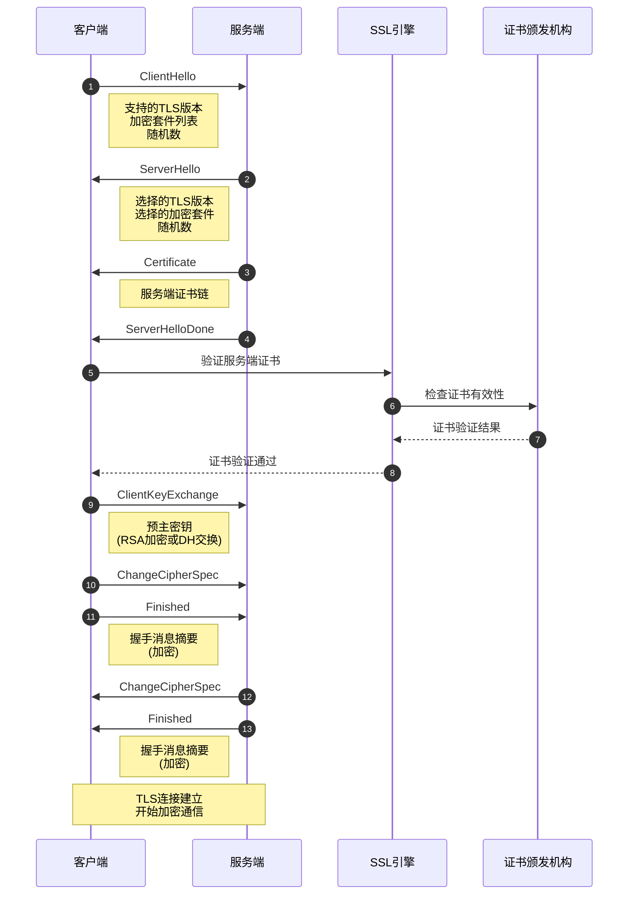
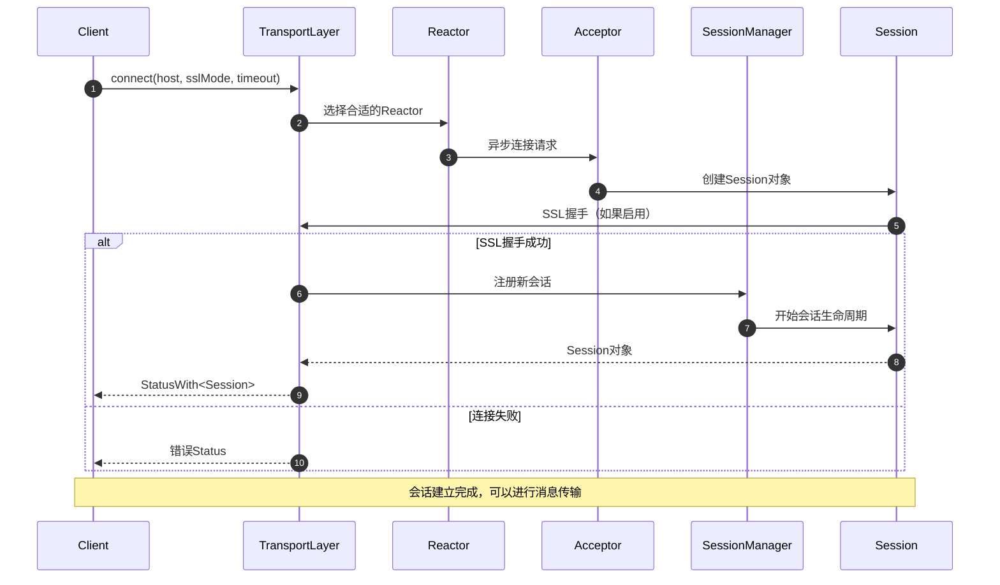

# MongoDB-03-网络传输模块

## 1. 模块概述

网络传输模块（`src/mongo/transport`）负责MongoDB的网络通信，提供客户端和服务端之间的数据传输通道。该模块实现了传输层抽象，支持多种网络协议和通信模式。

### 1.1 主要功能

- **传输层抽象：** 提供统一的网络传输接口，支持多种传输协议
- **会话管理：** 管理客户端连接的生命周期和状态
- **协议处理：** 支持OP_MSG、OP_QUERY等MongoDB协议
- **负载均衡：** 支持连接池和负载分发
- **安全传输：** 集成TLS/SSL加密and认证
- **性能优化：** 提供异步I/O和批量操作支持
- **连接监控：** 监控连接状态和网络性能指标

### 1.2 输入/输出

**输入：**
- 客户端连接请求
- 网络数据包
- 传输配置参数
- TLS证书和密钥

**输出：**
- 建立的网络连接
- 序列化的BSON消息
- 连接状态和统计信息
- 网络错误和异常

### 1.3 上下游依赖

**依赖模块（上游）：**
- base模块：Status错误处理
- util模块：网络工具和并发控制
- rpc模块：消息序列化和协议定义
- platform模块：系统相关的网络API

**被依赖模块（下游）：**
- db模块：数据库服务需要网络连接
- s模块：分片服务需要节点间通信
- client模块：客户端连接依赖传输层
- db-repl模块：复制需要节点间数据传输

### 1.4 生命周期

1. **初始化阶段：** 创建传输层管理器，绑定监听端口
2. **监听阶段：** 接受客户端连接，创建会话
3. **通信阶段：** 处理消息收发，维护连接状态
4. **错误处理：** 处理网络异常，重连和恢复
5. **关闭阶段：** 优雅关闭连接，清理资源

## 2. 模块架构

### 2.1 架构图



### 2.2 架构说明

#### 2.2.1 图意概述

该架构图展示了MongoDB网络传输模块的七层结构：管理层、会话层、实现层、协议层、安全层、网络层和监控层。传输层管理器统筹整个网络子系统，通过ASIO实现异步网络I/O，支持多种协议和安全选项。

#### 2.2.2 核心组件职责

**传输层管理：**
- `TransportLayerManager`：传输层的总控制器，管理网络服务生命周期
- `TransportLayer`：传输层抽象接口，定义统一的网络API
- `ServiceExecutor`：服务执行器，管理工作线程和任务调度

**会话层：**
- `Session`：表示单个客户端连接，提供消息收发接口
- `SessionManager`：管理所有活跃会话，处理连接池
- `SessionWorkflow`：定义会话处理流程和状态转换

**ASIO实现层：**
- `ASIOTransportLayer`：基于Boost.ASIO的传输层实现
- `ASIOSession`：基于ASIO的会话实现，支持异步I/O
- `ASIOReactor`：ASIO事件循环反应器，处理I/O事件
- `ASIOConnectContext`：ASIO连接上下文，管理连接状态

**协议处理层：**
- `MessageHandler`：消息处理器，路由不同类型的消息
- `MessageCompressor`：消息压缩器，支持多种压缩算法
- `OpMsgParser`：OP_MSG协议解析器（MongoDB 3.6+主要协议）
- `OpQueryParser`：OP_QUERY协议解析器（兼容旧版本）

**安全层：**
- `SSLManager`：SSL/TLS管理器，处理证书和加密配置
- `SSLConnection`：SSL连接封装，提供加密通信
- `AuthenticationSession`：认证会话，处理用户身份验证

**网络层：**
- `TCPSocket`：TCP套接字，标准网络连接
- `UnixSocket`：Unix域套接字，本地进程间通信
- `TLSSocket`：TLS套接字，加密网络连接

**监控层：**
- `ConnectionMetrics`：连接指标收集，监控连接数和状态
- `NetworkCounter`：网络计数器，统计流量和操作数
- `LatencyTracker`：延迟跟踪器，监控网络延迟

#### 2.2.3 关键边界条件

1. **连接数限制：**
   - 默认最大连接数：65536
   - 可通过`maxIncomingConnections`配置
   - 超出限制时拒绝新连接

2. **消息大小限制：**
   - 最大消息大小：48MB
   - 超过限制返回错误
   - 支持流式传输大消息

3. **超时控制：**
   - 连接超时：默认20秒
   - 读超时：可配置
   - 写超时：可配置
   - 空闲超时：默认无限制

4. **SSL/TLS配置：**
   - 支持TLS 1.2和1.3
   - 客户端证书验证（可选）
   - FIPS模式支持

#### 2.2.4 异常处理与回退

1. **连接异常：**
   - 网络断开：自动清理会话
   - 连接超时：返回超时错误
   - DNS解析失败：重试和错误报告
   - 端口不可达：立即失败

2. **协议异常：**
   - 消息格式错误：断开连接
   - 协议版本不匹配：协商或拒绝
   - 消息过大：返回错误并断开

3. **SSL异常：**
   - 证书验证失败：拒绝连接
   - 加密协商失败：降级或拒绝
   - 密钥交换失败：断开连接

4. **资源耗尽：**
   - 内存不足：限制新连接
   - 文件描述符不足：清理空闲连接
   - 线程池满：队列请求或拒绝

#### 2.2.5 性能关键点

1. **异步I/O：**
   - 使用Boost.ASIO实现非阻塞I/O
   - 事件驱动架构，高并发支持
   - I/O线程与工作线程分离

2. **零拷贝优化：**
   - 直接从网络缓冲区读取
   - 避免不必要的内存拷贝
   - 使用scatter-gather I/O

3. **连接复用：**
   - 连接池减少建连开销
   - Keep-alive保持长连接
   - 连接预热和缓存

4. **批量操作：**
   - 批量发送减少系统调用
   - 聚合小消息减少网络开销
   - 流水线处理提高吞吐

#### 2.2.6 容量假设

- 最大并发连接数：65536
- 单连接最大消息大小：48MB
- 最大压缩比：90%（取决于数据类型）
- 网络缓冲区大小：64KB-1MB
- SSL握手时间：<100ms

#### 2.2.7 版本兼容与演进

1. **协议版本：**
   - OP_MSG：MongoDB 3.6+主要协议
   - OP_QUERY/OP_REPLY：向后兼容
   - Wire协议版本协商

2. **TLS版本：**
   - TLS 1.3：最新支持
   - TLS 1.2：广泛支持
   - TLS 1.1/1.0：已废弃

3. **压缩算法：**
   - snappy：默认算法
   - zlib：兼容性算法
   - zstd：新增高效算法

## 3. 核心算法

### 3.1 异步消息处理算法

#### 3.1.1 算法目的

实现高效的异步消息收发，支持大量并发连接而不阻塞服务线程。

#### 3.1.2 输入输出

**输入：**
- 网络套接字连接
- 待发送的BSON消息
- 异步回调函数

**输出：**
- 接收到的完整消息
- 异步操作完成通知
- 网络状态和错误信息

#### 3.1.3 核心代码

```cpp
// ASIO会话核心实现
class ASIOSession : public Session {
public:
    ASIOSession(ASIOTransportLayer* tl,
                GenericSocket socket,
                bool isIngressSession)
        : _socket(std::move(socket)),
          _tl(tl),
          _isIngressSession(isIngressSession) {
        
        // 初始化读写缓冲区
        _readBuffer.resize(kInitialBufferSize);
        _writeBuffer.reserve(kInitialBufferSize);
    }
    
    // 异步接收消息
    Future<Message> asyncSourceMessage() override {
        auto promise = std::make_shared<Promise<Message>>();
        
        // 1) 开始读取消息头
        _asyncReadHeader(promise);
        
        return promise->getFuture();
    }
    
    // 异步发送消息
    Future<void> asyncSinkMessage(Message message) override {
        auto promise = std::make_shared<Promise<void>>();
        
        // 1) 序列化消息到缓冲区
        Status serializeStatus = _serializeMessage(message);
        if (!serializeStatus.isOK()) {
            promise->setError(serializeStatus);
            return promise->getFuture();
        }
        
        // 2) 异步写入数据
        _asyncWriteBuffer(promise);
        
        return promise->getFuture();
    }
    
    // 异步连接
    Future<void> asyncConnect(HostAndPort peer,
                             Milliseconds timeout) override {
        auto promise = std::make_shared<Promise<void>>();
        
        // 1) 解析目标地址
        auto resolveResult = _resolver.resolve(peer.host(), 
                                              std::to_string(peer.port()));
        if (!resolveResult) {
            promise->setError(Status(ErrorCodes::HostUnreachable,
                                    "Failed to resolve host"));
            return promise->getFuture();
        }
        
        // 2) 异步连接
        asio::async_connect(
            _socket.getSocket(),
            resolveResult,
            [this, promise, timeout](const asio::error_code& ec, 
                                    const tcp::endpoint& endpoint) {
                if (ec) {
                    promise->setError(_asioErrorToStatus(ec));
                    return;
                }
                
                // 3) 设置套接字选项
                _configureSocket();
                
                // 4) 启动SSL握手（如果需要）
                if (_sslManager && !_isIngressSession) {
                    _asyncSSLHandshake(promise);
                } else {
                    promise->setFrom(Status::OK());
                }
            });
        
        return promise->getFuture();
    }

private:
    // 异步读取消息头
    void _asyncReadHeader(std::shared_ptr<Promise<Message>> promise) {
        // MongoDB消息头固定16字节
        constexpr size_t kHeaderSize = 16;
        
        asio::async_read(
            _socket,
            asio::buffer(_readBuffer.data(), kHeaderSize),
            [this, promise](const asio::error_code& ec, size_t bytesRead) {
                if (ec) {
                    promise->setError(_asioErrorToStatus(ec));
                    return;
                }
                
                // 解析消息头
                DataView headerView(_readBuffer.data());
                int32_t messageLength = headerView.read<LittleEndian<int32_t>>();
                int32_t requestId = headerView.read<LittleEndian<int32_t>>(4);
                int32_t responseTo = headerView.read<LittleEndian<int32_t>>(8);
                int32_t opCode = headerView.read<LittleEndian<int32_t>>(12);
                
                // 验证消息长度
                if (messageLength < kHeaderSize || 
                    messageLength > MaxMessageSizeBytes) {
                    promise->setError(Status(ErrorCodes::ProtocolError,
                                           "Invalid message length"));
                    return;
                }
                
                // 读取消息体
                size_t bodySize = messageLength - kHeaderSize;
                _asyncReadBody(promise, messageLength, requestId, 
                              responseTo, opCode, bodySize);
            });
    }
    
    // 异步读取消息体
    void _asyncReadBody(std::shared_ptr<Promise<Message>> promise,
                       int32_t totalLength,
                       int32_t requestId,
                       int32_t responseTo,
                       int32_t opCode,
                       size_t bodySize) {
        
        // 确保缓冲区足够大
        if (_readBuffer.size() < totalLength) {
            _readBuffer.resize(totalLength);
        }
        
        asio::async_read(
            _socket,
            asio::buffer(_readBuffer.data() + 16, bodySize),
            [this, promise, totalLength, requestId, responseTo, opCode](
                const asio::error_code& ec, size_t bytesRead) {
                
                if (ec) {
                    promise->setError(_asioErrorToStatus(ec));
                    return;
                }
                
                // 构造完整消息
                auto messageBuffer = SharedBuffer::allocate(totalLength);
                memcpy(messageBuffer.get(), _readBuffer.data(), totalLength);
                
                Message message(std::move(messageBuffer));
                message.header().setId(requestId);
                message.header().setResponseToMsgId(responseTo);
                message.header().setOpCode(opCode);
                
                // 解压缩（如果需要）
                if (_compressorManager) {
                    auto decompressResult = _compressorManager->decompressMessage(message);
                    if (!decompressResult.isOK()) {
                        promise->setError(decompressResult.getStatus());
                        return;
                    }
                    message = std::move(decompressResult.getValue());
                }
                
                promise->setFrom(std::move(message));
            });
    }
    
    // 异步写入缓冲区
    void _asyncWriteBuffer(std::shared_ptr<Promise<void>> promise) {
        asio::async_write(
            _socket,
            asio::buffer(_writeBuffer.data(), _writeBuffer.size()),
            [this, promise](const asio::error_code& ec, size_t bytesWritten) {
                if (ec) {
                    promise->setError(_asioErrorToStatus(ec));
                    return;
                }
                
                // 更新统计信息
                _bytesWritten += bytesWritten;
                
                // 清空写缓冲区
                _writeBuffer.clear();
                
                promise->setFrom(Status::OK());
            });
    }
    
    // 序列化消息
    Status _serializeMessage(const Message& message) {
        _writeBuffer.clear();
        
        // 1) 压缩消息（如果需要）
        Message toSend = message;
        if (_compressorManager) {
            auto compressResult = _compressorManager->compressMessage(message);
            if (compressResult.isOK()) {
                toSend = std::move(compressResult.getValue());
            }
        }
        
        // 2) 序列化到缓冲区
        size_t messageSize = toSend.size();
        _writeBuffer.resize(messageSize);
        
        memcpy(_writeBuffer.data(), toSend.buf(), messageSize);
        
        return Status::OK();
    }

private:
    GenericSocket _socket;
    ASIOTransportLayer* _tl;
    bool _isIngressSession;
    
    std::vector<char> _readBuffer;
    std::vector<char> _writeBuffer;
    
    tcp::resolver _resolver;
    std::unique_ptr<SSLManager> _sslManager;
    std::unique_ptr<MessageCompressorManager> _compressorManager;
    
    std::atomic<size_t> _bytesRead{0};
    std::atomic<size_t> _bytesWritten{0};
};
```

#### 3.1.4 算法步骤注释

1. **异步读取：** 先读取16字节消息头，解析长度后读取消息体
2. **异步写入：** 将消息序列化到缓冲区，异步发送
3. **错误处理：** 网络错误通过Promise/Future传播
4. **压缩处理：** 可选的消息压缩和解压缩
5. **状态管理：** 跟踪连接状态和统计信息

#### 3.1.5 异步I/O模型



### 3.2 SSL/TLS握手算法

#### 3.2.1 算法目的

实现安全的TLS连接建立，确保客户端和服务端之间的通信加密和身份验证。

#### 3.2.2 核心代码

```cpp
// SSL管理器核心实现
class SSLManager {
public:
    // 异步SSL握手
    Future<void> asyncSSLHandshake(ASIOSession* session, 
                                  bool isServer) {
        auto promise = std::make_shared<Promise<void>>();
        
        // 1) 创建SSL连接
        auto sslConnection = std::make_unique<SSLConnection>(
            _sslContext, session->getSocket(), isServer);
        
        // 2) 开始SSL握手
        if (isServer) {
            _asyncServerHandshake(sslConnection.get(), promise);
        } else {
            _asyncClientHandshake(sslConnection.get(), promise);
        }
        
        // 3) 保存SSL连接
        session->setSSLConnection(std::move(sslConnection));
        
        return promise->getFuture();
    }
    
    // 验证证书
    bool verifyCertificate(const X509Certificate& cert,
                          const std::string& hostname) {
        // 1) 检查证书有效期
        auto now = Date_t::now();
        if (now < cert.getNotBefore() || now > cert.getNotAfter()) {
            return false;
        }
        
        // 2) 验证证书链
        if (!_verifyCertificateChain(cert)) {
            return false;
        }
        
        // 3) 验证主机名匹配
        if (!_verifyHostname(cert, hostname)) {
            return false;
        }
        
        // 4) 检查证书撤销状态（如果启用CRL/OCSP）
        if (_crlEnabled && !_checkCertificateRevocation(cert)) {
            return false;
        }
        
        return true;
    }

private:
    // 异步服务端握手
    void _asyncServerHandshake(SSLConnection* ssl,
                              std::shared_ptr<Promise<void>> promise) {
        
        ssl->getStream().async_handshake(
            asio::ssl::stream_base::server,
            [this, ssl, promise](const asio::error_code& ec) {
                if (ec) {
                    promise->setError(_sslErrorToStatus(ec));
                    return;
                }
                
                // 验证客户端证书（如果需要）
                if (_requireClientCert) {
                    auto clientCert = ssl->getPeerCertificate();
                    if (!clientCert || !_verifyClientCertificate(*clientCert)) {
                        promise->setError(Status(ErrorCodes::SSLHandshakeFailed,
                                                "Client certificate verification failed"));
                        return;
                    }
                }
                
                promise->setFrom(Status::OK());
            });
    }
    
    // 异步客户端握手
    void _asyncClientHandshake(SSLConnection* ssl,
                              std::shared_ptr<Promise<void>> promise) {
        
        ssl->getStream().async_handshake(
            asio::ssl::stream_base::client,
            [this, ssl, promise](const asio::error_code& ec) {
                if (ec) {
                    promise->setError(_sslErrorToStatus(ec));
                    return;
                }
                
                // 验证服务端证书
                auto serverCert = ssl->getPeerCertificate();
                if (!serverCert) {
                    promise->setError(Status(ErrorCodes::SSLHandshakeFailed,
                                           "No server certificate"));
                    return;
                }
                
                if (!_verifyServerCertificate(*serverCert)) {
                    promise->setError(Status(ErrorCodes::SSLHandshakeFailed,
                                           "Server certificate verification failed"));
                    return;
                }
                
                promise->setFrom(Status::OK());
            });
    }

private:
    asio::ssl::context _sslContext;
    bool _requireClientCert = false;
    bool _crlEnabled = false;
    std::string _caFile;
    std::string _certFile;
    std::string _keyFile;
};
```

#### 3.2.3 TLS握手时序图



## 4. API详细说明

### 4.1 TransportLayer类API

#### 4.1.1 基本信息

- **名称：** `TransportLayer`
- **作用：** 网络传输层抽象基类，管理连接和会话
- **协议支持：** MongoRPC、gRPC
- **连接模式：** 同步connect、异步asyncConnect

#### 4.1.2 请求结构体

```cpp
// 连接请求参数
struct ConnectRequest {
    HostAndPort peer;                    // 目标主机和端口
    ConnectSSLMode sslMode;             // SSL模式
    Milliseconds timeout;               // 连接超时
    boost::optional<TransientSSLParams> sslParams; // 临时SSL参数
    ReactorHandle reactor;              // 指定反应器
    std::shared_ptr<ConnectionMetrics> metrics; // 连接指标
};
```

| 字段 | 类型 | 必填 | 默认 | 约束 | 说明 |
|---|---|---:|---|---|---|
| peer | HostAndPort | 是 | - | 有效地址 | 目标服务器地址 |
| sslMode | ConnectSSLMode | 是 | kGlobalSSLMode | 枚举值 | SSL连接模式 |
| timeout | Milliseconds | 是 | - | >0 | 连接超时时间 |
| sslParams | TransientSSLParams | 否 | none | - | 临时SSL配置 |
| reactor | ReactorHandle | 否 | nullptr | - | 指定使用的反应器 |
| metrics | ConnectionMetrics | 否 | nullptr | - | 连接性能指标 |

#### 4.1.3 响应结构体

```cpp
// 连接响应结果
struct ConnectResponse {
    Status status;                      // 连接状态
    std::shared_ptr<Session> session;   // 会话对象
    std::string remoteAddr;            // 远程地址
    std::string localAddr;             // 本地地址
    bool isSSL;                        // 是否SSL连接
};
```

| 字段 | 类型 | 说明 |
|---|---|---|
| status | Status | 连接成功或失败状态 |
| session | shared_ptr<Session> | 建立的会话对象，失败时为nullptr |
| remoteAddr | string | 远程端点地址 |
| localAddr | string | 本地绑定地址 |
| isSSL | bool | 连接是否使用SSL/TLS加密 |

#### 4.1.4 核心方法

```cpp
class TransportLayer {
public:
    // 1) 同步连接接口
    virtual StatusWith<std::shared_ptr<Session>> connect(
        HostAndPort peer,
        ConnectSSLMode sslMode,
        Milliseconds timeout,
        const boost::optional<TransientSSLParams>& transientSSLParams = boost::none) = 0;
    
    // 2) 异步连接接口
    virtual Future<std::shared_ptr<Session>> asyncConnect(
        HostAndPort peer,
        ConnectSSLMode sslMode,
        const ReactorHandle& reactor,
        Milliseconds timeout,
        std::shared_ptr<ConnectionMetrics> connectionMetrics,
        std::shared_ptr<const SSLConnectionContext> transientSSLContext) = 0;
    
    // 3) 启动传输层
    virtual Status start() = 0;
    
    // 4) 关闭传输层
    virtual void shutdown() = 0;
    
    // 5) 停止接受新连接
    virtual void stopAcceptingSessions() = 0;
    
    // 6) 获取反应器
    enum WhichReactor { kIngress, kEgress, kNewReactor };
    virtual ReactorHandle getReactor(WhichReactor which) = 0;
    
    // 7) 获取会话管理器
    virtual SessionManager* getSessionManager() const = 0;
    
    // 8) SSL证书轮换
    virtual Status rotateCertificates(std::shared_ptr<SSLManagerInterface> manager,
                                      bool asyncOCSPStaple) = 0;
    
    // 9) 创建临时SSL上下文
    virtual StatusWith<std::shared_ptr<const transport::SSLConnectionContext>>
    createTransientSSLContext(const TransientSSLParams& transientSSLParams,
                             boost::optional<std::shared_ptr<SSLManagerInterface>> optionalManager) = 0;
    
    // 10) 统计信息
    virtual void appendStatsForServerStatus(BSONObjBuilder* bob) const {}
    virtual void appendStatsForFTDC(BSONObjBuilder& bob) const {}
};
```

#### 4.1.5 时序图（连接建立流程）



### 4.2 Session类API

#### 4.2.1 基本信息

- **名称：** `Session`
- **作用：** 表示单个网络连接会话，支持消息收发
- **生命周期：** 从连接建立到连接关闭
- **线程安全：** 非线程安全，需要外部同步

#### 4.2.2 核心方法

```cpp
class Session {
public:
    // 1) 会话标识
    virtual const SessionId& id() const = 0;
    virtual const HostAndPort& remote() const = 0;
    virtual const HostAndPort& local() const = 0;
    
    // 2) 同步消息接收
    virtual StatusWith<Message> sourceMessage() = 0;
    
    // 3) 异步消息接收
    virtual Future<Message> asyncSourceMessage(const BatonHandle& baton = nullptr) = 0;
    
    // 4) 同步消息发送
    virtual Status sinkMessage(Message message) = 0;
    
    // 5) 异步消息发送
    virtual Future<void> asyncSinkMessage(Message message, const BatonHandle& baton = nullptr) = 0;
    
    // 6) 会话终止
    virtual void end() = 0;
    
    // 7) 连接状态查询
    virtual bool isConnected() = 0;
    
    // 8) SSL信息获取
    virtual const std::shared_ptr<SSLConnectionContext>& getSSLContext() const = 0;
    
    // 9) 超时设置
    virtual void setTimeout(boost::optional<Milliseconds> timeout) = 0;
    virtual boost::optional<Milliseconds> getTimeout() const = 0;
    
    // 10) 标签管理（用于会话分组）
    virtual void setTags(Client::TagMask tags) = 0;
    virtual Client::TagMask getTags() const = 0;
};
```

### 4.3 SessionManager类API

#### 4.3.1 基本信息

- **名称：** `SessionManager`
- **作用：** 管理所有活跃会话的生命周期
- **职责：** 会话创建、销毁、批量操作

#### 4.3.2 核心方法

```cpp
class SessionManager {
public:
    // 1) 开始新会话
    virtual void startSession(std::shared_ptr<Session> session) = 0;
    
    // 2) 结束指定客户端的会话
    virtual void endSessionByClient(Client* client) = 0;
    
    // 3) 批量结束会话（按标签过滤）
    virtual void endAllSessions(Client::TagMask tags) = 0;
    
    // 4) 关闭会话管理器
    virtual bool shutdown(Milliseconds timeout) = 0;
    
    // 5) 获取活跃会话数量
    virtual std::size_t numOpenSessions() const = 0;
    
    // 6) 统计信息
    virtual void appendStatsForServerStatus(BSONObjBuilder* bob) const = 0;
    virtual void appendStatsForFTDC(BSONObjBuilder& bob) const = 0;
    
    // 7) 会话生命周期钩子
    using SessionStartedHandler = std::function<void(std::shared_ptr<Session>)>;
    using SessionEndedHandler = std::function<void(const Session&)>;
    
    virtual void setSessionStartedHandler(SessionStartedHandler handler) = 0;
    virtual void setSessionEndedHandler(SessionEndedHandler handler) = 0;
};
```

### 4.4 ServiceExecutor类API

#### 4.4.1 基本信息

- **名称：** `ServiceExecutor`
- **作用：** 任务执行器，为会话提供线程池和任务调度
- **实现类型：** 同步执行器、异步执行器、专用执行器

#### 4.4.2 核心方法

```cpp
class ServiceExecutor {
public:
    using Task = OutOfLineExecutor::Task;
    
    class TaskRunner : public OutOfLineExecutor {
    public:
        // 为会话运行任务
        virtual void runTaskForSession(std::shared_ptr<Session> session, Task task) = 0;
    };
    
    // 1) 静态管理方法
    static void startupAll(ServiceContext* svcCtx);
    static void shutdownAll(ServiceContext* svcCtx, Milliseconds timeout);
    static void appendAllServerStats(BSONObjBuilder*, ServiceContext*);
    
    // 2) 创建任务运行器
    virtual std::unique_ptr<TaskRunner> makeTaskRunner() = 0;
    
    // 3) 生命周期管理
    virtual void start() = 0;
    virtual Status shutdown(Milliseconds timeout) = 0;
    
    // 4) 状态查询
    virtual size_t getRunningThreads() const = 0;
    virtual void appendStats(BSONObjBuilder* bob) const = 0;
};
```

### 4.5 SSL/TLS安全API

#### 4.5.1 SSLConnectionContext类

```cpp
class SSLConnectionContext {
public:
    // 1) SSL参数查询
    virtual const SSLConfiguration& getSSLConfiguration() const = 0;
    virtual const std::string& getCertificateSubjectName() const = 0;
    virtual const std::vector<std::string>& getCertificateAlternativeNames() const = 0;
    
    // 2) 证书验证
    virtual Status verifyCertificate(const std::string& remoteHost) const = 0;
    
    // 3) 加密强度查询
    virtual std::string getCipherSuite() const = 0;
    virtual int getSSLVersion() const = 0;
    
    // 4) 客户端证书信息
    virtual boost::optional<std::string> getClientCertificateSubject() const = 0;
    virtual std::vector<std::string> getClientCertificateRoles() const = 0;
};

// 临时SSL参数
struct TransientSSLParams {
    boost::optional<std::string> sslClusterFile;     // 集群证书文件
    boost::optional<std::string> sslClusterPassword; // 集群证书密码
    boost::optional<std::string> sslCAFile;          // CA证书文件
    boost::optional<std::string> sslCRLFile;         // 证书撤销列表
    boost::optional<bool> sslAllowInvalidCertificates; // 允许无效证书
    boost::optional<bool> sslAllowInvalidHostnames;    // 允许无效主机名
};
```

### 4.6 Message类API

#### 4.6.1 基本信息

- **名称：** `Message`
- **作用：** 网络消息的内存表示，支持OP_MSG协议
- **格式：** MongoDB Wire Protocol

#### 4.6.2 核心方法

```cpp
class Message {
private:
    SharedBuffer _buf;    // 消息缓冲区
    
public:
    // 1) 构造函数
    Message() = default;
    explicit Message(SharedBuffer buf) : _buf(std::move(buf)) {}
    
    // 2) 消息头访问
    const MSGHEADER& header() const {
        return *reinterpret_cast<const MSGHEADER*>(_buf.get());
    }
    
    // 3) 消息体访问
    const char* singleData() const {
        return _buf.get() + sizeof(MSGHEADER);
    }
    
    // 4) 消息大小
    int size() const {
        return header().messageLength;
    }
    
    // 5) 操作码
    NetworkOp operation() const {
        return NetworkOp(header().opCode);
    }
    
    // 6) 请求ID
    int32_t getId() const {
        return header().requestID;
    }
    
    // 7) 响应ID
    int32_t getResponseToMsgId() const {
        return header().responseTo;
    }
    
    // 8) 消息重置
    void reset() {
        _buf = SharedBuffer{};
    }
    
    // 9) 缓冲区管理
    SharedBuffer sharedBuffer() {
        return _buf;
    }
    
    // 10) 消息构建
    static Message buildMessage(NetworkOp op, const BSONObj& obj) {
        BufBuilder builder;
        
        // 构建消息头
        MSGHEADER header;
        header.messageLength = sizeof(MSGHEADER) + obj.objsize();
        header.requestID = nextMessageId();
        header.responseTo = 0;
        header.opCode = static_cast<int32_t>(op);
        
        builder.appendStruct(header);
        builder.appendBuf(obj.objdata(), obj.objsize());
        
        return Message(builder.release());
    }
};
```

### 4.7 Reactor类API

#### 4.7.1 基本信息

- **名称：** `Reactor`
- **作用：** 事件驱动的I/O多路复用器，基于epoll/kqueue
- **模式：** 单线程事件循环

#### 4.7.2 核心方法

```cpp
class Reactor {
public:
    // 1) 启动和停止
    virtual void start() = 0;
    virtual void stop() = 0;
    
    // 2) 事件循环
    virtual void run() = 0;
    virtual void runFor(Milliseconds time) = 0;
    
    // 3) 定时器
    using Timer = std::unique_ptr<ReactorTimer>;
    virtual Timer makeTimer() = 0;
    
    // 4) 网络操作
    virtual Future<size_t> asyncRead(const std::shared_ptr<Session>& session,
                                    const MutableBufferSequence& buffers) = 0;
    
    virtual Future<size_t> asyncWrite(const std::shared_ptr<Session>& session,
                                     const ConstBufferSequence& buffers) = 0;
    
    // 5) 连接操作
    virtual Future<std::shared_ptr<Session>> asyncConnect(const HostAndPort& peer,
                                                         Milliseconds timeout) = 0;
    
    // 6) 调度任务
    virtual void schedule(OutOfLineExecutor::Task task) = 0;
    virtual bool onReactorThread() const = 0;
    
    // 7) 统计信息
    virtual void appendStats(BSONObjBuilder& bob) const = 0;
};
```

## 5. 性能优化要点

### 5.1 连接池管理

**连接复用策略：**
```cpp
// ❌ 低效：每次请求都建立新连接
Status sendCommand(const HostAndPort& server, const BSONObj& cmd) {
    auto swSession = transportLayer->connect(server, kGlobalSSLMode, Seconds(30));
    if (!swSession.isOK()) return swSession.getStatus();
    
    auto session = swSession.getValue();
    // 发送命令...
    session->end(); // 立即关闭连接
    return Status::OK();
}

// ✅ 高效：使用连接池
class ConnectionPool {
private:
    std::unordered_map<HostAndPort, std::queue<std::shared_ptr<Session>>> _pools;
    
public:
    std::shared_ptr<Session> acquire(const HostAndPort& server) {
        auto& pool = _pools[server];
        if (!pool.empty()) {
            auto session = pool.front();
            pool.pop();
            if (session->isConnected()) {
                return session; // 复用现有连接
            }
        }
        
        // 创建新连接
        auto swSession = _transportLayer->connect(server, kGlobalSSLMode, Seconds(30));
        return swSession.isOK() ? swSession.getValue() : nullptr;
    }
    
    void release(std::shared_ptr<Session> session) {
        if (session->isConnected()) {
            _pools[session->remote()].push(session); // 回收到池中
        }
    }
};
```

### 5.2 异步I/O优化

**避免阻塞操作：**
```cpp
// ❌ 低效：同步I/O阻塞线程
void handleRequest(std::shared_ptr<Session> session) {
    auto swMessage = session->sourceMessage(); // 阻塞等待
    if (swMessage.isOK()) {
        processMessage(swMessage.getValue());
    }
}

// ✅ 高效：异步I/O
void handleRequestAsync(std::shared_ptr<Session> session) {
    session->asyncSourceMessage().getAsync([session](StatusWith<Message> swMessage) {
        if (swMessage.isOK()) {
            processMessage(swMessage.getValue());
            // 继续处理下一条消息
            handleRequestAsync(session);
        }
    });
}
```

### 5.3 内存管理优化

**减少内存拷贝：**
```cpp
// ❌ 低效：多次内存拷贝
Message buildResponse(const BSONObj& responseDoc) {
    std::string serialized = responseDoc.jsonString(); // 第一次拷贝
    BufBuilder builder;
    builder.appendStr(serialized); // 第二次拷贝
    return Message(builder.release()); // 第三次拷贝
}

// ✅ 高效：零拷贝构建
Message buildResponse(const BSONObj& responseDoc) {
    BufBuilder builder;
    // 直接序列化BSON到缓冲区
    builder.appendBuf(responseDoc.objdata(), responseDoc.objsize());
    return Message(builder.release()); // 只有一次内存移动
}
```

网络传输模块是MongoDB高性能的关键组件，其异步I/O和事件驱动架构支持数万并发连接。理解其API设计对于开发高性能的MongoDB应用和扩展至关重要。

---

**文档版本：** v1.0  
**生成时间：** 2025-10-05  
**适用版本：** MongoDB 8.0+
