# MongoDB-04-RPC模块

## 1. 模块概述

RPC模块（`src/mongo/rpc`）是MongoDB的远程过程调用系统，负责客户端与服务器之间的通信协议处理。该模块实现了多种协议格式的统一接口，提供了请求/响应的序列化和反序列化功能。

### 1.1 主要功能

- **协议抽象：** 提供统一的RPC接口，支持多种传输协议
- **消息序列化：** 处理BSON对象与网络消息的转换
- **请求路由：** 将网络请求路由到相应的命令处理器
- **响应构建：** 构建格式化的响应消息返回给客户端
- **元数据处理：** 处理请求和响应中的元数据信息
- **协议升级：** 支持协议版本的向后兼容和升级

### 1.2 输入/输出

**输入：**
- 网络传输层的原始消息
- 命令执行结果和状态信息
- 客户端认证和授权信息
- 元数据和上下文信息

**输出：**
- 格式化的请求对象（OpMsgRequest等）
- 序列化的响应消息
- 错误和状态码信息
- 协议兼容性信息

### 1.3 上下游依赖

**依赖模块（上游）：**
- transport模块：网络传输和连接管理
- bson模块：BSON对象序列化和反序列化
- base模块：基础错误处理和状态管理
- util模块：网络工具和内存管理

**被依赖模块（下游）：**
- db-commands：数据库命令处理
- db-service：数据库服务层
- s-commands：分片相关命令
- client：客户端驱动程序

### 1.4 生命周期

1. **初始化阶段：** 注册协议处理器和消息工厂  
2. **监听阶段：** 接收来自网络层的原始消息
3. **解析阶段：** 解析消息格式并创建请求对象
4. **路由阶段：** 将请求路由到对应的命令处理器
5. **响应阶段：** 构建和序列化响应消息
6. **清理阶段：** 释放资源和清理连接状态

## 2. 模块架构

### 2.1 架构图

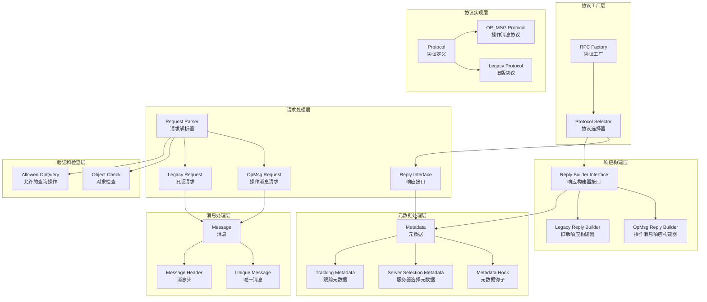

### 2.2 架构说明

#### 2.2.1 图意概述

该架构图展示了MongoDB RPC模块的六层结构：协议工厂层、请求处理层、响应构建层、消息处理层、元数据处理层和协议实现层。RPC工厂负责根据协议类型创建相应的处理器，实现了协议的统一抽象和多协议支持。

#### 2.2.2 核心组件职责

**协议工厂层：**
- `Factory`：RPC协议工厂，根据消息类型创建对应的处理器
- `ProtocolSelector`：协议选择器，识别和选择合适的协议版本

**请求处理层：**
- `ReplyInterface`：响应接口抽象，定义响应对象的通用接口
- `RequestParser`：请求解析器，解析不同格式的网络请求
- `OpMsgRequest`：OP_MSG协议的请求对象
- `LegacyRequest`：旧版协议的请求对象

**响应构建层：**
- `ReplyBuilderInterface`：响应构建器接口，定义响应构建的标准接口
- `OpMsgReplyBuilder`：OP_MSG协议的响应构建器
- `LegacyReplyBuilder`：旧版协议的响应构建器

**消息处理层：**
- `Message`：网络消息的基础表示
- `UniqueMessage`：支持RAII的唯一消息对象
- `MessageHeader`：消息头信息处理

**元数据处理层：**
- `Metadata`：请求和响应的元数据管理
- `MetadataHook`：元数据处理钩子，支持自定义元数据处理
- `ServerSelectionMetadata`：服务器选择相关的元数据
- `TrackingMetadata`：请求跟踪和监控元数据

**协议实现层：**
- `Protocol`：协议类型定义和枚举
- `OpMsgProtocol`：OP_MSG协议的具体实现
- `LegacyProtocol`：旧版协议的兼容实现

**验证和检查层：**
- `ObjectCheck`：BSON对象的有效性检查
- `AllowedOpQuery`：查询操作的权限和合法性检查

#### 2.2.3 关键边界条件

1. **协议兼容性：**
   - 支持OP_MSG和Legacy协议的混合使用
   - 客户端协议版本的自动检测和适配
   - 协议升级时的向后兼容保证

2. **消息大小限制：**
   - 单个消息最大16MB限制
   - 批量操作的消息聚合优化
   - 大型响应的分页处理

3. **并发处理：**
   - 支持多连接并发请求处理
   - 请求ID的唯一性保证
   - 响应与请求的正确匹配

4. **内存管理：**
   - 消息缓冲区的重用和池化
   - 大型消息的流式处理
   - 内存泄漏的防护机制

#### 2.2.4 异常处理与回退

1. **协议错误：**
   - 无效协议格式的优雅处理
   - 不支持协议版本的降级策略
   - 协议解析错误的详细报告

2. **网络异常：**
   - 连接中断时的状态清理
   - 超时请求的自动取消
   - 网络错误的重试机制

3. **序列化错误：**
   - BSON格式错误的检测和报告
   - 数据截断或损坏的处理
   - 编码转换错误的回退

#### 2.2.5 性能关键点

1. **消息解析性能：**
   - 零拷贝消息解析技术
   - 预分配缓冲区减少内存分配
   - 协议格式的快速识别算法

2. **序列化优化：**
   - BSON对象的高效序列化
   - 批量操作的优化处理
   - 压缩算法的选择和应用

3. **内存使用优化：**
   - 对象池化减少GC压力
   - 引用计数管理生命周期
   - 内存映射文件的使用

4. **并发性能：**
   - 无锁数据结构的使用
   - 线程本地存储优化
   - 异步I/O模型的采用

#### 2.2.6 容量假设

- 单个连接最大并发请求：1000个
- 消息缓冲区大小：32MB
- 元数据最大大小：1MB
- 支持的最大连接数：65536个
- 协议版本支持范围：向后兼容3个主要版本

#### 2.2.7 版本兼容与演进

1. **协议演进：**
   - OP_QUERY → OP_MSG协议迁移
   - 新特性的渐进式添加
   - 废弃协议的平滑退出机制

2. **API兼容性：**
   - 向后兼容的接口设计
   - 版本化的元数据格式
   - 客户端驱动程序的兼容性保证

3. **性能改进：**
   - 协议压缩算法的引入
   - 批量操作支持的增强
   - 流式处理能力的提升

## 3. 核心算法

### 3.1 协议识别算法

#### 3.1.1 算法目的

根据网络消息的格式特征自动识别和选择合适的RPC协议版本，确保与不同版本客户端的兼容性。

#### 3.1.2 输入输出

**输入：**
- 网络层接收的原始消息缓冲区
- 消息头信息（操作码、消息长度等）
- 客户端连接上下文

**输出：**
- 识别的协议类型（OP_MSG、OP_QUERY等）
- 协议版本信息
- 对应的消息处理器

#### 3.1.3 核心代码

```cpp
// 协议识别和工厂创建
namespace mongo {
namespace rpc {

// 协议类型枚举
enum class Protocol {
    kOpMsg,           // OP_MSG协议（MongoDB 3.6+）
    kOpQuery,         // OP_QUERY协议（传统协议）
    kOpCommandV1      // OP_COMMAND协议（已废弃）
};

// 协议工厂实现
class ProtocolFactory {
public:
    // 从消息中识别协议类型
    static Protocol identifyProtocol(const Message& message) {
        
        // 1) 获取消息头
        const MessageHeader& header = message.header();
        int32_t opCode = header.getOpCode();
        
        // 2) 根据操作码识别协议
        switch (opCode) {
            case OpCode::dbMsg:
                return Protocol::kOpMsg;
                
            case OpCode::dbQuery:
                return Protocol::kOpQuery;
                
            case OpCode::dbCommand:
                // 检查是否为OP_COMMAND格式
                if (_isOpCommandFormat(message)) {
                    return Protocol::kOpCommandV1;
                }
                return Protocol::kOpQuery;
                
            default:
                uasserted(ErrorCodes::UnsupportedFormat,
                         str::stream() << "Unsupported opcode: " << opCode);
        }
    }
    
    // 创建请求解析器
    static std::unique_ptr<ReplyInterface> makeReply(const Message* message) {
        
        // 1) 识别协议类型
        Protocol protocol = identifyProtocol(*message);
        
        // 2) 根据协议创建对应的解析器
        switch (protocol) {
            case Protocol::kOpMsg:
                return std::make_unique<OpMsgReply>(message);
                
            case Protocol::kOpQuery:
                return std::make_unique<LegacyReply>(message);
                
            case Protocol::kOpCommandV1:
                // 转换为OpMsg格式
                return std::make_unique<OpMsgReply>(_convertToOpMsg(message));
                
            default:
                uasserted(ErrorCodes::InternalError, "Unknown protocol");
        }
    }
    
    // 创建响应构建器
    static std::unique_ptr<ReplyBuilderInterface> makeReplyBuilder(Protocol protocol) {
        
        switch (protocol) {
            case Protocol::kOpMsg:
                return std::make_unique<OpMsgReplyBuilder>();
                
            case Protocol::kOpQuery:
                return std::make_unique<LegacyReplyBuilder>();
                
            default:
                uasserted(ErrorCodes::UnsupportedFormat,
                         "Unsupported reply protocol");
        }
    }

private:
    // 检查是否为OP_COMMAND格式
    static bool _isOpCommandFormat(const Message& message) {
        
        // OP_COMMAND有特定的消息结构
        BufReader reader(message.singleData().data(), message.size());
        
        // 跳过消息头
        reader.skip(sizeof(MessageHeader));
        
        // 检查命令标识符
        int32_t flags = reader.read<LittleEndian<int32_t>>();
        if (flags & OpCommandFlags::kCommandFlag) {
            return true;
        }
        
        return false;
    }
    
    // 将旧协议转换为OpMsg格式
    static Message _convertToOpMsg(const Message* legacyMessage) {
        
        // 1) 解析旧格式消息
        LegacyRequest legacyRequest(legacyMessage);
        
        // 2) 提取命令和参数
        BSONObj commandObj = legacyRequest.getCommandArgs();
        NamespaceString nss = legacyRequest.getDatabase();
        
        // 3) 构建OpMsg格式
        OpMsgBuilder builder;
        builder.setBody(commandObj);
        builder.setNamespace(nss);
        
        // 4) 序列化为新消息
        return builder.finish();
    }
};

// 统一的请求解析入口
OpMsgRequest opMsgRequestFromAnyProtocol(const Message& message, Client* client) {
    
    // 1) 识别协议
    Protocol protocol = ProtocolFactory::identifyProtocol(message);
    
    // 2) 根据协议解析请求
    switch (protocol) {
        case Protocol::kOpMsg: {
            // 直接解析OpMsg请求
            return OpMsgRequest::parse(message);
        }
        
        case Protocol::kOpQuery: {
            // 解析旧版查询请求
            LegacyRequest legacyReq(&message);
            
            // 转换为OpMsgRequest格式
            OpMsgRequestBuilder builder;
            builder.setDatabase(legacyReq.getDatabase());
            builder.setCommandName(legacyReq.getCommandName());
            builder.setCommandArgs(legacyReq.getCommandArgs());
            
            return builder.finish();
        }
        
        default:
            uasserted(ErrorCodes::UnsupportedFormat,
                     "Cannot convert protocol to OpMsgRequest");
    }
};

}}  // namespace mongo::rpc
```

#### 3.1.4 算法步骤注释

1. **消息头解析：** 提取消息的操作码和标志位
2. **协议识别：** 根据操作码判断协议类型
3. **格式检查：** 对于模糊的操作码进行详细格式检查
4. **处理器创建：** 创建对应协议的请求/响应处理器
5. **格式转换：** 将旧协议格式转换为统一的内部表示

#### 3.1.5 复杂度分析

- **时间复杂度：** O(1)，基于操作码的常数时间查找
- **空间复杂度：** O(1)，只需要少量临时变量
- **转换开销：** O(n)，n为消息大小（仅在协议转换时）

## 4. 时序图详细说明

### 4.1 OP_MSG协议请求处理

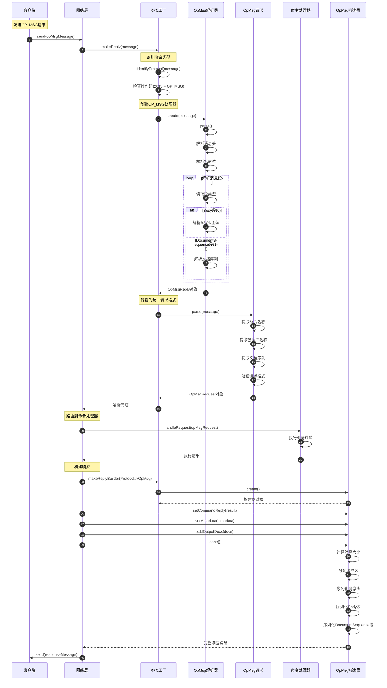

#### 4.1.1 关键边界条件

- **消息大小：** 单个OP_MSG最大48MB
- **段数量：** 最多支持255个消息段  
- **文档序列：** 单个序列最大16MB
- **并发处理：** 支持多连接并发解析

### 4.2 传统协议兼容处理

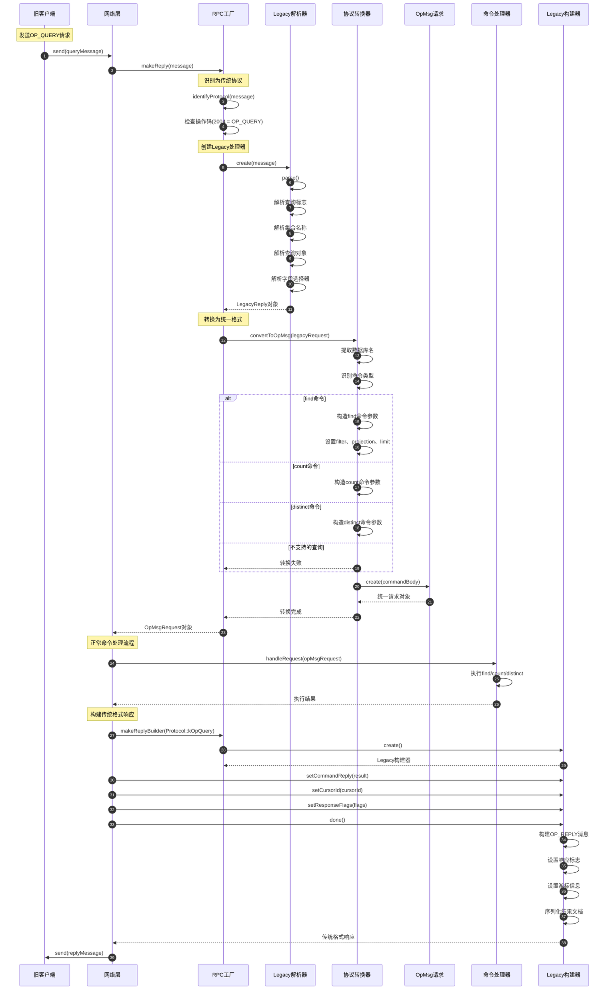

### 4.3 协议升级和协商时序图

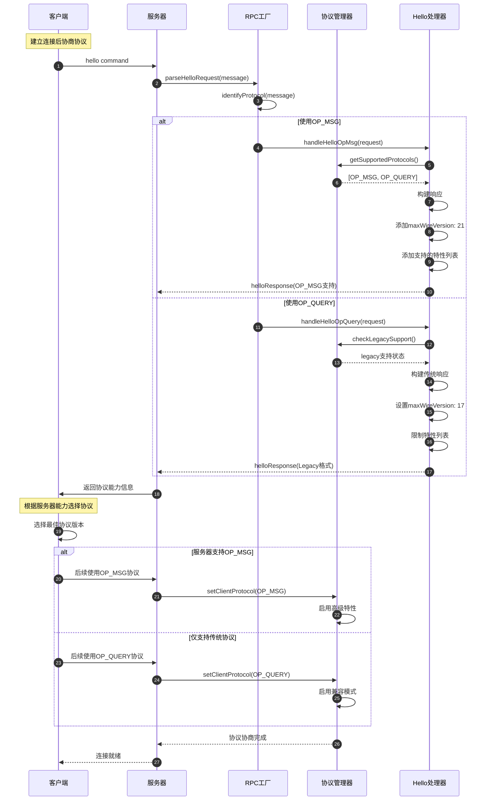

## 5. 数据结构详细说明

### 5.1 核心数据结构UML图

#### 5.1.1 消息和协议基础类图

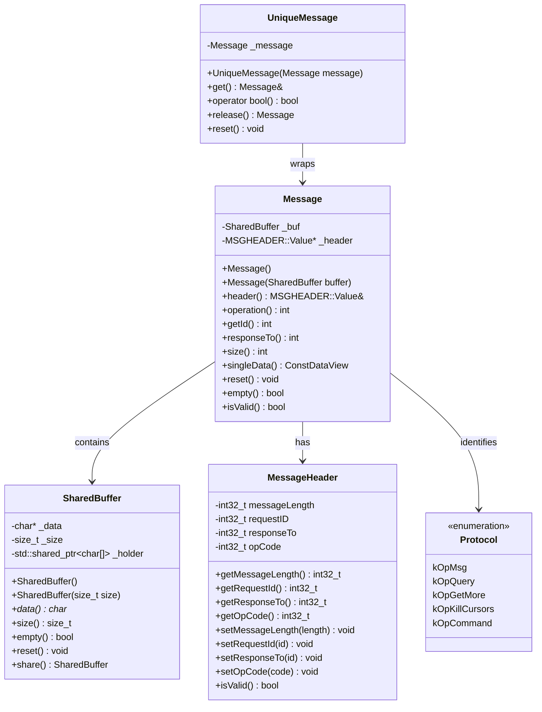

#### 5.1.2 请求处理接口类图

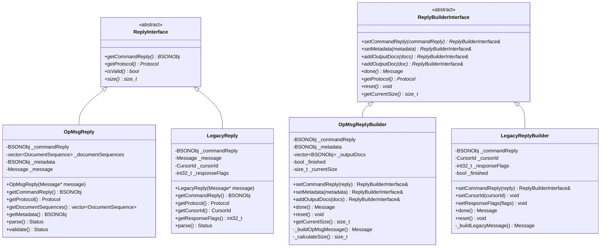

#### 5.1.3 请求对象和文档序列类图

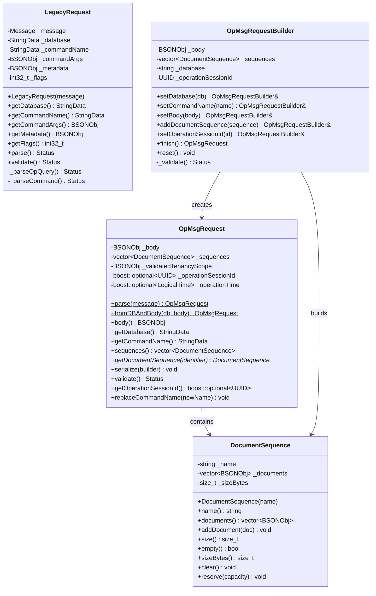

#### 5.1.4 元数据处理类图

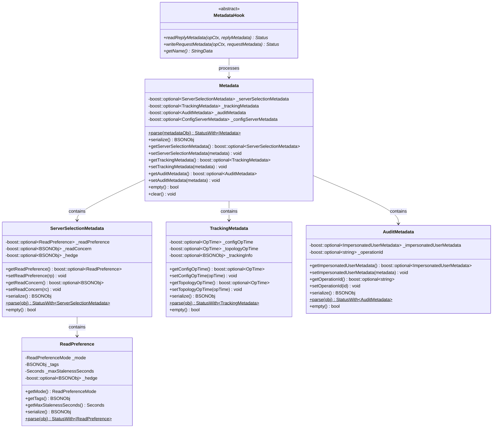

### 5.2 协议特定数据结构

#### 5.2.1 OP_MSG协议数据结构

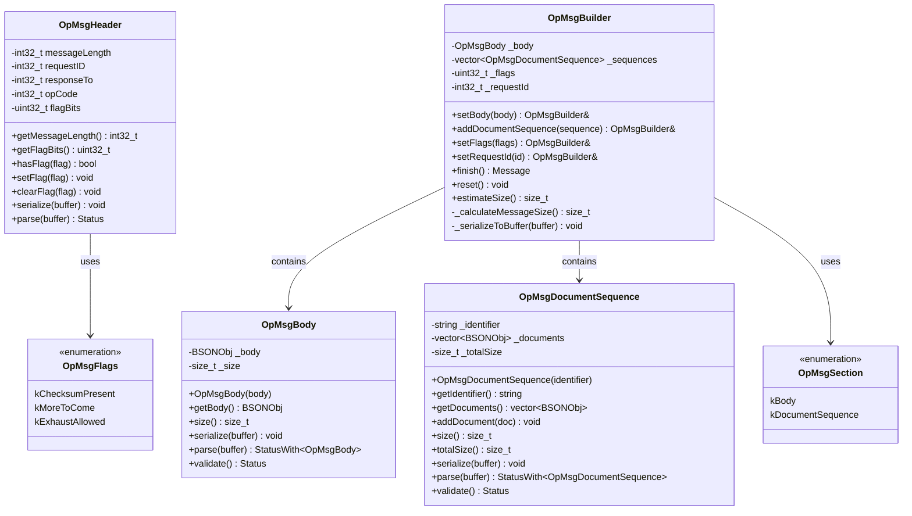

#### 5.2.2 Legacy协议数据结构

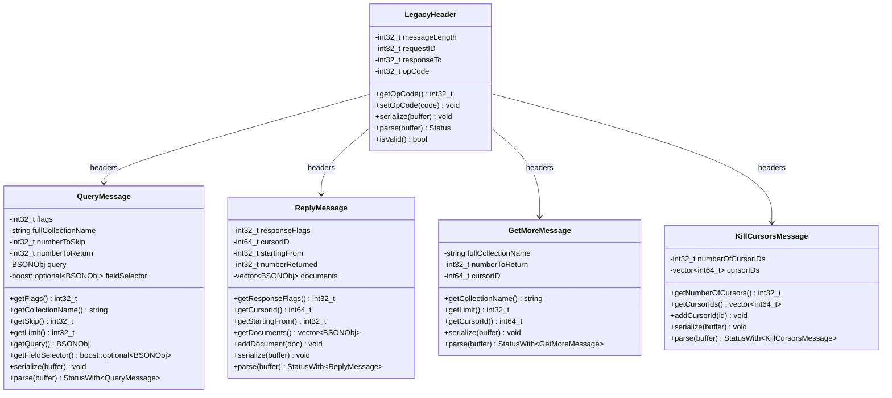

### 5.3 内存管理和池化

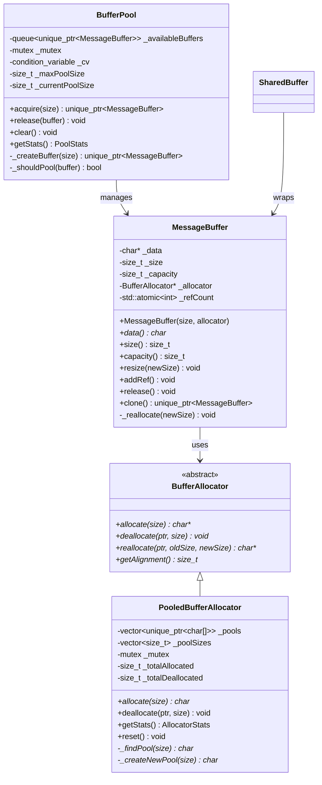

## 6. API详细说明

### 6.1 Factory - 协议工厂API

#### 6.1.1 基本信息

- **名称：** `rpc::Factory`
- **协议/方法：** C++ 静态工厂类
- **幂等性：** 是（创建操作可重复调用）

#### 6.1.2 核心方法

```cpp
// 协议工厂核心接口
namespace mongo {
namespace rpc {

// 协议类型枚举
enum class Protocol {
    kOpMsg,        // OP_MSG协议（现代协议）
    kOpQuery       // OP_QUERY协议（传统协议）
};

// 工厂方法集合
class Factory {
public:
    // 从消息创建响应接口
    static std::unique_ptr<ReplyInterface> makeReply(const Message* unownedMessage);
    
    // 从任意协议消息创建OpMsgRequest
    static OpMsgRequest opMsgRequestFromAnyProtocol(
        const Message& unownedMessage, 
        Client* client = nullptr);
    
    // 创建响应构建器
    static std::unique_ptr<ReplyBuilderInterface> makeReplyBuilder(Protocol protocol);
    
    // 识别消息协议类型
    static Protocol identifyProtocol(const Message& message);
};

}}
```

#### 6.1.3 协议识别和处理器创建

```cpp
// 协议工厂实现
std::unique_ptr<ReplyInterface> Factory::makeReply(const Message* unownedMessage) {
    
    // 1) 验证输入参数
    uassert(ErrorCodes::BadValue, 
           "Cannot make reply from null message", 
           unownedMessage != nullptr);
    
    // 2) 识别协议类型
    Protocol protocol = identifyProtocol(*unownedMessage);
    
    // 3) 根据协议类型创建对应的处理器
    switch (protocol) {
        case Protocol::kOpMsg:
            return std::make_unique<OpMsgReply>(unownedMessage);
            
        case Protocol::kOpQuery:
            return std::make_unique<LegacyReply>(unownedMessage);
            
        default:
            uasserted(ErrorCodes::UnsupportedFormat,
                     str::stream() << "Unsupported protocol: " 
                                   << static_cast<int>(protocol));
    }
}

// 统一请求解析
OpMsgRequest Factory::opMsgRequestFromAnyProtocol(
    const Message& unownedMessage, Client* client) {
    
    // 1) 识别协议
    Protocol protocol = identifyProtocol(unownedMessage);
    
    // 2) 根据协议解析请求
    switch (protocol) {
        case Protocol::kOpMsg: {
            // 直接解析OpMsg请求
            return OpMsgRequest::parse(unownedMessage);
        }
        
        case Protocol::kOpQuery: {
            // 解析传统查询请求并转换
            LegacyRequest legacyReq(&unownedMessage);
            
            OpMsgRequestBuilder builder;
            builder.setDatabase(legacyReq.getDatabase());
            builder.setCommandName(legacyReq.getCommandName());
            builder.setCommandArgs(legacyReq.getCommandArgs());
            
            // 添加客户端信息
            if (client) {
                builder.setClientMetadata(client->getClientMetadata());
            }
            
            return builder.finish();
        }
        
        default:
            uasserted(ErrorCodes::UnsupportedFormat,
                     "Cannot convert protocol to OpMsgRequest");
    }
}

// 协议识别实现
Protocol Factory::identifyProtocol(const Message& message) {
    
    // 1) 获取操作码
    int32_t opCode = message.operation();
    
    // 2) 根据操作码判断协议
    switch (opCode) {
        case dbMsg:
            return Protocol::kOpMsg;
            
        case dbQuery:
        case dbGetMore:
        case dbKillCursors:
            return Protocol::kOpQuery;
            
        default:
            uasserted(ErrorCodes::UnsupportedFormat,
                     str::stream() << "Unknown opcode: " << opCode);
    }
}
```

### 6.2 ReplyBuilderInterface - 响应构建器API

#### 6.2.1 基本信息

- **名称：** `ReplyBuilderInterface`
- **协议/方法：** C++ 抽象基类
- **幂等性：** 否（构建过程有状态）

#### 6.2.2 接口定义

```cpp
// 响应构建器接口
class ReplyBuilderInterface {
public:
    virtual ~ReplyBuilderInterface() = default;

    // 设置命令响应主体
    virtual ReplyBuilderInterface& setCommandReply(const BSONObj& commandReply) = 0;
    
    // 设置元数据
    virtual ReplyBuilderInterface& setMetadata(const BSONObj& metadata) = 0;
    
    // 添加输出文档
    virtual ReplyBuilderInterface& addOutputDocs(DocumentRange outputDocs) = 0;
    
    // 添加输出文档（移动语义）
    virtual ReplyBuilderInterface& addOutputDoc(BSONObj outputDoc) = 0;
    
    // 构建最终消息
    virtual Message done() = 0;
    
    // 获取协议类型
    virtual Protocol getProtocol() const = 0;
    
    // 重置构建器状态
    virtual void reset() = 0;
    
    // 获取当前消息大小
    virtual std::size_t getCurrentSize() const = 0;
};
```

#### 6.2.3 OpMsg响应构建器实现

```cpp
// OpMsg响应构建器实现
class OpMsgReplyBuilder : public ReplyBuilderInterface {
private:
    BSONObj _commandReply;
    BSONObj _metadata;
    std::vector<BSONObj> _outputDocs;
    bool _finished = false;
    
public:
    // 设置命令响应
    ReplyBuilderInterface& setCommandReply(const BSONObj& commandReply) override {
        uassert(ErrorCodes::IllegalOperation,
               "Cannot set command reply after message is finished",
               !_finished);
        
        _commandReply = commandReply.getOwned();
        return *this;
    }
    
    // 设置元数据
    ReplyBuilderInterface& setMetadata(const BSONObj& metadata) override {
        uassert(ErrorCodes::IllegalOperation,
               "Cannot set metadata after message is finished", 
               !_finished);
        
        _metadata = metadata.getOwned();
        return *this;
    }
    
    // 添加输出文档
    ReplyBuilderInterface& addOutputDocs(DocumentRange outputDocs) override {
        uassert(ErrorCodes::IllegalOperation,
               "Cannot add output docs after message is finished",
               !_finished);
        
        for (const auto& doc : outputDocs) {
            _outputDocs.push_back(doc.getOwned());
        }
        return *this;
    }
    
    // 构建最终消息
    Message done() override {
        uassert(ErrorCodes::IllegalOperation,
               "Message already finished",
               !_finished);
        
        // 1) 创建OpMsg构建器
        OpMsgBuilder msgBuilder;
        
        // 2) 设置响应主体
        if (!_commandReply.isEmpty()) {
            msgBuilder.setBody(_commandReply);
        }
        
        // 3) 添加元数据
        if (!_metadata.isEmpty()) {
            msgBuilder.setMetadata(_metadata);
        }
        
        // 4) 添加输出文档序列
        if (!_outputDocs.empty()) {
            msgBuilder.beginDocSequence("documents");
            for (const auto& doc : _outputDocs) {
                msgBuilder.appendDoc(doc);
            }
            msgBuilder.endDocSequence();
        }
        
        // 5) 完成构建
        _finished = true;
        return msgBuilder.finish();
    }
    
    // 获取当前大小
    std::size_t getCurrentSize() const override {
        size_t size = _commandReply.objsize() + _metadata.objsize();
        
        for (const auto& doc : _outputDocs) {
            size += doc.objsize();
        }
        
        return size + sizeof(OpMsgHeader);
    }
    
    // 重置状态
    void reset() override {
        _commandReply = BSONObj();
        _metadata = BSONObj();
        _outputDocs.clear();
        _finished = false;
    }
    
    Protocol getProtocol() const override {
        return Protocol::kOpMsg;
    }
};
```

### 6.3 OpMsgRequest - 操作消息请求API

#### 6.3.1 基本信息

- **名称：** `OpMsgRequest`
- **协议/方法：** OP_MSG协议的请求表示
- **幂等性：** 是（只读对象）

#### 6.3.2 核心方法

```cpp
// OpMsg请求对象
class OpMsgRequest {
private:
    BSONObj _body;                           // 请求主体
    std::vector<DocumentSequence> _sequences; // 文档序列
    BSONObj _validatedTenancyScope;          // 租户范围
    boost::optional<UUID> _operationSessionId; // 操作会话ID
    
public:
    // 从消息解析创建
    static OpMsgRequest parse(const Message& message);
    
    // 从BSON对象创建
    static OpMsgRequest fromDBAndBody(StringData db, BSONObj body);
    
    // 获取请求主体
    const BSONObj& body() const { return _body; }
    
    // 获取数据库名
    StringData getDatabase() const;
    
    // 获取命令名
    StringData getCommandName() const;
    
    // 获取文档序列
    const std::vector<DocumentSequence>& sequences() const { return _sequences; }
    
    // 获取指定名称的文档序列
    DocumentSequence* getDocumentSequence(StringData identifier) const;
    
    // 序列化为BSON
    void serialize(BSONObjBuilder* builder) const;
    
    // 验证请求格式
    Status validate() const;
    
    // 获取操作会话ID
    boost::optional<UUID> getOperationSessionId() const { return _operationSessionId; }
};
```

#### 6.3.3 OpMsgRequest解析实现

```cpp
// OpMsgRequest解析实现
OpMsgRequest OpMsgRequest::parse(const Message& message) {
    
    // 1) 验证消息类型
    uassert(ErrorCodes::TypeMismatch,
           "Message is not OP_MSG format",
           message.operation() == dbMsg);
    
    // 2) 创建消息读取器
    BufReader reader(message.singleData().data(), message.size());
    
    // 跳过消息头
    reader.skip(sizeof(MSGHEADER::Value));
    
    // 3) 读取标志位
    const auto flags = reader.read<LittleEndian<uint32_t>>();
    
    OpMsgRequest request;
    bool hasChecksum = flags & OpMsgFlags::kChecksumPresent;
    
    // 4) 解析消息段
    while (reader.remaining() > (hasChecksum ? 4 : 0)) {
        const auto sectionKind = reader.read<LittleEndian<uint8_t>>();
        
        switch (sectionKind) {
            case OpMsgSection::kBody: {
                // 解析请求主体
                const auto bodySize = reader.read<LittleEndian<int32_t>>();
                uassert(ErrorCodes::InvalidBSON,
                       "Invalid BSON size",
                       bodySize >= 5 && bodySize <= reader.remaining() + 4);
                
                request._body = BSONObj(reader.view(bodySize - 4).data());
                reader.skip(bodySize - 4);
                break;
            }
            
            case OpMsgSection::kDocumentSequence: {
                // 解析文档序列
                const auto sectionSize = reader.read<LittleEndian<int32_t>>();
                const auto sectionEnd = reader.view().data() + sectionSize - 4;
                
                // 读取序列标识符
                auto seqId = reader.readCStr();
                
                DocumentSequence sequence(seqId.toString());
                
                // 读取序列中的文档
                while (reader.view().data() < sectionEnd) {
                    const auto docSize = reader.read<LittleEndian<int32_t>>();
                    uassert(ErrorCodes::InvalidBSON,
                           "Invalid document size",
                           docSize >= 5);
                    
                    BSONObj doc(reader.view(docSize - 4).data());
                    sequence.addDocument(doc);
                    reader.skip(docSize - 4);
                }
                
                request._sequences.push_back(std::move(sequence));
                break;
            }
            
            default:
                uasserted(ErrorCodes::UnsupportedFormat,
                         str::stream() << "Unknown section kind: " << sectionKind);
        }
    }
    
    // 5) 验证请求格式
    Status validateStatus = request.validate();
    uassertStatusOK(validateStatus);
    
    return request;
}
```

### 6.4 Metadata - 元数据处理API

#### 6.4.1 基本信息

- **名称：** `Metadata`
- **协议/方法：** 请求/响应元数据管理
- **幂等性：** 是（元数据读取操作）

#### 6.4.2 核心方法

```cpp
// 元数据管理接口
class Metadata {
public:
    // 从BSON解析元数据
    static StatusWith<Metadata> parse(const BSONObj& metadataObj);
    
    // 序列化为BSON
    BSONObj serialize() const;
    
    // 获取服务器选择元数据
    const boost::optional<ServerSelectionMetadata>& getServerSelectionMetadata() const;
    
    // 设置服务器选择元数据
    void setServerSelectionMetadata(ServerSelectionMetadata metadata);
    
    // 获取跟踪元数据
    const boost::optional<TrackingMetadata>& getTrackingMetadata() const;
    
    // 设置跟踪元数据
    void setTrackingMetadata(TrackingMetadata metadata);
    
    // 获取审计元数据
    const boost::optional<AuditMetadata>& getAuditMetadata() const;
    
    // 设置审计元数据
    void setAuditMetadata(AuditMetadata metadata);

private:
    boost::optional<ServerSelectionMetadata> _serverSelectionMetadata;
    boost::optional<TrackingMetadata> _trackingMetadata;
    boost::optional<AuditMetadata> _auditMetadata;
};

// 服务器选择元数据
class ServerSelectionMetadata {
private:
    boost::optional<ReadPreference> _readPreference;
    boost::optional<BSONObj> _readConcern;
    
public:
    const boost::optional<ReadPreference>& getReadPreference() const { 
        return _readPreference; 
    }
    
    void setReadPreference(ReadPreference rp) { 
        _readPreference = std::move(rp); 
    }
    
    BSONObj serialize() const;
    static StatusWith<ServerSelectionMetadata> parse(const BSONObj& obj);
};
```

### 6.5 Message - 消息对象API

#### 6.5.1 基本信息

- **名称：** `Message`
- **协议/方法：** 网络消息的基础表示
- **幂等性：** 是（只读消息对象）

#### 6.5.2 核心方法

```cpp
// 消息对象
class Message {
private:
    SharedBuffer _buf;      // 消息缓冲区
    
public:
    // 构造函数
    Message() = default;
    Message(SharedBuffer buffer) : _buf(std::move(buffer)) {}
    
    // 获取消息头
    const MSGHEADER::Value& header() const;
    
    // 获取操作码
    int operation() const;
    
    // 获取消息ID
    int getId() const;
    
    // 获取响应目标ID
    int responseTo() const;
    
    // 获取消息大小
    int size() const;
    
    // 获取数据视图
    ConstDataView singleData() const;
    
    // 重置消息
    void reset();
    
    // 消息是否为空
    bool empty() const;
};

// 唯一消息（RAII包装）
class UniqueMessage {
private:
    Message _message;
    
public:
    explicit UniqueMessage(Message message) 
        : _message(std::move(message)) {}
    
    UniqueMessage(const UniqueMessage&) = delete;
    UniqueMessage& operator=(const UniqueMessage&) = delete;
    
    UniqueMessage(UniqueMessage&&) = default;
    UniqueMessage& operator=(UniqueMessage&&) = default;
    
    const Message& get() const { return _message; }
    Message& get() { return _message; }
    
    explicit operator bool() const { return !_message.empty(); }
};
```

## 7. 错误处理与监控

### 7.1 常见错误码

| 错误码 | 含义 | 处理策略 |
|---|---|---|
| UnsupportedFormat | 不支持的协议格式 | 检查客户端版本，使用兼容协议 |
| InvalidBSON | 无效的BSON格式 | 验证消息完整性，重新发送 |
| MessageTooLarge | 消息过大 | 拆分消息或使用流式处理 |
| BadValue | 无效参数值 | 检查参数格式和范围 |
| TypeMismatch | 类型不匹配 | 确认协议版本和消息格式 |
| IllegalOperation | 非法操作 | 检查操作顺序和状态 |

### 7.2 性能监控指标

```cpp
// RPC性能统计
struct RPCStats {
    // 消息统计
    long long totalMessagesReceived;    // 接收消息总数
    long long totalMessagesSent;        // 发送消息总数
    long long totalBytesReceived;       // 接收字节总数
    long long totalBytesSent;          // 发送字节总数
    
    // 协议统计
    long long opMsgCount;              // OP_MSG消息数量
    long long opQueryCount;            // OP_QUERY消息数量
    long long protocolConversions;     // 协议转换次数
    
    // 性能统计
    long long avgParseTimeMs;          // 平均解析时间
    long long avgSerializeTimeMs;      // 平均序列化时间
    long long maxMessageSize;          // 最大消息大小
    
    // 错误统计
    long long parseErrors;             // 解析错误数
    long long serializationErrors;     // 序列化错误数
    long long unsupportedProtocols;    // 不支持协议数
};
```

## 8. 协议版本兼容与演进

### 8.1 版本兼容性说明

1. **协议演进历史：**
   - MongoDB 2.6-：OP_QUERY、OP_REPLY
   - MongoDB 3.6+：引入OP_MSG协议
   - MongoDB 4.2+：废弃OP_COMMAND
   - MongoDB 5.0+：优化文档序列处理

2. **向后兼容策略：**
   - 自动协议降级机制
   - 传统协议格式转换
   - 渐进式特性启用

3. **性能优化历史：**
   - 零拷贝消息解析
   - 内存池化管理
   - 批量处理优化
   - 压缩算法支持

### 8.2 未来演进方向

1. **协议改进：**
   - 更高效的压缩算法
   - 流式大消息处理
   - 多路复用连接支持

2. **性能优化：**
   - GPU加速序列化
   - 零拷贝网络I/O
   - 自适应协议选择

3. **兼容性保证：**
   - 平滑协议过渡
   - 特性协商机制
   - 向前兼容设计

RPC模块作为MongoDB通信的核心组件，其多协议支持和向后兼容设计确保了不同版本客户端的无缝接入。理解RPC模块的架构和API对于开发MongoDB扩展和优化网络性能至关重要。

---

**文档版本：** v1.0  
**生成时间：** 2025-10-05  
**适用版本：** MongoDB 8.0+
