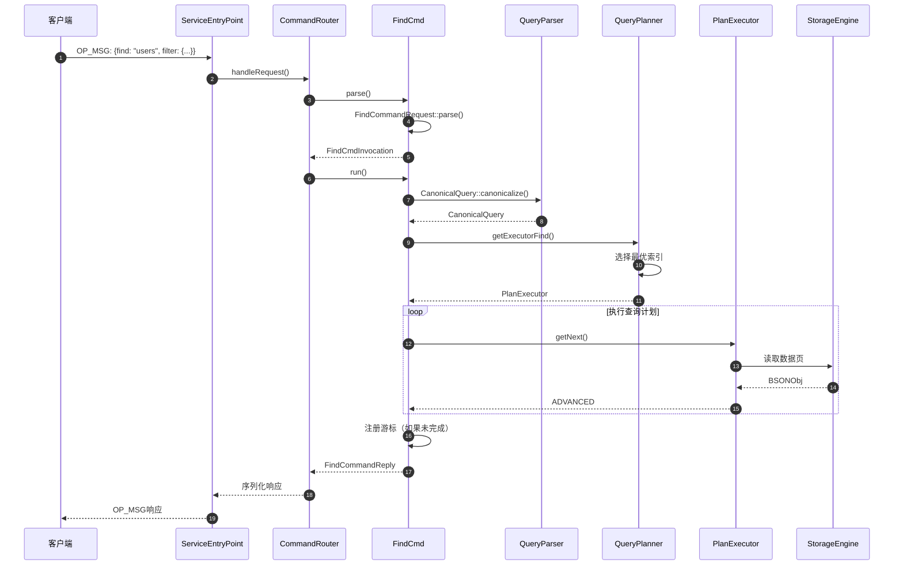
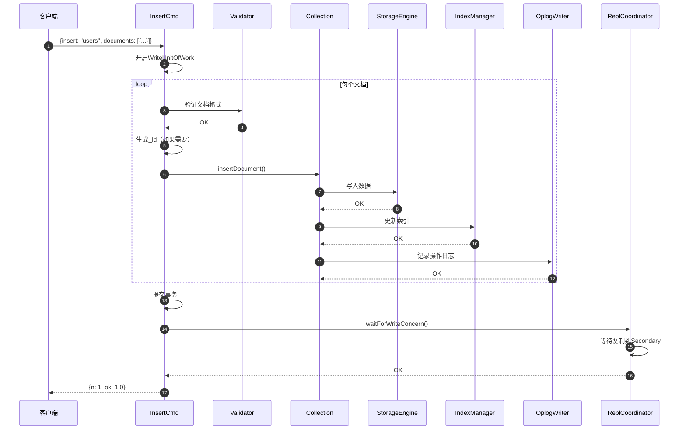
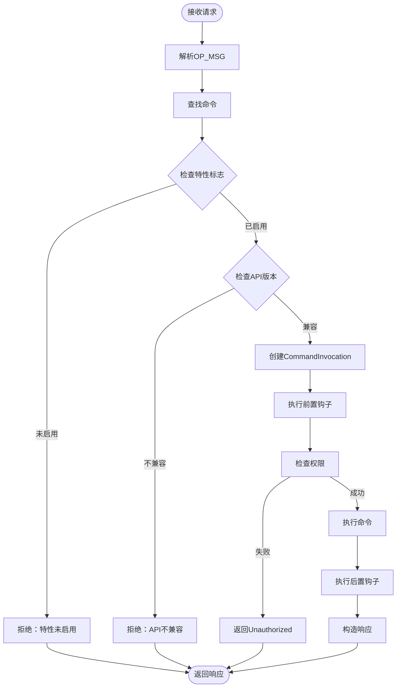

# MongoDB-07-命令处理模块-API

## 1. 模块概述

命令处理模块（`src/mongo/db/commands`）是MongoDB请求处理的核心，负责解析、路由和执行所有数据库命令。该模块包含数百个命令实现，覆盖CRUD操作、DDL操作、管理命令等。

### 1.1 命令分类

- **CRUD命令：** find、insert、update、delete、findAndModify
- **DDL命令：** create、createIndexes、drop、dropIndexes、collMod
- **管理命令：** serverStatus、currentOp、killOp、shutdown
- **复制命令：** replSetGetStatus、replSetInitiate、replSetReconfig
- **分片命令：** moveChunk、split、mergeChunks、shardCollection
- **聚合命令：** aggregate、count、distinct、mapReduce

## 2. 命令框架核心API

### 2.1 Command基类

#### 2.1.1 基本信息

- **名称：** `Command`
- **协议：** OP_MSG
- **作用：** 所有命令的基类，定义命令处理接口

#### 2.1.2 核心数据结构

```cpp
// Command基类定义
class Command {
public:
    // 命令名称
    virtual std::string getName() const = 0;
    
    // 帮助信息
    virtual std::string help() const { return "no help defined"; }
    
    // 命令权限要求
    virtual Status checkAuthForOperation(OperationContext* opCtx,
                                         const DatabaseName& dbName,
                                         const BSONObj& cmdObj) const = 0;
    
    // 是否支持writeConcern
    virtual bool supportsWriteConcern(const BSONObj& cmd) const = 0;
    
    // 是否支持readConcern
    virtual bool supportsReadConcern(const BSONObj& cmdObj,
                                     repl::ReadConcernLevel level) const;
    
    // 命令执行入口
    virtual bool run(OperationContext* opCtx,
                     const DatabaseName& dbName,
                     const BSONObj& cmdObj,
                     BSONObjBuilder& result) = 0;
    
    // 命令路由：本地执行 vs 分片路由
    virtual bool adminOnly() const { return false; }
    virtual bool slaveOk() const { return false; }
    virtual AllowedOnSecondary secondaryAllowed(ServiceContext*) const = 0;
    
protected:
    // 命令注册到全局注册表
    Command(StringData name, std::vector<StringData> aliases = {});
    
private:
    std::string _name;
    std::vector<std::string> _aliases;
};
```

#### 2.1.3 核心字段说明

| 字段 | 类型 | 必填 | 说明 |
|------|------|------|------|
| _name | std::string | 是 | 命令名称，用于命令路由 |
| _aliases | std::vector<std::string> | 否 | 命令别名列表 |
| supportsWriteConcern | bool | 是 | 是否支持写关注 |
| supportsReadConcern | bool | 是 | 是否支持读关注 |
| secondaryAllowed | enum | 是 | 是否允许在Secondary节点执行 |

### 2.2 CommandInvocation类

#### 2.2.1 基本信息

- **名称：** `CommandInvocation`
- **作用：** 命令调用的抽象封装，支持请求解析和执行

#### 2.2.2 核心数据结构

```cpp
class CommandInvocation {
public:
    virtual ~CommandInvocation() = default;
    
    // 执行命令
    virtual void run(OperationContext* opCtx, rpc::ReplyBuilderInterface* reply) = 0;
    
    // 异步执行命令
    virtual Future<void> asyncRun(std::shared_ptr<RequestExecutionContext> rec) {
        // （默认同步执行）
        run(rec->getOpCtx(), rec->getReplyBuilder());
        return Future<void>::makeReady();
    }
    
    // 解释命令执行计划
    virtual void explain(OperationContext* opCtx,
                        ExplainOptions::Verbosity verbosity,
                        rpc::ReplyBuilderInterface* result) {
        // （默认不支持explain）
        uasserted(ErrorCodes::IllegalOperation, 
                 str::stream() << "Command does not support explain");
    }
    
    // 获取命令涉及的namespace
    virtual NamespaceString ns() const = 0;
    
    // 检查权限
    virtual void doCheckAuthorization(OperationContext* opCtx) const = 0;
    
protected:
    const Command* _command;
};
```

#### 2.2.3 字段说明

| 方法 | 返回类型 | 说明 |
|------|---------|------|
| run | void | 同步执行命令，填充响应到reply |
| asyncRun | Future<void> | 异步执行命令，支持非阻塞I/O |
| explain | void | 返回命令执行计划，用于性能分析 |
| ns | NamespaceString | 命令操作的namespace |
| doCheckAuthorization | void | 检查命令权限，失败抛异常 |

## 3. CRUD命令API详解

### 3.1 Find命令

#### 3.1.1 基本信息

- **名称：** `find`
- **协议/方法：** OP_MSG `find`
- **幂等性：** 是（只读操作）
- **作用：** 查询集合中的文档

#### 3.1.2 请求结构体

```cpp
// FindCommandRequest（IDL自动生成）
class FindCommandRequest {
public:
    // 构造函数
    FindCommandRequest(NamespaceString nss) : _nss(std::move(nss)) {}
    
    // 字段访问器
    const NamespaceString& getNamespaceOrUUID() const { return _nss; }
    const BSONObj& getFilter() const { return _filter; }
    const BSONObj& getProjection() const { return _projection; }
    const BSONObj& getSort() const { return _sort; }
    boost::optional<int64_t> getLimit() const { return _limit; }
    boost::optional<int64_t> getSkip() const { return _skip; }
    boost::optional<int64_t> getBatchSize() const { return _batchSize; }
    
private:
    NamespaceString _nss;           // 集合名称
    BSONObj _filter;                // 查询条件
    BSONObj _projection;            // 投影字段
    BSONObj _sort;                  // 排序
    boost::optional<int64_t> _limit;    // 限制返回数量
    boost::optional<int64_t> _skip;     // 跳过数量
    boost::optional<int64_t> _batchSize; // 批量大小
    boost::optional<std::string> _hint;  // 索引提示
    boost::optional<bool> _singleBatch;  // 单批返回
    boost::optional<int> _maxTimeMS;     // 超时时间
};
```

#### 3.1.3 请求字段说明

| 字段 | 类型 | 必填 | 默认 | 约束 | 说明 |
|------|------|------|------|------|------|
| find | string | 是 | - | 有效集合名 | 目标集合名称 |
| filter | object | 否 | {} | 有效查询表达式 | 查询条件 |
| projection | object | 否 | null | 有效投影表达式 | 返回字段 |
| sort | object | 否 | null | 有效排序表达式 | 排序规则 |
| limit | int64 | 否 | 0 | >= 0 | 返回文档数量限制 |
| skip | int64 | 否 | 0 | >= 0 | 跳过文档数量 |
| batchSize | int64 | 否 | 101 | > 0 | 每批返回数量 |
| hint | string/object | 否 | null | 有效索引名或规格 | 强制使用指定索引 |
| maxTimeMS | int | 否 | 0 | >= 0 | 命令超时时间（毫秒） |

#### 3.1.4 响应结构体

```cpp
// FindCommandReply
struct FindCommandReply {
    struct Cursor {
        int64_t id;                      // 游标ID
        NamespaceString ns;              // namespace
        std::vector<BSONObj> firstBatch; // 第一批结果
    };
    
    Cursor cursor;                       // 游标信息
    boost::optional<BSONObj> ok;         // 命令状态
};
```

#### 3.1.5 响应字段说明

| 字段 | 类型 | 必填 | 说明 |
|------|------|------|------|
| cursor.id | int64 | 是 | 游标ID，0表示结果已全部返回 |
| cursor.ns | string | 是 | 结果集的namespace |
| cursor.firstBatch | array | 是 | 第一批查询结果文档 |
| ok | double | 是 | 命令执行状态，1.0表示成功 |

#### 3.1.6 入口函数与关键代码

```cpp
class FindCmd : public Command {
public:
    FindCmd() : Command("find") {}
    
    // 创建CommandInvocation
    std::unique_ptr<CommandInvocation> parse(
        OperationContext* opCtx,
        const OpMsgRequest& request) override {
        
        // 1) 解析请求参数
        auto findRequest = FindCommandRequest::parse(
            IDLParserContext("find"),
            request.body);
        
        // 2) 创建invocation对象
        return std::make_unique<FindCmdInvocation>(
            this, std::move(findRequest), request.getDatabase());
    }
};

class FindCmdInvocation : public CommandInvocation {
public:
    void run(OperationContext* opCtx, 
             rpc::ReplyBuilderInterface* reply) override {
        
        // 1) 权限检查
        doCheckAuthorization(opCtx);
        
        // 2) 获取查询计划
        auto cq = CanonicalQuery::canonicalize(opCtx, _request);
        auto exec = getExecutorFind(opCtx, 
                                    &coll, 
                                    std::move(cq));
        
        // 3) 执行查询
        std::vector<BSONObj> firstBatch;
        PlanExecutor::ExecState state;
        BSONObj obj;
        
        while (firstBatch.size() < batchSize && 
               (state = exec->getNext(&obj, nullptr)) == PlanExecutor::ADVANCED) {
            firstBatch.push_back(obj.getOwned());
        }
        
        // 4) 构造响应
        CursorId cursorId = 0;
        if (state != PlanExecutor::IS_EOF) {
            // 保存游标以供后续getMore使用
            cursorId = CursorManager::get(opCtx)->registerCursor(
                opCtx, 
                std::move(exec),
                _request.getNamespaceOrUUID(),
                /*... 其他参数 ...*/);
        }
        
        // 5) 序列化响应
        FindCommandReply response;
        response.cursor.id = cursorId;
        response.cursor.ns = _request.getNamespaceOrUUID();
        response.cursor.firstBatch = std::move(firstBatch);
        
        reply->setCommandReply(response.toBSON());
    }
    
private:
    const FindCmd* _command;
    FindCommandRequest _request;
    DatabaseName _dbName;
};
```

#### 3.1.7 调用链路分析



#### 3.1.8 上层调用函数

```cpp
// ServiceEntryPoint::handleRequest（请求入口）
Future<DbResponse> ServiceEntryPointShardRole::handleRequest(
    OperationContext* opCtx,
    const Message& message) {
    
    // 1) 解析OP_MSG
    auto opMsgRequest = OpMsgRequest::parse(message);
    
    // 2) 创建操作上下文
    // （省略上下文初始化）
    
    // 3) 路由到命令处理器
    auto command = CommandHelpers::findCommand(opMsgRequest.getCommandName());
    
    // 4) 解析命令
    auto invocation = command->parse(opCtx, opMsgRequest);
    
    // 5) 执行前钩子
    CommandInvocationHooks::get(opCtx)->onBeforeRun(opCtx, invocation.get());
    
    // 6) 执行命令
    auto replyBuilder = rpc::makeReplyBuilder(rpc::Protocol::kOpMsg);
    invocation->run(opCtx, replyBuilder.get());
    
    // 7) 执行后钩子
    CommandInvocationHooks::get(opCtx)->onAfterRun(opCtx, invocation.get(), /*...*/);
    
    // 8) 构造响应
    return DbResponse{replyBuilder->done()};
}
```

#### 3.1.9 异常处理与性能要点

**异常处理：**
- **超时：** 通过`maxTimeMS`设置超时，超时抛`MaxTimeMSExpired`异常
- **权限不足：** `Unauthorized`异常，返回给客户端
- **无效查询：** `BadValue`异常，如无效的正则表达式
- **游标不存在：** `CursorNotFound`异常，getMore命令使用

**性能要点：**
- **索引选择：** 查询优化器根据统计信息选择最优索引
- **批量返回：** 默认batchSize=101，减少网络往返
- **游标缓存：** 复用游标避免重复查询规划
- **投影下推：** 仅返回需要的字段，减少网络传输

### 3.2 Insert命令

#### 3.2.1 基本信息

- **名称：** `insert`
- **协议/方法：** OP_MSG `insert`
- **幂等性：** 否（可通过`ordered:false`实现部分幂等）
- **作用：** 插入一个或多个文档

#### 3.2.2 请求结构体

```cpp
class InsertCommandRequest {
public:
    InsertCommandRequest(NamespaceString nss) : _nss(std::move(nss)) {}
    
    const NamespaceString& getNamespace() const { return _nss; }
    const std::vector<BSONObj>& getDocuments() const { return _documents; }
    bool getOrdered() const { return _ordered; }
    const boost::optional<WriteConcernOptions>& getWriteConcern() const {
        return _writeConcern;
    }
    
private:
    NamespaceString _nss;
    std::vector<BSONObj> _documents;  // 待插入文档列表
    bool _ordered = true;             // 是否有序插入
    boost::optional<WriteConcernOptions> _writeConcern;
};
```

#### 3.2.3 请求字段说明

| 字段 | 类型 | 必填 | 默认 | 约束 | 说明 |
|------|------|------|------|------|------|
| insert | string | 是 | - | 有效集合名 | 目标集合名称 |
| documents | array | 是 | - | 非空数组 | 待插入的文档列表 |
| ordered | bool | 否 | true | - | 是否有序插入，false时错误不中断 |
| writeConcern | object | 否 | {w:1} | 有效写关注 | 写关注级别 |

#### 3.2.4 响应结构体

```cpp
struct InsertCommandReply {
    int64_t n;                              // 成功插入数量
    boost::optional<std::vector<WriteError>> writeErrors;  // 写错误列表
    boost::optional<WriteConcernError> writeConcernError;  // 写关注错误
    double ok;                              // 命令状态
};

struct WriteError {
    int32_t index;       // 错误文档在documents数组中的索引
    int32_t code;        // 错误码
    std::string errmsg;  // 错误信息
};
```

#### 3.2.5 入口函数与关键代码

```cpp
class InsertCmd : public Command {
public:
    InsertCmd() : Command("insert") {}
    
    std::unique_ptr<CommandInvocation> parse(/*...*/) override {
        auto insertRequest = InsertCommandRequest::parse(/*...*/);
        return std::make_unique<InsertCmdInvocation>(
            this, std::move(insertRequest));
    }
};

class InsertCmdInvocation : public CommandInvocation {
public:
    void run(OperationContext* opCtx, 
             rpc::ReplyBuilderInterface* reply) override {
        
        // 1) 获取集合
        AutoGetCollection collection(opCtx, _request.getNamespace(), MODE_IX);
        
        // 2) 开启事务
        WriteUnitOfWork wuow(opCtx);
        
        InsertCommandReply response;
        response.n = 0;
        
        // 3) 逐个插入文档
        for (size_t i = 0; i < _request.getDocuments().size(); ++i) {
            const auto& doc = _request.getDocuments()[i];
            
            try {
                // 3.1) 验证文档格式
                // （省略：检查字段名合法性、嵌套深度等）
                
                // 3.2) 生成_id字段（如果不存在）
                BSONObj insertDoc = doc;
                if (!doc.hasField("_id")) {
                    insertDoc = generateIdIfNeeded(doc);
                }
                
                // 3.3) 调用存储引擎插入
                Status status = collection_internal::insertDocument(
                    opCtx,
                    *collection,
                    InsertStatement(insertDoc),
                    /*nullOpDebug*/ nullptr,
                    /*fromMigrate*/ false);
                
                uassertStatusOK(status);
                
                response.n++;
                
            } catch (const DBException& ex) {
                // 4) 处理错误
                if (!response.writeErrors) {
                    response.writeErrors.emplace();
                }
                response.writeErrors->push_back(WriteError{
                    static_cast<int32_t>(i),
                    ex.code(),
                    ex.reason()
                });
                
                // 有序插入遇到错误立即停止
                if (_request.getOrdered()) {
                    break;
                }
            }
        }
        
        // 5) 写入Oplog
        // （省略：在OpObserver中完成）
        
        // 6) 提交事务
        wuow.commit();
        
        // 7) 等待写关注
        if (auto wc = _request.getWriteConcern()) {
            WriteConcernResult wcResult;
            uassertStatusOK(waitForWriteConcern(opCtx, 
                                               opCtx->getOpTime(),
                                               *wc,
                                               &wcResult));
            if (wcResult.err) {
                response.writeConcernError = wcResult.err;
            }
        }
        
        response.ok = 1.0;
        reply->setCommandReply(response.toBSON());
    }
};
```

#### 3.2.6 调用链路时序图



#### 3.2.7 异常处理与性能要点

**异常处理：**
- **文档过大：** 最大16MB，超过抛`DocumentTooLarge`异常
- **重复键：** `DuplicateKey`异常，包含冲突的_id值
- **集合不存在：** 自动创建集合（除非在事务中）
- **写关注失败：** 数据已写入，但未满足复制要求

**性能要点：**
- **批量插入：** 单次命令插入多个文档，减少网络开销
- **无序插入：** `ordered:false`允许并发插入，提高吞吐
- **索引更新：** 延迟索引更新到事务提交前，减少锁竞争
- **写关注优化：** `w:1`仅等待Primary确认，`w:majority`等待多数节点

## 4. 命令路由与执行框架

### 4.1 命令注册机制

```cpp
// 全局命令注册表
class CommandRegistry {
public:
    static CommandRegistry* get(ServiceContext* service);
    
    // 注册命令
    void registerCommand(std::unique_ptr<Command> command) {
        auto name = command->getName();
        _commands[name] = std::move(command);
        
        // 注册别名
        for (const auto& alias : command->getAliases()) {
            _commands[alias] = _commands[name].get();
        }
    }
    
    // 查找命令
    Command* findCommand(StringData name) const {
        auto it = _commands.find(name);
        return it != _commands.end() ? it->second.get() : nullptr;
    }
    
private:
    StringMap<std::unique_ptr<Command>> _commands;
};

// 命令自动注册（RAII）
struct CommandRegistration {
    CommandRegistration(std::unique_ptr<Command> cmd) {
        GlobalInitializerRegisterer registerer(
            "RegisterCommand_" + cmd->getName(),
            [cmd = std::move(cmd)](ServiceContext* service) mutable {
                CommandRegistry::get(service)->registerCommand(std::move(cmd));
                return Status::OK();
            });
    }
};

// 使用宏简化注册
#define MONGO_REGISTER_COMMAND(CmdClass) \
    static CommandRegistration _reg_##CmdClass{ \
        std::make_unique<CmdClass>() \
    };
```

### 4.2 命令执行管道



### 4.3 命令执行流程详细说明

#### 4.3.1 请求解析阶段

1. **OP_MSG解析：** 将网络字节流解析为结构化的`OpMsgRequest`
2. **命令提取：** 从请求体中提取命令名称（body的第一个字段）
3. **数据库解析：** 提取目标数据库名称（`$db`字段或从namespace推导）

#### 4.3.2 命令路由阶段

1. **命令查找：** 在全局注册表中查找命令实现
2. **特性检查：** 验证命令所需特性是否启用（featureFlag）
3. **API版本检查：** 验证命令是否在客户端声明的API版本中可用
4. **拓扑检查：** 验证当前节点角色（Primary/Secondary/Standalone）是否支持该命令

#### 4.3.3 命令执行阶段

1. **解析参数：** 调用`Command::parse()`创建`CommandInvocation`
2. **前置钩子：** 执行`CommandInvocationHooks::onBeforeRun()`，用于审计等
3. **权限检查：** 调用`CommandInvocation::doCheckAuthorization()`
4. **执行命令：** 调用`CommandInvocation::run()`或`asyncRun()`
5. **后置钩子：** 执行`CommandInvocationHooks::onAfterRun()`

#### 4.3.4 响应构造阶段

1. **序列化结果：** 将命令结果序列化为BSON
2. **添加元数据：** 添加`$clusterTime`、`operationTime`等元数据
3. **压缩（可选）：** 根据客户端支持进行响应压缩
4. **发送响应：** 通过网络层返回客户端

## 5. 命令权限检查

### 5.1 权限模型

MongoDB使用基于角色的访问控制（RBAC）模型：

```cpp
class AuthorizationSession {
public:
    // 检查是否有特定操作的权限
    Status checkAuthForOperation(OperationContext* opCtx,
                                const DatabaseName& dbName,
                                const ActionType& action) {
        // 1) 获取当前用户
        auto user = AuthorizationSession::get(opCtx->getClient())->getAuthenticatedUser();
        
        // 2) 检查用户角色是否包含该操作
        if (user->hasActionsForResource(ResourcePattern::forDatabase(dbName), action)) {
            return Status::OK();
        }
        
        // 3) 返回权限不足错误
        return Status(ErrorCodes::Unauthorized,
                     str::stream() << "not authorized on " << dbName 
                                   << " to execute command");
    }
};
```

### 5.2 常见操作权限

| 操作 | 所需权限 | 默认角色 |
|------|---------|---------|
| find | find | read, readWrite |
| insert | insert | readWrite |
| update | update | readWrite |
| remove | remove | readWrite |
| createIndex | createIndex | dbAdmin |
| dropDatabase | dropDatabase | dbAdmin |
| serverStatus | serverStatus | clusterMonitor |

## 6. 命令性能优化最佳实践

### 6.1 批量操作

```javascript
// 优化前：多次单文档插入
for (let doc of documents) {
    db.collection.insertOne(doc);  // N次网络往返
}

// 优化后：批量插入
db.collection.insertMany(documents);  // 1次网络往返
```

### 6.2 投影优化

```javascript
// 优化前：返回全部字段
db.users.find({age: {$gt: 18}});

// 优化后：仅返回需要的字段
db.users.find({age: {$gt: 18}}, {name: 1, email: 1, _id: 0});
```

### 6.3 游标批量大小

```javascript
// 默认batchSize=101，适合大多数场景
db.collection.find({...});

// 大结果集场景：增大batchSize减少往返
db.collection.find({...}).batchSize(1000);

// 小结果集场景：减小batchSize避免内存浪费
db.collection.find({...}).batchSize(10);
```

---

**文档版本：** v1.0  
**生成时间：** 2025-10-05  
**适用版本：** MongoDB 8.0+

