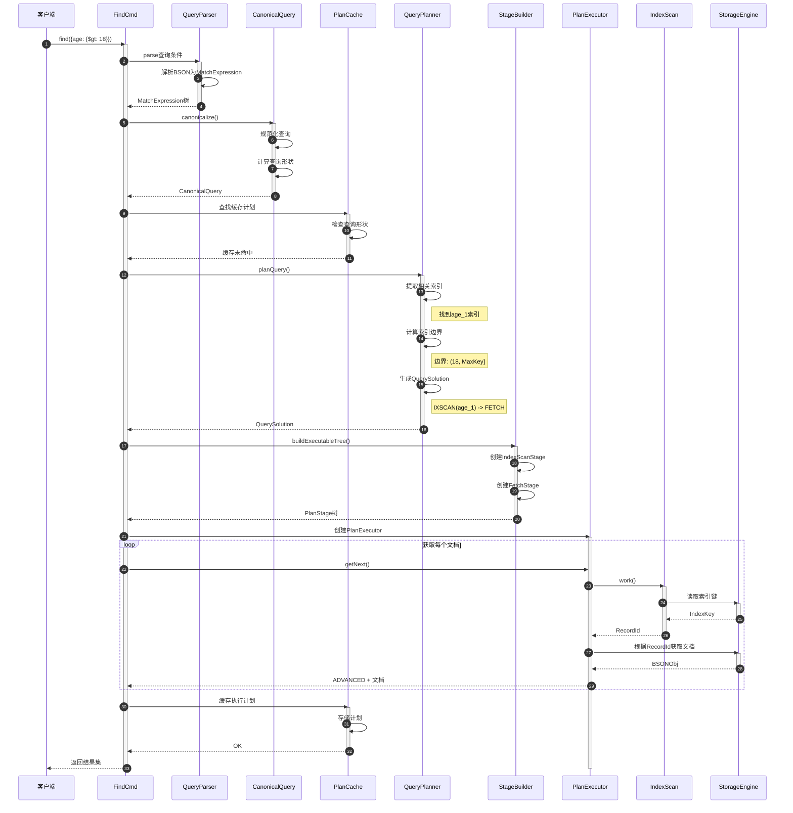
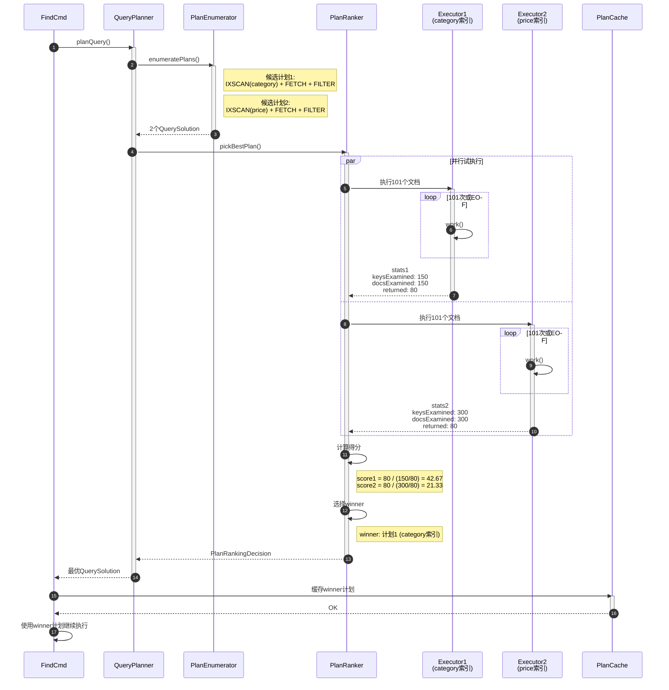
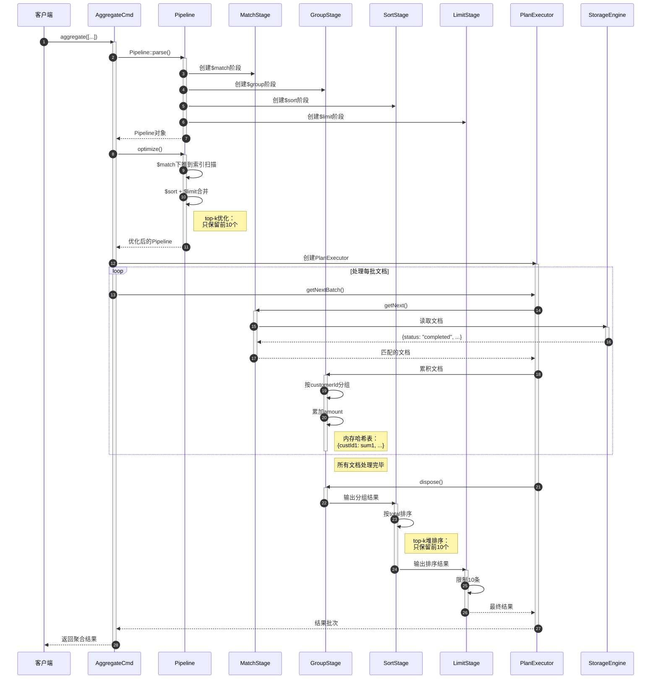

# MongoDB-08-查询引擎模块-时序图

## 1. 典型场景时序图

### 1.1 简单索引查询流程

#### 1.1.1 场景描述

执行一个简单的索引查询：`db.users.find({age: {$gt: 18}})`，假设age字段上有索引。

#### 1.1.2 时序图



#### 1.1.3 流程详细说明

##### 1. 查询解析阶段（步骤1-5）

**步骤1-2：接收查询请求**
- FindCmd接收find命令请求
- 提取查询条件：`{age: {$gt: 18}}`

**步骤3-4：解析为MatchExpression**
- `QueryParser`将BSON条件解析为表达式树
- 创建`GTMatchExpression`节点，字段为"age"，值为18

**步骤5-7：规范化查询**
- 创建`CanonicalQuery`对象
- 规范化表达式树（消除冗余、排序子节点）
- 计算查询形状：`{age: {$gt: "?number"}}`，用于缓存key

##### 2. 计划生成阶段（步骤8-17）

**步骤8-10：检查计划缓存**
- 根据查询形状查找缓存
- 本例中缓存未命中（第一次执行）

**步骤11：开始查询规划**
- 调用`QueryPlanner::plan()`生成执行计划

**步骤12-13：索引选择**
- 扫描集合的所有索引
- 发现`age_1`索引与查询条件匹配
- 评估索引选择性：高（$gt操作符）

**步骤14-15：计算索引边界**
- 根据`$gt: 18`计算边界
- 结果：`(18, MaxKey]`（开区间，不包含18）

**步骤16-17：生成QuerySolution**
- 创建执行计划：`IXSCAN -> FETCH`
- `IXSCAN`：扫描age_1索引，获取RecordId列表
- `FETCH`：根据RecordId获取完整文档

##### 3. 执行阶段（步骤18-35）

**步骤18-21：构建执行树**
- `StageBuilder`根据`QuerySolution`创建`PlanStage`树
- 创建`IndexScanStage`（子节点）
- 创建`FetchStage`（父节点）

**步骤22-23：创建PlanExecutor**
- 封装`PlanStage`树
- 初始化`WorkingSet`（中间结果存储）

**步骤24-33：循环获取文档**
- 每次调用`getNext()`获取一个文档
- `IndexScanStage`从索引读取下一个键
- 调用`StorageEngine`读取索引页
- 返回`RecordId`
- `FetchStage`根据`RecordId`获取完整文档
- 返回`ADVANCED`状态和文档

**步骤34-36：缓存计划**
- 将执行计划存入缓存
- key为查询形状
- value为`QuerySolution`序列化形式

##### 4. 边界条件

1. **缓存命中场景：** 如果缓存命中，跳过步骤11-17，直接使用缓存的计划
2. **多索引场景：** 如果有多个候选索引，生成多个计划并进行试执行排名
3. **覆盖查询：** 如果索引包含所有投影字段，跳过FETCH阶段
4. **EOF处理：** 当`IndexScanStage`返回`IS_EOF`时，停止循环

##### 5. 异常处理

1. **解析失败：** 步骤3-4失败，返回`BadValue`错误给客户端
2. **无索引可用：** 步骤12-13未找到索引，使用`COLLSCAN`（全表扫描）
3. **执行超时：** 步骤24-33中检查`maxTimeMS`，超时抛异常
4. **存储错误：** 步骤27-28读取索引失败，抛存储引擎异常

##### 6. 性能关键点

1. **索引扫描效率：** 步骤27-28，利用B+树的有序性顺序读取
2. **批量获取：** 实际实现中一次获取多个RecordId，减少往返
3. **预读优化：** 存储引擎预读相邻数据页，提高缓存命中率
4. **投影下推：** 如果是覆盖查询，无需步骤31-32

### 1.2 多计划竞争流程

#### 1.2.1 场景描述

执行一个复合查询：`db.products.find({category: "electronics", price: {$lt: 1000}})`，假设有两个索引：`{category: 1}`和`{price: 1}`。

#### 1.2.2 时序图



#### 1.2.3 流程详细说明

##### 1. 计划枚举阶段（步骤1-6）

**步骤1-2：开始查询规划**
- `QueryPlanner`分析查询条件
- 识别两个可用索引：category_1和price_1

**步骤3-6：枚举候选计划**
- `PlanEnumerator`生成多个候选方案
- 计划1：使用category索引，过滤price条件
  - `IXSCAN(category: "electronics")`
  - `FETCH`获取完整文档
  - `FILTER(price < 1000)`应用价格过滤
- 计划2：使用price索引，过滤category条件
  - `IXSCAN(price < 1000)`
  - `FETCH`获取完整文档
  - `FILTER(category == "electronics")`应用分类过滤

##### 2. 计划排名阶段（步骤7-19）

**步骤7-8：开始计划竞争**
- `PlanRanker`接收两个候选计划
- 准备并行试执行

**步骤9-13：并行执行计划1**
- 使用category索引执行
- 扫描150个索引键（electronics分类下的所有商品）
- 获取150个文档
- 过滤后返回80个符合价格条件的文档
- 收集统计信息

**步骤14-18：并行执行计划2**
- 使用price索引执行
- 扫描300个索引键（价格<1000的所有商品）
- 获取300个文档
- 过滤后返回80个符合分类条件的文档
- 收集统计信息

**步骤19-20：计算计划得分**
- 计划1得分：80 / (150/80) ≈ 42.67
  - 扫描效率高：keysExamined/returned = 1.875
- 计划2得分：80 / (300/80) ≈ 21.33
  - 扫描效率低：keysExamined/returned = 3.75

**步骤21-22：选择最优计划**
- 计划1得分更高，选为winner
- 原因：category索引选择性更好，扫描更少的数据

##### 3. 缓存与继续执行（步骤23-27）

**步骤23-26：缓存计划**
- 将winner计划（计划1）存入缓存
- 后续相同形状的查询直接使用

**步骤27：继续执行**
- 使用计划1的executor继续获取剩余文档
- 已执行的101个文档不需要重复执行

##### 4. 关键设计决策

1. **为什么试执行101个文档？**
   - 样本足够大，能反映计划性能
   - 与默认batchSize对齐，避免浪费
   - 执行开销可接受（<100ms大部分场景）

2. **为什么并行执行？**
   - 充分利用多核CPU
   - 减少总等待时间
   - 实际实现可能串行执行，取决于资源

3. **得分计算考虑因素：**
   - 返回文档数（主要指标）
   - 扫描键数与文档数的比例（效率指标）
   - 是否提前完成（EOF奖励）
   - 是否使用索引排序（避免内存排序）

##### 5. 异常与边界

1. **计划全部失败：** 所有计划试执行都抛异常，返回错误
2. **统计信息不准确：** 数据分布变化导致错误选择，通过反馈机制调整
3. **超时中断：** 试执行超过整体查询超时，强制选择第一个计划
4. **单计划场景：** 只有一个候选计划时，跳过排名直接使用

### 1.3 聚合管道执行流程

#### 1.3.1 场景描述

执行聚合管道：
```javascript
db.orders.aggregate([
    {$match: {status: "completed"}},
    {$group: {_id: "$customerId", total: {$sum: "$amount"}}},
    {$sort: {total: -1}},
    {$limit: 10}
])
```

#### 1.3.2 时序图



#### 1.3.3 流程详细说明

##### 1. 管道构建阶段（步骤1-9）

**步骤1-2：接收聚合请求**
- `AggregateCmd`解析aggregate命令
- 提取管道阶段数组

**步骤3-4：解析管道**
- `Pipeline::parse()`解析每个阶段
- 验证阶段顺序合法性

**步骤5-8：创建DocumentSource**
- 为每个阶段创建对应的`DocumentSource`实现
- `$match` → `DocumentSourceMatch`
- `$group` → `DocumentSourceGroup`
- `$sort` → `DocumentSourceSort`
- `$limit` → `DocumentSourceLimit`

##### 2. 管道优化阶段（步骤10-16）

**步骤10-11：开始优化**
- `Pipeline::optimize()`应用优化规则

**步骤12-13：$match下推**
- 将$match条件下推到索引扫描层
- 减少管道输入文档数量
- 优化前：扫描全表 → $match过滤
- 优化后：IXSCAN(status) → 直接获取匹配文档

**步骤14-15：$sort + $limit合并**
- 检测相邻的$sort和$limit阶段
- 合并为top-k优化
- 使用堆排序代替全量排序
- 内存开销：O(k) vs O(n)

##### 3. 管道执行阶段（步骤17-45）

**步骤17-19：创建执行器**
- 创建`PlanExecutor`管理整个管道
- 初始化每个`DocumentSource`

**步骤20-31：处理输入文档**
- 循环调用`getNext()`获取文档
- `MatchStage`从存储引擎读取文档
- 利用下推的索引扫描（status索引）
- 返回匹配的文档

**步骤32-36：分组累积**
- `GroupStage`接收匹配的文档
- 按`$customerId`分组
- 累加每个客户的订单金额
- 使用内存哈希表存储中间结果

**步骤37-39：输出分组结果**
- 所有输入文档处理完毕
- `GroupStage`调用`dispose()`
- 输出所有分组结果

**步骤40-42：排序**
- `SortStage`接收分组结果
- 应用top-k堆排序
- 只保留total最大的10个客户

**步骤43-45：限制输出**
- `LimitStage`确保只输出10条
- 返回最终结果

##### 4. 内存管理

1. **$match阶段：** 无内存累积，流式处理
2. **$group阶段：** 内存哈希表，默认限制100MB
   - 超过限制：溢出到磁盘（允许磁盘使用）
   - 或返回错误（不允许磁盘使用）
3. **$sort阶段：** top-k优化，内存开销O(k)
   - 未优化：全量排序，内存开销O(n)
   - 磁盘排序：超过内存限制时使用外部排序

##### 5. 优化规则总结

1. **阶段重排：**
   - `$match`尽量前置
   - `$project`移除不需要的字段

2. **阶段合并：**
   - `$sort` + `$limit` → top-k
   - 连续的`$match` → 单个复合条件

3. **下推优化：**
   - `$match`下推到索引扫描
   - `$project`下推到覆盖查询
   - `$sort`利用索引顺序

##### 6. 性能要点

1. **索引利用：** $match下推后使用status索引，避免全表扫描
2. **top-k优化：** 堆排序复杂度O(n log k)，远小于全量排序O(n log n)
3. **流式处理：** 尽量避免全量加载到内存
4. **并行聚合（分片环境）：** 在各分片并行执行，最后合并结果

---

**文档版本：** v1.0  
**生成时间：** 2025-10-05  
**适用版本：** MongoDB 8.0+

