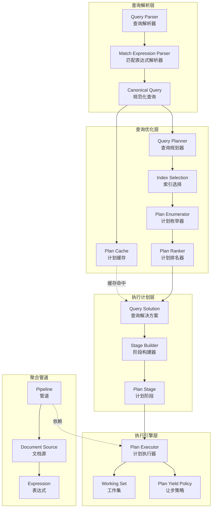

# MongoDB-08-查询引擎模块-概览

## 1. 模块职责

查询引擎模块（`src/mongo/db/query`）是MongoDB处理查询请求的核心，负责将用户的查询语句转换为高效的执行计划，并协调执行过程。该模块实现了完整的查询处理流程，从解析、优化到执行。

### 1.1 主要功能

- **查询解析：** 将BSON查询条件解析为抽象语法树（AST）
- **查询规范化：** 将查询转换为规范化的`CanonicalQuery`对象
- **查询优化：** 选择最优索引和访问路径，生成执行计划
- **执行计划缓存：** 缓存已优化的计划，避免重复优化
- **查询执行：** 协调各个执行算子完成数据读取和处理
- **聚合管道：** 支持复杂的聚合操作（$group、$match、$project等）

### 1.2 输入/输出

**输入：**
- 用户查询请求（`FindCommandRequest`、`AggregateCommandRequest`等）
- 集合元数据（索引信息、统计信息）
- 查询参数（limit、skip、sort、projection等）

**输出：**
- 执行计划（`QuerySolution`）
- 查询结果（BSON文档流）
- 执行统计信息（扫描行数、执行时间等）

### 1.3 上下游依赖

**依赖模块（上游）：**
- base模块：使用`Status`、`StringData`等基础类型
- bson模块：解析BSON查询条件
- db-catalog模块：获取集合和索引元数据
- db-exec模块：使用查询执行算子
- db-storage模块：通过存储接口读取数据

**被依赖模块（下游）：**
- db-commands模块：find、count、distinct等命令调用查询引擎
- db-pipeline模块：聚合管道依赖查询引擎执行
- db-repl模块：复制过程中查询oplog

### 1.4 生命周期

1. **查询创建：** 每个查询请求创建一个`CanonicalQuery`对象
2. **计划生成：** 查询优化器生成多个候选执行计划
3. **计划选择：** 通过试执行（trial run）选择最优计划
4. **计划缓存：** 将选中的计划缓存，供后续相同查询使用
5. **查询执行：** 创建`PlanExecutor`执行计划，返回结果
6. **清理：** 查询完成后释放资源

## 2. 模块架构

### 2.1 架构图



### 2.2 架构说明

#### 2.2.1 图意概述

该架构图展示了MongoDB查询引擎的四层架构：解析层、优化层、计划层和执行层，以及独立的聚合管道子系统。查询请求从上至下经过解析、优化、生成计划、最终执行，整个流程高度模块化，每层职责清晰。

#### 2.2.2 核心组件职责

**查询解析层：**
- `QueryParser`：解析find命令的参数，提取filter、projection、sort等
- `MatchExpressionParser`：将BSON过滤条件解析为`MatchExpression`树
- `CanonicalQuery`：规范化查询表示，统一不同形式的等价查询

**查询优化层：**
- `QueryPlanner`：查询规划器核心，协调整个优化流程
- `IndexSelection`：分析查询条件，选择可用索引
- `PlanEnumerator`：枚举所有可能的查询计划（笛卡尔积）
- `PlanRanker`：对候选计划进行排名，选择最优计划
- `PlanCache`：缓存执行计划，key为查询形状（shape）

**执行计划层：**
- `QuerySolution`：描述查询的完整执行方案，包括访问路径和算子
- `StageBuilder`：根据`QuerySolution`构建执行阶段（Stage）树
- `PlanStage`：执行阶段抽象基类，如IXSCAN、FETCH、SORT等

**执行引擎层：**
- `PlanExecutor`：执行计划的运行时封装，提供统一的执行接口
- `WorkingSet`：存储查询执行过程中的中间结果
- `PlanYieldPolicy`：控制执行过程中的让步，避免长时间持锁

**聚合管道：**
- `Pipeline`：聚合管道容器，包含多个`DocumentSource`阶段
- `DocumentSource`：管道阶段抽象，如$match、$group、$project
- `Expression`：聚合表达式系统，支持复杂的字段计算

#### 2.2.3 关键边界条件

1. **查询解析：**
   - 最大查询深度：100层嵌套
   - 最大查询大小：16MB（受BSON限制）
   - 支持的查询操作符：$eq、$gt、$in、$regex等数十种

2. **索引选择：**
   - 候选索引数量：最多考虑64个索引
   - 复合索引前缀匹配：必须从最左字段开始
   - 索引覆盖查询：projection字段全部在索引中

3. **计划枚举：**
   - 最大候选计划数：1000个（超过则启发式选择）
   - 试执行迭代次数：101个文档（与batchSize对齐）
   - 计划缓存容量：5000个查询形状

4. **执行控制：**
   - 执行超时：通过`maxTimeMS`控制
   - 让步策略：每处理128个文档检查一次中断
   - 内存限制：sort/group操作默认100MB内存限制

#### 2.2.4 异常处理与回退

1. **解析失败：**
   - 无效查询操作符：返回`BadValue`错误
   - 正则表达式语法错误：返回`RegexOptions`错误
   - 类型不匹配：如`$gt`操作符应用于数组

2. **优化失败：**
   - 无可用索引：回退到全表扫描（COLLSCAN）
   - 计划枚举超时：使用启发式算法快速生成计划
   - 计划缓存失效：检测到集合统计信息变化时清空缓存

3. **执行失败：**
   - 超时中断：抛出`MaxTimeMSExpired`异常
   - 内存超限：sort/group超过内存限制时，允许磁盘排序或返回错误
   - 索引损坏：回退到全表扫描并记录错误日志

#### 2.2.5 性能关键点

1. **计划缓存命中率：**
   - 目标命中率：>80%
   - 影响因素：查询模式复杂度、集合变更频率
   - 优化策略：规范化查询形状，合并等价查询

2. **索引选择效率：**
   - 分析时间：<10ms（大部分查询）
   - 统计信息准确性：定期更新索引统计
   - 启发式规则：优先选择唯一索引、高选择性索引

3. **执行效率：**
   - 流式处理：逐批返回结果，减少内存占用
   - 索引扫描：充分利用B+树顺序性
   - 投影下推：尽早剪枝不需要的字段

4. **让步开销：**
   - 让步频率：平衡响应性和吞吐量
   - 锁降级：读锁持有时间最小化
   - 快照管理：定期更新存储引擎快照

#### 2.2.6 容量假设

- 单个查询最大返回文档数：无限制（通过游标分批）
- 单个文档最大大小：16MB
- 聚合管道最大阶段数：1000个
- sort/group内存限制：100MB（可配置）
- 计划缓存条目大小：约1KB/条目

#### 2.2.7 版本兼容与演进

1. **查询语法演进：**
   - 向后兼容：老版本查询语法持续支持
   - 新操作符：通过featureFlag控制启用
   - 废弃操作符：标记deprecated，保留至少两个大版本

2. **执行引擎演进：**
   - SBE引擎：Slot-Based Execution Engine，新一代执行引擎
   - Classic引擎：传统执行引擎，逐步迁移
   - 混合模式：部分查询使用SBE，部分使用Classic

3. **优化器演进：**
   - 基于成本的优化器（CBO）：引入统计信息和成本模型
   - 启发式优化器：传统规则驱动优化器
   - 自适应优化：根据运行时反馈调整计划

## 3. 核心算法

### 3.1 查询规范化算法

#### 3.1.1 算法目的

将不同形式但语义等价的查询转换为统一的规范形式，提高计划缓存命中率。

#### 3.1.2 输入输出

**输入：**
- 原始查询BSON对象
- 查询参数（sort、projection等）

**输出：**
- `CanonicalQuery`对象
- 查询形状（query shape）用于缓存

#### 3.1.3 核心代码

```cpp
// 查询规范化
StatusWith<std::unique_ptr<CanonicalQuery>> 
CanonicalQuery::canonicalize(OperationContext* opCtx,
                             const FindCommandRequest& findCommand) {
    
    // 1) 解析过滤条件为MatchExpression树
    auto statusWithMatcher = MatchExpressionParser::parse(
        findCommand.getFilter(), 
        opCtx->getServiceContext()->getCollatorFactory());
    
    if (!statusWithMatcher.isOK()) {
        return statusWithMatcher.getStatus();
    }
    auto root = std::move(statusWithMatcher.getValue());
    
    // 2) 规范化MatchExpression
    root = MatchExpression::normalize(std::move(root));
    
    // 3) 解析projection
    auto projection = projection_ast::parseAndAnalyze(
        opCtx,
        findCommand.getProjection(),
        root.get(),
        /*... 其他参数 ...*/);
    
    // 4) 解析sort
    auto sortPattern = SortPattern::parse(findCommand.getSort());
    
    // 5) 创建CanonicalQuery对象
    auto cq = std::make_unique<CanonicalQuery>();
    cq->_root = std::move(root);
    cq->_proj = std::move(projection);
    cq->_sortPattern = std::move(sortPattern);
    cq->_findCommand = findCommand;
    
    // 6) 计算查询形状（用于缓存）
    cq->_queryShape = computeQueryShape(*cq);
    
    return {std::move(cq)};
}

// MatchExpression规范化
std::unique_ptr<MatchExpression> 
MatchExpression::normalize(std::unique_ptr<MatchExpression> expr) {
    
    // 1) 递归规范化子节点
    for (size_t i = 0; i < expr->numChildren(); ++i) {
        auto child = expr->releaseChild(i);
        child = normalize(std::move(child));
        expr->resetChild(i, child.release());
    }
    
    // 2) 应用规范化规则
    
    // 规则1：消除冗余的$and/$or
    if (expr->matchType() == AND && expr->numChildren() == 1) {
        return expr->releaseChild(0);
    }
    
    // 规则2：排序$and/$or的子节点（确保等价查询有相同形状）
    if (expr->matchType() == AND || expr->matchType() == OR) {
        sortChildren(expr.get());
    }
    
    // 规则3：合并嵌套的$and/$or
    // {$and: [{$and: [a, b]}, c]} => {$and: [a, b, c]}
    if (expr->matchType() == AND || expr->matchType() == OR) {
        flattenNestedLogicalOp(expr.get());
    }
    
    // 规则4：常量折叠
    // {$and: [{a: 1}, {a: 1}]} => {a: 1}
    if (expr->matchType() == AND) {
        expr = deduplicateChildren(std::move(expr));
    }
    
    return expr;
}
```

#### 3.1.4 算法步骤注释

1. **解析过滤条件：** 将BSON转换为`MatchExpression`树，每个节点表示一个谓词
2. **规范化MatchExpression：** 应用规范化规则，消除等价性差异
3. **排序子节点：** 将$and/$or的子节点按字典序排序
4. **扁平化嵌套：** 合并嵌套的逻辑操作符
5. **去重：** 消除重复的谓词
6. **计算查询形状：** 提取查询的结构特征，忽略常量值

#### 3.1.5 复杂度分析

- **时间复杂度：** O(n log n)，n为MatchExpression节点数（排序开销）
- **空间复杂度：** O(n)，存储MatchExpression树

### 3.2 索引选择算法

#### 3.2.1 算法目的

从所有可用索引中选择最适合查询的索引，最小化查询成本。

#### 3.2.2 输入输出

**输入：**
- `CanonicalQuery`对象
- 集合的所有索引定义
- 索引统计信息

**输出：**
- 候选索引列表
- 每个索引的访问边界（index bounds）

#### 3.2.3 核心代码

```cpp
// 索引选择
std::vector<IndexEntry> 
QueryPlanner::selectRelevantIndexes(const CanonicalQuery& query,
                                   const std::vector<IndexEntry>& allIndexes) {
    
    std::vector<IndexEntry> relevantIndexes;
    
    for (const auto& index : allIndexes) {
        // 1) 检查索引是否与查询相关
        if (isIndexRelevant(query, index)) {
            
            // 2) 计算索引边界
            IndexBounds bounds;
            IndexBoundsBuilder::translate(
                query.root(),
                index.keyPattern,
                &bounds);
            
            // 3) 评估索引选择性
            double selectivity = estimateSelectivity(bounds, index);
            
            // 4) 检查是否支持覆盖查询
            bool coveredQuery = supportsProjection(query, index);
            
            // 5) 检查是否支持排序
            bool providesSort = providesSort(query, index);
            
            // 6) 计算索引得分
            double score = computeIndexScore(
                selectivity,
                coveredQuery,
                providesSort,
                index);
            
            // 7) 添加到候选列表
            IndexEntry candidate = index;
            candidate.bounds = std::move(bounds);
            candidate.score = score;
            relevantIndexes.push_back(std::move(candidate));
        }
    }
    
    // 8) 按得分排序
    std::sort(relevantIndexes.begin(), 
             relevantIndexes.end(),
             [](const IndexEntry& a, const IndexEntry& b) {
                 return a.score > b.score;
             });
    
    return relevantIndexes;
}

// 检查索引是否与查询相关
bool isIndexRelevant(const CanonicalQuery& query, 
                    const IndexEntry& index) {
    
    // 1) 提取查询中引用的字段
    std::set<StringData> queryFields;
    extractQueryFields(query.root(), &queryFields);
    
    // 2) 检查索引前缀是否匹配查询字段
    auto indexFields = index.keyPattern.getFieldNames();
    
    // 至少有一个索引字段在查询条件中
    for (const auto& field : indexFields) {
        if (queryFields.count(field)) {
            return true;
        }
    }
    
    // 3) 检查索引是否能满足排序
    if (query.getSortPattern() && 
        matchesSortPattern(*query.getSortPattern(), index)) {
        return true;
    }
    
    // 4) 检查索引是否能覆盖查询
    if (query.getProj() && 
        canCoverProjection(*query.getProj(), index)) {
        return true;
    }
    
    return false;
}

// 计算索引边界
void IndexBoundsBuilder::translate(const MatchExpression* expr,
                                   const BSONObj& indexKeyPattern,
                                   IndexBounds* out) {
    
    // 1) 对每个索引字段计算边界
    BSONObjIterator it(indexKeyPattern);
    while (it.more()) {
        BSONElement elt = it.next();
        StringData field = elt.fieldNameStringData();
        
        // 2) 查找字段对应的谓词
        const MatchExpression* fieldExpr = 
            findRelevantExpression(expr, field);
        
        if (!fieldExpr) {
            // 没有谓词，边界为全范围[MinKey, MaxKey]
            out->fields.emplace_back(
                OrderedIntervalList(field, {minKeyToMaxKeyInterval()}));
            continue;
        }
        
        // 3) 根据谓词类型计算边界
        OrderedIntervalList oil(field);
        
        switch (fieldExpr->matchType()) {
            case MatchExpression::EQ: {
                // {field: value} => [value, value]
                auto eqExpr = static_cast<const EqualityMatchExpression*>(fieldExpr);
                oil.intervals.push_back(
                    Interval(eqExpr->getData(), eqExpr->getData(), 
                            true, true));
                break;
            }
            
            case MatchExpression::GT: {
                // {field: {$gt: value}} => (value, MaxKey]
                auto gtExpr = static_cast<const GTMatchExpression*>(fieldExpr);
                oil.intervals.push_back(
                    Interval(gtExpr->getData(), maxKey(), 
                            false, true));
                break;
            }
            
            case MatchExpression::LT: {
                // {field: {$lt: value}} => [MinKey, value)
                auto ltExpr = static_cast<const LTMatchExpression*>(fieldExpr);
                oil.intervals.push_back(
                    Interval(minKey(), ltExpr->getData(), 
                            true, false));
                break;
            }
            
            case MatchExpression::IN: {
                // {field: {$in: [v1, v2, v3]}} => [v1,v1] ∪ [v2,v2] ∪ [v3,v3]
                auto inExpr = static_cast<const InMatchExpression*>(fieldExpr);
                for (const auto& value : inExpr->getEqualities()) {
                    oil.intervals.push_back(
                        Interval(value, value, true, true));
                }
                break;
            }
            
            default:
                // 不支持的操作符，使用全范围
                oil.intervals.push_back(minKeyToMaxKeyInterval());
                break;
        }
        
        // 4) 合并重叠的区间
        oil.consolidate();
        out->fields.push_back(std::move(oil));
    }
}
```

#### 3.2.4 算法步骤注释

1. **提取查询字段：** 遍历MatchExpression树，提取所有字段引用
2. **过滤相关索引：** 检查索引前缀是否与查询字段匹配
3. **计算索引边界：** 为每个索引字段计算访问范围
4. **评估选择性：** 根据边界估算需要扫描的键数量
5. **检查覆盖性：** 判断索引是否包含所有投影字段
6. **检查排序支持：** 判断索引顺序是否与排序需求一致
7. **计算索引得分：** 综合多个因素计算索引优先级
8. **排序候选索引：** 按得分从高到低排序

#### 3.2.5 复杂度分析

- **时间复杂度：** O(I × F)，I为索引数量，F为查询字段数
- **空间复杂度：** O(I × K)，K为索引平均字段数

### 3.3 计划排名算法

#### 3.3.1 算法目的

对多个候选执行计划进行试执行，根据实际性能选择最优计划。

#### 3.3.2 核心代码

```cpp
// 计划排名（多计划竞争）
StatusWith<std::unique_ptr<PlanRankingDecision>>
PlanRanker::pickBestPlan(const std::vector<std::unique_ptr<QuerySolution>>& solutions,
                        PlanExecutor* executor) {
    
    const size_t numTrialDocs = 101;  // 试执行文档数
    std::vector<PlanStageStats> stats(solutions.size());
    
    // 1) 并行试执行所有候选计划
    for (size_t i = 0; i < solutions.size(); ++i) {
        auto stage = buildStage(solutions[i].get(), executor->getWorkingSet());
        
        // 执行101个文档
        for (size_t doc = 0; doc < numTrialDocs; ++doc) {
            WorkingSetID id = WorkingSet::INVALID_ID;
            PlanStage::StageState state = stage->work(&id);
            
            if (state == PlanStage::IS_EOF) {
                break;  // 计划提前完成
            }
            
            if (state == PlanStage::ADVANCED) {
                stats[i].docsReturned++;
            }
        }
        
        // 收集统计信息
        stats[i].totalKeysExamined = stage->getStats()->totalKeysExamined;
        stats[i].totalDocsExamined = stage->getStats()->totalDocsExamined;
        stats[i].executionTimeMillis = stage->getStats()->executionTimeMillis;
    }
    
    // 2) 评分并选择最优计划
    size_t bestIdx = 0;
    double bestScore = scoreplan(stats[0]);
    
    for (size_t i = 1; i < solutions.size(); ++i) {
        double score = scorePlan(stats[i]);
        if (score > bestScore) {
            bestScore = score;
            bestIdx = i;
        }
    }
    
    // 3) 返回决策信息
    auto decision = std::make_unique<PlanRankingDecision>();
    decision->winnerIdx = bestIdx;
    decision->stats = std::move(stats);
    decision->scores.resize(solutions.size());
    for (size_t i = 0; i < solutions.size(); ++i) {
        decision->scores[i] = scorePlan(stats[i]);
    }
    
    return {std::move(decision)};
}

// 计划评分
double scorePlan(const PlanStageStats& stats) {
    // 基础得分：返回文档数
    double score = stats.docsReturned;
    
    // 惩罚：扫描了过多的键
    double keysExaminedRatio = 
        static_cast<double>(stats.totalKeysExamined) / 
        std::max(stats.docsReturned, 1);
    if (keysExaminedRatio > 1.0) {
        score /= keysExaminedRatio;
    }
    
    // 惩罚：扫描了过多的文档
    double docsExaminedRatio = 
        static_cast<double>(stats.totalDocsExamined) / 
        std::max(stats.docsReturned, 1);
    if (docsExaminedRatio > 1.0) {
        score /= docsExaminedRatio;
    }
    
    // 奖励：计划提前完成（EOF）
    if (stats.isEOF) {
        score *= 1.5;
    }
    
    // 奖励：使用了索引排序（避免内存排序）
    if (stats.usedIndexSort) {
        score *= 1.2;
    }
    
    return score;
}
```

#### 3.3.3 算法步骤注释

1. **试执行准备：** 为每个候选计划创建执行阶段树
2. **并行执行：** 每个计划执行101个文档（或提前完成）
3. **收集统计：** 记录扫描键数、文档数、执行时间等
4. **计算得分：** 综合多个指标计算计划得分
5. **选择最优：** 返回得分最高的计划

#### 3.3.4 复杂度分析

- **时间复杂度：** O(P × N)，P为计划数量，N为试执行文档数（101）
- **空间复杂度：** O(P)，存储每个计划的统计信息

---

**文档版本：** v1.0  
**生成时间：** 2025-10-05  
**适用版本：** MongoDB 8.0+

