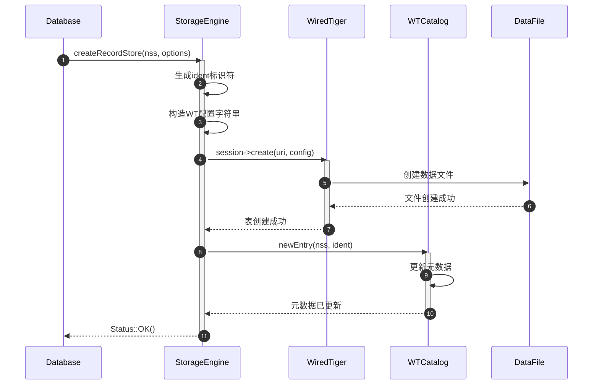
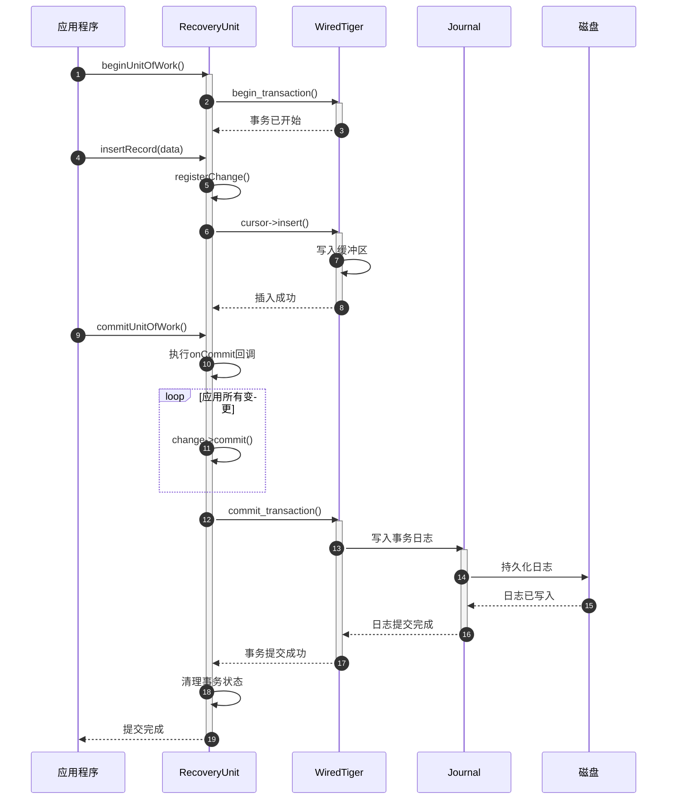
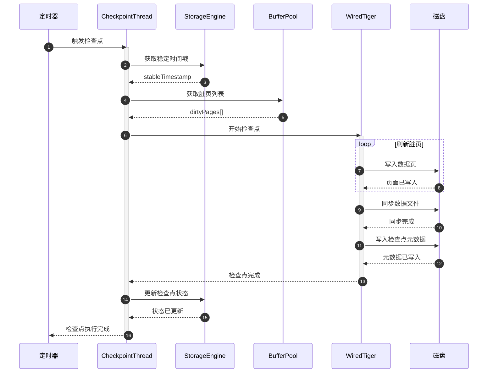

# MongoDB-09-存储引擎模块-API

## 1. 存储引擎核心API

### 1.1 StorageEngine接口

#### 1.1.1 基本信息

- **名称：** `StorageEngine`
- **作用：** 存储引擎的顶层接口，管理数据库和集合
- **实现：** WiredTigerKVEngine（默认）、DevNullKVEngine（测试用）

#### 1.1.2 核心方法结构

```cpp
class StorageEngine {
public:
    // 恢复接口
    virtual void loadCatalog(OperationContext* opCtx,
                            boost::optional<Timestamp> stableTimestamp) = 0;
    
    // 数据库管理
    virtual void listDatabases(std::vector<DatabaseName>* out) const = 0;
    virtual bool supportsCappedCollections() const = 0;
    
    // 集合管理
    virtual Status createRecordStore(OperationContext* opCtx,
                                   const NamespaceString& nss,
                                   const CollectionOptions& options) = 0;
    
    virtual std::unique_ptr<RecordStore> getRecordStore(
        OperationContext* opCtx,
        const NamespaceString& nss,
        StringData ident,
        const CollectionOptions& options) = 0;
    
    // 索引管理
    virtual Status createSortedDataInterface(OperationContext* opCtx,
                                           const CollectionOptions& collOptions,
                                           StringData ident,
                                           const IndexDescriptor* desc) = 0;
    
    virtual std::unique_ptr<SortedDataInterface> getSortedDataInterface(
        OperationContext* opCtx,
        const CollectionOptions& collOptions,
        StringData ident,
        const IndexDescriptor* desc) = 0;
    
    // 事务支持
    virtual std::unique_ptr<RecoveryUnit> newRecoveryUnit() = 0;
    virtual bool supportsDocLocking() const = 0;
    virtual bool supportsDirectoryPerDB() const = 0;
    
    // 检查点管理
    virtual Status createCheckpoint(OperationContext* opCtx) = 0;
    virtual Timestamp getStableTimestamp() const = 0;
    virtual void setStableTimestamp(Timestamp stableTimestamp,
                                   bool force = false) = 0;
    
    // 元数据管理
    virtual void setJournalListener(JournalListener* jl) = 0;
    virtual bool isDurable() const = 0;
    virtual bool isEphemeral() const = 0;
    
    // 备份恢复
    virtual StatusWith<std::vector<std::string>> beginBackup(
        OperationContext* opCtx) = 0;
    virtual void endBackup(OperationContext* opCtx) = 0;
};
```

#### 1.1.3 方法详细说明

| 方法名 | 返回类型 | 参数 | 功能说明 |
|--------|---------|------|---------|
| loadCatalog | void | opCtx, stableTimestamp | 启动时加载数据库目录，恢复集合和索引元数据 |
| createRecordStore | Status | opCtx, nss, options | 创建新的记录存储，用于存储集合文档 |
| getRecordStore | unique_ptr<RecordStore> | opCtx, nss, ident, options | 获取现有记录存储的接口 |
| createSortedDataInterface | Status | opCtx, collOptions, ident, desc | 创建新的索引存储 |
| getSortedDataInterface | unique_ptr<SortedDataInterface> | opCtx, collOptions, ident, desc | 获取现有索引存储的接口 |
| newRecoveryUnit | unique_ptr<RecoveryUnit> | 无 | 创建新的事务恢复单元 |
| createCheckpoint | Status | opCtx | 创建数据一致性检查点 |
| getStableTimestamp | Timestamp | 无 | 获取当前稳定时间戳 |
| setStableTimestamp | void | stableTimestamp, force | 设置稳定时间戳，用于快照读取 |

#### 1.1.4 入口函数与关键代码

```cpp
// WiredTiger存储引擎实现
class WiredTigerKVEngine : public StorageEngine {
public:
    // 创建记录存储
    Status createRecordStore(OperationContext* opCtx,
                           const NamespaceString& nss,
                           const CollectionOptions& options) override {
        
        // 1) 生成唯一标识符
        std::string ident = _createIdent(nss, options);
        
        // 2) 构造WiredTiger表配置
        StringBuilder config;
        config << "type=file,internal_page_max=16k,leaf_page_max=16k";
        
        // 配置压缩
        if (!options.storageEngine.isEmpty()) {
            BSONElement compression = options.storageEngine["wiredTiger"]["configString"];
            if (!compression.eoo()) {
                config << "," << compression.String();
            }
        }
        
        // 3) 创建WiredTiger表
        WT_SESSION* session = _getSession(opCtx);
        std::string uri = "table:" + ident;
        
        int ret = session->create(session, uri.c_str(), config.str().c_str());
        if (ret != 0) {
            return wtRCToStatus(ret, "Failed to create collection");
        }
        
        // 4) 注册到目录
        _catalog->newEntry(opCtx, nss, ident, BSONObj());
        
        return Status::OK();
    }
    
    // 获取记录存储
    std::unique_ptr<RecordStore> getRecordStore(
        OperationContext* opCtx,
        const NamespaceString& nss,
        StringData ident,
        const CollectionOptions& options) override {
        
        // 1) 检查标识符是否存在
        if (!_catalog->isCollectionIdent(ident)) {
            return nullptr;
        }
        
        // 2) 确定集合类型
        if (nss.isOplog()) {
            // Oplog使用特殊的记录存储
            return std::make_unique<WiredTigerRecordStore>(
                this, opCtx, nss.toString(), ident, true, /* isOplog */
                nullptr, /* cappedCallback */);
        } else if (options.capped) {
            // 固定集合
            return std::make_unique<WiredTigerRecordStore>(
                this, opCtx, nss.toString(), ident, false,
                std::make_shared<CappedCallback>(options));
        } else {
            // 普通集合
            return std::make_unique<WiredTigerRecordStore>(
                this, opCtx, nss.toString(), ident, false, nullptr);
        }
    }
    
    // 创建检查点
    Status createCheckpoint(OperationContext* opCtx) override {
        // 1) 获取检查点管理器
        auto checkpointThread = WiredTigerCheckpointThread::get(_conn);
        
        // 2) 触发检查点
        checkpointThread->waitForCheckpointToComplete();
        
        // 3) 验证检查点完成
        WT_SESSION* session = _getSession(opCtx);
        int ret = session->checkpoint(session, "force=true");
        
        if (ret != 0) {
            return wtRCToStatus(ret, "Checkpoint failed");
        }
        
        return Status::OK();
    }

private:
    WT_CONNECTION* _conn;                    // WiredTiger连接
    std::unique_ptr<WiredTigerCatalog> _catalog;  // 目录管理
    std::string _canonicalName;              // 引擎名称
    bool _durable;                          // 是否持久化
};
```

#### 1.1.5 调用链路分析



### 1.2 RecordStore接口

#### 1.2.1 基本信息

- **名称：** `RecordStore`
- **作用：** 记录存储接口，提供文档的CRUD操作
- **实现：** WiredTigerRecordStore

#### 1.2.2 核心方法结构

```cpp
class RecordStore {
public:
    // 插入记录
    virtual Status insertRecord(OperationContext* opCtx,
                               const char* data,
                               int len,
                               RecordId* out) = 0;
    
    virtual Status insertRecords(OperationContext* opCtx,
                                std::vector<Record>* records,
                                const std::vector<Timestamp>& timestamps) = 0;
    
    // 更新记录
    virtual Status updateRecord(OperationContext* opCtx,
                               const RecordId& recordId,
                               const char* data,
                               int len) = 0;
    
    // 删除记录
    virtual Status deleteRecord(OperationContext* opCtx,
                               const RecordId& recordId) = 0;
    
    // 查询记录
    virtual RecordData dataFor(OperationContext* opCtx,
                              const RecordId& recordId) const = 0;
    
    virtual bool findRecord(OperationContext* opCtx,
                           const RecordId& recordId,
                           RecordData* out) const = 0;
    
    // 游标操作
    virtual std::unique_ptr<SeekableRecordCursor> getCursor(
        OperationContext* opCtx, 
        bool forward = true) const = 0;
    
    // 统计信息
    virtual int64_t numRecords(OperationContext* opCtx) const = 0;
    virtual int64_t dataSize(OperationContext* opCtx) const = 0;
    virtual int64_t storageSize(OperationContext* opCtx) const = 0;
    
    // 集合特性
    virtual bool isCapped() const = 0;
    virtual bool isOplog() const = 0;
    virtual void setCappedCallback(CappedCallback* cb) = 0;
    
    // 验证和修复
    virtual Status validate(OperationContext* opCtx,
                           ValidateResults* results,
                           BSONObjBuilder* output) = 0;
    
    virtual void doDeleteRecord(OperationContext* opCtx,
                               const RecordId& recordId) = 0;
};
```

#### 1.2.3 WiredTiger实现的核心代码

```cpp
class WiredTigerRecordStore : public RecordStore {
public:
    WiredTigerRecordStore(WiredTigerKVEngine* kvEngine,
                         OperationContext* opCtx,
                         StringData nss,  
                         StringData ident,
                         bool isOplog,
                         std::shared_ptr<CappedCallback> cappedCallback)
        : _kvEngine(kvEngine),
          _nss(nss.toString()),
          _ident(ident.toString()),
          _isOplog(isOplog),
          _cappedCallback(cappedCallback) {
        
        // 构造表URI
        _tableURI = "table:" + _ident;
        
        // 打开游标以验证表存在
        WT_SESSION* session = _kvEngine->getSession(opCtx);
        WT_CURSOR* cursor;
        int ret = session->open_cursor(session, _tableURI.c_str(), 
                                      nullptr, nullptr, &cursor);
        invariant(ret == 0);
        cursor->close(cursor);
    }
    
    // 插入记录实现
    Status insertRecord(OperationContext* opCtx,
                       const char* data,
                       int len,
                       RecordId* out) override {
        
        // 1) 获取WiredTiger会话
        WiredTigerRecoveryUnit* ru = WiredTigerRecoveryUnit::get(opCtx);
        WT_SESSION* session = ru->getSession();
        
        // 2) 打开游标
        WT_CURSOR* cursor;
        int ret = session->open_cursor(session, _tableURI.c_str(),
                                      nullptr, "overwrite=false", &cursor);
        if (ret != 0) {
            return wtRCToStatus(ret, "Failed to open cursor for insert");
        }
        
        // 3) 生成RecordId
        RecordId recordId;
        if (_isOplog) {
            // Oplog使用时间戳作为RecordId
            recordId = _generateOplogRecordId(opCtx);
        } else {
            // 普通集合使用递增ID
            recordId = _nextRecordId();
        }
        
        // 4) 设置键值
        WiredTigerItem key(recordId.repr());
        cursor->set_key(cursor, key.Get());
        
        WiredTigerItem value(data, len);
        cursor->set_value(cursor, value.Get());
        
        // 5) 插入记录
        ret = WT_OP_CHECK(cursor->insert(cursor));
        cursor->close(cursor);
        
        if (ret != 0) {
            if (ret == WT_DUPLICATE_KEY) {
                return Status(ErrorCodes::DuplicateKey, 
                             "Duplicate key error");
            }
            return wtRCToStatus(ret, "Insert failed");
        }
        
        // 6) 更新统计信息
        _sizeStorer->store(_sizeStorerUri, _numRecords.addAndFetch(1),
                          _dataSize.addAndFetch(len));
        
        // 7) 处理固定集合截断
        if (_cappedCallback) {
            _cappedCallback->notifyOfInsert(opCtx, recordId);
        }
        
        *out = recordId;
        return Status::OK();
    }
    
    // 查找记录实现
    RecordData dataFor(OperationContext* opCtx,
                      const RecordId& recordId) const override {
        
        // 1) 获取会话和游标
        WiredTigerRecoveryUnit* ru = WiredTigerRecoveryUnit::get(opCtx);
        WT_CURSOR* cursor = ru->getCursor(_tableURI, true);
        
        // 2) 设置查找键
        WiredTigerItem key(recordId.repr());
        cursor->set_key(cursor, key.Get());
        
        // 3) 查找记录
        int ret = WT_OP_CHECK(cursor->search(cursor));
        if (ret == WT_NOTFOUND) {
            return RecordData();
        }
        
        invariant(ret == 0);
        
        // 4) 获取数据
        WT_ITEM value;
        ret = cursor->get_value(cursor, &value);
        invariant(ret == 0);
        
        // 5) 返回数据（共享缓冲区）
        return RecordData(static_cast<const char*>(value.data), value.size)
                   .getOwned();
    }
    
    // 删除记录实现
    Status deleteRecord(OperationContext* opCtx,
                       const RecordId& recordId) override {
        
        // 1) 获取当前记录大小（用于统计）
        RecordData oldData = dataFor(opCtx, recordId);
        if (oldData.data() == nullptr) {
            return Status(ErrorCodes::NoSuchKey, "Record not found");
        }
        
        // 2) 获取游标
        WiredTigerRecoveryUnit* ru = WiredTigerRecoveryUnit::get(opCtx);
        WT_CURSOR* cursor = ru->getCursor(_tableURI, true);
        
        // 3) 定位到记录
        WiredTigerItem key(recordId.repr());
        cursor->set_key(cursor, key.Get());
        
        int ret = WT_OP_CHECK(cursor->search(cursor));
        if (ret == WT_NOTFOUND) {
            return Status(ErrorCodes::NoSuchKey, "Record not found");
        }
        
        // 4) 删除记录
        ret = WT_OP_CHECK(cursor->remove(cursor));
        if (ret != 0) {
            return wtRCToStatus(ret, "Delete failed");
        }
        
        // 5) 更新统计信息
        _sizeStorer->store(_sizeStorerUri, 
                          _numRecords.subtractAndFetch(1),
                          _dataSize.subtractAndFetch(oldData.size()));
        
        return Status::OK();
    }

private:
    WiredTigerKVEngine* _kvEngine;
    std::string _nss;
    std::string _ident;
    std::string _tableURI;
    bool _isOplog;
    std::shared_ptr<CappedCallback> _cappedCallback;
    
    mutable AtomicWord<long long> _numRecords;
    mutable AtomicWord<long long> _dataSize;
    std::unique_ptr<SizeStorer> _sizeStorer;
};
```

### 1.3 RecoveryUnit接口

#### 1.3.1 基本信息

- **名称：** `RecoveryUnit`
- **作用：** 事务恢复单元，管理单个事务的生命周期
- **实现：** WiredTigerRecoveryUnit

#### 1.3.2 核心方法结构

```cpp
class RecoveryUnit {
public:
    // 事务控制
    virtual void beginUnitOfWork(OperationContext* opCtx) = 0;
    virtual void commitUnitOfWork() = 0;
    virtual void abortUnitOfWork() = 0;
    
    // 持久性控制
    virtual bool waitUntilDurable(OperationContext* opCtx) = 0;
    virtual bool waitUntilUnjournaledWritesDurable(OperationContext* opCtx) = 0;
    
    // 快照管理
    virtual void abandonSnapshot() = 0;
    virtual Status setTimestamp(Timestamp timestamp) = 0;
    virtual Timestamp getTimestamp() const = 0;
    
    // 更改跟踪
    virtual void registerChange(std::unique_ptr<Change> change) = 0;
    virtual void onRollback(std::function<void()> callback) = 0;
    virtual void onCommit(std::function<void()> callback) = 0;
    
    // 状态查询
    virtual bool inUnitOfWork() const = 0;
    virtual bool hasUncommittedWrites() const = 0;
    
    // 读取状态
    virtual void setReadOnce(bool readOnce) = 0;
    virtual bool getReadOnce() const = 0;
};
```

#### 1.3.3 WiredTiger实现的核心代码

```cpp
class WiredTigerRecoveryUnit : public RecoveryUnit {
public:
    // 开始工作单元（事务）
    void beginUnitOfWork(OperationContext* opCtx) override {
        invariant(!_inUnitOfWork);
        
        // 1) 设置事务状态
        _inUnitOfWork = true;
        _hasUncommittedWrites = false;
        
        // 2) 开始WT事务
        if (!_isTimestamped()) {
            // 无时间戳事务
            int ret = _session->begin_transaction(_session, nullptr);
            invariant(ret == 0);
        } else {
            // 带时间戳事务
            StringBuilder config;
            config << "read_timestamp=" << _commitTimestamp.asULL();
            
            int ret = _session->begin_transaction(_session, config.str().c_str());
            invariant(ret == 0);
        }
        
        // 3) 注册到活跃事务列表
        _kvEngine->registerActiveTransaction(this);
    }
    
    // 提交工作单元
    void commitUnitOfWork() override {
        invariant(_inUnitOfWork);
        
        try {
            // 1) 执行提交前回调
            for (auto& callback : _onCommitCallbacks) {
                callback();
            }
            
            // 2) 应用所有变更
            for (auto& change : _changes) {
                change->commit(boost::none);
            }
            
            // 3) 提交WT事务
            if (_isTimestamped()) {
                StringBuilder config;
                config << "commit_timestamp=" << _commitTimestamp.asULL();
                
                int ret = _session->commit_transaction(_session, 
                                                     config.str().c_str());
                invariant(ret == 0);
            } else {
                int ret = _session->commit_transaction(_session, nullptr);
                invariant(ret == 0);
            }
            
            // 4) 清理状态
            _inUnitOfWork = false;
            _hasUncommittedWrites = false;
            _changes.clear();
            _onCommitCallbacks.clear();
            _onRollbackCallbacks.clear();
            
        } catch (...) {
            // 提交失败，回滚事务
            abortUnitOfWork();
            throw;
        }
    }
    
    // 回滚工作单元
    void abortUnitOfWork() override {
        invariant(_inUnitOfWork);
        
        try {
            // 1) 执行回滚前回调
            for (auto& callback : _onRollbackCallbacks) {
                callback();
            }
            
            // 2) 回滚所有变更
            for (auto it = _changes.rbegin(); it != _changes.rend(); ++it) {
                (*it)->rollback();
            }
            
            // 3) 回滚WT事务
            int ret = _session->rollback_transaction(_session, nullptr);
            invariant(ret == 0);
            
        } catch (...) {
            // 忽略回滚中的异常
        }
        
        // 4) 清理状态
        _inUnitOfWork = false;
        _hasUncommittedWrites = false;
        _changes.clear();
        _onCommitCallbacks.clear();
        _onRollbackCallbacks.clear();
    }
    
    // 设置时间戳
    Status setTimestamp(Timestamp timestamp) override {
        if (_inUnitOfWork) {
            return Status(ErrorCodes::BadValue,
                         "Cannot set timestamp in active transaction");
        }
        
        _commitTimestamp = timestamp;
        _isTimestamped = true;
        
        return Status::OK();
    }
    
    // 等待持久化
    bool waitUntilDurable(OperationContext* opCtx) override {
        // 1) 检查是否需要等待
        if (!_hasUncommittedWrites) {
            return true;
        }
        
        // 2) 强制检查点
        _kvEngine->flushAllFiles(opCtx, true);
        
        // 3) 等待日志同步
        return _kvEngine->waitUntilDurable(opCtx, _commitTimestamp);
    }

private:
    WT_SESSION* _session;
    WiredTigerKVEngine* _kvEngine;
    
    bool _inUnitOfWork = false;
    bool _hasUncommittedWrites = false;
    bool _isTimestamped = false;
    Timestamp _commitTimestamp;
    
    std::vector<std::unique_ptr<Change>> _changes;
    std::vector<std::function<void()>> _onCommitCallbacks;
    std::vector<std::function<void()>> _onRollbackCallbacks;
};
```

## 2. 存储引擎时序图

### 2.1 事务提交流程



### 2.2 检查点执行流程



---

**文档版本：** v1.0  
**生成时间：** 2025-10-05  
**适用版本：** MongoDB 8.0+
