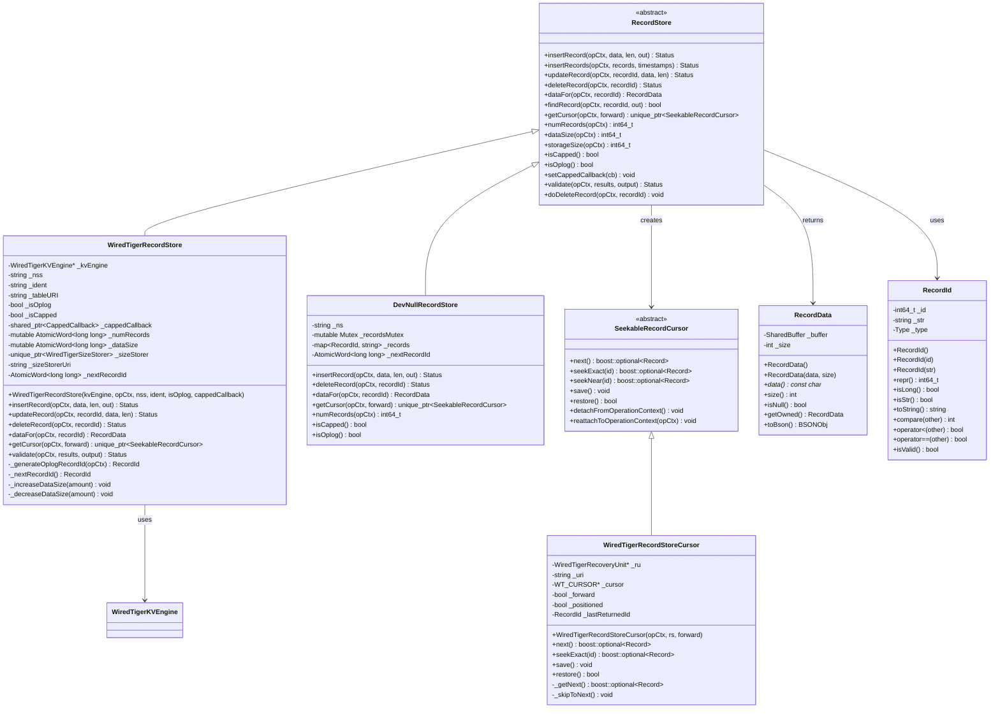

# MongoDB-09-存储引擎模块-数据结构

## 1. 核心数据结构概览

存储引擎模块的数据结构设计实现了MongoDB的持久化存储功能，支持多种存储引擎（主要是WiredTiger）的统一抽象。数据结构按功能分为几个主要层次：

### 1.1 数据结构分类

- **存储引擎抽象层：** StorageEngine、KVEngine
- **记录存储层：** RecordStore、SeekableRecordCursor
- **事务管理层：** RecoveryUnit、Change
- **索引存储层：** SortedDataInterface、SortedDataBuilderInterface
- **目录管理层：** KVCatalog、WiredTigerCatalog
- **缓存管理层：** KVDrop pendings、SizeStorer

## 2. 核心类图

### 2.1 存储引擎抽象层类图

### 2.2 记录存储层类图

### 2.3 事务管理层类图

### 2.4 索引存储层类图

### 2.5 目录管理层类图

## 3. 会话和连接管理

### 3.1 会话管理类图

## 4. 存储特性和配置

### 4.1 存储配置类图

## 5. 字段映射和约束

### 5.1 主要数据结构字段映射

| 数据结构 | 主要字段 | 数据类型 | 约束条件 | 说明 |
|---------|---------|----------|----------|------|
| WiredTigerKVEngine | _conn | WT_CONNECTION* | 非空 | WiredTiger数据库连接 |
| WiredTigerRecordStore | _tableURI | string | 非空，格式"table:xxx" | WiredTiger表URI |
| RecordId | _id | int64_t | > 0或特殊值 | 记录唯一标识符 |
| RecoveryUnit | _inUnitOfWork | bool | - | 是否在事务中 |
| WiredTigerSession | _session | WT_SESSION* | 非空 | WiredTiger会话句柄 |
| CollectionOptions | cappedSize | long long | >= 0 | 固定集合大小限制 |

### 5.2 存储引擎约束

| 组件 | 约束类型 | 限制值 | 说明 |
|------|---------|--------|------|
| WiredTiger | 最大文档大小 | 16MB | 单个BSON文档最大大小 |
| WiredTiger | 最大键长度 | 1024字节 | 索引键最大长度 |
| WiredTiger | 最大集合数 | 无限制 | 理论上无限制 |
| RecordStore | 固定集合大小 | 最小4KB | 固定集合最小大小 |
| Transaction | 最大事务大小 | 256MB | 单个事务最大修改数据量 |
| SessionCache | 最大会话数 | 1000 | 默认最大会话缓存数量 |

### 5.3 内存使用模式

| 组件 | 内存模式 | 默认大小 | 扩展策略 |
|------|---------|----------|----------|
| WiredTiger缓存 | 固定+动态 | 50%可用内存 | 自动调整 |
| 会话缓存 | 对象池 | 按需分配 | LRU淘汰 |
| 游标缓存 | 线程本地 | 按需创建 | 生命周期管理 |
| 元数据缓存 | 固定大小 | 64MB | 不扩展 |

---

**文档版本：** v1.0  
**生成时间：** 2025-10-05  
**适用版本：** MongoDB 8.0+
