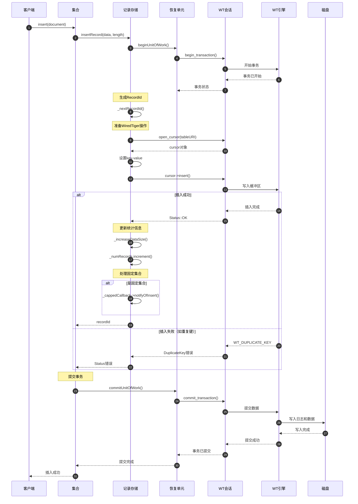
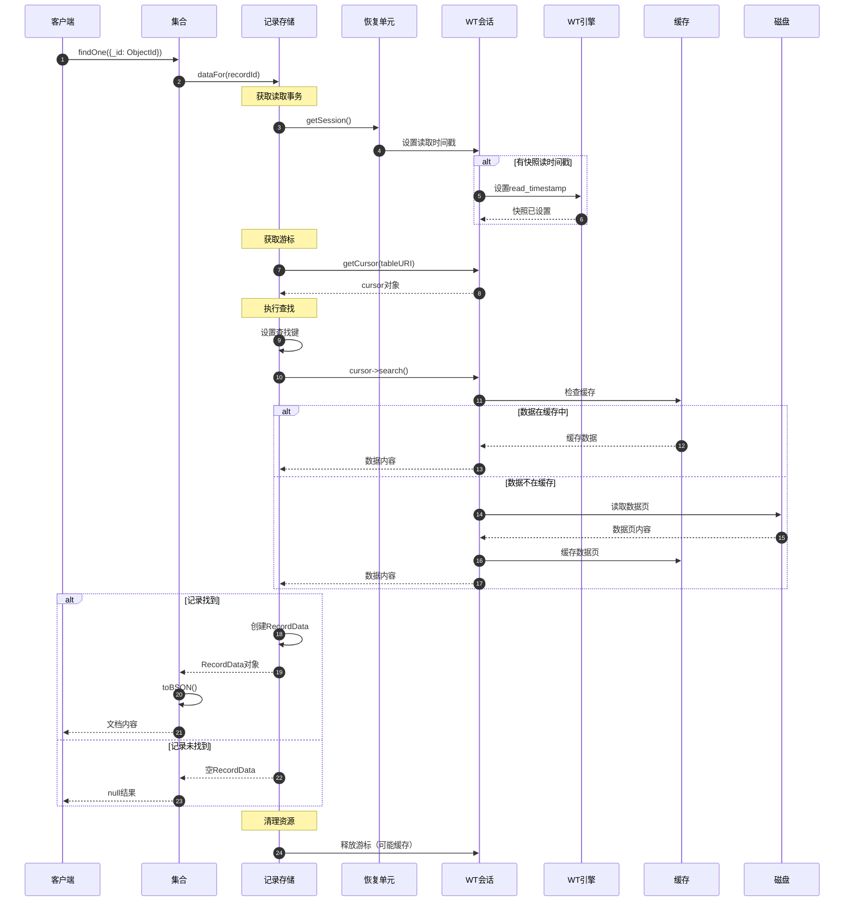
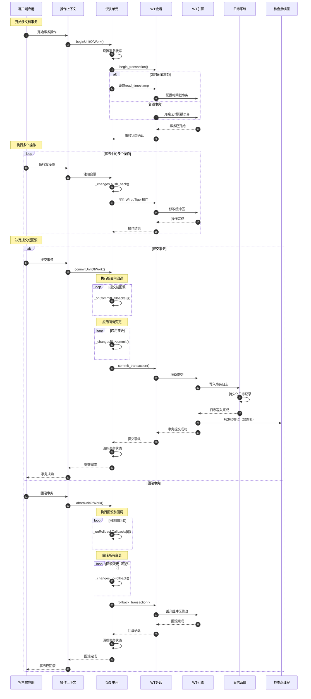
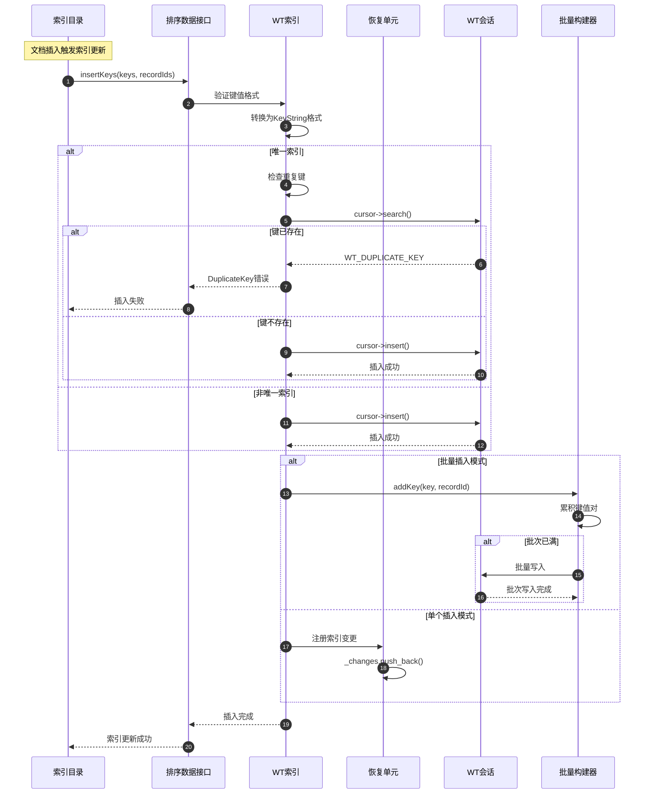
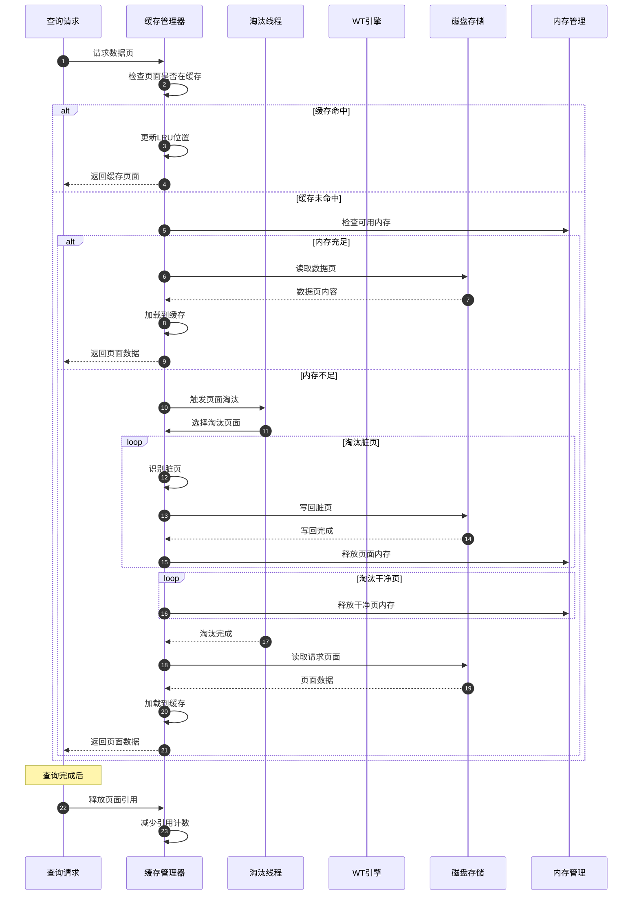
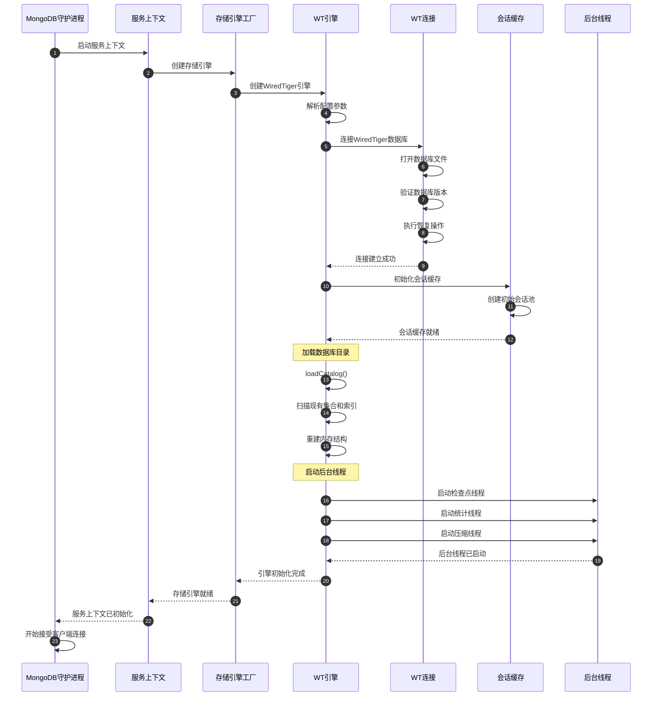

# MongoDB-09-存储引擎模块-时序图

## 1. 时序图概览

存储引擎模块的时序图展示了MongoDB数据持久化的完整流程，包括记录存储、事务管理、检查点创建、索引维护等核心操作。每个时序图都体现了存储引擎与上层组件的协作关系和数据一致性保证。

## 2. 记录存储时序图

### 2.1 记录插入流程



#### 2.1.1 图意概述
记录插入流程展示了从客户端请求到持久化存储的完整路径，包括事务管理、RecordId生成、WiredTiger操作等关键步骤。

#### 2.1.2 关键字段/接口
- `insertRecord`：记录插入主接口
- `beginUnitOfWork`：开始工作单元（事务）
- `_nextRecordId`：生成下一个记录标识符
- `cursor->insert`：WiredTiger游标插入操作

#### 2.1.3 边界条件
- **RecordId生成：** 确保RecordId的唯一性和单调性
- **事务大小：** 单个事务最大256MB数据修改
- **并发插入：** 支持多线程并发插入操作
- **固定集合：** 自动处理固定集合的容量限制

#### 2.1.4 异常与回退
- 重复键错误时自动回滚事务
- 磁盘空间不足时暂停写入
- 会话异常时重新创建会话
- 事务冲突时自动重试

### 2.2 记录查找和读取流程



#### 2.2.1 图意概述
记录查找流程展示了基于RecordId的点查询操作，包括快照读、缓存利用和磁盘I/O优化。

#### 2.2.2 关键字段/接口
- `dataFor`：根据RecordId获取数据
- `getCursor`：获取WiredTiger游标
- `cursor->search`：执行精确查找
- `RecordData`：封装返回的记录数据

#### 2.2.3 边界条件
- **快照一致性：** 使用时间戳确保读取一致性
- **缓存命中率：** 缓存策略影响读取性能
- **游标复用：** 游标缓存减少创建开销
- **并发读取：** 支持多线程并发读取

## 3. 事务管理时序图

### 3.1 事务完整生命周期



#### 3.1.1 图意概述
事务生命周期展示了MongoDB事务的完整处理流程，包括开始、执行、提交/回滚等各个阶段的详细操作。

#### 3.1.2 关键字段/接口
- `beginUnitOfWork`：开始工作单元
- `registerChange`：注册事务变更
- `commitUnitOfWork`：提交工作单元
- `abortUnitOfWork`：中止工作单元

#### 3.1.3 边界条件
- **事务超时：** 默认60秒事务超时时间
- **锁等待：** 最大锁等待时间配置
- **内存限制：** 事务内存使用限制
- **并发控制：** MVCC多版本并发控制

#### 3.1.4 异常与回退
- 事务冲突时自动重试
- 超时时自动回滚
- 系统异常时确保事务一致性
- 死锁检测和解决

## 4. 检查点和持久化时序图

### 4.1 检查点创建流程

```mermaid
sequenceDiagram
    autonumber
    participant Timer as 检查点定时器
    participant CheckpointThread as 检查点线程
    participant WTEngine as WT引擎
    participant ActiveTxns as 活跃事务
    participant BufferPool as 缓冲池
    participant Journal as 日志系统
    participant Disk as 磁盘存储
    
    Timer->>CheckpointThread: 触发定期检查点
    CheckpointThread->>CheckpointThread: 检查检查点条件
    
    alt 满足检查点条件
        CheckpointThread->>WTEngine: 获取当前稳定时间戳
        WTEngine-->>CheckpointThread: stableTimestamp
        
        Note over CheckpointThread: 等待活跃事务完成
        CheckpointThread->>ActiveTxns: 获取活跃事务列表
        ActiveTxns-->>CheckpointThread: activeTxnList
        
        loop 等待旧事务完成
            CheckpointThread->>ActiveTxns: 检查旧事务状态
            alt 有旧于稳定时间戳的事务
                CheckpointThread->>CheckpointThread: 等待一段时间
            else 所有旧事务已完成
                break 可以开始检查点
            end
        end
        
        Note over CheckpointThread: 开始检查点
        CheckpointThread->>WTEngine: 开始检查点操作
        WTEngine->>BufferPool: 获取脏页列表
        BufferPool-->>WTEngine: dirtyPageList
        
        Note over WTEngine: 刷新脏页到磁盘
        loop 处理每个脏页
            WTEngine->>Disk: 写入数据页
            Disk-->>WTEngine: 页面写入完成
        end
        
        Note over WTEngine: 同步元数据
        WTEngine->>Disk: 刷新元数据页
        Disk-->>WTEngine: 元数据已同步
        
        Note over WTEngine: 更新检查点记录
        WTEngine->>Journal: 写入检查点记录
        Journal->>Disk: 持久化检查点信息
        Disk-->>Journal: 检查点记录已写入
        Journal-->>WTEngine: 检查点记录完成
        
        WTEngine->>WTEngine: 更新检查点状态
        WTEngine-->>CheckpointThread: 检查点创建成功
        
        Note over CheckpointThread: 清理旧数据
        CheckpointThread->>WTEngine: 清理旧检查点
        WTEngine->>Disk: 删除过期文件
        Disk-->>WTEngine: 清理完成
        
        CheckpointThread-->>Timer: 检查点完成
        
    else 不满足检查点条件
        CheckpointThread-->>Timer: 跳过此次检查点
    end
```

#### 4.1.1 图意概述
检查点创建流程确保数据的一致性持久化，通过协调活跃事务和缓冲区管理实现数据的定期持久化。

#### 4.1.2 关键字段/接口
- `stableTimestamp`：稳定时间戳标识
- `dirtyPageList`：脏页列表管理
- `checkpointRecord`：检查点元数据记录
- `cleanupOldData`：旧数据清理机制

#### 4.1.3 边界条件
- **时间间隔：** 默认60秒检查点间隔
- **数据量阈值：** 脏数据达到一定量时触发
- **事务等待：** 最大等待活跃事务完成时间
- **磁盘空间：** 确保有足够空间写入检查点

### 4.2 数据恢复和启动流程

```mermaid
sequenceDiagram
    autonumber
    participant Startup as 启动进程
    participant WTEngine as WT引擎
    parameter Catalog as 目录管理
    participant Journal as 日志系统
    participant Recovery as 恢复进程
    participant Collections as 集合
    participant Indexes as 索引
    
    Startup->>WTEngine: 初始化存储引擎
    WTEngine->>WTEngine: 连接WiredTiger
    
    Note over WTEngine: 检查数据库状态
    WTEngine->>WTEngine: 检查上次关闭状态
    
    alt 需要恢复
        WTEngine->>Journal: 检查日志完整性
        Journal-->>WTEngine: 日志状态报告
        
        WTEngine->>Recovery: 开始恢复过程
        Recovery->>Journal: 读取未应用的日志
        Journal-->>Recovery: 日志条目列表
        
        Note over Recovery: 重放日志条目
        loop 处理每个日志条目
            Recovery->>Recovery: 解析操作类型
            
            alt 数据修改操作
                Recovery->>Collections: 重放数据变更
                Collections-->>Recovery: 变更已应用
            else 索引修改操作
                Recovery->>Indexes: 重放索引变更
                Indexes-->>Recovery: 变更已应用
            else 元数据操作
                Recovery->>Catalog: 重放元数据变更
                Catalog-->>Recovery: 变更已应用
            end
        end
        
        Recovery->>WTEngine: 恢复完成
        WTEngine->>WTEngine: 验证数据一致性
    else 正常关闭
        WTEngine->>WTEngine: 直接加载数据
    end
    
    Note over WTEngine: 加载目录信息
    WTEngine->>Catalog: loadCatalog(stableTimestamp)
    Catalog->>Catalog: 扫描元数据表
    
    loop 恢复每个集合
        Catalog->>Collections: 重建集合对象
        Collections->>Collections: 验证集合完整性
        Collections-->>Catalog: 集合就绪
    end
    
    loop 恢复每个索引
        Catalog->>Indexes: 重建索引对象
        Indexes->>Indexes: 验证索引完整性
        Indexes-->>Catalog: 索引就绪
    end
    
    Catalog-->>WTEngine: 目录加载完成
    
    Note over WTEngine: 设置运行状态
    WTEngine->>WTEngine: 启动后台线程
    WTEngine->>WTEngine: 开始接受连接
    WTEngine-->>Startup: 存储引擎就绪
    
    Startup-->>Startup: MongoDB启动完成
```

#### 4.2.1 图意概述
数据恢复流程确保MongoDB在意外关闭后能够正确恢复到一致性状态，通过日志重放和数据验证保证数据完整性。

#### 4.2.2 关键字段/接口
- `loadCatalog`：加载数据库目录
- `replayJournal`：重放日志条目
- `verifyIntegrity`：验证数据完整性
- `rebuildObjects`：重建内存对象

#### 4.2.3 边界条件
- **恢复时间：** 恢复时间与日志量成正比
- **内存使用：** 恢复过程的内存峰值
- **并发限制：** 恢复期间不接受写入
- **错误处理：** 恢复失败时的处理策略

## 5. 索引存储时序图

### 5.1 索引数据插入流程



#### 5.1.1 图意概述
索引数据插入流程展示了文档变更时索引的同步更新机制，包括唯一性检查和批量优化。

#### 5.1.2 关键字段/接口
- `insertKeys`：批量插入索引键
- `KeyString`：索引键的序列化格式
- `DuplicateKey`：重复键检测
- `BulkBuilder`：批量构建优化

#### 5.1.3 边界条件
- **键长度限制：** 索引键最大1024字节
- **批量大小：** 批量插入的最优大小
- **并发插入：** 多线程并发索引更新
- **事务一致性：** 索引与文档的事务一致性

## 6. 缓存和内存管理时序图

### 6.1 缓存页面管理流程



#### 6.1.1 图意概述
缓存页面管理展示了WiredTiger缓存系统的工作机制，包括LRU策略、页面淘汰和内存管理。

#### 6.1.2 关键字段/接口
- `cacheHit`：缓存命中检查
- `evictionThread`：页面淘汰线程
- `dirtyPageWriteback`：脏页写回机制
- `referenceCount`：页面引用计数

#### 6.1.3 边界条件
- **缓存大小：** 默认50%可用内存作为缓存
- **淘汰阈值：** 内存使用达到80%时开始淘汰
- **写回策略：** 脏页的写回时机和批量大小
- **并发访问：** 多线程缓存访问的同步机制

## 7. 存储引擎启动关闭时序图

### 7.1 存储引擎初始化流程



#### 7.1.1 图意概述
存储引擎初始化展示了MongoDB启动时存储子系统的完整初始化过程，包括连接建立、目录加载和后台线程启动。

#### 7.1.2 关键字段/接口
- `createStorageEngine`：存储引擎工厂方法
- `connectWiredTiger`：建立WiredTiger连接
- `loadCatalog`：加载数据库目录
- `startBackgroundThreads`：启动后台服务线程

#### 7.1.3 边界条件
- **启动超时：** 存储引擎初始化超时时间
- **恢复时间：** 数据恢复所需时间
- **内存分配：** 启动时的内存需求
- **文件权限：** 数据文件访问权限检查

### 7.2 存储引擎优雅关闭流程

```mermaid
sequenceDiagram
    autonumber
    participant Signal as 关闭信号
    participant MongoD as MongoDB守护进程
    participant ServiceContext as 服务上下文
    participant WTEngine as WT引擎
    participant ActiveTxns as 活跃事务
    participant BackgroundThreads as 后台线程
    participant SessionCache as 会话缓存
    participant WTConnection as WT连接
    
    Signal->>MongoD: 接收关闭信号(SIGTERM)
    MongoD->>ServiceContext: 开始优雅关闭
    
    Note over MongoD: 停止接受新连接
    MongoD->>MongoD: 停止监听端口
    
    ServiceContext->>WTEngine: 开始存储引擎关闭
    
    Note over WTEngine: 等待活跃事务完成
    WTEngine->>ActiveTxns: 获取活跃事务列表
    ActiveTxns-->>WTEngine: 活跃事务数量
    
    loop 等待事务完成
        alt 仍有活跃事务
            WTEngine->>WTEngine: 等待一段时间
            WTEngine->>ActiveTxns: 重新检查
        else 所有事务已完成
            break 可以继续关闭
        end
    end
    
    Note over WTEngine: 停止后台线程
    WTEngine->>BackgroundThreads: 停止检查点线程
    WTEngine->>BackgroundThreads: 停止统计线程
    WTEngine->>BackgroundThreads: 停止压缩线程
    BackgroundThreads-->>WTEngine: 后台线程已停止
    
    Note over WTEngine: 执行最终检查点
    WTEngine->>WTEngine: createCheckpoint()
    WTEngine->>WTEngine: 刷新所有脏数据
    WTEngine->>WTEngine: 同步元数据
    
    Note over WTEngine: 关闭会话和连接
    WTEngine->>SessionCache: 关闭所有会话
    SessionCache->>SessionCache: 释放会话资源
    SessionCache-->>WTEngine: 会话缓存已清理
    
    WTEngine->>WTConnection: 关闭WiredTiger连接
    WTConnection->>WTConnection: 刷新缓冲区
    WTConnection->>WTConnection: 关闭数据库文件
    WTConnection-->>WTEngine: 连接已关闭
    
    WTEngine-->>ServiceContext: 存储引擎已关闭
    ServiceContext-->>MongoD: 服务上下文已清理
    
    MongoD->>MongoD: 退出进程
```

#### 7.2.1 图意概述
优雅关闭流程确保MongoDB在收到关闭信号时能够安全地保存所有数据并释放资源，避免数据丢失和文件损坏。

#### 7.2.2 关键字段/接口
- `gracefulShutdown`：优雅关闭主流程
- `waitForActiveTxns`：等待活跃事务完成
- `finalCheckpoint`：最终数据检查点
- `cleanupResources`：资源清理过程

#### 7.2.3 边界条件
- **关闭超时：** 强制关闭前的最大等待时间
- **事务等待：** 等待活跃事务完成的超时
- **数据同步：** 确保所有数据已持久化
- **资源清理：** 完整的内存和文件句柄清理

## 8. 版本兼容与演进

### 8.1 版本兼容性说明

1. **存储格式演进：**
   - WiredTiger 3.0+：支持加密和压缩
   - WiredTiger 4.0+：改进的检查点机制
   - WiredTiger 10.0+：增强的并发性能
   - MongoDB 5.0+：时间序列集合优化

2. **API兼容性：**
   - 向后兼容的存储引擎接口
   - 渐进式特性启用机制
   - 配置参数的兼容性处理

3. **性能优化历史：**
   - 缓存算法优化
   - 检查点性能提升
   - 并发控制改进
   - 压缩算法升级

---

**文档版本：** v1.0  
**生成时间：** 2025-10-05  
**适用版本：** MongoDB 8.0+
