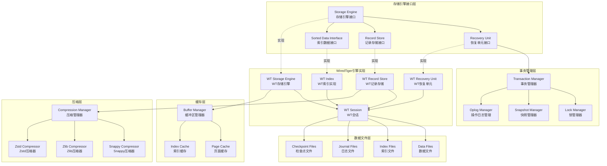
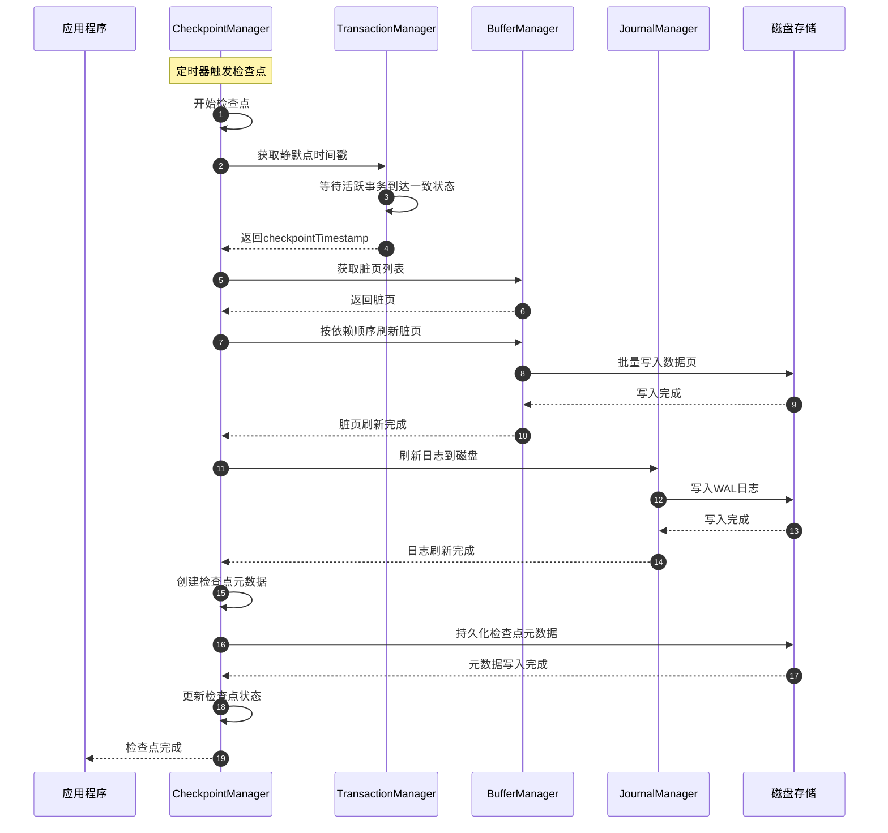

# MongoDB-09-存储引擎模块-概览

## 1. 模块职责

存储引擎模块（`src/mongo/db/storage`）是MongoDB数据持久化的核心，提供统一的存储抽象接口，支持多种存储引擎实现。该模块负责数据的增删改查、事务管理、索引维护和崩溃恢复。

### 1.1 主要功能

- **存储抽象：** 提供StorageEngine接口，支持插件化存储引擎
- **事务管理：** 实现ACID事务语义，支持多文档事务
- **恢复单元：** RecoveryUnit管理事务生命周期和回滚
- **记录存储：** RecordStore接口管理文档的增删改查
- **索引存储：** SortedDataInterface接口管理索引数据
- **检查点：** Checkpoint机制确保数据持久性
- **快照隔离：** 提供时间点一致性读取

### 1.2 输入/输出

**输入：**
- CRUD操作请求
- 事务控制指令
- 索引构建请求
- 检查点触发信号

**输出：**
- 持久化数据文件
- 事务提交/回滚结果
- 数据恢复状态
- 存储统计信息

### 1.3 上下游依赖

**依赖模块（上游）：**
- platform模块：文件系统和内存管理
- util模块：并发控制和工具函数
- base模块：错误处理和基础类型

**被依赖模块（下游）：**
- db-catalog模块：集合和索引元数据管理
- db-exec模块：查询执行需要读取数据
- db-repl模块：复制需要oplog持久化
- db-commands模块：命令执行需要数据存储

### 1.4 生命周期

1. **初始化阶段：** 加载存储引擎，恢复数据文件
2. **运行阶段：** 处理读写请求，管理事务
3. **检查点：** 定期刷新数据到磁盘
4. **恢复阶段：** 崩溃后从检查点和日志恢复
5. **关闭阶段：** 完成最终检查点，关闭数据文件

## 2. 模块架构

### 2.1 架构图



### 2.2 架构说明

#### 2.2.1 图意概述

该架构图展示了MongoDB存储引擎的六层架构：接口层、事务层、实现层、文件层、缓存层和压缩层。存储引擎接口层定义统一API，WiredTiger作为默认实现，通过事务管理确保ACID特性，最终数据持久化到磁盘文件。

#### 2.2.2 核心组件职责

**存储引擎接口层：**
- `StorageEngine`：存储引擎的顶层接口，管理数据库和集合
- `RecoveryUnit`：事务恢复单元，管理单个事务的生命周期
- `RecordStore`：记录存储接口，提供文档的CRUD操作
- `SortedDataInterface`：有序数据接口，用于索引的维护和查询

**事务管理层：**
- `TransactionManager`：协调多文档事务，实现两阶段提交
- `LockManager`：管理资源锁，避免并发冲突
- `SnapshotManager`：管理数据快照，提供时间点一致性
- `OplogManager`：管理操作日志，用于复制和恢复

**WiredTiger引擎实现：**
- `WTStorageEngine`：WiredTiger存储引擎的具体实现
- `WTRecoveryUnit`：基于WiredTiger事务的恢复单元
- `WTRecordStore`：基于WiredTiger的记录存储
- `WTIndex`：基于WiredTiger的索引实现
- `WTSession`：WiredTiger会话，管理连接和游标

**数据文件层：**
- `DataFiles`：存储集合数据的文件
- `IndexFiles`：存储索引数据的文件
- `JournalFiles`：预写日志文件，确保持久性
- `CheckpointFiles`：检查点文件，支持崩溃恢复

**缓存层：**
- `BufferManager`：缓冲区管理，协调内存使用
- `PageCache`：数据页缓存，减少磁盘I/O
- `IndexCache`：索引页缓存，加速索引查询

**压缩层：**
- `CompressionManager`：压缩管理，选择合适的压缩算法
- `SnappyCompressor`：Snappy压缩器，速度优先
- `ZlibCompressor`：Zlib压缩器，平衡压缩率和速度
- `ZstdCompressor`：Zstd压缩器，高压缩率

#### 2.2.3 关键边界条件

1. **事务隔离级别：**
   - 默认：读已提交（Read Committed）
   - 可选：快照隔离（Snapshot Isolation）
   - MongoDB事务：多文档ACID事务

2. **锁粒度：**
   - 意向锁：数据库级别
   - 集合锁：集合级别  
   - 文档锁：WiredTiger提供（行级锁）
   - 死锁检测：超时机制

3. **缓存大小：**
   - 默认：可用内存的50%
   - 最小：256MB
   - 最大：无限制（受系统内存约束）
   - 淘汰策略：LRU

4. **检查点频率：**
   - 默认：60秒或2GB数据变更
   - 可配置：checkpointSizeMB参数
   - 强制：关闭时必须完成检查点

#### 2.2.4 异常处理与回退

1. **事务回滚：**
   - 自动回滚：事务执行失败时
   - 手动回滚：用户调用abort
   - 级联回滚：事务冲突时回滚较新事务
   - 部分回滚：嵌套事务的部分回滚

2. **崩溃恢复：**
   - 检查点恢复：从最近检查点开始
   - 日志重放：应用检查点后的WAL日志
   - 一致性检查：验证数据完整性
   - 修复模式：数据损坏时的修复选项

3. **磁盘故障：**
   - 副本集：从其他节点恢复数据
   - 备份恢复：从备份文件恢复
   - 部分恢复：跳过损坏的数据页
   - 数据验证：检测和报告数据损坏

4. **内存不足：**
   - 缓存淘汰：释放最少使用的页面
   - 操作降级：禁用某些内存密集操作
   - 错误返回：内存分配失败时返回错误
   - 重试机制：等待内存释放后重试

#### 2.2.5 性能关键点

1. **I/O优化：**
   - 顺序写入：日志和数据文件顺序写
   - 批量操作：多个写操作合并
   - 预读：预测性数据预读
   - 异步I/O：非阻塞磁盘操作

2. **缓存优化：**
   - 命中率：目标>95%
   - 预热：启动时预加载热点数据
   - 分层：频繁数据保留在内存
   - 压缩：内存中数据压缩存储

3. **并发优化：**
   - 无锁数据结构：减少锁竞争
   - 细粒度锁：降低锁持有时间
   - 读写分离：读操作不阻塞写操作
   - 并行恢复：多线程并行恢复

4. **压缩优化：**
   - 自适应：根据数据特征选择算法
   - 流式压缩：边读边解压
   - 预压缩：索引构建时预压缩
   - 缓存压缩数据：避免重复压缩

#### 2.2.6 容量假设

- 单个集合大小：无限制（受磁盘空间约束）
- 单个文档大小：16MB
- 并发事务数：数万个
- 索引数量：每集合最多64个
- 数据库数量：无限制

#### 2.2.7 版本兼容与演进

1. **WiredTiger版本：**
   - MongoDB集成特定版本的WiredTiger
   - 向后兼容：旧数据文件格式
   - 升级：滚动升级支持

2. **数据格式演进：**
   - 版本标识：数据文件包含格式版本
   - 转换工具：旧格式到新格式转换
   - 混合模式：支持同时读取多种格式

3. **API演进：**
   - 向后兼容：老接口继续支持
   - 废弃通知：逐步淘汰老接口
   - 新特性：通过featureFlag控制

## 3. 核心算法

### 3.1 MVCC快照隔离算法

#### 3.1.1 算法目的

实现多版本并发控制（MVCC），为每个事务提供一致的数据视图，避免读写冲突。

#### 3.1.2 输入输出

**输入：**
- 事务开始时间戳
- 读取请求（记录ID）
- 写入请求（记录ID和数据）

**输出：**
- 时间点一致的数据快照
- 事务提交/回滚结果

#### 3.1.3 核心代码

```cpp
// 快照管理器核心实现
class SnapshotManager {
public:
    // 创建快照
    Timestamp createSnapshot(OperationContext* opCtx) {
        // 1) 获取当前提交时间戳
        Timestamp readTimestamp = _getStableTimestamp();
        
        // 2) 创建快照对象
        auto snapshot = std::make_shared<Snapshot>(readTimestamp);
        
        // 3) 注册到活跃快照列表
        stdx::lock_guard<stdx::mutex> lock(_mutex);
        _activeSnapshots[readTimestamp] = snapshot;
        
        // 4) 设置到操作上下文
        shard_role_details::getRecoveryUnit(opCtx)->setTimestamp(readTimestamp);
        
        return readTimestamp;
    }
    
    // 读取数据（基于快照）
    StatusWith<BSONObj> readRecord(OperationContext* opCtx, 
                                   RecordId recordId) {
        // 1) 获取快照时间戳
        Timestamp snapTs = shard_role_details::getRecoveryUnit(opCtx)
                              ->getTimestamp();
        
        // 2) 查找记录的版本链
        auto versionChain = _getVersionChain(recordId);
        
        // 3) 找到快照时间戳之前的最新版本
        for (const auto& version : versionChain) {
            if (version.commitTimestamp <= snapTs && 
                !version.isDeleted()) {
                return version.data;
            }
        }
        
        // 4) 记录不存在或在快照时间之后创建
        return Status(ErrorCodes::NoSuchKey, "Record not found in snapshot");
    }
    
    // 写入数据（创建新版本）
    Status writeRecord(OperationContext* opCtx,
                      RecordId recordId,
                      const BSONObj& data) {
        
        // 1) 分配事务ID和时间戳
        TransactionId txnId = _allocateTransactionId();
        Timestamp writeTs = _getCurrentTimestamp();
        
        // 2) 创建新版本
        RecordVersion newVersion;
        newVersion.recordId = recordId;
        newVersion.data = data.getOwned();
        newVersion.transactionId = txnId;
        newVersion.writeTimestamp = writeTs;
        newVersion.commitTimestamp = Timestamp();  // 待提交时设置
        
        // 3) 添加到版本链
        _addToVersionChain(recordId, newVersion);
        
        // 4) 记录到事务日志
        shard_role_details::getRecoveryUnit(opCtx)->registerChange(
            std::make_unique<RecordWriteChange>(recordId, newVersion));
        
        return Status::OK();
    }
    
    // 提交事务
    Status commitTransaction(OperationContext* opCtx, 
                           Timestamp commitTimestamp) {
        
        auto recoveryUnit = shard_role_details::getRecoveryUnit(opCtx);
        TransactionId txnId = recoveryUnit->getTransactionId();
        
        // 1) 冲突检测
        if (!_validateNoConflicts(txnId, commitTimestamp)) {
            return Status(ErrorCodes::WriteConflict, 
                         "Transaction conflicts with committed transaction");
        }
        
        // 2) 设置所有版本的提交时间戳
        for (auto& change : recoveryUnit->getChanges()) {
            if (auto writeChange = dynamic_cast<RecordWriteChange*>(change)) {
                writeChange->version.commitTimestamp = commitTimestamp;
            }
        }
        
        // 3) 持久化到磁盘
        _persistChanges(recoveryUnit->getChanges());
        
        // 4) 更新最大提交时间戳
        _updateMaxCommitTimestamp(commitTimestamp);
        
        return Status::OK();
    }

private:
    // 记录版本结构
    struct RecordVersion {
        RecordId recordId;
        BSONObj data;
        TransactionId transactionId;
        Timestamp writeTimestamp;       // 写入时间戳
        Timestamp commitTimestamp;      // 提交时间戳（0表示未提交）
        bool isDeleted() const { return data.isEmpty(); }
    };
    
    // 获取记录的版本链（按时间戳降序）
    std::vector<RecordVersion> _getVersionChain(RecordId recordId) {
        // （省略：从存储引擎读取版本链）
        return {};
    }
    
    stdx::mutex _mutex;
    std::map<Timestamp, std::shared_ptr<Snapshot>> _activeSnapshots;
    Timestamp _stableTimestamp;
    Timestamp _maxCommitTimestamp;
};
```

#### 3.1.4 算法步骤注释

1. **创建快照：** 获取稳定时间戳，创建一致性视图
2. **读取数据：** 在版本链中找到快照时间戳之前的最新版本
3. **写入数据：** 创建新版本，加入版本链，延迟提交
4. **冲突检测：** 检查事务间的读写冲突
5. **提交事务：** 设置提交时间戳，持久化数据

#### 3.1.5 冲突检测

```cpp
// 冲突检测算法
bool _validateNoConflicts(TransactionId txnId, Timestamp commitTs) {
    // 1) 获取事务的读写集合
    auto readSet = _getTransactionReadSet(txnId);
    auto writeSet = _getTransactionWriteSet(txnId);
    
    // 2) 检查写-写冲突
    for (const RecordId& recordId : writeSet) {
        auto versionChain = _getVersionChain(recordId);
        
        for (const auto& version : versionChain) {
            // 其他事务在我们读取后提交了写入
            if (version.commitTimestamp > _transactionStartTs[txnId] &&
                version.commitTimestamp < commitTs &&
                version.transactionId != txnId) {
                return false;  // 写-写冲突
            }
        }
    }
    
    // 3) 检查读-写冲突
    for (const RecordId& recordId : readSet) {
        auto versionChain = _getVersionChain(recordId);
        
        for (const auto& version : versionChain) {
            // 其他事务在我们读取后提交了写入
            if (version.commitTimestamp > _transactionStartTs[txnId] &&
                version.commitTimestamp < commitTs &&
                version.transactionId != txnId) {
                return false;  // 读-写冲突
            }
        }
    }
    
    return true;  // 无冲突
}
```

### 3.2 检查点算法

#### 3.2.1 算法目的

定期将内存中的数据和日志刷新到磁盘，建立一致性恢复点，减少崩溃恢复时间。

#### 3.2.2 核心代码

```cpp
// 检查点管理器核心实现
class CheckpointManager {
public:
    // 执行检查点
    Status performCheckpoint(bool sync = true) {
        CheckpointStats stats;
        auto startTime = Date_t::now();
        
        // 1) 暂停新的写操作（可选）
        if (_pauseWritesDuringCheckpoint) {
            _pauseWrites();
        }
        
        // 2) 等待所有活跃事务完成或达到一定时间点
        Timestamp checkpointTimestamp = _waitForQuiescePoint();
        
        // 3) 刷新脏页到磁盘
        Status flushStatus = _flushDirtyPages(checkpointTimestamp);
        if (!flushStatus.isOK()) {
            return flushStatus;
        }
        
        // 4) 刷新日志到磁盘
        Status journalStatus = _flushJournal(checkpointTimestamp);
        if (!journalStatus.isOK()) {
            return journalStatus;
        }
        
        // 5) 创建检查点元数据
        CheckpointMetadata metadata;
        metadata.timestamp = checkpointTimestamp;
        metadata.lastOplogEntry = _getLastOplogEntry();
        metadata.openTransactions = _getOpenTransactions();
        
        // 6) 持久化检查点元数据
        Status metadataStatus = _persistCheckpointMetadata(metadata);
        if (!metadataStatus.isOK()) {
            return metadataStatus;
        }
        
        // 7) 更新检查点状态
        {
            stdx::lock_guard<stdx::mutex> lock(_mutex);
            _lastCheckpointTimestamp = checkpointTimestamp;
            _checkpointInProgress = false;
        }
        
        // 8) 恢复写操作
        if (_pauseWritesDuringCheckpoint) {
            _resumeWrites();
        }
        
        // 9) 记录统计信息
        stats.duration = Date_t::now() - startTime;
        stats.pagesWritten = _pagesWrittenCount;
        stats.bytesWritten = _bytesWrittenCount;
        
        return Status::OK();
    }
    
    // 崩溃恢复
    Status recoverFromCheckpoint() {
        // 1) 查找最新的有效检查点
        auto checkpointMetadata = _findLatestCheckpoint();
        if (!checkpointMetadata) {
            return Status(ErrorCodes::DataCorruptionDetected,
                         "No valid checkpoint found");
        }
        
        // 2) 恢复到检查点状态
        Status restoreStatus = _restoreFromCheckpoint(*checkpointMetadata);
        if (!restoreStatus.isOK()) {
            return restoreStatus;
        }
        
        // 3) 重放检查点后的日志
        Timestamp recoveryStartTs = checkpointMetadata->timestamp;
        Status replayStatus = _replayJournal(recoveryStartTs);
        if (!replayStatus.isOK()) {
            return replayStatus;
        }
        
        // 4) 恢复未完成的事务
        for (const auto& txnId : checkpointMetadata->openTransactions) {
            // 根据事务状态决定提交或回滚
            _recoverTransaction(txnId);
        }
        
        // 5) 验证数据完整性
        Status validateStatus = _validateDataIntegrity();
        if (!validateStatus.isOK()) {
            return validateStatus;
        }
        
        return Status::OK();
    }

private:
    // 刷新脏页
    Status _flushDirtyPages(Timestamp checkpointTs) {
        auto dirtyPages = _getDirtyPages();
        
        // 按页面依赖关系排序，确保依赖页面先写入
        std::sort(dirtyPages.begin(), dirtyPages.end(),
                 [](const Page& a, const Page& b) {
                     return a.lsn < b.lsn;  // 按LSN排序
                 });
        
        // 批量写入脏页
        size_t batchSize = 64;  // 每批64页
        for (size_t i = 0; i < dirtyPages.size(); i += batchSize) {
            size_t end = std::min(i + batchSize, dirtyPages.size());
            
            std::vector<Page> batch(dirtyPages.begin() + i,
                                   dirtyPages.begin() + end);
            
            Status writeStatus = _writePagesToDisk(batch);
            if (!writeStatus.isOK()) {
                return writeStatus;
            }
        }
        
        // 强制磁盘同步
        return _syncDataFiles();
    }
    
    stdx::mutex _mutex;
    bool _checkpointInProgress = false;
    Timestamp _lastCheckpointTimestamp;
    std::atomic<size_t> _pagesWrittenCount{0};
    std::atomic<size_t> _bytesWrittenCount{0};
};
```

#### 3.2.3 检查点流程图



---

**文档版本：** v1.0  
**生成时间：** 2025-10-05  
**适用版本：** MongoDB 8.0+
