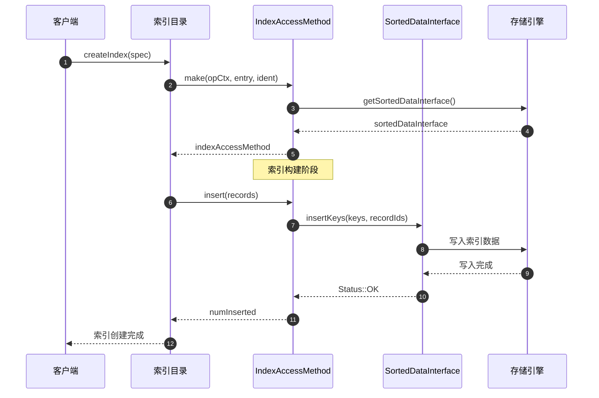
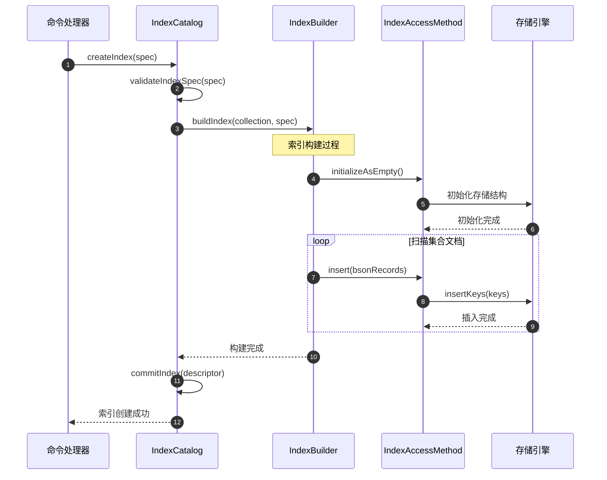
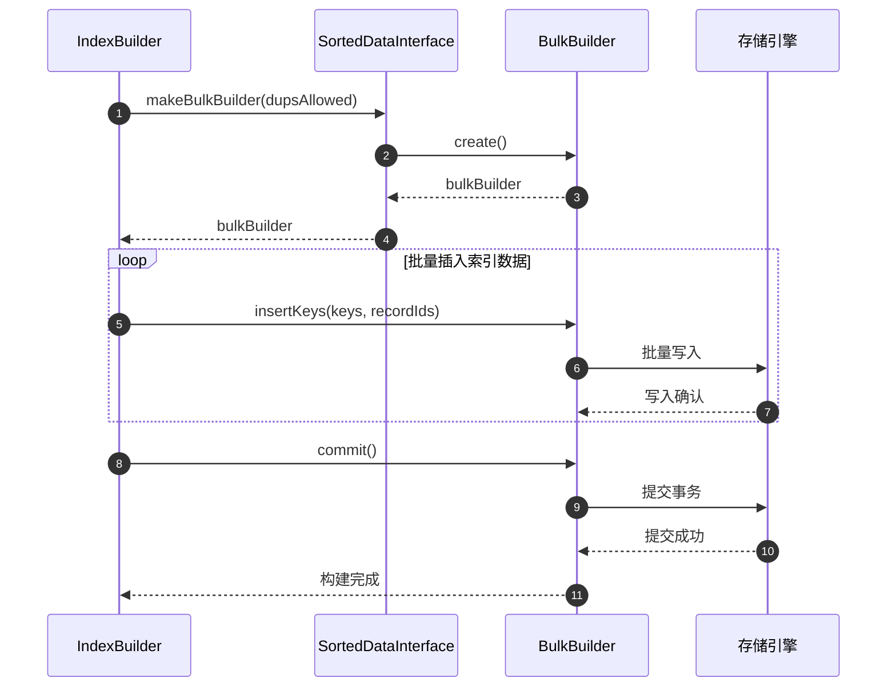
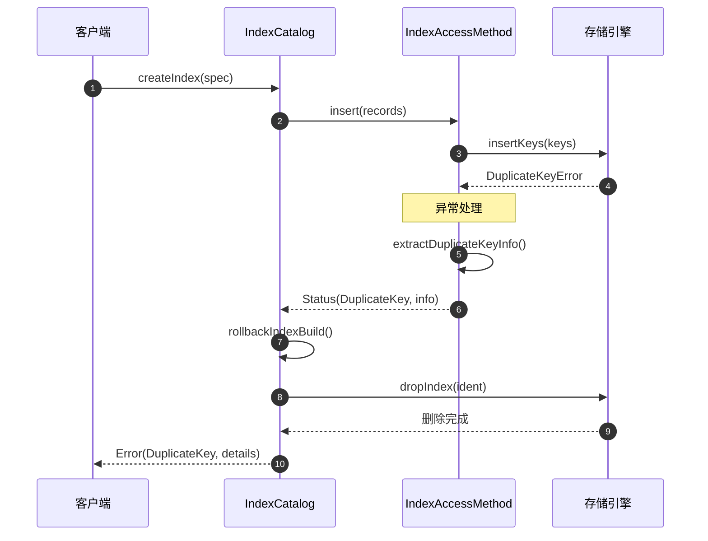

# MongoDB-11-索引模块-API

## 1. API总览

索引模块提供了完整的索引生命周期管理API，包括索引创建、访问、维护和删除等核心功能。主要API接口分为以下几个层次：

- **索引访问方法层：** IndexAccessMethod及其子类，提供统一的索引操作接口
- **索引目录层：** IndexCatalog，管理集合的所有索引
- **索引构建层：** IndexBuilder，负责索引的构建过程
- **存储接口层：** SortedDataInterface，与存储引擎交互

## 2. 核心API接口

### 2.1 IndexAccessMethod - 索引访问方法

#### 基本信息
- **名称：** `IndexAccessMethod`
- **协议/方法：** C++ 抽象基类
- **幂等性：** 根据具体操作而定

#### 请求结构体
```cpp
// IndexAccessMethod核心接口
class IndexAccessMethod {
public:
    // 工厂方法创建索引访问方法
    static std::unique_ptr<IndexAccessMethod> make(
        OperationContext* opCtx,
        RecoveryUnit& ru,
        const NamespaceString& nss,
        const CollectionOptions& collectionOptions,
        IndexCatalogEntry* entry,
        StringData ident
    );

    // 插入索引条目
    virtual Status insert(
        OperationContext* opCtx,
        SharedBufferFragmentBuilder& pooledBufferBuilder,
        const CollectionPtr& coll,
        const IndexCatalogEntry* entry,
        const std::vector<BsonRecord>& bsonRecords,
        const InsertDeleteOptions& options,
        int64_t* numInserted
    ) = 0;

    // 删除索引条目
    virtual void remove(
        OperationContext* opCtx,
        SharedBufferFragmentBuilder& pooledBufferBuilder,
        const CollectionPtr& coll,
        const IndexCatalogEntry* entry,
        const BSONObj& obj,
        const RecordId& loc,
        bool logIfError,
        const InsertDeleteOptions& options,
        int64_t* numDeleted,
        CheckRecordId checkRecordId
    ) = 0;

    // 更新索引条目
    virtual Status update(
        OperationContext* opCtx,
        RecoveryUnit& ru,
        SharedBufferFragmentBuilder& pooledBufferBuilder,
        const BSONObj& oldDoc,
        const BSONObj& newDoc,
        const RecordId& loc,
        const CollectionPtr& coll,
        const IndexCatalogEntry* entry,
        const InsertDeleteOptions& options,
        int64_t* numInserted,
        int64_t* numDeleted
    ) = 0;
};
```

| 字段 | 类型 | 必填 | 默认 | 约束 | 说明 |
|---|---|---:|---|---|---|
| opCtx | OperationContext* | 是 | - | 非空 | 操作上下文 |
| coll | CollectionPtr& | 是 | - | 非空 | 集合指针 |
| entry | IndexCatalogEntry* | 是 | - | 非空 | 索引目录条目 |
| bsonRecords | vector<BsonRecord>& | 是 | - | 非空 | BSON记录列表 |
| options | InsertDeleteOptions& | 是 | - | - | 插入删除选项 |
| numInserted | int64_t* | 否 | nullptr | - | 插入计数输出 |

#### 响应结构体
```cpp
// Status状态码
class Status {
private:
    ErrorCodes::Error _error;
    std::string _reason;
    
public:
    bool isOK() const;
    ErrorCodes::Error code() const;
    std::string reason() const;
};
```

| 字段 | 类型 | 必填 | 默认 | 约束 | 说明 |
|---|---|---:|---|---|---|
| _error | ErrorCodes::Error | 是 | OK | - | 错误码 |
| _reason | std::string | 否 | "" | - | 错误原因 |

#### 入口函数与关键代码
```cpp
// 索引访问方法工厂函数
std::unique_ptr<IndexAccessMethod> IndexAccessMethod::make(
    OperationContext* opCtx,
    RecoveryUnit& ru,
    const NamespaceString& nss,
    const CollectionOptions& collectionOptions,
    IndexCatalogEntry* entry,
    StringData ident) {
    
    // 1) 获取存储引擎
    auto engine = opCtx->getServiceContext()->getStorageEngine()->getEngine();
    auto desc = entry->descriptor();
    
    // 2) 确定键格式
    auto keyFormat = collectionOptions.clusteredIndex.has_value() 
                   ? KeyFormat::String 
                   : KeyFormat::Long;
    
    // 3) 创建排序数据接口
    auto makeSDI = [&] {
        return engine->getSortedDataInterface(
            opCtx, ru, nss, *collectionOptions.uuid, 
            ident, desc->toIndexConfig(), keyFormat);
    };
    
    // 4) 根据索引类型创建对应的访问方法
    const std::string& type = desc->getAccessMethodName();
    
    if ("" == type)
        return std::make_unique<BtreeAccessMethod>(entry, makeSDI());
    else if (IndexNames::HASHED == type)
        return std::make_unique<HashAccessMethod>(entry, makeSDI());
    else if (IndexNames::GEO_2DSPHERE == type)
        return std::make_unique<S2AccessMethod>(entry, makeSDI());
    else if (IndexNames::TEXT == type)
        return std::make_unique<FTSAccessMethod>(entry, makeSDI());
    else if (IndexNames::WILDCARD == type)
        return std::make_unique<WildcardAccessMethod>(entry, makeSDI());
    
    // 5) 不支持的索引类型
    LOGV2(20688, "Can't find index for keyPattern", 
          "keyPattern"_attr = desc->keyPattern());
    fassertFailed(31021);
}
```

#### 时序图（创建→使用）


#### 异常/回退与性能要点

**异常处理：**
- `DuplicateKey`：唯一索引冲突时返回重复键错误
- `IndexNotFound`：索引不存在时的回退处理  
- `StorageUnavailable`：存储不可用时的重试机制

**性能优化：**
- 批量插入：使用`SharedBufferFragmentBuilder`减少内存分配
- 并行构建：多线程并行处理索引构建
- 缓存友好：KeyString格式优化比较性能

### 2.2 BtreeAccessMethod - B树索引访问

#### 基本信息
- **名称：** `BtreeAccessMethod`
- **协议/方法：** 继承自IndexAccessMethod
- **幂等性：** 插入/删除操作幂等

#### 请求结构体
```cpp
// B树索引访问方法
class BtreeAccessMethod : public SortedDataIndexAccessMethod {
public:
    BtreeAccessMethod(IndexCatalogEntry* btreeState,
                     std::unique_ptr<SortedDataInterface> btree);

    // 获取索引键
    void getKeys(SharedBufferFragmentBuilder& pooledBufferBuilder,
                const CollectionPtr& collection,
                const IndexCatalogEntry* entry,
                const BSONObj& obj,
                bool forIndexCreate,
                BSONObjSet* keys,
                BSONObjSet* multikeyMetadataKeys,
                MultikeyPaths* multikeyPaths,
                const boost::optional<RecordId>& id) const override;
};
```

#### 入口函数与关键代码
```cpp
// B树索引键提取
void BtreeAccessMethod::getKeys(
    SharedBufferFragmentBuilder& pooledBufferBuilder,
    const CollectionPtr& collection,
    const IndexCatalogEntry* entry,
    const BSONObj& obj,
    bool forIndexCreate,
    BSONObjSet* keys,
    BSONObjSet* multikeyMetadataKeys,
    MultikeyPaths* multikeyPaths,
    const boost::optional<RecordId>& id) const {
    
    // 1) 获取索引键模式
    const BSONObj& keyPattern = entry->descriptor()->keyPattern();
    
    // 2) 提取文档中的索引键
    BSONObjBuilder keyBuilder;
    for (auto&& elem : keyPattern) {
        StringData fieldName = elem.fieldNameStringData();
        
        // 3) 从文档中提取字段值
        BSONElement fieldValue = obj.getFieldDotted(fieldName);
        
        if (fieldValue.eoo()) {
            // 字段不存在，使用null值
            keyBuilder.appendNull(fieldName);
        } else if (fieldValue.type() == BSONType::Array) {
            // 数组字段处理：为每个元素创建索引键
            _handleArrayField(fieldValue, fieldName, keys, multikeyPaths);
            return;  // 数组字段需要特殊处理
        } else {
            // 普通字段
            keyBuilder.appendAs(fieldValue, fieldName);
        }
    }
    
    // 4) 添加完整的索引键
    keys->insert(keyBuilder.obj());
}
```

### 2.3 IndexCatalog - 索引目录

#### 基本信息
- **名称：** `IndexCatalog`
- **协议/方法：** 集合级索引管理接口
- **幂等性：** 创建操作支持ifNotExists选项

#### 请求结构体
```cpp
// 索引目录管理接口
class IndexCatalog {
public:
    // 创建索引
    StatusWith<BSONObj> createIndexOnEmptyCollection(
        OperationContext* opCtx,
        const CollectionPtr& collection,
        const BSONObj& spec
    );

    // 获取索引
    const IndexDescriptor* findIdIndex(OperationContext* opCtx) const;
    const IndexDescriptor* findIndexByName(
        OperationContext* opCtx,
        StringData name,
        bool includeUnfinishedIndexes = false
    ) const;

    // 删除索引
    Status dropIndex(OperationContext* opCtx,
                    const CollectionPtr& collection,
                    const IndexDescriptor* desc);
};
```

#### 时序图（索引管理）


### 2.4 S2AccessMethod - 地理球面索引

#### 基本信息
- **名称：** `S2AccessMethod`
- **协议/方法：** 地理空间索引访问方法
- **幂等性：** 坐标精度范围内幂等

#### 请求结构体
```cpp
// 地理球面索引访问方法
class S2AccessMethod : public SortedDataIndexAccessMethod {
public:
    S2AccessMethod(IndexCatalogEntry* catalogEntry,
                  std::unique_ptr<SortedDataInterface> btree);

    // 获取地理索引键
    void getKeys(SharedBufferFragmentBuilder& pooledBufferBuilder,
                const CollectionPtr& collection,
                const IndexCatalogEntry* entry,
                const BSONObj& obj,
                bool forIndexCreate,
                BSONObjSet* keys,
                BSONObjSet* multikeyMetadataKeys,
                MultikeyPaths* multikeyPaths,
                const boost::optional<RecordId>& id) const override;
};
```

#### 入口函数与关键代码
```cpp
// 地理索引键提取
void S2AccessMethod::getKeys(
    SharedBufferFragmentBuilder& pooledBufferBuilder,
    const CollectionPtr& collection,
    const IndexCatalogEntry* entry,
    const BSONObj& obj,
    bool forIndexCreate,
    BSONObjSet* keys,
    BSONObjSet* multikeyMetadataKeys,
    MultikeyPaths* multikeyPaths,
    const boost::optional<RecordId>& id) const {
    
    // 1) 获取2dsphere索引参数
    const S2IndexingParams& params = _getS2IndexingParams(entry);
    
    // 2) 遍历索引键模式
    BSONObjIterator it(entry->descriptor()->keyPattern()); 
    while (it.more()) {
        BSONElement elem = it.next();
        
        if (elem.type() == String && elem.valuestr() == "2dsphere") {
            // 3) 处理地理字段
            StringData fieldName = elem.fieldNameStringData();
            BSONElement geoElement = obj.getFieldDotted(fieldName);
            
            if (geoElement.eoo()) {
                continue;  // 地理字段为空
            }
            
            // 4) 解析GeoJSON或legacy坐标
            vector<S2CellId> cells;
            S2RegionCoverer coverer;
            _getCellsForGeometry(geoElement, params, &coverer, &cells);
            
            // 5) 为每个S2 cell创建索引键
            for (const S2CellId& cellId : cells) {
                BSONObjBuilder keyBuilder;
                keyBuilder.append(fieldName, static_cast<long long>(cellId.id()));
                
                // 添加其他非地理字段
                _appendNonGeoFields(obj, entry, keyBuilder);
                
                keys->insert(keyBuilder.obj());
            }
        }
    }
}

// 获取几何体的S2覆盖cells
void S2AccessMethod::_getCellsForGeometry(
    const BSONElement& geoElement,
    const S2IndexingParams& params,
    S2RegionCoverer* coverer,
    vector<S2CellId>* cells) const {
    
    // 1) 配置覆盖器参数
    coverer->set_min_level(params.coarsestIndexedLevel);
    coverer->set_max_level(params.finestIndexedLevel);
    coverer->set_max_cells(params.maxCellsInCovering);
    
    // 2) 解析几何对象
    unique_ptr<S2Region> region;
    if (geoElement.type() == Object) {
        // GeoJSON格式
        region = S2GeoJSONParser::parseGeoJSON(geoElement.Obj());
    } else if (geoElement.type() == Array) {
        // Legacy格式 [lng, lat]
        region = S2LegacyParser::parsePoint(geoElement);
    }
    
    // 3) 生成覆盖cells
    if (region) {
        coverer->GetCovering(*region, cells);
    }
}
```

## 3. 存储接口API

### 3.1 SortedDataInterface - 排序数据接口

#### 基本信息
- **名称：** `SortedDataInterface`
- **协议/方法：** 存储引擎抽象接口
- **幂等性：** 根据存储引擎实现而定

#### 请求结构体
```cpp
// 排序数据接口
class SortedDataInterface {
public:
    // 插入键值对
    virtual Status insertKeys(OperationContext* opCtx,
                             const std::vector<key_string::Value>& keys,
                             const std::vector<RecordId>& recordIds,
                             bool dupsAllowed) = 0;

    // 删除键值对
    virtual void removeKeys(OperationContext* opCtx,
                           const std::vector<key_string::Value>& keys,
                           const std::vector<RecordId>& recordIds,
                           bool dupsAllowed) = 0;

    // 创建游标
    virtual std::unique_ptr<SortedDataBuilderInterface> makeBulkBuilder(
        OperationContext* opCtx,
        bool dupsAllowed,
        const Ordering& ordering) = 0;
};
```

#### 时序图（批量构建）


## 4. 索引类型专用API

### 4.1 FTSAccessMethod - 全文索引

#### 基本信息
- **名称：** `FTSAccessMethod`
- **协议/方法：** 全文搜索索引访问方法
- **幂等性：** 文档相同时幂等

#### 入口函数与关键代码
```cpp
// 全文索引键提取
void FTSAccessMethod::getKeys(
    SharedBufferFragmentBuilder& pooledBufferBuilder,
    const CollectionPtr& collection,
    const IndexCatalogEntry* entry,
    const BSONObj& obj,
    bool forIndexCreate,
    BSONObjSet* keys,
    BSONObjSet* multikeyMetadataKeys,
    MultikeyPaths* multikeyPaths,
    const boost::optional<RecordId>& id) const {
    
    // 1) 获取FTS规格
    const FTSSpec& ftsSpec = _getFTSSpec(entry);
    
    // 2) 提取文档文本内容
    BSONObj textObj = ftsSpec.fixSpec(obj);
    
    // 3) 分词处理
    std::vector<std::string> terms;
    ftsSpec.scoreDocument(textObj);
    
    // 4) 为每个词条创建索引键
    for (const auto& term : terms) {
        BSONObjBuilder keyBuilder;
        keyBuilder.append("", term);  // 词条
        keyBuilder.append("", 1.0);   // 权重
        keys->insert(keyBuilder.obj());
    }
}
```

### 4.2 WildcardAccessMethod - 通配符索引

#### 基本信息
- **名称：** `WildcardAccessMethod`
- **协议/方法：** 动态字段索引访问方法
- **幂等性：** 文档结构相同时幂等

#### 入口函数与关键代码
```cpp
// 通配符索引键提取
void WildcardAccessMethod::getKeys(
    SharedBufferFragmentBuilder& pooledBufferBuilder,
    const CollectionPtr& collection,
    const IndexCatalogEntry* entry,
    const BSONObj& obj,
    bool forIndexCreate,
    BSONObjSet* keys,
    BSONObjSet* multikeyMetadataKeys,
    MultikeyPaths* multikeyPaths,
    const boost::optional<RecordId>& id) const {
    
    // 1) 获取通配符投影
    const BSONObj& wildcardProjection = _getWildcardProjection(entry);
    
    // 2) 应用投影过滤
    BSONObj projectedDoc = _applyProjection(obj, wildcardProjection);
    
    // 3) 递归提取所有字段路径
    _extractAllFieldPaths("", projectedDoc, keys);
}

// 递归提取字段路径
void WildcardAccessMethod::_extractAllFieldPaths(
    const std::string& path,
    const BSONElement& elem,
    BSONObjSet* keys) const {
    
    if (elem.type() == Object) {
        // 对象类型：递归处理子字段
        BSONObj subObj = elem.embeddedObject();
        for (auto&& subElem : subObj) {
            std::string subPath = path.empty() 
                                ? subElem.fieldName() 
                                : path + "." + subElem.fieldName();
            _extractAllFieldPaths(subPath, subElem, keys);
        }
    } else if (elem.type() == Array) {
        // 数组类型：为每个元素创建索引
        BSONObj arrayObj = elem.embeddedObject();
        int index = 0;
        for (auto&& arrayElem : arrayObj) {
            std::string indexPath = path + "." + std::to_string(index);
            _extractAllFieldPaths(indexPath, arrayElem, keys);
            index++;
        }
    } else {
        // 叶子节点：创建索引键
        BSONObjBuilder keyBuilder;
        keyBuilder.append(path, elem);
        keys->insert(keyBuilder.obj());
    }
}
```

## 5. 性能监控API

### 5.1 索引统计信息

#### 基本信息
- **名称：** `appendCustomStats`
- **协议/方法：** 统计信息收集接口
- **幂等性：** 是（只读操作）

#### 请求结构体
```cpp
// 索引统计信息收集
virtual bool appendCustomStats(OperationContext* opCtx,
                              RecoveryUnit& ru,
                              BSONObjBuilder* result,
                              double scale) const = 0;
```

#### 入口函数与关键代码
```cpp
// B树索引统计信息
bool BtreeAccessMethod::appendCustomStats(
    OperationContext* opCtx,
    RecoveryUnit& ru,
    BSONObjBuilder* result,
    double scale) const {
    
    // 1) 获取基础统计
    long long storageSize = getSpaceUsedBytes(opCtx, ru);
    long long freeBytes = getFreeStorageBytes(opCtx, ru);
    int64_t numKeys = this->numKeys(opCtx, ru);
    
    // 2) 计算统计指标
    result->appendNumber("storageSize", static_cast<long long>(storageSize / scale));
    result->appendNumber("freeStorageSize", static_cast<long long>(freeBytes / scale));
    result->appendNumber("numKeys", numKeys);
    
    // 3) 计算平均键大小
    if (numKeys > 0) {
        double avgKeySize = static_cast<double>(storageSize) / numKeys;
        result->appendNumber("avgKeySize", avgKeySize);
    }
    
    // 4) 索引类型特定统计
    result->append("indexType", "btree");
    result->append("version", _getIndexVersion());
    
    return true;
}
```

## 6. 错误处理与异常情况

### 6.1 常见错误码

| 错误码 | 含义 | 处理策略 |
|---|---|---|
| DuplicateKey | 唯一索引冲突 | 返回重复键详细信息 |
| IndexNotFound | 索引不存在 | 检查索引名称和集合 |
| IndexBuildAborted | 索引构建中止 | 清理临时文件，回滚状态 |
| CannotCreateIndex | 无法创建索引 | 检查权限和资源限制 |
| IndexOptionsConflict | 索引选项冲突 | 验证索引规格兼容性 |

### 6.2 异常处理时序图



---

**文档版本：** v1.0  
**生成时间：** 2025-10-05  
**适用版本：** MongoDB 8.0+
