# MongoDB-11-索引模块-数据结构

## 1. 核心数据结构概览

索引模块的数据结构设计采用分层架构，从上层的索引描述符到底层的存储结构，形成了完整的索引数据管理体系。

### 1.1 数据结构分类

- **描述符层：** IndexDescriptor、IndexCatalogEntry
- **访问方法层：** IndexAccessMethod及其子类
- **键值处理层：** KeyString、BSONObjSet
- **存储接口层：** SortedDataInterface、RecordId
- **构建器层：** IndexBuilder、BulkBuilder

## 2. 核心类图

### 2.1 索引描述符类图

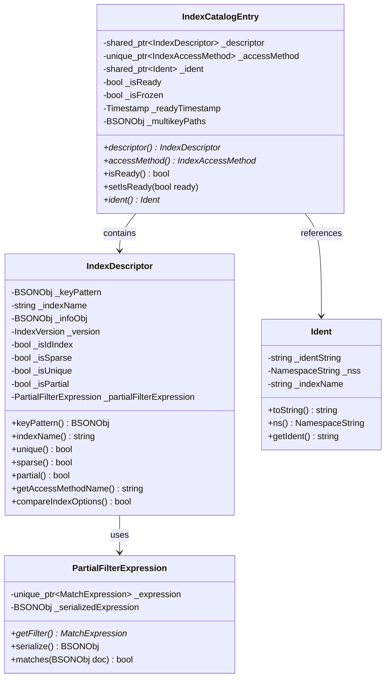

### 2.2 索引访问方法类图

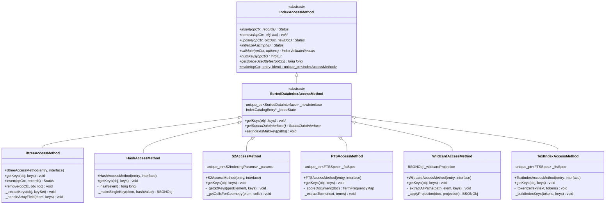

### 2.3 索引键值处理类图

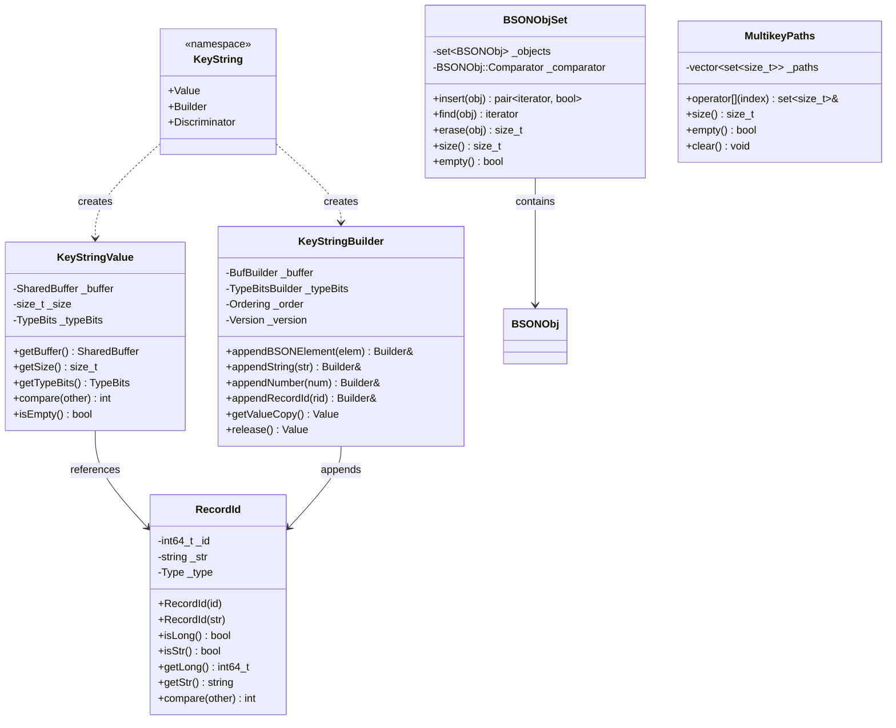

### 2.4 存储接口类图

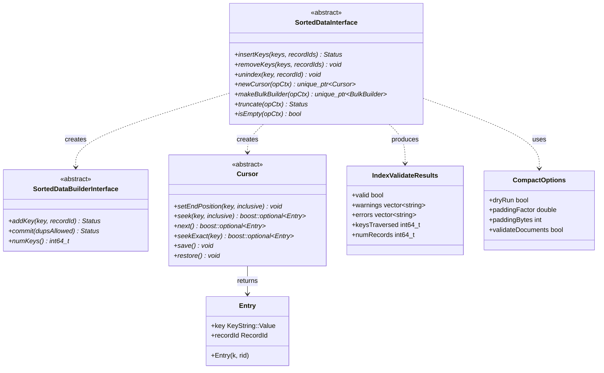

### 2.5 索引构建器类图

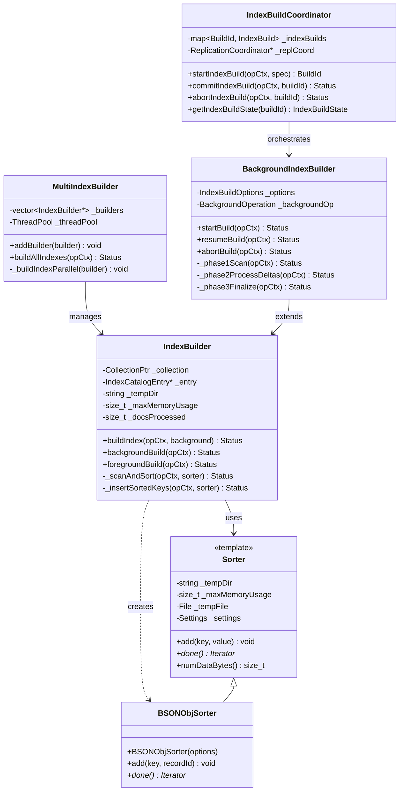

## 3. 索引类型特定数据结构

### 3.1 地理索引数据结构

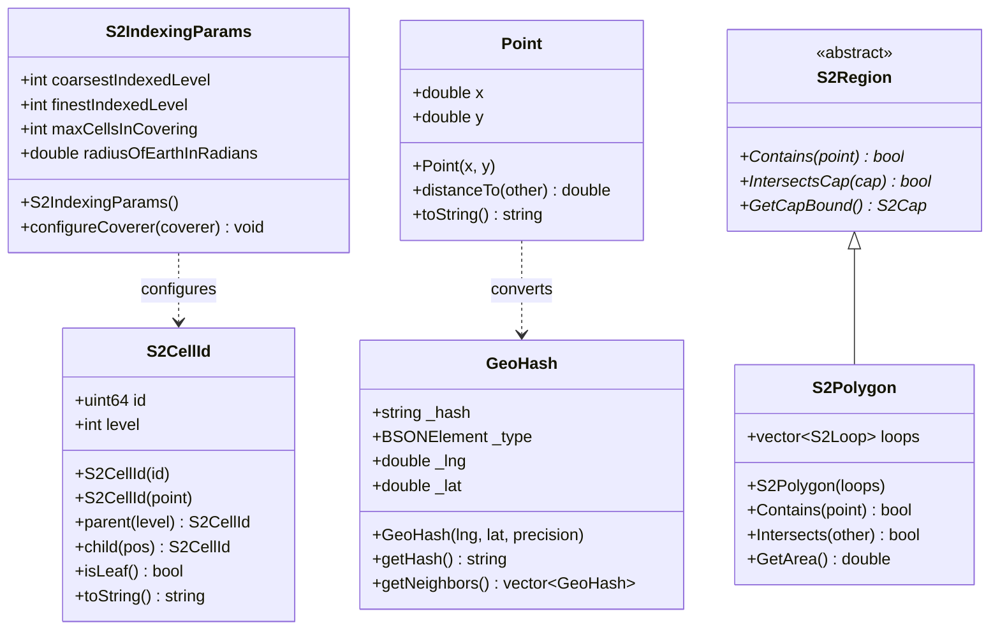

### 3.2 全文索引数据结构

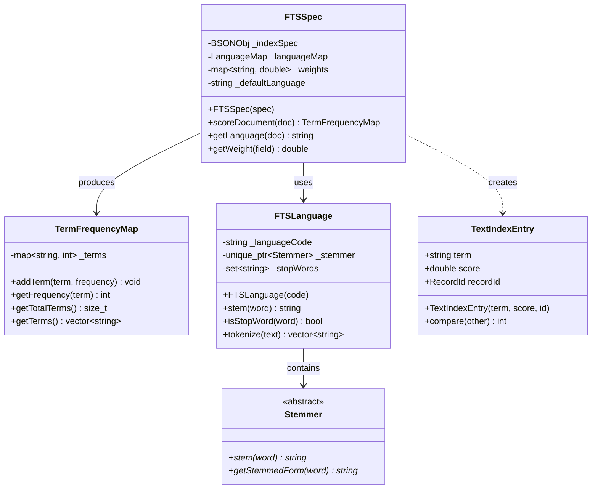

### 3.3 哈希索引数据结构

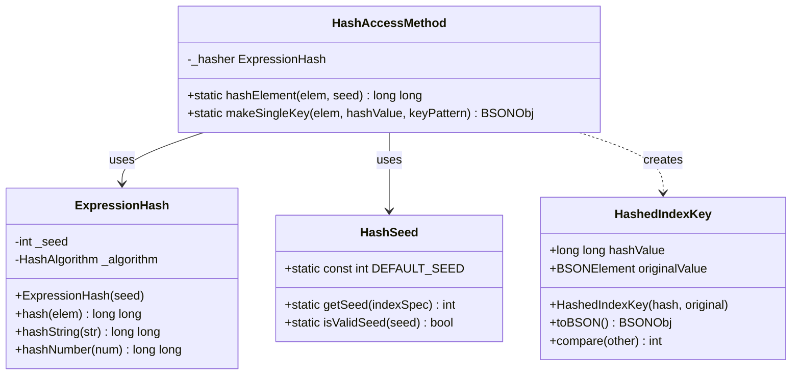

## 4. 索引构建过程数据结构

### 4.1 构建状态管理

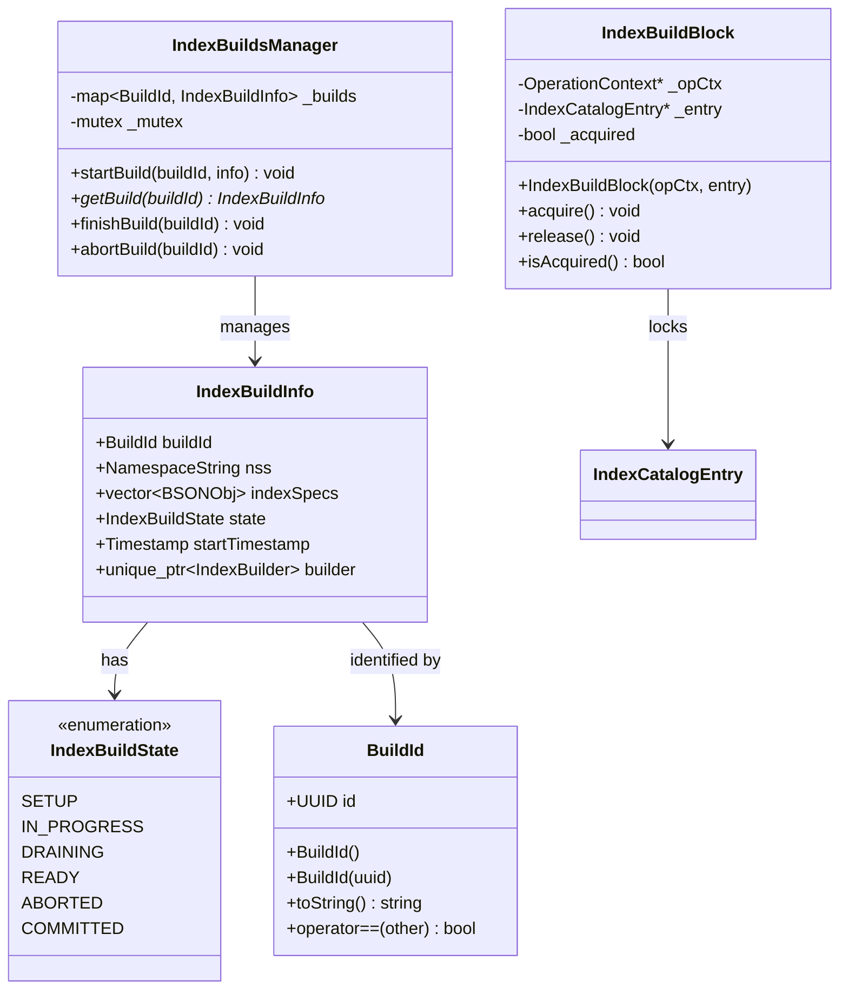

### 4.2 外部排序数据结构

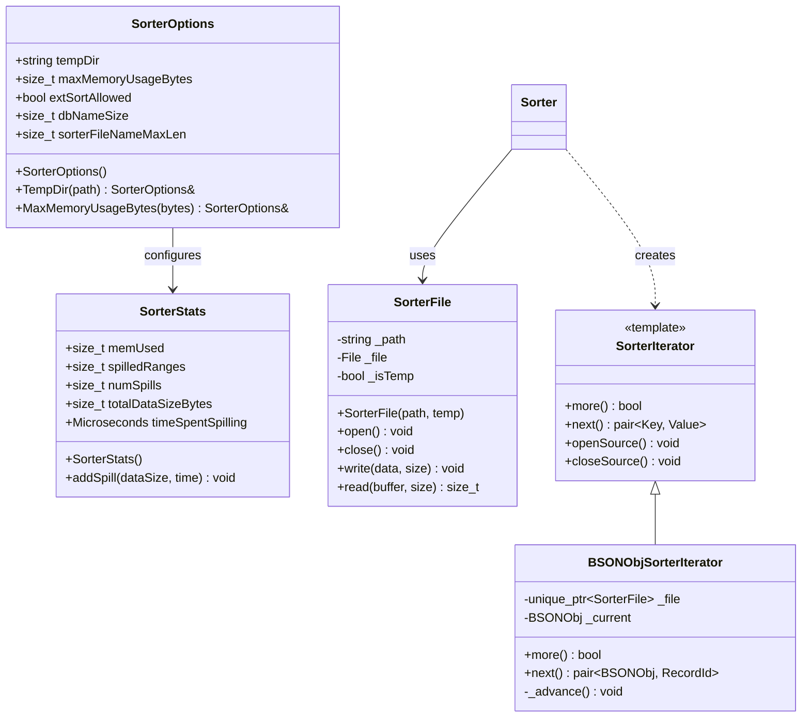

## 5. 索引验证数据结构

### 5.1 验证结果和选项

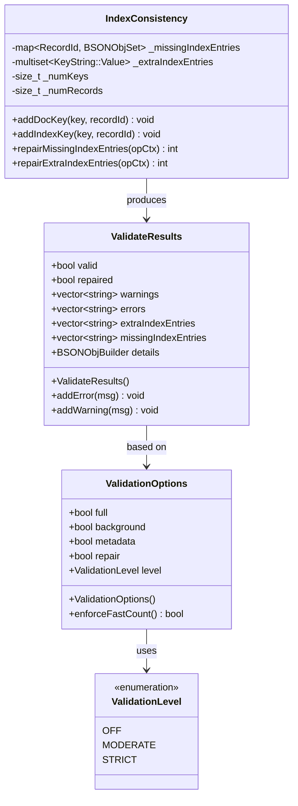

## 6. 字段映射和约束

### 6.1 字段到索引的映射关系

| 数据结构 | 主要字段 | 数据类型 | 约束条件 | 说明 |
|---------|---------|----------|----------|------|
| IndexDescriptor | _keyPattern | BSONObj | 非空，最大32字段 | 索引键模式定义 |
| IndexDescriptor | _indexName | string | 非空，最大127字符 | 索引唯一名称 |
| IndexCatalogEntry | _isReady | bool | - | 索引是否就绪 |
| KeyString::Value | _buffer | SharedBuffer | 最大1024字节 | 索引键的二进制表示 |
| RecordId | _id | int64_t | > 0 | 记录标识符 |
| MultikeyPaths | _paths | vector<set<size_t>> | 最大32个路径 | 多键路径集合 |

### 6.2 版本兼容性映射

| 索引版本 | 数据格式 | 支持特性 | 兼容性 |
|---------|---------|----------|--------|
| v1 | 旧格式 | 基础B树 | 已废弃 |
| v2 | 新格式 | 所有索引类型 | 当前版本 |
| v3 | 未来格式 | 列式索引 | 计划中 |

---

**文档版本：** v1.0  
**生成时间：** 2025-10-05  
**适用版本：** MongoDB 8.0+
