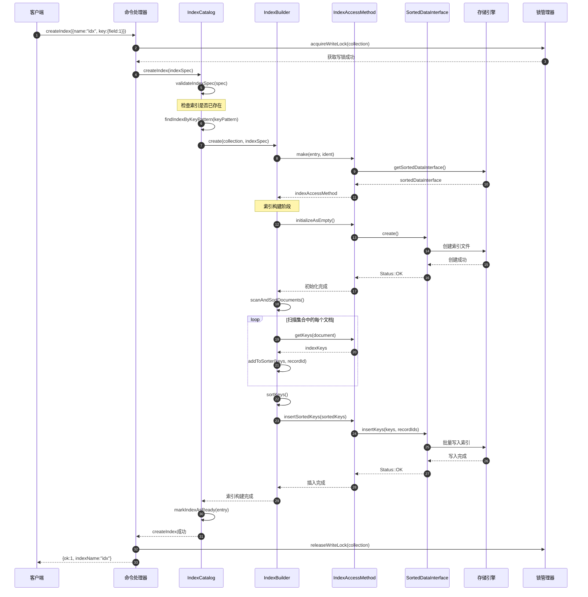
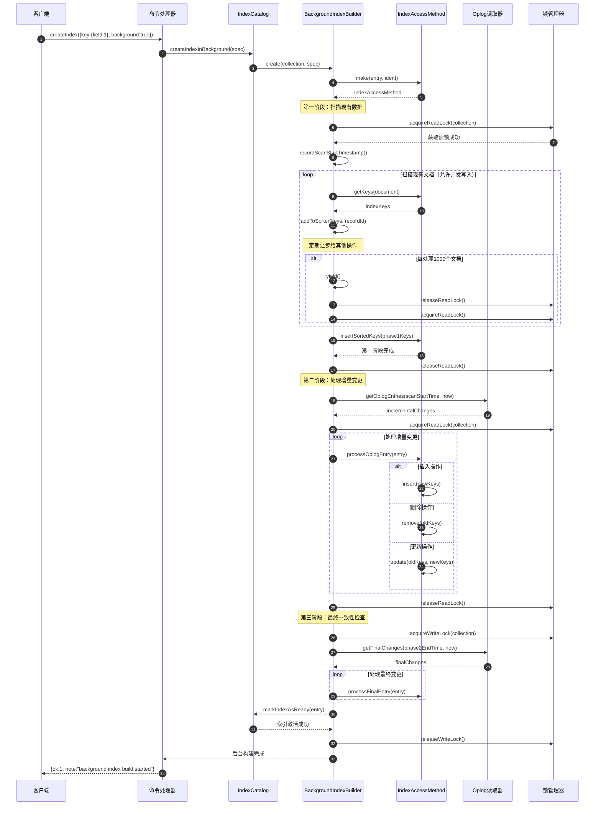
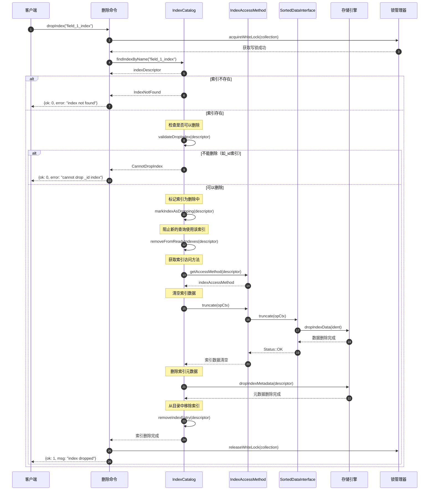

# MongoDB-11-索引模块-时序图

## 1. 时序图概览

索引模块的时序图展示了索引生命周期中的关键操作流程，包括索引创建、维护、查询和删除等核心场景。每个时序图都体现了模块间的协作关系和数据流向。

## 2. 索引创建时序图

### 2.1 前台索引创建（阻塞式）



#### 2.1.1 图意概述
前台索引创建采用阻塞方式，在整个构建过程中持有集合写锁，确保数据一致性但会影响并发写入性能。

#### 2.1.2 关键字段/接口
- `createIndex`：索引创建命令接口
- `validateIndexSpec`：索引规格验证
- `scanAndSortDocuments`：文档扫描和排序
- `insertSortedKeys`：排序键批量插入

#### 2.1.3 边界条件
- **锁超时：** 写锁持有时间受索引大小影响
- **内存限制：** 排序阶段默认使用100MB内存
- **并发限制：** 阻塞所有写操作
- **中断处理：** 支持构建过程中的中断信号

#### 2.1.4 异常与回退
- 构建失败时自动清理临时文件
- 唯一性冲突时报告详细错误信息
- 磁盘空间不足时暂停构建
- 支持构建过程的安全中断

#### 2.1.5 性能与容量假设
- 单个索引最大支持32个字段
- 索引键最大长度1024字节
- 构建速度约10万文档/秒（取决于硬件）
- 内存使用峰值为100MB + 索引大小

### 2.2 后台索引创建（非阻塞式）



#### 2.2.1 图意概述
后台索引创建采用三阶段构建模式，最小化对写操作的影响，通过读取oplog处理增量变更确保最终一致性。

#### 2.2.2 关键字段/接口
- `createIndexInBackground`：后台构建启动接口
- `recordScanStartTimestamp`：记录扫描起始时间点
- `getOplogEntries`：获取oplog增量变更
- `processFinalEntry`：处理最终一致性变更

#### 2.2.3 边界条件
- **时间窗口：** 三个阶段的时间窗口管理
- **内存使用：** 每阶段独立的内存限制
- **并发写入：** 允许阶段1和2的并发写入
- **最终锁定：** 阶段3需要短暂的写锁

#### 2.2.4 异常与回退
- 阶段失败时的回滚机制
- Oplog读取失败的重试策略
- 时间窗口过大时的处理方案
- 内存不足时的外部排序回退

## 3. 索引查询使用时序图

### 3.1 B树索引范围查询

```mermaid
sequenceDiagram
    autonumber
    participant QE as 查询引擎
    participant IS as 索引选择器
    parameter IC as IndexCatalog
    participant IAM as IndexAccessMethod
    participant Cursor as 索引游标
    participant SDI as SortedDataInterface
    participant Storage as 存储引擎
    
    QE->>IS: selectIndexForQuery({field: {$gte: 10, $lt: 100}})
    IS->>IC: getAllIndexes()
    IC-->>IS: availableIndexes[]
    
    IS->>IS: scoreIndexes(query, indexes)
    IS-->>QE: bestIndex(field_1)
    
    QE->>IC: getIndex(field_1)
    IC-->>QE: indexCatalogEntry
    QE->>IAM: asSortedData()
    IAM-->>QE: sortedDataIndexAccessMethod
    
    QE->>IAM: newCursor(opCtx)
    IAM->>SDI: newCursor(opCtx)
    SDI->>Storage: createCursor()
    Storage-->>SDI: storageCursor
    SDI-->>IAM: indexCursor
    IAM-->>QE: cursor
    
    Note over QE: 设置查询范围
    QE->>Cursor: setEndPosition(key: 100, inclusive: false)
    Cursor->>SDI: setEndPosition(keyString)
    SDI-->>Cursor: 设置结束位置
    
    QE->>Cursor: seek(key: 10, inclusive: true)
    Cursor->>SDI: seek(keyString)
    SDI->>Storage: seekToKey(key)
    Storage-->>SDI: currentEntry
    SDI-->>Cursor: Entry{key, recordId}
    Cursor-->>QE: Entry{key: 10, recordId: 12345}
    
    loop 扫描索引范围
        QE->>Cursor: next()
        Cursor->>SDI: next()
        SDI->>Storage: getNextEntry()
        Storage-->>SDI: nextEntry
        SDI-->>Cursor: Entry{key, recordId}
        Cursor-->>QE: Entry{key, recordId}
        
        alt 到达结束位置
            QE->>QE: checkEndCondition(key < 100)
            break 结束扫描
        end
    end
    
    QE->>Cursor: close()
    Cursor->>SDI: close()
    SDI->>Storage: closeCursor()
    Storage-->>SDI: 关闭完成
```

#### 3.1.1 图意概述
B树索引范围查询通过游标接口扫描指定范围内的索引条目，支持精确的起始和结束位置控制。

#### 3.1.2 关键字段/接口
- `selectIndexForQuery`：查询索引选择逻辑
- `setEndPosition`：设置扫描结束位置
- `seek`：定位到起始键位置
- `next`：获取下一个索引条目

#### 3.1.3 边界条件
- **范围边界：** 支持包含/排除边界条件
- **游标状态：** 维护游标位置状态
- **内存限制：** 游标缓存限制
- **并发读取：** 支持多游标并发扫描

### 3.2 地理索引空间查询

```mermaid
sequenceDiagram
    autonumber
    participant QE as 查询引擎
    participant GeoQuery as 地理查询处理器
    participant S2AM as S2AccessMethod
    participant S2Index as S2索引
    participant SDI as SortedDataInterface
    
    QE->>GeoQuery: processGeoQuery({loc: {$near: [lng, lat], $maxDistance: 1000}})
    GeoQuery->>GeoQuery: parseGeoQuery(queryObj)
    
    Note over GeoQuery: 计算查询区域的S2覆盖
    GeoQuery->>GeoQuery: createS2Region(center, radius)
    GeoQuery->>GeoQuery: getS2CellCovering(region)
    GeoQuery-->>GeoQuery: s2CellIds[]
    
    GeoQuery->>S2AM: newCursor(opCtx)
    S2AM-->>GeoQuery: s2Cursor
    
    loop 扫描每个S2 Cell
        GeoQuery->>S2Index: seekToCell(cellId)
        S2Index->>SDI: seek(keyString)
        SDI-->>S2Index: Entry{cellKey, recordId}
        S2Index-->>GeoQuery: geoEntry
        
        loop 扫描Cell内的文档
            GeoQuery->>S2Index: next()
            S2Index->>SDI: next()
            SDI-->>S2Index: Entry{cellKey, recordId}
            
            Note over GeoQuery: 精确距离计算
            GeoQuery->>GeoQuery: calculateExactDistance(recordLoc, queryPoint)
            
            alt 距离满足条件
                GeoQuery-->>QE: qualifiedResult{recordId, distance}
            else 距离超出范围
                Note over GeoQuery: 跳过该结果
            end
            
            alt Cell扫描完成
                break 移动到下一个Cell
            end
        end
    end
    
    GeoQuery->>GeoQuery: sortResultsByDistance()
    GeoQuery-->>QE: sortedGeoResults[]
```

#### 3.2.1 图意概述
地理索引空间查询通过S2几何库计算空间覆盖，然后扫描相关的S2 cell，最后进行精确距离计算和排序。

#### 3.2.2 关键字段/接口
- `processGeoQuery`：地理查询处理入口
- `createS2Region`：创建查询区域
- `getS2CellCovering`：计算S2覆盖cells
- `calculateExactDistance`：精确距离计算

#### 3.2.3 边界条件
- **覆盖精度：** S2 cell level控制查询精度
- **距离计算：** 球面距离计算精度
- **结果限制：** 支持限制返回结果数量
- **内存使用：** 覆盖cell数量限制

## 4. 索引维护时序图

### 4.1 文档插入时的索引更新

```mermaid
sequenceDiagram
    autonumber
    participant Client as 客户端
    participant InsertCmd as 插入命令
    participant CollectionImpl as 集合实现
    participant IC as IndexCatalog
    participant IAM as IndexAccessMethod
    participant SDI as SortedDataInterface
    participant Storage as 存储引擎
    
    Client->>InsertCmd: insert({_id: 1, name: "John", age: 25})
    InsertCmd->>CollectionImpl: insertDocument(doc, opCtx)
    
    Note over CollectionImpl: 插入文档到集合
    CollectionImpl->>Storage: insertRecord(doc)
    Storage-->>CollectionImpl: recordId
    
    Note over CollectionImpl: 更新所有相关索引
    CollectionImpl->>IC: getAllReadyIndexes()
    IC-->>CollectionImpl: readyIndexes[]
    
    loop 为每个索引更新
        CollectionImpl->>IAM: getKeys(doc, forIndexCreate: false)
        IAM-->>CollectionImpl: indexKeys[]
        
        loop 为每个索引键插入
            CollectionImpl->>IAM: insert(opCtx, keys, recordId)
            IAM->>SDI: insertKeys(keyStrings, recordIds)
            SDI->>Storage: insertIndexEntry(key, recordId)
            
            alt 唯一索引冲突检查
                Storage-->>SDI: DuplicateKeyError
                SDI-->>IAM: DuplicateKeyError
                IAM-->>CollectionImpl: Status(DuplicateKey)
                break 插入失败，需要回滚
            else 插入成功
                Storage-->>SDI: Status::OK
                SDI-->>IAM: Status::OK
            end
        end
        
        IAM-->>CollectionImpl: indexUpdateComplete
    end
    
    alt 所有索引更新成功
        CollectionImpl-->>InsertCmd: insertSuccess(recordId)
        InsertCmd-->>Client: {ok: 1, insertedId: 1}
    else 索引更新失败
        CollectionImpl->>Storage: deleteRecord(recordId)
        CollectionImpl-->>InsertCmd: insertFailure(error)
        InsertCmd-->>Client: {ok: 0, error: "duplicate key"}
    end
```

#### 4.1.1 图意概述
文档插入时需要同步更新所有相关索引，确保索引与文档数据的一致性，支持唯一性约束检查和事务回滚。

#### 4.1.2 关键字段/接口
- `insertDocument`：文档插入主接口
- `getAllReadyIndexes`：获取就绪的索引列表
- `getKeys`：从文档提取索引键
- `insertKeys`：批量插入索引键

#### 4.1.3 边界条件
- **原子性：** 文档和索引更新的原子性
- **唯一性：** 唯一索引的冲突检测
- **多索引：** 支持同时更新多个索引
- **回滚：** 失败时的完整回滚机制

### 4.2 文档更新时的索引维护

```mermaid
sequenceDiagram
    autonumber
    participant Client as 客户端
    participant UpdateCmd as 更新命令
    participant CollectionImpl as 集合实现
    participant IC as IndexCatalog
    participant IAM as IndexAccessMethod
    participant Storage as 存储引擎
    
    Client->>UpdateCmd: update({_id: 1}, {$set: {age: 26, city: "NYC"}})
    UpdateCmd->>CollectionImpl: updateDocument(query, update, opCtx)
    
    Note over CollectionImpl: 查找并获取原文档
    CollectionImpl->>Storage: findRecord(query)
    Storage-->>CollectionImpl: oldDoc, recordId
    
    Note over CollectionImpl: 应用更新操作
    CollectionImpl->>CollectionImpl: applyUpdate(oldDoc, updateSpec)
    CollectionImpl-->>CollectionImpl: newDoc
    
    Note over CollectionImpl: 计算索引变更
    CollectionImpl->>IC: getAllReadyIndexes()
    IC-->>CollectionImpl: readyIndexes[]
    
    loop 为每个索引计算变更
        CollectionImpl->>IAM: getKeys(oldDoc)
        IAM-->>CollectionImpl: oldKeys[]
        CollectionImpl->>IAM: getKeys(newDoc)
        IAM-->>CollectionImpl: newKeys[]
        
        CollectionImpl->>CollectionImpl: calculateIndexDelta(oldKeys, newKeys)
        CollectionImpl-->>CollectionImpl: {keysToAdd[], keysToRemove[]}
        
        Note over CollectionImpl: 执行索引变更
        alt 有需要删除的键
            loop 删除旧索引键
                CollectionImpl->>IAM: remove(opCtx, oldKey, recordId)
                IAM->>Storage: removeIndexEntry(key, recordId)
                Storage-->>IAM: Status::OK
            end
        end
        
        alt 有需要添加的键
            loop 插入新索引键
                CollectionImpl->>IAM: insert(opCtx, newKey, recordId)
                IAM->>Storage: insertIndexEntry(key, recordId)
                
                alt 唯一索引冲突
                    Storage-->>IAM: DuplicateKeyError
                    break 更新失败
                else 插入成功
                    Storage-->>IAM: Status::OK
                end
            end
        end
    end
    
    Note over CollectionImpl: 更新文档内容
    CollectionImpl->>Storage: updateRecord(recordId, newDoc)
    Storage-->>CollectionImpl: updateSuccess
    
    CollectionImpl-->>UpdateCmd: updateComplete(modifiedCount: 1)
    UpdateCmd-->>Client: {ok: 1, modifiedCount: 1}
```

#### 4.2.1 图意概述
文档更新时需要计算索引键的变更差异，删除旧键并插入新键，确保索引始终反映最新的文档状态。

#### 4.2.2 关键字段/接口
- `updateDocument`：文档更新主接口
- `applyUpdate`：应用更新操作
- `calculateIndexDelta`：计算索引键变更差异
- `removeIndexEntry`：删除索引条目

#### 4.2.3 边界条件
- **差异计算：** 准确计算新旧索引键差异
- **更新顺序：** 先删除后插入的顺序控制
- **部分更新：** 支持只更新变更的字段
- **并发控制：** 更新过程的锁管理

## 5. 索引删除时序图

### 5.1 删除索引操作



#### 5.1.1 图意概述
索引删除操作需要持有集合写锁，先标记索引为删除状态，阻止新查询使用，然后清空数据并删除元数据。

#### 5.1.2 关键字段/接口
- `dropIndex`：索引删除命令
- `validateDropIndex`：删除前验证
- `markIndexAsDropping`：标记删除状态
- `truncate`：清空索引数据

#### 5.1.3 边界条件
- **写锁要求：** 删除过程持有写锁
- **系统索引：** _id索引等系统索引不可删除
- **删除顺序：** 先标记再删除的顺序
- **元数据一致性：** 确保元数据完全清理

## 6. 版本兼容与演进

### 6.1 版本兼容性说明

1. **时序图版本：**
   - v1.0：基础时序图，覆盖主要场景
   - v1.1：增加错误处理分支
   - v2.0：支持新索引类型的时序

2. **接口演进：**
   - 向后兼容：旧版本接口继续支持
   - 新特性：通过可选参数扩展
   - 废弃通知：提前版本标记废弃接口

3. **性能优化历史：**
   - 并行索引构建：MongoDB 4.2+
   - 后台构建优化：MongoDB 4.4+
   - KeyString优化：MongoDB 5.0+

---

**文档版本：** v1.0  
**生成时间：** 2025-10-05  
**适用版本：** MongoDB 8.0+
