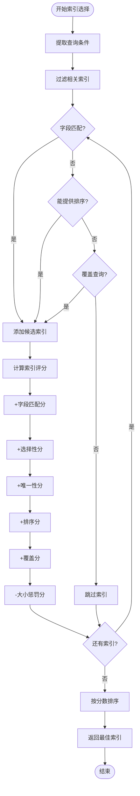

# MongoDB-11-索引模块-概览

## 1. 模块职责

索引模块（`src/mongo/db/index`）负责MongoDB的索引管理和维护，提供高效的数据检索能力。该模块实现了多种索引类型和优化策略，是查询性能的关键组件。

### 1.1 主要功能

- **索引管理：** 创建、删除、修改索引的生命周期管理
- **索引类型支持：** B-tree、2dsphere、text、hashed等多种索引
- **索引构建：** 支持前台和后台索引构建
- **索引维护：** 数据变更时自动更新索引
- **索引优化：** 索引压缩、合并和重建
- **约束检查：** 唯一性约束和部分索引条件检查
- **统计信息：** 索引使用统计和基数估算

### 1.2 输入/输出

**输入：**
- 索引定义（字段、类型、选项）
- 文档插入/更新/删除操作
- 查询条件和排序要求
- 索引构建参数

**输出：**
- 索引数据结构
- 查询访问路径
- 索引统计信息
- 约束验证结果

### 1.3 上下游依赖

**依赖模块（上游）：**
- db-storage：索引数据持久化
- db-catalog：索引元数据管理
- bson模块：索引键值处理
- base模块：错误处理和基础类型

**被依赖模块（下游）：**
- db-query：查询优化器选择索引
- db-exec：查询执行使用索引扫描
- db-commands：索引管理命令
- db-repl：索引构建的复制

### 1.4 生命周期

1. **创建阶段：** 解析索引定义，分配存储空间
2. **构建阶段：** 扫描集合数据，构建索引结构
3. **维护阶段：** 跟随数据变更更新索引
4. **使用阶段：** 查询优化器选择和使用索引
5. **清理阶段：** 删除索引时清理存储空间

## 2. 模块架构

### 2.1 架构图

```mermaid
flowchart TB
    subgraph "索引管理层"
        IndexCatalog[Index Catalog<br/>索引目录]
        IndexManager[Index Manager<br/>索引管理器]
        IndexDescriptor[Index Descriptor<br/>索引描述符]
    end
    
    subgraph "索引构建层"
        IndexBuilder[Index Builder<br/>索引构建器]
        MultiIndexBuilder[Multi Index Builder<br/>多索引构建器]
        IndexBuildCoordinator[Index Build Coordinator<br/>索引构建协调器]
        BackgroundIndexBuilder[Background Index Builder<br/>后台索引构建器]
    end
    
    subgraph "索引访问层"
        IndexAccessMethod[Index Access Method<br/>索引访问方法]
        BtreeAccessMethod[Btree Access Method<br/>B树访问方法]
        TwoDSphereAccessMethod[2dsphere Access Method<br/>地理索引访问方法]
        TextAccessMethod[Text Access Method<br/>全文索引访问方法]
        HashedAccessMethod[Hashed Access Method<br/>哈希索引访问方法]
    end
    
    subgraph "索引类型层"
        BtreeIndex[Btree Index<br/>B树索引]
        TwoDSphereIndex[2dsphere Index<br/>地理球面索引]
        TextIndex[Text Index<br/>全文索引]
        HashedIndex[Hashed Index<br/>哈希索引]
        WildcardIndex[Wildcard Index<br/>通配符索引]
    end
    
    subgraph "存储接口层"
        SortedDataInterface[Sorted Data Interface<br/>排序数据接口]
        KeyString[KeyString<br/>键字符串]
        IndexEntryComparison[Index Entry Comparison<br/>索引条目比较]
    end
    
    subgraph "约束检查层"
        UniqueConstraint[Unique Constraint<br/>唯一性约束]
        PartialIndexFilter[Partial Index Filter<br/>部分索引过滤器]
        SparseIndexFilter[Sparse Index Filter<br/>稀疏索引过滤器]
    end
    
    subgraph "统计信息层"
        IndexStats[Index Stats<br/>索引统计]
        IndexUsageTracker[Index Usage Tracker<br/>索引使用跟踪器]
        CardinalityEstimator[Cardinality Estimator<br/>基数估算器]
    end
    
    IndexCatalog --> IndexManager
    IndexManager --> IndexDescriptor
    IndexDescriptor --> IndexBuilder
    
    IndexBuilder --> MultiIndexBuilder
    IndexBuilder --> IndexBuildCoordinator
    IndexBuildCoordinator --> BackgroundIndexBuilder
    
    IndexDescriptor --> IndexAccessMethod
    IndexAccessMethod --> BtreeAccessMethod
    IndexAccessMethod --> TwoDSphereAccessMethod
    IndexAccessMethod --> TextAccessMethod
    IndexAccessMethod --> HashedAccessMethod
    
    BtreeAccessMethod --> BtreeIndex
    TwoDSphereAccessMethod --> TwoDSphereIndex
    TextAccessMethod --> TextIndex
    HashedAccessMethod --> HashedIndex
    IndexAccessMethod --> WildcardIndex
    
    IndexAccessMethod --> SortedDataInterface
    SortedDataInterface --> KeyString
    SortedDataInterface --> IndexEntryComparison
    
    IndexBuilder --> UniqueConstraint
    IndexBuilder --> PartialIndexFilter
    IndexBuilder --> SparseIndexFilter
    
    IndexCatalog --> IndexStats
    IndexAccessMethod --> IndexUsageTracker
    IndexStats --> CardinalityEstimator
```



### 2.2 架构说明

#### 2.2.1 图意概述

该架构图展示了MongoDB索引模块的七层结构：管理层、构建层、访问层、类型层、存储层、约束层和统计层。索引目录管理所有索引元数据，不同类型的索引通过统一的访问方法接口提供服务，同时支持约束检查和统计收集。

#### 2.2.2 核心组件职责

**索引管理层：**
- `IndexCatalog`：索引目录，管理集合的所有索引
- `IndexManager`：索引管理器，协调索引的生命周期
- `IndexDescriptor`：索引描述符，定义索引的结构和属性

**索引构建层：**
- `IndexBuilder`：索引构建器，实现索引构建逻辑
- `MultiIndexBuilder`：多索引构建器，并行构建多个索引
- `IndexBuildCoordinator`：索引构建协调器，管理构建进程
- `BackgroundIndexBuilder`：后台索引构建器，非阻塞索引构建

**索引访问层：**
- `IndexAccessMethod`：索引访问方法抽象基类
- `BtreeAccessMethod`：B树索引访问实现
- `2dsphereAccessMethod`：地理球面索引访问实现
- `TextAccessMethod`：全文索引访问实现
- `HashedAccessMethod`：哈希索引访问实现

**索引类型层：**
- `BtreeIndex`：B树索引，最常用的索引类型
- `2dsphereIndex`：地理球面索引，支持地理位置查询
- `TextIndex`：全文索引，支持文本搜索
- `HashedIndex`：哈希索引，支持等值查询和分片
- `WildcardIndex`：通配符索引，支持动态字段索引

**存储接口层：**
- `SortedDataInterface`：排序数据接口，与存储引擎交互
- `KeyString`：键字符串，索引键的二进制表示
- `IndexEntryComparison`：索引条目比较，定义排序规则

**约束检查层：**
- `UniqueConstraint`：唯一性约束检查
- `PartialIndexFilter`：部分索引过滤器
- `SparseIndexFilter`：稀疏索引过滤器

**统计信息层：**
- `IndexStats`：索引统计信息收集
- `IndexUsageTracker`：索引使用情况跟踪
- `CardinalityEstimator`：基数估算器

#### 2.2.3 关键边界条件

1. **索引大小限制：**
   - 单个索引键最大：1024字节
   - 复合索引最多：32个字段
   - 集合最多：64个索引

2. **索引构建约束：**
   - 前台构建：阻塞写操作
   - 后台构建：允许并发写入
   - 内存限制：默认100MB构建缓存

3. **唯一性约束：**
   - 插入时检查重复键
   - null值处理：稀疏索引跳过null
   - 部分索引：仅对满足条件的文档建索引

4. **地理索引限制：**
   - 2dsphere：支持GeoJSON和legacy坐标
   - 坐标范围：经度[-180, 180]，纬度[-90, 90]
   - 精度：默认26级（约1米精度）

#### 2.2.4 异常处理与回退

1. **索引构建失败：**
   - 磁盘空间不足：暂停构建，等待空间释放
   - 内存不足：使用外部排序
   - 唯一性冲突：报告冲突的文档
   - 中断信号：安全停止构建，清理临时文件

2. **索引损坏检测：**
   - 定期验证索引完整性
   - 检测到损坏时标记索引不可用
   - 提供修复工具和重建选项

3. **查询回退：**
   - 索引不可用时回退到全表扫描
   - 部分索引条件不满足时回退
   - 索引统计信息过期时重新计算

#### 2.2.5 性能关键点

1. **索引选择性：**
   - 高选择性索引优先使用
   - 复合索引前缀匹配原则
   - 统计信息指导选择

2. **索引维护开销：**
   - 写入时同步更新所有相关索引
   - 批量操作优化索引更新
   - 后台重建减少锁竞争

3. **内存使用优化：**
   - 索引页面缓存管理
   - LRU淘汰策略
   - 预读优化减少I/O

4. **并发控制：**
   - 读写锁保护索引结构
   - 无锁读取优化
   - 分段锁减少竞争

#### 2.2.6 容量假设

- 单集合最大索引数：64个
- 复合索引最大字段数：32个
- 索引键最大长度：1024字节
- 地理索引最大精度：26级
- 全文索引最大令牌数：无限制

#### 2.2.7 版本兼容与演进

1. **索引格式版本：**
   - v1：旧版本格式（已废弃）
   - v2：当前格式，支持更多特性
   - 向后兼容：自动升级索引格式

2. **新索引类型：**
   - 通配符索引：MongoDB 4.2+
   - 时间序列索引：MongoDB 5.0+
   - 列式索引：未来版本计划

3. **性能改进：**
   - KeyString优化减少比较开销
   - 并行索引构建提高构建速度
   - 增量索引维护减少重建成本

## 3. 核心算法

### 3.1 B树索引构建算法

#### 3.1.1 算法目的

高效构建B树索引，支持大数据集的索引创建，同时最小化对并发操作的影响。

#### 3.1.2 输入输出

**输入：**
- 集合中的所有文档
- 索引键规格（字段、类型、选项）
- 构建选项（前台/后台、唯一性等）

**输出：**
- 完整的B树索引结构
- 索引元数据和统计信息

#### 3.1.3 核心代码

```cpp
// 索引构建器核心实现
class IndexBuilder {
public:
    // 构建索引主流程
    Status buildIndex(OperationContext* opCtx,
                     const CollectionPtr& collection,
                     const IndexDescriptor* desc,
                     bool background) {
        
        // 1) 初始化构建环境
        Status initStatus = _initializeBuild(opCtx, collection, desc);
        if (!initStatus.isOK()) {
            return initStatus;
        }
        
        // 2) 选择构建策略
        if (background) {
            return _buildIndexBackground(opCtx, collection, desc);
        } else {
            return _buildIndexForeground(opCtx, collection, desc);
        }
    }
    
    // 前台索引构建（阻塞式）
    Status _buildIndexForeground(OperationContext* opCtx,
                                const CollectionPtr& collection,
                                const IndexDescriptor* desc) {
        
        // 1) 获取排他锁
        AutoGetCollection autoColl(opCtx, collection->ns(), MODE_X);
        
        // 2) 创建排序器
        auto sorter = std::make_unique<BSONObjSorter>(
            SorterOptions().TempDir(_tempDir).MaxMemoryUsageBytes(_maxMemory));
        
        // 3) 扫描集合，提取索引键
        auto cursor = collection->getCursor(opCtx);
        while (auto record = cursor->next()) {
            BSONObj doc = record->data.toBson();
            
            // 提取索引键
            BSONObjSet keys = _extractIndexKeys(doc, desc);
            
            for (const auto& key : keys) {
                // 检查唯一性约束
                if (desc->unique() && !_checkUniqueness(key)) {
                    return Status(ErrorCodes::DuplicateKey,
                                 str::stream() << "Duplicate key: " << key);
                }
                
                // 添加到排序器
                sorter->add(key, record->id.repr());
            }
        }
        
        // 4) 排序并构建B树
        sorter->done();
        return _buildBTreeFromSortedData(opCtx, desc, sorter.get());
    }
    
    // 后台索引构建（非阻塞式）
    Status _buildIndexBackground(OperationContext* opCtx,
                                const CollectionPtr& collection,
                                const IndexDescriptor* desc) {
        
        // 1) 第一阶段：扫描现有数据
        Status phase1Status = _backgroundPhase1(opCtx, collection, desc);
        if (!phase1Status.isOK()) {
            return phase1Status;
        }
        
        // 2) 第二阶段：处理增量变更
        Status phase2Status = _backgroundPhase2(opCtx, collection, desc);
        if (!phase2Status.isOK()) {
            return phase2Status;
        }
        
        // 3) 第三阶段：最终一致性检查
        return _backgroundPhase3(opCtx, collection, desc);
    }
    
    // 后台构建第一阶段：扫描现有数据
    Status _backgroundPhase1(OperationContext* opCtx,
                           const CollectionPtr& collection,
                           const IndexDescriptor* desc) {
        
        // 使用读锁，允许并发写入
        AutoGetCollection autoColl(opCtx, collection->ns(), MODE_IS);
        
        auto sorter = std::make_unique<BSONObjSorter>(
            SorterOptions().TempDir(_tempDir).MaxMemoryUsageBytes(_maxMemory));
        
        // 记录扫描开始时的oplog位置
        _scanStartOpTime = LogicalClock::get(opCtx)->getClusterTime();
        
        // 扫描集合数据
        auto cursor = collection->getCursor(opCtx);
        while (auto record = cursor->next()) {
            // 检查是否需要让步
            if (++_docsProcessed % 1000 == 0) {
                opCtx->checkForInterrupt();
                // 让步给其他操作
                opCtx->sleepFor(Milliseconds(1));
            }
            
            BSONObj doc = record->data.toBson();
            BSONObjSet keys = _extractIndexKeys(doc, desc);
            
            for (const auto& key : keys) {
                sorter->add(key, record->id.repr());
            }
        }
        
        // 构建初始B树
        sorter->done();
        return _buildBTreeFromSortedData(opCtx, desc, sorter.get());
    }
    
    // 从排序数据构建B树
    Status _buildBTreeFromSortedData(OperationContext* opCtx,
                                    const IndexDescriptor* desc,
                                    BSONObjSorter* sorter) {
        
        // 1) 获取存储接口
        auto accessMethod = desc->getAccessMethodName();
        auto sortedDataInterface = collection->getIndexCatalog()
                                            ->getIndex(desc)
                                            ->getSortedDataInterface();
        
        // 2) 批量插入排序数据
        std::vector<KeyString::Value> keys;
        std::vector<RecordId> recordIds;
        
        auto iterator = sorter->done();
        while (iterator->more()) {
            auto entry = iterator->next();
            
            // 转换为KeyString格式
            KeyString::Builder keyBuilder(desc->getKeyPattern());
            keyBuilder.appendBSONElement(entry.first);
            keys.push_back(keyBuilder.getValueCopy());
            
            recordIds.push_back(RecordId(entry.second));
            
            // 批量插入
            if (keys.size() >= kBatchSize) {
                Status insertStatus = sortedDataInterface->insertKeys(
                    opCtx, keys, recordIds, true /* dupsAllowed */);
                if (!insertStatus.isOK()) {
                    return insertStatus;
                }
                
                keys.clear();
                recordIds.clear();
            }
        }
        
        // 插入剩余数据
        if (!keys.empty()) {
            return sortedDataInterface->insertKeys(
                opCtx, keys, recordIds, true);
        }
        
        return Status::OK();
    }
    
    // 提取文档的索引键
    BSONObjSet _extractIndexKeys(const BSONObj& doc,
                                const IndexDescriptor* desc) {
        BSONObjSet keys;
        
        // 1) 获取索引键模式
        BSONObj keyPattern = desc->keyPattern();
        
        // 2) 遍历键模式中的每个字段
        BSONObjBuilder keyBuilder;
        for (auto&& elem : keyPattern) {
            StringData fieldName = elem.fieldNameStringData();
            
            // 3) 从文档中提取字段值
            BSONElement fieldValue = doc.getFieldDotted(fieldName);
            
            if (fieldValue.eoo()) {
                // 字段不存在
                if (desc->isSparse()) {
                    // 稀疏索引跳过null值
                    return keys;
                } else {
                    // 普通索引使用null值
                    keyBuilder.appendNull(fieldName);
                }
            } else if (fieldValue.type() == BSONType::Array) {
                // 数组字段：为每个元素创建索引条目
                BSONObj arrayObj = fieldValue.embeddedObject();
                for (auto&& arrayElem : arrayObj) {
                    BSONObjBuilder arrayKeyBuilder;
                    arrayKeyBuilder.appendAs(arrayElem, fieldName);
                    // （递归处理其他字段）
                    _completeKey(doc, desc, arrayKeyBuilder, keyPattern, fieldName);
                    keys.insert(arrayKeyBuilder.obj());
                }
                return keys;
            } else {
                // 普通字段
                keyBuilder.appendAs(fieldValue, fieldName);
            }
        }
        
        keys.insert(keyBuilder.obj());
        return keys;
    }

private:
    std::string _tempDir;
    size_t _maxMemory = 100 * 1024 * 1024;  // 100MB
    size_t _docsProcessed = 0;
    Timestamp _scanStartOpTime;
    
    static constexpr size_t kBatchSize = 1000;
};
```

#### 3.1.4 算法步骤注释

1. **初始化：** 创建构建环境，分配临时存储
2. **数据扫描：** 遍历集合文档，提取索引键
3. **外部排序：** 使用磁盘排序处理大数据集
4. **B树构建：** 从排序数据批量构建B树
5. **后台处理：** 分阶段构建，减少对写入的影响

#### 3.1.5 复杂度分析

- **时间复杂度：** O(n log n)，n为文档数量（外部排序开销）
- **空间复杂度：** O(k)，k为索引大小（最终存储）
- **I/O复杂度：** O(n)，每个文档读取一次

### 3.2 索引选择算法

#### 3.2.1 算法目的

根据查询条件智能选择最优索引，最小化查询执行成本。

#### 3.2.2 核心代码

```cpp
// 索引选择器核心实现
class IndexSelector {
public:
    // 选择最优索引
    std::vector<IndexEntry> selectIndexes(const CanonicalQuery& query,
                                         const std::vector<IndexEntry>& indexes) {
        
        std::vector<IndexEntry> candidates;
        
        // 1) 第一轮：过滤相关索引
        for (const auto& index : indexes) {
            if (_isIndexRelevant(query, index)) {
                candidates.push_back(index);
            }
        }
        
        // 2) 第二轮：计算索引评分
        for (auto& candidate : candidates) {
            candidate.score = _scoreIndex(query, candidate);
        }
        
        // 3) 第三轮：排序并返回最佳选择
        std::sort(candidates.begin(), candidates.end(),
                 [](const IndexEntry& a, const IndexEntry& b) {
                     return a.score > b.score;
                 });
        
        return candidates;
    }
    
    // 判断索引是否与查询相关
    bool _isIndexRelevant(const CanonicalQuery& query,
                         const IndexEntry& index) {
        
        // 1) 提取查询中的字段
        std::set<StringData> queryFields;
        _extractQueryFields(query.root(), &queryFields);
        
        // 2) 检查索引字段是否匹配
        BSONObj keyPattern = index.keyPattern;
        for (auto&& elem : keyPattern) {
            StringData fieldName = elem.fieldNameStringData();
            if (queryFields.count(fieldName)) {
                return true;  // 至少有一个字段匹配
            }
        }
        
        // 3) 检查是否能满足排序要求
        if (query.getSortPattern()) {
            if (_canProvideSort(index, *query.getSortPattern())) {
                return true;
            }
        }
        
        // 4) 检查是否是覆盖索引
        if (query.getProj()) {
            if (_canCoverProjection(index, *query.getProj())) {
                return true;
            }
        }
        
        return false;
    }
    
    // 计算索引评分
    double _scoreIndex(const CanonicalQuery& query,
                      const IndexEntry& index) {
        
        double score = 0.0;
        
        // 1) 基础分：匹配的查询字段数
        int matchedFields = _countMatchedFields(query, index);
        score += matchedFields * 10.0;
        
        // 2) 选择性加分：高选择性索引优先
        double selectivity = _estimateSelectivity(query, index);
        score += (1.0 - selectivity) * 20.0;  // 选择性越高分数越高
        
        // 3) 唯一性加分
        if (index.unique) {
            score += 15.0;
        }
        
        // 4) 排序加分：能提供排序的索引
        if (query.getSortPattern() && 
            _canProvideSort(index, *query.getSortPattern())) {
            score += 25.0;
        }
        
        // 5) 覆盖查询加分：索引包含所有需要的字段
        if (query.getProj() && 
            _canCoverProjection(index, *query.getProj())) {
            score += 30.0;
        }
        
        // 6) 索引大小惩罚：大索引降低分数
        size_t indexSize = index.approximateSize;
        if (indexSize > kLargeIndexThreshold) {
            score -= (indexSize / kLargeIndexThreshold) * 5.0;
        }
        
        return score;
    }
    
    // 估算索引选择性
    double _estimateSelectivity(const CanonicalQuery& query,
                               const IndexEntry& index) {
        
        double selectivity = 1.0;  // 最低选择性
        
        // 1) 基于查询条件估算
        const MatchExpression* root = query.root();
        
        if (root->matchType() == MatchExpression::EQ) {
            // 等值查询：选择性较high
            selectivity = 0.1;
        } else if (root->matchType() == MatchExpression::GT ||
                   root->matchType() == MatchExpression::LT) {
            // 范围查询：选择性中等
            selectivity = 0.3;
        } else if (root->matchType() == MatchExpression::REGEX) {
            // 正则查询：选择性较低
            selectivity = 0.7;
        }
        
        // 2) 基于索引统计信息调整
        if (index.cardinality > 0) {
            // 基数越高，选择性越好
            double cardinalityFactor = 1.0 / index.cardinality;
            selectivity = std::min(selectivity, cardinalityFactor);
        }
        
        return selectivity;
    }
    
    // 检查索引是否能提供排序
    bool _canProvideSort(const IndexEntry& index,
                        const SortPattern& sortPattern) {
        
        BSONObj indexKeyPattern = index.keyPattern;
        BSONObj sortKeyPattern = sortPattern.serialize();
        
        // 1) 简单情况：排序模式完全匹配索引前缀
        if (_isPrefix(sortKeyPattern, indexKeyPattern)) {
            return true;
        }
        
        // 2) 复杂情况：考虑方向和复合索引
        auto indexFields = indexKeyPattern.getFieldNames<std::set<std::string>>();
        auto sortFields = sortKeyPattern.getFieldNames<std::set<std::string>>();
        
        // 检查排序字段是否都在索引中
        for (const auto& sortField : sortFields) {
            if (indexFields.find(sortField) == indexFields.end()) {
                return false;
            }
        }
        
        // 3) 检查字段顺序和方向
        return _checkSortOrder(index, sortPattern);
    }

private:
    static constexpr size_t kLargeIndexThreshold = 100 * 1024 * 1024;  // 100MB
};
```

#### 3.2.3 索引选择流程图



---

**文档版本：** v1.0  
**生成时间：** 2025-10-05  
**适用版本：** MongoDB 8.0+
