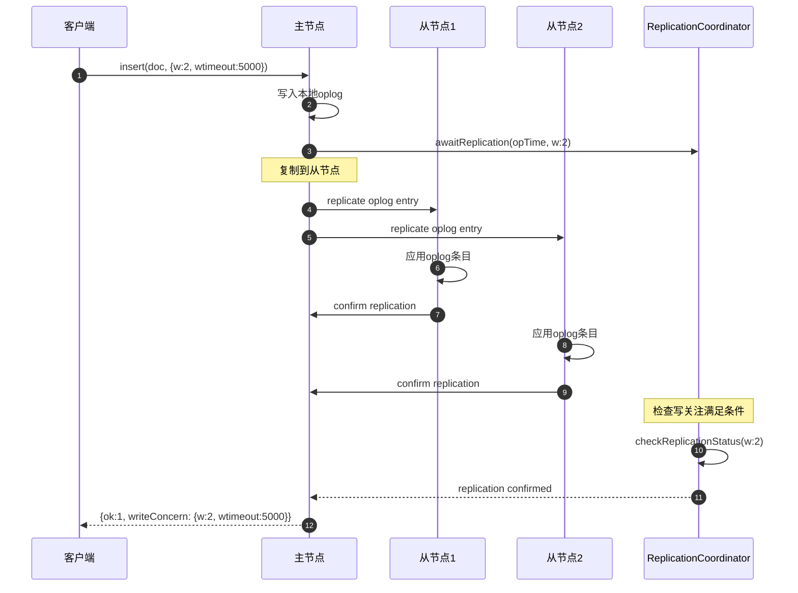
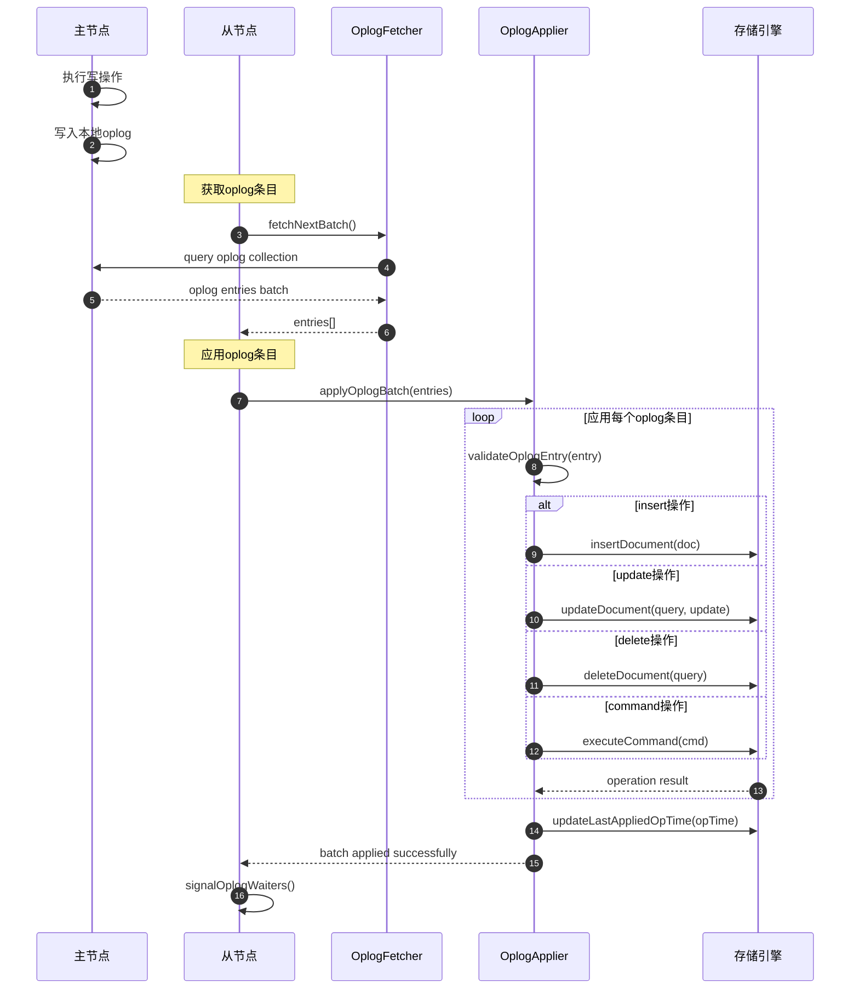

# MongoDB-12-复制模块-API

## 1. API总览

复制模块是MongoDB副本集功能的核心实现，提供了数据复制、一致性保证、故障转移等关键功能。主要API接口分为以下几个层次：

- **复制协调器层：** ReplicationCoordinator，管理副本集的整体状态和协调
- **存储接口层：** StorageInterface，提供复制相关的存储操作
- **初始同步层：** InitialSyncer、DatabaseCloner、CollectionCloner，处理新节点的初始数据同步
- **Oplog处理层：** OplogApplier、OplogFetcher，处理操作日志的获取和应用
- **选举投票层：** TopologyCoordinator，处理副本集选举逻辑

## 2. 核心API接口

### 2.1 ReplicationCoordinator - 复制协调器

#### 基本信息
- **名称：** `ReplicationCoordinator`
- **协议/方法：** C++ 抽象基类，复制系统的主要接口
- **幂等性：** 根据具体操作而定

#### 请求结构体
```cpp
// 复制协调器核心接口
class ReplicationCoordinator : public SyncSourceSelector {
public:
    // 启动复制系统
    virtual void startup(OperationContext* opCtx,
                        StorageEngine* storageEngine) = 0;

    // 关闭复制系统
    virtual void shutdown(OperationContext* opCtx,
                         BSONObjBuilder* shutdownTimeElapsedBuilder) = 0;

    // 获取复制模式
    virtual ReplicationMode getReplicationMode() const = 0;

    // 设置副本集配置
    virtual Status processReplSetReconfig(OperationContext* opCtx,
                                        const ReplSetReconfigArgs& args,
                                        BSONObjBuilder* resultObj) = 0;

    // 等待写关注
    virtual StatusAndDuration awaitReplication(
        OperationContext* opCtx,
        const OpTime& opTime,
        const WriteConcernOptions& writeConcern) = 0;

    // 步进为主节点
    virtual StatusWith<OpTime> stepUp(OperationContext* opCtx,
                                     const BSONObj& obj,
                                     bool force,
                                     bool skipDryRun) = 0;

    // 步退为从节点
    virtual Status stepDown(OperationContext* opCtx,
                          bool force,
                          const Milliseconds& waitTime,
                          const Milliseconds& stepdownTime) = 0;
};
```

| 字段 | 类型 | 必填 | 默认 | 约束 | 说明 |
|---|---|---:|---|---|---|
| opCtx | OperationContext* | 是 | - | 非空 | 操作上下文 |
| storageEngine | StorageEngine* | 是 | - | 非空 | 存储引擎指针 |
| args | ReplSetReconfigArgs& | 是 | - | - | 副本集重配置参数 |
| writeConcern | WriteConcernOptions& | 是 | - | - | 写关注选项 |
| opTime | OpTime& | 是 | - | - | 操作时间戳 |
| force | bool | 否 | false | - | 是否强制执行 |

#### 响应结构体
```cpp
// 状态和持续时间结构
struct StatusAndDuration {
    Status status;          // 操作状态
    Milliseconds duration;  // 操作持续时间
    
    StatusAndDuration(const Status& stat, Milliseconds ms) 
        : status(stat), duration(ms) {}
};

// 复制模式枚举
enum class ReplicationMode {
    kNone,        // 无复制
    kPrimary,     // 主节点模式
    kSecondary,   // 从节点模式
    kInitialSync  // 初始同步模式
};
```

| 字段 | 类型 | 必填 | 默认 | 约束 | 说明 |
|---|---|---:|---|---|---|
| status | Status | 是 | - | - | 操作执行状态 |
| duration | Milliseconds | 是 | - | >= 0 | 操作耗时 |

#### 入口函数与关键代码
```cpp
// 复制协调器实现
class ReplicationCoordinatorImpl : public ReplicationCoordinator {
public:
    // 等待写关注实现
    StatusAndDuration awaitReplication(
        OperationContext* opCtx,
        const OpTime& opTime,
        const WriteConcernOptions& writeConcern) override {
        
        auto start = Date_t::now();
        
        // 1) 验证写关注参数
        Status wcStatus = _validateWriteConcern(writeConcern);
        if (!wcStatus.isOK()) {
            return StatusAndDuration(wcStatus, Milliseconds(0));
        }
        
        // 2) 获取当前复制状态
        stdx::unique_lock<Latch> lock(_mutex);
        if (_memberState.secondary() && writeConcern.wMode == "majority") {
            // 从节点不能满足majority写关注
            return StatusAndDuration(
                Status(ErrorCodes::NotWritablePrimary, "Not primary"),
                Milliseconds(Date_t::now() - start)
            );
        }
        
        // 3) 检查opTime是否已经被足够多的节点确认
        if (_isOpTimeReplicatedEnough(opTime, writeConcern)) {
            return StatusAndDuration(Status::OK(), 
                                   Milliseconds(Date_t::now() - start));
        }
        
        // 4) 等待复制完成
        OpTime lastCommittedOpTime = _getLastCommittedOpTime();
        if (opTime <= lastCommittedOpTime) {
            return StatusAndDuration(Status::OK(),
                                   Milliseconds(Date_t::now() - start));
        }
        
        // 5) 注册等待器
        auto waiter = std::make_shared<WaiterInfo>();
        waiter->opTime = opTime;
        waiter->writeConcern = writeConcern;
        waiter->promise = std::make_unique<Promise<void>>();
        
        _replicationWaiterList.add(waiter);
        lock.unlock();
        
        // 6) 等待信号或超时
        auto future = waiter->promise->getFuture();
        Status waitStatus = Status::OK();
        
        if (writeConcern.wTimeout != WriteConcernOptions::kNoTimeout) {
            waitStatus = future.waitFor(opCtx, Milliseconds(writeConcern.wTimeout));
        } else {
            waitStatus = future.getNoThrow(opCtx);
        }
        
        auto duration = Milliseconds(Date_t::now() - start);
        return StatusAndDuration(waitStatus, duration);
    }
    
    // 步进为主节点
    StatusWith<OpTime> stepUp(OperationContext* opCtx,
                             const BSONObj& obj,
                             bool force,
                             bool skipDryRun) override {
        
        // 1) 检查当前状态
        stdx::unique_lock<Latch> lk(_mutex);
        if (_memberState.primary()) {
            return Status(ErrorCodes::AlreadyInitialized, "Already primary");
        }
        
        if (!_memberState.secondary()) {
            return Status(ErrorCodes::NotSecondary, "Not in secondary state");
        }
        
        // 2) 检查是否满足选举条件
        if (!force && !_topCoord->checkIfElectable()) {
            return Status(ErrorCodes::NotElectable, "Node is not electable");
        }
        
        // 3) 开始选举过程
        _topCoord->processWinElection(_getLastCommittedOpTime());
        
        // 4) 设置为主节点状态
        _memberState = MemberState::RS_PRIMARY;
        
        // 5) 通知状态变更
        _externalState->signalOplogWaiters();
        
        // 6) 返回当前opTime
        OpTime electionOpTime = _getMyLastAppliedOpTime();
        lk.unlock();
        
        // 7) 记录选举日志
        LOGV2(21434, "Election succeeded, became primary");
        
        return electionOpTime;
    }

private:
    // 验证写关注
    Status _validateWriteConcern(const WriteConcernOptions& writeConcern) {
        if (writeConcern.wNumNodes < 0) {
            return Status(ErrorCodes::BadValue, "Invalid w value");
        }
        
        if (writeConcern.wTimeout < 0) {
            return Status(ErrorCodes::BadValue, "Invalid wtimeout value");
        }
        
        return Status::OK();
    }
    
    // 检查opTime是否被足够多节点确认
    bool _isOpTimeReplicatedEnough(const OpTime& opTime,
                                  const WriteConcernOptions& writeConcern) {
        
        if (writeConcern.wMode == "majority") {
            return opTime <= _getLastCommittedOpTime();
        }
        
        int confirmedNodes = 0;
        for (const auto& memberData : _memberData) {
            if (memberData.getLastAppliedOpTime() >= opTime) {
                confirmedNodes++;
            }
        }
        
        return confirmedNodes >= writeConcern.wNumNodes;
    }
};
```

#### 时序图（写关注等待）


#### 异常/回退与性能要点

**异常处理：**
- `NotWritablePrimary`：非主节点时的写关注错误
- `WriteConcernFailed`：写关注超时或失败
- `NodeNotFound`：副本集成员不存在
- `InterruptedAtShutdown`：关闭过程中的中断

**性能优化：**
- 并行复制：多线程同时向多个从节点复制
- 批量应用：批量应用oplog条目减少锁竞争  
- 写关注缓存：缓存写关注等待器减少内存分配

### 2.2 StorageInterface - 存储接口

#### 基本信息
- **名称：** `StorageInterface`
- **协议/方法：** 复制系统与存储层的抽象接口
- **幂等性：** 根据操作类型而定

#### 请求结构体
```cpp
// 存储接口核心方法
class StorageInterface {
public:
    // 插入文档
    virtual Status insertDocument(OperationContext* opCtx,
                                const NamespaceString& nss,
                                const TimestampedBSONObj& doc,
                                long long term) = 0;

    // 批量插入文档
    virtual Status insertDocuments(OperationContext* opCtx,
                                 const NamespaceString& nss,
                                 const std::vector<InsertStatement>& docs) = 0;

    // 创建oplog
    virtual Status createOplog(OperationContext* opCtx,
                              const NamespaceString& nss) = 0;

    // 查找单个文档
    virtual StatusWith<BSONObj> findSingleton(OperationContext* opCtx,
                                             const NamespaceString& nss) = 0;

    // 删除集合中的所有文档
    virtual Status deleteByFilter(OperationContext* opCtx,
                                const NamespaceString& nss,
                                const BSONObj& filter) = 0;

    // 获取集合大小
    virtual StatusWith<size_t> getCollectionSize(OperationContext* opCtx,
                                                const NamespaceString& nss) = 0;
};

// 时间戳化的BSON对象
struct TimestampedBSONObj {
    BSONObj obj;        // BSON文档
    Timestamp timestamp; // 时间戳
    
    TimestampedBSONObj(BSONObj o, Timestamp ts) 
        : obj(std::move(o)), timestamp(ts) {}
};
```

#### 入口函数与关键代码  
```cpp
// 存储接口实现
class StorageInterfaceImpl : public StorageInterface {
public:
    // 插入文档实现
    Status insertDocument(OperationContext* opCtx,
                         const NamespaceString& nss,
                         const TimestampedBSONObj& doc,
                         long long term) override {
        
        // 1) 获取集合
        AutoGetCollection autoColl(opCtx, nss, MODE_IX);
        Collection* collection = autoColl.getCollection();
        
        if (!collection) {
            return Status(ErrorCodes::NamespaceNotFound,
                         str::stream() << "Collection " << nss << " does not exist");
        }
        
        // 2) 设置时间戳
        if (!doc.timestamp.isNull()) {
            opCtx->recoveryUnit()->setTimestamp(doc.timestamp);
        }
        
        // 3) 执行插入
        WriteUnitOfWork wuow(opCtx);
        
        InsertStatement insertStmt;
        insertStmt.doc = doc.obj;
        
        Status insertStatus = collection->insertDocument(
            opCtx, insertStmt, nullptr /* opDebug */);
        
        if (!insertStatus.isOK()) {
            return insertStatus;
        }
        
        // 4) 提交事务
        wuow.commit();
        return Status::OK();
    }
    
    // 创建oplog实现
    Status createOplog(OperationContext* opCtx,
                      const NamespaceString& nss) override {
        
        // 1) 检查oplog是否已存在
        AutoGetDb autoDb(opCtx, nss.db(), MODE_X);
        Database* db = autoDb.getDb();
        
        if (db && db->getCollection(opCtx, nss)) {
            return Status(ErrorCodes::NamespaceExists,
                         str::stream() << "Oplog " << nss << " already exists");
        }
        
        // 2) 创建数据库（如果不存在）
        if (!db) {
            db = DatabaseHolder::get(opCtx)->openDb(opCtx, nss.db());
        }
        
        // 3) 设置oplog集合选项
        CollectionOptions options;
        options.capped = true;
        options.cappedSize = 192 * 1024 * 1024;  // 192MB默认大小
        options.cappedMaxDocs = -1;  // 无文档数量限制
        
        // 4) 创建oplog集合
        WriteUnitOfWork wuow(opCtx);
        
        Status createStatus = db->userCreateNS(opCtx, nss, options);
        if (!createStatus.isOK()) {
            return createStatus;
        }
        
        wuow.commit();
        
        LOGV2(21435, "Created oplog collection", "namespace"_attr = nss);
        return Status::OK();
    }
    
    // 批量插入文档
    Status insertDocuments(OperationContext* opCtx,
                          const NamespaceString& nss,
                          const std::vector<InsertStatement>& docs) override {
        
        if (docs.empty()) {
            return Status::OK();
        }
        
        // 1) 获取集合
        AutoGetCollection autoColl(opCtx, nss, MODE_IX);
        Collection* collection = autoColl.getCollection();
        
        if (!collection) {
            return Status(ErrorCodes::NamespaceNotFound,
                         str::stream() << "Collection " << nss << " not found");
        }
        
        // 2) 批量插入
        WriteUnitOfWork wuow(opCtx);
        
        for (const auto& insertStmt : docs) {
            Status insertStatus = collection->insertDocument(
                opCtx, insertStmt, nullptr);
            
            if (!insertStatus.isOK()) {
                return insertStatus;
            }
        }
        
        wuow.commit();
        return Status::OK();
    }
};
```

### 2.3 InitialSyncer - 初始同步器

#### 基本信息
- **名称：** `InitialSyncer`
- **协议/方法：** 新节点加入副本集时的数据同步接口
- **幂等性：** 支持中断后重新开始

#### 请求结构体
```cpp
// 初始同步器接口
class InitialSyncer {
public:
    // 开始初始同步
    virtual StatusWith<OpTimeAndWallTime> startup(
        OperationContext* opCtx,
        std::uint32_t initialSyncMaxAttempts) = 0;

    // 关闭初始同步
    virtual void shutdown() = 0;

    // 获取同步状态
    virtual InitialSyncState getState() const = 0;

    // 获取统计信息
    virtual BSONObj getInitialSyncProgress() const = 0;
};

// 初始同步状态枚举
enum class InitialSyncState {
    kInactive,          // 未激活
    kRunning,           // 运行中
    kComplete,          // 完成
    kFailed             // 失败
};

// 初始同步参数
struct InitialSyncOptions {
    HostAndPort syncSource;     // 同步源
    OpTime beginTimestamp;      // 开始时间戳
    bool allowRollback;         // 是否允许回滚
    std::uint32_t maxRetries;   // 最大重试次数
};
```

#### 入口函数与关键代码
```cpp
// 初始同步器实现
class InitialSyncerImpl : public InitialSyncer {
public:
    // 启动初始同步
    StatusWith<OpTimeAndWallTime> startup(
        OperationContext* opCtx,
        std::uint32_t initialSyncMaxAttempts) override {
        
        stdx::lock_guard<Latch> lock(_mutex);
        
        // 1) 检查当前状态
        if (_state != InitialSyncState::kInactive) {
            return Status(ErrorCodes::IllegalOperation,
                         "Initial sync already in progress");
        }
        
        _state = InitialSyncState::kRunning;
        _attempts = 0;
        _maxAttempts = initialSyncMaxAttempts;
        
        // 2) 开始异步同步过程
        auto future = _startSync(opCtx);
        
        // 3) 等待同步完成
        return future.getNoThrow(opCtx);
    }
    
    // 获取初始同步进度
    BSONObj getInitialSyncProgress() const override {
        stdx::lock_guard<Latch> lock(_mutex);
        
        BSONObjBuilder bob;
        bob.append("state", _getStateString(_state));
        bob.append("attempts", static_cast<int>(_attempts));
        bob.append("maxAttempts", static_cast<int>(_maxAttempts));
        
        if (_currentPhase) {
            bob.append("currentPhase", *_currentPhase);
        }
        
        if (_totalBytesToClone > 0) {
            bob.append("totalBytesToClone", static_cast<long long>(_totalBytesToClone));
            bob.append("totalBytesCloned", static_cast<long long>(_totalBytesCloned));
            
            double progress = static_cast<double>(_totalBytesCloned) / _totalBytesToClone;
            bob.append("progress", progress);
        }
        
        return bob.obj();
    }

private:
    // 开始同步过程
    Future<OpTimeAndWallTime> _startSync(OperationContext* opCtx) {
        return _executor->submit([this, opCtx] {
            return _runInitialSync(opCtx);
        });
    }
    
    // 执行初始同步主逻辑
    StatusWith<OpTimeAndWallTime> _runInitialSync(OperationContext* opCtx) {
        
        while (_attempts < _maxAttempts) {
            _attempts++;
            
            try {
                // 1) 选择同步源
                HostAndPort syncSource = _chooseSyncSource(opCtx);
                if (syncSource.empty()) {
                    return Status(ErrorCodes::InitialSyncFailure,
                                "No suitable sync source found");
                }
                
                // 2) 连接到同步源
                auto clientStatus = _connectToSyncSource(syncSource);
                if (!clientStatus.isOK()) {
                    continue;  // 重试
                }
                
                // 3) 获取开始时间点
                _currentPhase = "getting initial sync timestamp";
                auto beginTimestamp = _getBeginTimestamp(clientStatus.getValue());
                
                // 4) 克隆所有数据库
                _currentPhase = "cloning databases";
                Status cloneStatus = _cloneDatabases(opCtx, clientStatus.getValue());
                if (!cloneStatus.isOK()) {
                    continue;  // 重试
                }
                
                // 5) 应用oplog
                _currentPhase = "applying oplog";
                auto finalOpTime = _applyOplog(opCtx, clientStatus.getValue(), beginTimestamp);
                if (!finalOpTime.isOK()) {
                    continue;  // 重试
                }
                
                // 6) 初始同步完成
                _state = InitialSyncState::kComplete;
                LOGV2(21436, "Initial sync completed successfully",
                     "finalOpTime"_attr = finalOpTime.getValue());
                
                return finalOpTime.getValue();
                
            } catch (const DBException& ex) {
                LOGV2_WARNING(21437, "Initial sync attempt failed",
                             "attempt"_attr = _attempts,
                             "error"_attr = ex.toString());
                
                if (_attempts >= _maxAttempts) {
                    _state = InitialSyncState::kFailed;
                    return ex.toStatus();
                }
                
                // 等待重试间隔
                sleepFor(Seconds(1));
            }
        }
        
        _state = InitialSyncState::kFailed;
        return Status(ErrorCodes::InitialSyncFailure,
                     "Exceeded maximum initial sync attempts");
    }
    
    // 克隆数据库
    Status _cloneDatabases(OperationContext* opCtx, DBClientConnection* client) {
        
        // 1) 获取数据库列表
        auto dbListResult = client->runCommand(
            OpMsgRequest::fromDBAndBody("admin", BSON("listDatabases" << 1)));
        
        if (!dbListResult.isOK()) {
            return dbListResult.getStatus();
        }
        
        BSONObj dbListObj = dbListResult.getValue();
        BSONElement databases = dbListObj["databases"];
        
        // 2) 克隆每个数据库
        for (auto&& dbElement : databases.Obj()) {
            BSONObj dbInfo = dbElement.Obj();
            std::string dbName = dbInfo["name"].String();
            
            // 跳过系统数据库
            if (dbName == "admin" || dbName == "local" || dbName == "config") {
                continue;
            }
            
            // 3) 克隆数据库
            Status cloneDbStatus = _cloneDatabase(opCtx, client, dbName);
            if (!cloneDbStatus.isOK()) {
                return cloneDbStatus;
            }
        }
        
        return Status::OK();
    }
};
```

## 3. Oplog处理API

### 3.1 OplogApplier - Oplog应用器

#### 基本信息
- **名称：** `OplogApplier`
- **协议/方法：** 处理oplog条目应用的接口
- **幂等性：** 支持幂等应用（重复应用相同oplog条目）

#### 请求结构体
```cpp
// Oplog应用器接口
class OplogApplier {
public:
    // 应用oplog条目批次
    virtual StatusWith<OpTime> applyOplogBatch(
        OperationContext* opCtx,
        const std::vector<OplogEntry>& entries) = 0;

    // 获取应用统计信息
    virtual OplogApplierStats getStats() const = 0;

    // 设置应用模式
    virtual void setApplyMode(ApplyMode mode) = 0;
};

// 应用模式枚举
enum class ApplyMode {
    kInitialSync,       // 初始同步模式
    kSecondary,         // 从节点模式  
    kRecovering        // 恢复模式
};

// Oplog条目结构
class OplogEntry {
private:
    BSONObj _raw;              // 原始BSON
    OpTime _opTime;            // 操作时间
    OpTypeEnum _opType;        // 操作类型
    NamespaceString _nss;      // 命名空间
    BSONObj _o;                // 操作对象
    boost::optional<BSONObj> _o2;  // 更新条件（update操作）
    
public:
    OpTime getOpTime() const { return _opTime; }
    OpTypeEnum getOpType() const { return _opType; }
    NamespaceString getNss() const { return _nss; }
    BSONObj getObject() const { return _o; }
    boost::optional<BSONObj> getObject2() const { return _o2; }
};
```

#### 时序图（Oplog应用）


## 4. 副本集配置API

### 4.1 ReplSetConfig - 副本集配置

#### 基本信息
- **名称：** `ReplSetConfig`
- **协议/方法：** 副本集配置管理接口
- **幂等性：** 配置更新操作支持版本控制

#### 请求结构体
```cpp
// 副本集配置类
class ReplSetConfig {
private:
    BSONObj _raw;                           // 原始配置
    std::string _replSetName;               // 副本集名称
    ConfigVersionAndTerm _versionAndTerm;   // 配置版本和任期
    std::vector<MemberConfig> _members;     // 成员配置列表
    WriteConcernOptions _defaultWriteConcern; // 默认写关注
    
public:
    // 获取副本集名称
    const std::string& getReplSetName() const { return _replSetName; }
    
    // 获取配置版本
    long long getConfigVersion() const { return _versionAndTerm.version; }
    
    // 获取成员数量
    int getNumMembers() const { return _members.size(); }
    
    // 获取指定成员配置
    const MemberConfig& getMemberAt(size_t i) const { return _members[i]; }
    
    // 查找成员
    const MemberConfig* findMemberByHostAndPort(const HostAndPort& hap) const;
    
    // 验证配置
    Status validate() const;
    
    // 检查是否为有效的大多数
    bool isValidMajority(const std::set<int>& memberIds) const;
};

// 成员配置
class MemberConfig {
private:
    int _id;                    // 成员ID
    HostAndPort _host;          // 主机地址
    int _priority;              // 优先级
    Seconds _slaveDelay;        // 从节点延迟
    bool _hidden;               // 是否隐藏
    bool _buildIndexes;         // 是否构建索引
    int _votes;                 // 投票数
    std::set<std::string> _tags; // 标签集合
    
public:
    int getId() const { return _id; }
    const HostAndPort& getHostAndPort() const { return _host; }
    int getPriority() const { return _priority; }
    bool isVoter() const { return _votes > 0; }
    bool isHidden() const { return _hidden; }
    bool shouldBuildIndexes() const { return _buildIndexes; }
};
```

## 5. 选举投票API

### 5.1 TopologyCoordinator - 拓扑协调器

#### 基本信息
- **名称：** `TopologyCoordinator`  
- **协议/方法：** 处理副本集拓扑和选举逻辑
- **幂等性：** 选举过程具有确定性结果

#### 入口函数与关键代码
```cpp
// 拓扑协调器核心方法
class TopologyCoordinator {
public:
    // 处理选举胜利
    void processWinElection(OpTime electionOpTime) {
        
        // 1) 设置为主节点状态
        _role = Role::kLeader;
        _leaderTerm++;
        _lastCommittedOpTime = electionOpTime;
        
        // 2) 重置所有成员状态
        for (auto& memberData : _memberData) {
            memberData.setLastAppliedOpTime(OpTime());
            memberData.setLastDurableOpTime(OpTime());
        }
        
        // 3) 记录选举时间
        _electionTime = _now();
        
        LOGV2(21438, "Election won, became primary",
             "term"_attr = _leaderTerm,
             "electionTime"_attr = _electionTime);
    }
    
    // 处理心跳响应
    HeartbeatResponseAction processHeartbeatResponse(
        Date_t now,
        Milliseconds networkRoundTripTime,
        const HostAndPort& target,
        const StatusWith<ReplSetHeartbeatResponse>& hbResponse) {
        
        // 1) 查找目标成员
        int targetIndex = _findMemberIndexByHostAndPort(target);
        if (targetIndex < 0) {
            return HeartbeatResponseAction::makeNoAction();
        }
        
        MemberData& member = _memberData[targetIndex];
        
        // 2) 处理心跳失败
        if (!hbResponse.isOK()) {
            member.setDownValues(now, hbResponse.getStatus().reason());
            return _checkForElectionHandoff();
        }
        
        // 3) 处理心跳成功
        const ReplSetHeartbeatResponse& response = hbResponse.getValue();
        
        member.setUpValues(
            now,
            response.getState(),
            response.getElectionTime(),
            response.getAppliedOpTime(),
            response.getDurableOpTime()
        );
        
        // 4) 检查是否需要重新选举
        if (_role == Role::kFollower && _shouldStartElection(now)) {
            return HeartbeatResponseAction::makeElectAction();
        }
        
        return HeartbeatResponseAction::makeNoAction();
    }
    
    // 检查是否应该开始选举
    bool _shouldStartElection(Date_t now) const {
        
        // 1) 检查是否在选举超时窗口内
        if (now < _electionTimeoutWhen) {
            return false;
        }
        
        // 2) 检查是否有足够的投票数
        int votingMembersCount = 0;
        int availableVotingMembersCount = 0;
        
        for (const auto& memberData : _memberData) {
            if (memberData.getConfigIndex() >= 0) {
                const MemberConfig& memberConfig = 
                    _rsConfig.getMemberAt(memberData.getConfigIndex());
                
                if (memberConfig.isVoter()) {
                    votingMembersCount++;
                    
                    if (memberData.getState().readable() || 
                        memberData.isSelf()) {
                        availableVotingMembersCount++;
                    }
                }
            }
        }
        
        // 3) 需要大多数节点可用才能选举
        int majorityVotes = votingMembersCount / 2 + 1;
        return availableVotingMembersCount >= majorityVotes;
    }
};
```

## 6. 错误处理与监控

### 6.1 常见错误码

| 错误码 | 含义 | 处理策略 |
|---|---|---|
| NotWritablePrimary | 非主节点写入 | 重新选择主节点或等待选举 |
| WriteConcernFailed | 写关注失败 | 检查副本集状态和网络连接 |
| InitialSyncFailure | 初始同步失败 | 重新选择同步源，清理本地数据 |
| OplogStartMissing | Oplog起始点缺失 | 执行初始同步重建数据 |
| CursorNotFound | 游标不存在 | 重新创建游标继续同步 |
| HostUnreachable | 主机不可达 | 更新副本集配置或修复网络 |

### 6.2 性能监控指标

```cpp
// 复制统计信息
struct ReplicationStats {
    // Oplog相关
    long long oplogSizeMB;          // Oplog大小
    OpTime lastAppliedOpTime;       // 最后应用的OpTime
    OpTime lastDurableOpTime;       // 最后持久化的OpTime
    
    // 同步相关
    long long syncSourceLagMillis;  // 同步源延迟
    long long appliedOpsPerSecond;  // 每秒应用操作数
    long long networBytesPerSecond; // 每秒网络字节数
    
    // 选举相关
    long long electionTerm;         // 选举任期
    Date_t electionTime;           // 选举时间
    int votingMembers;             // 投票成员数
    int healthyMembers;            // 健康成员数
};
```

---

**文档版本：** v1.0  
**生成时间：** 2025-10-05  
**适用版本：** MongoDB 8.0+
