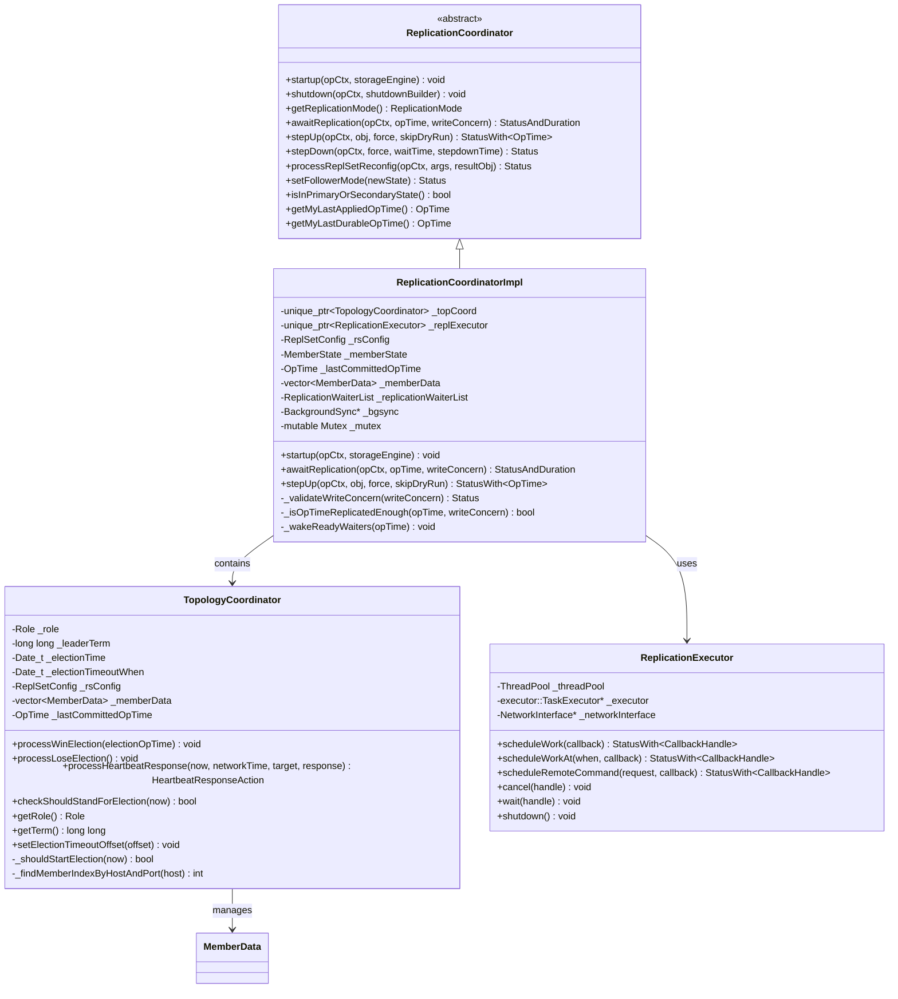
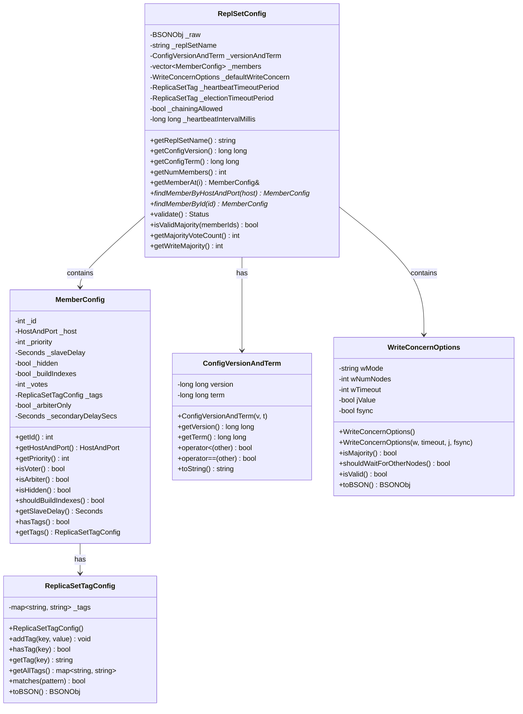
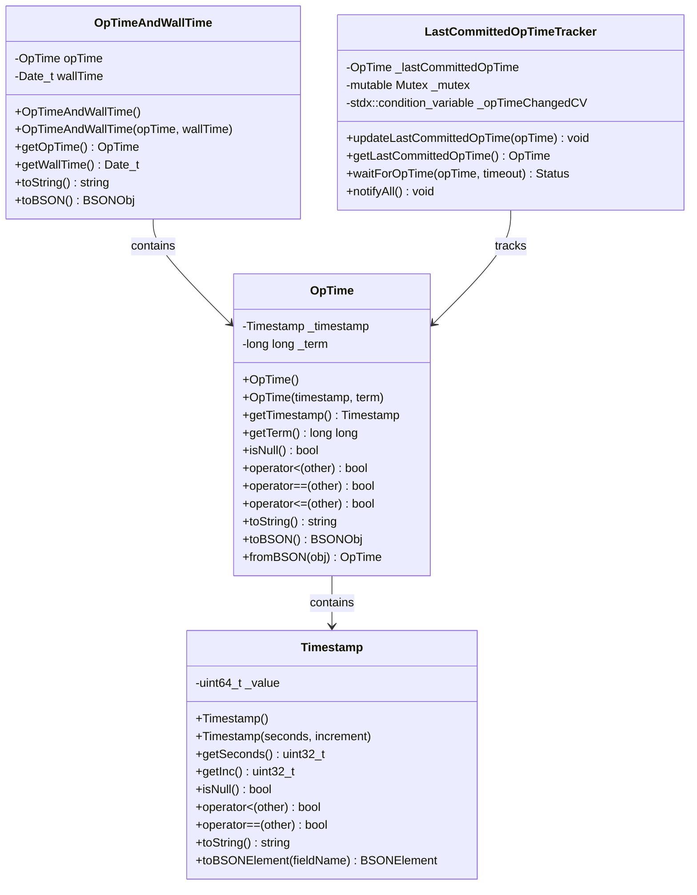
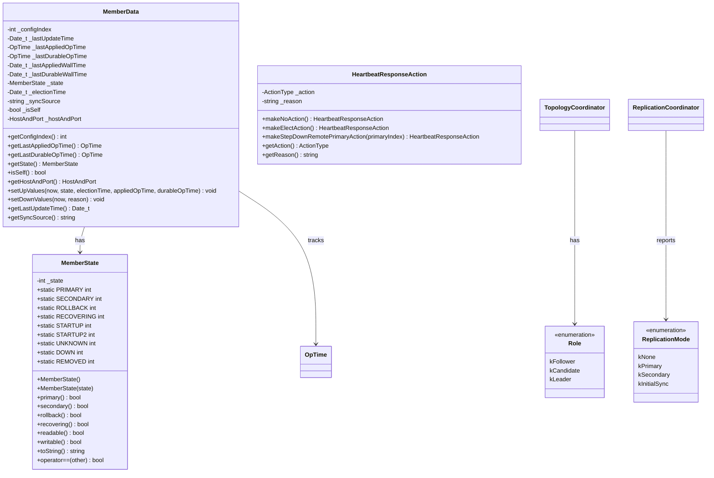
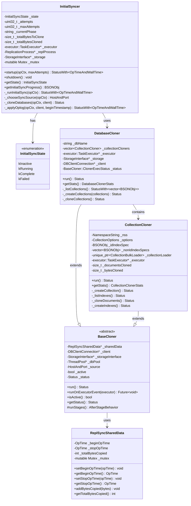
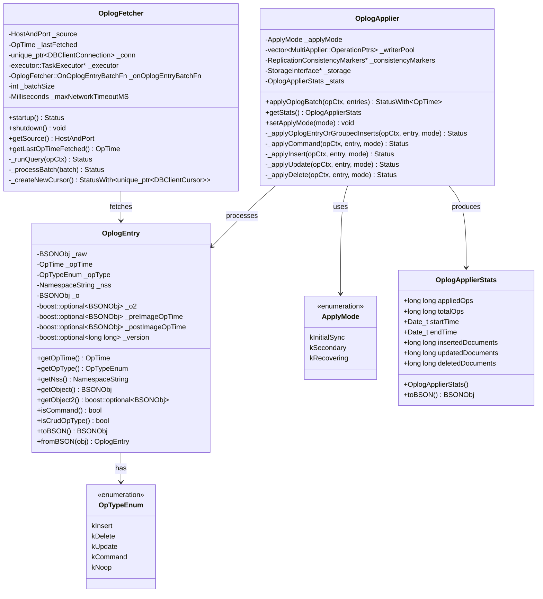
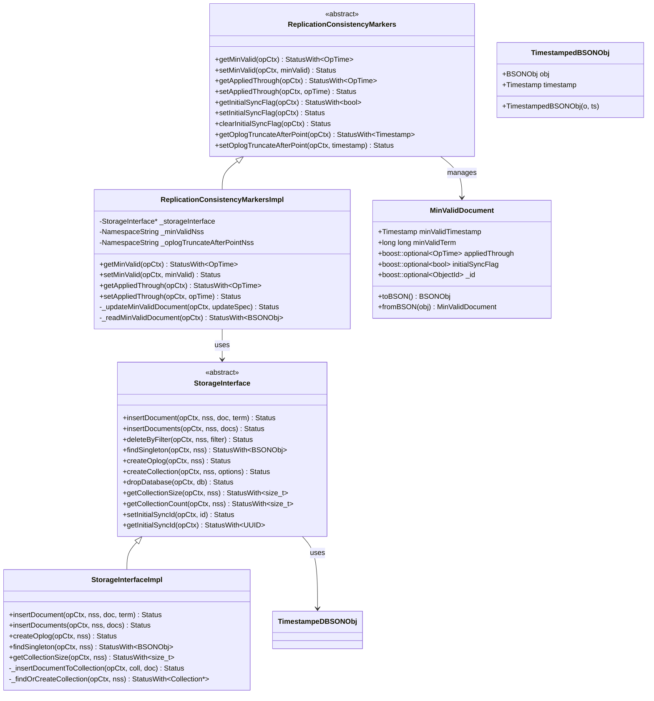
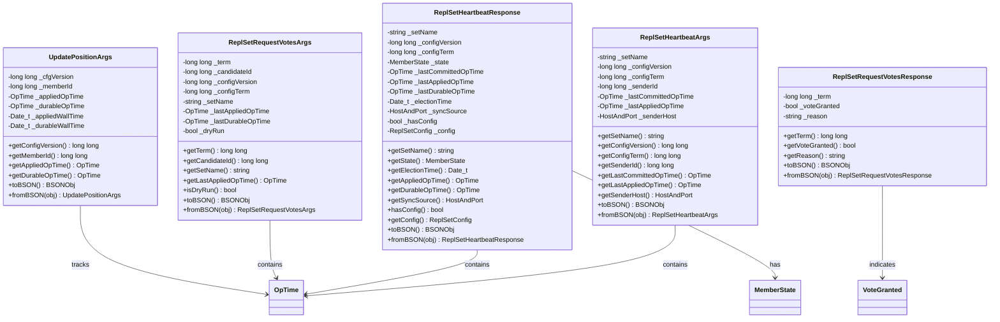
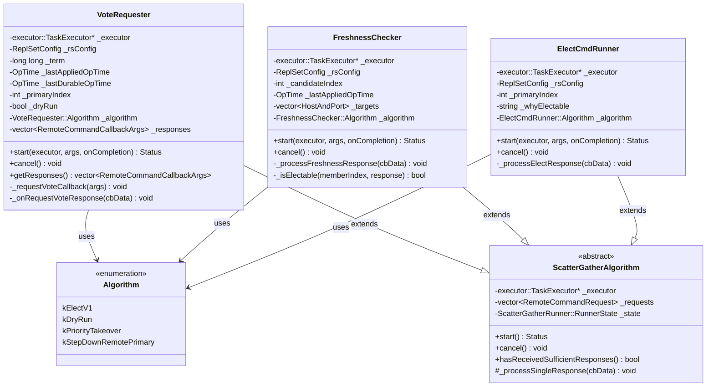

# MongoDB-12-复制模块-数据结构

## 1. 核心数据结构概览

复制模块的数据结构设计实现了MongoDB副本集的完整功能，包括数据复制、故障转移、一致性保证等核心特性。数据结构按功能分为几个主要层次：

### 1.1 数据结构分类

- **协调器层：** ReplicationCoordinator、TopologyCoordinator
- **配置管理层：** ReplSetConfig、MemberConfig
- **时间戳管理层：** OpTime、OpTimeAndWallTime
- **同步处理层：** InitialSyncer、OplogApplier、OplogFetcher
- **存储接口层：** StorageInterface、ReplicationConsistencyMarkers
- **状态管理层：** MemberState、ReplicationMode

## 2. 核心类图

### 2.1 复制协调器类图

### 2.2 副本集配置类图

### 2.3 时间戳和操作时间类图

### 2.4 成员状态和数据类图

### 2.5 初始同步数据结构类图

### 2.6 Oplog处理数据结构类图

## 3. 存储接口数据结构

### 3.1 存储接口和一致性标记类图

## 4. 网络和心跳数据结构

### 4.1 心跳和网络通信类图

## 5. 选举和投票数据结构

### 5.1 选举过程数据结构类图

## 6. 字段映射和约束

### 6.1 主要数据结构字段映射

| 数据结构 | 主要字段 | 数据类型 | 约束条件 | 说明 |
|---------|---------|----------|----------|------|
| OpTime | _timestamp | Timestamp | 非空 | 操作时间戳 |
| OpTime | _term | long long | >= -1 | 选举任期，-1表示PV0 |
| ReplSetConfig | _replSetName | string | 非空，最大127字符 | 副本集名称 |
| ReplSetConfig | _members | vector<MemberConfig> | 1-50个成员 | 成员配置列表 |
| MemberConfig | _id | int | 0-255 | 成员唯一ID |
| MemberConfig | _priority | int | 0-1000 | 选举优先级 |
| MemberConfig | _votes | int | 0-1 | 投票权重 |
| WriteConcernOptions | wNumNodes | int | >= 0 | 需要确认的节点数 |
| WriteConcernOptions | wTimeout | int | >= 0 | 等待超时时间(毫秒) |

### 6.2 状态转换约束

| 状态类型 | 允许的转换 | 限制条件 |
|---------|-----------|----------|
| MemberState | PRIMARY → SECONDARY | 只能通过stepDown |
| MemberState | SECONDARY → PRIMARY | 需要选举胜利 |
| MemberState | STARTUP → SECONDARY | 初始同步完成 |
| InitialSyncState | kInactive → kRunning | 调用startup() |
| InitialSyncState | kRunning → kComplete | 同步成功完成 |
| InitialSyncState | kRunning → kFailed | 超过最大重试次数 |

### 6.3 版本兼容性

| 协议版本 | 支持特性 | 兼容性 |
|---------|---------|--------|
| PV0 | 旧版本选举协议 | 已废弃 |
| PV1 | Raft-based选举 | 当前标准 |
| v4.4+ | 多数写关注 | 向后兼容 |
| v5.0+ | 快照读取 | 向后兼容 |

---

**文档版本：** v1.0  
**生成时间：** 2025-10-05  
**适用版本：** MongoDB 8.0+
