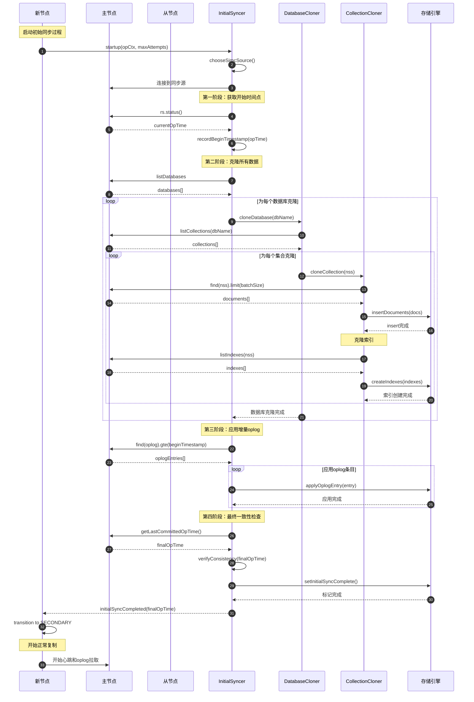
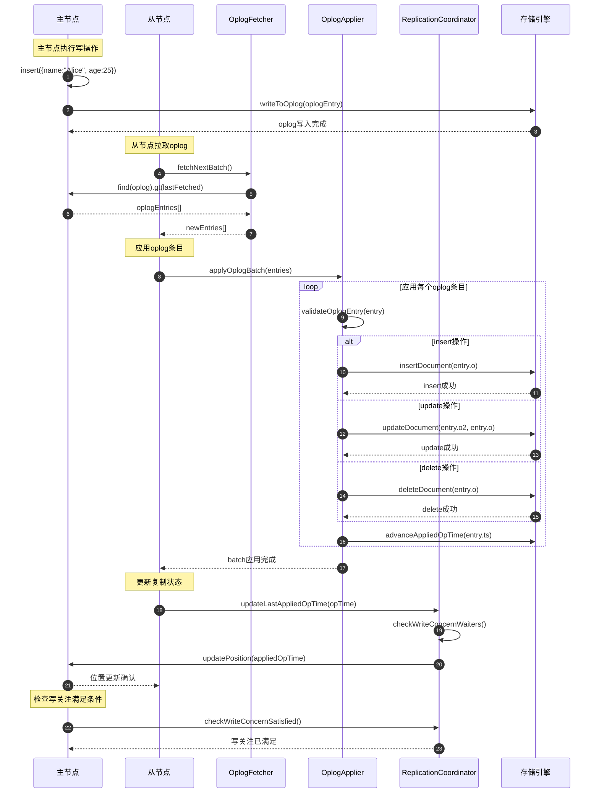
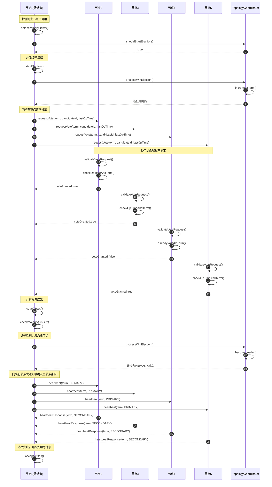
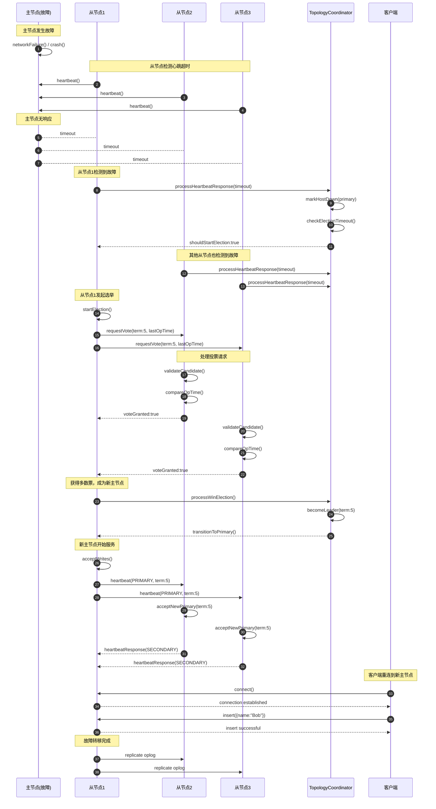
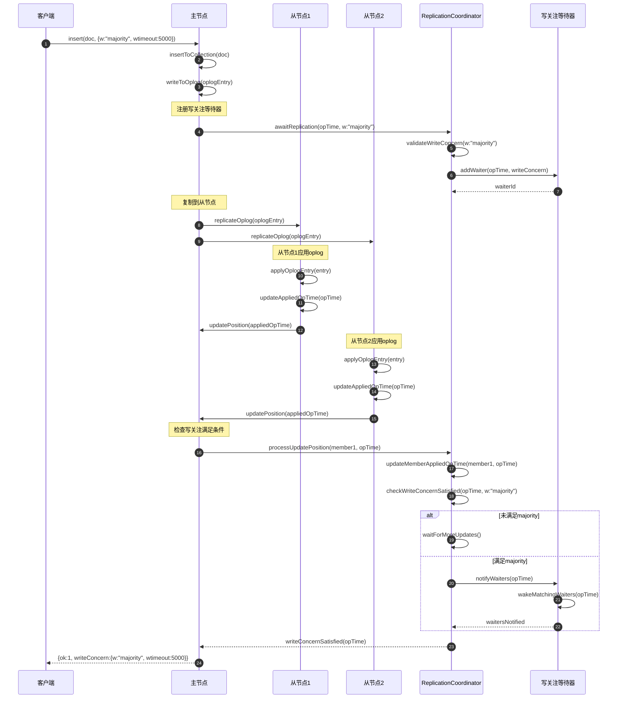
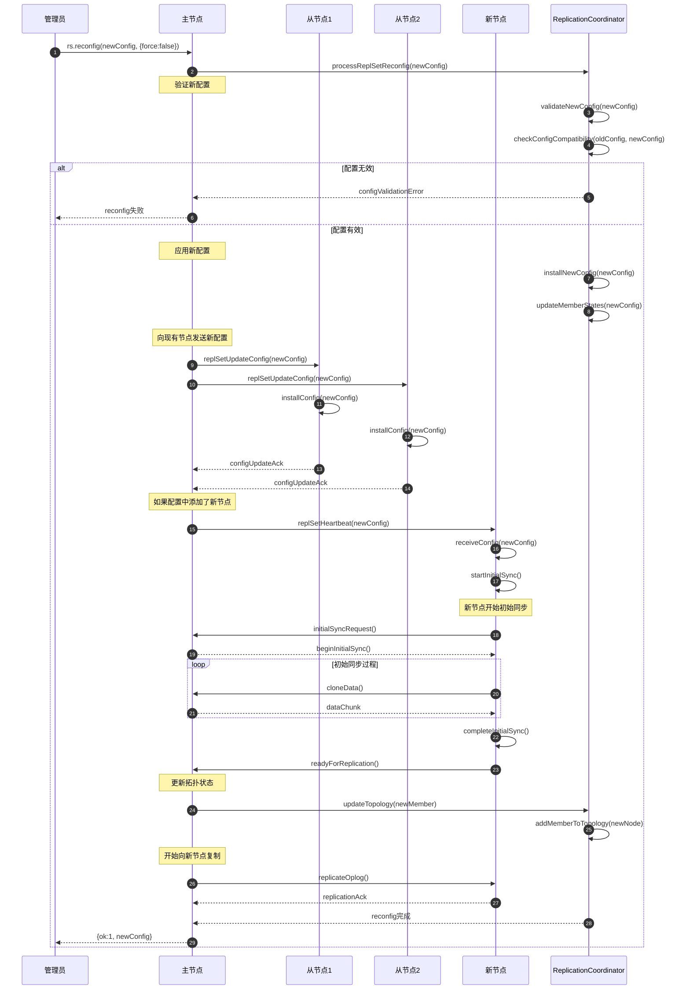
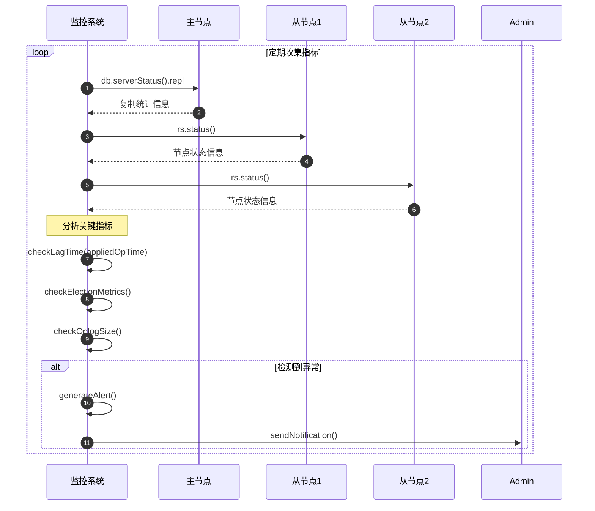

# MongoDB-12-复制模块-时序图

## 1. 时序图概览

复制模块的时序图展示了MongoDB副本集各种核心场景的完整流程，包括初始同步、日常复制、选举过程、故障转移等关键操作。每个时序图都体现了分布式系统中节点间的协作和数据一致性保证。

## 2. 初始同步时序图

### 2.1 新节点加入副本集



#### 2.1.1 图意概述
新节点初始同步采用四阶段流程：确定起始点、克隆数据、应用增量、验证一致性，确保新节点与副本集数据完全同步。

#### 2.1.2 关键字段/接口
- `startup`：启动初始同步过程
- `chooseSimcSource`：选择同步源节点
- `cloneDatabase`：数据库级别的克隆
- `applyOplogEntry`：应用单个oplog条目

#### 2.1.3 边界条件
- **时间窗口：** 初始同步期间的oplog时间窗口管理
- **网络断连：** 同步过程中的网络中断处理
- **存储空间：** 目标节点的存储容量检查
- **并发限制：** 同时进行初始同步的节点数量限制

#### 2.1.4 异常与回退
- 同步源不可用时自动选择其他节点
- 网络中断时支持断点续传
- 存储空间不足时暂停并报告错误
- 数据不一致时重新开始初始同步

### 2.2 增量数据同步



#### 2.2.1 图意概述
增量同步是副本集的核心机制，从节点持续拉取主节点的oplog并应用，保持数据最终一致性。

#### 2.2.2 关键字段/接口
- `fetchNextBatch`：获取下一批oplog条目
- `applyOplogBatch`：批量应用oplog条目
- `updatePosition`：向主节点报告应用进度
- `checkWriteConcernSatisfied`：检查写关注是否满足

#### 2.2.3 边界条件
- **批次大小：** oplog批次的大小控制和内存限制
- **应用延迟：** 从节点的最大允许延迟时间
- **网络带宽：** oplog传输的网络带宽限制
- **存储性能：** 应用速度与存储I/O性能的平衡

## 3. 选举过程时序图

### 3.1 主节点选举



#### 3.1.1 图意概述
主节点选举基于Raft协议，候选节点请求大多数节点投票，获得多数票后成为新主节点并向集群广播身份。

#### 3.1.2 关键字段/接口
- `detectPrimaryDown`：检测主节点故障
- `requestVote`：向其他节点请求投票
- `validateVoteRequest`：验证投票请求的合法性
- `processWinElection`：处理选举胜利

#### 3.1.3 边界条件
- **投票超时：** 投票请求的超时时间设置
- **任期管理：** 选举任期的单调递增保证
- **网络分区：** 网络分区情况下的选举行为
- **并发选举：** 多个节点同时发起选举的处理

#### 3.1.4 异常与回退
- 投票超时时重新发起选举
- 网络分区时等待分区恢复
- 选举失败时退回到从节点状态
- 发现更高任期时放弃选举

### 3.2 主节点步退

```mermaid
sequenceDiagram
    autonumber
    participant Client as 客户端
    participant Primary as 主节点
    participant Secondary1 as 从节点1
    participant Secondary2 as 从节点2
    participant RC as ReplicationCoordinator
    
    Client->>Primary: rs.stepDown(120)
    Primary->>RC: stepDown(force:false, waitTime:120s)
    
    Note over Primary: 检查步退条件
    RC->>RC: validateStepDownRequest()
    RC->>RC: checkCatchUpStatus()
    
    alt 从节点未追上
        RC->>Primary: 等待从节点追上
        Primary->>Primary: waitForCatchUp(120s)
        
        loop 等待从节点同步
            Primary->>Secondary1: checkAppliedOpTime()
            Primary->>Secondary2: checkAppliedOpTime()
            Secondary1-->>Primary: appliedOpTime
            Secondary2-->>Primary: appliedOpTime
            
            alt 从节点已追上
                Primary->>Primary: 追上主节点，继续步退
                break 退出等待循环
            end
            
            Note over Primary: 检查超时
            alt 超时未追上
                Primary-->>Client: stepDown失败(从节点未追上)
                break 退出步退流程
            end
        end
    end
    
    Note over Primary: 执行步退
    Primary->>RC: executeStepDown()
    RC->>RC: transitionToSecondary()
    RC->>RC: setFollowerMode(SECONDARY)
    
    Note over Primary→Secondary1: 状态转换完成
    Primary->>Primary: stopAcceptingWrites()
    Primary->>Primary: killClientCursors()
    Primary->>Primary: dropConnections()
    
    Note over Primary: 通知其他节点状态变更
    Primary->>Secondary1: heartbeat(SECONDARY)
    Primary->>Secondary2: heartbeat(SECONDARY)
    
    Secondary1-->>Primary: heartbeatResponse()
    Secondary2-->>Primary: heartbeatResponse()
    
    Note over Secondary1,Secondary2: 其他节点检测主节点状态变更
    Secondary1->>Secondary1: detectPrimaryStepDown()
    Secondary2->>Secondary2: detectPrimaryStepDown()
    
    Note over Secondary1: 可能触发新的选举
    Secondary1->>Secondary1: startElectionIfNeeded()
    
    Primary-->>Client: stepDown成功
```

#### 3.2.1 图意概述
主节点步退是主动的状态转换，确保从节点数据同步后再停止写入服务，维护集群的可用性。

#### 3.2.2 关键字段/接口
- `stepDown`：主节点步退命令
- `validateStepDownRequest`：验证步退请求
- `waitForCatchUp`：等待从节点数据追上
- `transitionToSecondary`：转换为从节点状态

#### 3.2.3 边界条件
- **等待超时：** 等待从节点追上的最大时间
- **强制步退：** 不等待从节点的强制步退模式
- **客户端连接：** 步退时的客户端连接处理
- **游标管理：** 现有查询游标的清理

## 4. 故障转移时序图

### 4.1 主节点故障检测与转移



#### 4.1.1 图意概述
故障转移通过心跳机制检测主节点故障，从节点自动发起选举选出新主节点，确保服务连续性。

#### 4.1.2 关键字段/接口
- `processHeartbeatResponse`：处理心跳响应
- `markHostDown`：标记节点为不可用
- `checkElectionTimeout`：检查选举超时
- `acceptNewPrimary`：接受新主节点

#### 4.1.3 边界条件
- **心跳超时：** 心跳检测的超时阈值设置
- **选举窗口：** 多个节点同时发起选举的处理
- **脑裂防护：** 防止出现多个主节点的机制
- **客户端切换：** 客户端自动发现新主节点

## 5. 写关注等待时序图

### 5.1 多数写关注实现



#### 5.1.1 图意概述
写关注确保数据复制到指定数量的节点后才向客户端确认，提供不同级别的持久性保证。

#### 5.1.2 关键字段/接口
- `awaitReplication`：等待复制完成
- `addWaiter`：添加写关注等待器
- `updatePosition`：更新节点复制位置
- `checkWriteConcernSatisfied`：检查写关注是否满足

#### 5.1.3 边界条件
- **超时处理：** 写关注等待超时的处理机制
- **节点数量：** 不同写关注模式的节点数量要求
- **网络延迟：** 网络延迟对写关注性能的影响
- **内存管理：** 写关注等待器的内存使用管理

## 6. 配置变更时序图

### 6.1 副本集重配置



#### 6.1.1 图意概述
副本集重配置支持动态添加、删除节点或修改配置参数，通过配置版本控制确保集群状态一致性。

#### 6.1.2 关键字段/接口
- `processReplSetReconfig`：处理重配置请求
- `validateNewConfig`：验证新配置合法性
- `installNewConfig`：安装新配置
- `replSetUpdateConfig`：向节点发送配置更新

#### 6.1.3 边界条件
- **配置版本：** 配置版本的单调递增保证
- **节点状态：** 重配置时的节点状态检查
- **安全限制：** 不能移除过多投票节点的限制
- **回滚处理：** 配置应用失败时的回滚机制

## 7. 版本兼容与演进

### 7.1 版本兼容性说明

1. **协议版本演进：**
   - PV0 → PV1：从传统选举协议升级到Raft-based协议
   - MongoDB 4.0+：引入多数读关注
   - MongoDB 4.2+：优化初始同步性能
   - MongoDB 5.0+：支持时间点恢复

2. **接口向后兼容：**
   - 旧版本客户端可以连接新版本副本集
   - 心跳协议保持向后兼容
   - oplog格式演进保持兼容性

3. **性能优化历史：**
   - 并行初始同步：提高数据克隆效率
   - 批量oplog应用：减少应用延迟
   - 智能同步源选择：优化网络拓扑感知

### 7.2 监控和可观测性



---

**文档版本：** v1.0  
**生成时间：** 2025-10-05  
**适用版本：** MongoDB 8.0+
