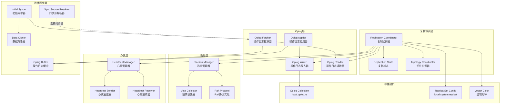
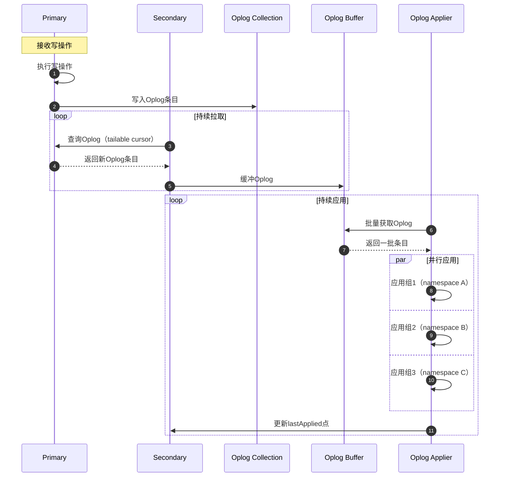

# MongoDB-12-复制模块-概览

## 1. 模块职责

复制模块（`src/mongo/db/repl`）实现MongoDB的高可用性和数据冗余机制。通过维护多个数据副本，确保在节点故障时系统仍能正常运行，并提供数据持久性保证。

### 1.1 主要功能

- **副本集管理：** 管理一组mongod节点组成的副本集
- **主节点选举：** 使用Raft-like协议自动选举Primary节点
- **Oplog复制：** 通过操作日志实现数据同步
- **心跳检测：** 监控集群成员健康状态
- **数据同步：** 初始同步和增量同步机制
- **读写分离：** 支持从Secondary节点读取数据
- **写关注控制：** 可配置写操作的持久性保证

### 1.2 输入/输出

**输入：**
- 副本集配置（成员列表、优先级、投票权等）
- 写操作请求
- Oplog条目
- 心跳消息

**输出：**
- 复制状态报告
- Oplog流
- 选举结果
- 同步进度

### 1.3 上下游依赖

**依赖模块（上游）：**
- db-storage：Oplog持久化
- rpc：节点间通信
- executor：异步任务执行
- base：错误处理和基础类型

**被依赖模块（下游）：**
- db-commands：命令需要检查副本集状态
- db-query：读关注实现依赖复制状态
- s：分片集群依赖副本集

### 1.4 生命周期

1. **启动阶段：** 初始化复制协调器，加载配置
2. **选举阶段：** 参与或发起Primary选举
3. **运行阶段：** Primary接收写入，Secondary复制数据
4. **故障转移：** Primary失效时自动选举新Primary
5. **关闭阶段：** 安全停止复制，保存状态

## 2. 模块架构

### 2.1 架构图



### 2.2 架构说明

#### 2.2.1 图意概述

该架构图展示了MongoDB复制模块的六层结构：协调层、选举层、心跳层、Oplog层、同步层和存储层。复制协调器是核心组件，统筹选举、心跳、Oplog管理和数据同步。

#### 2.2.2 核心组件职责

**复制协调层：**
- `ReplicationCoordinator`：复制系统的中央控制器，协调所有子系统
- `ReplicationState`：维护当前节点状态（Primary/Secondary/Arbiter等）
- `TopologyCoordinator`：管理副本集拓扑信息和成员状态

**选举层：**
- `ElectionManager`：管理选举流程，决定何时发起选举
- `VoteCollector`：收集选举投票，判断是否获得多数支持
- `RaftProtocol`：实现Raft-like共识协议

**心跳层：**
- `HeartbeatManager`：调度心跳发送和接收
- `HeartbeatSender`：向其他节点发送心跳请求
- `HeartbeatReceiver`：处理接收到的心跳响应

**Oplog层：**
- `OplogWriter`：将写操作记录到Oplog
- `OplogReader`：从Oplog读取操作记录
- `OplogFetcher`：从同步源拉取Oplog条目
- `OplogApplier`：应用Oplog到本地数据

**数据同步层：**
- `InitialSyncer`：协调初始同步流程
- `DataCloner`：克隆数据快照
- `OplogBuffer`：缓冲待应用的Oplog条目
- `SyncSourceResolver`：选择最佳同步源

**存储接口：**
- `OplogCollection`：`local.oplog.rs`集合，存储操作日志
- `ReplicaSetConfig`：`local.system.replset`集合，存储副本集配置
- `VectorClock`：逻辑时钟，用于因果一致性

#### 2.2.3 关键边界条件

1. **副本集成员数量：**
   - 最多50个成员（包括Arbiter）
   - 最多7个有投票权的成员
   - 至少需要3个成员才能自动故障转移

2. **选举超时：**
   - 心跳间隔：默认2秒
   - 选举超时：默认10秒
   - 优先级0的成员不能成为Primary

3. **Oplog大小：**
   - 默认：数据盘5%（最小990MB，最大50GB）
   - 可配置：`oplogSizeMB`参数
   - 循环覆盖：Oplog满时覆盖最老条目

4. **同步延迟：**
   - 复制延迟（Replication Lag）：Secondary落后Primary的时间
   - 目标：<1秒（正常情况）
   - 警告阈值：>10秒

#### 2.2.4 异常处理与回退

1. **Primary故障：**
   - 心跳超时检测（10秒）
   - 自动发起选举
   - 选举新Primary（需多数投票）
   - 客户端重试写操作

2. **Secondary落后：**
   - 监控复制延迟
   - 落后过多：标记为不可用
   - 初始同步：Oplog太老时重新全量同步

3. **网络分区：**
   - 少数派分区：无法选举Primary
   - 多数派分区：可选举并继续服务
   - 分区恢复：自动重新加入并同步

4. **数据不一致：**
   - 检测：通过oplog验证
   - 回滚：回滚少数派节点的未复制操作
   - 恢复：从Primary重新同步

#### 2.2.5 性能关键点

1. **Oplog写入：**
   - 批量写入：多个操作合并写入
   - 并行应用：Secondary并行应用Oplog
   - 索引构建：异步构建索引，不阻塞复制

2. **心跳优化：**
   - 心跳间隔：平衡响应速度和网络开销
   - 心跳失败重试：指数退避
   - 心跳并行：向所有成员并发发送

3. **同步源选择：**
   - 优先选择：网络延迟低、数据新鲜的成员
   - 链式复制：允许从Secondary同步
   - 避免：跨数据中心同步（优先同DC）

4. **并发控制：**
   - 读锁：心跳和状态查询使用读锁
   - 写锁：配置变更使用写锁
   - 无锁操作：Oplog读取尽量无锁

#### 2.2.6 容量假设

- 副本集成员数：1-50个
- 有投票权成员：1-7个
- Oplog大小：990MB - 50GB
- 最大复制延迟：数小时（取决于Oplog大小）
- 心跳频率：每秒0.5次（2秒间隔）

#### 2.2.7 版本兼容与演进

1. **协议版本：**
   - Protocol Version 0：旧版协议（已废弃）
   - Protocol Version 1：当前协议（Raft-like）
   - 升级：滚动升级，向后兼容

2. **特性版本控制：**
   - Feature Compatibility Version（FCV）
   - 控制是否启用新特性
   - 支持混合版本副本集（升级期间）

3. **Oplog格式：**
   - v1格式：旧格式
   - v2格式：支持更多操作类型
   - 向后兼容：新节点可读取旧格式

## 3. 核心算法

### 3.1 Raft-like选举算法

#### 3.1.1 算法目的

在Primary节点失效时，自动选举新的Primary节点，确保副本集的高可用性。

#### 3.1.2 选举条件

1. **发起选举条件：**
   - 当前节点是Secondary
   - 检测到Primary失效（心跳超时）
   - 节点优先级 > 0
   - 节点数据足够新（不落后太多）

2. **投票条件：**
   - 候选者数据不比自己旧
   - 本轮选举尚未投票
   - 候选者优先级 >= 自己优先级

#### 3.1.3 核心代码

```cpp
// 选举管理器核心实现
class ElectionManager {
public:
    // 发起选举
    void startElection(OpTime lastAppliedOpTime) {
        // 1) 增加选举轮次（term）
        _currentTerm++;
        
        // 2) 投票给自己
        _votedFor = _selfId;
        _votesReceived = 1;
        
        // 3) 向所有成员请求投票
        for (const auto& member : _members) {
            if (member.id() == _selfId) {
                continue;
            }
            
            sendVoteRequest(member, _currentTerm, lastAppliedOpTime);
        }
        
        // 4) 设置选举超时
        _electionTimeout = now() + kElectionTimeoutPeriod;
    }
    
    // 处理投票请求
    VoteResponse handleVoteRequest(const VoteRequest& request) {
        VoteResponse response;
        response.term = _currentTerm;
        
        // 1) 候选者term太旧，拒绝
        if (request.term < _currentTerm) {
            response.voteGranted = false;
            response.reason = "stale term";
            return response;
        }
        
        // 2) 候选者term更新，更新自己的term
        if (request.term > _currentTerm) {
            _currentTerm = request.term;
            _votedFor = MemberId();  // 清空投票
            _stepDown();  // 如果是Primary，降级
        }
        
        // 3) 已经投票给其他候选者，拒绝
        if (_votedFor.isValid() && _votedFor != request.candidateId) {
            response.voteGranted = false;
            response.reason = "already voted for another candidate";
            return response;
        }
        
        // 4) 候选者数据太旧，拒绝
        if (request.lastAppliedOpTime < _lastAppliedOpTime) {
            response.voteGranted = false;
            response.reason = "candidate's data is stale";
            return response;
        }
        
        // 5) 投票给候选者
        _votedFor = request.candidateId;
        response.voteGranted = true;
        return response;
    }
    
    // 处理投票响应
    void handleVoteResponse(const VoteResponse& response) {
        // 1) 响应term更新，降级
        if (response.term > _currentTerm) {
            _currentTerm = response.term;
            _stepDown();
            return;
        }
        
        // 2) 响应term过旧，忽略
        if (response.term < _currentTerm) {
            return;
        }
        
        // 3) 获得投票
        if (response.voteGranted) {
            _votesReceived++;
            
            // 4) 检查是否获得多数票
            if (_votesReceived > _members.size() / 2) {
                _becomeLeader();
            }
        }
    }
    
    // 成为Primary
    void _becomeLeader() {
        _state = MemberState::RS_PRIMARY;
        
        // 1) 记录no-op条目到Oplog
        // 用于确认自己是Primary，并推进commit point
        OplogEntry noopEntry;
        noopEntry.setTerm(_currentTerm);
        noopEntry.setOpType(OpTypeEnum::kNoop);
        _oplogWriter->write(noopEntry);
        
        // 2) 开始发送心跳
        _heartbeatManager->startSendingHeartbeats();
        
        // 3) 通知应用层
        _notifyStateChange();
    }

private:
    long long _currentTerm;     // 当前选举轮次
    MemberId _votedFor;         // 本轮投票给谁
    int _votesReceived;         // 获得的票数
    MemberState _state;         // 节点状态
    OpTime _lastAppliedOpTime;  // 最后应用的Oplog时间
};
```

#### 3.1.4 算法步骤注释

1. **发起选举：** 增加term，投票给自己，向所有成员请求投票
2. **处理请求：** 验证term、数据新旧、是否已投票
3. **收集投票：** 统计投票数，超过半数则当选
4. **成为Primary：** 写入no-op条目，开始发送心跳

#### 3.1.5 选举保证

1. **唯一性：** 每个term最多一个Primary（一个成员只能投一票）
2. **多数派：** Primary必须获得多数投票
3. **数据完整性：** 只有数据最新的节点能当选

### 3.2 Oplog复制算法

#### 3.2.1 算法目的

将Primary的写操作异步复制到Secondary节点，实现数据冗余。

#### 3.2.2 Oplog格式

```cpp
// Oplog条目结构
struct OplogEntry {
    Timestamp ts;         // 时间戳（唯一标识）
    long long term;       // 选举term
    OpTypeEnum op;        // 操作类型（insert/update/delete/command）
    NamespaceString nss;  // 操作的namespace
    BSONObj o;            // 操作对象（insert的文档、update的$set等）
    BSONObj o2;           // 辅助对象（update的查询条件）
    BSONObj preImageId;   // 操作前镜像ID（用于change streams）
    BSONObj postImageId;  // 操作后镜像ID
};
```

#### 3.2.3 核心代码

```cpp
// Oplog拉取器核心实现
class OplogFetcher {
public:
    // 从同步源拉取Oplog
    void fetchOplog() {
        while (!_shutdownSignaled) {
            // 1) 确定拉取起点
            Timestamp startTs = _getLastFetchedTimestamp();
            
            // 2) 构造查询
            BSONObj query = BSON(
                "ts" << BSON("$gte" << startTs) <<
                "term" << _currentTerm
            );
            
            // 3) 创建tailable cursor（持续拉取）
            auto cursor = _syncSource->query(
                "local.oplog.rs",
                query,
                /* tailable */ true,
                /* awaitData */ true);
            
            // 4) 拉取并缓冲Oplog条目
            while (cursor->more()) {
                BSONObj oplogBson = cursor->next();
                OplogEntry entry = OplogEntry::parse(oplogBson);
                
                // 验证oplog连续性
                if (!_validateOplogEntry(entry)) {
                    // Oplog不连续，需要重新同步
                    _initiateResync();
                    break;
                }
                
                // 添加到缓冲区
                _oplogBuffer->push(entry);
            }
        }
    }
    
    // 验证Oplog条目连续性
    bool _validateOplogEntry(const OplogEntry& entry) {
        // 1) 检查时间戳递增
        if (entry.getTimestamp() <= _lastFetchedTimestamp) {
            return false;
        }
        
        // 2) 检查term一致性
        if (entry.getTerm() < _currentTerm) {
            return false;
        }
        
        // 3) 如果term增加，说明发生了选举
        if (entry.getTerm() > _currentTerm) {
            _currentTerm = entry.getTerm();
        }
        
        _lastFetchedTimestamp = entry.getTimestamp();
        return true;
    }

private:
    SyncSource* _syncSource;          // 同步源节点
    OplogBuffer* _oplogBuffer;        // Oplog缓冲区
    Timestamp _lastFetchedTimestamp;  // 最后拉取的时间戳
    long long _currentTerm;           // 当前term
};

// Oplog应用器核心实现
class OplogApplier {
public:
    // 应用Oplog到本地
    void applyOplog() {
        while (!_shutdownSignaled) {
            // 1) 从缓冲区批量获取Oplog条目
            std::vector<OplogEntry> batch = _oplogBuffer->pop(kBatchSize);
            
            if (batch.empty()) {
                // 缓冲区空，等待
                sleepFor(Milliseconds(10));
                continue;
            }
            
            // 2) 并行应用（按namespace分组）
            _applyBatchParallel(batch);
            
            // 3) 更新应用点
            _lastAppliedTimestamp = batch.back().getTimestamp();
        }
    }
    
    // 并行应用一批Oplog
    void _applyBatchParallel(const std::vector<OplogEntry>& batch) {
        // 1) 按namespace分组
        std::map<NamespaceString, std::vector<OplogEntry>> groups;
        for (const auto& entry : batch) {
            groups[entry.getNss()].push_back(entry);
        }
        
        // 2) 并行应用各组
        std::vector<Future<void>> futures;
        for (const auto& [nss, entries] : groups) {
            futures.push_back(_executor->schedule([this, nss, entries]() {
                _applyGroup(nss, entries);
            }));
        }
        
        // 3) 等待所有组完成
        for (auto& future : futures) {
            future.get();
        }
    }
    
    // 应用一组Oplog（同一namespace）
    void _applyGroup(const NamespaceString& nss,
                    const std::vector<OplogEntry>& entries) {
        
        AutoGetCollection coll(opCtx, nss, MODE_IX);
        WriteUnitOfWork wuow(opCtx);
        
        for (const auto& entry : entries) {
            switch (entry.getOpType()) {
                case OpTypeEnum::kInsert:
                    _applyInsert(coll, entry);
                    break;
                case OpTypeEnum::kUpdate:
                    _applyUpdate(coll, entry);
                    break;
                case OpTypeEnum::kDelete:
                    _applyDelete(coll, entry);
                    break;
                case OpTypeEnum::kCommand:
                    _applyCommand(entry);
                    break;
            }
        }
        
        wuow.commit();
    }

private:
    OplogBuffer* _oplogBuffer;
    Timestamp _lastAppliedTimestamp;
    ThreadPoolExecutor* _executor;
};
```

#### 3.1.6 复制流程



---

**文档版本：** v1.0  
**生成时间：** 2025-10-05  
**适用版本：** MongoDB 8.0+

