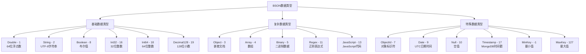

## BSON模块概述

BSON（Binary JSON）是MongoDB的核心数据格式，是一种二进制编码的文档结构，用于存储和传输数据。BSON模块位于`src/mongo/bson/`目录，包含了BSON数据格式的完整实现，是MongoDB系统中最基础和最重要的模块之一。

## BSON数据格式规范

BSON是一种类似JSON的二进制格式，但比JSON更加高效和功能丰富。

### BSON文档结构

```
BSON Document Format:
┌─────────────────────────────────────────────────────────────┐
│ <int32 totalSize> {<BSONElement>}* <byte EOO>              │
└─────────────────────────────────────────────────────────────┘

BSONElement Format:
┌─────────────────────────────────────────────────────────────┐
│ <byte type><cstring fieldName><value>                       │
└─────────────────────────────────────────────────────────────┘
```

### BSON数据类型



## 核心数据结构深度分析

### 1. BSONObj - BSON对象

BSONObj是MongoDB中最核心的数据结构，表示一个不可变的BSON文档。

```cpp
/**

 * BSONObj - BSON文档对象

 *

 * 功能特点:
 * - 不可变对象，线程安全读取
 * - 内存紧凑存储，最小化空间开销
 * - 支持快速字段查找和遍历
 * - 智能指针语义，支持浅拷贝

 */
class BSONObj {
private:
    // 指向BSON二进制数据的指针
    const char* _objdata;
    
    // BSON对象的大小（包含头部的4字节长度）
    int _size() const {
        return DataView(_objdata).read<LittleEndian<int>>();
    }
    
public:
    /**

     * 默认构造函数，创建空对象 {}
     */
    BSONObj() : _objdata(kEmpty) {}
    
    /**
     * 从二进制数据构造BSON对象
     * @param objdata 指向BSON二进制数据的指针
     *
     * 注意: 不会复制数据，需要确保数据生命周期
     */
    explicit BSONObj(const char* objdata) : _objdata(objdata) {
        if (!isValid()) {
            // 数据无效时抛出异常
            msgasserted(10334, "BSONObj size invalid");
        }
    }
    
    /**
     * 拷贝构造函数，实现浅拷贝语义
     * @param other 要复制的BSON对象
     */
    BSONObj(const BSONObj& other) : _objdata(other._objdata) {}
    
    /**
     * 获取指定字段的元素
     * @param name 字段名
     * @return BSONElement，如果字段不存在则返回EOO类型
     *
     * 时间复杂度: O(n)，需要遍历所有字段
     */
    BSONElement getField(StringData name) const {
        return getFieldUsingIndexNames(name, nullptr);
    }
    
    /**
     * 检查字段是否存在
     * @param name 字段名
     * @return 如果字段存在返回true
     */
    bool hasField(StringData name) const {
        return !getField(name).eoo();
    }
    
    /**
     * 获取指定字段的元素（使用operator[]）
     * @param field 字段名
     * @return BSONElement
     */
    BSONElement operator[](StringData field) const {
        return getField(field);
    }
    
    /**
     * 获取对象大小（包含4字节长度头）
     * @return 对象的字节大小
     */
    int objsize() const {
        return _size();
    }
    
    /**
     * 检查是否为空对象
     * @return 如果是{}空对象返回true
     */
    bool isEmpty() const {
        return objsize() <= kMinBSONLength;
    }
    
    /**
     * 验证BSON对象格式是否有效
     * @param level 验证级别（基础/完整）
     * @return 验证状态
     */
    Status validate(BSONValidateMode mode = BSONValidateMode::kDefault) const {
        if (objsize() < kMinBSONLength) {
            return Status(ErrorCodes::BadValue, "BSON对象太小");
        }
        
        if (objsize() > BSONObjMaxUserSize) {
            return Status(ErrorCodes::BadValue, "BSON对象太大");
        }
        
        // 检查结束标记
        if (_objdata[objsize() - 1] != EOO) {
            return Status(ErrorCodes::BadValue, "BSON对象缺少结束标记");
        }
        
        // 详细验证每个字段
        if (mode == BSONValidateMode::kFull) {
            return validateElementInfo();
        }
        
        return Status::OK();
    }
    
    /**
     * 比较两个BSON对象
     * @param other 要比较的对象
     * @return 比较结果 (-1, 0, 1)
     */
    int woCompare(const BSONObj& other) const {
        return woCompare(other, BSONObj(), false);
    }
    
    /**
     * 检查两个对象是否相等
     * @param other 要比较的对象
     * @return 如果相等返回true
     */
    bool equal(const BSONObj& other) const {
        return woCompare(other) == 0;
    }
    
    /**
     * 获取BSON对象的哈希值
     * @return 哈希值
     */
    size_t hash() const {
        return std::hash<StringData>{}(StringData(_objdata, objsize()));
    }
    
    /**
     * 转换为JSON字符串
     * @param format JSON格式类型
     * @return JSON字符串
     */
    std::string jsonString(JsonStringFormat format = JsonStringFormat::LegacyStrict) const {
        BSONObjBuilder builder;
        return jsonStringGenerator(format, 0, false, builder);
    }
    
    /**
     * 获取对象中字段的数量
     * @return 字段数量
     *
     * 注意: O(n)操作，需要遍历所有字段
     */
    int nFields() const {
        int count = 0;
        for (auto&& elem : *this) {
            ++count;
        }
        return count;
    }
    
    /**
     * 获取原始二进制数据指针
     * @return 指向BSON数据的指针
     */
    const char* objdata() const {
        return _objdata;
    }
    
    /**
     * 创建对象的深拷贝
     * @return 新的BSON对象副本
     */
    BSONObj copy() const {
        auto holder = SharedBuffer::allocate(objsize());
        memcpy(holder.get(), _objdata, objsize());
        return BSONObj(holder);
    }
    
    /**
     * 获取对象的一部分字段
     * @param fields 要提取的字段名
     * @return 包含指定字段的新对象
     */
    BSONObj extractFields(const BSONObj& fields) const {
        BSONObjBuilder builder;
        extractFields(fields, builder);
        return builder.obj();
    }
    
    // 迭代器支持
    typedef BSONObjIterator iterator;
    
    /**
     * 获取迭代器开始位置
     * @return 指向第一个元素的迭代器
     */
    BSONObjIterator begin() const;
    
    /**
     * 获取迭代器结束位置  
     * @return 指向结束位置的迭代器
     */
    BSONObjIterator end() const;
    

private:
    // 空对象的二进制表示：{size=5, EOO}
    static const char kEmpty[5];
    static constexpr int kMinBSONLength = 5;
};

// 全局常量
const BSONObj BSONObj::kEmptyObject = BSONObj();
const char BSONObj::kEmpty[5] = {5, 0, 0, 0, EOO};
```

### 2. BSONElement - BSON元素

BSONElement表示BSON文档中的一个字段（键值对）。

```cpp
/**

 * BSONElement - BSON文档中的字段元素

 *

 * 功能特点:
 * - 指向BSON对象内部数据，不拥有数据
 * - 提供类型安全的值访问方法
 * - 支持各种BSON数据类型的处理
 * - 高效的类型检查和转换

 */
class BSONElement {
private:
    const char* _data;        // 指向元素数据的指针
    int _fieldNameSize;       // 字段名长度（包含结束符）
    int _totalSize;           // 元素总大小
    
public:
    /**

     * 默认构造函数，创建EOO（End Of Object）元素
     */
    BSONElement() : _data(nullptr), _fieldNameSize(-1), _totalSize(-1) {}
    
    /**
     * 从数据指针构造元素
     * @param data 指向元素数据的指针
     */
    explicit BSONElement(const char* data) : _data(data) {
        if (_data) {
            _fieldNameSize = strlen(_data + 1) + 1;  // +1 for null terminator
            _totalSize = calculateTotalSize();
        } else {
            _fieldNameSize = _totalSize = -1;
        }
    }
    
    /**
     * 获取元素的BSON类型
     * @return BSON类型枚举值
     */
    BSONType type() const {
        return _data ? static_cast<BSONType>(*_data) : BSONType::eoo;
    }
    
    /**
     * 检查是否为EOO（文档结束）元素
     * @return 如果是EOO返回true
     */
    bool eoo() const {
        return type() == BSONType::eoo;
    }
    
    /**
     * 获取字段名
     * @return 字段名字符串
     */
    StringData fieldName() const {
        return _data ? StringData(_data + 1, _fieldNameSize - 1) : StringData();
    }
    
    /**
     * 获取字段名（C字符串）
     * @return 以null结尾的字段名
     */
    const char* fieldNameStringData() const {
        return _data ? _data + 1 : "";
    }
    
    /**
     * 获取值的大小
     * @return 值部分的字节大小
     */
    int valuesize() const {
        return _totalSize - (1 + _fieldNameSize);  // total - (type + fieldName)
    }
    
    /**
     * 获取值数据指针
     * @return 指向值数据的指针
     */
    const char* value() const {
        return _data ? _data + 1 + _fieldNameSize : nullptr;
    }
    
    // ==================== 类型安全的值访问方法 ====================
    
    /**
     * 获取双精度浮点值
     * @return double值
     * @throws 如果类型不匹配会抛出异常
     */
    double Double() const {
        invariant(type() == BSONType::numberDouble);
        return DataView(value()).read<LittleEndian<double>>();
    }
    
    /**
     * 获取字符串值
     * @return StringData字符串
     */
    StringData String() const {
        invariant(type() == BSONType::string);
        int len = DataView(value()).read<LittleEndian<int>>();
        return StringData(value() + 4, len - 1);  // -1 to exclude null terminator
    }
    
    /**
     * 获取嵌套对象值
     * @return BSONObj对象
     */
    BSONObj Obj() const {
        invariant(type() == BSONType::object);
        return BSONObj(value());
    }
    
    /**
     * 获取数组值
     * @return BSONObj数组（数组在BSON中表示为对象）
     */
    BSONObj Array() const {
        invariant(type() == BSONType::array);
        return BSONObj(value());
    }
    
    /**
     * 获取布尔值
     * @return bool值
     */
    bool Bool() const {
        invariant(type() == BSONType::boolean);
        return *value() != 0;
    }
    
    /**
     * 获取日期值
     * @return Date_t日期对象
     */
    Date_t Date() const {
        invariant(type() == BSONType::date);
        return Date_t::fromMillisSinceEpoch(
            DataView(value()).read<LittleEndian<long long>>());
    }
    
    /**
     * 获取ObjectId值
     * @return OID对象
     */
    OID OID() const {
        invariant(type() == BSONType::objectid);
        return mongo::OID::from(value());
    }
    
    /**
     * 获取32位整数值
     * @return int32_t值
     */
    int Int() const {
        invariant(type() == BSONType::numberInt);
        return DataView(value()).read<LittleEndian<int>>();
    }
    
    /**
     * 获取64位整数值
     * @return long long值
     */
    long long Long() const {
        invariant(type() == BSONType::numberLong);
        return DataView(value()).read<LittleEndian<long long>>();
    }
    
    /**
     * 获取Decimal128值
     * @return Decimal128对象
     */
    Decimal128 Decimal() const {
        invariant(type() == BSONType::numberDecimal);
        return Decimal128(value());
    }
    
    /**
     * 获取时间戳值
     * @return Timestamp对象
     */
    Timestamp timestamp() const {
        invariant(type() == BSONType::timestamp);
        return Timestamp(DataView(value()).read<LittleEndian<unsigned long long>>());
    }
    
    // ==================== 类型转换和检查方法 ====================
    
    /**
     * 检查是否为数字类型
     * @return 如果是数字类型返回true
     */
    bool isNumber() const {
        BSONType t = type();
        return t == BSONType::numberInt ||
               t == BSONType::numberLong ||
               t == BSONType::numberDouble ||
               t == BSONType::numberDecimal;
    }
    
    /**
     * 获取数字值（统一返回double）
     * @return double数值
     */
    double numberValue() const {
        switch (type()) {
            case BSONType::numberInt:
                return static_cast<double>(Int());
            case BSONType::numberLong:
                return static_cast<double>(Long());
            case BSONType::numberDouble:
                return Double();
            case BSONType::numberDecimal:
                return Decimal().toDouble();
            default:
                uasserted(10065, "非数字类型");
        }
    }
    
    /**
     * 安全获取整数值
     * @return StatusWith<long long>，包含值或错误
     */
    StatusWith<long long> safeNumberLong() const {
        switch (type()) {
            case BSONType::numberInt:
                return static_cast<long long>(Int());
            case BSONType::numberLong:
                return Long();
            case BSONType::numberDouble: {
                double d = Double();
                if (d >= std::numeric_limits<long long>::min() &&
                    d <= std::numeric_limits<long long>::max() &&
                    d == trunc(d)) {
                    return static_cast<long long>(d);
                }
                return Status(ErrorCodes::BadValue, "双精度数无法转换为整数");
            }
            case BSONType::numberDecimal: {
                auto decimal = Decimal();
                if (decimal.isInteger()) {
                    return decimal.toLongExact();
                }
                return Status(ErrorCodes::BadValue, "Decimal128无法转换为整数");
            }
            default:
                return Status(ErrorCodes::TypeMismatch, "非数字类型");
        }
    }
    
    /**
     * 比较两个元素的值
     * @param other 要比较的元素
     * @return 比较结果 (-1, 0, 1)
     */
    int compareElements(const BSONElement& other) const {
        // 首先比较类型
        int typeComp = compareTypes(type(), other.type());
        if (typeComp != 0) {
            return typeComp;
        }
        
        // 然后比较值
        switch (type()) {
            case BSONType::numberDouble:
            case BSONType::numberInt:
            case BSONType::numberLong:
            case BSONType::numberDecimal:
                return compareNumbers(other);
            case BSONType::string:
                return String().compare(other.String());
            case BSONType::object:
            case BSONType::array:
                return Obj().woCompare(other.Obj());
            case BSONType::boolean:
                return Bool() == other.Bool() ? 0 : (Bool() ? 1 : -1);
            case BSONType::date:
                return Date() == other.Date() ? 0 : (Date() < other.Date() ? -1 : 1);
            case BSONType::objectid:
                return OID().compare(other.OID());
            default:
                // 对于其他类型，比较原始字节
                return memcmp(value(), other.value(), std::min(valuesize(), other.valuesize()));
        }
    }
    
    /**
     * 转换为字符串表示
     * @return 字符串表示
     */
    std::string toString() const {
        StringBuilder ss;
        toString(ss, true);  // includeFieldName = true
        return ss.str();
    }
    

private:
    /**

     * 计算元素的总大小
     * @return 元素总字节大小
     */
    int calculateTotalSize() const {
        if (!_data || eoo()) return 1;  // EOO只有1字节
        
        int size = 1 + _fieldNameSize;  // type + fieldName
        
        switch (type()) {
            case BSONType::numberDouble:
            case BSONType::numberLong:
            case BSONType::date:
            case BSONType::timestamp:
                size += 8;
                break;
            case BSONType::string:
            case BSONType::code:
                size += 4 + DataView(value()).read<LittleEndian<int>>();
                break;
            case BSONType::object:
            case BSONType::array:
                size += DataView(value()).read<LittleEndian<int>>();
                break;
            case BSONType::boolean:
                size += 1;
                break;
            case BSONType::numberInt:
                size += 4;
                break;
            case BSONType::objectid:
                size += 12;
                break;
            case BSONType::numberDecimal:
                size += 16;
                break;
            // ... 其他类型
        }
        
        return size;
    }

};
```

### 3. BSONObjBuilder - BSON对象构建器

BSONObjBuilder用于构建BSON对象，提供了类型安全的字段添加方法。

```cpp
/**

 * BSONObjBuilder - BSON对象构建器

 *

 * 功能特点:
 * - 高效的内存管理和缓冲区扩展
 * - 类型安全的字段添加方法
 * - 支持链式调用编程风格
 * - 自动处理字节序和内存对齐

 */
class BSONObjBuilder {
private:
    BufBuilder _b;           // 底层缓冲区构建器
    int _offset;             // 当前偏移量
    bool _doneCalled;        // 是否已调用done()
    
public:
    /**

     * 默认构造函数
     * @param initsize 初始缓冲区大小
     */
    explicit BSONObjBuilder(int initsize = 512)
        : _b(initsize), _offset(0), _doneCalled(false) {
        // 预留4字节用于存储文档大小
        _b.skip(4);
        _offset = 4;
    }
    
    /**
     * 析构函数，确保资源正确释放
     */
    ~BSONObjBuilder() {
        if (!_doneCalled) {
            done();  // 自动完成构建
        }
    }
    
    // ==================== 基础类型添加方法 ====================
    
    /**
     * 添加双精度浮点字段
     * @param name 字段名
     * @param value 双精度值
     * @return 构建器引用（支持链式调用）
     */
    BSONObjBuilder& append(StringData name, double value) {
        _b.appendChar(static_cast<char>(BSONType::numberDouble));
        _b.appendStr(name);
        _b.appendStruct(value);
        return *this;
    }
    
    /**
     * 添加字符串字段
     * @param name 字段名
     * @param value 字符串值
     * @return 构建器引用
     */
    BSONObjBuilder& append(StringData name, StringData value) {
        _b.appendChar(static_cast<char>(BSONType::string));
        _b.appendStr(name);
        
        // 字符串格式: <length><string><null>
        const int len = value.size() + 1;  // +1 for null terminator
        _b.appendNum(len);
        _b.appendStr(value, false);  // append without null
        _b.appendChar('\0');         // add null terminator
        
        return *this;
    }
    
    /**
     * 添加嵌套对象字段
     * @param name 字段名
     * @param value BSON对象
     * @return 构建器引用
     */
    BSONObjBuilder& append(StringData name, const BSONObj& value) {
        _b.appendChar(static_cast<char>(BSONType::object));
        _b.appendStr(name);
        _b.appendBuf(value.objdata(), value.objsize());
        return *this;
    }
    
    /**
     * 添加布尔字段
     * @param name 字段名
     * @param value 布尔值
     * @return 构建器引用
     */
    BSONObjBuilder& append(StringData name, bool value) {
        _b.appendChar(static_cast<char>(BSONType::boolean));
        _b.appendStr(name);
        _b.appendChar(value ? 1 : 0);
        return *this;
    }
    
    /**
     * 添加32位整数字段
     * @param name 字段名
     * @param value 整数值
     * @return 构建器引用
     */
    BSONObjBuilder& append(StringData name, int value) {
        _b.appendChar(static_cast<char>(BSONType::numberInt));
        _b.appendStr(name);
        _b.appendNum(value);
        return *this;
    }
    
    /**
     * 添加64位整数字段
     * @param name 字段名
     * @param value 长整数值
     * @return 构建器引用
     */
    BSONObjBuilder& append(StringData name, long long value) {
        _b.appendChar(static_cast<char>(BSONType::numberLong));
        _b.appendStr(name);
        _b.appendNum(value);
        return *this;
    }
    
    /**
     * 添加日期字段
     * @param name 字段名
     * @param value 日期值
     * @return 构建器引用
     */
    BSONObjBuilder& append(StringData name, Date_t value) {
        _b.appendChar(static_cast<char>(BSONType::date));
        _b.appendStr(name);
        _b.appendNum(value.toMillisSinceEpoch());
        return *this;
    }
    
    /**
     * 添加ObjectId字段
     * @param name 字段名
     * @param value ObjectId值
     * @return 构建器引用
     */
    BSONObjBuilder& append(StringData name, const OID& value) {
        _b.appendChar(static_cast<char>(BSONType::objectid));
        _b.appendStr(name);
        _b.appendBuf(value.view().view(), OID::kOIDSize);
        return *this;
    }
    
    /**
     * 添加null字段
     * @param name 字段名
     * @return 构建器引用
     */
    BSONObjBuilder& appendNull(StringData name) {
        _b.appendChar(static_cast<char>(BSONType::null));
        _b.appendStr(name);
        return *this;
    }
    
    // ==================== 高级构建方法 ====================
    
    /**
     * 添加数组字段
     * @param name 字段名
     * @param values 数组元素
     * @return 构建器引用
     */
    template<typename T>
    BSONObjBuilder& append(StringData name, const std::vector<T>& values) {
        BSONArrayBuilder arrayBuilder;
        for (const auto& value : values) {
            arrayBuilder.append(value);
        }
        return append(name, arrayBuilder.arr());
    }
    
    /**
     * 从另一个BSON对象追加字段
     * @param obj 源对象
     * @param filter 字段过滤器（可选）
     * @return 构建器引用
     */
    BSONObjBuilder& appendElementsUnique(const BSONObj& obj,
                                        const StringData::ComparatorInterface* stringComparator = nullptr) {
        std::set<std::string> existingFields;
        
        // 收集已有字段名
        for (BSONObjIterator it(_b.buf() + 4, _offset - 4); it.more();) {
            existingFields.insert(it.next().fieldName());
        }
        
        // 追加不重复的字段
        for (auto&& elem : obj) {
            if (existingFields.find(elem.fieldName()) == existingFields.end()) {
                append(elem);
                existingFields.insert(elem.fieldName());
            }
        }
        
        return *this;
    }
    
    /**
     * 添加已有的BSONElement
     * @param elem BSON元素
     * @return 构建器引用
     */
    BSONObjBuilder& append(const BSONElement& elem) {
        // 直接复制元素的二进制数据
        _b.appendBuf(elem.rawdata(), elem.size());
        return *this;
    }
    
    /**
     * 有条件地添加字段
     * @param name 字段名
     * @param value 字段值
     * @param condition 添加条件
     * @return 构建器引用
     */
    template<typename T>
    BSONObjBuilder& appendIf(StringData name, const T& value, bool condition) {
        if (condition) {
            append(name, value);
        }
        return *this;
    }
    
    // ==================== 子对象和数组构建 ====================
    
    /**
     * 开始构建子对象
     * @param name 字段名
     * @return 子对象构建器
     */
    BSONObjBuilder subobjStart(StringData name) {
        _b.appendChar(static_cast<char>(BSONType::object));
        _b.appendStr(name);
        
        // 预留4字节用于子对象大小
        int sizeOffset = _b.len();
        _b.skip(4);
        
        return BSONObjBuilder(_b, sizeOffset);
    }
    
    /**
     * 开始构建数组
     * @param name 字段名
     * @return 数组构建器
     */
    BSONArrayBuilder subarrayStart(StringData name) {
        _b.appendChar(static_cast<char>(BSONType::array));
        _b.appendStr(name);
        
        int sizeOffset = _b.len();
        _b.skip(4);
        
        return BSONArrayBuilder(_b, sizeOffset);
    }
    
    // ==================== 完成构建 ====================
    
    /**
     * 完成对象构建
     * @return 构建完成的BSON对象
     */
    BSONObj obj() {
        if (_doneCalled) {
            return BSONObj(_b.buf());
        }
        return done();
    }
    
    /**
     * 完成构建并返回对象
     * @return BSON对象
     */
    BSONObj done() {
        if (_doneCalled) return BSONObj(_b.buf());
        
        // 添加文档结束标记
        _b.appendChar(static_cast<char>(BSONType::eoo));
        
        // 在开头写入文档总大小
        int size = _b.len();
        DataView(_b.buf()).write<LittleEndian<int>>(size);
        
        _doneCalled = true;
        return BSONObj(_b.buf());
    }
    
    /**
     * 获取当前构建的字节大小
     * @return 当前大小
     */
    int len() const { return _b.len(); }
    
    /**
     * 检查构建器是否为空
     * @return 如果没有字段返回true
     */
    bool isEmpty() const { return _b.len() == 5; }  // 只有size + EOO
    
    /**
     * 重置构建器状态
     */
    void reset() {
        _b.reset();
        _b.skip(4);
        _offset = 4;
        _doneCalled = false;
    }
    
    /**
     * 获取已添加的字段数量
     * @return 字段数量
     */
    int numFields() const {
        int count = 0;
        for (BSONObjIterator it(_b.buf() + 4, _b.len() - 5); it.more(); ++count) {
            it.next();
        }
        return count;
    }

};

// ==================== 便利的创建函数 ====================

/**

 * 创建包含单个字段的BSON对象
 * @param name 字段名
 * @param value 字段值
 * @return BSON对象

 */
template<typename T>
BSONObj BSON(StringData name, const T& value) {
    BSONObjBuilder builder;
    builder.append(name, value);
    return builder.obj();
}

/**

 * 从键值对创建BSON对象
 * @param pairs 键值对
 * @return BSON对象

 */
BSONObj fromjson(StringData json);

/**

 * 合并多个BSON对象
 * @param objs 要合并的对象列表
 * @return 合并后的对象

 */
BSONObj merge(const std::vector<BSONObj>& objs);
```

## BSON性能优化策略

### 1. 内存优化

```cpp
/**

 * BSON内存优化技术

 */
class BSONMemoryOptimization {
public:
    /**

     * 对象池技术减少内存分配
     */
    class BSONObjPool {
    private:
        std::stack<std::unique_ptr<BSONObjBuilder>> _pool;
        std::mutex _mutex;
        
    public:
        std::unique_ptr<BSONObjBuilder> acquire() {
            std::lock_guard<std::mutex> lock(_mutex);
            if (_pool.empty()) {
                return std::make_unique<BSONObjBuilder>();
            }
            auto builder = std::move(_pool.top());
            _pool.pop();
            builder->reset();
            return builder;
        }
        
        void release(std::unique_ptr<BSONObjBuilder> builder) {
            std::lock_guard<std::mutex> lock(_mutex);
            _pool.push(std::move(builder));
        }
    };
    
    /**
     * 写时复制优化
     */
    class COWBSONObj {
    private:
        std::shared_ptr<const char[]> _data;
        int _size;
        
    public:
        COWBSONObj(const BSONObj& obj) {
            _size = obj.objsize();
            auto buffer = std::make_unique<char[]>(_size);
            memcpy(buffer.get(), obj.objdata(), _size);
            _data = std::shared_ptr<const char[]>(buffer.release());
        }
        
        BSONObj get() const {
            return BSONObj(_data.get());
        }
    };

};
```

### 2. 解析优化

```cpp
/**

 * BSON解析优化

 */
class BSONParseOptimization {
public:
    /**

     * 延迟解析 - 只在需要时解析字段
     */
    class LazyBSONObj {
    private:
        const char* _data;
        mutable std::unordered_map<std::string, BSONElement> _cache;
        
    public:
        explicit LazyBSONObj(const char* data) : _data(data) {}
        
        BSONElement getField(StringData name) const {
            auto it = _cache.find(name.toString());
            if (it != _cache.end()) {
                return it->second;
            }
            
            // 解析并缓存字段
            BSONElement elem = parseField(name);
            _cache[name.toString()] = elem;
            return elem;
        }
        
    private:
        BSONElement parseField(StringData name) const {
            BSONObjIterator it(_data);
            while (it.more()) {
                BSONElement elem = it.next();
                if (elem.fieldNameStringData() == name) {
                    return elem;
                }
            }
            return BSONElement();  // EOO
        }
    };
    
    /**
     * 批量字段访问优化
     */
    std::vector<BSONElement> getMultipleFields(const BSONObj& obj,
                                             const std::vector<StringData>& fields) {
        std::vector<BSONElement> results(fields.size());
        std::bitset<64> found;  // 假设最多64个字段
        
        for (auto&& elem : obj) {
            StringData fieldName = elem.fieldNameStringData();
            
            for (size_t i = 0; i < fields.size() && !found.all(); ++i) {
                if (!found[i] && fieldName == fields[i]) {
                    results[i] = elem;
                    found.set(i);
                }
            }
            
            if (found.all()) break;  // 找到所有字段，提前退出
        }
        
        return results;
    }

};
```

## 实战案例与最佳实践

### 案例1: 高效的BSON构建

```cpp
// 不推荐：每次都创建新的构建器
BSONObj createDocument1(const std::string& name, int age) {
    BSONObjBuilder builder;  // 每次调用都要分配内存
    builder.append("name", name);
    builder.append("age", age);
    return builder.obj();
}

// 推荐：使用对象池
class DocumentFactory {
private:
    thread_local static BSONObjBuilder::Pool _pool;
    
public:
    static BSONObj createDocument(const std::string& name, int age) {
        auto builder = _pool.acquire();
        builder->append("name", name);
        builder->append("age", age);
        BSONObj result = builder->obj();
        _pool.release(std::move(builder));
        return result;
    }
};

// 推荐：链式调用减少临时对象
BSONObj createDocument2(const std::string& name, int age) {
    return BSONObjBuilder()
        .append("name", name)
        .append("age", age)
        .append("created", Date_t::now())
        .obj();
}
```

### 案例2: 高效的字段访问

```javascript
// MongoDB查询优化示例

// 不推荐：检索整个文档然后在应用层过滤
db.users.find({}).forEach(function(doc) {
    if (doc.age > 18 && doc.status === 'active') {
        // 处理用户
    }
});

// 推荐：在数据库层面进行过滤和投影
db.users.find(
    {age: {$gt: 18}, status: 'active'},  // 过滤条件
    {name: 1, email: 1, age: 1}          // 字段投影
);

// C++中的对应优化
BSONObj query = BSON("age" << BSON("$gt" << 18) << "status" << "active");
BSONObj projection = BSON("name" << 1 << "email" << 1 << "age" << 1);
```

### 案例3: 大文档处理

```cpp
/**

 * 大BSON文档的分块处理

 */
class LargeBSONProcessor {
public:
    /**

     * 流式处理大文档，避免将整个文档加载到内存
     */
    void processLargeDocument(const char* bsonData,
                            std::function<void(const BSONElement&)> processor) {
        
        BSONObjIterator it(bsonData);
        while (it.more()) {
            BSONElement elem = it.next();
            
            // 对每个字段进行处理，而不是加载整个文档
            processor(elem);
            
            // 可以在这里添加内存使用检查
            if (getCurrentMemoryUsage() > getMemoryLimit()) {
                flushBuffers();
            }
        }
    }
    
    /**
     * 分页读取大型数组字段
     */
    void processLargeArray(const BSONElement& arrayElement,
                          int pageSize = 1000) {
        
        invariant(arrayElement.type() == BSONType::array);
        BSONObj arrayObj = arrayElement.Obj();
        
        int processed = 0;
        for (auto&& elem : arrayObj) {
            processArrayElement(elem);
            
            if (++processed % pageSize == 0) {
                // 每处理pageSize个元素后进行一次垃圾回收
                yield();  // 让出CPU时间
            }
        }
    }

};
```

## BSON vs JSON 性能对比

| 特性 | BSON | JSON |
|------|------|------|
| 存储效率 | 更紧凑（二进制格式） | 人类可读但冗长 |
| 解析速度 | 更快（无需词法分析） | 较慢（需要解析字符串） |
| 类型支持 | 丰富（Date, ObjectId, Binary等） | 基础类型有限 |
| 遍历性能 | O(1)跳过字段 | O(n)解析所有内容 |
| 网络传输 | 二进制，更小 | 文本，较大 |
| 调试友好性 | 需要工具查看 | 直接可读 |

## 监控和调试工具

### 1. BSON验证工具

```cpp
/**

 * BSON文档验证和诊断工具

 */
class BSONValidator {
public:
    struct ValidationResult {
        bool isValid;
        std::vector<std::string> errors;
        std::vector<std::string> warnings;
        size_t totalSize;
        size_t fieldCount;
        int maxDepth;
    };
    
    /**

     * 全面验证BSON文档
     */
    static ValidationResult validate(const BSONObj& obj) {
        ValidationResult result;
        result.isValid = true;
        result.totalSize = obj.objsize();
        result.fieldCount = 0;
        result.maxDepth = 0;
        
        validateRecursive(obj, result, 0);
        
        return result;
    }
    

private:
    static void validateRecursive(const BSONObj& obj,
                                ValidationResult& result,
                                int depth) {
        
        result.maxDepth = std::max(result.maxDepth, depth);
        
        if (depth > 100) {  // 防止过深嵌套
            result.warnings.push_back("文档嵌套层级过深");
        }
        
        for (auto&& elem : obj) {
            result.fieldCount++;
            
            // 验证字段名
            StringData fieldName = elem.fieldNameStringData();
            if (fieldName.empty()) {
                result.errors.push_back("空字段名");
                result.isValid = false;
            }
            
            if (fieldName.find('\0') != std::string::npos) {
                result.errors.push_back("字段名包含null字符");
                result.isValid = false;
            }
            
            // 验证字段值
            validateElement(elem, result, depth);
        }
    }
    
    static void validateElement(const BSONElement& elem,
                              ValidationResult& result,
                              int depth) {
        switch (elem.type()) {
            case BSONType::object:
                validateRecursive(elem.Obj(), result, depth + 1);
                break;
            case BSONType::array:
                validateArray(elem, result, depth);
                break;
            case BSONType::string:
                if (elem.valuesize() < 1) {
                    result.errors.push_back("字符串长度无效");
                    result.isValid = false;
                }
                break;
            // ... 其他类型的验证
        }
    }
};
```

## 小结

BSON模块是MongoDB的基础数据格式实现，其特点包括：

1. **高效的二进制格式**: 比JSON更紧凑、解析更快
2. **丰富的数据类型**: 支持MongoDB特有的数据类型
3. **内存友好设计**: 不可变对象、写时复制、对象池等优化
4. **类型安全接口**: 提供类型检查和转换方法
5. **灵活的构建方式**: 链式调用、条件构建等便利功能

理解BSON的内部实现对于优化MongoDB应用性能至关重要。下一章节我们将分析传输层的网络通信机制。
