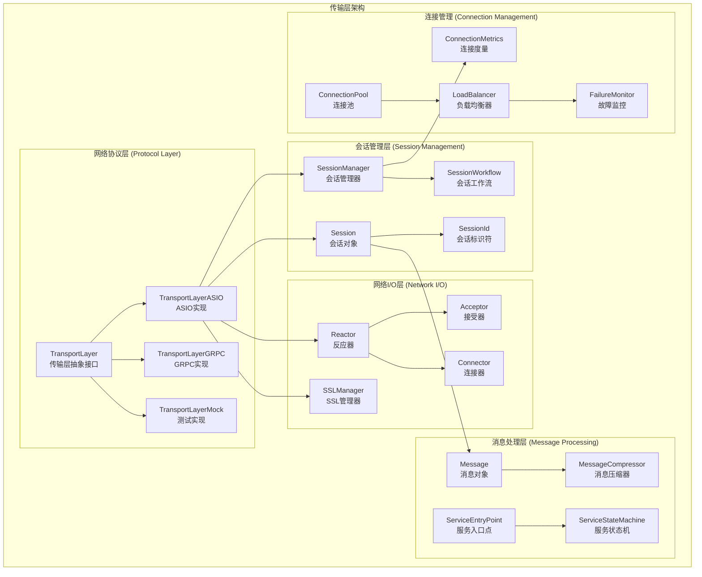
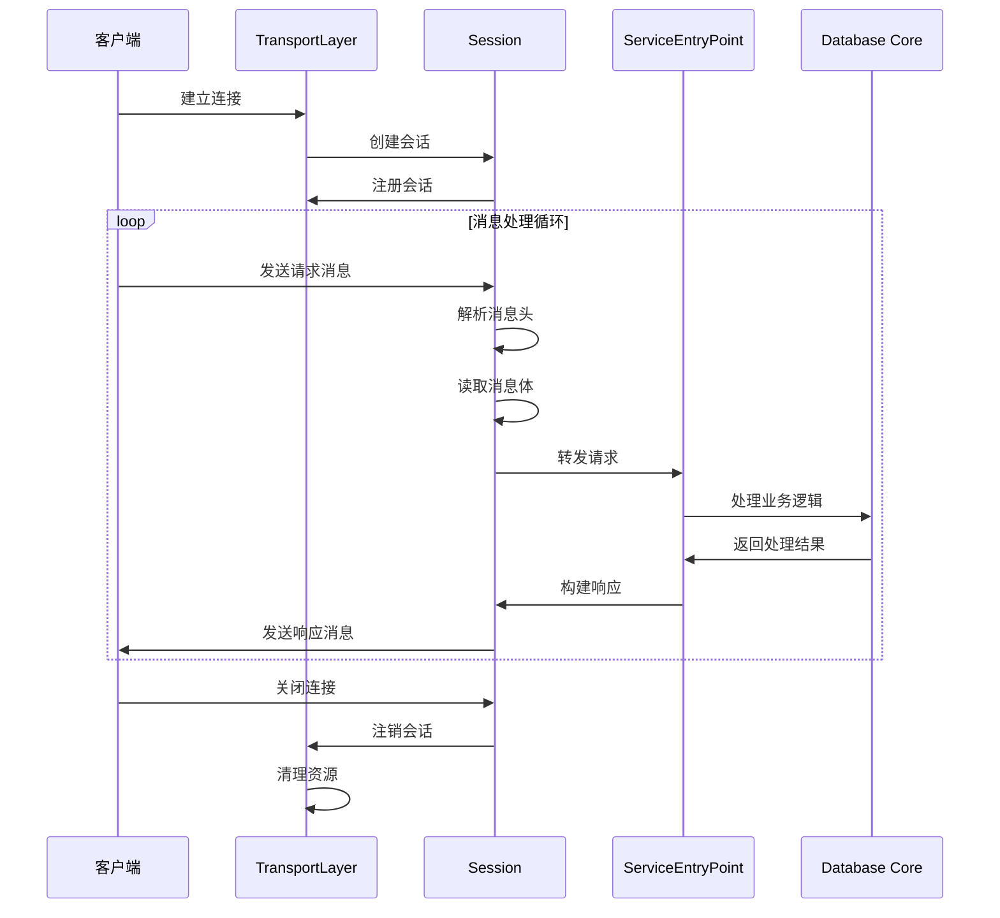

# MongoDB 源码深度剖析 - 传输层详解

## 传输层模块概述

MongoDB传输层（`src/mongo/transport/`）是连接网络通信和数据库核心服务的关键组件，负责处理客户端连接管理、消息传输、网络协议实现等功能。传输层采用异步I/O模型，支持多种传输协议，并提供了灵活的会话管理机制。

## 传输层整体架构



## 核心数据结构深度分析

### 1. TransportLayer - 传输层抽象接口

TransportLayer是传输层的核心抽象接口，定义了网络通信的基本操作。

```cpp
/**
 * TransportLayer - 传输层抽象接口
 * 
 * 功能特点:
 * - 提供统一的网络通信接口
 * - 支持多种传输协议（TCP、SSL、GRPC等）
 * - 管理客户端连接生命周期
 * - 支持异步I/O操作
 */
class TransportLayer {
public:
    /**
     * 传输层初始化配置
     */
    struct Options {
        int port = 27017;                    // 监听端口
        std::vector<std::string> bindIps;    // 绑定IP地址列表
        bool enableSSL = false;              // 是否启用SSL
        int maxConnections = 65536;          // 最大连接数
        Milliseconds connectionTimeout{5000}; // 连接超时时间
        size_t maxMessageSize = 48000000;    // 最大消息大小
        bool enableCompression = false;      // 是否启用压缩
    };
    
    virtual ~TransportLayer() = default;
    
    /**
     * 启动传输层服务
     * @return 启动状态
     */
    virtual Status start() = 0;
    
    /**
     * 关闭传输层服务
     * @param skipGracefulShutdown 是否跳过优雅关闭
     */
    virtual void shutdown(bool skipGracefulShutdown = false) = 0;
    
    /**
     * 获取监听端口
     * @return 端口号，如果未启动返回0
     */
    virtual int listenerPort() const = 0;
    
    /**
     * 创建到远程主机的连接
     * @param remote 远程主机地址
     * @param sslMode SSL模式
     * @param timeout 连接超时时间
     * @param onComplete 连接完成回调
     * @return 连接Future
     */
    virtual Future<SessionHandle> connect(
        HostAndPort remote,
        ConnectSSLMode sslMode,
        Milliseconds timeout,
        std::shared_ptr<ConnectionMetrics> connectionMetrics = nullptr) = 0;
    
    /**
     * 异步等待新连接
     * @param acceptorId 接受器ID
     * @return 新会话Future
     */
    virtual Future<SessionHandle> asyncWait() = 0;
    
    /**
     * 获取传输层统计信息
     * @return 统计信息BSON对象
     */
    virtual BSONObj getStats() const = 0;
    
protected:
    TransportLayer() = default;
};

/**
 * TransportLayerASIO - 基于ASIO的传输层实现
 * 
 * 功能特点:
 * - 使用Boost.ASIO进行异步I/O操作
 * - 支持TCP和SSL连接
 * - 实现连接池和负载均衡
 * - 提供高性能的网络通信能力
 */
class TransportLayerASIO final : public TransportLayer {
private:
    // ASIO I/O上下文
    std::shared_ptr<asio::io_context> _ioContext;
    
    // 工作线程池
    std::vector<std::thread> _workerThreads;
    
    // 接受器列表
    std::vector<std::unique_ptr<Acceptor>> _acceptors;
    
    // 会话管理器
    std::unique_ptr<SessionManager> _sessionManager;
    
    // SSL管理器
    std::shared_ptr<SSLManagerInterface> _sslManager;
    
    // 传输层配置
    Options _options;
    
    // 运行状态
    AtomicWord<bool> _isShutdown{false};
    
public:
    /**
     * 构造函数
     * @param options 传输层配置
     * @param sslManager SSL管理器
     */
    explicit TransportLayerASIO(const Options& options, 
                                std::shared_ptr<SSLManagerInterface> sslManager)
        : _options(options), _sslManager(std::move(sslManager)) {
        
        // 创建I/O上下文
        _ioContext = std::make_shared<asio::io_context>();
        
        // 创建会话管理器
        _sessionManager = std::make_unique<SessionManager>(this);
    }
    
    /**
     * 启动传输层
     * @return 启动状态
     */
    Status start() override {
        if (_isShutdown.load()) {
            return Status(ErrorCodes::ShutdownInProgress, "传输层已关闭");
        }
        
        try {
            // 1. 创建并绑定监听接受器
            for (const auto& bindIp : _options.bindIps) {
                auto acceptor = std::make_unique<Acceptor>(
                    *_ioContext, HostAndPort{bindIp, _options.port});
                
                Status bindStatus = acceptor->bind();
                if (!bindStatus.isOK()) {
                    return bindStatus;
                }
                
                Status listenStatus = acceptor->listen(_options.maxConnections);
                if (!listenStatus.isOK()) {
                    return listenStatus;
                }
                
                _acceptors.push_back(std::move(acceptor));
            }
            
            // 2. 启动工作线程池
            int threadCount = std::thread::hardware_concurrency();
            _workerThreads.reserve(threadCount);
            
            for (int i = 0; i < threadCount; ++i) {
                _workerThreads.emplace_back([this] {
                    setThreadName("TransportWorker");
                    _ioContext->run();
                });
            }
            
            // 3. 开始异步接受连接
            for (auto& acceptor : _acceptors) {
                startAsyncAccept(*acceptor);
            }
            
            return Status::OK();
            
        } catch (const std::exception& ex) {
            return Status(ErrorCodes::SocketException, ex.what());
        }
    }
    
    /**
     * 关闭传输层
     * @param skipGracefulShutdown 是否跳过优雅关闭
     */
    void shutdown(bool skipGracefulShutdown = false) override {
        if (_isShutdown.swap(true)) {
            return;  // 已经关闭
        }
        
        // 1. 停止接受新连接
        for (auto& acceptor : _acceptors) {
            acceptor->close();
        }
        
        // 2. 关闭现有会话
        if (!skipGracefulShutdown) {
            _sessionManager->gracefulShutdown();
        } else {
            _sessionManager->forceShutdown();
        }
        
        // 3. 停止I/O上下文
        _ioContext->stop();
        
        // 4. 等待工作线程结束
        for (auto& thread : _workerThreads) {
            if (thread.joinable()) {
                thread.join();
            }
        }
    }
    
    /**
     * 创建客户端连接
     * @param remote 远程主机地址
     * @param sslMode SSL模式
     * @param timeout 连接超时
     * @param connectionMetrics 连接度量
     * @return 连接Future
     */
    Future<SessionHandle> connect(
        HostAndPort remote,
        ConnectSSLMode sslMode,
        Milliseconds timeout,
        std::shared_ptr<ConnectionMetrics> connectionMetrics = nullptr) override {
        
        auto promise = std::make_shared<Promise<SessionHandle>>();
        auto future = promise->getFuture();
        
        // 创建连接器
        auto connector = std::make_unique<Connector>(
            *_ioContext, remote, sslMode, _sslManager);
        
        // 异步连接
        connector->asyncConnect(timeout,
            [this, promise, connectionMetrics](StatusWith<std::unique_ptr<ASIOSession>> result) {
                
                if (!result.isOK()) {
                    promise->setError(result.getStatus());
                    return;
                }
                
                // 创建会话
                auto session = std::shared_ptr<Session>(result.getValue().release());
                if (connectionMetrics) {
                    session->setConnectionMetrics(connectionMetrics);
                }
                
                // 注册会话
                _sessionManager->registerSession(session);
                
                promise->emplaceValue(session);
            });
        
        return future;
    }
    
    /**
     * 异步等待新连接
     * @return 新会话Future
     */
    Future<SessionHandle> asyncWait() override {
        return _sessionManager->asyncWaitForNewSession();
    }
    
private:
    /**
     * 开始异步接受连接
     * @param acceptor 接受器
     */
    void startAsyncAccept(Acceptor& acceptor) {
        acceptor.asyncAccept([this, &acceptor](StatusWith<std::unique_ptr<ASIOSession>> result) {
            
            if (!result.isOK()) {
                if (!_isShutdown.load()) {
                    LOGV2_ERROR(1001, "接受连接失败", "error"_attr = result.getStatus());
                    // 继续接受下一个连接
                    startAsyncAccept(acceptor);
                }
                return;
            }
            
            // 创建新会话
            auto session = std::shared_ptr<Session>(result.getValue().release());
            
            // 注册会话到管理器
            _sessionManager->registerSession(session);
            
            // 继续接受下一个连接
            if (!_isShutdown.load()) {
                startAsyncAccept(acceptor);
            }
        });
    }
};
```

### 2. Session - 会话对象

Session表示一个客户端连接会话，管理连接的整个生命周期。

```cpp
/**
 * Session - 客户端连接会话
 * 
 * 功能特点:
 * - 管理单个客户端连接的生命周期
 * - 提供异步消息收发接口
 * - 支持连接状态监控和度量
 * - 实现连接超时和错误处理
 */
class Session : public std::enable_shared_from_this<Session>,
                public Decorable<Session> {
public:
    using Id = SessionId;  // 会话ID类型
    
    static const Status ClosedStatus;  // 连接关闭状态
    
    /**
     * 获取会话ID
     * @return 唯一的会话标识符
     */
    Id id() const { return _id; }
    
    /**
     * 获取关联的传输层
     * @return 传输层指针
     */
    virtual TransportLayer* getTransportLayer() const = 0;
    
    /**
     * 获取远程端点信息
     * @return 远程主机和端口
     */
    virtual const HostAndPort& remote() const = 0;
    
    /**
     * 获取本地端点信息
     * @return 本地主机和端口
     */  
    virtual const HostAndPort& local() const = 0;
    
    /**
     * 异步接收消息
     * @return 消息Future
     */
    virtual Future<Message> asyncRecvMessage() = 0;
    
    /**
     * 异步发送消息
     * @param message 要发送的消息
     * @return 发送完成Future
     */
    virtual Future<void> asyncSendMessage(Message message) = 0;
    
    /**
     * 取消异步操作
     * @param cancelTimeout 取消超时时间
     */
    virtual void cancelAsyncOperations(const BatonHandle& baton = nullptr) = 0;
    
    /**
     * 等待会话结束
     * @return 结束Future
     */
    virtual Future<void> asyncWaitForEnd() = 0;
    
    /**
     * 结束会话
     */
    virtual void end() = 0;
    
    /**
     * 检查连接是否已连接
     * @return 如果已连接返回true
     */
    virtual bool isConnected() = 0;
    
protected:
    explicit Session(Id id) : _id(id) {}
    
private:
    const Id _id;  // 会话唯一标识符
};

/**
 * ASIOSession - 基于ASIO的会话实现
 */
class ASIOSession final : public Session {
private:
    // ASIO TCP套接字
    asio::ip::tcp::socket _socket;
    
    // SSL流（如果启用SSL）
    std::unique_ptr<asio::ssl::stream<asio::ip::tcp::socket&>> _sslStream;
    
    // 会话状态
    enum class State { Connected, Disconnected, Error };
    AtomicWord<State> _state{State::Connected};
    
    // 传输层引用
    TransportLayerASIO* _transportLayer;
    
    // 远程和本地端点
    HostAndPort _remote;
    HostAndPort _local;
    
    // 连接度量
    std::shared_ptr<ConnectionMetrics> _connectionMetrics;
    
    // 异步操作管理
    std::mutex _asyncOpMutex;
    std::vector<std::function<void()>> _asyncOpCancelers;
    
public:
    /**
     * 构造函数
     * @param id 会话ID
     * @param socket ASIO套接字
     * @param transportLayer 传输层引用
     */
    ASIOSession(Id id, 
               asio::ip::tcp::socket socket,
               TransportLayerASIO* transportLayer)
        : Session(id)
        , _socket(std::move(socket))
        , _transportLayer(transportLayer) {
        
        // 获取端点信息
        auto remoteEndpoint = _socket.remote_endpoint();
        _remote = HostAndPort(remoteEndpoint.address().to_string(),
                             remoteEndpoint.port());
        
        auto localEndpoint = _socket.local_endpoint();
        _local = HostAndPort(localEndpoint.address().to_string(),
                            localEndpoint.port());
    }
    
    /**
     * 异步接收消息
     * @return 消息Future
     */
    Future<Message> asyncRecvMessage() override {
        if (_state.load() != State::Connected) {
            return Future<Message>::makeReady(Status(ErrorCodes::SocketException,
                                                   "连接已断开"));
        }
        
        auto promise = std::make_shared<Promise<Message>>();
        auto future = promise->getFuture();
        
        // 首先读取消息头（包含消息长度）
        auto headerBuffer = std::make_shared<std::array<char, sizeof(MSGHEADER::Value)>>();
        
        asio::async_read(_socket,
                        asio::buffer(*headerBuffer),
                        [this, promise, headerBuffer](const asio::error_code& ec, 
                                                     std::size_t bytes_transferred) {
            
            if (ec) {
                _state.store(State::Error);
                promise->setError(Status(ErrorCodes::SocketException, ec.message()));
                return;
            }
            
            // 解析消息长度
            MSGHEADER::ConstView headerView(headerBuffer->data());
            int messageLength = headerView.getMessageLength();
            
            if (messageLength < 0 || messageLength > MaxMessageSizeBytes) {
                promise->setError(Status(ErrorCodes::BadValue, "消息长度无效"));
                return;
            }
            
            // 读取消息体
            auto messageBuffer = std::make_shared<std::vector<char>>(messageLength);
            memcpy(messageBuffer->data(), headerBuffer->data(), sizeof(MSGHEADER::Value));
            
            asio::async_read(_socket,
                            asio::buffer(messageBuffer->data() + sizeof(MSGHEADER::Value),
                                       messageLength - sizeof(MSGHEADER::Value)),
                            [promise, messageBuffer, messageLength](const asio::error_code& ec,
                                                                   std::size_t bytes_transferred) {
                
                if (ec) {
                    promise->setError(Status(ErrorCodes::SocketException, ec.message()));
                    return;
                }
                
                // 创建消息对象
                SharedBuffer buffer = SharedBuffer::allocate(messageLength);
                memcpy(buffer.get(), messageBuffer->data(), messageLength);
                
                Message message(std::move(buffer));
                promise->emplaceValue(std::move(message));
            });
        });
        
        // 注册取消器
        registerAsyncOpCanceler([this]() {
            _socket.cancel();
        });
        
        return future;
    }
    
    /**
     * 异步发送消息
     * @param message 要发送的消息
     * @return 发送完成Future
     */
    Future<void> asyncSendMessage(Message message) override {
        if (_state.load() != State::Connected) {
            return Future<void>::makeReady(Status(ErrorCodes::SocketException,
                                                "连接已断开"));
        }
        
        auto promise = std::make_shared<Promise<void>>();
        auto future = promise->getFuture();
        
        // 获取消息缓冲区
        auto messageData = message.sharedBuffer();
        
        asio::async_write(_socket,
                         asio::buffer(messageData.get(), message.size()),
                         [this, promise, messageData](const asio::error_code& ec,
                                                    std::size_t bytes_transferred) {
            
            if (ec) {
                _state.store(State::Error);
                promise->setError(Status(ErrorCodes::SocketException, ec.message()));
                return;
            }
            
            // 更新连接度量
            if (_connectionMetrics) {
                _connectionMetrics->incrementBytesSent(bytes_transferred);
                _connectionMetrics->incrementNumRequests();
            }
            
            promise->emplaceValue();
        });
        
        // 注册取消器
        registerAsyncOpCanceler([this]() {
            _socket.cancel();
        });
        
        return future;
    }
    
    /**
     * 取消异步操作
     * @param baton Baton句柄
     */
    void cancelAsyncOperations(const BatonHandle& baton = nullptr) override {
        std::lock_guard<std::mutex> lock(_asyncOpMutex);
        
        for (auto& canceler : _asyncOpCancelers) {
            canceler();
        }
        _asyncOpCancelers.clear();
    }
    
    /**
     * 结束会话
     */
    void end() override {
        if (_state.swap(State::Disconnected) == State::Disconnected) {
            return;  // 已经断开
        }
        
        // 取消所有异步操作
        cancelAsyncOperations();
        
        // 关闭套接字
        asio::error_code ec;
        _socket.close(ec);
        
        // 通知传输层会话结束
        _transportLayer->onSessionEnd(shared_from_this());
    }
    
    /**
     * 检查是否已连接
     * @return 连接状态
     */
    bool isConnected() override {
        return _state.load() == State::Connected && _socket.is_open();
    }
    
private:
    /**
     * 注册异步操作取消器
     * @param canceler 取消函数
     */
    void registerAsyncOpCanceler(std::function<void()> canceler) {
        std::lock_guard<std::mutex> lock(_asyncOpMutex);
        _asyncOpCancelers.push_back(std::move(canceler));
    }
};
```

### 3. ServiceEntryPoint - 服务入口点

ServiceEntryPoint是从传输层进入数据库核心服务的入口点。

```cpp
/**
 * ServiceEntryPoint - 服务入口点
 * 
 * 功能特点:
 * - 连接传输层和数据库核心服务
 * - 处理请求路由和分发
 * - 管理请求处理生命周期
 * - 提供请求度量和监控
 */
class ServiceEntryPoint {
public:
    virtual ~ServiceEntryPoint() = default;
    
    /**
     * 处理客户端请求
     * @param opCtx 操作上下文
     * @param request 请求消息
     * @param started 请求开始时间
     * @return 响应Future
     */
    virtual Future<DbResponse> handleRequest(OperationContext* opCtx,
                                           const Message& request,
                                           Date_t started) = 0;
    
protected:
    ServiceEntryPoint() = default;
};

/**
 * ServiceEntryPointMongod - mongod服务入口点实现
 */
class ServiceEntryPointMongod final : public ServiceEntryPoint {
private:
    ServiceContext* _serviceContext;  // 服务上下文
    
public:
    explicit ServiceEntryPointMongod(ServiceContext* serviceContext)
        : _serviceContext(serviceContext) {}
    
    /**
     * 处理mongod请求
     * @param opCtx 操作上下文
     * @param request 请求消息
     * @param started 开始时间
     * @return 响应Future
     */
    Future<DbResponse> handleRequest(OperationContext* opCtx,
                                   const Message& request,
                                   Date_t started) override {
        
        return executeRequest(opCtx, request)
            .then([started](DbResponse response) {
                // 添加请求处理时间
                auto duration = Date_t::now() - started;
                response.setDuration(duration);
                return response;
            })
            .onError([](Status status) {
                // 处理错误响应
                DbResponse errorResponse;
                errorResponse.setStatus(status);
                return errorResponse;
            });
    }
    
private:
    /**
     * 执行具体请求
     * @param opCtx 操作上下文
     * @param request 请求消息
     * @return 响应Future
     */
    Future<DbResponse> executeRequest(OperationContext* opCtx,
                                    const Message& request) {
        
        try {
            // 1. 解析请求消息
            auto parseResult = parseRequest(request);
            if (!parseResult.isOK()) {
                return Future<DbResponse>::makeReady(
                    DbResponse{parseResult.getStatus()});
            }
            
            auto parsedRequest = parseResult.getValue();
            
            // 2. 验证请求权限
            Status authStatus = checkAuthorization(opCtx, parsedRequest);
            if (!authStatus.isOK()) {
                return Future<DbResponse>::makeReady(
                    DbResponse{authStatus});
            }
            
            // 3. 查找并执行命令
            auto command = CommandRegistry::findCommand(parsedRequest.getCommandName());
            if (!command) {
                return Future<DbResponse>::makeReady(
                    DbResponse{Status(ErrorCodes::CommandNotFound, "命令不存在")});
            }
            
            // 4. 异步执行命令
            return command->runAsync(opCtx, parsedRequest)
                .then([](BSONObj result) {
                    DbResponse response;
                    response.setResponse(result);
                    return response;
                });
                
        } catch (const DBException& ex) {
            return Future<DbResponse>::makeReady(
                DbResponse{ex.toStatus()});
        }
    }
};
```

## 消息处理流程

MongoDB传输层的消息处理遵循以下流程：



### 消息格式和编码

```cpp
/**
 * MongoDB Wire Protocol 消息格式
 */
struct MsgHeader {
    int32_t messageLength;    // 消息总长度（包含头部）
    int32_t requestID;        // 请求ID
    int32_t responseTo;       // 响应的请求ID
    int32_t opCode;          // 操作码
};

/**
 * Message - 消息对象
 * 
 * 封装了MongoDB Wire Protocol消息，提供了便捷的访问方法
 */
class Message {
private:
    SharedBuffer _buf;        // 消息缓冲区
    
public:
    /**
     * 构造函数
     * @param buffer 消息数据缓冲区
     */
    explicit Message(SharedBuffer buffer) : _buf(std::move(buffer)) {
        invariant(_buf.get());
        invariant(size() >= sizeof(MsgHeader));
    }
    
    /**
     * 获取消息头
     * @return 消息头常量视图
     */
    MsgHeader::ConstView header() const {
        return MsgHeader::ConstView(_buf.get());
    }
    
    /**
     * 获取消息总大小
     * @return 消息字节大小
     */
    int size() const {
        return header().getMessageLength();
    }
    
    /**
     * 获取操作码
     * @return 操作类型
     */
    OpMsgType opCode() const {
        return static_cast<OpMsgType>(header().getOpCode());
    }
    
    /**
     * 获取请求ID
     * @return 请求标识符
     */
    int32_t getId() const {
        return header().getId();
    }
    
    /**
     * 获取响应目标ID
     * @return 响应的请求ID
     */
    int32_t getResponseToId() const {
        return header().getResponseTo();
    }
    
    /**
     * 获取消息数据指针
     * @return 指向消息数据的指针
     */
    const char* buf() const {
        return _buf.get();
    }
    
    /**
     * 获取共享缓冲区
     * @return 共享缓冲区对象
     */
    SharedBuffer sharedBuffer() const {
        return _buf;
    }
    
    /**
     * 创建响应消息
     * @param responseData 响应数据
     * @return 响应消息对象
     */
    Message createResponse(const BSONObj& responseData) const {
        BufBuilder builder;
        
        // 构建消息头
        MsgHeader::View header = builder.skip<MsgHeader>();
        header.setMessageLength(0);  // 稍后设置
        header.setRequestID(nextMessageId());
        header.setResponseTo(getId());
        header.setOpCode(dbMsg);
        
        // 添加响应数据
        responseData.appendSelfToBufBuilder(builder);
        
        // 设置消息长度
        header.setMessageLength(builder.len());
        
        return Message(builder.release());
    }
    
    /**
     * 验证消息格式
     * @return 验证结果状态
     */
    Status validate() const {
        if (size() < static_cast<int>(sizeof(MsgHeader))) {
            return Status(ErrorCodes::BadValue, "消息过小");
        }
        
        if (size() > MaxMessageSizeBytes) {
            return Status(ErrorCodes::BadValue, "消息过大");
        }
        
        // 验证操作码
        auto opType = opCode();
        if (!isValidOpType(opType)) {
            return Status(ErrorCodes::BadValue, "无效操作码");
        }
        
        return Status::OK();
    }
};

/**
 * MessageCompressor - 消息压缩器
 * 
 * 支持多种压缩算法来减少网络传输量
 */
class MessageCompressor {
public:
    enum class Algorithm {
        None = 0,
        Snappy = 1,
        Zlib = 2,
        Zstd = 3
    };
    
    /**
     * 压缩消息
     * @param message 原始消息
     * @param algorithm 压缩算法
     * @return 压缩后的消息
     */
    static StatusWith<Message> compress(const Message& message, 
                                       Algorithm algorithm) {
        
        if (algorithm == Algorithm::None) {
            return message;  // 不压缩
        }
        
        try {
            switch (algorithm) {
                case Algorithm::Snappy:
                    return compressSnappy(message);
                case Algorithm::Zlib:
                    return compressZlib(message);
                case Algorithm::Zstd:
                    return compressZstd(message);
                default:
                    return Status(ErrorCodes::BadValue, "不支持的压缩算法");
            }
        } catch (const std::exception& ex) {
            return Status(ErrorCodes::InternalError, 
                         str::stream() << "压缩失败: " << ex.what());
        }
    }
    
    /**
     * 解压缩消息
     * @param compressedMessage 压缩的消息
     * @return 解压后的消息
     */
    static StatusWith<Message> decompress(const Message& compressedMessage) {
        // 从消息头获取压缩算法信息
        auto algorithm = getCompressionAlgorithm(compressedMessage);
        
        try {
            switch (algorithm) {
                case Algorithm::None:
                    return compressedMessage;
                case Algorithm::Snappy:
                    return decompressSnappy(compressedMessage);
                case Algorithm::Zlib:
                    return decompressZlib(compressedMessage);
                case Algorithm::Zstd:
                    return decompressZstd(compressedMessage);
                default:
                    return Status(ErrorCodes::BadValue, "未知压缩算法");
            }
        } catch (const std::exception& ex) {
            return Status(ErrorCodes::InternalError,
                         str::stream() << "解压缩失败: " << ex.what());
        }
    }
    
private:
    static StatusWith<Message> compressSnappy(const Message& message);
    static StatusWith<Message> compressZlib(const Message& message);
    static StatusWith<Message> compressZstd(const Message& message);
    
    static StatusWith<Message> decompressSnappy(const Message& message);
    static StatusWith<Message> decompressZlib(const Message& message);
    static StatusWith<Message> decompressZstd(const Message& message);
};
```

## SSL/TLS 安全通信

MongoDB传输层提供完整的SSL/TLS支持：

```cpp
/**
 * SSLManager - SSL连接管理器
 * 
 * 功能特点:
 * - 管理SSL证书和密钥
 * - 提供SSL握手和加密通信
 * - 支持客户端证书验证
 * - 实现SSL连接池管理
 */
class SSLManager {
private:
    // SSL上下文
    std::unique_ptr<asio::ssl::context> _context;
    
    // SSL配置选项
    struct SSLOptions {
        std::string certFile;           // 证书文件路径
        std::string keyFile;            // 私钥文件路径
        std::string caFile;             // CA证书文件
        std::string crlFile;            // 证书撤销列表
        bool requireClientCert = false; // 是否要求客户端证书
        std::string sslCipherSuite;     // 加密套件
        SSLProtocols allowedProtocols;  // 允许的SSL协议版本
    };
    
    SSLOptions _options;
    
public:
    /**
     * 初始化SSL管理器
     * @param options SSL配置选项
     * @return 初始化状态
     */
    Status initialize(const SSLOptions& options) {
        _options = options;
        
        try {
            // 创建SSL上下文
            _context = std::make_unique<asio::ssl::context>(
                asio::ssl::context::sslv23_server);
            
            // 设置SSL选项
            _context->set_options(
                asio::ssl::context::default_workarounds |
                asio::ssl::context::no_sslv2 |
                asio::ssl::context::no_sslv3 |
                asio::ssl::context::single_dh_use);
            
            // 加载证书
            if (!options.certFile.empty()) {
                _context->use_certificate_chain_file(options.certFile);
            }
            
            // 加载私钥
            if (!options.keyFile.empty()) {
                _context->use_private_key_file(options.keyFile, 
                                             asio::ssl::context::pem);
            }
            
            // 加载CA证书
            if (!options.caFile.empty()) {
                _context->load_verify_file(options.caFile);
                
                if (options.requireClientCert) {
                    _context->set_verify_mode(
                        asio::ssl::verify_peer | 
                        asio::ssl::verify_fail_if_no_peer_cert);
                }
            }
            
            // 设置密码验证回调
            _context->set_password_callback([](std::size_t, 
                                              asio::ssl::context_base::password_purpose) {
                return getSSLKeyPassword();
            });
            
            return Status::OK();
            
        } catch (const std::exception& ex) {
            return Status(ErrorCodes::InvalidSSLConfiguration, ex.what());
        }
    }
    
    /**
     * 创建SSL流
     * @param socket 底层TCP套接字
     * @return SSL流对象
     */
    std::unique_ptr<asio::ssl::stream<asio::ip::tcp::socket&>>
    createSSLStream(asio::ip::tcp::socket& socket) {
        
        return std::make_unique<asio::ssl::stream<asio::ip::tcp::socket&>>(
            socket, *_context);
    }
    
    /**
     * 执行SSL握手
     * @param stream SSL流
     * @param isServer 是否为服务器端
     * @return 握手Future
     */
    Future<void> performHandshake(asio::ssl::stream<asio::ip::tcp::socket&>& stream,
                                 bool isServer) {
        
        auto promise = std::make_shared<Promise<void>>();
        auto future = promise->getFuture();
        
        auto handshakeType = isServer ? 
            asio::ssl::stream_base::server : 
            asio::ssl::stream_base::client;
        
        stream.async_handshake(handshakeType,
            [promise](const asio::error_code& ec) {
                if (ec) {
                    promise->setError(Status(ErrorCodes::SSLHandshakeFailed, 
                                           ec.message()));
                } else {
                    promise->emplaceValue();
                }
            });
        
        return future;
    }
    
    /**
     * 验证客户端证书
     * @param stream SSL流
     * @return 验证结果
     */
    Status verifyClientCertificate(
        const asio::ssl::stream<asio::ip::tcp::socket&>& stream) {
        
        if (!_options.requireClientCert) {
            return Status::OK();
        }
        
        // 获取客户端证书
        auto cert = stream.native_handle();
        if (!cert) {
            return Status(ErrorCodes::SSLHandshakeFailed, "缺少客户端证书");
        }
        
        // 验证证书链
        Status chainValidation = validateCertificateChain(cert);
        if (!chainValidation.isOK()) {
            return chainValidation;
        }
        
        // 检查证书撤销列表
        if (!_options.crlFile.empty()) {
            Status crlCheck = checkCertificateRevocation(cert);
            if (!crlCheck.isOK()) {
                return crlCheck;
            }
        }
        
        return Status::OK();
    }
};
```

## 性能优化和监控

### 连接池管理

```cpp
/**
 * ConnectionPool - 连接池管理
 * 
 * 功能特点:
 * - 复用连接减少建立开销
 * - 自动连接健康检查
 * - 支持负载均衡和故障转移
 * - 提供连接度量和监控
 */
class ConnectionPool {
private:
    struct PoolOptions {
        int maxConnections = 100;         // 最大连接数
        int minConnections = 5;           // 最小连接数
        Milliseconds maxIdleTime{300000}; // 最大空闲时间
        Milliseconds healthCheckInterval{30000}; // 健康检查间隔
    };
    
    // 连接池映射（按主机分组）
    std::unordered_map<HostAndPort, std::shared_ptr<HostPool>> _pools;
    
    // 配置选项
    PoolOptions _options;
    
    // 健康检查定时器
    std::unique_ptr<PeriodicRunner::PeriodicJob> _healthChecker;
    
public:
    /**
     * 获取连接
     * @param remote 远程主机
     * @param timeout 获取超时时间
     * @return 连接Future
     */
    Future<SessionHandle> acquireConnection(const HostAndPort& remote,
                                          Milliseconds timeout) {
        
        auto pool = getOrCreatePool(remote);
        return pool->acquireConnection(timeout);
    }
    
    /**
     * 释放连接回池
     * @param session 要释放的连接
     */
    void releaseConnection(SessionHandle session) {
        auto remote = session->remote();
        auto pool = getPool(remote);
        
        if (pool) {
            pool->releaseConnection(std::move(session));
        } else {
            // 池不存在，直接关闭连接
            session->end();
        }
    }
    
    /**
     * 获取连接池统计信息
     * @return 统计信息
     */
    BSONObj getStats() const {
        BSONObjBuilder builder;
        
        for (const auto& entry : _pools) {
            BSONObjBuilder poolStats;
            entry.second->appendStats(poolStats);
            builder.append(entry.first.toString(), poolStats.obj());
        }
        
        return builder.obj();
    }
    
private:
    /**
     * HostPool - 单个主机的连接池
     */
    class HostPool {
    private:
        HostAndPort _remote;
        std::queue<SessionHandle> _availableConnections;
        std::set<SessionHandle> _usedConnections;
        std::queue<Promise<SessionHandle>> _waitingRequests;
        
        mutable std::mutex _mutex;
        std::condition_variable _condition;
        
        ConnectionPool* _parent;
        AtomicWord<int> _totalConnections{0};
        
    public:
        HostPool(const HostAndPort& remote, ConnectionPool* parent)
            : _remote(remote), _parent(parent) {}
        
        /**
         * 获取连接
         */
        Future<SessionHandle> acquireConnection(Milliseconds timeout) {
            std::unique_lock<std::mutex> lock(_mutex);
            
            // 如果有可用连接，直接返回
            if (!_availableConnections.empty()) {
                auto session = std::move(_availableConnections.front());
                _availableConnections.pop();
                
                // 检查连接是否仍然有效
                if (session->isConnected()) {
                    _usedConnections.insert(session);
                    return Future<SessionHandle>::makeReady(std::move(session));
                }
            }
            
            // 如果可以创建新连接
            if (_totalConnections.load() < _parent->_options.maxConnections) {
                lock.unlock();
                return createNewConnection();
            }
            
            // 否则等待可用连接
            auto promise = std::make_shared<Promise<SessionHandle>>();
            _waitingRequests.push(*promise);
            
            return promise->getFuture().waitFor(timeout);
        }
        
        /**
         * 释放连接
         */
        void releaseConnection(SessionHandle session) {
            std::unique_lock<std::mutex> lock(_mutex);
            
            _usedConnections.erase(session);
            
            // 如果有等待的请求，直接分配
            if (!_waitingRequests.empty()) {
                auto promise = std::move(_waitingRequests.front());
                _waitingRequests.pop();
                
                lock.unlock();
                promise.emplaceValue(std::move(session));
                return;
            }
            
            // 否则放回可用池
            _availableConnections.push(std::move(session));
            _condition.notify_one();
        }
    };
};
```

## 实战案例与最佳实践

### 案例1: 高性能连接管理

```cpp
// 配置优化的传输层
TransportLayerASIO::Options getOptimizedTransportOptions() {
    TransportLayerASIO::Options options;
    
    // 网络配置
    options.port = 27017;
    options.bindIps = {"0.0.0.0"};  // 监听所有接口
    
    // 连接优化
    options.maxConnections = 65536;    // 增加最大连接数
    options.connectionTimeout = Milliseconds(5000);  // 连接超时
    options.maxMessageSize = 48 * 1024 * 1024;      // 48MB最大消息
    
    // 启用消息压缩
    options.enableCompression = true;
    
    // SSL配置
    options.enableSSL = true;
    options.sslMode = SSLParams::SSLMode_requireSSL;
    
    return options;
}

// 连接池配置
ConnectionPool::Options getOptimizedPoolOptions() {
    ConnectionPool::Options options;
    
    options.maxConnections = 100;         // 每个主机最大连接数
    options.minConnections = 10;          // 每个主机最小连接数
    options.maxIdleTime = Minutes(5);     // 5分钟空闲超时
    options.healthCheckInterval = Seconds(30); // 30秒健康检查
    
    return options;
}
```

### 案例2: 错误处理和重试机制

```javascript
// MongoDB驱动程序中的连接重试策略
const MongoClient = require('mongodb').MongoClient;

const options = {
    // 连接池配置
    maxPoolSize: 100,
    minPoolSize: 5,
    maxIdleTimeMS: 300000,  // 5分钟
    
    // 连接超时配置
    connectTimeoutMS: 5000,
    socketTimeoutMS: 30000,
    
    // 重试配置
    retryWrites: true,
    retryReads: true,
    
    // SSL配置
    ssl: true,
    sslValidate: true,
    sslCA: 'path/to/ca.pem',
    
    // 压缩配置
    compressors: ['snappy', 'zlib']
};

MongoClient.connect('mongodb://localhost:27017', options)
    .then(client => {
        console.log('连接成功');
        // 使用连接...
    })
    .catch(error => {
        console.error('连接失败:', error);
        // 实现重连逻辑...
    });
```

### 案例3: 性能监控和调优

```cpp
/**
 * 传输层性能监控器
 */
class TransportLayerMonitor {
private:
    struct Metrics {
        AtomicWord<long long> totalConnections{0};
        AtomicWord<long long> activeConnections{0};
        AtomicWord<long long> totalMessages{0};
        AtomicWord<long long> bytesReceived{0};
        AtomicWord<long long> bytesSent{0};
        AtomicWord<long long> avgLatency{0};
    };
    
    Metrics _metrics;
    std::unique_ptr<PeriodicRunner::PeriodicJob> _reporter;
    
public:
    /**
     * 启动监控
     */
    void start() {
        _reporter = std::make_unique<PeriodicRunner::PeriodicJob>(
            "TransportLayerMonitor",
            [this] { reportMetrics(); },
            Seconds(60)  // 每分钟报告一次
        );
    }
    
    /**
     * 记录连接事件
     */
    void onConnectionEstablished() {
        _metrics.totalConnections.fetchAndAdd(1);
        _metrics.activeConnections.fetchAndAdd(1);
    }
    
    void onConnectionClosed() {
        _metrics.activeConnections.fetchAndSubtract(1);
    }
    
    /**
     * 记录消息事件
     */
    void onMessageReceived(size_t bytes) {
        _metrics.totalMessages.fetchAndAdd(1);
        _metrics.bytesReceived.fetchAndAdd(bytes);
    }
    
    void onMessageSent(size_t bytes) {
        _metrics.bytesSent.fetchAndAdd(bytes);
    }
    
private:
    void reportMetrics() {
        LOGV2_INFO(1002, "传输层统计",
                  "totalConnections"_attr = _metrics.totalConnections.load(),
                  "activeConnections"_attr = _metrics.activeConnections.load(),
                  "totalMessages"_attr = _metrics.totalMessages.load(),
                  "bytesReceived"_attr = _metrics.bytesReceived.load(),
                  "bytesSent"_attr = _metrics.bytesSent.load());
    }
};
```

## 小结

MongoDB传输层是一个功能完备的网络通信框架，其关键特性包括：

1. **异步I/O架构**: 基于ASIO提供高性能异步网络通信
2. **多协议支持**: 支持TCP、SSL/TLS、GRPC等多种传输协议
3. **连接管理**: 完善的连接池、会话管理和负载均衡机制
4. **消息处理**: 高效的消息编解码、压缩和路由机制
5. **安全通信**: 完整的SSL/TLS支持和证书验证
6. **性能监控**: 丰富的度量指标和监控能力

理解传输层的实现原理对于优化MongoDB网络性能和排查连接问题至关重要。接下来我们将创建UML图表来可视化这些核心数据结构的关系。
