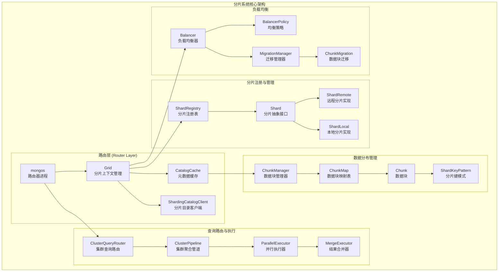
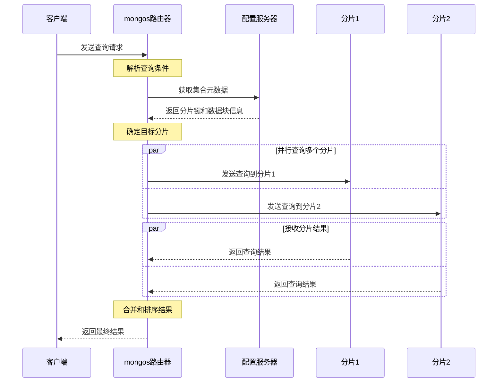

## 分片系统概述

MongoDB分片系统是一个复杂的分布式架构，旨在实现数据的水平扩展。它将数据分布在多个分片（shard）上，通过路由器（mongos）来协调客户端请求的路由和执行。分片系统的核心位于`src/mongo/s/`和相关的分片环境模块中。

## 分片架构核心组件



## 核心数据结构深度分析

### 1. Grid - 分片上下文管理器

Grid是分片系统的核心协调者，管理所有分片相关的全局资源和服务。

```cpp
/**

 * Grid - 分片系统全局上下文管理器

 *

 * 功能特点:
 * - 管理分片系统的所有全局资源
 * - 协调各个分片服务组件
 * - 提供统一的分片操作接口
 * - 支持mongos和mongod两种运行模式

 */
class Grid {
private:
    // 分片目录客户端，用于访问配置服务器
    std::unique_ptr<ShardingCatalogClient> _catalogClient;
    
    // 分片元数据缓存，缓存集合和分片信息
    std::unique_ptr<CatalogCache> _catalogCache;
    
    // 分片注册表，管理所有分片实例
    std::shared_ptr<ShardRegistry> _shardRegistry;
    
    // 集群游标管理器，处理跨分片查询游标
    std::unique_ptr<ClusterCursorManager> _cursorManager;
    
    // 负载均衡器配置
    std::unique_ptr<BalancerConfiguration> _balancerConfig;
    
    // 任务执行器池，用于并行执行分片操作
    std::unique_ptr<executor::TaskExecutorPool> _executorPool;
    
    // 网络接口
    executor::NetworkInterface* _network;
    
    // 初始化状态标记
    AtomicWord<bool> _shardingInitialized{false};
    
public:
    /**

     * 获取Grid实例
     * @param serviceContext 服务上下文
     * @return Grid指针
     */
    static Grid* get(ServiceContext* serviceContext) {
        return getGrid(serviceContext);
    }
    
    /**
     * 初始化分片系统
     * @param catalogClient 分片目录客户端
     * @param catalogCache 元数据缓存
     * @param shardRegistry 分片注册表
     * @param cursorManager 游标管理器
     * @param balancerConfig 负载均衡配置
     * @param executorPool 执行器池
     * @param network 网络接口
     */
    void init(std::unique_ptr<ShardingCatalogClient> catalogClient,
             std::unique_ptr<CatalogCache> catalogCache,
             std::shared_ptr<ShardRegistry> shardRegistry,
             std::unique_ptr<ClusterCursorManager> cursorManager,
             std::unique_ptr<BalancerConfiguration> balancerConfig,
             std::unique_ptr<executor::TaskExecutorPool> executorPool,
             executor::NetworkInterface* network) {
        
        invariant(!_shardingInitialized.load());
        
        _catalogClient = std::move(catalogClient);
        _catalogCache = std::move(catalogCache);
        _shardRegistry = std::move(shardRegistry);
        _cursorManager = std::move(cursorManager);
        _balancerConfig = std::move(balancerConfig);
        _executorPool = std::move(executorPool);
        _network = network;
        
        _shardingInitialized.store(true);
    }
    
    /**
     * 获取分片目录客户端
     * @return ShardingCatalogClient指针
     */
    ShardingCatalogClient* catalogClient() const {
        invariant(_shardingInitialized.load());
        invariant(_catalogClient);
        return _catalogClient.get();
    }
    
    /**
     * 获取分片注册表
     * @return ShardRegistry指针
     */
    ShardRegistry* shardRegistry() const {
        invariant(_shardingInitialized.load());
        invariant(_shardRegistry);
        return _shardRegistry.get();
    }
    
    /**
     * 获取元数据缓存
     * @return CatalogCache指针
     */
    CatalogCache* catalogCache() const {
        invariant(_shardingInitialized.load());
        invariant(_catalogCache);
        return _catalogCache.get();
    }
    
    /**
     * 获取集群游标管理器
     * @return ClusterCursorManager指针
     */
    ClusterCursorManager* getCursorManager() const {
        invariant(_shardingInitialized.load());
        return _cursorManager.get();
    }
    
    /**
     * 获取任务执行器
     * @param poolType 执行器池类型
     * @return TaskExecutor指针
     */
    executor::TaskExecutor* getExecutorPool() const {
        invariant(_shardingInitialized.load());
        return _executorPool.get();
    }
    
    /**
     * 检查分片系统是否已初始化
     * @return 如果已初始化返回true
     */
    bool isShardingInitialized() const {
        return _shardingInitialized.load();
    }

};
```

### 2. ShardRegistry - 分片注册表

ShardRegistry管理集群中所有分片的连接和状态信息。

```cpp
/**

 * ShardRegistry - 分片注册表和连接管理器

 *

 * 功能特点:
 * - 维护所有分片的连接信息
 * - 支持分片的动态添加和删除
 * - 提供分片发现和连接管理
 * - 实现分片状态监控和故障转移

 */
class ShardRegistry {
private:
    // 分片数据缓存，包含所有分片信息
    ReadThroughCache<ShardId, ShardRegistryData> _data;
    
    // 分片工厂，用于创建分片实例
    std::unique_ptr<ShardFactory> _shardFactory;
    
    // 任务执行器，用于分片通信
    executor::TaskExecutor* _executor;
    
    // 线程池，处理分片操作
    std::shared_ptr<ThreadPool> _threadPool;
    
    // 配置服务器分片
    std::shared_ptr<Shard> _configShard;
    
public:
    /**

     * 构造函数
     * @param shardFactory 分片工厂
     * @param configServerConnectionString 配置服务器连接串
     */
    ShardRegistry(std::unique_ptr<ShardFactory> shardFactory,
                 const ConnectionString& configServerConnectionString,
                 executor::TaskExecutor* executor);
    
    /**
     * 获取指定ID的分片
     * @param opCtx 操作上下文
     * @param shardId 分片ID
     * @return 分片指针，如果不存在则返回nullptr
     */
    std::shared_ptr<Shard> getShardNoReload(OperationContext* opCtx,
                                           const ShardId& shardId) {
        auto shardData = _data.acquire(opCtx, shardId);
        return shardData->findByShardId(shardId);
    }
    
    /**
     * 获取所有分片
     * @param opCtx 操作上下文
     * @return 分片向量
     */
    std::vector<std::shared_ptr<Shard>> getAllShards(OperationContext* opCtx) {
        auto shardData = _data.acquire(opCtx, kAllShardsKey);
        return shardData->getAllShards();
    }
    
    /**
     * 重新加载分片注册信息
     * @param opCtx 操作上下文
     * @return 重新加载结果状态
     */
    Status reload(OperationContext* opCtx) {
        try {
            _data.invalidate(kAllShardsKey);
            return Status::OK();
        } catch (const DBException& ex) {
            return ex.toStatus();
        }
    }
    
    /**
     * 添加新分片
     * @param opCtx 操作上下文
     * @param shardType 分片类型配置
     * @return 新分片的名称和连接信息
     */
    StatusWith<std::string> addShard(OperationContext* opCtx,
                                    const ShardType& shardType) {
        // 1. 验证分片配置
        if (shardType.getName().empty()) {
            return Status(ErrorCodes::BadValue, "分片名称不能为空");
        }
        
        // 2. 检查分片是否已存在
        auto existingShard = getShardNoReload(opCtx, shardType.getName());
        if (existingShard) {
            return Status(ErrorCodes::DuplicateKey, "分片已存在");
        }
        
        // 3. 创建分片实例
        auto newShard = _shardFactory->createShard(shardType.getName(),
                                                  shardType.getHost());
        if (!newShard.isOK()) {
            return newShard.getStatus();
        }
        
        // 4. 测试连接
        auto pingResult = newShard.getValue()->runCommand(
            opCtx, ReadPreferenceSetting{ReadPreference::PrimaryOnly},
            "admin", BSON("ping" << 1), Shard::RetryPolicy::kIdempotent);
        
        if (!pingResult.isOK()) {
            return Status(ErrorCodes::OperationFailed, "无法连接到分片");
        }
        
        // 5. 保存到配置数据库
        Status insertStatus = catalogClient(opCtx)->insertConfigDocument(
            opCtx, ShardType::ConfigNS, shardType.toBSON(),
            ShardingCatalogClient::kMajorityWriteConcern);
        
        if (!insertStatus.isOK()) {
            return insertStatus;
        }
        
        // 6. 刷新缓存
        reload(opCtx);
        
        return shardType.getName();
    }
    
    /**
     * 移除分片
     * @param opCtx 操作上下文
     * @param shardId 要移除的分片ID
     * @return 移除操作状态
     */
    Status removeShard(OperationContext* opCtx, const ShardId& shardId) {
        // 1. 检查分片是否存在
        auto shard = getShardNoReload(opCtx, shardId);
        if (!shard) {
            return Status(ErrorCodes::ShardNotFound, "分片不存在");
        }
        
        // 2. 检查是否还有数据在该分片上
        auto collections = getAllCollectionsForShard(opCtx, shardId);
        if (!collections.empty()) {
            return Status(ErrorCodes::IllegalOperation,
                         "分片上仍有数据，无法移除");
        }
        
        // 3. 从配置数据库删除
        Status deleteStatus = catalogClient(opCtx)->removeConfigDocuments(
            opCtx, ShardType::ConfigNS,
            BSON(ShardType::name() << shardId.toString()),
            ShardingCatalogClient::kMajorityWriteConcern);
        
        if (!deleteStatus.isOK()) {
            return deleteStatus;
        }
        
        // 4. 刷新缓存
        reload(opCtx);
        
        return Status::OK();
    }

};
```

### 3. ChunkManager - 数据块管理器

ChunkManager管理集合的数据分布信息，包括分片键和数据块的映射关系。

```cpp
/**

 * ChunkManager - 数据块管理器

 *

 * 功能特点:
 * - 管理集合的分片键和数据块信息
 * - 提供数据路由和定位功能
 * - 支持数据块的分割和合并
 * - 实现查询范围的分片映射

 */
class ChunkManager {
private:
    // 集合命名空间
    NamespaceString _nss;
    
    // 分片键模式
    ShardKeyPattern _shardKeyPattern;
    
    // 默认排序规则
    std::unique_ptr<CollatorInterface> _defaultCollator;
    
    // 数据块映射表
    ChunkMap _chunkMap;
    
    // 分片版本信息
    ShardPlacementVersionMap _shardVersions;
    
    // 集合版本
    ChunkVersion _version;
    
public:
    /**

     * 构造函数
     * @param nss 集合命名空间
     * @param epoch 集合纪元
     * @param timestamp 时间戳
     * @param shardKeyPattern 分片键模式
     * @param defaultCollator 默认排序器
     */
    ChunkManager(NamespaceString nss,
                const OID& epoch,
                const Timestamp& timestamp,
                const ShardKeyPattern& shardKeyPattern,
                std::unique_ptr<CollatorInterface> defaultCollator);
    
    /**
     * 根据分片键值查找数据块
     * @param shardKey 分片键值
     * @return 包含该分片键的数据块
     */
    const Chunk& findIntersectingChunk(const BSONObj& shardKey) const {
        return _chunkMap.findIntersectingChunk(shardKey);
    }
    
    /**
     * 获取查询涉及的所有分片
     * @param query 查询条件
     * @return 涉及的分片集合
     */
    std::set<ShardId> getShardIdsForQuery(const BSONObj& query) const {
        std::set<ShardId> shardIds;
        
        // 1. 从查询条件中提取分片键相关条件
        auto shardKeyQuery = extractShardKeyFromQuery(_shardKeyPattern, query);
        
        if (shardKeyQuery.isEmpty()) {
            // 2. 无法确定分片键，需要查询所有分片
            for (const auto& chunk : _chunkMap.chunks()) {
                shardIds.insert(chunk.getShardId());
            }
        } else {
            // 3. 根据分片键条件查找相关数据块
            auto chunks = _chunkMap.findIntersectingChunks(shardKeyQuery);
            for (const auto& chunk : chunks) {
                shardIds.insert(chunk.getShardId());
            }
        }
        
        return shardIds;
    }
    
    /**
     * 获取指定分片的版本信息
     * @param shardId 分片ID
     * @return 分片版本
     */
    ChunkVersion getVersion(const ShardId& shardId) const {
        auto it = _shardVersions.find(shardId);
        if (it != _shardVersions.end()) {
            return it->second.placementVersion;
        }
        return ChunkVersion::UNSHARDED();
    }
    
    /**
     * 分割数据块
     * @param opCtx 操作上下文
     * @param chunkToSplit 要分割的数据块
     * @param splitKeys 分割点
     * @return 分割操作状态
     */
    Status splitChunk(OperationContext* opCtx,
                     const Chunk& chunkToSplit,
                     const std::vector<BSONObj>& splitKeys) {
        
        // 1. 验证分割点
        for (const auto& splitKey : splitKeys) {
            if (!isValidShardKey(splitKey)) {
                return Status(ErrorCodes::InvalidOptions, "无效的分割点");
            }
            
            if (!chunkToSplit.containsKey(splitKey)) {
                return Status(ErrorCodes::InvalidOptions, "分割点不在数据块范围内");
            }
        }
        
        // 2. 创建新的数据块
        std::vector<ChunkType> newChunks;
        BSONObj currentMin = chunkToSplit.getMin();
        
        for (const auto& splitKey : splitKeys) {
            ChunkType newChunk;
            newChunk.setNS(_nss);
            newChunk.setMin(currentMin);
            newChunk.setMax(splitKey);
            newChunk.setShard(chunkToSplit.getShardId());
            newChunk.setVersion(_version);
            
            newChunks.push_back(newChunk);
            currentMin = splitKey;
        }
        
        // 3. 创建最后一个数据块
        ChunkType lastChunk;
        lastChunk.setNS(_nss);
        lastChunk.setMin(currentMin);
        lastChunk.setMax(chunkToSplit.getMax());
        lastChunk.setShard(chunkToSplit.getShardId());
        lastChunk.setVersion(_version);
        newChunks.push_back(lastChunk);
        
        // 4. 更新配置数据库
        return updateConfigForChunkSplit(opCtx, chunkToSplit, newChunks);
    }
    
    /**
     * 移动数据块到另一个分片
     * @param opCtx 操作上下文
     * @param chunk 要移动的数据块
     * @param toShard 目标分片
     * @return 移动操作状态
     */
    Status moveChunk(OperationContext* opCtx,
                    const Chunk& chunk,
                    const ShardId& toShard) {
        
        // 1. 验证目标分片
        auto targetShard = Grid::get(opCtx)->shardRegistry()->getShard(opCtx, toShard);
        if (!targetShard.isOK()) {
            return Status(ErrorCodes::ShardNotFound, "目标分片不存在");
        }
        
        // 2. 检查数据块是否已在目标分片上
        if (chunk.getShardId() == toShard) {
            return Status::OK(); // 已经在目标分片，无需移动
        }
        
        // 3. 启动数据块迁移
        MigrationRequest migrationRequest;
        migrationRequest.setNss(_nss);
        migrationRequest.setFromShard(chunk.getShardId());
        migrationRequest.setToShard(toShard);
        migrationRequest.setMin(chunk.getMin());
        migrationRequest.setMax(chunk.getMax());
        
        auto migrationManager = Grid::get(opCtx)->getMigrationManager();
        return migrationManager->executeMigration(opCtx, migrationRequest);
    }
    
    /**
     * 获取集合统计信息
     * @return 统计信息BSON对象
     */
    BSONObj getStats() const {
        BSONObjBuilder builder;
        
        // 基本信息
        builder.append("ns", _nss.toString());
        builder.append("shardKeyPattern", _shardKeyPattern.toBSON());
        builder.append("version", _version.toString());
        
        // 数据块统计
        builder.append("chunkCount", static_cast<long long>(_chunkMap.size()));
        
        // 分片分布统计
        std::map<ShardId, int> shardChunkCounts;
        for (const auto& chunk : _chunkMap.chunks()) {
            shardChunkCounts[chunk.getShardId()]++;
        }
        
        BSONObjBuilder shardStats;
        for (const auto& entry : shardChunkCounts) {
            shardStats.append(entry.first.toString(), entry.second);
        }
        builder.append("shardDistribution", shardStats.obj());
        
        return builder.obj();
    }

};
```

## 查询路由机制

MongoDB分片系统通过查询路由器将客户端请求分发到相应的分片：



### 查询路由核心实现

```cpp
/**

 * ClusterQueryRouter - 集群查询路由器

 *

 * 负责将客户端查询路由到正确的分片并合并结果

 */
class ClusterQueryRouter {
public:
    /**

     * 执行分片查询
     * @param opCtx 操作上下文
     * @param request 查询请求
     * @return 查询结果游标
     */
    StatusWith<std::unique_ptr<ClusterClientCursor>>
    execute(OperationContext* opCtx, const ClusterFindRequest& request) {
        
        // 1. 获取集合的分片信息
        auto routingInfo = getCollectionRoutingInfo(opCtx, request.nss);
        if (!routingInfo.isOK()) {
            return routingInfo.getStatus();
        }
        
        auto chunkManager = routingInfo.getValue();
        
        // 2. 根据查询条件确定目标分片
        auto targetShards = chunkManager->getShardIdsForQuery(request.filter);
        
        // 3. 为每个目标分片创建子查询
        std::vector<AsyncRequestsSender::Request> requests;
        for (const auto& shardId : targetShards) {
            // 构造发送给分片的查询请求
            BSONObjBuilder cmdBuilder;
            cmdBuilder.append("find", request.nss.coll());
            cmdBuilder.append("filter", request.filter);
            
            if (!request.sort.isEmpty()) {
                cmdBuilder.append("sort", request.sort);
            }
            
            if (request.limit) {
                cmdBuilder.append("limit", *request.limit);
            }
            
            // 添加分片版本信息
            auto shardVersion = chunkManager->getVersion(shardId);
            BSONObjBuilder versionBuilder;
            shardVersion.appendToCommand(&versionBuilder);
            cmdBuilder.append("shardVersion", versionBuilder.obj());
            
            requests.emplace_back(shardId, cmdBuilder.obj());
        }
        
        // 4. 并行发送查询到各个分片
        AsyncRequestsSender requestSender(opCtx,
                                         Grid::get(opCtx)->getExecutorPool(),
                                         request.nss.db().toString(),
                                         std::move(requests),
                                         ReadPreferenceSetting::get(opCtx));
        
        // 5. 收集并合并结果
        std::vector<ClusterClientCursor::RemoteCursor> remoteCursors;
        
        while (!requestSender.done()) {
            auto response = requestSender.next();
            
            if (!response.swResponse.isOK()) {
                return response.swResponse.getStatus();
            }
            
            auto cursorResponse = CursorResponse::parseFromBSON(
                response.swResponse.getValue().data);
            if (!cursorResponse.isOK()) {
                return cursorResponse.getStatus();
            }
            
            // 创建远程游标
            remoteCursors.emplace_back(response.shardId,
                                     cursorResponse.getValue().getCursorId(),
                                     cursorResponse.getValue().getBatch());
        }
        
        // 6. 创建集群游标进行结果合并
        return ClusterClientCursor::make(opCtx,
                                       Grid::get(opCtx)->getCursorManager(),
                                       std::move(remoteCursors),
                                       request.sort);
    }
    

private:
    /**

     * 获取集合路由信息
     * @param opCtx 操作上下文
     * @param nss 集合命名空间
     * @return 路由信息
     */
    StatusWith<std::shared_ptr<ChunkManager>>
    getCollectionRoutingInfo(OperationContext* opCtx,
                           const NamespaceString& nss) {
        
        auto catalogCache = Grid::get(opCtx)->catalogCache();
        return catalogCache->getCollectionRoutingInfo(opCtx, nss);
    }

};
```

## 负载均衡机制

MongoDB的负载均衡器自动监控和调整数据分布：

```cpp
/**

 * Balancer - 负载均衡器

 *

 * 功能特点:
 * - 自动监控分片间的数据分布
 * - 执行数据块迁移以平衡负载
 * - 支持均衡策略配置
 * - 提供均衡操作的暂停和恢复

 */
class Balancer {
private:
    // 均衡策略
    std::unique_ptr<BalancerPolicy> _policy;
    
    // 迁移管理器
    std::unique_ptr<MigrationManager> _migrationManager;
    
    // 均衡器状态
    AtomicWord<bool> _enabled{true};
    AtomicWord<bool> _inBalancerRound{false};
    
public:
    /**

     * 执行一轮负载均衡
     * @param opCtx 操作上下文
     * @return 均衡操作结果
     */
    Status doBalance(OperationContext* opCtx) {
        if (!_enabled.load()) {
            return Status::OK(); // 均衡器已禁用
        }
        
        _inBalancerRound.store(true);
        ScopeGuard roundGuard([this] { _inBalancerRound.store(false); });
        
        try {
            // 1. 获取所有分片集合
            auto collections = getAllShardedCollections(opCtx);
            
            for (const auto& collection : collections) {
                // 2. 检查集合是否需要均衡
                if (!shouldBalance(opCtx, collection)) {
                    continue;
                }
                
                // 3. 获取集合的数据块分布
                auto chunkManager = getChunkManager(opCtx, collection);
                auto shardStats = getShardStats(opCtx);
                
                // 4. 计算迁移建议
                auto migrations = _policy->balance(chunkManager, shardStats);
                
                // 5. 执行迁移
                for (const auto& migration : migrations) {
                    Status migrationResult = _migrationManager->executeMigration(
                        opCtx, migration);
                    
                    if (!migrationResult.isOK()) {
                        LOGV2_WARNING(1001, "数据块迁移失败",
                                    "migration"_attr = migration.toString(),
                                    "error"_attr = migrationResult);
                    }
                }
            }
            
            return Status::OK();
            
        } catch (const DBException& ex) {
            return ex.toStatus();
        }
    }
    
    /**
     * 检查集合是否需要均衡
     * @param opCtx 操作上下文
     * @param nss 集合命名空间
     * @return 是否需要均衡
     */
    bool shouldBalance(OperationContext* opCtx, const NamespaceString& nss) {
        // 1. 检查集合是否禁用了均衡
        auto balancerSettings = getBalancerSettings(opCtx, nss);
        if (!balancerSettings.enabled) {
            return false;
        }
        
        // 2. 检查时间窗口限制
        if (!isInBalancingWindow()) {
            return false;
        }
        
        // 3. 检查数据块分布是否不均衡
        auto chunkManager = getChunkManager(opCtx, nss);
        return _policy->isBalanced(chunkManager);
    }

};

/**

 * BalancerPolicy - 负载均衡策略

 *

 * 实现具体的均衡算法和迁移决策

 */
class BalancerPolicy {
public:
    /**

     * 计算均衡迁移方案
     * @param chunkManager 数据块管理器
     * @param shardStats 分片统计信息
     * @return 迁移操作列表
     */
    std::vector<MigrationRequest>
    balance(const ChunkManager& chunkManager,
           const std::vector<ShardStatistics>& shardStats) {
        
        std::vector<MigrationRequest> migrations;
        
        // 1. 计算每个分片的数据块数量
        std::map<ShardId, int> shardChunkCounts;
        for (const auto& chunk : chunkManager.chunks()) {
            shardChunkCounts[chunk.getShardId()]++;
        }
        
        // 2. 找出最繁忙和最空闲的分片
        ShardId heaviestShard, lightestShard;
        int maxChunks = 0, minChunks = INT_MAX;
        
        for (const auto& entry : shardChunkCounts) {
            if (entry.second > maxChunks) {
                maxChunks = entry.second;
                heaviestShard = entry.first;
            }
            if (entry.second < minChunks) {
                minChunks = entry.second;
                lightestShard = entry.first;
            }
        }
        
        // 3. 计算不平衡度
        int imbalance = maxChunks - minChunks;
        int threshold = calculateImbalanceThreshold(shardStats.size());
        
        // 4. 如果不平衡超过阈值，生成迁移计划
        if (imbalance > threshold) {
            int chunksToMove = (imbalance - threshold) / 2;
            
            // 选择要迁移的数据块
            auto chunksToMigrate = selectChunksToMigrate(
                chunkManager, heaviestShard, chunksToMove);
            
            for (const auto& chunk : chunksToMigrate) {
                MigrationRequest migration;
                migration.setNss(chunkManager.getns());
                migration.setFromShard(heaviestShard);
                migration.setToShard(lightestShard);
                migration.setMin(chunk.getMin());
                migration.setMax(chunk.getMax());
                
                migrations.push_back(migration);
            }
        }
        
        return migrations;
    }
    

private:
    /**

     * 计算不平衡阈值
     * @param numShards 分片数量
     * @return 不平衡阈值
     */
    int calculateImbalanceThreshold(int numShards) {
        // 分片数量越多，阈值越高
        return std::max(1, numShards / 5);
    }

};
```

## 实战案例与最佳实践

### 案例1: 分片集合设计

```javascript
// 1. 选择合适的分片键
// 好的分片键应该具备：高基数、低频率、非单调性

// 不好的分片键示例（单调递增）
db.orders.createIndex({createdAt: 1})
sh.shardCollection("myapp.orders", {createdAt: 1})  // 避免使用

// 更好的分片键设计（复合分片键）
db.orders.createIndex({customerId: 1, createdAt: 1})
sh.shardCollection("myapp.orders", {customerId: 1, createdAt: 1})

// 2. 预分片以避免热点
// 为新集合预先创建分片
for (let i = 0; i < 10; i++) {
    db.adminCommand({
        split: "myapp.orders",
        middle: {customerId: i * 1000, createdAt: ISODate()}
    })
}
```

### 案例2: 查询优化

```javascript
// 1. 利用分片键进行查询（目标查询）
db.orders.find({customerId: 12345})  // 只查询一个分片

// 2. 避免全分片查询
db.orders.find({status: "pending"})  // 需要查询所有分片

// 3. 使用复合查询条件
db.orders.find({
    customerId: 12345,     // 分片键，可以路由到特定分片
    status: "pending"      // 附加条件
})

// 4. 聚合操作优化
db.orders.aggregate([
    {$match: {customerId: 12345}},      // 先过滤，减少数据传输
    {$group: {_id: "$status", count: {$sum: 1}}}
])
```

### 案例3: 负载均衡配置

```javascript
// 1. 启用/禁用负载均衡
sh.setBalancerState(true)   // 启用
sh.setBalancerState(false)  // 禁用

// 2. 设置均衡窗口
sh.addBalancerWindow(2, 6)  // 只在凌晨2点到6点进行均衡

// 3. 为特定集合禁用均衡
sh.disableBalancing("myapp.orders")

// 4. 手动移动数据块
sh.moveChunk("myapp.orders",
            {customerId: 1000},
            "shard0001")

// 5. 分割数据块
sh.splitAt("myapp.orders", {customerId: 5000})
```

## 监控和故障排查

### 分片状态监控

```javascript
// 1. 查看分片状态
sh.status()

// 2. 查看均衡器状态
sh.isBalancerRunning()
sh.getBalancerState()

// 3. 查看数据分布
db.stats()
db.printShardingStatus()

// 4. 监控迁移操作
db.adminCommand("isdbgrid")
db.currentOp({
    "command.moveChunk": {$exists: true}
})

// 5. 查看分片统计
db.runCommand({shardConnPoolStats: 1})
```

### 性能调优建议

1. **分片键选择**
   - 选择高基数的分片键
   - 避免单调递增的分片键
   - 考虑查询模式和写入模式

2. **预分片策略**
   - 对于预期数据量大的集合进行预分片
   - 避免初始数据块过大导致的分割开销

3. **读写分离**
   - 利用副本集的secondary进行读操作
   - 配置合适的读偏好设置

4. **连接池优化**
   - 调整mongos的连接池大小
   - 监控连接池使用情况

5. **网络优化**
   - 确保分片间网络延迟较低
   - 使用高带宽网络连接

## 小结

MongoDB分片系统通过精心设计的架构实现了数据的水平扩展，其核心组件包括：

- **Grid**: 分片系统的全局协调者
- **ShardRegistry**: 管理所有分片连接和状态  
- **ChunkManager**: 管理数据分布和路由信息
- **Balancer**: 自动负载均衡机制

理解这些核心组件的工作原理对于设计高性能的分片应用至关重要。下一章节我们将深入分析BSON数据格式的实现细节。
