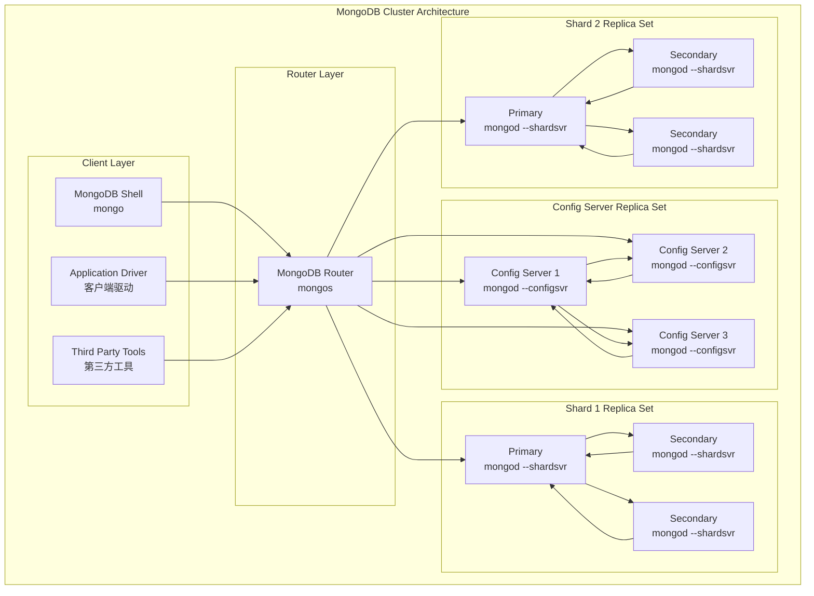
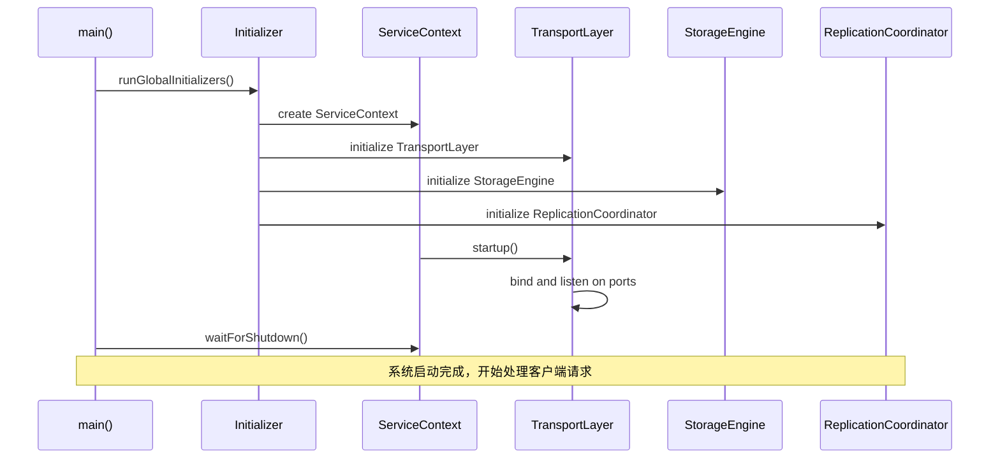
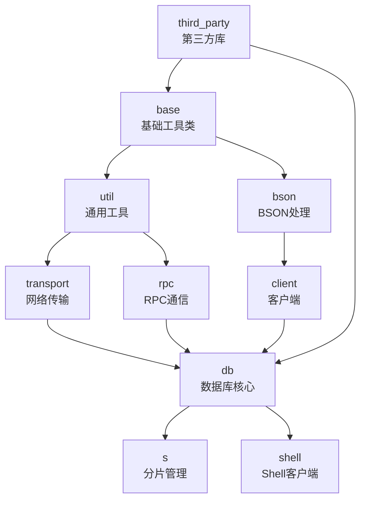

## 项目概述

MongoDB是一个基于分布式文档存储的NoSQL数据库系统，采用C++语言开发。本文档将深入剖析MongoDB的源码架构，帮助开发者从浅入深地理解这个复杂的分布式数据库系统。

## 目录结构

```
MongoDB Project Structure
├── src/mongo/                    # 核心源代码目录
│   ├── base/                    # 基础工具类和数据结构
│   ├── bson/                    # BSON数据格式处理模块
│   ├── client/                  # 客户端连接和通信模块
│   ├── db/                      # 数据库核心功能模块
│   ├── s/                       # 分片（Sharding）相关模块
│   ├── transport/               # 网络传输层模块
│   ├── rpc/                     # RPC通信模块
│   ├── util/                    # 通用工具库
│   └── shell/                   # MongoDB Shell客户端
├── buildscripts/                # 构建脚本
├── jstests/                     # JavaScript测试用例
├── docs/                        # 项目文档
└── third_party/                 # 第三方依赖库
```

## 核心组件架构

MongoDB系统主要由以下三个核心组件构成：

### 1. MongoDB Server (mongod)
- **主入口**: `src/mongo/db/mongod.cpp` → `mongod_main()`
- **功能**: 数据库服务器守护进程，负责数据存储、查询处理、索引管理等核心功能
- **核心模块**: 存储引擎、查询执行器、复制系统、索引系统

### 2. MongoDB Router (mongos)  
- **主入口**: `src/mongo/s/mongos.cpp` → `mongos_main()`
- **功能**: 分片集群路由器，负责查询路由、数据分片、负载均衡
- **核心模块**: 分片管理、查询路由、集群配置管理

### 3. MongoDB Shell (mongo)
- **主入口**: `src/mongo/shell/mongo.cpp` → `mongo_main()`
- **功能**: 交互式JavaScript shell客户端
- **核心模块**: JavaScript引擎、命令解析、客户端通信

## 系统整体架构图



**架构说明**：
- **客户端层**: 包括MongoDB Shell、各种语言的驱动程序和第三方工具
- **路由层**: mongos进程负责接收客户端请求并路由到正确的分片
- **配置服务器**: 存储集群元数据和分片配置信息的副本集
- **分片**: 实际存储数据的mongod实例组成的副本集

## 启动流程时序图



**时序说明**：
1. **全局初始化**: 运行各种初始化器，设置系统全局状态
2. **服务上下文创建**: 创建管理各种服务的上下文对象
3. **传输层初始化**: 设置网络监听和连接管理
4. **存储引擎初始化**: 启动底层存储系统（WiredTiger等）
5. **复制协调器初始化**: 设置副本集相关功能
6. **等待关闭**: 进入主循环，处理客户端请求直到收到关闭信号

## 模块依赖关系图



**依赖说明**：
- **base**: 提供错误处理、状态码、字符串处理等基础功能
- **util**: 提供线程、网络、时间等系统工具
- **bson**: 处理MongoDB的二进制JSON格式
- **transport**: 网络传输层抽象
- **rpc**: 远程过程调用机制
- **client**: 客户端连接管理
- **db**: 数据库核心功能
- **s**: 分片集群管理
- **shell**: 交互式客户端

## 核心数据结构概览

### BSONObj - BSON对象
```cpp
/**
 * BSONObj是MongoDB中最核心的数据结构，表示一个BSON文档
 * 特点：
 * - 不可变对象（immutable）
 * - 内存紧凑存储
 * - 支持快速随机访问
 */
class BSONObj {
private:
    const char* _objdata;  // 指向BSON二进制数据的指针
    // ... 其他成员
public:
    BSONElement getField(StringData name) const;  // 获取字段
    bool hasField(StringData name) const;         // 检查字段是否存在
    // ... 其他方法
};
```

### OperationContext - 操作上下文
```cpp
/**
 * OperationContext包含执行数据库操作所需的所有上下文信息
 * 包括：事务状态、锁状态、客户端信息、超时设置等
 */
class OperationContext {
private:
    ServiceContext* _service;      // 服务上下文
    LogicalSessionId _lsid;       // 逻辑会话ID
    TxnNumber _txnNumber;         // 事务编号
    // ... 其他成员
public:
    Locker* lockState() const;         // 获取锁状态
    RecoveryUnit* recoveryUnit() const; // 获取恢复单元
    // ... 其他方法
};
```

## 主要API入口点

### 数据库操作API
```cpp
// 插入文档
Status insertDocument(OperationContext* opCtx, 
                     const NamespaceString& ns,
                     const BSONObj& doc);

// 查找文档
StatusWith<BSONObj> findDocument(OperationContext* opCtx,
                                const NamespaceString& ns, 
                                const BSONObj& query);

// 更新文档
Status updateDocument(OperationContext* opCtx,
                     const NamespaceString& ns,
                     const BSONObj& query,
                     const BSONObj& update);

// 删除文档
Status deleteDocument(OperationContext* opCtx,
                     const NamespaceString& ns,
                     const BSONObj& query);
```

### 分片管理API
```cpp
// 分片集合
Status shardCollection(OperationContext* opCtx,
                      const NamespaceString& ns,
                      const BSONObj& shardKey);

// 移动分片数据块
Status moveChunk(OperationContext* opCtx,
                const ChunkRange& range,
                const ShardId& toShard);
```

## 性能特性

### 内存管理
- **内存池**: 使用自定义内存分配器减少内存碎片
- **缓存机制**: 多级缓存提升查询性能
- **写时复制**: BSON对象采用写时复制策略

### 并发控制
- **多粒度锁**: 支持全局、数据库、集合、文档级别的锁
- **意向锁**: 使用意向锁提升并发性能
- **无锁数据结构**: 关键路径采用无锁算法

### 存储优化
- **列式存储**: WiredTiger存储引擎支持列式压缩
- **索引优化**: B+树索引支持多种数据类型
- **日志优化**: Write-Ahead Logging确保数据持久性

## 扩展性设计

### 水平扩展
- **自动分片**: 根据数据量自动分割和迁移数据块
- **负载均衡**: 自动在分片间平衡数据分布
- **弹性扩缩容**: 支持在线添加和删除分片

### 高可用性
- **副本集**: 自动故障转移和数据冗余
- **读取偏好**: 支持从副本读取分散负载
- **心跳机制**: 实时监控节点健康状态

## 下一步深入分析

本总览篇为您介绍了MongoDB的整体架构和核心概念。接下来我们将深入分析各个模块：

1. [数据库核心模块详解](MongoDB源码剖析-数据库核心模块.md)
2. [分片系统详解](MongoDB源码剖析-分片系统.md)  
3. [BSON数据格式详解](MongoDB源码剖析-BSON模块.md)
4. [网络传输层详解](MongoDB源码剖析-传输层.md)
5. [客户端模块详解](MongoDB源码剖析-客户端模块.md)

每个模块都将包含详细的源码分析、架构图表、时序图和实际应用案例。
